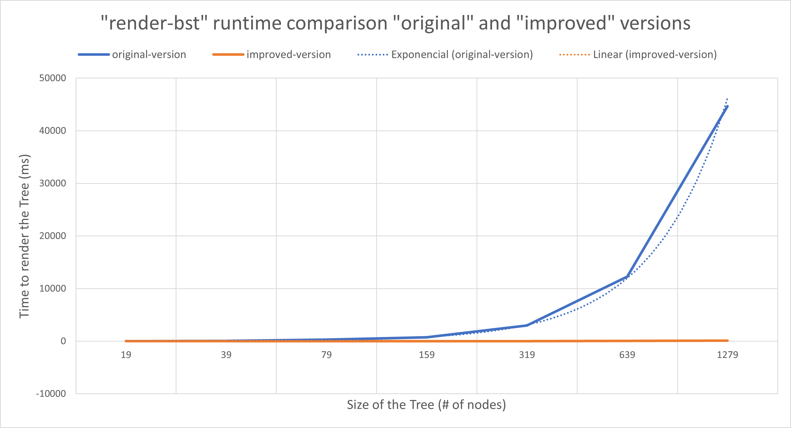

# 0: Introduction

## Syllabus

The complete How to Code course consists of 2 parts. Each part is 6 
weeks long, and each week consists of 1 or 2 modules. All of those 
modules have a similar structure, comprised of:

- An overview describing the module learning goals and summarizing the work required to complete the module.
- A number of blended topic lectures, consisting of video interspersed with questions for you to answer.
- A set of problems that will let you practice the new design techniques before the quiz.
- A module quiz. The module quiz is either a set of questions on the week's material, or a self-assessed design problem.
- A module wrap up.

## Grading

$$
Lecture Questions (25\%) + Quizzes (25\%) + Final Project (50\%) = Final Grade (100\%)
$$

# 7: Mutual Reference

## Module Overview

Learning Goals:

- Be able to identify problem domain information of arbitrary size that should be represented using arbitrary arity trees.
- Be able to use the design recipes to design with arbitrary arity trees.
- Be able to use the design recipes with mutually-referential data.
- Be able to predict and identify the correspondence between
external-, self- and mutual-reference in a data definition and calls,
recursion and mutual-recursion in functions that operate on the data.

## Mutually Recursive Data

[mutuallyRecursiveData.rkt](https://github.com/squxq/How-to-Code-Complex-Data/blob/week-07/modules/week-07/mutuallyRecursiveData/mutuallyRecursiveData.rkt)

[mutuallyRecursiveData.png](https://github.com/squxq/How-to-Code-Complex-Data/blob/week-07/modules/week-07/mutuallyRecursiveData/mutuallyRecursiveData.png)

We are going to look at another form of data called an arbitrary arity tree. This data form is characterized by two cycles in the type comments. Computer scientists draw trees upside down.

We need to develop one or more data definitions that help us represent an information structure like a directory structure. A single integer is all each file holds. This is an arbitrary arity tree:


Each element of this tree, or this model of an arbitrary arity tree, can have sub-elements. “mooc” has a subfolder; “current” has a number of subfolders; “starters” has a number of subfolders; but “aisle-starter” just has data.

Why is it called arbitrary arity? Unlike lists, which were arbitrarily long or wide in one dimension. This arbitrary arity tree is arbitrarily sized in two dimensions: arbitrarily wide and arbitrarily deep. Arbitrary means unknown.

In order to deal with this arbitrary-sized in two dimensions structure that this has the key thing that we’re about to see is that it’s going to require two cycles in the type reference graph.

```racket
(define-struct elt (name data subs))
;; Element is (make-elt String Integer ListOfElement)
;; interp. An element in the file system, with name, and EITHER data or subs.
;;         If data is 0, then subs is considered to be list of sub elements.
;;         If data is not 0, then subs is ignored.

;; ListOfElement is one of:
;;  - empty
;;  - (cons Element ListOfElement)
;; interp. A list of file system Elements

;; Examples: <Element>
(define F1 (make-elt "F1" 1 empty))
(define F2 (make-elt "F2" 2 empty))
(define F3 (make-elt "F3" 3 empty))

;; Examples: <ListOfElement>
(define D4 (make-elt "D4" 0 (list F1 F2)))
(define D5 (make-elt "D5" 0 (list F3)))
(define D6 (make-elt "D6" 0 (list D4 D5)))
```

“ListOfElement” has a self-reference in it - that’s what allows a directory’s list of sub-elements to be arbitrarily long. In addition to that self-reference, there is a reference in the middle of “ListOfElement” back to the “Element” type. There is also a reference from the “Element” type down to “ListOfElement”. Those two references together form what’s called a mutual reference.

The self-reference cycle allows each element to have an arbitrary amount of sub-elements, that is, allows the tree to have arbitrary breadth. The mutual reference cycle allows the tree to have arbitrary depth.

## Templating Mutual Recursion

[templatingMutualRecursion.rkt](https://github.com/squxq/How-to-Code-Complex-Data/blob/week-07/modules/week-07/templatingMutualRecursion/templatingMutualRecursion.rkt)

When dealing with types involving mutual reference, group types comments and interpretations, examples and templates. That will help see the mutual recursion structure in the templates corresponding to the mutual reference structure in the types.

Where there is a self-reference there is a natural recursion. Where there is a mutual reference cycle there is a natural mutual recursion.

```racket
;; Note:
; When dealing with types involding mutual reference, group types commments and interpretations,
; examples and templates together.
;; End of Note.

;; Template: <Element>
(define (fn-for-element e)
  (... (elt-name e)                ; String
       (elt-date e)                ; Integer
       (fn-for-loe (elt-subs e)))) ; ListOfElement

;; Template rules used: <Element>
;; - compound: 3 fields
;; - reference: (elt-subs e) is ListOfElement

;; Template: <ListOfElement>
(define (fn-for-loe loe)
  (cond [(empty? loe) (...)]
        [else
         (... (fn-for-element (first loe))
              (fn-for-loe (rest loe)))]))

;; Template rules used: <ListOfElement>
;; - one of: 2 cases
;; - atomic distinct: empty
;; - compound: (cons Element ListOfElement)
;; - reference: (first loe) is Element
;; - self-reference: (rest loe) is ListOfElement

;; Note:
; Only use fn-for-something when there is a reference to another data type.
;; End  of Note.
```

## Functions on Mutually Recursive Data - Part 1

[functionsMutuallyRecursiveData.no-image.rkt](https://github.com/squxq/How-to-Code-Complex-Data/blob/week-07/modules/week-07/functionsMutuallyRecursiveData-01/functionsMutuallyRecursiveData.no-image.rkt)

> Design a function that consumes Element and produces the sum of all the file data in
the tree.
> 

With mutual recursion: do all the functions together.

```racket
;; Signature: <Element>
;; Element -> Integer

;; Signature: <ListOfElement>
;; ListOfElement -> Integer???
```

“???” means we’re not sure of the output of “fn-for-loe” - we will come back to it later.

```racket
;; Stub: <Element>
(define (sum-data--element e) 0)

;; Stub: <ListOfElement>
(define (sum-data--loe loe) 0)
```

We use function names ending in “—element” and “—loe” to have unique names for both functions. Both functions are named “sum-data” because they’re mutually recursive and require each other to work together correctly.

```racket
;; Tests: <Element>
(check-expect (sum-data--element F1) 1)
(check-expect (sum-data--element D5) 3)
(check-expect (sum-data--element D4) (+ 1 2))
(check-expect (sum-data--element D6) (+ 1 2 3))

;; Tests: <ListOfElement>
(check-expect (sum-data--loe empty) 0)
```

When coding mutually recursive functions, remember to rename all mutually recursive and self recursive calls.

```racket
;; Template: <used template from Element>
(define (sum-data--element e)
  (if (zero? (elt-data e))
       (sum-data--loe (elt-subs e))
       (elt-data e)))

;; Template: <used template from ListOfElement>
(define (sum-data--loe loe)
  (cond [(empty? loe) 0]
        [else
         (+ (sum-data--element (first loe))
              (sum-data--loe (rest loe)))]))
```

For mutually recursive functions, it’s usually the case that all the functions produce the same type of data. But there are some exceptions of that rule.

The way method works by being data-driven, in terms of getting well-formed, self and mutually referential type comments, to the templates, coding those to complete the functions, and trusting the natural recursions.

The key point is that when I design functions operating on mutually referential types, I don’t design a single function, but one for each type. And so it pays to group the signatures together, to write a single purpose, to group the examples and then group the functions.

### Question 1: Problem 1

[problem-01.no-image.rkt](https://github.com/squxq/How-to-Code-Complex-Data/blob/week-07/modules/week-07/functionsMutuallyRecursiveData-01/problem-01.no-image.rkt)

> Design a function that consumes Element and produces a list of the names of all the elements in the tree.
> 

```racket
;; ListOfString is one of:
;; - empty
;; - (cons String ListOfString)
;; interp. a list of strings

;; Examples:
(define LOS0 empty)
(define LOS1 (list "F1" "D1"))

;; Template:
#;
(define (fn-for-los los)
  (cond [(empty? los) (...)]
        [else
         (... (first los)
              (fn-for-los (rest los)))]))

;; Template rules used:
;; - one of: 2 cases
;; - atomic distinct: empty
;; - compound: (cons String ListOfString)
;; - self-reference: (rest los) is ListOfString

;; Element -> ListOfString
;; ListOfElement -> ListOfString
;; produce a list of the names of all the elements in the arbitrary arity tree

;; Stub: <Element>
#;
(define (get-names--element e) empty)

;; Stub: <ListOfElement>
#;
(define (get-names--loe loe) empty)

;; Tests: <Element>
(check-expect (get-names--element F1) (list "F1"))
(check-expect (get-names--element D4) (list "D4" "F1" "F2"))
(check-expect (get-names--element D6) (list "D6" "D4" "F1" "F2" "D5" "F3"))

;; Tests: <ListOfElement>
(check-expect (get-names--loe empty) empty)
(check-expect (get-names--loe (list F3)) (list "F3"))
(check-expect (get-names--loe (list D4 D5)) (list "D4" "F1" "F2" "D5" "F3"))

;; Template: <used template from Element>

(define (get-names--element e)
  (cons (elt-name e)
       (get-names--loe (elt-subs e))))

;; Template: <used template from ListOfElement>

(define (get-names--loe loe)
  (cond [(empty? loe) empty]
        [else
         (append (get-names--element (first loe))
              (get-names--loe (rest loe)))]))
```

## Functions on Mutually Recursive Data - Part 2

[functionsMutuallyRecursiveData.no-image.rkt](https://github.com/squxq/How-to-Code-Complex-Data/blob/week-07/modules/week-07/functionsMutuallyRecursiveData-02/functionsMutuallyRecursiveData.no-image.rkt)

> Design a function that consumes Element and produces a list of the names of all the elements in the tree.
> 

```racket
;; Element -> ListOfString
;; ListOfElement -> ListOfString
;; produce list of the names of all elements in the tree

;; Stubs:
#;
(define (get-names--element e) empty)
#;
(define (get-names--loe loe) empty)
```

The “--” endings distinguish functions operating on mutually referential types.

```racket
;; Tests: <Element>
(check-expect (get-names--element F1) (list "F1"))
(check-expect (get-names--element D4) (list "D4" "F1" "F2"))
(check-expect (get-names--element D6) (list "D6" "D4" "F1" "F2" "D5" "F3"))

;; Tests: <ListOfElement>
(check-expect (get-names--loe empty) empty)
(check-expect (get-names--loe (list F3)) (list "F3"))
(check-expect (get-names--loe (list D4 D5)) (list "D4" "F1" "F2" "D5" "F3"))
```

```racket
;; Template: <used template from Element>

(define (get-names--element e)
  (cons (elt-name e)
       (get-names--loe (elt-subs e))))

;; Template: <used template from ListOfElement>

(define (get-names--loe loe)
  (cond [(empty? loe) empty]
        [else
         (append (get-names--element (first loe))
              (get-names--loe (rest loe)))]))
```

### Question 2: Problem 1

[problem-01.no-image.rkt](https://github.com/squxq/How-to-Code-Complex-Data/blob/week-07/modules/week-07/functionsMutuallyRecursiveData-02/problem-01.no-image.rkt)

> The following is a revised data definition for Person and ListOfPerson:
> 

```racket
(define-struct person (name age children))
;; Person is (make-person String Natural ListOfPeople)
;; interp. a person with first name, age and a list of their children

;; ListOfPeople is one of:
;; - empty
;; - (cons Person ListOfPeople)
;; interp. a list of people

;; Examples: <Person>
(define P1 (make-person "John" 2 empty))
(define P2 (make-person "Mary" 10 empty))
(define P3 (make-person "Elisabeth" 29 (list P1 P2)))
(define P4 (make-person "Harry" 15 empty))
(define P5 (make-person "George" 36 (list P4)))
(define P6 (make-person "Grandma" 67 (list P3 P5)))

;; Examples: <ListOfPeople>
(define LOP1 empty)
(define LOP2 (list P1 P2))
(define LOP3 (list P4))
(define LOP4 (list P3 P5))

;; Template: <Person>
#;
(define (fn-for-person p)
  (... (person-name p) (person-age p) (person-children p)))

;; Template rules used: <Person>
;; - compound: 3 fields
;; - reference: (person-children p) is ListOfPeople

;; Template: <ListOfPeople>
#;
(define (fn-for-lop lop)
  (cond [(empty? lop) (...)]
        [else
         (... (fn-for-person (first lop))
              (fn-for-lop (rest lop)))]))

;; Template rules used: <ListOfPeople>
;; - one of: 2 cases
;; - atomic distinct: empty
;; - compound: (cons Person ListOfPeople)
;; - reference: (first lop) is Person
;; - self-reference: (rest lop) is ListOfPeople

```

> We would like to design a function that consumes a person and produces a list of the names of all the people in the tree under 20 ("in the tree" includes the original person).
> 

```racket
;; ListOfString is one of:
;; - empty
;; - (cons String ListOfString)
;; interp. a list of strings (in this scenario: a list of names)

;; Template:
#;
(define (fn-for-los los)
  (cond [(empty? los) (...)]
        [else
         (... (first los)
              (fn-for-los (rest los)))]))
```

```racket
;; Person -> ListOfString
;; ListOfPeople -> ListOfString
;; produce a list of the names of all the people in the tree younger than 20 (< 20)
;; NOTE: "in the tree" includes the original person

;; Stubs:
#;
(define (get-names--person p) empty)
#;
(define (get-names--los los) empty)

;; Tests: <Person>
(check-expect (get-names--person P1) (list "John"))
(check-expect (get-names--person P3) (list "John" "Mary"))
(check-expect (get-names--person P4) (list "Harry"))
(check-expect (get-names--person P6) (list "John" "Mary" "Harry"))

;; Tests: <ListOfPeople>
(check-expect (get-names--lop LOP1) empty)
(check-expect (get-names--lop LOP2) (list "John" "Mary"))
(check-expect (get-names--lop LOP3) (list "Harry"))
(check-expect (get-names--lop LOP4) (list "John" "Mary" "Harry"))

;; Template: <Person>
(define (get-names--person p)
  (if (< (person-age p) 20)
      (cons (person-name p) (get-names--lop (person-children p)))
      (get-names--lop (person-children p))))

;; Template: <ListOfPeople>
(define (get-names--lop lop)
  (cond [(empty? lop) empty]
        [else
         (append (get-names--person (first lop))
              (get-names--lop (rest lop)))]))
```

### Question 3: Image Organizer

[image-organizer-starter.no-image.rkt](https://github.com/squxq/How-to-Code-Complex-Data/blob/week-07/modules/week-07/functionsMutuallyRecursiveData-02/image-organizer-starter.no-image.rkt)

> Complete the design of a hierarchical image organizer.  The information and data
for this problem are similar to the file system example in the fs-starter.rkt file.
But there are some key differences:
> 
> - this data is designed to keep a hierchical collection of images
> - in this data a directory keeps its sub-directories in a separate list from
> the images it contains
> - as a consequence data and images are two clearly separate types
> 
> Start by carefully reviewing the partial data definitions below.
> 

```racket
(define-struct dir (name sub-dirs images))
;; Dir is (make-dir String ListOfDir ListOfImage)
;; interp. An directory in the organizer, with a name, a list
;;         of sub-dirs and a list of images.

;; ListOfDir is one of:
;;  - empty
;;  - (cons Dir ListOfDir)
;; interp. A list of directories, this represents the sub-directories of
;;         a directory.

;; ListOfImage is one of:
;;  - empty
;;  - (cons Image ListOfImage)
;; interp. a list of images, this represents the sub-images of a directory.
;; NOTE: Image is a primitive type, but ListOfImage is not.

;; Examples: <Image>
(define I1 (square 10 "solid" "red"))
(define I2 (square 10 "solid" "green"))
(define I3 (rectangle 13 14 "solid" "blue"))

;; Examples: <Dir && ListOfDir>
(define D4 (make-dir "D4" empty (list I1 I2)))
(define D5 (make-dir "D5" empty (list I3)))
(define D6 (make-dir "D6" (list D4 D5) empty))
```

> Annotate the type comments with reference arrows and label each one to say
whether it is a reference, self-reference or mutual-reference.
> 

```racket
;; Dir is (make-dir String
;;                  ListOfDir --> Mutual Reference
;;                  ListOfImage) --> Reference

;; (...)

;; ListOfDir is one of:
;;  - empty
;;  - (cons Dir --> Mutual Reference
;;          ListOfDir) --> Self-Reference

;; (...)

;; ListOfImage is one of:
;;  - empty
;;  - (cons Image ListOfImage) --> Self-Reference
```

> Write out the templates for Dir, ListOfDir and ListOfImage. Identify for each
call to a template function which arrow from part A it corresponds to.
> 

```racket
;; Template: <Dir>
#;
(define (fn-for-dir d)
  (... (dir-name d)
       (fn-for-lod (dir-sub-dirs d)) ; --> Mutual Reference to "ListOfDir"
       (fn-for-loi (dir-images d)))) ; --> Reference to "ListOfImage"

;; Template: <ListOfDir>
#;
(define (fn-for-lod lod)
  (cond [(empty? lod) (...)]
        [else (...
               (fn-for-dir (first lod))    ; --> Mutual Reference to "Dir"
               (fn-for-lod (rest lod)))])) ; --> Self-Reference to "ListOfDir"

;; Template: <ListOfImage>
#;
(define (fn-for-loi loi)
  (cond [(empty? loi) (...)]
        [else (...
               (first loi)
               (fn-for-loi (rest loi)))])) ; --> Self-Reference to "ListOfImage"
```

> Design a function to calculate the total size (width* height) of all the images
in a directory and its sub-directories.
> 

```racket
;; Dir -> Natural (natural + (natural * natural) = natural)
;; ListOfDir -> Natural
;; ListOfImage -> Natural
;; calculate the total size (width * height) of all the images in a directory and its sub-directories

;; Stubs:
;(define (calculate-size--dir d) 0)
;(define (calculate-size--lod lod) 0)
;(define (calculate-size--loi loi) 0)

;; Tests:
(check-expect (calculate-size--lod empty) 0)
(check-expect (calculate-size--loi empty) 0)
(check-expect (calculate-size--dir D4) 200)
(check-expect (calculate-size--loi (list I3)) (* 13 14))
(check-expect (calculate-size--dir D5) (* 13 14))
(check-expect (calculate-size--loi (list I1 I2)) 200)
(check-expect (calculate-size--lod (list D4 D5)) (+ 200 (* 13 14)))
(check-expect (calculate-size--dir D6) (+ 200 (* 13 14)))

;; Template: <Dir>
(define (calculate-size--dir d)
  (+ (calculate-size--lod (dir-sub-dirs d))
      (calculate-size--loi (dir-images d))))

;; Template: <ListOfDir>
(define (calculate-size--lod lod)
  (cond [(empty? lod) 0]
        [else (+ (calculate-size--dir (first lod))
               (calculate-size--lod (rest lod)))]))

;; Template: <ListOfImage>
(define (calculate-size--loi loi)
  (cond [(empty? loi) 0]
        [else (+ (* (image-width (first loi)) (image-height (first loi)))
               (calculate-size--loi (rest loi)))]))

;; Image -> Natural
;; given an image, i, produce its area (width * height)

;; Stub:
#;
(define (image-area i) 0)

;; Tests:
(check-expect (image-area I1) 100)
(check-expect (image-area I2) 100)
(check-expect (image-area I3) (* 13 14))

;; Template:
#;
(define (image-area i)
  (... i))

(define (image-area i)
  (* (image-width i) (image-height i)))
```

> Design a function to produce rendering of a directory with its images. Keep it
simple and be sure to spend the first 10 minutes of your work with paper and
pencil!
> 

```racket
;; Dir -> Image
;; ListOfDir -> Image
;; ListOfImage -> Image
;; produce the rendering of a directory with its images

;; Stubs:
;(define (render--dir d) empty-image)
;(define (render--lod lod) empty-image)
;(define (render--loi loi) empty-image)

;; Tests:
(check-expect (render--lod empty) empty-image)
(check-expect (render--loi empty) empty-image)
(check-expect (render--loi (list I1 I2))
              (beside I1 I2))
(check-expect (render--loi (list I3)) I3)
(check-expect (render--lod (list D4 D5))
              (beside (render--dir D4)
                      (render--dir D5)))
(check-expect (render--dir D4)
              (above (text "D4" FONT-SIZE FONT-COLOR)
                     (render--loi (list I1 I2))
                     VERTICAL-SPACE
                     (render--lod empty)))
(check-expect (render--dir D5)
              (above (text "D5" FONT-SIZE FONT-COLOR)
                     (render--loi (list I3))
                     VERTICAL-SPACE
                     (render--lod empty)))
(check-expect (render--dir D6)
              (above (text "D6" FONT-SIZE FONT-COLOR)
                     (render--loi empty)
                     VERTICAL-SPACE
                     (render--lod (list D4 D5))))

;; Template: <Dir>
(define (render--dir d)
  (above (text (dir-name d) FONT-SIZE FONT-COLOR)
         (render--loi (dir-images d))
         VERTICAL-SPACE
         (render--lod (dir-sub-dirs d))))

;; Template: <ListOfDir>
(define (render--lod lod)
  (cond [(empty? lod) empty-image]
        [else (beside
               (render--dir (first lod))
               (render--lod (rest lod)))]))

;; Template: <ListOfImage>
(define (render--loi loi)
  (cond [(empty? loi) empty-image]
        [else (beside
               (first loi)
               (render--loi (rest loi)))]))
```

### Question 4: Find Person

[find-person-starter.no-image.rkt](https://github.com/squxq/How-to-Code-Complex-Data/blob/week-07/modules/week-07/functionsMutuallyRecursiveData-02/find-person-starter.no-image.rkt)

> The following program implements an arbitrary-arity descendant family
tree in which each person can have any number of children.
> 
> 
> Decorate the type comments with reference arrows and establish a clear
> correspondence between template function calls in the templates and
> arrows in the type comments.
> 

```racket
;; Data definitions:

(define-struct person (name age kids))
;; Person is (make-person String Natural ListOfPerson) --> Mutual Reference
;; interp. A person, with first name, age and their children

;; Examples:
(define P1 (make-person "N1" 5 empty))
(define P2 (make-person "N2" 25 (list P1)))
(define P3 (make-person "N3" 15 empty))
(define P4 (make-person "N4" 45 (list P3 P2)))

;; Template: <Person>
#;
(define (fn-for-person p)
  (... (person-name p)
       (person-age p)  
       (fn-for-lop (person-kids p)))) ; --> Mutual Reference to ListOfPerson

;; ListOfPerson is one of:
;;  - empty
;;  - (cons Person        --> Mutual Reference
;;          ListOfPerson) --> Self-Reference
;; interp. a list of persons

;; Template: <ListOfPerson>
#;
(define (fn-for-lop lop)
  (cond [(empty? lop) (...)]
        [else
         (... (fn-for-person (first lop)) ; --> Mutual Reference to Person
              (fn-for-lop (rest lop)))])) ; --> Self-Reference
```

> Design a function that consumes a Person and a String. The function
should search the entire tree looking for a person with the given
name. If found the function should produce the person's age. If not
found the function should produce false.
> 

```racket
;; Person String -> Natural or false
;; ListOfPerson String -> Natural or false
;; search the entire tree, p, for a person with the given name, s; if found produce the person's age; otherwise false

;; Stubs:
;(define (search--person p s) false)
;(define (search--lop lop s) false)

;; Tests:
(check-expect (search--lop empty "N1") false)
(check-expect (search--person P1 "N1") 5)
(check-expect (search--person P2 "N1") 5)
(check-expect (search--lop (list P1) "N1") 5)
(check-expect (search--person P3 "N1") false)
(check-expect (search--person P4 "N2") 25)
(check-expect (search--person P4 "N1") 5)
(check-expect (search--lop (list P3 P2) "N3") 15)

;; Template: <Person>
(define (search--person p s)
  (if (string=? (person-name p) s)
       (person-age p)  
       (search--lop (person-kids p) s)))

;; Template: <ListOfPerson>
(define (search--lop lop s)
  (cond [(empty? lop) false]
        [else
         (if (not (false? (search--person (first lop) s)))
             (search--person (first lop) s)
             (search--lop (rest lop) s))]))
```

### Question 5: Harry Potter Family Tree

[hp-family-tree-starter.no-image.rkt](https://github.com/squxq/How-to-Code-Complex-Data/blob/week-07/modules/week-07/functionsMutuallyRecursiveData-02/hp-family-tree-starter.no-image.rkt)

> In this problem set you will represent information about descendant family trees from Harry Potter and design functions that operate on those trees.
> 
> 
> To make your task much easier we suggest two things:
> 
> - you only need a DESCENDANT family tree
> - read through this entire problem set carefully to see what information
> the functions below are going to need. Design your data definitions to
> only represent that information.
> - you can find all the information you need by looking at the individual
> character pages like the one we point you to for Arthur Weasley.
> 
> Design a data definition that represents a family tree from the Harry Potter
> wiki, which contains all necessary information for the other problems.  You
> will use this data definition throughout the rest of the homework.
> 

```racket
;; Data Definitions:

(define-struct wand (length wood core))
;; Wand is (make-wand Number String String)
;; interp. wand that belongs to a wizard, based on the Harry Potter wiki, with:
;;         length, is the wand's length in inches (") - 0 means the length is unknown
;;         wood, is the wand's wood
;;         core, is the wand's core
;;         for the 2 above fields: "" - means the information if not present (unknown)

;; Examples: <Wand>
(define UNKNOWN-WAND (make-wand 0 "" ""))
(define CHARLES-WAND (make-wand 12 "Ash" "unicorn tail hair"))
(define RONALD-WAND-1 (make-wand 12 "Ash" "unicorn tail hair"))
(define RONALD-WAND-2 (make-wand 14 "Willow" "unicorn tail hair"))
(define RONALD-WAND-3 (make-wand 9.25 "Chestnut" "Dragon heartstring"))
(define GINEVRA-WAND (make-wand 0 "Yew" ""))
(define ALBUS-WAND (make-wand 0 "Cherry" ""))

;; Template: <Wand>
#;
(define (fn-for-wand wand)
  (... (wand-length wand)
       (wand-wood wand)
       (wand-core wand)))

;; ListOfWand is one of:
;; - empty
;; - (cons Wand ListOfWand)
;; interp. list of wands; empty means no wand

;; Examples: <ListOfWand>
(define NO-WAND empty)
(define UNKNOWN-WANDS (list UNKNOWN-WAND))
(define CHARDLES-WANDS (list CHARLES-WAND UNKNOWN-WAND))
(define RONALD-WANDS (list RONALD-WAND-1 RONALD-WAND-2 RONALD-WAND-3))
(define GINEVRA-WANDS (list GINEVRA-WAND))
(define ALBUS-WANDS (list ALBUS-WAND))

;; Template: <ListOfWand>
#;
(define (fn-for-low low)
  (cond [(empty? low) (...)]
        [else
         (... (fn-for-wand (first low))   ; --> Reference to Wand
              (fn-for-low (rest low)))])) ; --> Self-Reference to ListOfWand

(define-struct wizard (first-name last-name patronus wands children))
;; Wizard is (make-wizard String String String ListOfWand DescendantsOfWizard)
;; interp. wizard from the Harry Potter wiki with:
;;         first-name, is the wizard's first name
;;         last-name, is the wizard's last name
;;         patronus, is the wizard's patronus - "" means no patronus
;;         wands, are the wizard's wands - empty means no wand
;;         children, are the wizard's children

;; DescendantsOfWizard is one of:
;; - empty
;; - (cons Wizard DescendantsOfWizard)
;; interp. the descendants of a given wizard
;;         empty means no descendants, or they are not relevant

;; Examples: <Wizard>
(define VICTOIRE (make-wizard "Victoire" "Weasly" "" NO-WAND empty))
(define DOMINIQUE (make-wizard "Dominique" "Weasley" "" NO-WAND empty))
(define LOUIS (make-wizard "Louis" "Weasley" "" NO-WAND empty))
(define JAMES (make-wizard "James" "Potter" "" NO-WAND empty))
(define ALBUS (make-wizard "Albus" "Potter" "" ALBUS-WANDS empty))
(define LILY (make-wizard "Lily" "Potter" "" NO-WAND empty))
;; Examples: <DescendantsOfWizard>
(define DOW0 empty)
(define DOW1 (cons VICTOIRE empty))
(define WILLIAM-CHILDREN (list VICTOIRE DOMINIQUE LOUIS))
(define GINEVRA-CHILDREN (list JAMES ALBUS LILY))
;; Examples: <Wizard>
(define WILLIAM (make-wizard "William" "Weasley" "Non-Corporeal" UNKNOWN-WANDS WILLIAM-CHILDREN))
(define CHARLES (make-wizard "Charles" "Weasley" "Non-Corporeal" CHARDLES-WANDS empty))
(define PERCY (make-wizard "Percy" "Weasley" "Non-Corporeal" UNKNOWN-WANDS empty))
(define FRED (make-wizard "Fred" "Weasley" "Magpie" UNKNOWN-WANDS empty))
(define GEORGE (make-wizard "George" "Weasley" "Magpie" UNKNOWN-WANDS empty))
(define RONALD (make-wizard "Ronald" "Weasley" "Jack Russel terrier" RONALD-WANDS empty))
(define GINEVRA (make-wizard "Ginevra" "Potter" "Horse" GINEVRA-WANDS GINEVRA-CHILDREN))
;; Examples: <DescendantsOfWizard>
(define ARTHUR-CHILDREN (list WILLIAM CHARLES PERCY FRED GEORGE RONALD GINEVRA))

;; Template: <Wizard>
#;
(define (fn-for-wizard w)
  (... (wizard-first-name w)
       (wizard-last-name w)
       (wizard-patronus w)
       (fn-for-low (wizard-wands w))      ; --> Reference to ListOfWand
       (fn-for-dow (wizard-children w)))) ; --> Mutual Reference to DescendantsOfWizard

;; Template: <DescendantsOfWizard>
#;
(define (fn-for-dow dow)
  (cond [(empty? dow) (...)]
        [else (...
               (fn-for-wizard (first dow)) ; --> Mutual Reference to Wizard
               (fn-for-dow (rest dow)))])) ; --> Self-Reference to DescendantsOfWizard
```

> Define a constant named ARTHUR that represents the descendant family tree for
Arthur Weasley. You can find all the information you need by starting
at: [http://harrypotter.wikia.com/wiki/Arthur_Weasley](http://harrypotter.wikia.com/wiki/Arthur_Weasley).
> 
> 
> You must include all of Arthur's children and these grandchildren: Lily,
> Victoire, Albus, James.
> 
> Note that on the Potter wiki you will find a lot of information. But for some
> people some of the information may be missing. Enter that information with a
> special value of "" (the empty string) meaning it is not present. Don't forget
> this special value when writing your interp.
> 

```racket
(define ARTHUR (make-wizard "Arthur" "Weasley" "Weasel" UNKNOWN-WANDS ARTHUR-CHILDREN))
```

> Design a function that produces a pair list (i.e. list of two-element lists)
of every person in the tree and his or her patronus. For example, assuming
that HARRY is a tree representing Harry Potter and that he has no children
(even though we know he does) the result would be: (list (list "Harry" "Stag")).
> 
> 
> You must use ARTHUR as one of your examples.
> 

```racket
;; ListOfString is one of:
;; - empty
;; - (cons String ListOfString)
;; a list of strings

;; Examples: <ListOfString>
(define LOS0 empty)
(define LOS1 (list "Ginevra Potter" "Horse"))

;; Template: <ListOfString>
#;
(define (fn-for-los los)
  (cond [(empty? los) (...)]
        [else
         (... (first los)
              (fn-for-los (rest los)))])) ; --> Self-Reference to ListOfString

;; PairList is one of:
;; - empty
;; - (cons ListOfString PairList)
;; interp. list of lists of string
;; ASSUME: length of ListOfString is always 2

;; Examples: <PairList>
(define PL0 empty)
(define PL1 (list (list "William Weasley" "Non-Corporeal")))
(define PL2 (list (list "William Weasley" "Non-Corporeal")
                    (list "Charles Weasley" "Non-Corporeal")
                    (list "Percy Weasley" "Non-Corporeal")
                    (list "Fred Weasley" "Magpie")
                    (list "George Weasley" "Magpie")
                    (list "Ronald Weasley" "Jack Russel terrier")
                    (list "Ginevra Potter" "Horse")))

;; Template: <PairList>
#;
(define (fn-for-pl pl)
  (cond [(empty? pl) (...)]
        [else
         (... (fn-for-los (first pl))   ; --> Reference to ListOfString
              (fn-for-pl (rest pl)))])) ; --> Self-Reference to PairList

;; Function Definitions:

;; Wizard -> PairList
;; DescendantsOfWizard -> PairList
;; produce a pair list of every person in the tree, w or dow, and his or her patronus
;; EXAMPLE: I: HARRY -> O: (list (list "Harry" "Stag"))

;; Stubs:
;(define (get-patronus--wizard w) empty)
;(define (get-patronus--dow dow) empty)

;; Tests:
(check-expect (get-patronus--dow DOW0) empty)
(check-expect (get-patronus--wizard VICTOIRE) empty)
(check-expect (get-patronus--dow DOW1) empty)
(check-expect (get-patronus--dow WILLIAM-CHILDREN) empty)
(check-expect (get-patronus--wizard WILLIAM) (list (list "William Weasley" "Non-Corporeal")))
(check-expect (get-patronus--wizard GEORGE) (list (list "George Weasley" "Magpie")))
(check-expect (get-patronus--dow ARTHUR-CHILDREN) PL2)
(check-expect (get-patronus--wizard ARTHUR)
              (cons (list "Arthur Weasley" "Weasel") PL2))

;; Template: get-patronus--wizard
(define (get-patronus--wizard w)
  (if (string=? "" (wizard-patronus w))
      empty
      (cons (list (string-append (wizard-first-name w) " " (wizard-last-name w))
                  (wizard-patronus w)) (get-patronus--dow (wizard-children w)))))

;; Template: <DescendantsOfWizard>
(define (get-patronus--dow dow)
  (cond [(empty? dow) empty]
        [else (if (not (empty? (get-patronus--wizard (first dow))))
                  (append (get-patronus--wizard (first dow))
                        (get-patronus--dow (rest dow)))
                  (get-patronus--dow (rest dow)))]))
```

> Design a function that produces the names of every person in a given tree
whose wands are made of a given length or material.
> 
> 
> You must use ARTHUR as one of your examples.
> 

```racket
;; WandFilter is one of:
;; - Number
;; - String
;; interp. a filter to search for a specific wand length or material
;;         if WandFilter is a number: 0 means the length is unknown
;;         if WandFilter is a string: "" - means the information if not present (unknown)

;; Examples: <WandFilter>
(define UNKNOWN-LENGTH 0)
(define UNKNOWN-MATERIAL "")
(define WF2 12)
(define WF3 "Ash")

;; Template: <WandFilter>
#;
(define (fn-for-wand-filter wf)
  (cond [(number? wf) (... wf)]
        [else (... wf)]))

;; Wizard WandFilter -> ListOfString
;; DescendantsOfWizard WandFilter -> ListOfString
;; produce the name of every person in a given tree, w or dow, whose wands have
;;         a given length or are made of a given material, wf

;; Stubs:
;(define (filter-wand--wizard w wf) empty)
;(define (filter-wand--dow dow wf) empty)

;; Tests:
(check-expect (filter-wand--dow empty UNKNOWN-LENGTH) empty)
(check-expect (filter-wand--w VICTOIRE UNKNOWN-MATERIAL) empty)
(check-expect (filter-wand--w ALBUS UNKNOWN-MATERIAL) (list "Albus Potter"))
(check-expect (filter-wand--w ALBUS UNKNOWN-LENGTH) (list "Albus Potter"))
(check-expect (filter-wand--w ALBUS "Cherry") (list "Albus Potter"))
(check-expect (filter-wand--w WILLIAM UNKNOWN-LENGTH) (list "William Weasley"))
(check-expect (filter-wand--w CHARLES "Ash") (list "Charles Weasley"))
(check-expect (filter-wand--w RONALD "unicorn tail hair") (list "Ronald Weasley"))
(check-expect (filter-wand--dow GINEVRA-CHILDREN 0) (list "Albus Potter"))
(check-expect (filter-wand--w GINEVRA 0) (list "Ginevra Potter" "Albus Potter"))
(check-expect (filter-wand--w GINEVRA "Yew") (list "Ginevra Potter"))
(check-expect (filter-wand--dow ARTHUR-CHILDREN "")
              (list "William Weasley" "Charles Weasley" "Percy Weasley" "Fred Weasley" "George Weasley"
                    "Ginevra Potter" "Albus Potter"))
(check-expect (filter-wand--w ARTHUR "")
              (list "Arthur Weasley" "William Weasley" "Charles Weasley" "Percy Weasley"
                    "Fred Weasley" "George Weasley" "Ginevra Potter" "Albus Potter"))
(check-expect (filter-wand--dow ARTHUR-CHILDREN 12)
              (list "Charles Weasley" "Ronald Weasley"))
(check-expect (filter-wand--dow ARTHUR-CHILDREN "unicorn tail hair")
              (list "Charles Weasley" "Ronald Weasley"))
(check-expect (filter-wand--w ARTHUR "Chestnut") (list "Ronald Weasley"))

;; Template: <Wizard>
(define (filter-wand--w w wf)
  (if (is-wand-list-filter? (wizard-wands w) wf)
      (cons (string-append (wizard-first-name w) " " (wizard-last-name w))
            (filter-wand--dow (wizard-children w) wf))
       (filter-wand--dow (wizard-children w) wf)))

;; Template: <DescendantsOfWizard>
(define (filter-wand--dow dow wf)
  (cond [(empty? dow) empty]
        [else (append (filter-wand--w (first dow) wf)
               (filter-wand--dow (rest dow) wf))]))

;; ListOfWand WandFilter -> Boolean
;; return true if at least one element of the given list of wands, low, has the given length or
;;        is made of a given material, wf; otherwise return false

;; Stub:
;(define is-wand-list-filter? low wf)

;; Tests:
(check-expect (is-wand-list-filter? NO-WAND "") false)
(check-expect (is-wand-list-filter? UNKNOWN-WANDS 0) true)
(check-expect (is-wand-list-filter? CHARLES-WANDS "Dragon heartstring") false)
(check-expect (is-wand-list-filter? RONALD-WANDS "Chestnut") true)
(check-expect (is-wand-list-filter? RONALD-WANDS 9.25) true)

;; Template: <ListOfWand>
(define (is-wand-list-filter? low wf)
  (cond [(empty? low) false]
        [else
         (or (is-wand-filter? (first low) wf)
             (is-wand-list-filter? (rest low) wf))]))

;; Wand WandFilter -> Boolean
;; given a wand, wand, and a wand filter, wf, return true if the wand has the given length
;;       or is made of a given material, wf; otherwise return false

;; Stub:
;(define is-wand-filter? wand wf)

;; Tests:
(check-expect (is-wand-filter? UNKNOWN-WAND 0) true)
(check-expect (is-wand-filter? CHARLES-WAND 14) false)
(check-expect (is-wand-filter? RONALD-WAND-3 "Willow") false)
(check-expect (is-wand-filter? GINEVRA-WAND "Yew") true)

;; Template: <WandFilter>
(define (is-wand-filter? wand wf)
  (cond [(number? wf) (= (wand-length wand) wf)]
        [else (or (string=? (wand-wood wand) wf) (string=? (wand-core wand) wf))]))
```

## Backtracking Search

[backtrackingSearch.no-image.rkt](https://github.com/squxq/How-to-Code-Complex-Data/blob/week-07/modules/week-07/backtrackingSearch/backtrackingSearch.no-image.rkt)

[backtrackingSearch.png](https://github.com/squxq/How-to-Code-Complex-Data/blob/week-07/modules/week-07/backtrackingSearch/backtrackingSearch.png)

Searching an arbitrary-arity tree for the first element to have a given property leads to a backtracking traversal of the tree.

> Design a function that consumes String and Element and looks for a data element with the given name. If it finds that element it produces the data, otherwise it produces false.
> 

```racket
;; String Element -> Integer or false
```

What is happening here is this function is going to go look for an element with the given name. Sometimes it’s going to produce the data, otherwise, it’s going to produce false. We have written functions that say whether the “String” is in a “ListOfString”, but that function always produces a “Boolean”. In this case, we need an extension to how we write function signatures to do this.

In some programming languages - in most recent programming languages - there is a more sophisticated mechanism called exceptions for dealing with this kind of case.

```racket
;; String Element -> Integer or false
;; String ListOfElement -> Integer or false???
;; search the given tree for an element for an element with the given name, produce data if found; false otherwise

;; Stubs:
#;
(define (find--element n e) false)
#;
(define (find--loe n loe) false)
```

Now for the tests, ordered more in terms of their complexity:

```racket
;; Tests: <ListOfElement>
(check-expect (find--loe "F3" empty) false)
(check-expect (find--loe "F2" (list F1 F2)) 2)
(check-expect (find--loe "F3" (list F1 F2)) false)

;; Tests: <Element>
(check-expect (find--element "F3" F1) false)
(check-expect (find--element "F3" F3) 3)
(check-expect (find--element "F3" D4) false)
(check-expect (find--element "F1" D4) 1)
(check-expect (find--element "F2" D4) 2)
(check-expect (find--element "D4" D4) 0)
(check-expect (find--element "F3" D6) 3)
(check-expect (find--element "D6" D6) 0)
(check-expect (find--element "F1" D6) 1)
(check-expect (find--element "F3" D6) 3)
```

```racket
;; Template: <Element>
(define (find--element n e)
  (if (string=? n (elt-name e))
       (elt-data e)
       (find--loe n (elt-subs e))))

;; Template: <ListOfElement>
(define (find--loe n loe)
  (cond [(empty? loe) false]
        [else
         (... (find--element n (first loe))
              (find--loe n (rest loe)))]))
```

In “find—loe” what are these two natural mutual recursions going to do? They will produce integer or false depending on whether its found in “(first loe)”.

```racket
;; Template: <ListOfElement>
(define (find--loe n loe)
  (cond [(empty? loe) false]
        [else
         (if (not (false? (find--element n (first loe))))
              (find--element n (first loe))  ;; produce Integer or false if n is found in (first loe)
              (find--loe n (rest loe)))]))   ;; produce Integer or false if n is found in (rest loe)
```

Finding the same thing twice is a performance problem. Once we learn local expressions we will fix it. The reason we use “not false?” instead of “integer?” is because it is more general for backtracking functions.

Why is this called backtracking? What happens when we look in D6 for F3?


Each time we get to a failing node with no sub-elements - those are called leaves because they have no branches anymore - we back up to its parent and then try the next child, the next sub, that’s called backtracking.

### Question 6: Render Arbitrary Arity Tree

[problem-01.no-image.rkt](https://github.com/squxq/How-to-Code-Complex-Data/blob/week-07/modules/week-07/backtrackingSearch/problem-01.no-image.rkt)

[problem-01.rkt](https://github.com/squxq/How-to-Code-Complex-Data/blob/week-07/modules/week-07/backtrackingSearch/problem-01.rkt)

> Design a function that consumes Element and produces a rendering of the tree. For example:

(render-tree D6) should produce something like the following.
(open image file)

HINTS:
  - This function is not very different than the first two functions above.
  - Keep it simple! Start with a not very fancy rendering like the one above.
    Once that works you can make it more elaborate if you want to.
  - And... be sure to USE the recipe. Not just follow it, but let it help you.
    For example, work out a number of examples BEFORE you try to code the function.
> 

```racket
(define-struct elt (name data subs))
;; Element is (make-elt String Integer ListOfElement)
;; interp. An element in the file system, with name, and EITHER data or subs.
;;         If data is 0, then subs is considered to be list of sub elements.
;;         If data is not 0, then subs is ignored.

;; ListOfElement is one of:
;;  - empty
;;  - (cons Element ListOfElement)
;; interp. A list of file system Elements

;(open image file)

;; Examples:
(define F1 (make-elt "F1" 1 empty))
(define F2 (make-elt "F2" 2 empty))
(define F3 (make-elt "F3" 3 empty))
(define D4 (make-elt "D4" 0 (list F1 F2)))
(define D5 (make-elt "D5" 0 (list F3)))
(define D6 (make-elt "D6" 0 (list D4 D5)))

;; Template: <Element>
#;
(define (fn-for-element e)
  (... (elt-name e)    ;String
       (elt-data e)    ;Integer
       (fn-for-loe (elt-subs e))))

;; Template: <ListOfElement>
#;
(define (fn-for-loe loe)
  (cond [(empty? loe) (...)]
        [else
         (... (fn-for-element (first loe))
              (fn-for-loe (rest loe)))]))

;; Element -> Image
;; ListOfElement -> Image
;; render an image of the given tree, e or loe
;; EXAMPLE: I: (render-tree D6) -> O: (open image file)

;; Stubs:
;(define (render--element e) empty-image)
;(define (render--loe loe) empty-image)

;; Tests:
(check-expect (render--loe empty) empty-image)
(check-expect (render--element F1)
              (above (text "F1" FONT-SIZE FONT-COLOR)
                     (overlay (text "1" FONT-SIZE-S FONT-COLOR)
                              DATA-OUTLINE)))
(check-expect (render--loe (list F1 F2))
              (beside (render--element F1)
                      HORIZONTAL-SPACE
                      (above (text "F2" FONT-SIZE FONT-COLOR)
                     (overlay (text "2" FONT-SIZE-S FONT-COLOR)
                              DATA-OUTLINE))))
(check-expect (render--element D4)
              (above (text "D4" FONT-SIZE FONT-COLOR)
                     VERTICAL-SPACE
              (render--loe (list F1 F2))))

;; Template: <Element>
(define (render--element e)
  (if (= (elt-data e) 0)
      (above (text (elt-name e) FONT-SIZE FONT-COLOR)
             VERTICAL-SPACE
             (render--loe (elt-subs e)))
       (above (text (elt-name e) FONT-SIZE FONT-COLOR)
              (overlay (text (number->string (elt-data e)) FONT-SIZE-S FONT-COLOR)
                       DATA-OUTLINE))))

;; Template: <ListOfElement>
(define (render--loe loe)
  (cond [(empty? loe) empty-image]
        [else (if (not (empty? (rest loe)))
                  (beside (render--element (first loe))
                 HORIZONTAL-SPACE
              (render--loe (rest loe)))
                  (render--element (first loe)))]))
```

# 8a: Two One-of Types

## Module Overview

Learning Goals:

- Be able to produce the cross-product of type templates table for a function operating on two values with one-of types.
- Be able to use the table to generate examples and a template.
- Be able to use the table to simplify the function when there are equal answers in some cells.

## Cross Product Table

[crossProductTable.no-image.rkt](https://github.com/squxq/How-to-Code-Complex-Data/blob/week-08a/modules/week-08a/crossProductTable/crossProductTable.no-image.rkt)

[crossProductTable.png](https://github.com/squxq/How-to-Code-Complex-Data/blob/week-08a/modules/week-08a/crossProductTable/crossProductTable.png)

We can use the type comments to reason about the actual behavior of a function. We’re going to take one more step towards designing a function based on a model of the function. A model is a more abstract representation of the function or a less detailed representation of the function.

> Design a function that consumes two lists of strings and produces true
if the first list is a prefix of the second. Prefix means that the elements of
the first list match the elements of the second list 1 for 1, and the second list
is at least as long as the first.
> 
> 
> For reference, the ListOfString data definition is provided below.
> 

```racket
;; =================
;; Data Definitions:

;; ListOfString is one of:
;; - empty
;; - (cons String ListOfString)
;; interp. a list of strings

;; Examples: <ListOfString>
(define LS0 empty)
(define LS1 (cons "a" empty))
(define LS2 (cons "a" (cons "b" empty)))
(define LS3 (cons "c" (cons "b" (cons "a" empty))))

;; Template: <ListOfString>
#;
(define (fn-for-los los)
  (cond [(empty? los) (...)]
        [else 
         (... (first los)
              (fn-for-los (rest los)))]))

;; ==========
;; Functions:

;; ListOfString ListOfString -> Boolean
;; produce true if lsta is a prefix of lstb

;; Stub:
(define (prefix=? lsta lstb) false)
```

Both of “lsta” and “lstb” are “ListOfString” and both of them have two cases in their “one-of”s. We create a table that has two rows and two columns, which is called a cross product type comments table. The cases of the “one-of” type comments go along the axes.

I can use this design approach even if the two types are not the same: the two arguments don’t have to be identical, but both must be “one-of”.


```racket
;; Tests:
(check-expect (prefix=? empty empty) true)
(check-expect (prefix=? (list "x") empty) false)
(check-expect (prefix=? empty (list "x")) true)
(check-expect (prefix=? (list "x") (list "x")) true)
(check-expect (prefix=? (list "x") (list "y")) false)
(check-expect (prefix=? (list "x" "y") (list "x" "y")) true)
(check-expect (prefix=? (list "x" "x") (list "x" "y")) false)
(check-expect (prefix=? (list "x") (list "x" "y")) true)
(check-expect (prefix=? (list "x" "y" "z") (list "x" "y")) false)
```

## Cross Product Code

[crossProductCode.no-image.rkt](https://github.com/squxq/How-to-Code-Complex-Data/blob/week-08a/modules/week-08a/crossProductCode/crossProductCode.no-image.rkt)

[crossProductCode.png](https://github.com/squxq/How-to-Code-Complex-Data/blob/week-08a/modules/week-08a/crossProductCode/crossProductCode.png)

If we go back and look at the table, it tells us there are four cases: both lists are empty; “lsta” is empty but “lstb” is not; “lstb” is empty but “lsta” is not; both lists are not empty.

```racket
;; Template: <ListOfString ListOfString>
(define (prefix=? lsta lstb)
  (cond [(and (empty? lsta) (empty? lstb)) (...)]
        [(and (cons? lsta) (empty? lstb)) (... (first lsta)
                                               (fn-for-los (rest lsta)))]
        [(and (cons? lstb) (empty? lsta)) (... (first lstb)
                                               (fn-for-los (rest lstb)))]
        [(and (cons? lsta) (cons? lstb)) (... (first lsta) (first lstb)
                                              (fn-for-los (rest lsta))
                                              (fn-for-los (rest lstb)))]))
```


```racket
(define (prefix=? lsta lstb)
  (cond [(empty? lsta) (...)]
        [(empty? lstb) (...)]
        [else (... (first lsta) (first lstb)
                   (fn-for-los (rest lsta))
                   (fn-for-los (rest lstb)))]))

(define (prefix=? lsta lstb)
  (cond [(empty? lsta) true]
        [(empty? lstb) false]
        [else (if (string=? (first lsta) (first lstb))
                   (prefix=? (rest lsta) (rest lstb))
                   false)]))
```

The templating step no longer completely precedes the coding step, rather, they are intertwined. Also, we have simplified the template with the cross-product table.

The type comments predict the templates. In other words, they are a model of the functions operating on that type - a non-code representation of that type - and a non-code representation of the program that tells us about what the function will look like.

By using a cross product of type comments table, we are simplifying at a model level.

### Question 7: Problem 1

[problem-01.no-image.rkt](https://github.com/squxq/How-to-Code-Complex-Data/blob/week-08a/modules/week-08a/crossProductCode/problem-01.no-image.rkt)

> Consider the following data definitions for BinaryTree and Path:
> 

```racket
(define-struct node (k v l r))
;; BinaryTree is one of:
;; - false
;; - (make-node Natural String BinaryTree BinaryTree)
;; interp. a binary tree, each node has key, value, and l/r children

;; Examples: <Binary Tree>
(define BT0 false)
(define BT1 (make-node 1 "a" false false))
(define BT4 (make-node 4 "d"
                       (make-node 2 "b"
                                  (make-node 1 "a" false false)
                                  (make-node 3 "c" false false))
                       (make-node 5 "e" false false)))

;; Path is one of:
;; - empty
;; - (cons "L" Path)
;; - (cons "R" Path)
;; interp. a sequence of left and right 'turns' down though a BinaryTree
;;         (list "L" "R" "R" means take the left child of the root, then
;;         the right child of that node, and the right child again.
;;         empty means you have arrived at the destination.

;; Examples: <Path>
(define P1 empty)
(define P2 (list "L"))
(define P3 (list "R"))
(define P4 (list "L" "R"))
```

> Design a function has-path? that produces true if by following a given path in the given binary tree leads to a node.
> 

```racket
;; BinaryTree Path -> Boolean
;; produce true if following p through bt leads to a node; false otherwise

;; Stub:
;(define (has-path? bt p) false)

;; Tests:
(check-expect (has-path? false empty) false)
(check-expect (has-path? false P2) false)
(check-expect (has-path? false P3) false)
(check-expect (has-path? BT1 empty) true)
(check-expect (has-path? BT4 (list "L")) true)
(check-expect (has-path? BT4 (list "R")) true)
(check-expect (has-path? BT4 (list "L" "L")) true)
(check-expect (has-path? BT4 (list "L" "L" "R")) false)

;                   | false |      (make-node Nat Str BT BT)
;   ----------------|-------|--------------------------------------     
;      empty        | false |                true
;   ----------------|-------|--------------------------------------
;   (cons "L" Path) | false | (has-path? <left-child> (rest path))
;   ----------------|-------|--------------------------------------
;   (cons "R" Path) | false | (has-path? <right-child> (rest path))

;; Template:

;(define (has-path? bt p)
;  (cond [(and (false? bt)(empty? p))                false]
;        [(and (false? bt)(string=? "L" (first p)))  false]
;        [(and (false? bt)(string=? "R" (first p)))  false]
;        [(and (node? bt)(empty? p))                  true]
;        [(and (node? bt)(string=? "L" (first p)))   (has-path? (node-l bt) (rest p))]
;        [(and (node? bt)(string=? "R" (first p)))   (has-path? (node-r bt) (rest p))]))

(define (has-path? bt p)
  (cond [(false? bt) false]
        [(empty? p) true]
        [(string=? "L" (first p)) (has-path? (node-l bt) (rest p))]
        [else (has-path? (node-r bt) (rest p))]))
```

### Question 8: Concat

[concat-starter.no-image.rkt](https://github.com/squxq/How-to-Code-Complex-Data/blob/week-08a/modules/week-08a/crossProductCode/concat-starter.no-image.rkt)

> Given the data definition below, design a function called concat that
consumes two ListOfString and produces a single list with all the elements
of lsta preceding lstb.
> 
> 
> (concat (list "a" "b" ...) (list "x" "y" ...)) should produce:
> 
> (list "a" "b" ... "x" "y" ...)
> 
> You are basically going to design the function append using a cross product
> of type comments table. Be sure to simplify your design as much as possible.
> 
> Hint: Think carefully about the values of both lists. You might see a way to
> change a cell's content so that 2 cells have the same value.
> 

```racket
;; =================
;; Data Definitions:

;; ListOfString is one of:
;;  - empty
;;  - (cons String ListOfString)
;; interp. a list of strings

;; Examples: <ListOfString>
(define LOS1 empty)
(define LOS2 (cons "a" (cons "b" empty)))

;; Template: <ListOfString>
#;
(define (fn-for-los los)
  (cond [(empty? los) (...)]
        [else
         (... (first (los))
              (fn-for-los (rest los)))]))

;; ==========
;; Functions:

;; ListOfString ListOfString -> ListOfString
;; produce a list with all of the first given list, lsta, elements precending the ones
;;         from the second given list, lstb

;; Stub:
#;
(define (concat lsta lstb) empty)

;; Tests:
(check-expect (concat empty empty) empty)
(check-expect (concat empty LOS2) LOS2)
(check-expect (concat LOS2 empty) LOS2)
(check-expect (concat (list "a" "b") (list "x" "y"))
              (list "a" "b" "x" "y"))
(check-expect (concat (list "a" "b" "c") (list "x"))
              (list "a" "b" "c" "x"))
(check-expect (concat (list "a") (list "x" "y" "z"))
              (list "a" "x" "y" "z"))
(check-expect (concat (list "a" "b" "c") (list "x" "y" "z"))
              (list "a" "b" "c" "x" "y" "z"))

;    lstb                 lsta | empty |          (cons String ListOfString)
;   ---------------------------|-------|----------------------------------------------
;   empty                      |       |                     lsta
;   ---------------------------| lstb  |----------------------------------------------
;   (cons String ListOfString) |       | (cons (first lsta) (concat (rest lsta) lstb))

;; Template:
#;
(define (concat lsta lstb)
  (cond [(empty? lsta) (... lstb)]
        [(empty? lstb) (... lsta)]
        [else (...)]))

(define (concat lsta lstb)
  (cond [(empty? lsta) lstb]
        [(empty? lstb) lsta]
        [else (cons (first lsta)
                    (concat (rest lsta) lstb))]))
```

### Question 9: Merge

[merge-starter.no-image.rkt](https://github.com/squxq/How-to-Code-Complex-Data/blob/week-08a/modules/week-08a/crossProductCode/merge-starter.no-image.rkt)

> Design the function merge. It consumes two lists of numbers, which it assumes are
each sorted in ascending order. It produces a single list of all the numbers,
also sorted in ascending order.
> 
> 
> Your solution should explicitly show the cross product of type comments table,
> filled in with the values in each case. Your final function should have a cond
> with 3 cases. You can do this simplification using the cross product table by
> recognizing that there are subtly equal answers.
> 
> Hint: Think carefully about the values of both lists. You might see a way to
> change a cell content so that 2 cells have the same value.
> 

```racket
;; Data Definitions:

;; ListOfNumber is one of:
;; - empty
;; - (cons Number ListOfNumber)
;; interp. a list of numbers

;; Examples: <ListOfNumber>
(define LON0 empty)
(define LON1 (cons 1 empty))
(define LON2 (list 2 3))
(define LON3 (list 7 11))
(define LON4 (list 5 20))

;; Template: <ListOfNumber>
#;
(define (fn-for-lon lon)
  (cond [(empty? lon) (...)]
        [else
         (... (first lon)
              (fn-for-lon (rest lon)))]))

;; ListOfNumber ListOfNumber-> ListOfNumber
;; produce a single list of all the numbers in both given lists of numbers, lsta and lstb, in ascending order
;; ASSUME: the given lists of numbers, lsta and lstb, are sorted in ascending order

;; Stub:
#;
(define (merge lsta lstb) empty)

;; Tests:
(check-expect (merge empty empty) empty)
(check-expect (merge empty LON1) LON1)
(check-expect (merge LON1 empty) LON1)
(check-expect (merge LON1 LON2) (list 1 2 3))
(check-expect (merge LON2 LON3) (list 2 3 7 11))
(check-expect (merge LON3 LON4) (list 5 7 11 20))
(check-expect (merge (list 10 21) (list 9 13))
              (list 9 10 13 21))

;    lstb                 lsta | empty |          (cons String ListOfString)
;   ---------------------------|-------|----------------------------------------------
;   empty                      |       |                     lsta
;   ---------------------------|       |----------------------------------------------
;                              |       | (if (< (first lsta) (first lstb))
;                              | lstb  |     (cons (first lsta)
;  (cons String ListOfString)  |       |           (merge (rest lsta) lstb))
;                              |       |     (cons (first lstb)
;                              |       |           (merge lsta (rest lstb))))

;; Template:
#;
(define (merge lsta lstb)
  (cond [(empty? lsta) (... lstb)]
        [(empty? lstb) (... lsta)]
        [else
         (... lsta lstb)]))

(define (merge lsta lstb)
  (cond [(empty? lsta) lstb]
        [(empty? lstb) lsta]
        [else (if (< (first lsta) (first lstb))
                  (cons (first lsta)
                        (merge (rest lsta) lstb))
                  (cons (first lstb)
                        (merge lsta (rest lstb))))]))
```

### Question 10: Zip

[zip-starter.no-image.rkt](https://github.com/squxq/How-to-Code-Complex-Data/blob/week-08a/modules/week-08a/crossProductCode/zip-starter.no-image.rkt)

> Given the data definition below, design a function called zip that consumes two
> 
> 
> lists of numbers and produces a list of Entry, formed from the corresponding
> elements of the two lists.
> 
> (zip (list 1 2 ...) (list 11 12 ...)) should produce:
> 
> (list (make-entry 1 11) (make-entry 2 12) ...)
> 
> Your design should assume that the two lists have the same length.
> 

```racket
;; =================
;; Data Definitions:

;; ListOfNumber is one of:
;; - empty
;; - (cons Number ListOfNumber)
;; interp. a list of numbers

;; Examples: <ListOfNumber>
(define LON0 empty)
(define LON1 (list 1 2 3))

;; Template: <ListOfNumber>
#;
(define (fn-for-lon lon)
  (cond [(empty? lon) (...)]
        [else
         (... (first lon)
              (fn-for-lon (rest lon)))]))

(define-struct entry (k v))
;; Entry is (make-entry Number Number)
;; Interp. an entry maps a key to a value

;; Examples: <Entry>
(define E1 (make-entry 3 12))

;; Template: <Entry>
#;
(define (fn-for-entry e)
  (... (entry-k e) (entry-v e)))

;; ListOfEntry is one of:
;;  - empty
;;  - (cons Entry ListOfEntry)
;; interp. a list of key value entries

;; Examples: <ListOfEntry>
(define LOE0 empty)
(define LOE1 (list E1 (make-entry 1 11)))

;; Template: <ListOfEntry>
#;
(define (fn-for-loe loe)
  (cond [(empty? loe) (...)]
        [else
         (... (fn-for-entry (first loe))
              (fn-for-loe (rest loe)))]))

;; ==========
;; Functions:

;; ListOfNumber ListOfNumber -> ListOfEntry
;; produce a list of entry, formed from the corresponding elements from the two given lists of numbers, lsta and lstb
;; ASSUME: the given lists of numbers, lsta and lstb, have the same length

;; Stub:
#;
(define (zip lsta lstb) empty)

;; Tests:
(check-expect (zip empty empty) empty)
(check-expect (zip (list 1) (list 11))
              (list (make-entry 1 11)))
(check-expect (zip (list 1 2) (list 11 12))
              (list (make-entry 1 11) (make-entry 2 12)))
(check-expect (zip (list 1 2 3) (list 11 12 13))
              (list (make-entry 1 11) (make-entry 2 12) (make-entry 3 13)))

;; nao -> not an option
;    lstb                 lsta | empty |          (cons Number ListOfNumber)
;   ---------------------------|-------|----------------------------------------------
;   empty                      | empty |                     nao
;   ---------------------------|-------|----------------------------------------------
;   (cons Number ListOfNumber) |  nao  | (cons (make-entry (first lsta) (first lstb))
;                              |       |       (zip (rest lsta) (rest lstb)))

;; Template:
#;
(define (zip lsta lstb)
  (cond [(empty? lsta) (...)]
        [else
         (... (first lsta) (first lstb)
              (fn-for-lon (rest lsta))
              (fn-for-lon (rest lstb)))]))

(define (zip lsta lstb)
  (cond [(empty? lsta) empty]
        [else
         (cons (make-entry (first lsta) (first lstb))
               (zip (rest lsta) (rest lstb)))]))
```

### Question 11: Pattern Match

[pattern-match-starter.no-image.rkt](https://github.com/squxq/How-to-Code-Complex-Data/blob/week-08a/modules/week-08a/crossProductCode/pattern-match-starter.no-image.rkt)

> It is often useful to be able to tell whether the first part of a sequence of
characters matches a given pattern. In this problem you will design a (somewhat
limited) way of doing this.
> 
> 
> Assume the following type comments and examples:
> 

```racket
;; =================
;; Data Definitions:

;; 1String is String
;; interp. these are strings only 1 character long

;; Examples: <1String>
(define 1SA "x")
(define 1SB "2")

;; Template: <1String>
#;
(define (fn-for-1string 1s)
  (... 1s))

;; Pattern is one of:
;;  - empty
;;  - (cons "A" Pattern)
;;  - (cons "N" Pattern)
;; interp.
;;  A pattern describing certain ListOf1String. 
;;  "A" means the corresponding letter must be alphabetic.
;;  "N" means it must be numeric. For example:
;;      (list "A" "N" "A" "N" "A" "N")
;;  describes Canadian postal codes like:
;;      (list "V" "6" "T" "1" "Z" "4")

;; Examples: <Pattern>
(define PATTERN1 (list "A" "N" "A" "N" "A" "N"))

;; Template: <Pattern>
#;
(define (fn-for-pattern p)
  (cond [(empty? p) (...)]
        [(string=? "A" (first p))
         (... (first p) (fn-for-pattern (rest p)))]
        [else
         (... (first p) (fn-for-pattern (rest p)))]))

;; ListOf1String is one of:
;;  - empty
;;  - (cons 1String ListOf1String)
;; interp. a list of strings each 1 long

;; Examples: <ListOf1String>
(define LOS0 empty)
(define LOS1 (list "V" "6" "T" "1" "Z" "4"))

;; Template: <ListOf1String>
#;
(define (fn-for-los los)
  (cond [(empty? los) (...)]
        [else
         (... (first los)
              (fn-for-los (rest los)))]))
```

> Now design a function that consumes Pattern and ListOf1String and produces true
if the pattern matches the ListOf1String. For example,
> 
> 
> (pattern-match? (list "A" "N" "A" "N" "A" "N")
> (list "V" "6" "T" "1" "Z" "4"))
> 
> should produce true. If the ListOf1String is longer than the pattern, but the
> first part matches the whole pattern produce true. If the ListOf1String is
> shorter than the Pattern you should produce false.
> 
> Treat this as the design of a function operating on 2 complex data. After your
> signature and purpose, you should write out a cross product of type comments
> table. You should reduce the number of cases in your cond to 4 using the table,
> and you should also simplify the cond questions using the table.
> 
> You should use the following helper functions in your solution:
> 

```racket
;; ==========
;; Functions:

;; 1String -> Boolean
;; produce true if 1s is alphabetic/numeric

;; Stubs:
;(define (alphabetic? 1s) false)
;(define (numeric? 1s) false)

;; Tests:
(check-expect (alphabetic? " ") false)
(check-expect (alphabetic? "1") false)
(check-expect (alphabetic? "a") true)
(check-expect (numeric? " ") false)
(check-expect (numeric? "1") true)
(check-expect (numeric? "a") false)

;; Templates: <used template from 1Stirng>

(define (alphabetic? 1s) (char-alphabetic? (string-ref 1s 0)))
(define (numeric? 1s) (char-numeric? (string-ref 1s 0)))

;; Pattern ListOf1String -> Boolean
;; produce true if the given pattern, p, matches the given list of strings with 1 character, los

;; Stub:
#;
(define (pattern-match? p los) false)

;; Tests:
(check-expect (pattern-match? empty empty) true)
(check-expect (pattern-match? empty (list "2" "A")) true)
(check-expect (pattern-match? (list "A" "N") empty) false)
(check-expect (pattern-match? (list "A") (list "a")) true)
(check-expect (pattern-match? (list "A") (list "1")) false)
(check-expect (pattern-match? (list "N") (list "a")) false)
(check-expect (pattern-match? (list "N") (list "1")) true)
(check-expect (pattern-match? PATTERN1 LOS1) true)

;    p             los | empty |                    (cons 1String ListOf1String)
;   -------------------|-------|---------------------------------------------------------------------
;        empty         |                                        true
;   -------------------|-------|---------------------------------------------------------------------
;   (cons "A" Pattern) |       | (and (alphabetic? (first los)) (pattern-match? (rest p) (rest los)))
;   -------------------| false |---------------------------------------------------------------------
;   (cons "N" Pattern) |       | (and (numeric? (first los)) (pattern-match? (rest p) (rest los)))

;; Template:
#;
(define (pattern-match? p los)
  (cond [(empty? p) (...)]
        [(empty? los) (...)]
        [(string=? "A" (first p)) (... los)]
        [else (... los)]))

(define (pattern-match? p los)
  (cond [(empty? p) true]
        [(empty? los) false]
        [(string=? "A" (first p))
         (and (alphabetic? (first los)) (pattern-match? (rest p) (rest los)))]
        [else (and (numeric? (first los)) (pattern-match? (rest p) (rest los)))]))
```

### Question 12: Championship Bracket

[championship-bracket-starter.no-image.rkt](https://github.com/squxq/How-to-Code-Complex-Data/blob/week-08a/modules/week-08a/crossProductCode/championship-bracket-starter.no-image.rkt)

[championship-bracket-starter.rkt](https://github.com/squxq/How-to-Code-Complex-Data/blob/week-08a/modules/week-08a/crossProductCode/championship-bracket-starter.rkt)

> The weekend of October 17-20, 2013, USA Ultimate held its annual national
championships tournament in Frisco, Texas.  In this problem, you will
represent and operate on information about the results of the women's
competition. Here is a diagram of the results:
> 
> 
> (open image file)
> 
> (Taken from [http://scores.usaultimate.org/scores/#womens/tournament/13774](http://scores.usaultimate.org/scores/#womens/tournament/13774))
> See [http://en.wikipedia.org/wiki/Bracket_(tournament)](http://en.wikipedia.org/wiki/Bracket_(tournament)) for an explanation of
> tournament brackets.
> 
> Here is a simple data definition for representing a completed game play
> bracket. For simplicity, it does not represent the scores of the games:
> it only includes the teams, their match-ups, and who won (in green) and
> lost (in white).
> 
> To make sure you understand this data definition, we recommend that you
> copy the types comment and template into their own file, print it out,
> and draw the proper reference arrows.
> 

```racket
(define-struct bracket (team-won team-lost br-won br-lost))
;; Bracket is one of:
;; - false
;; - (make-bracket String String Bracket Bracket)
;; interp.  A tournament competition bracket.
;;    false indicates an empty bracket.
;;    (make-bracket t1 t2 br1 br2) means that 
;;    - team t1 beat team t2, and
;;    - br1 represents team t1's bracket leading up to this match.
;;    - br2 represents team t2's bracket leading up to this match.

;; Examples: <Bracket>
(define B0 false)  ; an empty tournament bracket
```

> We have intentionally left out definitions for 3 of the brackets that make up
bracket BN. Give definitions for those 3 brackets below. If you run the file
you'll see which definitions are missing.
> 

```racket
;; Real bracket examples are named using the bracket letter from the figure.

(define BA                                              ; 1st round match-up:
  (make-bracket "Fury" "Nova" false false))             ; - Fury defeat Nova

(define BB                                              ; 1st round match-up:
  (make-bracket "Brute Squad" "Heist" false false))     ; - Brute Squad defeat Heist

(define BC                                              ; 1st round match-up:
  (make-bracket "Showdown" "Bent" false false))         ; - Showdown defeat Bent

(define BD                                              ; 1st round match-up:
  (make-bracket "Nightlock" "Molly Brown" false false)) ; - Nightlock defeat Molly Brown

(define BE                                              ; 1st round match-up:
  (make-bracket "Riot" "Schwa" false false))            ; - Riot defeat Schwa

(define BF                                              ; 1st round match-up:
  (make-bracket "Nemesis" "Ozone" false false))         ; - Nemesis defeat Ozone

(define BG                                              ; 1st round match-up:
  (make-bracket "Scandal" "Phoenix" false false))       ; - Scandal defeat Phoenix

(define BH                                              ; 1st round match-up:
  (make-bracket "Capitals" "Traffic" false false))      ; - Capitals defeat Traffic

(define BI                                              ; 2st round match-up:
  (make-bracket "Fury" "Brute Squad" BA BB))            ; - Fury defeat Brute Squad

(define BJ                                              ; 2st round match-up:
  (make-bracket "Showdown" "Nightlock" BC BD))          ; - Showdown defeat Nightlock

(define BK                                              ; 2nd round match-up:
  (make-bracket "Riot" "Nemesis" BE BF))                ; - Riot defeat Nemesis

(define BL                                              ; 2nd round match-up:
  (make-bracket "Scandal" "Capitals" BG BH))            ; - Scandal defeat Capitals

(define BM                                              ; 3st round match-up:
  (make-bracket "Fury" "Showdown" BI BJ))               ; - Fury defeat Showdown

(define BN                                              ; 3rd round match-up:
  (make-bracket "Scandal" "Riot" BL BK))                ; - Scandal defeat Riot

(define BO                                              ; 4st round (final) match-up:
  (make-bracket "Scandal" "Fury" BN BM))                ; - Scandal defeat Fury

;; Template: <Backet>
#;
(define (fn-for-bracket br)
  (cond [(false? br) (...)]
        [else
         (... (bracket-team-won br)
              (bracket-team-lost br)
              (fn-for-bracket (bracket-br-won br))
              (fn-for-bracket (bracket-br-lost br)))]))
  
  
;; ListOfTeam is one of:
;; - empty
;; - (cons String ListOfTeam)
;; interp. A list of team names

;; Examples: <ListOfTeam>
(define T0 empty)  ; no teams
(define T1 (list "Scandal" "Traffic"))

;; Template: <ListOfTeam>
#;
(define (fn-for-lot lot)
  (cond [(empty? lot) (...)]
        [else
         (... (first lot)
              (fn-for-lot (rest lot)))]))
```

> SIDE NOTE: we use false to represent an empty bracket so that you cannot
confuse an empty bracket with an empty list of teams, which is represented
using empty.
> 
> 
> Once a tournament is over, it can be hard to remember even some of the teams
> that your favorite team defeated and the order in which your team played them.
> 
> Design a function that takes a bracket and a list of teams and checks whether
> or not the winner of the bracket beat those teams in reverse order on the way to
> winning the current round. Not all of the teams that the victor played need to
> be listed, but the victor must have played the teams listed, and those teams must
> be listed in order from the most recent (latest round) win to least recent win
> (earliest round of tournament play).
> 
> For instance, if we just consider Fury's semifinal bracket, then we know that
> Fury beat Showdown in the semifinals and beat Nova in the first round, so
> (list "Showdown" "Nova") is a good list of ordered wins for the semifinals,
> and so is just (list "Showdown").  (list "Traffic" "Nova") is not a good list
> because Fury didn't play Traffic, and (list "Nova" "Brute Squad") is not good
> because the order of wins is wrong.
> 
> You must include a properly formed cross-product of types comment table in your
> solution.  You must render it as text in a comment box. It should come after
> the purpose.  You may find it helpful to draw your cross-product on paper for
> your design and then use a tool like [http://www.asciiflow.com/#Draw](http://www.asciiflow.com/#Draw) to help you
> render it.  As part of the simplification, number each subclass that produces
> different answers.  For each cell in the cross-product table, label them with
> the appropriate subclass number. In your final function, number each case of
> your cond with a comment to show which subclass it corresponds to in the table.
> 

```racket
;; Bracket ListOfTeams -> Boolean
;; produce true if the winner of the given bracket, br, beat the teams in the given list of teams (in reverse order), lot

;; Stub:
#;
(define (defeated-teams br lot) false)

;; Tests:
(check-expect (defeated-teams false empty) true)
(check-expect (defeated-teams BA empty) true)
(check-expect (defeated-teams false T1) false)
(check-expect (defeated-teams BM (list "Showdown" "Nova")) true)
(check-expect (defeated-teams BM (list "Showdown")) true)
(check-expect (defeated-teams BM (list "Nova" "Traffic")) false)
(check-expect (defeated-teams BM (list "Nova" "Brute Squad")) false)
(check-expect (defeated-teams BO (list "Fury" "Riot" "Nemesis" "Ozone")) false)
(check-expect (defeated-teams BO (list "Fury" "Riot" "Capitals" "Traffic")) false)
(check-expect (defeated-teams BO (list "Fury" "Riot" "Capitals" "Phoenix")) true)

;    lot                    br | false |  (make-bracket String String Bracket Bracket)
;   ---------------------------|-------|----------------------------------------------
;   empty                      |                        true
;   ---------------------------|-------|----------------------------------------------
;   (cons String ListOfTeam)   | false | (cons (first lsta) (concat (rest lsta) lstb))

;; Template:
#;
(define (defeated-teams br lot)
  (cond [(empty? lot) (...)]
        [(false? br) (...)]
        [else
         (... (first lot)
              (fn-for-lot (rest lot))
              (bracket-team-won br)
              (bracket-team-lost br)
              (fn-for-bracket (bracket-br-won br))
              (fn-for-bracket (bracket-br-lost br)))]))

(define (defeated-teams br lot)
  (cond [(empty? lot) true]
        [(false? br) false]
        [else
         (if (string=? (first lot) (bracket-team-lost br))
             (defeated-teams (bracket-br-won br) (rest lot))
             (defeated-teams (bracket-br-won br) lot))]))
```

# 8b: Local

## Module Overview

One of the things that separates good programmers from the other kind is taking the time to improve the structure of their code once it is written.

Learning Goals:

- Be able to write well-formed local expressions.
- Be able to diagram lexical scoping on top of expressions using local.
- Be able to hand-evaluate local expressions.
- Be able to use local to encapsulate function definitions.
- Be able to use local to avoid redundant computation.

## Introduction

We will learn a new language construct called a local expression. Local expressions let us have definitions, functions, and constants that are only available within one small part of the program. Then we will look at two important ways to use “local”. One has to do with organizing programs that are large or written by more than one person. Another has to do with dealing with important performance problems that come up when we can’t use local.

## Forming and Intuition

[forming%26Intuition.rkt](https://github.com/squxq/How-to-Code-Complex-Data/blob/week-08b/modules/week-08b/forming%26Intuition/forming%26Intuition.rkt)

Here’s an example of using “local”:

```racket
(local [(define a 1)
        (define b 2)]
  (+ a b))
;; outputs 3
```

Intuitively, for now, the “local” has two parts. It has the definitions and the body. Local definitions exist only inside the local expression; they do not exist outside of it.

Here it is a “local” in which one of the locally defined definitions is a local constant, and the other a function. We can define a “define-struct” aswell.

```racket
(local [(define p "accio")
        (define (fetch n) (string-append p " " n))]
  (fetch "portkey"))
;; outputs "accio portkey"
```

It’s similar, but very different, than this:

```racket
(define p "accio")
(define (fetch n) (string-append p " " n))
(fetch "portkey")
;; ouputs "accio portkey"
```

It’s different in important ways. The previous definitions are called top-level definitions. They are not inside of “local”. The definitions inside “local” are only valid inside “local”

```racket
a
;; outputs a: this variable is not defined
```

This happens because “a” is a local definition, which exists only inside the “local” expression, not outside of it. Local is an expression. To form a local expression:

$$
(local[<definition>...]\\
<expression>)\\
(local[(define\ p "accio")\\
(define\ (fetch\ n)\ (string-append\ p\ "\ "\ n))]\\
(fetch\ "portkey"))
$$

The intuitive way of understanding the local is that it sets up the definitions, it sets up a special world that has these definitions, and the evaluates the body and produces the result.

## Lexical Scoping

[lexicalScoping.rkt](https://github.com/squxq/How-to-Code-Complex-Data/blob/week-08b/modules/week-08b/lexicalScoping/lexicalScoping.rkt)

We have already seen that “local” lets you have definitions that are available inside the “local”. But what does that mean exactly? Are they available outside? What if there’s a definition outside the “local”, and inside “local” that has the same name? What if there is a “local” inside a “local”?

```racket
(define p "incendio")

(local [(define p "accio")
        (define (fetch n) (string-append p " " n))]
  (fetch "portkey"))
;; outputs "accio portkey"
```

Why is the output: “accio portkey”? 

In a program there is a thing called the top-level scope, the global scope. The way to think about that is that there’s a box around the whole program, and every definition in that box is recorded in the box. There is a “p” definition in the top-level scope. Whenever we encounter a “local”, we make another box just around the “local”. This inner box has a definition for “p” and a another for “fetch”.

What do we do whenever we see a reference to a constant or a function? We start right at the reference and go to the innermost enclosing box - a scope contour. We then see if that innermost enclosing scope contour has a definition for that reference. If it doesn’t we go to the nearest enclosing box until we arrive at the global scope.

```racket
(define a 1)
(define b 2)

(+ a
   (local [(define b 3)]
     (+ a b))
   b)
;; outputs 7
```

## Evaluation Rules

[evaluationRules.rkt](https://github.com/squxq/How-to-Code-Complex-Data/blob/week-08b/modules/week-08b/evaluationRules/evaluationRules.rkt)

“local” is an expression, so it doesn’t affect the evaluation of expressions outside of it, like any other expression.

```racket
(define b 1)

(+ b
   (local [(define b 2)]
     (* b b))
   b)
;; outputs 6
```

The first evaluation step is that the first “b” in the primitive call “+” gets replaced by: 1.

The way “local” evaluation works is that three things are going to happen in one step: 

1. Renaming
2. Lifting
3. Replace entire “local” with renamed body

Renaming: rename definitions and all references to definitions, in which the new name must be globally unique. Technically the “renaming” step works in a more subtle way, but this explanation is good enough to understand the evaluation.

Lifting: lift renamed definitions out of the local, into the -top-level scope (not just out of the expression).

The rules for evaluating “local” expressions work to eliminate the “local” from the program, leaving behind a program we already know how to evaluate.

```racket
;; 1st step:
(+ 1
   (local [(define b 2)]
     (* b b))
   b)

;; 2nd step:
(+ 1
   (local [(define b_0 2)]
     (* b_0 b_0))
   b)

;; 3rd step:
(define b_0 2)
(+ 1
   (local []
     (* b_0 b_0))
   b)

;; 4th step:
(+ 1
   (* b_0 b_0)
   b)

;; 5th step:
(+ 1
   (* 2 b_0)
   b)

;; 6th step:
(+ 1
   (* 2 2)
   b)

;; 7th step:
(+ 1
   4
   b)

;; 8th step
(+ 1
   4
   1)

;; 9th step
6
```

Evaluating rules for local expressions:

- rename all definitions and references to those definitions;
- lift renamed definitions to top-level (global scope);
- replace entire local expression with its body, with references renamed.

### Question 13: Problem 1

[problem-01.rkt](https://github.com/squxq/How-to-Code-Complex-Data/blob/week-08b/modules/week-08b/evaluationRules/problem-01.rkt)

> Evaluate the following expression: (list (foo 2) (foo 3))
> 

```racket
(define (foo x)
  (local [(define (bar y) (+ x y))]
          (+ x (bar (* 2 x)))))

; Evaluate the following expression:
(list (foo 2) (foo 3))

;; Step 1:
(list (local [(define (bar y) (+ 2 y))]
          (+ 2 (bar (* 2 2))))
      (foo 3))

;; Step 2:
(define (bar_0 y) (+ 2 y))
(list (+ 2 (bar_0 (* 2 2)))
      (foo 3))

;; Step 3:
(list (+ 2 (bar_0 4))
      (foo 3))

;; Step 4:
(list (+ 2 (+ 2 4))
      (foo 3))

;; Step 5:
(list (+ 2 6)
      (foo 3))

;; Step 6:
(list 8 (foo 3))

;; Step 7:
(list 8
      (local [(define (bar y) (+ 3 y))]
          (+ 3 (bar (* 2 3)))))

;; Step 8:
(define (bar_1 y) (+ 3 y))
(list 8
      (+ 3 (bar_1 (* 2 3))))

;; Step 9:
(list 8
      (+ 3 (bar_1 6)))

;; Step 10:
(list 8
      (+ 3 (+ 3 6)))

;; Step 11:
(list 8
      (+ 3 9))

;; Step 12:
(list 8 12)
```

### Question 14: Evaluate Boo

[evaluate-boo-starter.no-image.rkt](https://github.com/squxq/How-to-Code-Complex-Data/blob/week-08b/modules/week-08b/evaluationRules/evaluate-boo-starter.no-image.rkt)

> Given the following function definition:
> 

```racket
(define (boo x lon)
  (local [(define (addx n) (+ n x))]
    (if (zero? x)
        empty
        (cons (addx (first lon))
              (boo (sub1 x) (rest lon))))))
```

> What is the value of the following expression:
> 
> 
> (boo 2 (list 10 20))
> 
> NOTE: We are not asking you to show the full step-by-step evaluation for
> this problem, but you may want to sketch it out to help you get these
> questions right.
> 

```racket
(list 12 21)
```

> How many function definitions are lifted during the evaluation of the
expression in part A.
> 

```racket
3
;; When x = 2, x = 1, x = 0
```

> Write out the lifted function definition(s). Just the actual lifted function
definitions.
> 

```racket
(define (addx_2 n) (+ n 2))
(define (addx_1 n) (+ n 1))
(define (addx_0 n) (+ n 0))
```

### Question 15: Evaluate Foo

[evaluate-foo-starter.no-image.rkt](https://github.com/squxq/How-to-Code-Complex-Data/blob/week-08b/modules/week-08b/evaluationRules/evaluate-foo-starter.no-image.rkt)

> Hand step the evaluation of (foo 3) given the definition of foo below.
We know that you can use the stepper to check your work - please go
ahead and do that AFTER you try hand stepping it yourself.
> 

```racket
(define (foo n)
  (local [(define x (* 3 n))]
    (if (even? x)
        n
        (+ n (foo (sub1 n))))))

(foo 3)

;; Step 1:
(local [(define x (* 3 3))]
  (if (even? x)
      3
      (+ 3 (foo (sub1 3)))))

;; Step 2:
(define x_0 (* 3 3))
(if (even? x_0)
    3
    (+ 3 (foo (sub1 3))))

;; Step 4:
;(define x_0 9)
(if (even? x_0)
    3
    (+ 3 (foo (sub1 3))))

;; Step 5:
(if (even? 9)
    3
    (+ 3 (foo (sub1 3))))

;; Step 6:
(if #false
    3
    (+ 3 (foo (sub1 3))))

;; Step 7:
(+ 3 (foo (sub1 3)))

;; Step 8:
(+ 3 (foo 2))

;; Step 9:
(+ 3
   (local [(define x (* 3 2))]
     (if (even? x)
         2
         (+ 2 (foo (sub1 2))))))

;; Step 10:
(define x_1 (* 3 2))
(+ 3
   (if (even? x_1)
       2
       (+ 2 (foo (sub1 2)))))

;; Step 11:
;(define x_1 6)
(+ 3
   (if (even? x_1)
       2
       (+ 2 (foo (sub1 2)))))

;; Step 12:
(+ 3
   (if (even? 6)
       2
       (+ 2 (foo (sub1 2)))))

;; Step 12:
(+ 3
   (if #true
       2
       (+ 2 (foo (sub1 2)))))

;; Step 13:
(+ 3 2)

;; Step 14:
5
```

## Encapsulation

[encapsulation.no-image.rkt](https://github.com/squxq/How-to-Code-Complex-Data/blob/week-08b/modules/week-08b/encapsulation/encapsulation.no-image.rkt)

Encapsulation is one of the most fundamental concepts in software engineering. Imagine a large software system with 10, 20, 50, or 100 programmers on it. How likely is it in that situation that two programmers are going to want to use the same function name for two completely different functions? It’s almost guaranteed to happen. That’s the problem encapsulation solves.

Encapsulation lets us take each part of our program and make it into a capsule - a little package that has a bunch of internal functions and constants and structures, and only a small number of external functions and constants and structures.

```racket
(local [(define a 1)
        (define b 2)]
  (+ a b))
;; outputs 3
```

What encapsulation rests on is the observation that “a” and “b” in this example don’t exist in the global scope.

For example, we can replace this code - from functions on mutually recursive data:

```racket
;; Element -> Integer
;; ListOfElement -> Integer
;; produce the sum of all the data in element (and its subs)

;; Stubs:
;(define (sum-data--element e) 0)
;(define (sum-data--loe loe) 0)

;; Tests: <Element>
(check-expect (sum-data--element F1) 1)
(check-expect (sum-data--element D5) 3)
(check-expect (sum-data--element D4) (+ 1 2))
(check-expect (sum-data--element D6) (+ 1 2 3))

;; Tests: <ListOfElement>
(check-expect (sum-data--loe empty) 0)

;; Template: <used template from Element>
(define (sum-data--element e)
  (if (zero? (elt-data e))
       (sum-data--loe (elt-subs e))
       (elt-data e)))

;; Template: <used template from ListOfElement>
(define (sum-data--loe loe)
  (cond [(empty? loe) 0]
        [else
         (+ (sum-data--element (first loe))
              (sum-data--loe (rest loe)))]))
```

With:

```racket
;; Element -> Integer
;; produce the sum of all the data in element (and its subs)

;; Stub:
;(define (sum-data e) 0)

;; Tests: 
(check-expect (sum-data F1) 1)
(check-expect (sum-data D5) 3)
(check-expect (sum-data D4) (+ 1 2))
(check-expect (sum-data D6) (+ 1 2 3))

(define (sum-data e)
  (local [
          (define (sum-data--element e)
            (if (zero? (elt-data e))
                (sum-data--loe (elt-subs e))
                (elt-data e))) 

          (define (sum-data--loe loe)
            (cond [(empty? loe) 0]
                  [else
                   (+ (sum-data--element (first loe))
                      (sum-data--loe (rest loe)))]))]
    (sum-data--element e)))
```

These functions are encapsulated, wrapped in the “local”, so they cannot be seen or called at the top level. At top-level, only sum-data can be called. Since “sum-data” contains the “local” with the definitions for “sum-data—element” and “sum-data—loe”, it encapsulates them. Because of that:

- I only keep the signature of the top-level function;
- I only keep the tests of the top-level function.

In the encapsulation mechanism provided by industrial strength languages, I would still be able to write unit tests for encapsulated functions.

Sometimes we call this line: (sum-data--element e) a trampoline. Because we come to the top of “sum-data”, and bounce off the trampoline into the mutually recursive functions.

To do the encapsulation of some functions:

First thing is to identify some functions that are a good candidate for encapsulation. What makes functions a good candidate for encapsulation is that there are two or more functions that “work together” and the rest of the program only wants to call one function.

Good candidates for encapsulation:

- One function has one or more helpers closely linked to it.
- The outside program really only wants to call the main function, not the helpers.

Then I start by defining the function I want to be seen on the top-level. After that, I start the “local” expression with (”local” and open the definitions part with “[”). I also close the “]”. I, then, write the trampoline calling the appropriate function in the local with the argument passed to the outer function.

The way that this process is so methodical follows the notion of refactoring. Refactoring: changing a program’s code/structure without changing the program’s behavior. Sometimes it is of interest to do a refactoring and then change the behavior, but doing both at the same time should be avoided.

> Do the encapsulation of the following functions:
> 

```racket
;; String Element -> Integer or false 
;; String ListOfElement -> Integer or false???
;; search the given tree for an element with the given name, produce data if found; false otherwise

;; Stubs:
;(define (find--element n e) false)
;(define (find--loe n loe)   false)

;; Tests:
(check-expect (find--loe "F3" empty) false)
(check-expect (find--element "F3" F1) false)
(check-expect (find--element "F3" F3) 3)
(check-expect (find--element "D4" D4) 0)
(check-expect (find--element "D6" D6) 0)
(check-expect (find--loe "F2" (cons F1 (cons F2 empty))) 2)
(check-expect (find--loe "F3" (cons F1 (cons F2 empty))) false)
(check-expect (find--element "F3" D4) false)
(check-expect (find--element "F1" D4) 1)
(check-expect (find--element "F2" D4) 2)
(check-expect (find--element "F1" D6) 1)
(check-expect (find--element "F3" D6) 3)

(define (find--element n e)
  (if (string=? (elt-name e) n)
      (elt-data e) 
      (find--loe n (elt-subs e))))

(define (find--loe n loe)
  (cond [(empty? loe) false]
        [else
         (if (not (false? (find--element n (first loe)))) 
             (find--element n (first loe))
             (find--loe n (rest loe)))]))
```

```racket
;; String Element -> Integer or false 
;; search the given tree for an element with the given name, produce data if found; false otherwise

;; Stub:
;(define (find n e) false)

;; Tests:
(check-expect (find "F3" F1) false)
(check-expect (find "F3" F3) 3)
(check-expect (find "D4" D4) 0)
(check-expect (find "D6" D6) 0)
(check-expect (find "F3" D4) false)
(check-expect (find "F1" D4) 1)
(check-expect (find "F2" D4) 2)
(check-expect (find "F1" D6) 1)
(check-expect (find "F3" D6) 3)

(define (find n e)
  (local [
          (define (find--element n e)
            (if (string=? (elt-name e) n)
                (elt-data e) 
                (find--loe n (elt-subs e))))

          (define (find--loe n loe)
            (cond [(empty? loe) false]
                  [else
                   (if (not (false? (find--element n (first loe)))) 
                       (find--element n (first loe))
                       (find--loe n (rest loe)))]))]
    (find--element n e)))
```

Steps to encapsulation:

1. Group all functions to encapsulate together;
2. Open definition with the new global function name and necessary parameters;
3. Open “local” expression and then the definition part of the “local” with “[” right before the original function definitions;
4. Close the definition part of the “local” with “]” after the original function definitions;
5. Add the trampoline call the right function defined in the “local”;
6. Delete unnecessary signatures, tests and stubs;
7. Rename tests and possibly stubs.

For functions operating on mutually referential types, there are always going to be multiple functions, and they are always going to be together. Maybe I should pre-encapsulate the templates.

```racket
;; Template:
#;
(define (fn-for-element e)
  (local [
          (define (fn-for-element e)
            (... (elt-name e)    ;String
                 (elt-data e)    ;Integer
                 (fn-for-loe (elt-subs e))))

          (define (fn-for-loe loe)
            (cond [(empty? loe) (...)]
                  [else
                   (... (fn-for-element (first loe))
                        (fn-for-loe (rest loe)))]))]
    (fn-for-element e)))
```

There is no need to do a base case unit test.

Encapsulation is vital when multiple programmers work on huge programs since it allows them to choose whatever names they want locally. This allows the programmers to do what’s called namespace management.

When requiring “2htdp/image”, I’m requiring the encapsulation mechanism built into Racket. The “2htdp/image” and “2htdp/universe” libraries contain a lot more functions than we need to make the functions we need to work. When we grab a module of code, there are far more unpublished or hidden names than published names. “local” allows us to support encapsulation.

### Question 16: Problem 1

[problem-01.no-image.rkt](https://github.com/squxq/How-to-Code-Complex-Data/blob/week-08b/modules/week-08b/encapsulation/problem-01.no-image.rkt)

> Recall the following functions from the Mutual Reference module:
> 

```racket
(define-struct person (name age children))
;; Person is (make-person String Natural ListOfPeople)
;; interp. a person with first name, age and a list of their children

;; ListOfPeople is one of:
;; - empty
;; - (cons Person ListOfPeople)
;; interp. a list of people

;; Examples: <Person>
(define P1 (make-person "John" 2 empty))
(define P2 (make-person "Mary" 10 empty))
(define P3 (make-person "Elisabeth" 29 (list P1 P2)))
(define P4 (make-person "Harry" 15 empty))
(define P5 (make-person "George" 36 (list P4)))
(define P6 (make-person "Grandma" 67 (list P3 P5)))

;; Examples: <ListOfPeople>
(define LOP1 empty)
(define LOP2 (list P1 P2))
(define LOP3 (list P4))
(define LOP4 (list P3 P5))

;; Template:
#;
(define (fn-for-person p)
  (local [
          (define (fn-for-person p)
            (... (person-name p) (person-age p) (person-children p)))

          (define (fn-for-lop lop)
            (cond [(empty? lop) (...)]
                  [else
                   (... (fn-for-person (first lop))
                        (fn-for-lop (rest lop)))]))]
    (fn-for-person p)))

;;; Person -> ListOfString
;;; ListOfPerson -> ListOfString
;;; produce a list of the names of the persons under 20
;
;(check-expect (names-under-20--person P1) (list "N1"))
;(check-expect (names-under-20--lop empty) empty)
;(check-expect (names-under-20--person P2) (list "N1"))
;(check-expect (names-under-20--person P4) (list "N3" "N1"))
;
;(define (names-under-20--person p)
;  (if (< (person-age p) 20)
;      (cons (person-name p)
;            (names-under-20--lop (person-children p)))
;      (names-under-20--lop (person-children p))))
;      
;(define (names-under-20--lop lop)
;  (cond [(empty? lop) empty]
;        [else
;         (append (names-under-20--person (first lop))
;                 (names-under-20--lop (rest lop)))]))
```

> The function that other parts of the program are interested in is names-under-20--person.Let's call the new function names-under-20.
> 
> 
> Encapsulate the functions names-under-20--person and names-under-20--lop using local.
> 

```racket
;; Person -> ListOfString
;; produce a list of the names of the persons under 20

(check-expect (names-under-20 P1) (list "John"))
(check-expect (names-under-20 P2) (list "Mary"))
(check-expect (names-under-20 P3) (list "John" "Mary"))
(check-expect (names-under-20 P4) (list "Harry"))
(check-expect (names-under-20 P5) (list "Harry"))
(check-expect (names-under-20 P6) (list "John" "Mary" "Harry"))

(define (names-under-20 p)
  (local [
          (define (names-under-20--person p)
            (if (< (person-age p) 20)
                (cons (person-name p)
                      (names-under-20--lop (person-children p)))
                (names-under-20--lop (person-children p))))
      
          (define (names-under-20--lop lop)
            (cond [(empty? lop) empty]
                  [else
                   (append (names-under-20--person (first lop))
                           (names-under-20--lop (rest lop)))]))]
    (names-under-20--person p)))
```

### Question 17: Problem 2

[problem-02.no-image.rkt](https://github.com/squxq/How-to-Code-Complex-Data/blob/week-08b/modules/week-08b/encapsulation/problem-02.no-image.rkt)

> Encapsulation doesn't just work with mutually recursive functions.
As a guideline, it is valuable whenever one function is useful at top-level,
and it has one or more helpers that are not useful at top level.
With that in mind, let's look at using encapsulation with a sorting example similar
to what you saw in the arrange-images problem from the Function Composition lecture.
> 
> 
> Go ahead and encapsulate sort-lon and insert using local.
> 

```racket
;;; ListOfNumber -> ListOfNumber
;;; sort the numbers in lon in increasing order
;
;;; Tests:
;(check-expect (sort-lon empty) empty)
;(check-expect (sort-lon (list 1)) (list 1))
;(check-expect (sort-lon (list 1 2 3)) (list 1 2 3))
;(check-expect (sort-lon (list 2 1 3)) (list 1 2 3))
;(check-expect (sort-lon (list 3 2 1)) (list 1 2 3))
;
;(define (sort-lon lon)
;  (cond [(empty? lon) empty]
;        [else
;         (insert (first lon)
;                 (sort-lon (rest lon)))]))
;                 
;;; Number ListOfNumber -> ListOfNumber
;;; insert n in proper position in lon
;;; ASSUME: lon is sorted in increasing order
;
;;; Tests:
;(check-expect (insert 2 empty) (list 2))
;(check-expect (insert 2 (list 1 3)) (list 1 2 3))
;
;(define (insert n lon)
;  (cond [(empty? lon) (cons n empty)]
;        [else
;         (if (> (first lon) n)
;             (cons n lon)
;             (cons (first lon) (insert n (rest lon))))]))

;; ListOfNumber -> ListOfNumber
;; sort the numbers in lon in increasing order

;; Tests:
(check-expect (sort-lon empty) empty)
(check-expect (sort-lon (list 1)) (list 1))
(check-expect (sort-lon (list 1 2 3)) (list 1 2 3))
(check-expect (sort-lon (list 2 1 3)) (list 1 2 3))
(check-expect (sort-lon (list 3 2 1)) (list 1 2 3))

(define (sort-lon lon)
  (local [
          (define (sort-lon lon)
            (cond [(empty? lon) empty]
                  [else
                   (insert (first lon)
                           (sort-lon (rest lon)))]))
          
          ;; Number ListOfNumber -> ListOfNumber
          ;; insert n in proper position in lon
          ;; ASSUME: lon is sorted in increasing order
          (define (insert n lon)
            (cond [(empty? lon) (cons n empty)]
                  [else
                   (if (> (first lon) n)
                       (cons n lon)
                       (cons (first lon) (insert n (rest lon))))]))]
    (sort-lon lon)))
```

### Question 18: Encapsulate Total Area

[encapsulate-total-area-starter.no-image.rkt](https://github.com/squxq/How-to-Code-Complex-Data/blob/week-08b/modules/week-08b/encapsulation/encapsulate-total-area-starter.no-image.rkt)

> In this exercise you will be need to remember the following DDs
for an image organizer.
> 

```racket
(define-struct dir (name sub-dirs images))
;; Dir is (make-dir String ListOfDir ListOfImage)
;; interp. An directory in the organizer, with a name, a list
;;         of sub-dirs and a list of images.

;; ListOfDir is one of:
;;  - empty
;;  - (cons Dir ListOfDir)
;; interp. A list of directories, this represents the sub-directories of
;;         a directory.

;; ListOfImage is one of:
;;  - empty
;;  - (cons Image ListOfImage)
;; interp. a list of images, this represents the sub-images of a directory.
;; NOTE: Image is a primitive type, but ListOfImage is not.

;; Examples:
(define I1 (square 10 "solid" "red"))
(define I2 (square 12 "solid" "green"))
(define I3 (rectangle 13 14 "solid" "blue"))
(define D4 (make-dir "D4" empty (list I1 I2)))
(define D5 (make-dir "D5" empty (list I3)))
(define D6 (make-dir "D6" (list D4 D5) empty))
```

> Remember the functions we wrote last week to calculate the total area
of all images in an image organizer.
> 
> 
> Use local to encapsulate the functions so that total-area-dir, total-area--lod,
> total-area--loi and image-area are private to a new function called total-area.
> Be sure to revise the signature, purpose, tests etc.
> 

```racket
;; Dir -> Natural
;; produce total area of all images in dir

;; Stub:
;(define (total-area d) 0)

;; Tests:
(check-expect (total-area D4) (+ (* 10 10) (* 12 12)))
(check-expect (total-area D5) (* 13 14))
(check-expect (total-area D6) (+ (* 10 10) (* 12 12) (* 13 14)))

(define (total-area d)
  (local [
          (define (total-area--dir d)
            (+ (total-area--lod (dir-sub-dirs d))
               (total-area--loi (dir-images d))))

          (define (total-area--lod lod)
            (cond [(empty? lod) 0]
                  [else
                   (+ (total-area--dir (first lod))
                      (total-area--lod (rest lod)))]))

          (define (total-area--loi loi)
            (cond [(empty? loi) 0]
                  [else
                   (+ (image-area (first loi))          
                      (total-area--loi (rest loi)))]))

          ;; Image -> Natural
          ;; produce area of image (width * height

          (define (image-area img)
            (* (image-width img)
               (image-height img)))]
    (total-area--dir d)))
```

## Avoiding Recomputation

[avoidingRecomputation.no-image.rkt](https://github.com/squxq/How-to-Code-Complex-Data/blob/week-08b/modules/week-08b/avoidingRecomputation/avoidingRecomputation.no-image.rkt)

[avoidingRecomputation.png](https://github.com/squxq/How-to-Code-Complex-Data/blob/week-08b/modules/week-08b/avoidingRecomputation/avoidingRecomputation.png)

It is very easy for programmers to worry too much about efficiency, too soon about efficiency, or to worry just plain incorrectly about efficiency. As a general rule, it’s a better idea to design a simple program that’s easy to understand and easy to change and worry about efficiency later, once the program is running. Some of the things I thought would be performance problems get taken care of automatically by the programming language implementation, but others turn out not to be. And then, unfortunately, some other things that I didn’t think would be performance problems turn out to be.

There is one category of performance problems I need to fix as part of the design. That has to do with problems of exponential growth in the time it takes my program or to run as the data gets larger.

```racket
;; Data definitions:

(define-struct elt (name data subs))
;; Element is (make-elt String Integer ListOfElement)
;; interp. An element in the file system, with name, and EITHER data or subs.
;;         If data is 0, then subs is considered to be list of sub elements.
;;         If data is not 0, then subs is ignored.

;; ListOfElement is one of:
;;  - empty
;;  - (cons Element ListOfElement)
;; interp. A list of file system Elements

(define F1 (make-elt "F1" 1 empty))
(define F2 (make-elt "F2" 2 empty))
(define F3 (make-elt "F3" 3 empty))
(define D4 (make-elt "D4" 0 (list F1 F2)))
(define D5 (make-elt "D5" 0 (list F3)))
(define D6 (make-elt "D6" 0 (list D4 D5)))
#;
(define (fn-for-element e)
  (local [(define (fn-for-element e)
            (... (elt-name e)    ;String
                 (elt-data e)    ;Integer
                 (fn-for-loe (elt-subs e))))
          
          (define (fn-for-loe loe)
            (cond [(empty? loe) (...)]
                  [else
                   (... (fn-for-element (first loe))
                        (fn-for-loe (rest loe)))]))]
    
    (fn-for-element e)))

;; Functions:

;; Natural -> Element
;; produce a skinny tree n+1 deep, leaf has name "Y" data 1
(check-expect (make-skinny 0) (make-elt "Y" 1 empty))
(check-expect (make-skinny 2) (make-elt "X" 0 (list (make-elt "X" 0 (list (make-elt "Y" 1 empty))))))

(define (make-skinny n)
  (cond [(zero? n) (make-elt "Y" 1 empty)]
        [else
         (make-elt "X" 0 (list (make-skinny (sub1 n))))]))
```

> Design a function that consumes String and Element and looks for a data element with the given name. If it finds that element it produces the data, otherwise it produces false.
> 

```racket
;; String Element -> Integer or false 
;; search the given tree for an element with the given name, produce data if found; false otherwise
(check-expect (find "F3" F1) false)
(check-expect (find "F3" F3) 3)
(check-expect (find "D4" D4) 0)
(check-expect (find "D6" D6) 0)
(check-expect (find "F3" D4) false)
(check-expect (find "F1" D4) 1)
(check-expect (find "F2" D4) 2)
(check-expect (find "F1" D6) 1)
(check-expect (find "F3" D6) 3)

;(define (find n e) false) ;stubs

(define (find n e)
  (local [(define (find--element n e)
            (if (string=? (elt-name e) n)
                (elt-data e) 
                (find--loe n (elt-subs e))))
          
          (define (find--loe n loe)
            (cond [(empty? loe) false]
                  [else
                     (if (not (false? (find--element n (first loe)))) 
                         (find--element n (first loe))
                         (find--loe n (rest loe)))]))]
    
    (find--element n e)))

(time (find "Y" (make-skinny 10)))
(time (find "Y" (make-skinny 11)))
(time (find "Y" (make-skinny 12)))
(time (find "Y" (make-skinny 13)))
(time (find "Y" (make-skinny 14)))
(time (find "Y" (make-skinny 15)))
(time (find "Y" (make-skinny 16)))
(time (find "Y" (make-skinny 17)))
(time (find "Y" (make-skinny 18)))
(time (find "Y" (make-skinny 19)))
(time (find "Y" (make-skinny 20)))
```

“time” evaluates its operands and returns the time it took to evaluate them. “time” output:

```racket
cpu time: 0 real time: 0 gc time: 0
1
cpu time: 0 real time: 1 gc time: 0
1
cpu time: 0 real time: 2 gc time: 0
1
cpu time: 0 real time: 5 gc time: 0
1
cpu time: 15 real time: 8 gc time: 0
1
cpu time: 15 real time: 19 gc time: 0
1
cpu time: 78 real time: 73 gc time: 46
1
cpu time: 62 real time: 65 gc time: 0
1
cpu time: 109 real time: 94 gc time: 0
1
cpu time: 218 real time: 219 gc time: 31
1
cpu time: 546 real time: 547 gc time: 78
1
```

Here, we can see that as the tree gets deeper and deeper it takes twice as long to run.


The problem this program has is in a branch where it finds the value it’s looking for, it searches in that branch twice.

We need to use “local” to avoid recomputing the same value twice. Here is the systematic way to do it:

1. find nearest enclosing expression containing the multiple computations;
2. wrap the nearest enclosing expression in “local”;
3. define the result of the computation in the local definitions; we call it “try” because we’re trying to search down that branch of the tree;
4. replace the computation with the name it is given in the “local”;
5. close the “local”.

Result:

```racket
cpu time: 0 real time: 0 gc time: 0
1
cpu time: 0 real time: 0 gc time: 0
1
cpu time: 0 real time: 0 gc time: 0
1
cpu time: 0 real time: 0 gc time: 0
1
cpu time: 0 real time: 0 gc time: 0
1
cpu time: 0 real time: 0 gc time: 0
1
cpu time: 0 real time: 0 gc time: 0
1
cpu time: 0 real time: 0 gc time: 0
1
cpu time: 0 real time: 0 gc time: 0
1
cpu time: 0 real time: 0 gc time: 0
1
cpu time: 0 real time: 0 gc time: 0
1
```

What this does: look in the first child once and define that result as “try”. So when it is referenced later, we don’t compute it again, we just take the value from “try”.

Using “local” to avoid recomputation was “worth it” here because exponential growth is very bad when it comes to computation time. We had exponential growth because of the recursive nature of the function.

Here is something not encouraged to do: if a function takes an argument that it consumes and adds one to it, twice, using “local” to avoid the computation of adding one twice isn’t worth doing. That’s going to make the program harder to read for no performance gain at all. Programming language implementations are good at spotting things like that and doing them automatically.

### Question 19: Render BST with Lines Faster

[render-bst-w-lines-faster-starter.no-image.rkt](https://github.com/squxq/How-to-Code-Complex-Data/blob/week-08b/modules/week-08b/avoidingRecomputation/render-bst-w-lines-faster-starter.no-image.rkt)

[render-bst-w-lines-faster-starter.rkt](https://github.com/squxq/How-to-Code-Complex-Data/blob/week-08b/modules/week-08b/avoidingRecomputation/render-bst-w-lines-faster-starter.rkt)

[render-bst-w-lines-faster-performance.png](https://github.com/squxq/How-to-Code-Complex-Data/blob/week-08b/modules/week-08b/avoidingRecomputation/render-bst-w-lines-faster-performance.png)

> Design a function that consumes a bst and produces a SIMPLE rendering of that bst including lines between nodes and their subnodes.
> 

```racket
;; Constants

(define TEXT-SIZE  14)
(define TEXT-COLOR "BLACK")

(define KEY-VAL-SEPARATOR ":")

(define MTTREE (rectangle 20 1 "solid" "white"))

;; Data definitions:

(define-struct node (key val l r))
;; A BST (Binary Search Tree) is one of:
;;  - false
;;  - (make-node Integer String BST BST)
;; interp. false means no BST, or empty BST
;;         key is the node key
;;         val is the node val
;;         l and r are left and right subtrees
;; INVARIANT: for a given node:
;;     key is > all keys in its l(eft)  child
;;     key is < all keys in its r(ight) child
;;     the same key never appears twice in the tree

; (open image file)

;; Examples:
(define BST0 false)
(define BST1 (make-node 1 "abc" false false))
(define BST7 (make-node 7 "ruf" false false)) 
(define BST4 (make-node 4 "dcj" false (make-node 7 "ruf" false false)))
(define BST3 (make-node 3 "ilk" BST1 BST4))
(define BST42 
  (make-node 42 "ily"
             (make-node 27 "wit" (make-node 14 "olp" false false) false)
             (make-node 50 "dug" false false)))
(define BST10
  (make-node 10 "why" BST3 BST42))
(define BST100 
  (make-node 100 "large" BST10 false))

;; Template:
#;
(define (fn-for-bst t)
  (cond [(false? t) (...)]
        [else
         (... (node-key t)    ;Integer
              (node-val t)    ;String
              (fn-for-bst (node-l t))
              (fn-for-bst (node-r t)))]))

;; Template rules used:
;;  - one of: 2 cases
;;  - atomic-distinct: false
;;  - compound: (make-node Integer String BST BST)
;;  - self reference: (node-l t) has type BST
;;  - self reference: (node-r t) has type BST

;; Functions:

;; Original Version:

;; BST -> Image
;; produce SIMPLE rendering of bst
;; ASSUME BST is relatively well balanced

;; Tests:
(check-expect (render-bst false) MTTREE)
(check-expect (render-bst BST1)
              (above (render-key-val 1 "abc") 
                     (lines (image-width (render-bst false))
                            (image-width (render-bst false)))
                     (beside (render-bst false)
                             (render-bst false))))

;; Template: <used template from BST>
(define (render-bst bst)
  (cond [(false? bst) MTTREE]
        [else
         (above (render-key-val (node-key bst) (node-val bst))
                (lines (image-width (render-bst (node-l bst)))
                       (image-width (render-bst (node-r bst))))
                (beside (render-bst (node-l bst))
                        (render-bst (node-r bst))))]))

;; Integer String -> Image
;; render key and value to form the body of a node

;; Tests:
(check-expect (render-key-val 99 "foo") 
              (text (string-append "99" KEY-VAL-SEPARATOR "foo") TEXT-SIZE TEXT-COLOR))

(define (render-key-val k v)
  (text (string-append (number->string k)
                       KEY-VAL-SEPARATOR
                       v)
        TEXT-SIZE
        TEXT-COLOR))

;; Natural Natural -> Image
;; produce lines to l/r subtrees based on width of those subtrees

;; Tests:
(check-expect (lines 60 130)
              (add-line (add-line (rectangle (+ 60 130) (/ 190 4) "solid" "white")
                                  (/ (+ 60 130) 2) 0
                                  (/ 60 2)         (/ 190 4)
                                  "black")
                        (/ (+ 60 130) 2) 0
                        (+ 60 (/ 130 2)) (/ 190 4)
                        "black"))

(define (lines lw rw)
  (add-line (add-line (rectangle (+ lw rw) (/ (+ lw rw) 4) "solid" "white")  ;background
                      (/ (+ lw rw) 2)  0
                      (/ lw 2)         (/ (+ lw rw) 4)
                      "black")
            (/ (+ lw rw) 2)  0
            (+ lw (/ rw 2))  (/ (+ lw rw) 4)
            "black"))

(define BSTA (make-node 101 "A" BST10 BST10))
(define BSTB (make-node 102 "B" BSTA BSTA))
(define BSTC (make-node 103 "C" BSTB BSTB))
(define BSTD (make-node 104 "D" BSTC BSTC))
(define BSTE (make-node 105 "E" BSTD BSTD))
(define BSTF (make-node 106 "F" BSTE BSTE))
(define BSTG (make-node 107 "G" BSTF BSTF))

"time:"
(time (rest (list (render-bst BSTA))))
(time (rest (list (render-bst BSTB))))
(time (rest (list (render-bst BSTC))))
(time (rest (list (render-bst BSTD))))
(time (rest (list (render-bst BSTE))))
(time (rest (list (render-bst BSTF))))
(time (rest (list (render-bst BSTG))))
```

“time” output:

```racket
"time:"
cpu time: 15 real time: 13 gc time: 0
'()
cpu time: 62 real time: 50 gc time: 0
'()
cpu time: 281 real time: 288 gc time: 15
'()
cpu time: 750 real time: 741 gc time: 0
'()
cpu time: 2953 real time: 2979 gc time: 125
'()
cpu time: 12187 real time: 12297 gc time: 687
'()
cpu time: 44328 real time: 44666 gc time: 296
'()
```

> Uncomment out the definitions and expressions below, and then construct a simple graph with the size of the tree on the x-axis and the time it takes to render it on the y-axis. How
does the time it takes to render increase as a function of the size of the tree? If you can, improve the performance of render-bst.
> 
> 
> There is also at least one other good way to use local in this program. Try it.
> 

```racket
;; Improved Version:

;; BST -> Image
;; produce SIMPLE rendering of bst
;; ASSUME BST is relatively well balanced

;; Stub:
;(define (render-bst bst) empty-image)

;; Tests:
(check-expect (render-bst false) empty-image)
(check-expect (render-bst BST1) (render-key-val 1 "abc"))
(check-expect (render-bst BST7) (render-key-val 7 "ruf"))
(check-expect (render-bst BST4)
              (local [(define render (render-bst BST7))
                      (define render-width (image-width render))]
                (above (render-key-val 4 "dcj")
                         Y-SEPARATOR (create-lines render-width false) Y-SEPARATOR render)))
(check-expect (render-bst BST3)
              (local [(define left-render (render-bst BST1))
                      (define right-render (render-bst BST4))
                      (define left-width (image-width left-render))
                      (define right-width (image-width right-render))]
                (above (render-key-val 3 "ilk")
                         Y-SEPARATOR (create-lines left-width right-width) Y-SEPARATOR
                         (beside/align "top" left-render X-SEPARATOR right-render))))
(check-expect (render-bst (make-node 14 "olp" false false)) (render-key-val 14 "olp"))
(check-expect (render-bst (make-node 50 "dug" false false)) (render-key-val 50 "dug"))
(check-expect (render-bst (make-node 27 "wit" (make-node 14 "olp" false false) false))
              (local [(define render (render-bst (make-node 14 "olp" false false)))
                      (define render-width (image-width render))]
                (above (render-key-val 27 "wit")
                         Y-SEPARATOR (create-lines render-width false) Y-SEPARATOR render)))
(check-expect (render-bst BST42)
              (local [(define left-render
                        (render-bst (make-node 27 "wit" (make-node 14 "olp" false false) false)))
                      (define right-render
                        (render-bst (make-node 50 "dug" false false)))
                      (define left-width (image-width left-render))
                      (define right-width (image-width right-render))]
                (above (render-key-val 42 "ily")
                         Y-SEPARATOR (create-lines left-width right-width) Y-SEPARATOR
                         (beside/align "top" left-render X-SEPARATOR right-render))))
(check-expect (render-bst BST10)
              (local [(define left-render (render-bst BST3))
                      (define right-render (render-bst BST42))
                      (define left-width (image-width left-render))
                      (define right-width (image-width right-render))]
                (above (render-key-val 10 "why")
                         Y-SEPARATOR (create-lines left-width right-width) Y-SEPARATOR
                         (beside/align "top" left-render X-SEPARATOR right-render))))
(check-expect (render-bst BST100)
              (local [(define render (render-bst BST10))
                      (define render-width (image-width render))]
                (above (render-key-val 100 "large")
                         Y-SEPARATOR (create-lines render-width false) Y-SEPARATOR render)))

;; Improved version:
(define (render-bst bst)
  (cond [(false? bst) empty-image]
        [(and (false? (node-l bst)) (false? (node-r bst)))
         (render-key-val (node-key bst) (node-val bst))]
        [else
         (local [(define left-render (render-bst (node-l bst)))
                 (define right-render (render-bst (node-r bst)))
                 (define left-width (image-width left-render))
                 (define right-width (image-width right-render))]
           (cond [(and (not (false? (node-l bst))) (not (false? (node-r bst))))
                  (above (render-key-val (node-key bst) (node-val bst))
                         Y-SEPARATOR (create-lines left-width right-width) Y-SEPARATOR
                         (beside/align "top" left-render X-SEPARATOR right-render))]
                 [(not (false? (node-l bst)))
                  (above (render-key-val (node-key bst) (node-val bst))
                         Y-SEPARATOR (create-lines left-width false) Y-SEPARATOR left-render)]
                 [else
                  (above (render-key-val (node-key bst) (node-val bst))
                         Y-SEPARATOR (create-lines right-width false) Y-SEPARATOR right-render)]))]))

;; Integer String -> Image
;; render key and value to form the body of a node

;; Stub:
;(define (render-key-val k v) empty-image)

;; Tests:
(check-expect (render-key-val 1 "abc")
              (text (string-append "1" KEY-VAL-SEPARATOR "abc") TEXT-SIZE TEXT-COLOR))
(check-expect (render-key-val 7 "ruf")
              (text (string-append "7" KEY-VAL-SEPARATOR "ruf") TEXT-SIZE TEXT-COLOR))
(check-expect (render-key-val 4 "dcj")
              (text (string-append "4" KEY-VAL-SEPARATOR "dcj") TEXT-SIZE TEXT-COLOR))
(check-expect (render-key-val 3 "ilk")
              (text (string-append "3" KEY-VAL-SEPARATOR "ilk") TEXT-SIZE TEXT-COLOR))
(check-expect (render-key-val 27 "wit")
              (text (string-append "27" KEY-VAL-SEPARATOR "wit") TEXT-SIZE TEXT-COLOR))
(check-expect (render-key-val 42 "ily")
              (text (string-append "42" KEY-VAL-SEPARATOR "ily") TEXT-SIZE TEXT-COLOR))
(check-expect (render-key-val 10 "why")
              (text (string-append "10" KEY-VAL-SEPARATOR "why") TEXT-SIZE TEXT-COLOR))
(check-expect (render-key-val 100 "large")
              (text (string-append "100" KEY-VAL-SEPARATOR "large") TEXT-SIZE TEXT-COLOR))
(check-expect (render-key-val 99 "foo") 
              (text (string-append "99" KEY-VAL-SEPARATOR "foo") TEXT-SIZE TEXT-COLOR))

(define (render-key-val k v)
  (text (string-append (number->string k) KEY-VAL-SEPARATOR v) TEXT-SIZE TEXT-COLOR))

;; Natural (Natural or false) -> Image
;; produce lines to l/r subtrees based on width of those subtrees, w1 and w2, (if they exist)
;; NOTE: if (false? w2) then there is only one child, otherwise there are two children

;; Stub:
;(define (create-lines w1 w2) empty-image)

;; Tests:
(check-expect (create-lines 30 false)
              (add-line (rectangle 30 LINE-HEIGHT "solid" "white")
                      15 0 15 LINE-HEIGHT "black"))
(check-expect (create-lines 60 130)
              (add-line (add-line (rectangle (+ 60 130) LINE-HEIGHT "solid" "white")
                                  (/ (+ 60 130) 2) 0
                                  (/ 60 2)         LINE-HEIGHT
                                  "black")
                        (/ (+ 60 130) 2) 0
                        (+ 60 (/ 130 2)) LINE-HEIGHT
                        "black"))

(define (create-lines w1 w2)
  (local [(define (create-line w)
            (add-line (rectangle w LINE-HEIGHT "solid" "white")
                      (/ w 2) 0 (/ w 2) LINE-HEIGHT "black"))
          (define (create-lines lw rw)
            (add-line (add-line (rectangle (+ lw rw) LINE-HEIGHT "solid" "white")
                                (/ (+ lw rw) 2)  0
                                (/ lw 2)         LINE-HEIGHT
                                "black")
                      (/ (+ lw rw) 2)  0
                      (+ lw (/ rw 2))  LINE-HEIGHT
                      "black"))]
    (if (false? w2)
        (create-line w1)
        (create-lines w1 w2))))

;; BST -> Natural
;; given a bst return its size (number of nodes)

;; Stub:
;(define (size-bst bst) 0)

;; Tests:
(check-expect (size-bst BST0) 0)
(check-expect (size-bst BST1) 1)
(check-expect (size-bst BST7) 1)
(check-expect (size-bst BST4) 2)
(check-expect (size-bst BST3) 4)
(check-expect (size-bst BST42) 4)
(check-expect (size-bst BST10) 9)
(check-expect (size-bst BST100) 10)

(define (size-bst bst)
  (cond [(false? bst) 0]
        [else
         (+ 1 (size-bst (node-l bst))
              (size-bst (node-r bst)))]))

;; These trees are NOT legal binary SEARCH trees.
;; But for tests on rendering speed that won't matter.
;; Just don't try searching in them!

(define BSTA (make-node 101 "A" BST10 BST10))
(define BSTB (make-node 102 "B" BSTA BSTA))
(define BSTC (make-node 103 "C" BSTB BSTB))
(define BSTD (make-node 104 "D" BSTC BSTC))
(define BSTE (make-node 105 "E" BSTD BSTD))
(define BSTF (make-node 106 "F" BSTE BSTE))
(define BSTG (make-node 107 "G" BSTF BSTF))

"time:"
(time (rest (list (render-bst BSTA))))
(time (rest (list (render-bst BSTB))))
(time (rest (list (render-bst BSTC))))
(time (rest (list (render-bst BSTD))))
(time (rest (list (render-bst BSTE))))
(time (rest (list (render-bst BSTF))))
(time (rest (list (render-bst BSTG))))

"size:"
(size-bst BSTA)
(size-bst BSTB)
(size-bst BSTC)
(size-bst BSTD)
(size-bst BSTE)
(size-bst BSTF)
(size-bst BSTG)
```

Output:

```racket
"time:"
cpu time: 0 real time: 2 gc time: 0
'()
cpu time: 0 real time: 2 gc time: 0
'()
cpu time: 15 real time: 5 gc time: 0
'()
cpu time: 0 real time: 10 gc time: 0
'()
cpu time: 15 real time: 20 gc time: 15
'()
cpu time: 46 real time: 43 gc time: 0
'()
cpu time: 78 real time: 88 gc time: 0
'()
"size:"
19
39
79
159
319
639
1279
```



### Question 20: Championship Bracket Improved

[championship-bracket-improved-starter.no-image.rkt](https://github.com/squxq/How-to-Code-Complex-Data/blob/week-08b/modules/week-08b/avoidingRecomputation/championship-bracket-improved-starter.no-image.rkt)

[championship-bracket-improved-starter.rkt](https://github.com/squxq/How-to-Code-Complex-Data/blob/week-08b/modules/week-08b/avoidingRecomputation/championship-bracket-improved-starter.rkt)

> Recall the USA Ultimate championship bracket problem from Two One-Of module.
> 
> 
> In this problem, you will be asked to improve a function called ouster using local, which is provided at the end of this file.
> 
> The weekend of October 17-20, 2013, USA Ultimate held its annual national
> championships tournament in Frisco, Texas.
> 
> Here is a diagram of the results:
> 
> (open image file)
> 
> (Taken from [http://scores.usaultimate.org/scores/#womens/tournament/13774](http://scores.usaultimate.org/scores/#womens/tournament/13774))
> See [http://en.wikipedia.org/wiki/Bracket_(tournament)](http://en.wikipedia.org/wiki/Bracket_(tournament)) for an explanation of
> tournament brackets.
> 

```racket
(define-struct bracket (team-won team-lost br-won br-lost))
;; Bracket is one of:
;; - false
;; - (make-bracket String String Bracket Bracket)
;; interp.  A tournament competition bracket.
;;    false indicates an empty bracket.
;;    (make-bracket t1 t2 br1 br2) means that 
;;    - team t1 beat team t2, and
;;    - br1 represents team t1's bracket leading up to this match.
;;    - br2 represents team t2's bracket leading up to this match.

;;Examples:
(define B0 false)  ; an empty tournament bracket,

;; Real bracket examples are named using the bracket letter from the figure.
(define BE                                         ; 1st round match-up:
  (make-bracket "Riot" "Schwa" false false))       ; - Riot defeat Schwa

(define BF                                         ; 1st round match-up:
  (make-bracket "Nemesis" "Ozone" false false))    ; - Nemesis defeat Ozone

(define BG                                         ; 1st round match-up:
  (make-bracket "Scandal" "Phoenix" false false))  ; - Scandal defeat Phoenix

(define BH                                         ; 1st round match-up:
  (make-bracket "Capitals" "Traffic" false false)) ; - Capitals defeat Traffic

(define BK                                         ; 2nd Round match-up:
  (make-bracket "Riot" "Nemesis" BE BF))           ; - Riot defeat Nemesis

(define BL                                         ; 2nd round match-up:
  (make-bracket "Scandal" "Capitals" BG BH))       ; - Scandal defeat Capitals

(define BN                                         ; 3rd round match-up:
  (make-bracket "Scandal" "Riot" BL BK))           ; -  Scandal defeat Riot

;; Template:
#;
(define (fn-for-bracket br)
  (cond [(false? br) (...)]
        [else
         (... (bracket-team-won br)
              (bracket-team-lost br)
              (fn-for-bracket (bracket-br-won br))
              (fn-for-bracket (bracket-br-lost br)))]))
  
  
;; ListOfTeam is one of:
;; - empty
;; - (cons String ListOfTeam)
;; interp. A list of team names
(define T0 empty)  ; no teams
(define T2 (list "Scandal" "Traffic"))

;; Template:
#;
(define (fn-for-lot lot)
  (cond [(empty? lot) (...)]
        [else
         (... (first lot)
              (fn-for-lot (rest lot)))]))
```

> In a tournament, there may be only one champion, but there can be many winners...and losers. Below is a function that takes a bracket and a team and produces the name of the team that knocked the given team out of the tournament, or false if there's no such team in the bracket (either because the team never lost or the given team was not in the bracket).
> 
> 
> Use the local expression form to improve the function.  Briefly, state one justification for using local in this case (there may be more than one).
> 

```racket
;; String Bracket -> String or false
;; produce the team that knocked out (i.e. ousted) t in bracket br,              
;; or false if there isn't one.

;; Stub:
;(define (ouster t br) false)

;; Tests:
(check-expect (ouster "Nemesis" false) false)
(check-expect (ouster "Scandal" BN) false)
(check-expect (ouster "Nemesis" BN) "Riot")
(check-expect (ouster "Traffic" BN) "Capitals")

(define (ouster t br)
  (cond [(false? br) false]
        [else
         (if (string=? t (bracket-team-lost br))
             (bracket-team-won br)
             (local [(define winning-team-ouster (ouster t (bracket-br-won br)))]
               (if (not (false? winning-team-ouster))
                   winning-team-ouster
                   (ouster t (bracket-br-lost br)))))]))

;Here, "local" makes sense when defining a common element, used twice in the if statement it involves.   
;As a result, recomputing the constant’s value is unnecessary, improving overall function runtime.
;The "local" statement is added in the inner if statement to prevent unnecessary calculations.
```

## Quiz

[local-design-quiz.no-image.rkt](https://github.com/squxq/How-to-Code-Complex-Data/blob/week-08b/modules/week-08b/quiz/local-design-quiz.no-image.rkt)

> Suppose you have rosters for players on two opposing tennis team, and each roster is ordered by team rank, with the best player listed first. When both teams play, the best players of each team play one another, and the second-best players play one another, and so on down the line. When one team has more players than the other, the lowest ranking players on
the larger team do not play.
> 
> 
> Design a function that consumes two rosters, and produces true if all players on both teams will play if the teams play each other.
> No marks will be given to solution that do not use a cross product table.
> 

```racket
;; Player is String
;; interp.  the name of a tennis player.

;; Examples:
(define P0 "Maria")
(define P2 "Serena")

;; Template:
#;
(define (fn-for-player p)
  (... p))

;; Roster is one of:
;; - empty
;; - (cons Player Roster)
;; interp.  a team roster, ordered from best player to worst.

;; Examples:
(define R0 empty)
(define R1 (list "Eugenie" "Gabriela" "Sharon" "Aleksandra"))
(define R2 (list "Maria" "Nadia" "Elena" "Anastasia" "Svetlana"))

;; Template:
#;
(define (fn-for-roster r)
  (cond [(empty? r) (...)]
        [else 
         (... (fn-for-player (first r))
              (fn-for-roster (rest r)))]))

(define-struct match (p1 p2))
;; Match is (make-match Player Player)
;; interp.  a match between player p1 and player p2, with same team rank

;; Examples:
(define M0 (make-match "Eugenie" "Maria"))
(define M1 (make-match "Gabriela" "Nadia"))

;; Template
#;
(define (fn-for-match m)
  (... (match-p1 m) (match-p2 m)))

;; ListOfMatch is one of:
;; - empty
;; - (cons Match ListOfMatch)
;; interp. a list of matches between one team and another.

;; Examples:
(define LOM0 empty)
(define LOM1 (list (make-match "Eugenie" "Maria")
                   (make-match "Gabriela" "Nadia")))

;; Template:
#;
(define (fn-for-lom lom)
  (cond [(empty? lom) (...)]
        [else
         (... (fn-for-match (first lom))
              (fn-for-lom (rest lom)))]))

;; Function Definitions:

;; Roster Roster -> Boolean
;; produce true if all players on both rosters, r1 and r2, will play if the teams play each other; otherwise false
;; NOTE: When one team has more players than the other, the lowest ranking players on the larger team do not play.

;; Stub:
#;
(define (all-play? r1 r2) false)

;    r2                 r1 | empty | (cons Player Roster)
;   -----------------------|-------|----------------------
;   empty                  | true  |        false
;   -----------------------|-------|----------------------
;   (cons Player Roster)   | false |        true

;; Tests:
(check-expect (all-play? empty empty) true)
(check-expect (all-play? (list "John") empty) false)
(check-expect (all-play? empty (list "Anne")) false)
(check-expect (all-play? (list "John") (list "Anne")) true)
(check-expect (all-play? (list "John" "Peter") (list "Johanne")) false)
(check-expect (all-play? (list "John") (list "Johanne" "Marie")) false)
(check-expect (all-play? (list "John" "Peter") (list "Johanne" "Marie")) true)

;; Template:
#;
(define (all-play? r1 r2)
  (cond [(and (empty? r1) (empty? r2)) (...)]
        [(or (empty? r1) (empty? r2)) (...)]
        [else
         (... (fn-for-player (first r1)) (fn-for-player (first r2))
              (fn-for-roster (rest r1)) (fn-for-roster (rest r2)))]))

(define (all-play? r1 r2)
  (cond [(and (empty? r1) (empty? r2)) true]
        [(or (empty? r1) (empty? r2)) false]
        [else
         (all-play? (rest r1) (rest r2))]))
```

> Now write a function that, given two teams, produces the list of tennis matches that will be played.
> 
> 
> Assume that this function will only be called if the function you designed above produces true. In other words, you can assume the two teams have the same number of players.
> 

```racket
;; Roster Roster -> ListOfMatch
;; produce the list of tennins matches that will be played if the given rosters, r1 and r2, play each other
;; ASSUME: the two given teams, r1 and r2, have the same number of players

;; Stub:
#;
(define (rosters-matches r1 r2) empty)

;    r2                 r1 |   empty    | (cons Player Roster)
;   -----------------------|------------|----------------------
;   empty                  |   empty    |      impossible
;   -----------------------|------------|----------------------
;   (cons Player Roster)   | impossible | (cons (make-match (first r1) (first r2))
;                          |            |  (rosters-matches (rest r1) (rest r2)))   

;; Tests:
(check-expect (rosters-matches empty empty) empty)
(check-expect (rosters-matches (list "John") (list "Anne"))
              (list (make-match "John" "Anne")))
(check-expect (rosters-matches (list "John" "Peter") (list "Johanne" "Marie"))
              (list (make-match "John" "Johanne") (make-match "Peter" "Marie")))

;; Template:
#;
(define (rosters-matches r1 r2)
  (cond [(empty? r1) (...)]
        [else
         (... (fn-for-player (first r1)) (fn-for-player (first r2))
              (fn-for-roster (rest r1)) (fn-for-roster (rest r2)))]))

(define (rosters-matches r1 r2)
  (cond [(empty? r1) empty]
        [else
         (cons (make-match (first r1) (first r2))
               (rosters-matches (rest r1) (rest r2)))]))
```

You will assess your solution to the design quiz according to the following rubric:

1. Is the program "commit-ready"?The file should be neat and tidy, no tests or code should be commented out other than stubs and templates, and all scratch work should be removed.
2. Is the design complete? All design elements should be present, including those from HtDF, as well as a cross-product table, and each element should be well-formed.
3. Does the design have high internal quality? All HtDF elements should have high internal quality; the signature should be correct, the purpose should be clear and succinct, the function body should be clear. At a bare minimum, there should be as many tests as cells in the cross-product table, and these tests should be correct and should pass when the program is run. The cross-product table should be simplified, and the structure of the function should match the structure of the cross product table.
4. Does the design satisfy the problem requirements? The design solutions should satisfy the problem statements. If there is any ambiguity in the problem statements the solution should identify and resolve that ambiguity.

# 9: Abstraction

## Module Overview

One of the things that separates good programmers from the other kind is taking the time to improve the structure of their code once it is written. This module covers abstraction, which is a technique for taking highly repetitive code and refactoring out the identical parts to leave behind a shared helper and just the different parts of the original code. The shared helper is called an abstract function because it is more general, or less detailed, than the original code.

Abstraction is a crucial technique for managing complexity in programs. One aspect of this is that it can make programs smaller if the abstract functions are used by many other functions in the system. Another aspect is that it helps separate knowledge domains more clearly in code.

Learning Goals:

- Be able to identify 2 or more functions that are candidates for abstraction.
- Be able to design an abstract function starting with 2 or more highly repetitive functions (or expressions).
- Be able to design an abstract fold function from a template.
- Be able to write signatures for abstract functions.
- Be able to write signatures that use type parameters.
- Be able to identify a function which would benefit from using a built-in abstract function
- Be able to use built-in abstract functions

## From Examples 1

[fromExamples1.rkt](https://github.com/squxq/How-to-Code-Complex-Data/blob/week-09/modules/week-09/fromExamples1/fromExamples1.rkt)

If we have two expressions, that vary only in the position of some value (point of variance) - two highly repetitive expressions - we could take one of the expressions and wrap a function definition around it (in which the parameter stands for the varying value). 

```racket
(* pi (sqr 4)) ; area of circle radius 4
(* pi (sqr 6)) ; area of circle radius 6

(define (area r)
  (* pi (sqr r)))

(area 4) ; area of circle radius 4
(area 6) ; area of circle radius 6
```

Steps:

1. Identify two highly repetitive expressions;
2. Introduce a new function:
- around one copy of repetitive code;
- with a more general name;
- add a parameter for varying position;
- use parameter in varying position.
3. Replace specific expressions:
- with calls to abstract function;
- pass varying value.

This function is more abstract than the specific expressions because it is more general than the specific expressions.

We can do the same thing in these two functions, which only differ in the value they are looking for:

```racket
;; ListOfString -> Boolean
;; produce true if los includes "UBC"

;; Stub:
;(define (contains-ubc? los) false)

;; Tests:
(check-expect (contains-ubc? empty) false)
(check-expect (contains-ubc? (cons "McGill" empty)) false)
(check-expect (contains-ubc? (cons "UBC" empty)) true)
(check-expect (contains-ubc? (cons "McGill" (cons "UBC" empty))) true)

;; Template: <used template from ListOfString>

(define (contains-ubc? los)
  (cond [(empty? los) false]
        [else
         (if (string=? (first los) "UBC")
             true
             (contains-ubc? (rest los)))]))

;; ListOfString -> Boolean
;; produce true if los includes "McGill"

;; Stubs:
;(define (contains-mcgill? los) false)

;; Tests:
(check-expect (contains-mcgill? empty) false)
(check-expect (contains-mcgill? (cons "UBC" empty)) false)
(check-expect (contains-mcgill? (cons "McGill" empty)) true)
(check-expect (contains-mcgill? (cons "UBC" (cons "McGill" empty))) true)

;; Template: <used template from ListOfString>

(define (contains-mcgill? los)
  (cond [(empty? los) false]
        [else
         (if (string=? (first los) "McGill")
             true
             (contains-mcgill? (rest los)))]))
```

Which will look like this, after applying the previous steps:

```racket
(define (contains-ubc? los)
  (contains? "UBC" los))

(define (contains-mcgill? los)
  (contains? "McGill" los))

(define (contains? s los)
  (cond [(empty? los) false]
        [else
         (if (string=? (first los) s)
             true
             (contains? s (rest los)))]))
```

This function doesn’t have a signature, a purpose, or even tests. Because we started from working code and worked systematically this way, we ended up with working code. This way of arriving at a working function design is called “abstraction from examples”. We work backward, first is the function definition, then the tests, then the purpose, then the signature.

```racket
;; ListOfNumber -> ListOfNumber
;; produce list of sqr of every number in lon

;; Stub:
;(define (squares lon) empty)

;; Tests:
(check-expect (squares empty) empty)
(check-expect (squares (list 3 4)) (list 9 16))

;; Template: <used template from ListOfNumber>

(define (squares lon)
  (map2 sqr lon))

;; ListOfNumber -> ListOfNumber
;; produce list of sqrt of every number in lon

;; Stub:
;(define (square-roots lon) empty)

;; Tests:
(check-expect (square-roots empty) empty)
(check-expect (square-roots (list 9 16)) (list 3 4))

;; Template: <used template from ListOfNumber>

(define (square-roots lon)
  (map2 sqrt lon))

(define (map2 fn lon)
  (cond [(empty? lon) empty]
        [else
         (cons (fn (first lon))
               (map2 fn (rest lon)))]))
```

“map2” is called a higher-order function, so it can: consume one or more functions as its arguments (callback functions); or produce a function. We can achieve something like this in almost every programming language. But there is no other programming language in which the notation for doing it is as simple as it is here.

### Question 21: Problem 1

[problem-01.no-image.rkt](https://github.com/squxq/How-to-Code-Complex-Data/blob/week-09/modules/week-09/fromExamples1/problem-01.no-image.rkt)

> Consider the following two functions:
> 

```racket
;; ListOfNumber -> ListOfNumber
;; produce list with only postivie? elements of lon
(check-expect (positive-only empty) empty)
(check-expect (positive-only (list 1 -2 3 -4)) (list 1 3))

;(define (positive-only lon) empty)   ;stub

(define (positive-only lon)
  (cond [(empty? lon) empty]
        [else 
         (if (positive? (first lon))
             (cons (first lon) 
                   (positive-only (rest lon)))
             (positive-only (rest lon)))]))
             
;; ListOfNumber -> ListOfNumber
;; produce list with only negative? elements of lon
(check-expect (negative-only empty) empty)
(check-expect (negative-only (list 1 -2 3 -4)) (list -2 -4))

;(define (negative-only lon) empty)   ;stub

(define (negative-only lon)
  (cond [(empty? lon) empty]
        [else 
         (if (negative? (first lon))
             (cons (first lon) 
                   (negative-only (rest lon)))
             (negative-only (rest lon)))]))
```

> Design an abstract function called filter2 based on these two functions.
> 

```racket
;; ListOfNumber -> ListOfNumber
;; produce list with only positive? elements of lon

;; Stub:
;(define (positive-only lon) empty)

;; Tests:
(check-expect (positive-only empty) empty)
(check-expect (positive-only (list 1 -2 3 -4)) (list 1 3))

;; Template: <used template from ListOfNumber>

(define (positive-only lon)
  (filter2 positive? lon))

;; ListOfNumber -> ListOfNumber
;; produce list with only negative? elements of lon

;; Stub:
;(define (negative-only lon) empty)

;; Tests:
(check-expect (negative-only empty) empty)
(check-expect (negative-only (list 1 -2 3 -4)) (list -2 -4))

;; Template: <used template from ListOfNumber>

(define (negative-only lon)
  (filter2 negative? lon))

(define (filter2 fn lon)
  (cond [(empty? lon) empty]
        [else
         (if (fn (first lon))
             (cons (first lon)
                   (filter2 fn (rest lon)))
             (filter2 fn (rest lon)))]))
```

## From Examples 2

[fromExamples2.rkt](https://github.com/squxq/How-to-Code-Complex-Data/blob/week-09/modules/week-09/fromExamples2/fromExamples2.rkt)

Functions can consume other functions as arguments. Letting us do that makes it possible to easily write abstract functions, which allows us to write other functions that are very short, and very simple to write. After writing the function body, we have to write the tests:

```racket
;; Tests:
(check-expect (contains? "UBC" empty) false)
(check-expect (contains? "UBC" (cons "McGill" empty)) false)
(check-expect (contains? "UBC" (cons "UBC" empty)) true)
(check-expect (contains? "UBC" (cons "McGill" (cons "UBC" empty))) true)
(check-expect (contains? "UBC" (cons "UBC" (cons "McGill" empty))) true)
(check-expect (contains? "Toronto" (cons "UBC" (cons "McGill" empty))) false)

(define (contains? s los)
  (cond [(empty? los) false]
        [else
         (if (string=? (first los) s)
             true
             (contains? s (rest los)))]))
```

The recipe lets us do the easiest things first; usually, that’s the signature, but in abstract functions, it’s not. The reason we’re going through the recipe backward is that. paradoxically, as we go back toward the signature each step gets harder and harder with abstract functions.

```racket
;; produce true if the given list of strings, los, includes the also given string, s
```

Here, the signature could be abstracted from the more precise signatures easily, but this is not always the case.

For the previously written function, “map2”:

```racket
;; produce list of sqr or sqrt of every number in the given list, lon ; not a good purpose, since the function is more abstract than this
;; given a function, fn, and a list (list n0 n1 ...), lon, produce (list (fn n0) (fn n1) ...)

;; Tests:
(check-expect (map2 sqr empty) empty)
(check-expect (map2 sqr (list 2 4)) (list 4 16))
(check-expect (map2 sqrt (list 16 9)) (list 4 3))
(check-expect (map2 abs (list 2 -3 4)) (list 2 3 4))
```

### Question 22: Problem 1

[problem-01.no-image.rkt](https://github.com/squxq/How-to-Code-Complex-Data/blob/week-09/modules/week-09/fromExamples2/problem-01.no-image.rkt)

> From the previous section, we have the following:
> 

```racket
;; ListOfNumber -> ListOfNumber
;; produce list with only positive? elements of lon

;; Stub:
;(define (positive-only lon) empty)

;; Tests:
(check-expect (positive-only empty) empty)
(check-expect (positive-only (list 1 -2 3 -4)) (list 1 3))

(define (positive-only lon) (filter2 positive? lon))

;; ListOfNumber -> ListOfNumber
;; produce list with only negative? elements of lon

;; Stub:
;(define (negative-only lon) empty)

;; Tests:
(check-expect (negative-only empty) empty)
(check-expect (negative-only (list 1 -2 3 -4)) (list -2 -4))

(define (negative-only lon) (filter2 negative? lon))

(define (filter2 pred lon)
  (cond [(empty? lon) empty]
        [else
         (if (pred (first lon))
             (cons (first lon)
                   (filter2 pred (rest lon)))
             (filter2 pred (rest lon)))]))
```

> Continue working on the design of this abstract function by completing the purpose and “check-expects” for “filter2”.
> 

```racket
;; produce only the elements of the given list, lon, that satisfy the predicate, pred

;; Tests:
(check-expect (filter2 positive? empty) empty)
(check-expect (filter2 negative? (list 1 -2 3 -4)) (list -2 -4))
(check-expect (filter2 positive? (list -5 -513 875 -20835 094)) (list 875 094))

(define (filter2 pred lon)
  (cond [(empty? lon) empty]
        [else
         (if (pred (first lon))
             (cons (first lon)
                   (filter2 pred (rest lon)))
             (filter2 pred (rest lon)))]))
```

## From Examples 3

[fromExamples3.rkt](https://github.com/squxq/How-to-Code-Complex-Data/blob/week-09/modules/week-09/fromExamples3/fromExamples3.rkt)

The signatures come last because with abstract functions they can sometimes be the hardest thing to do. The way the signatures are done is a bit different than the way they have been done before. I’m going to look at the code and read the signature off of it. Some programming languages do a thing like this automatically, and it’s called type inference. For the “contains?” function:

```racket
(define (contains? s los)
  (cond [(empty? los) false] ; here
        [else
         (if (string=? (first los) s)
             true ; here
             (contains? s (rest los)))]))
```

These are the only places where the function is producing a value. In the false part of the “if statement” it calls itself again. So, true and false are the only outputs. The function, therefore, produces a boolean.

We can also see that the first argument to “contains?”, s, is used as an argument to “string=”. “string=” requires both of its arguments to be strings. Therefore, s has to be a string.

If X is some type (i.e. String, Number, Image, etc):

```racket
; (listof X) is like ListOfX, where:
;; ListOfX is one of:
;; - empty
;; - (cons X ListOfX)
; except it is not needed the data definition for (listof X)
```

The signature of “contains?”:

```racket
;; String (listof String) -> Boolean
```

For the function “map2”. 

```racket
(define (map2 fn lon)
  (cond [(empty? lon) empty]
        [else
         (cons (fn (first lon))
               (map2 fn (rest lon)))]))
```

The first argument, fn, is a function. In the signature of a higher order function, the type of a function parameter is that function’s signature wrapped in parentheses. 

We can also clearly see that the function produces a list. What do we know about the elements of the list? To figure that out, I should look for a place that calls “first” on the list. We can notice that only fn operates on “(first lon)”. “map2” itself never operates on it. The elements of the list, as far as “map2” is concerned, can be anything, but they have to be something that fn is prepared to accept.

We are going to use a type parameter, which, by convention are uppercase, single letters of the alphabet (i.e. X, Y, Z, A, B). “map2”, also, never really operates on what the function produces.

```racket
;; (X -> Y) (listof X) -> (listof Y)
```

The signature of “map2” says: give it a function that consumes X and produces Y. Give it a list of X, and it will give you a list of Y.

> Write a “check-expect” for “map2” using “string-length” as fn.
> 

```racket
(check-expect (map2 string-length (list "ajshdfgasf" "afsdguyoifavewyawegfaesfg" "hsf" "alusdgfauyosgvawueyigfvuaysedf"))
              (list 10 25 3 30))
```

So far, there have been introduced three new pieces of notation:

- The (listof X) type instead of ListOfX;
- When a function is passed as an argument, we write its signature in parentheses in the larger signature;
- Use of type parameters makes sure types are consistent where they need to be (remember: (listof X) just means (listof <some type>)).

For the “filter2” function:

```racket
;; (X -> Boolean) (listof X) -> (listof X)
```

That’s the process of inferring the signature for an abstract function by looking at the code for the abstract function, and, piece by piece, inferring what I can about the types of arguments the abstract function consumes and the type of result the abstract function produces.

### Question 23: Problem 1

[problem-01.no-image.rkt](https://github.com/squxq/How-to-Code-Complex-Data/blob/week-09/modules/week-09/fromExamples3/problem-01.no-image.rkt)

> The following is a nearly completed design of an abstract function from two examples of repetitive code. All that's missing is the signature.
> 

```racket
;; ListOfNumber -> Boolean
;; produce true if every number in lon is positive

;; Tests:
(check-expect (all-positive? empty) true)
(check-expect (all-positive? (list 1 -2 3)) false)
(check-expect (all-positive? (list 1 2 3)) true)

(define (all-positive? lon) (andmap2 positive? lon))

;; ListOfNumber -> Boolean
;; produce true if every number in lon is negative

;; Tests:
(check-expect (all-negative? empty) true)
(check-expect (all-negative? (list 1 -2 3)) false)
(check-expect (all-negative? (list -1 -2 -3)) true)

(define (all-negative? lon) (andmap2 negative? lon))

;; (A -> Boolean) (listof A) -> Boolean
;;produce true if pred produces true for every element of the list

;; Tests:
(check-expect (andmap2 positive? empty) true)
(check-expect (andmap2 positive? (list 1 -2 3)) false)
(check-expect (andmap2 positive? (list 1 2 3)) true)
(check-expect (andmap2 negative? (list -1 -2 -3)) true)

(define (andmap2 pred lst)
  (cond [(empty? lst) true]
        [else 
         (and (pred (first lst))
              (andmap2 pred (rest lst)))]))
```

### Question 24: Abstract Sum

[abstract-sum-starter.no-image.rkt](https://github.com/squxq/How-to-Code-Complex-Data/blob/week-09/modules/week-09/fromExamples3/abstract-sum-starter.no-image.rkt)

> Design an abstract function (including signature, purpose, and tests) to simplify the two sum-of functions.
> 

```racket
;; (listof Number) -> Number
;; produce the sum of the squares of the numbers in lon

;; Tests:
(check-expect (sum-of-squares empty) 0)
(check-expect (sum-of-squares (list 2 4)) (+ 4 16))

#; (define (sum-of-squares lon)
     (cond [(empty? lon) 0]
           [else
            (+ (sqr (first lon))
               (sum-of-squares (rest lon)))]))

;; (listof String) -> Number
;; produce the sum of the lengths of the strings in los

;; Tests:
(check-expect (sum-of-lengths empty) 0)
(check-expect (sum-of-lengths (list "a" "bc")) 3)

#; (define (sum-of-lengths los)
     (cond [(empty? los) 0]
           [else
            (+ (string-length (first los))
               (sum-of-lengths (rest los)))]))

;; (x -> Y) (listof X) -> (listof Y)
;; given a function, fn, and a list (list n0 n1 ...), l, produce (list (fn n0) (fn n1) ...)

;; Stub:
#; (define (map2 fn l) l)

;; Tests:
(check-expect (map2 sqr empty) 0)
(check-expect (map2 sqr (list 8 6)) 100)
(check-expect (map2 string-length (list "a" "bc" "def")) 6)

(define (map2 fn l)
  (cond [(empty? l) 0]
        [else
         (+ (fn (first l))
            (map2 fn (rest l)))]))
```

> Now re-define the original functions to use abstract-sum. Remember, the signature and tests should not change from the original functions.
> 

```racket
(define (sum-of-squares lon)
  (map2 sqr lon))

(define (sum-of-lengths los)
  (map2 string-length los))
```

### Question 25: Abstract Some

[abstract-some-starter.no-image.rkt](https://github.com/squxq/How-to-Code-Complex-Data/blob/week-09/modules/week-09/fromExamples3/abstract-some-starter.no-image.rkt)

> Design an abstract function called some-pred? (including signature, purpose, and tests) to simplify the following two functions. When you are done rewrite the original functions to use your new some-pred? function.
> 

```racket
;; ListOfNumber -> Boolean
;; produce true if some number in lon is positive

;; Tests:
(check-expect (some-positive? empty) false)
(check-expect (some-positive? (list 2 -3 -4)) true)
(check-expect (some-positive? (list -2 -3 -4)) false)

#;(define (some-positive? lon)
    (cond [(empty? lon) false]
          [else
           (or (positive? (first lon))
               (some-positive? (rest lon)))]))

;; ListOfNumber -> Boolean
;; produce true if some number in lon is negative

;; Tests:
(check-expect (some-negative? empty) false)
(check-expect (some-negative? (list 2 3 -4)) true)
(check-expect (some-negative? (list 2 3 4)) false)

#;(define (some-negative? lon)
    (cond [(empty? lon) false]
          [else
           (or (negative? (first lon))
               (some-negative? (rest lon)))]))

;; (X -> Boolean) (listof X) -> Boolean
;; produce true if any of elements of the given list, l, make the predicate, pred, true

;; Stub:
#; (define (some-pred? pred l) false)

;; Tests:
(check-expect (some-pred? positive? empty) false)
(check-expect (some-pred? negative? (list -32 93 -9)) true)
(check-expect (some-pred? positive? (list -32 -0 -9)) false)
(check-expect (some-pred? negative? (list -32 93 -9 4 72 8 -9)) true)

(define (some-pred? pred l)
  (cond [(empty? l) false]
        [else
         (or (pred (first l))
             (some-pred? pred (rest l)))]))

(define (some-positive? lon)
  (some-pred? positive? lon))

(define (some-negative? lon)
  (some-pred? negative? lon))
```

### Question 26: Accounts

[accounts-starter.no-image.rkt](https://github.com/squxq/How-to-Code-Complex-Data/blob/week-09/modules/week-09/fromExamples3/accounts-starter.no-image.rkt)

> Design an abstract function (including signature, purpose, and tests) to simplify the remove-debtors and remove-profs functions defined below.
> 
> 
> Now re-define the original remove-debtors and remove-profs functions to use your abstract function. Remember, the signature and tests should not change from the original functions.
> 

```racket
(define-struct node (id name bal l r))
;; Accounts is one of:
;;  - false
;;  - (make-node Natural String Integer Accounts Accounts)
;; interp. a collection of bank accounts
;;   false represents an empty collection of accounts.
;;   (make-node id name bal l r) is a non-empty collection of accounts such that:
;;    - id is an account identification number (and BST key)
;;    - name is the account holder's name
;;    - bal is the account balance in dollars CAD 
;;    - l and r are further collections of accounts
;; INVARIANT: for a given node:
;;     id is > all ids in its l(eft)  child
;;     id is < all ids in its r(ight) child
;;     the same id never appears twice in the collection

;; Examples:
(define ACT0 false)
(define ACT1 (make-node 1 "Mr. Rogers"  22 false false))
(define ACT4 (make-node 4 "Mrs. Doubtfire"  -3
                        false
                        (make-node 7 "Mr. Natural" 13 false false)))
(define ACT3 (make-node 3 "Miss Marple"  600 ACT1 ACT4))
(define ACT42 
  (make-node 42 "Mr. Mom" -79
             (make-node 27 "Mr. Selatcia" 40 
                        (make-node 14 "Mr. Impossible" -9 false false)
                        false)
             (make-node 50 "Miss 604"  16 false false)))
(define ACT10 (make-node 10 "Dr. No" 84 ACT3 ACT42))

;; Template:
#;
(define (fn-for-act act)
  (cond [(false? act) (...)]
        [else
         (... (node-id act)
              (node-name act)
              (node-bal act)
              (fn-for-act (node-l act))
              (fn-for-act (node-r act)))]))

;; Accounts -> Accounts
;; remove all accounts with a negative balance

;; Stub:
#; (define (remove-debtors act) act)

;; Tests:
(check-expect (remove-debtors (make-node 1 "Mr. Rogers" 22 false false)) 
              (make-node 1 "Mr. Rogers" 22 false false))

(check-expect (remove-debtors (make-node 14 "Mr. Impossible" -9 false false))
              false)

(check-expect (remove-debtors
               (make-node 27 "Mr. Selatcia" 40
                          (make-node 14 "Mr. Impossible" -9 false false)
                          false))
              (make-node 27 "Mr. Selatcia" 40 false false))

(check-expect (remove-debtors 
               (make-node 4 "Mrs. Doubtfire" -3
                          false 
                          (make-node 7 "Mr. Natural" 13 false false)))
              (make-node 7 "Mr. Natural" 13 false false))

;; Template: <used template from Accounts>
#; (define (remove-debtors act)
     (cond [(false? act) false]
           [else
            (if (negative? (node-bal act))
                (join (remove-debtors (node-l act))
                      (remove-debtors (node-r act)))
                (make-node (node-id act)
                           (node-name act)
                           (node-bal act)
                           (remove-debtors (node-l act))
                           (remove-debtors (node-r act))))]))

;; Template:
#; (define (remove-debtors act)
     (remove-abs ... act))

(define (remove-debtors act)
  (local [(define (debtor? act) (negative? (node-bal act)))]
    (remove-abs debtor? act)))

;; Accounts -> Accounts
;; Remove all professors' accounts.

;; Stub:
#; (define (remove-profs act) act)

;; Tests:
(check-expect (remove-profs (make-node 27 "Mr. Smith" 100000 false false)) 
              (make-node 27 "Mr. Smith" 100000 false false))
(check-expect (remove-profs (make-node 44 "Prof. Longhair" 2 false false)) false)
(check-expect (remove-profs (make-node 67 "Mrs. Dash" 3000
                                       (make-node 9 "Prof. Booty" -60 false false)
                                       false))
              (make-node 67 "Mrs. Dash" 3000 false false))
(check-expect (remove-profs 
               (make-node 97 "Prof. X" 7
                          false 
                          (make-node 112 "Ms. Magazine" 467 false false)))
              (make-node 112 "Ms. Magazine" 467 false false))

;; Template: <used template from Accounts>
#;(define (remove-profs act)
    (cond [(false? act) false]
          [else
           (if (has-prefix? "Prof." (node-name act))
               (join (remove-profs (node-l act))
                     (remove-profs (node-r act)))
               (make-node (node-id act)
                          (node-name act)
                          (node-bal act)
                          (remove-profs (node-l act))
                          (remove-profs (node-r act))))]))

;; Template:
#; (define (remove-profs act)
     (remove-abs ... act))

(define (remove-profs act)
  (local [(define (prof? act) (has-prefix? "Prof." (node-name act)))]
    (remove-abs prof? act)))

;; (Accounts -> Boolean) Accounts -> Accounts
;; remove from the given accounts bst, act, the accounts that satisfy the given predicate, pred

;; Stub:
#; (define (remove-abs pred act) act)

;; Tests:
(check-expect (local [(define (debtor? act) (negative? (node-bal act)))]
                (remove-abs debtor? (make-node 1 "Mr. Rogers" 22 false false)))
              (make-node 1 "Mr. Rogers" 22 false false))
(check-expect (local [(define (debtor? act) (negative? (node-bal act)))]
                (remove-abs debtor? (make-node 14 "Mr. Impossible" -9 false false)))
              false)
(check-expect (local [(define (prof? act) (has-prefix? "Prof." (node-name act)))]
                (remove-abs prof? (make-node 27 "Mr. Smith" 100000 false false)))
              (make-node 27 "Mr. Smith" 100000 false false))
(check-expect (local [(define (prof? act) (has-prefix? "Prof." (node-name act)))]
                (remove-abs prof? (make-node 44 "Prof. Longhair" 2 false false)))
              false)

(define (remove-abs pred act)
  (cond [(false? act) false]
        [else
         (if (pred act)
             (join (remove-abs pred (node-l act))
                   (remove-abs pred (node-r act)))
             (make-node (node-id act)
                        (node-name act)
                        (node-bal act)
                        (remove-abs pred (node-l act))
                        (remove-abs pred (node-r act))))]))

;; String String -> Boolean
;; Determine whether pre is a prefix of str.

;; Tests:
(check-expect (has-prefix? "" "rock") true)
(check-expect (has-prefix? "rock" "rockabilly") true)
(check-expect (has-prefix? "blues" "rhythm and blues") false)

(define (has-prefix? pre str)
  (string=? pre (substring str 0 (string-length pre))))

;; Accounts Accounts -> Accounts
;; Combine two Accounts's into one
;; ASSUMPTION: all ids in act1 are less than the ids in act2

;; Tests:
(check-expect (join ACT42 false) ACT42)
(check-expect (join false ACT42) ACT42)
(check-expect (join ACT1 ACT4) 
              (make-node 4 "Mrs. Doubtfire" -3
                         ACT1
                         (make-node 7 "Mr. Natural" 13 false false)))
(check-expect (join ACT3 ACT42) 
              (make-node 42 "Mr. Mom" -79
                         (make-node 27 "Mr. Selatcia" 40
                                    (make-node 14 "Mr. Impossible" -9
                                               ACT3
                                               false)
                                    false)
                         (make-node 50 "Miss 604" 16 false false)))

(define (join act1 act2)
  (cond [(false? act2) act1]
        [else
         (make-node (node-id act2) 
                    (node-name act2)
                    (node-bal act2)
                    (join act1 (node-l act2))
                    (node-r act2))]))
```

> Using your new abstract function, design a function that removes from a given BST any account where the name of the account holder has an odd number of characters. Call it remove-odd-characters.
> 

```racket
;; Accounts -> Accounts
;; remove from the given bst, act, any account where the name of the account holder
;; has an odd number of characters

;; Stub:
#; (define (remove-odd-characters act) act)

;; Tests:
(check-expect (remove-odd-characters ACT0) false)
(check-expect (remove-odd-characters ACT1) ACT1)
(check-expect (remove-odd-characters ACT4)
              (make-node 4 "Mrs. Doubtfire" -3 false false))
(check-expect (remove-odd-characters ACT3)
              (make-node 4 "Mrs. Doubtfire" -3
                         (make-node 1 "Mr. Rogers" 22 false false) false))
(check-expect (remove-odd-characters ACT42)
              (make-node 50 "Miss 604" 16
                         (make-node 27 "Mr. Selatcia" 40
                                    (make-node 14 "Mr. Impossible" -9 false false) false) false))
(check-expect (remove-odd-characters ACT10)
              (make-node 10 "Dr. No" 84
                         (make-node 4 "Mrs. Doubtfire" -3
                                    (make-node 1 "Mr. Rogers" 22 false false) false)
                         (make-node 50 "Miss 604" 16
                                    (make-node 27 "Mr. Selatcia" 40
                                               (make-node 14 "Mr. Impossible" -9 false false) false) false)))

;; Template:
#; (define (remove-odd-characters act)
     (remove-abs ... act))

(define (remove-odd-characters act)
  (local [(define (odd-characters? act) (odd? (string-length (node-name act))))]
    (remove-abs odd-characters? act)))
```

> Design an abstract fold function for Accounts called fold-act.
> 
> 
> Use fold-act to design a function called charge-fee that decrements the balance of every account in a given collection by the monthly fee of 3 CAD.
> 

```racket
;; (Natural String Integer X X -> X) X Accounts -> X
;; the abstract fold function for Accounts

;; Stub:
#; (define (fold-act c b act) X)

;; Tests:
(check-expect (local [(define (decrement id name bal l r) (make-node id name (- bal 3) l r))]
                (fold-act decrement false ACT10))
              (make-node 10 "Dr. No" 81
                         (make-node 3 "Miss Marple"  597
                                    (make-node 1 "Mr. Rogers"  19 false false)
                                    (make-node 4 "Mrs. Doubtfire"  -6
                                               false
                                               (make-node 7 "Mr. Natural" 10 false false)))
                         (make-node 42 "Mr. Mom" -82
                                    (make-node 27 "Mr. Selatcia" 37 
                                               (make-node 14 "Mr. Impossible" -12 false false)
                                               false)
                                    (make-node 50 "Miss 604" 13 false false))))

;; Template: <took template from Accounts>
(define (fold-act c b act)
  (cond [(false? act) b]
        [else
         (c (node-id act)
            (node-name act)
            (node-bal act)
            (fold-act c b (node-l act))
            (fold-act c b (node-r act)))]))

;; Accounts -> Accounts
;; given a collection of bank accounts, act, decrement the balance if every account by 3

;; Stub:
#; (define (charge-fee act) act)

;; Tests:
(check-expect (charge-fee ACT0) false)
(check-expect (charge-fee ACT1)
              (make-node 1 "Mr. Rogers" 19 false false))
(check-expect (charge-fee ACT4)
              (make-node 4 "Mrs. Doubtfire"  -6
                         false
                         (make-node 7 "Mr. Natural" 10 false false)))
(check-expect (charge-fee ACT3)
              (make-node 3 "Miss Marple"  597
                         (make-node 1 "Mr. Rogers"  19 false false)
                         (make-node 4 "Mrs. Doubtfire"  -6
                                    false
                                    (make-node 7 "Mr. Natural" 10 false false))))
(check-expect (charge-fee ACT42)
              (make-node 42 "Mr. Mom" -82
                         (make-node 27 "Mr. Selatcia" 37 
                                    (make-node 14 "Mr. Impossible" -12 false false)
                                    false)
                         (make-node 50 "Miss 604" 13 false false)))
(check-expect (charge-fee ACT10)
              (make-node 10 "Dr. No" 81
                         (make-node 3 "Miss Marple"  597
                                    (make-node 1 "Mr. Rogers"  19 false false)
                                    (make-node 4 "Mrs. Doubtfire"  -6
                                               false
                                               (make-node 7 "Mr. Natural" 10 false false)))
                         (make-node 42 "Mr. Mom" -82
                                    (make-node 27 "Mr. Selatcia" 37 
                                               (make-node 14 "Mr. Impossible" -12 false false)
                                               false)
                                    (make-node 50 "Miss 604" 13 false false))))

;; Template:
#; (define (charge-fee act)
     (fold-act ... ... act))

(define (charge-fee act)
  (local [(define (decrement id name bal l r)
            (make-node id name (- bal 3) l r))]
    (fold-act decrement false act)))
```

> Suppose you needed to design a function to look up an account based on its ID.
Would it be better to design the function using fold-act, or to design the
function using the fn-for-acts template?  Briefly justify your answer.
> 

```racket
;A fold function, also known as a reduce function, is typically used for aggregating values in a collection,
;such as summing up elements or finding the maximum value. It might not be the most suitable choice for a
;simple account lookup, which is more of a search operation rather than an aggregation.
;
;The choice of design template depends on the nature of the operation you're performing. For account
;lookup, data structures tailored for efficient retrieval are likely to be more suitable than fold functions,   
;which are better suited for aggregation operations.
;
;In the context of searching for an account, it is ideal to stop the search as soon as the target directory
;has been found, which is known as short-circuit behavior. Fold functions do not support short-circuiting
;because they process all elements regardless of the intermediate result.
```

## Using Built In Abstract Functions

[builtInAbstractFunctions.no-image.rkt](https://github.com/squxq/How-to-Code-Complex-Data/blob/week-09/modules/week-09/builtInAbstractFunctions/builtInAbstractFunctions.no-image.rkt)

“map” and “filter” are so useful that they’re built into the intermediate student language. It provides what are called built-in abstract list functions. How do we decide which built-in function is appropriate in a given situation and how do we set ourselves to use it properly?  Examples of the use of abstract functions are down below:

```racket
(check-expect (map positive? (list 1 -2 3 -4)) (list true false true false))
; here 'positive?' is the function
(check-expect (filter negative? (list 1 -2 3 -4)) (list -2 -4))
; here 'negative?' is the predicate

(check-expect (foldr + 0 (list 1 2 3)) (+ 1 2 3 0))   ; foldr is abstraction
(check-expect (foldr * 1 (list 1 2 3)) (* 1 2 3 1))   ; of sum and product
; here '*' is the conbination and '1' is the base-case result

(check-expect (build-list 6 identity) (list 0 1 2 3 4 5))
; here, the function 'identity' produces its argument, and build-list produces a list of given number - 1
(check-expect (build-list 4 sqr) (list 0 1 4 9))
```

Signatures of some built-in abstract functions:

- build-list: Natural → (listof X)
- filter: (listof X) → (listof X)
- map: (listof X) → (listof Y)
- andmap: (listof X) → Boolean
- ormap: (listof X) → Boolean
- foldr: Y (listof X) → Y
- foldl: Y (listof X) → Y

Note: X and Y don’t have to be different, they just can be different.

> Complete the design of the following functions by coding them using a built-in abstract list function.
> 

```racket
;; (listof Image) -> (listof Image)
;; produce list of only those images that are wide?

;; Stub:
#;
(define (wide-only loi) empty)

;; Tests:
(check-expect (wide-only (list I1 I2 I3 I4 I5)) (list I2 I4))

;; Template:
#;
(define (wide-only loi)
  (filter ... loi))

(define (wide-only loi)
  (filter wide? loi))
```

One of the things that is nice about using built-in abstract functions is that my function definitions get short. They get so short that it might be tempting to write them in one line. That can be called a one-liner. The base case test isn’t needed when using built-in abstract functions, since they are already thoroughly tested.

```racket
;; (listof Image) -> Boolean
;; are all the images in loi tall?

;; Stub:
#;
(define (all-tall? loi) false)

;; Tests:
(check-expect (all-tall? LOI1) false)

;; Template:
#;
(define (all-tall? loi)
  (andmap ... loi))

(define (all-tall? loi)
  (andmap tall? loi))

;; (listof Number) -> Number
;; sum the elements of a list

;; Stub:
#;
(define (sum lon) 0)

;; Tests:
(check-expect (sum (list 1 2 3 4)) 10)

;; Template:
#;
(define (sum lon)
  (foldr ... ... lon))

(define (sum lon)
  (foldr + 0 lon))
```

Sometimes one built in abstract list function can’t do it all, but we can use function composition to get what we want.

```racket
;; Natural -> Natural
;; produce the sum of the first n natural numbers

;; Stub:
#;
(define (sum-to n) 0)

;; Tests:
(check-expect (sum-to 3) (+ 0 1 2))

;; Template:
#;
(define (sum-to n)
  (foldr ... ... (build-list ... ...)))

(define (sum-to n)
  (foldr + 0 (build-list n identity)))
```

This is a way of saying, let “foldr” do something to a bunch of natural numbers - that’s “build-list”’s role. In fact, lots of languages have something like this. Python has something called “range” which works exactly this way.

### Question 27: Wide Only

[wide-only-starter.no-image.rkt](https://github.com/squxq/How-to-Code-Complex-Data/blob/week-09/modules/week-09/builtInAbstractFunctions/wide-only-starter.no-image.rkt)

> Use the built in version of filter to design a function called wide-only that consumes a list of images and produces a list containing only those images that are wider than they are tall.
> 

```racket
;; (listof Image) -> (listof Image)
;; given a list of images, loi, produce a list containing only
;; the images that are wider than they are tall (width > height)

;; Stub:
#; (define (wide-only loi) empty)

;; Tests:
(check-expect (wide-only (list (square 10 "solid" "white"))) empty)
(check-expect (wide-only (list (rectangle 20 10 "solid" "white")))
              (list (rectangle 20 10 "solid" "white")))
(check-expect (wide-only (list (rectangle 10 20 "solid" "white"))) empty)
(check-expect (wide-only (list (rectangle 20 30 "solid" "white")
                               (rectangle 10 5 "solid" "blue")
                               (rectangle 15 45 "outline" "yellow")))
              (list (rectangle 10 5 "solid" "blue")))

;; Template:
#; (define (wide-only loi)
     (filter ... loi))

(define (wide-only loi)
     (local [(define (wide? i) (> (image-width i) (image-height i)))]
       (filter wide? loi)))
```

### Question 28: Photos

[photos-starter.no-image.rkt](https://github.com/squxq/How-to-Code-Complex-Data/blob/week-09/modules/week-09/builtInAbstractFunctions/photos-starter.no-image.rkt)

> Design a function called to-frame that consumes an album name and a list of photos and produces a list of only those photos that are favourites and that belong to the given album. You must use built-in abstract functions wherever possible.
> 

```racket
;; =================
;; Data definitions:

(define-struct photo (location album favourite))
;; Photo is (make-photo String String Boolean)
;; interp. a photo having a location, belonging to an album and having a
;; favourite status (true if photo is a favourite, false otherwise)

;; Examples:
(define PHT1 (make-photo "photos/2012/june" "Victoria" true))
(define PHT2 (make-photo "photos/2013/birthday" "Birthday" true))
(define PHT3 (make-photo "photos/2012/august" "Seattle" true))

;; =================
;; Functions:

;; String (listof Photo) -> (listof Photo)
;; given an album name, n, and a list of photos, lop, filter the
;; non-favorite and different album lists from the given elements

;; Stub:
#; (define (to-frame n lop) empty)

;; Tests:
(check-expect (to-frame "Victoria" (list PHT2 PHT3)) empty)
(check-expect (to-frame "Victoria" (list PHT1 PHT3)) (list PHT1))
(check-expect (to-frame "Birthday" (list PHT2 PHT3
                (make-photo "photos/2017/january" "Birthday" false)))
              (list PHT2))
(check-expect (to-frame "Seattle" (list PHT1 PHT2 PHT3
                (make-photo "photos/2014/june" "Seattle" true)
                (make-photo "photos/2012/august" "Seattle" false)))
              (list PHT3 (make-photo "photos/2014/june" "Seattle" true)))

;; Template:
#; (define (to-frame n lop)
     (filter ... lop))

(define (to-frame n lop)
     (local [(define (fav-album p) (and (photo-favourite p) (string=? n (photo-album p))))]
       (filter fav-album lop)))
```

### Question 29: Ellipses

[ellipses-starter.no-image.rkt](https://github.com/squxq/How-to-Code-Complex-Data/blob/week-09/modules/week-09/builtInAbstractFunctions/ellipses-starter.no-image.rkt)

[ellipses-starter.rkt](https://github.com/squxq/How-to-Code-Complex-Data/blob/week-09/modules/week-09/builtInAbstractFunctions/ellipses-starter.rkt)

> Use build-list to write an expression (an expression, not a function) to produce a list of 20 ellipses ranging in width from 0 to 19.
> 
> 
> NOTE: Assuming n refers to a number, the expression (ellipse n (* 2 n) "solid" "blue") will produce an ellipse twice as tall as it is wide.
> 

```racket
(define ELLIPSES (local [(define (create-ellipse n) (ellipse n (* 2 n) "solid" "blue"))]
  (build-list 20 create-ellipse)))
```

> Write an expression using one of the other built-in abstract functions to put the ellipses beside each other in a single image like this:
> 
> 
> (open image file)
> 
> HINT: If you are unsure how to proceed, first do part A, and then design a traditional function operating on lists to do the job. Then think about which abstract list function to use based on that.
> 

```racket
(define BLANK (square 0 "outline" "white"))

(foldr beside BLANK ELLIPSES)
```

> By just using a different built in list function write an expression to put the ellipses beside each other in a single image like this:
> 
> 
> (open image file)
> 

```racket
(foldl beside BLANK ELLIPSES)
```

### Question 30: Bag

[bag-starter.no-image.rkt](https://github.com/squxq/How-to-Code-Complex-Data/blob/week-09/modules/week-09/builtInAbstractFunctions/bag-starter.no-image.rkt)

> Given the following partial data definitions:
> 

```racket
(define-struct bag (l w h))
;; Bag is (make-bag Number Number Number)
;; interp. a bag with a length, width and height in centimeters

;; Examples:
(define B1 (make-bag 19.5 10.0 6.5))
(define B2 (make-bag 23.0 11.5 7.0))
(define B3 (make-bag 18.0 9.5 5.5))

;; ListOfBag is one of:
;; - empty
;; - (cons Bag ListOfBag)
;; interp. a list of bags

;; Examples:
(define LOB1 empty)
(define LOB2 (list B1 B2 B3))
```

> The linear length of a bag is defined to be its length plus width plus height. Design the function linear-length-lob that consumes a list of bags and produces a list of the linear lengths of each of the bags in the list.
> 
> 
> Use at least one built-in abstract function and encapsulate any helper functions in a local expression.
> 

```racket
;; ListOfBag -> (listof Number)
;; produce a list of the linear lengths of each of the elements in the list of bags
;; NOTE: the linear length of a bag is defined to be: length + width + height

;; Stub:
#; (define (linear-length-lob lob) empty)

;; Tests:
(check-expect (linear-length-lob (list B1))
              (list (+ 19.5 10.0 6.5)))
(check-expect (linear-length-lob (list B1 B2))
              (list (+ 19.5 10.0 6.5) (+ 23.0 11.5 7.0)))
(check-expect (linear-length-lob (list B1 B2 B3))
              (list (+ 19.5 10.0 6.5) (+ 23.0 11.5 7.0) (+ 18.0 9.5 5.5)))

;; Template:
#; (define (linear-length-lob lob)
     (map ... lob))

(define (linear-length-lob lob)
  (local [(define (linear-length b) (+ (bag-l b) (bag-w b) (bag-h b)))]
    (map linear-length lob)))
```

### Question 31: Sum N

[sum-n-starter.no-image.rkt](https://github.com/squxq/How-to-Code-Complex-Data/blob/week-09/modules/week-09/builtInAbstractFunctions/sum-n-starter.no-image.rkt)

> Complete the design of the following function, by writing out the final function definition. Use at least one built in abstract function.
HINT: The first n odd numbers are contained in the first 2*n naturals. For example (list 0 1 2 3) contains the first 4 naturals and the first 2 odd numbers. Also remember that DrRacket has a build in predicate function called odd?
> 

```racket
;; Natural -> Natural
;; produce the sum of the first n odd numbers

;; Stub:
#; (define (sum-n-odds n) 0)

;; Tests:
(check-expect (sum-n-odds 0) 0)
(check-expect (sum-n-odds 1) (+ 0 1))
(check-expect (sum-n-odds 3) (+ 0 1 3 5))

;; Template:
#; (define (sum-n-odds n)
     (foldr ... ... (build-list ... ...)))

(define (sum-n-odds n)
  (local [(define (odd n) (+ (* 2 n) 1))]
     (foldr + 0 (build-list n odd))))
```

### Question 32: Weather

[weather-starter.no-image.rkt](https://github.com/squxq/How-to-Code-Complex-Data/blob/week-09/modules/week-09/builtInAbstractFunctions/weather-starter.no-image.rkt)

[weather.ss](https://github.com/squxq/How-to-Code-Complex-Data/blob/week-09/modules/week-09/builtInAbstractFunctions/weather.ss)

> Complete the design of a function that takes a list of weather data and produces the sum total of rainfall in millimeters on days where the average temperature was greater than 15 degrees Celsius.
> 
> 
> The function that you design must make at least one call to built-in abstract functions (there is a very nice solution that composes calls to three built-in abstract functions).
> 

```racket
(define-struct weather (date max-tmp avg-tmp min-tmp rain snow precip))
;; Weather is (make-weather String Number Number Number Number Number Number)
;; interp. Data about weather in Vancouver on some date 
;; (make-weather date xt at nt r s p) means that
;; on the day indicated by date:
;; - the maximum temperature in Celsius was xt 
;; - the average temperature in Celsius was at
;; - the minimum temperature in Celsius was nt
;; - r millimeters of rain fell
;; - s millimeters of snow fell
;; - p millimeters of total precipitation fell

;; Examples:
(define W0 (make-weather "7/2/88" 21.9 17.7 13.4 0.2 0 0.2))

;; Template:
(define (fn-for-weather w)
  (... (weather-date w)
       (weather-max-tmp w)
       (weather-avg-tmp w)
       (weather-min-tmp w)
       (weather-rain w)
       (weather-snow w)
       (weather-precip w)))

;; (listOf Weather) -> Number
;; produce the total rainfall in millimeters of days with > 15 C average temp.

;; Stub:
#; (define (total-warm-rain low) 0)

;; Tests:
(check-expect (total-warm-rain (list W0)) 0.2)
(check-expect (total-warm-rain
               (list (make-weather "2/7/98" 19.3 14.2 9.5 0.41 0 0))) 0)
(check-expect (total-warm-rain
               (list (make-weather "12/6/04" 23.7 10.21 0.5 2.4 1.23 0.2)
                     W0 (make-weather "2/20/09" 32.2 16.2 2.31 4.6 0 0.4))) (+ 0.2 4.6))

;; Template:
#; (define (total-warm-rain low)
     (foldr ... ... (map ... (filter ... low))))

(define (total-warm-rain low)
  (local [(define (greater-15 w) (> (weather-avg-tmp w) 15))
          (define (rain-values w) (weather-rain w))]
     (foldr + 0 (map rain-values (filter greater-15 low)))))
```

> If you would like to use the real daily weather data from Vancouver from 10/3/1987 to 10/24/2013, place the weather.ss file in your current directory and uncomment the following definition and add the given check-expect to your examples.
> 

```racket
(define WEATHER-DATA 
  (local [(define (data->weather d)
            (make-weather (first d) (second d) (third d) (fourth d)
                          (fifth d) (sixth d) (seventh d)))]
    (map data->weather (file->value "weather.ss"))))

(check-expect (total-warm-rain WEATHER-DATA) 2545.3)
```

## Closures

[closures.no-image.rkt](https://github.com/squxq/How-to-Code-Complex-Data/blob/week-09/modules/week-09/closures/closures.no-image.rkt)

When the function passed to an abstract function requires access to a parameter of the enclosing function, it must be locally defined. Sometimes the function that we want to pass to an abstract function, the function we’re passing as an argument, doesn’t exist yet. In those cases, it can always be defined locally, if we want. But there is a very interesting subcase where we must define it with local.

```racket
;; (listof Image) -> (listof Image)
;; produce list of only those images that have width >= height

;; Stub:
#;
(define (wide-only loi) empty)

;; Tests:
(check-expect (wide-only (list I1 I2 I3 I4 I5)) (list I2 I4))

;; Template:
#;
(define (wide-only loi) 
  (filter ... loi))

(define (wide-only loi)
  (local [(define (wide? i)
            (> (image-width i) (image-height i)))]
    (filter wide? loi)))
```

When the body of a function we want to pass to an abstract function refers to a parameter of the outer function, then the function we want to pass must be defined using local. It simply cannot be defined at top level.

```racket
;; Number (listof Image) -> (listof Image)
;; produce list of only those images in loi with width >= w

;; Stub:
#;
(define (wider-than-only w loi) empty)

;; Tests:
(check-expect (wider-than-only 40 LOI1) (list I4 I5))

;; Template:
#;
(define (wider-than-only w loi)
  (filter ... loi))

(define (wider-than-only w loi)
  (local [(define (wider-than? i) (> (image-width i) w))]
  (filter wider-than? loi)))
```

Here, notice “w” is not passed to “wider-than?”. “wider-than?” can only take one argument because of how “filter” works. The “w” comes from the enclosing function - it is not defined at top level. Since the local is within the scope of: “(define (wider-than-only w loi) …)”, we can refer to “w” and “loi” there because of lexical scoping, as we have been doing in all function bodies through the course.

“wider-than?” is called a “closure”, because it closes over the surrounding value of “w” passed to “wider-than-only”. Since through the evaluation of local functions will be renamed and lifted, by closing over “w”, we make a special version of “wider-than?” for each value of “w”.

In the first case, “wide?” takes in “i” and refers only to i in its body. There’s nothing special here. But in the second case, “wider-than?” takes in “i” but “w” is in its body as well. So it must be defined where “w” has meaning - in the definition of “wider-than-only”. And to define it within the definition, we need to use a local. This sort of function is called a closure.

### Question 33: Problem 1

[problem.01.no-image.rkt](https://github.com/squxq/How-to-Code-Complex-Data/blob/week-09/modules/week-09/closures/problem.01.no-image.rkt)

> Complete the design of the two function definitions below:
> 

```racket
;; (listof Number) -> (listof Number)
;; produce list of each number in lon cubed

;; Stub:
#;
(define (cube-all lon) empty)

;; Tests:
(check-expect (cube-all (list 1 2 3)) (list (* 1 1 1) (* 2  2 2) (* 3 3 3)))

;; Template:
#;
(define (cube-all lon)
  (map ... lon))

(define (cube-all lon)
  (local [(define (cube n) (* n n n))]
  (map cube lon)))

;; String (listof String) -> (listof String)
;; produce list of all elements of los prefixed by p

;; Stub:
#;
(define (prefix-all p los) empty)

;; Tests:
(check-expect (prefix-all "accio " (list "portkey" "broom"))
              (list "accio portkey" "accio broom"))

;; Template:
#;
(define (prefix-all p los)
  (map ... los))

(define (prefix-all p los)
  (local [(define (prefix s) (string-append p s))]
  (map prefix los)))
```

## Fold Functions

[foldFunctions.no-image.rkt](https://github.com/squxq/How-to-Code-Complex-Data/blob/week-09/modules/week-09/foldFunctions/foldFunctions.no-image.rkt)

[foldFunctions.rkt](https://github.com/squxq/How-to-Code-Complex-Data/blob/week-09/modules/week-09/foldFunctions/foldFunctions.rkt)

For the information determine the type of comments. Type comments determine the template. The template determines the form of the functions. When we have repetitive functions, we can abstract them into an abstract function. Could there be a way to shorten that route?

```racket
;; At this point in the course, the type (listof X) means:

;; ListOfX is one of:
;; - empty
;; - (cons X ListOfX)
;; interp. a list of X

;; and the template for (listof X) is:

(define (fn-for-lox lox)
  (cond [(empty? lox) (...)]
        [else
         (... (first lox)
              (fn-for-lox (rest lox)))]))
```

> Design an abstract fold function for (listof X).
> 

A fold function is an abstract function based directly on the template (or templates in the case of mutual reference).

```racket
(define (fold fn b lox)
  (cond [(empty? lox) b] ; base case result
        [else
         (fn (first lox) ; the combination function (combines (first lox) 
              (fn-for-lox (rest lox)))])) ; and the natural recursion on (rest lox))
```

It's a convention to place the function arguments first when designing abstract functions. Can this function only output numbers? Where is its output determined? Is it the type of the elements in the list that determines the type of the output? The function’s output will be the result of the inner function call.

```racket
;; (X Y -> Y) Y (listof X) -> Y
;; the abstract fold function for (listof X)

;; Tests:
(check-expect (fold + 0 (list 1 2 3)) 6)
(check-expect (fold * 1 (list 1 2 3)) 6)
(check-expect (fold string-append "" (list "a" "bc" "def")) "abcdef")
```

“fold” is the abstract function for the (listof X) type, based on its template so most of the functions we’ve made based on this template can be implemented using “fold”.

> Design an abstract fold function for Element (and (listof Element)).
> 

```racket
(define-struct elt (name data subs))
;; Element is (make-elt String Integer ListOfElement)
;; interp. An element in the file system, with name, and EITHER data or subs.
;;         If data is 0, then subs is considered to be list of sub elements.
;;         If data is not 0, then subs is ignored.

;; ListOfElement is one of:
;;  - empty
;;  - (cons Element ListOfElement)
;; interp. A list of file system Elements

; (open image file)

;; Examples:
(define F1 (make-elt "F1" 1 empty))
(define F2 (make-elt "F2" 2 empty))
(define F3 (make-elt "F3" 3 empty))
(define D4 (make-elt "D4" 0 (list F1 F2)))
(define D5 (make-elt "D5" 0 (list F3)))
(define D6 (make-elt "D6" 0 (list D4 D5)))

;; Template:
#;
(define (fn-for-element e)
  (local [(define (fn-for-element e)
            (... (elt-name e)    ;String
                 (elt-data e)    ;Integer
                 (fn-for-loe (elt-subs e))))

          (define (fn-for-loe loe)
            (cond [(empty? loe) (...)]
                  [else
                   (... (fn-for-element (first loe))
                        (fn-for-loe (rest loe)))]))]
    (fn-for-element e)))

;; (String Integer Y -> X) (X Y -> Y) Y Element -> X
;; the abstract fold function for Element

;; Tests:
(check-expect (local [(define (c1 n d los) (cons n los))]
                (fold-element c1 append empty D6))
              (list "D6" "D4" "F1" "F2" "D5" "F3"))

(define (fold-element c1 c2 b e)
  (local [(define (fn-for-element e)                 ; X
            (c1 (elt-name e)                         ; String
                 (elt-data e)                        ; Integer
                 (fn-for-loe (elt-subs e))))         ; Y 

          (define (fn-for-loe loe)                   ; Y
            (cond [(empty? loe) b]                   ; Y
                  [else                              
                   (c2 (fn-for-element (first loe))  ; X
                        (fn-for-loe (rest loe)))]))] ; Y
    (fn-for-element e)))
```

### Question 34: Problem 1

[problem-01.no-image.rkt](https://github.com/squxq/How-to-Code-Complex-Data/blob/week-09/modules/week-09/foldFunctions/problem-01.no-image.rkt)

> Complete the function definition for sum using foldr.
> 

```racket
;; (listof Number) -> Number
;; add up all numbers in list

;; Stub:
#;
(define (sum lon) 0)

;; Tests:
(check-expect (sum empty) 0)
(check-expect (sum (list 2 3 4)) 9)

;; Template:
#;
(define (sum lon)
  (foldr ... ... lon))

(define (sum lon)
  (foldr + 0 lon))
```

> Complete the function definition for juxtapose using foldr.
> 

```racket
;; (listof Image) -> Image
;; juxtapose all images beside each other

;; Stub:
#;
(define (juxtapose loi) (square 0 "solid" "white"))

;; Tests:
(check-expect (juxtapose empty) (square 0 "solid" "white"))
(check-expect (juxtapose (list (triangle 6 "solid" "yellow")
                               (square 10 "solid" "blue")))
              (beside (triangle 6 "solid" "yellow")
                      (square 10 "solid" "blue")
                      (square 0 "solid" "white")))

;; Template:
#;
(define (juxtapose loi)
  (foldr ... ... loi))

(define (juxtapose loi)
  (foldr beside (square 0 "solid" "white") loi))
```

> Complete the function definition for copy-list using foldr.
> 

```racket
;; (listof X) -> (listof X)
;; produce copy of list

;; Stub:
#;
(define (copy-list lox) empty)

;; Tests:
(check-expect (copy-list empty) empty)
(check-expect (copy-list (list 1 2 3)) (list 1 2 3))

;; Template:
#;
(define (copy-list lox)
  (foldr ... ... lox))

(define (copy-list lox)
  (foldr cons empty lox))
```

### Question 35: Problem 2

[problem-02.no-image.rkt](https://github.com/squxq/How-to-Code-Complex-Data/blob/week-09/modules/week-09/foldFunctions/problem-02.no-image.rkt)

[problem-02.rkt](https://github.com/squxq/How-to-Code-Complex-Data/blob/week-09/modules/week-09/foldFunctions/problem-02.rkt)

> Complete the design of sum-data that consumes Element and produces the sum of all the data in the element and its subs.
> 

```racket
(define-struct elt (name data subs))
;; Element is (make-elt String Integer ListOfElement)
;; interp. An element in the file system, with name, and EITHER data or subs.
;;         If data is 0, then subs is considered to be list of sub elements.
;;         If data is not 0, then subs is ignored.

;; ListOfElement is one of:
;;  - empty
;;  - (cons Element ListOfElement)
;; interp. A list of file system Elements

; (open image file)

;; Examples:
(define F1 (make-elt "F1" 1 empty))
(define F2 (make-elt "F2" 2 empty))
(define F3 (make-elt "F3" 3 empty))
(define D4 (make-elt "D4" 0 (list F1 F2)))
(define D5 (make-elt "D5" 0 (list F3)))
(define D6 (make-elt "D6" 0 (list D4 D5)))

;; Template:
#;
(define (fn-for-element e)
  (local [(define (fn-for-element e)
            (... (elt-name e)    ;String
                 (elt-data e)    ;Integer
                 (fn-for-loe (elt-subs e))))

          (define (fn-for-loe loe)
            (cond [(empty? loe) (...)]
                  [else
                   (... (fn-for-element (first loe))
                        (fn-for-loe (rest loe)))]))]
    (fn-for-element e)))

;; (String Integer Y -> X) (X Y -> Y) Y Element -> X
;; the abstract fold function for Element

;; Tests:
(check-expect (local [(define (c1 n d los) (cons n los))]
                (fold-element c1 append empty D6))
              (list "D6" "D4" "F1" "F2" "D5" "F3"))

(define (fold-element c1 c2 b e)
  (local [(define (fn-for-element e)                 ; X
            (c1 (elt-name e)                         ; String
                 (elt-data e)                        ; Integer
                 (fn-for-loe (elt-subs e))))         ; Y 

          (define (fn-for-loe loe)                   ; Y
            (cond [(empty? loe) b]                   ; Y
                  [else                              
                   (c2 (fn-for-element (first loe))  ; X
                        (fn-for-loe (rest loe)))]))] ; Y
    (fn-for-element e)))

;; Element -> Integer
;; produce the sum of all the data in element (and its subs)

;; Stub:
#;
(define (sum-data e) 0)

;; Tests:
(check-expect (sum-data F1) 1)
(check-expect (sum-data D5) 3)
(check-expect (sum-data D4) (+ 1 2))
(check-expect (sum-data D6) (+ 1 2 3))

;; Template:
#;
(define (sum-data e)
  (fold-element ... ... ... e))

(define (sum-data e)
  (local [(define (c1 n d los) (+ d los))]
    (fold-element c1 + 0 e)))
```

> Complete the design of all-names that consumes Element and produces a list of the names of all the elements in the tree.
> 

```racket
;; Element -> ListOfString
;; produce list of the names of all the elements in the tree

;; Stub:
#;
(define (all-names e) empty)

;; Tests:
(check-expect (all-names F1) (list "F1"))
(check-expect (all-names D5) (list "D5" "F3"))
(check-expect (all-names D4) (list "D4" "F1" "F2"))
(check-expect (all-names D6) (list "D6" "D4" "F1" "F2" "D5" "F3"))

;; Template:
#;
(define (all-names e)
  (fold-element ... ... ... e))

(define (all-names e)
  (local [(define (c1 n d los) (cons n los))]
    (fold-element c1 append empty e)))
```

### Question 36: Problem 3

[problem-03.no-image.rkt](https://github.com/squxq/How-to-Code-Complex-Data/blob/week-09/modules/week-09/foldFunctions/problem-03.no-image.rkt)

[problem-03.rkt](https://github.com/squxq/How-to-Code-Complex-Data/blob/week-09/modules/week-09/foldFunctions/problem-03.rkt)

> If the tree is very large, then fold-element is not a good way to implement the find function from last week. Why? If you aren't sure then discover the answer by implementing find using fold-element and then step the two versions with different arguments.
> 

```racket
(define-struct elt (name data subs))
;; Element is (make-elt String Integer ListOfElement)
;; interp. An element in the file system, with name, and EITHER data or subs.
;;         If data is 0, then subs is considered to be list of sub elements.
;;         If data is not 0, then subs is ignored.

;; ListOfElement is one of:
;;  - empty
;;  - (cons Element ListOfElement)
;; interp. A list of file system Elements

;(open image file)

;; Examples:
(define F1 (make-elt "F1" 1 empty))
(define F2 (make-elt "F2" 2 empty))
(define F3 (make-elt "F3" 3 empty))
(define D4 (make-elt "D4" 0 (list F1 F2)))
(define D5 (make-elt "D5" 0 (list F3)))
(define D6 (make-elt "D6" 0 (list D4 D5)))

;; Template:
#;
(define (fn-for-element e)
  (local [(define (fn-for-element e)
            (... (elt-name e)    ;String
                 (elt-data e)    ;Integer
                 (fn-for-loe (elt-subs e))))

          (define (fn-for-loe loe)
            (cond [(empty? loe) (...)]
                  [else
                   (... (fn-for-element (first loe))
                        (fn-for-loe (rest loe)))]))]
    (fn-for-element e)))

;; (String Integer Y -> X) (X Y -> Y) Y Element -> X
;; the abstract fold function for Element

;; Tests:
(check-expect (local [(define (c1 n d los) (cons n los))]
                (fold-element c1 append empty D6))
              (list "D6" "D4" "F1" "F2" "D5" "F3"))

(define (fold-element c1 c2 b e)
  (local [(define (fn-for-element e)                 ; X
            (c1 (elt-name e)                         ; String
                (elt-data e)                         ; Integer
                (fn-for-loe (elt-subs e))))          ; Y 

          (define (fn-for-loe loe)                   ; Y
            (cond [(empty? loe) b]                   ; Y
                  [else                              
                   (c2 (fn-for-element (first loe))  ; X
                       (fn-for-loe (rest loe)))]))]  ; Y
    (fn-for-element e)))

;; String -> Integer or false
;; search the given tree, e, for an element with the given name, s, produce data if found; false otherwise

;; Stub:
#;(define (find-fold-version s e) false)
#;(define (find-first-version s e) false)

;; Tests:
(check-expect (find-fold-version "F3" F1) false)
(check-expect (find-fold-version "F3" F3) 3)
(check-expect (find-fold-version "F3" D4) false)
(check-expect (find-fold-version "F1" D4) 1)
(check-expect (find-fold-version "F2" D4) 2)
(check-expect (find-fold-version "D4" D4) 0)
(check-expect (find-fold-version "D6" D6) 0)
(check-expect (find-fold-version "F1" D6) 1)
(check-expect (find-fold-version "F3" D5) 3)

(check-expect (find-first-version "F3" F1) false)
(check-expect (find-first-version "F3" F3) 3)
(check-expect (find-first-version "F3" D4) false)
(check-expect (find-first-version "F1" D4) 1)
(check-expect (find-first-version "F2" D4) 2)
(check-expect (find-first-version "D4" D4) 0)
(check-expect (find-first-version "D6" D6) 0)
(check-expect (find-first-version "F1" D6) 1)
(check-expect (find-first-version "F3" D5) 3)

;; Template:
#;(define (find-fold-version s e)
    (fold-element ... ... ... e))
;; <used template from Element and (listof Element)>

(define (find-fold-version s e)
  (local [(define (c1 n d loe)
            (if (string=?  s n) d loe))
          (define (c2 e loe)
            (if (not (false? e)) e loe))]
    (fold-element c1 c2 false e)))

(define (find-first-version s e)
  (local [(define (fn-for-element e)
            (if (string=? s (elt-name e))
                (elt-data e)
                (fn-for-loe (elt-subs e))))

          (define (fn-for-loe loe)
            (cond [(empty? loe) false]
                  [else
                   (local [(define find--element (fn-for-element (first loe)))]
                     (if (not (false? find--element))
                         find--element
                         (fn-for-loe (rest loe))))]))]
    (fn-for-element e)))

;The primary issue with the fold-version (or fold-element version) lies in the fact that it continues folding
;even after the target element has been found. This can lead to unnecessary traversals of the tree, which is
;inefficient, especially in the context of large trees.
;
;In the fold-version, the folding functions (c1 and c2) do not have a mechanism to signal that the target element
;has been found and further folding is unnecessary. As a result, the entire tree is traversed even after finding
;the target element, and the folding functions are applied to every element.
;
;On the other hand, in the find-first-version, a recursive approach is used, and as soon as the target element is
;found, the recursion stops, preventing unnecessary traversal.
;
;In summary, the missing aspect in the fold-version is a mechanism to terminate the folding process once the target
;element is found. The find-first-version addresses this by using recursion and returning the result as soon as the  
;target element is located.
```

### Question 37: Fold Dir

[fold-dir-starter.no-image.rkt](https://github.com/squxq/How-to-Code-Complex-Data/blob/week-09/modules/week-09/foldFunctions/fold-dir-starter.no-image.rkt)

> In this exercise you will be need to remember the following DDs for an image organizer.
> 

```racket
(define-struct dir (name sub-dirs images))
;; Dir is (make-dir String ListOfDir ListOfImage)
;; interp. An directory in the organizer, with a name, a list
;;         of sub-dirs and a list of images.

;; ListOfDir is one of:
;;  - empty
;;  - (cons Dir ListOfDir)
;; interp. A list of directories, this represents the sub-directories of
;;         a directory.

;; ListOfImage is one of:
;;  - empty
;;  - (cons Image ListOfImage)
;; interp. a list of images, this represents the sub-images of a directory.
;; NOTE: Image is a primitive type, but ListOfImage is not.

;; Examples:
(define I1 (square 10 "solid" "red"))
(define I2 (square 12 "solid" "green"))
(define I3 (rectangle 13 14 "solid" "blue"))
(define D4 (make-dir "D4" empty (list I1 I2)))
(define D5 (make-dir "D5" empty (list I3)))
(define D6 (make-dir "D6" (list D4 D5) empty))
```

> Design an abstract fold function for Dir called fold-dir.
> 

```racket
;; (String Y Z -> X) (X Y -> Y) (Image Z -> Z) Y Z Dir -> X 
;; the abstract fold function for Dir

;; Stub:
#; (define (fold-dir c1 c2 c3 b1 b2 d) X)

;; Tests:
(check-expect (local [(define (c1 name sub-dirs images)
                        (cons images sub-dirs))]
                (fold-dir c1 cons cons empty empty D4))
              (list (list I1 I2)))
(check-expect (local [(define (c1 name sub-dirs images)
                        (cons images sub-dirs))]
                (fold-dir c1 cons cons empty empty (make-dir "D5" empty (list I3))))
              (list (list I3)))
(check-expect (local [(define (c1 name sub-dirs images)
                        (cons images sub-dirs))]
                (fold-dir c1 cons cons empty empty D6))
              (list empty (list (list I1 I2)) (list (list I3))))

;; Template: <used template from Dir>

(define (fold-dir c1 c2 c3 b1 b2 d)
  (local [(define (fn-for-dir d)                     ; X
            (c1 (dir-name d)                         ; String
                (fn-for-lod (dir-sub-dirs d))        ; Y
                (fn-for-loi (dir-images d))))        ; Z
          
          (define (fn-for-lod lod)                   ; Y
            (cond [(empty? lod) b1]                  ; Y
                  [else
                   (c2 (fn-for-dir (first lod))      ; X
                       (fn-for-lod (rest lod)))]))   ; Y
          
          (define (fn-for-loi loi)                   ; Z
            (cond [(empty? loi) b2]                  ; Z
                  [else
                   (c3 (first loi)                   ; Image
                       (fn-for-loi (rest loi)))]))]  ; Z
    (fn-for-dir d)))
```

> Design a function that consumes a Dir and produces the number of images in the directory and its sub-directories. Use the fold-dir abstract function.
> 

```racket
;; Dir -> Natural
;; given a directory in the organizer, dir, produce the number of images in itself and its sub-directories

;; Stub:
#; (define (n-images d) 0)

;; Tests:
(check-expect (n-images D4) 2)
(check-expect (n-images D5) 1)
(check-expect (n-images D6) 3)

;; Template:
#; (define (n-images d)
     (fold-dir ... ... ... ... ... d))

(define (n-images d)
  (local [(define (c1 name sub-dirs images) (+ sub-dirs images))
          (define (c3 i loi) (add1 loi))]
     (fold-dir c1 + c3 0 0 d)))
```

> Design a function that consumes a Dir and a String. The function looks in dir and all its sub-directories for a directory with the given name. If it finds such a directory it should produce true, if not it should produce false. Use the fold-dir abstract function.
> 

```racket
;; Dir String -> Boolean
;; look for a directory or sub-directory of the given directory, dir, with the given name, n

;; Stub:
#; (define (find-name d n) false)

;; Tests:
(check-expect (find-name D4 "D5") false)
(check-expect (find-name D5 "D5") true)
(check-expect (find-name D6 "D4") true)
(check-expect (find-name D6 "D5") true)

;; Template:
#; (define (find-name d n)
     (fold-dir ... ... ... ... ... d))

(define (find-name d n)
  (local [(define (c1 name sub-dirs images)
            (if (string=? n name) true sub-dirs))
          (define (c2 d lod) (or d lod))]
    (fold-dir c1 c2 cons false empty d)))
;; NOTE: c3 and b2 are not needed
```

> Is fold-dir really the best way to code the function from part C? Why or why not?
> 

```racket
;The fold functions (such as 'foldr' or 'foldl') operate by iterating over a data
;structure and applying a folding function to combine elements in a specific way.
;When it comes to searching for a specific element, like findind a directory with
;the right name, using a fold operation doesn't allow for early termination because
;the fold function processes all elements in the data structure.
;
;In the context of searching for a directory, it is ideal to stop the search as soon
;as the target directory has been found, which is known as short-circuit behavior.
;Fold functions do not support short-circuiting because they process all elements
;regardless of the intermediate result.
```

## Quiz

[abstraction-quiz.no-image.rkt](https://github.com/squxq/How-to-Code-Complex-Data/blob/week-09/modules/week-09/quiz/abstraction-quiz.no-image.rkt)

> Design an abstract function called arrange-all to simplify the above-all and beside-all functions defined below. Rewrite above-all and beside-all using your abstract function.
> 

```racket
;; (listof Image) -> Image
;; combines a list of images into a single image, each image above the next one

;; Stub
#; (define (above-all loi) empty-image)

;; Tests:
(check-expect (above-all empty) empty-image)
(check-expect (above-all (list (rectangle 20 40 "solid" "red") (star 30 "solid" "yellow")))
              (above (rectangle 20 40 "solid" "red") (star 30 "solid" "yellow")))
(check-expect (above-all (list (circle 30 "outline" "black") (circle 50 "outline" "black") (circle 70 "outline" "black")))
              (above (circle 30 "outline" "black") (circle 50 "outline" "black") (circle 70 "outline" "black")))

#;
(define (above-all loi)
  (cond [(empty? loi) empty-image]
        [else
         (above (first loi)
                (above-all (rest loi)))]))

(define (above-all loi)
  (arrange-all above empty-image loi))

;; (listof Image) -> Image
;; combines a list of images into a single image, each image beside the next one

;; Stub:
#; (define (beside-all loi) empty-image)

;; Tests:
(check-expect (beside-all empty) (rectangle 0 0 "solid" "white"))
(check-expect (beside-all (list (rectangle 50 40 "solid" "blue") (triangle 30 "solid" "pink")))
              (beside (rectangle 50 40 "solid" "blue") (triangle 30 "solid" "pink")))
(check-expect (beside-all (list (circle 10 "outline" "red") (circle 20 "outline" "blue") (circle 10 "outline" "yellow")))
              (beside (circle 10 "outline" "red") (circle 20 "outline" "blue") (circle 10 "outline" "yellow")))

#;
(define (beside-all loi)
  (cond [(empty? loi) (rectangle 0 0 "solid" "white")]
        [else
         (beside (first loi)
                 (beside-all (rest loi)))]))

(define (beside-all loi)
  (arrange-all beside (rectangle 0 0 "solid" "white") loi))

;; (X Y -> Y) Y (listof X) -> Y
;; given a function, fn, and a list (list n0 n1 ...), l, produce (list (fn n0) (fn n1) ...), with given base case, b

;; Stub:
#; (define (arrange-all fn b l) Y)

;; Tests:
(check-expect (arrange-all above empty-image empty) empty-image)
(check-expect (arrange-all beside (rectangle 0 0 "solid" "white")
                           (list (rectangle 50 40 "solid" "blue") (triangle 30 "solid" "pink")))
              (beside (rectangle 50 40 "solid" "blue") (triangle 30 "solid" "pink")))
(check-expect (arrange-all above empty-image
                           (list (circle 30 "outline" "black") (circle 50 "outline" "black") (circle 70 "outline" "black")))
              (above (circle 30 "outline" "black") (circle 50 "outline" "black") (circle 70 "outline" "black")))

;; Template: <used template from above-all & beside-all>
(define (arrange-all fn b l)
  (cond [(empty? l) b]
        [else
         (fn (first l)
             (arrange-all fn b (rest l)))]))
```

> Finish the design of the following functions, using built-in abstract functions.
> 

```racket
;; Function 1
;; ==========

;; (listof String) -> (listof Natural)
;; produces a list of the lengths of each string in los

;; Stub:
#; (define (lengths lst) empty)

;; Tests:
(check-expect (lengths empty) empty)
(check-expect (lengths (list "apple" "banana" "pear")) (list 5 6 4))

;; Template:
#; (define (lengths lst)
     (map ... lst))

(define (lengths lst)
  (map string-length lst))

;; Function 2
;; ==========

;; (listof Natural) -> (listof Natural)
;; produces a list of just the odd elements of lon

;; Stub:
#; (define (odd-only lon) empty)

;; Tests:
(check-expect (odd-only empty) empty)
(check-expect (odd-only (list 1 2 3 4 5)) (list 1 3 5))

;; Template:
#; (define (odd-only lon)
     (filter ... lon))

(define (odd-only lon)
  (filter odd? lon))

;; Function 3
;; ==========

;; (listof Natural -> Boolean
;; produce true if all elements of the list are odd

;; Stub:
#; (define (all-odd? lon) empty)

;; Tests:
(check-expect (all-odd? empty) true)
(check-expect (all-odd? (list 1 2 3 4 5)) false)
(check-expect (all-odd? (list 5 5 79 13)) true)

;; Template:
#; (define (all-odd? lon)
     (andmap ... lon))

(define (all-odd? lon)
  (andmap odd? lon))

;; Function 4
;; ==========

;; (listof Natural) -> (listof Natural)
;; subtracts n from each element of the list

;; Stub:
#; (define (minus-n lon n) empty)

;; Tests:
(check-expect (minus-n empty 5) empty)
(check-expect (minus-n (list 4 5 6) 1) (list 3 4 5))
(check-expect (minus-n (list 10 5 7) 4) (list 6 1 3))

;; Template:
#; (define (minus-n lon n)
     (map ... lon))

(define (minus-n lon n)
  (local [(define (remove-n num) (- num n))]
    (map remove-n lon)))
```

> Consider the data definition below for Region. Design an abstract fold function for region, and then use it do design a function that produces a list of all the names of all the regions in that region.
> 
> 
> For consistency when answering the multiple choice questions, please order the arguments in your fold function with combination functions first, then bases, then region. Please number the bases and combination functions in order of where they appear in the function.
> 
> So (all-regions CANADA) would produce
> (list "Canada" "British Columbia" "Vancouver" "Victoria" "Alberta" "Calgary" "Edmonton")
> 

```racket
(define-struct region (name type subregions))
;; Region is (make-region String Type (listof Region))
;; interp. a geographical region

;; Type is one of:
;; - "Continent"
;; - "Country"
;; - "Province"
;; - "State"
;; - "City"
;; interp. categories of geographical regions

;; Examples:
(define VANCOUVER (make-region "Vancouver" "City" empty))
(define VICTORIA (make-region "Victoria" "City" empty))
(define BC (make-region "British Columbia" "Province" (list VANCOUVER VICTORIA)))
(define CALGARY (make-region "Calgary" "City" empty))
(define EDMONTON (make-region "Edmonton" "City" empty))
(define ALBERTA (make-region "Alberta" "Province" (list CALGARY EDMONTON)))
(define CANADA (make-region "Canada" "Country" (list BC ALBERTA)))

;; Template:
#;
(define (fn-for-region r)
  (local [(define (fn-for-region r)
            (... (region-name r)
                 (fn-for-type (region-type r))
                 (fn-for-lor (region-subregions r))))
          
          (define (fn-for-type t)
            (cond [(string=? t "Continent") (...)]
                  [(string=? t "Country") (...)]
                  [(string=? t "Province") (...)]
                  [(string=? t "State") (...)]
                  [(string=? t "City") (...)]))
          
          (define (fn-for-lor lor)
            (cond [(empty? lor) (...)]
                  [else 
                   (... (fn-for-region (first lor))
                        (fn-for-lor (rest lor)))]))]
    (fn-for-region r)))

;; (String Y Z -> X) (X Z -> Z) Y Y Y Y Y Z -> X
;; abstract fold function for Region

;; Stub:
#; (define (fold-region c1 c2 b1 b2 b3 b4 b5 b6 r))

;; Tests:
(check-expect (local [(define (c1 name type lor) (cons name lor))]
                (fold-region c1 append false false false false false empty CANADA)) ; b1, b2, b3, b4, b5 are not being used
              (list "Canada" "British Columbia" "Vancouver" "Victoria" "Alberta" "Calgary" "Edmonton"))

;; Template: <used template from Region>
(define (fold-region c1 c2 b1 b2 b3 b4 b5 b6 r)
  (local [(define (fn-for-region r)                  ; X
            (c1 (region-name r)                      ; String
                (fn-for-type (region-type r))        ; Y
                (fn-for-lor (region-subregions r)))) ; Z
          
          (define (fn-for-type t)                    ; Y
            (cond [(string=? t "Continent") b1]      ; Y
                  [(string=? t "Country") b2]        ; Y
                  [(string=? t "Province") b3]       ; Y
                  [(string=? t "State") b4]          ; Y
                  [(string=? t "City") b5]))         ; Y
          
          (define (fn-for-lor lor)                   ; Z
            (cond [(empty? lor) b6]                  ; Z
                  [else 
                   (c2 (fn-for-region (first lor))   ; X
                       (fn-for-lor (rest lor)))]))]  ; Z
    (fn-for-region r)))

;; Region -> (listof String)
;; produce the list of names of all regions in the given region, r

;; Stub:
#; (define (all-regions r) empty)

;; Tests:
(check-expect (all-regions VANCOUVER) (list "Vancouver"))
(check-expect (all-regions VICTORIA) (list "Victoria"))
(check-expect (all-regions BC)
              (list "British Columbia" "Vancouver" "Victoria"))
(check-expect (all-regions CALGARY) (list "Calgary"))
(check-expect (all-regions EDMONTON) (list "Edmonton"))
(check-expect (all-regions ALBERTA)
              (list "Alberta" "Calgary" "Edmonton"))
(check-expect (all-regions CANADA)
              (list "Canada" "British Columbia" "Vancouver" "Victoria" "Alberta" "Calgary" "Edmonton"))

;; Template:
#; (define (all-regions r)
     (fold-region ... ... ... ... ... ... ... ... r))

(define (all-regions r)
  (local [(define (c1 name type lor) (cons name lor))]
    (fold-region c1 append false false false false false empty r)))
```

# 10a: Generative Recursion

## Module Overview

Generative recursion is in many ways similar to structural recursion: a function calls itself recursively (or several functions call themselves in mutual recursion). Each recursive call must receive an argument that is in some way "closer to the base case"; this is what guarantees the recursion will eventually terminate. In the structural recursion we have already seen, the nature of the data definitions and the template rules provide us the guarantee that we will reach the base case. But in generative recursion, we have to develop that proof for each function we write.

Learning Goals:

- Be able to identify whether a recursive function (or a set of
mutually recursive functions) uses structural or generative recursion.
- Be able to formulate a termination argument for a recursive function (or a set of mutually recursive functions).
- Be able to design functions that use generative recursion (algorithms).

## Introduction

The main idea this week is what’s called generative recursion. We have been writing recursive programs already, so what’s the difference between those and these? The ones we have been writing are called structural (or natural) recursion. The way they work is they start with a piece of data, and at each recursive call, they take some sub-piece of that data as the argument to the next recursive call. 

In generative recursion, a different thing happens, which is that at each recursive call, we generate entirely new data to operate on in the recursive call. The other thing is that with generative recursion, we’ve lost the old proof that our recursive functions will end up stopping, that they’ll reach an end.

## Fractals

[fractals.no-image.rkt](https://github.com/squxq/How-to-Code-Complex-Data/blob/week-10a/modules/week-10a/fractals/fractals.no-image.rkt)

[fractals.rkt](https://github.com/squxq/How-to-Code-Complex-Data/blob/week-10a/modules/week-10a/fractals/fractals.rkt)

Fractals are images where the image itself as a recursive structure, some people call them math art.

> Design a function that consumes a number and produces a Sierpinski triangle of that size. Your function should use generative recursion.
> 
> 
> One way to draw a Sierpinski triangle is to:
> 
> - start with an equilateral triangle with side length s
>     
>     (open image file)
>     
> - inside that triangle are three more Sierpinski triangles
> (open image file)
> - and inside each of those... and so on
> 
> So that you end up with something that looks like this:
> 
> (open image file)
> 
> Note that in the 2nd picture above the inner triangles are drawn in black and slightly smaller just to make them clear. In the real Sierpinski triangle they should be in the same color and of side length s/2. Also note that the center upside down triangle is not an explicit triangle, it is simply formed from the other triangles.
> 

```racket
;; Number -> Image
;; produce a Sierpinski triangle of the given size, s

;; Stub:
#; (define (stri s) (square 0 "solid" "white"))
```

Always start with the base (or trivial) case. The base case in this function is that we’re asked to produce a triangle that’s so small we’re not going to recurse anymore. Defining that size as a constant lets us easily alter it. 

```racket
(define CUTOFF 2)

;; Tests:
(check-expect (stri CUTOFF)
              (triangle CUTOFF "outline" "red"))
```

Especially in generative recursion, the next smallest case after the base case (or trivial case) can really help us understand how the function works. When there’s recomputation in recursion, things can get very slow, so avoiding recomputation is worth it in those cases.

```racket
(check-expect (stri (* CUTOFF 2))
              (overlay (triangle (* CUTOFF 2) "outline" "red")
                   (local [(define sub (triangle CUTOFF "outline" "red"))]
                     (above sub (beside sub sub)))))
```

The template for generative recursion:

```racket
;; Template:
#;
(define (genrec-fn d)
  (if (trivial? d)
      (trivial-answer d)
      (... d
           (genrec-fn (next-problem d)))))
```

The way to read the if statement is the same thing as saying: are we in the base case? Is the side length smaller than or equal to “CUTOFF”? The reason we call it trivial in this template is this is the problem that’s so simple that we’re not going to have to do any recursion.

```racket
(define (stri s)
  (if (<= s CUTOFF)
      (triangle s "outline" "red")
      (... s
           (stri (next-problem s)))))
```

We’re not making a triangle of size “CUTOFF”. And the reason why because s might be smaller than “CUTOFF”. It’s just at least as small as “CUTOFF”.

```racket
(define (stri s)
  (if (<= s CUTOFF)
      (triangle s "outline" "red")
      (overlay (triangle s "outline" "red")
           (local [(define sub (stri (/ s 2)))]
                     (above sub (beside sub sub))))))
```

In this template for generative recursion, there were three pieces we had to fill in: the trivial predicate, which meant - we’ve reached the end of the recursion - in the terminology we used for natural recursion, this was the base case test; the trivial answer - which is what we do at the end of the recursion - in the terminology we used for structural recursion, this was the base case result; and then we did the non-base case where we do something with the current value “d”.

### Question 38: Problem 1

[problem-01.no-image.rkt](https://github.com/squxq/How-to-Code-Complex-Data/blob/week-10a/modules/week-10a/fractals/problem-01.no-image.rkt)

[problem-01.rkt](https://github.com/squxq/How-to-Code-Complex-Data/blob/week-10a/modules/week-10a/fractals/problem-01.rkt)

> Design a function to produce a Sierpinski carpet of size s. Here is an example of a larger Sierpinski carpet.
> 
> 
> (open image file)
> 

```racket
(define CUTOFF 3)

;; Number -> Image
;; produce a Sierpinski carpet of the given size, s

;; Stub:
#; (define (scarpet s) empty-image)

;; Tests:
(check-expect (scarpet CUTOFF)
              (square CUTOFF "outline" "red"))
(check-expect (scarpet (* CUTOFF 3))
              (overlay (square (* CUTOFF 3) "outline" "red")
                       (local [(define sub (square CUTOFF "outline" "red"))
                               (define blank (square CUTOFF "solid" "transparent"))]
                         (above (beside sub sub sub)
                                (beside sub blank sub)
                                (beside sub sub sub)))))

;; Template:
#; (define (scarpet s)
     (if (trivial? s)
         (trivial-answer s)
         (... s
              (scarpet (next-problem s)))))

(define (scarpet s)
     (if (<= s CUTOFF)
         (square s "outline" "red")
         (overlay (square s "outline" "red")
              (local [(define sub (scarpet (/ s 3)))
                      (define blank (square (/ s 3) "solid" "transparent"))]
                (above (beside sub sub sub)
                       (beside sub blank sub)
                       (beside sub sub sub))))))
```

## Termination Arguments

[terminationArguments.no-image.rkt](https://github.com/squxq/How-to-Code-Complex-Data/blob/week-10a/modules/week-10a/terminationArguments/terminationArguments.no-image.rkt)

[terminationArguments.png](https://github.com/squxq/How-to-Code-Complex-Data/blob/week-10a/modules/week-10a/terminationArguments/terminationArguments.png)

[terminationArguments.rkt](https://github.com/squxq/How-to-Code-Complex-Data/blob/week-10a/modules/week-10a/terminationArguments/terminationArguments.rkt)

The Collatz conjecture is a conjecture in mathematics named after Lothar Collatz, who first proposed it in 1937. ... The sequence of numbers involved is referred to as the hailstone sequence or hailstone numbers (because the values are usually subject to multiple descents and ascents like hailstones in a cloud).

f(n) = /   n/2       if n is even
          \   3n + 1  if n is odd

(open image file)

The Collatz conjecture is: This process will eventually reach the number 1, regardless of which positive integer is chosen initially.


```racket
;; Integer[>=1] -> (listof Integer[>=1])
;; produce hailstone sequence for n

;; Tests:
(check-expect (hailstones 1) (list 1))
(check-expect (hailstones 2) (list 2 1))
(check-expect (hailstones 4) (list 4 2 1))
(check-expect (hailstones 5) (list 5 16 8 4 2 1))

(define (hailstones n)
  (if (= n 1) 
      (list 1)
      (cons n 
            (if (even? n)
                (hailstones (/ n 2))
                (hailstones (add1 (* n 3)))))))
```

Using the recipe for generative recursion, we have here a function for “hailstones” - that’s what this sequence is historically called. “hailstones” is a recursive function that calls itself with either “(/ n 2)” or “(add1 (* n 3))”.

The structurally recursive functions we’ve written so far in the course were based off templates for well-formed self-referential types with:

- a base case;
- a self-referential case.

The base case meant we had a case where we would stop. Because even if we weren’t at the base case, the function was talking sub-pieces which would reduce to the base case.

What about these recursive functions? They’re not operating on a well-formed self-referential data definition. That previous proof that they would stop doesn’t apply anymore. What we need for these functions is a three-part termination argument.

Three part termination argument for “stri”:

```racket
;Three part termination argument for stri.
;
;Base case: (<= s CUTOFF)
;
;Reduction step: (/ s 2)
;
;Argument that repeated application of reduction step will eventually 
;reach the base case: as long as the CUTOFF is > 0 and s starts >= 0 
;repeated division by 2 will eventually be less than CUTOFF.
```

With this three-part termination argument, which should always be included when generative recursion is used, we know that “stri” will stop.

Three part termination argument for “hailstones”:

```racket
;Three part termination argument for hailstones.
;
;Base case: (= n 1)
;
;Reduction step:
;    if n is even (/ n 2)
;    if n is odd  (+ 1 (* n 3))
;
;Argument that repeated application of reduction step will eventually 
;reach the base case: ...
```

Now we need to argue that the repeated application of the reduction step will eventually reach the base case. The first line looks good and keeps getting smaller. But on the next line, “n” gets bigger: it multiplies by 3 and adds 1. This could be hard, and in fact, this is hard. It’s so extremely hard that mathematicians haven’t been able to prove it yet.

This shows the importance of termination arguments. Termination arguments are not always simple. They’re essential because we have generative recursion, we don’t know whether these functions are going to stop without a termination argument, so they’re essential.

### Question 39: Problem 1

[problem-01.no-image.rkt](https://github.com/squxq/How-to-Code-Complex-Data/blob/week-10a/modules/week-10a/terminationArguments/problem-01.no-image.rkt)

> Construct a three-part termination argument for “scarpet”.
> 

```racket
;Three part termination argument for scarpet.
;
;Base case: (<= s CUTOFF)
;
;Reduction step: (/ s 3)
;
;Argument that repeated application of reduction step will eventually 
;reach the base case: as long as the CUTOFF is > 0 and s starts >= 0
;repeated division by 3 will eventually be less than CUTOFF.
```

### Question 40: Circle Fractal

[circle-fractal-starter.no-image.rkt](https://github.com/squxq/How-to-Code-Complex-Data/blob/week-10a/modules/week-10a/terminationArguments/circle-fractal-starter.no-image.rkt)

[circle-fractal-starter.rkt](https://github.com/squxq/How-to-Code-Complex-Data/blob/week-10a/modules/week-10a/terminationArguments/circle-fractal-starter.rkt)

> Design a function that will create the following fractal:
(open image file)
> 
> 
> Each circle is surrounded by circles that are two-fifths smaller.
> 
> You can build these images using the convenient beside and above functions if you make your actual recursive function be one that just produces the top leaf shape. You can then rotate that to produce the other three shapes.
> 
> You don't have to use this structure if you are prepared to use more complex place-image functions and do some arithmetic. But the approach where you use the helper is simpler.
> 
> Include a termination argument for your design.
> 

```racket
;; =================
;; Constants:

(define STEP (/ 2 5))
(define TRIVIAL-SIZE 5)

;; Number -> Image
;; produce a circle fractal of the given size, s

;; Stub:
#; (define (circle-fractal s) empty-image)

;; Tests
(check-expect (circle-fractal TRIVIAL-SIZE)
              (circle TRIVIAL-SIZE "solid" "blue"))
(check-expect (circle-fractal (/ TRIVIAL-SIZE STEP))
              (local [(define leaf (circle TRIVIAL-SIZE "solid" "blue"))]
                (above leaf
                       (beside leaf (circle (/ TRIVIAL-SIZE STEP) "solid" "blue") leaf)
                       leaf)))
(check-expect (circle-fractal (/ TRIVIAL-SIZE (sqr STEP)))
              (local [(define big-leaf (circle (/ TRIVIAL-SIZE STEP) "solid" "blue"))
                      (define small-leaf (circle TRIVIAL-SIZE "solid" "blue"))
                      (define top (above small-leaf
                                         (beside small-leaf big-leaf small-leaf)))]
                (above top
                       (beside (rotate 90 top) (circle (/ TRIVIAL-SIZE (sqr STEP)) "solid" "blue") (rotate -90 top))
                       (rotate 180 top))))
(check-expect (circle-fractal (/ TRIVIAL-SIZE (* STEP STEP STEP)))
              (local [(define center (circle (/ TRIVIAL-SIZE (* STEP STEP STEP)) "solid" "blue"))
                      (define big-leaf (circle (/ TRIVIAL-SIZE (sqr STEP)) "solid" "blue"))
                      (define medium-leaf (circle (/ TRIVIAL-SIZE STEP) "solid" "blue"))
                      (define small-leaf (circle TRIVIAL-SIZE "solid" "blue"))
                      (define top-small (above small-leaf
                                               (beside small-leaf medium-leaf small-leaf)))
                      (define top-big (above top-small
                                             (beside (rotate 90 top-small) big-leaf (rotate -90 top-small))))]
                (above top-big
                       (beside (rotate 90 top-big) center (rotate -90 top-big))
                       (rotate 180 top-big))))

(define (circle-fractal s)
  (local [(define center (circle s "solid" "blue"))
          (define top (create-top (* s STEP)))]
    (if (<= s TRIVIAL-SIZE)
        center
        (above top
               (beside (rotate 90 top) center (rotate -90 top))
               (rotate 180 top)))))

;; Number -> Image
;; produce top leaf image of center, with given size n

;; Stub:
#; (define (create-top n) empty-image)

;; Tests:
(check-expect (create-top TRIVIAL-SIZE)
              (circle TRIVIAL-SIZE "solid" "blue"))
(check-expect (create-top (/ TRIVIAL-SIZE STEP))
              (local [(define small-leaf (circle TRIVIAL-SIZE "solid" "blue"))]
                (above small-leaf
                       (beside small-leaf (circle (/ TRIVIAL-SIZE STEP) "solid" "blue") small-leaf))))
(check-expect (create-top (/ TRIVIAL-SIZE (sqr STEP)))
              (local [(define leaf (circle TRIVIAL-SIZE "solid" "blue"))
                      (define top (above leaf
                                         (beside leaf (circle (/ TRIVIAL-SIZE STEP) "solid" "blue") leaf)))]
                (above top
                       (beside (rotate 90 top) (circle (/ TRIVIAL-SIZE (sqr STEP)) "solid" "blue") (rotate -90 top)))))

;; Template: <used template for generative recursion>
(define (create-top n)
  (if (<= n TRIVIAL-SIZE)
      (circle n "solid" "blue")
      (local [(define center (circle n "solid" "blue"))
              (define previous-top (create-top (* n STEP)))]
        (above previous-top
               (beside (rotate 90 previous-top) center (rotate -90 previous-top))))))

(open image file)
;Three part termination argument for create-top:
;
;Base case: (<= n TRIVIAL-SIZE)
;
;Reduction step: (* n STEP)
;
;Argument that repeated application of reduction step will eventually
;reach the base case: as long as TRIVIAL-SIZE > 0 & n > 0 repeated
;multiplication by (/ 2 5) will eventually be less than TRIVIAL-SIZE.
```

### Question 41: Van Koch

[van-koch-starter.no-image.rkt](https://github.com/squxq/How-to-Code-Complex-Data/blob/week-10a/modules/week-10a/terminationArguments/van-koch-starter.no-image.rkt)

[van-koch-starter.rkt](https://github.com/squxq/How-to-Code-Complex-Data/blob/week-10a/modules/week-10a/terminationArguments/van-koch-starter.rkt)

> First review the discussion of the Van Koch Line fractal at: [http://pages.infinit.net/garrick/fractals/](http://pages.infinit.net/garrick/fractals/) (not working).
> 
> 
> Now design a function to draw a SIMPLIFIED version of the fractal. For this problem you will draw a simplified version as follows:
> 
> (open image file)
> 
> Notice that the difference here is that the vertical parts of the curve, or segments BC and DE in this figure (open image file) are just ordinary lines they are not themselves recursive Koch curves. That ends up making things much simpler in terms of the math required to draw this curve.
> 
> We want you to make the function consume positions using DrRacket's posn structure. A reasonable data definition for these is included below.
> 
> The signature and purpose of your function should be:
> 
> ;; Posn Posn Image -> Image
> ;; Add a simplified Koch fractal to image of length ln, going from p1 to p2
> ;; length ln is calculated by (distance p1 p2)
> ;; Assume p1 and p2 have same y-coordinate.
> 
> (define (vkline p1 p2 img) img) ;stub
> 
> Include a termination argument for your function.
> 
> We've also given you some constants and two other functions below that should be useful.
> 

```racket
;; Create a simplified Van Koch Line fractal.

;; =================
;; Constants:

(define LINE-CUTOFF 5)

(define WIDTH 300)
(define HEIGHT 200)
(define MTS (empty-scene WIDTH HEIGHT))

;; =================
;; Data definitions:

;(define-struct posn (x y))   ;struct is already part of racket
;; Posn is (make-posn Number Number)
;; interp. A cartesian position, x and y are screen coordinates.

;; Examples:
(define Point1 (make-posn 20 30))
(define Point2 (make-posn 100 10))

(define P0 (make-posn 20 100))
(define P1 (make-posn 25 100))
(define P2 (make-posn 35 100))

;; =====================
;; Function Definitions:

;; Posn Posn -> Number
;; produce the distance between two points

;; Tests:
(check-expect (distance Point1 Point1) 0)
(check-within (distance Point1 Point2) 82.4621125 0.0000001)

(define (distance p1 p2)
  (sqrt (+ (sqr (- (posn-x p2) (posn-x p1)))
           (sqr (- (posn-y p2) (posn-y p2))))))

;; Posn Posn Image -> Image
;; add a black line from p1 to p2 on image

;; Tests:
(check-expect (simple-line Point1 Point2 MTS) (add-line MTS 20 30 100 10 "black")) 

(define (simple-line p1 p2 img)
  (add-line img (posn-x p1) (posn-y p1) (posn-x p2) (posn-y p2) "black"))

;; Posn Posn Image -> Image
;; Add a simplified Koch fractal to image of length ln, going from p1 to p2
;; length ln is calculated by (distance p1 p2)
;; ASSUME: p1 and p2 have same y-coordinate.

;; Stub:
#; (define (vkline p1 p2 img) img)

;; Tests:
(check-expect (vkline P0 P1 MTS)
              (simple-line P0 P1 MTS))
(check-expect (vkline P0 P2 MTS)
              (local [(define dist (/ (distance P0 P2) 3))
                      (define A (make-posn (+ (posn-x P0) dist) (posn-y P0)))
                      (define B (make-posn (posn-x A) (- (posn-y A) dist)))
                      (define C (make-posn (+ (posn-x B) dist) (posn-y B)))
                      (define D (make-posn (posn-x C) (posn-y P2)))]
                (simple-line P0 A (simple-line A B (simple-line B C (simple-line C D (simple-line D P2 MTS)))))))

;; Template: <used template for generative recursion>
(define (vkline p1 p2 img)
  (local [(define length (distance p1 p2))]
    (if (< length LINE-CUTOFF)
        (simple-line p1 p2 img)
        (local [(define dist (/ length 3))
                (define A (make-posn (+ (posn-x p1) dist) (posn-y p2)))
                (define B (make-posn (posn-x A) (- (posn-y A) dist)))
                (define C (make-posn (+ (posn-x B) dist) (posn-y B)))
                (define D (make-posn (posn-x C) (posn-y p2)))]
          (vkline D p2 (simple-line C D (vkline B C (simple-line A B (vkline p1 A img)))))))))

;Three part termination argument for vkline:
;
;Base case: (< length LINE-CUTOFF),
;distance between p1 and p2 is less than or equal to LINE-CUTOFF
;
;Reduction step: split length into three pieces, recurse on all three
;
;Argument: as long as LINE-CUTOFF > 0, and we're dividing the distance
;between p1 and p2 by 3, length will eventually be less than LINE-CUTOFF
```

### Question 42: Cantor

[cantor-starter.no-image.rkt](https://github.com/squxq/How-to-Code-Complex-Data/blob/week-10a/modules/week-10a/terminationArguments/cantor-starter.no-image.rkt)

[cantor-starter.rkt](https://github.com/squxq/How-to-Code-Complex-Data/blob/week-10a/modules/week-10a/terminationArguments/cantor-starter.rkt)

> A Cantor Set is another fractal with a nice simple geometry. The idea of a Cantor set is to have a bar (or rectangle) of a certain width w, then below that are two recursive calls each of 1/3 the width, separated by a whitespace of 1/3 the width.
> 
> 
> So this means that the:
> 
>  - width of the whitespace, wc,  is  (/ w 3) 
> 
>  - width of recursive calls, wr,  is  (/ (- w wc) 2)
> 
> To make it look better a little extra whitespace is put between the bars.Here are a couple of examples (assuming a reasonable CUTOFF):
> 
> (cantor CUTOFF) produces:
> 
> (open image file)
> 
> (cantor (* CUTOFF 3)) produces:
> 
> (open image file)
> 
> And that keeps building up to something like the following. So as it goes it gets wider and taller of course.
> 
> (open image file)
> 
> Design a function that consumes a width and produces a cantor set of the given width.
> 

```racket
;; ==========
;; Constants:

(define CUTOFF 4)
(define HEIGHT 20)

;; =====================
;; Function Definitions:

;; Number -> Image
;; produce a cantor set of the given width, w

;; Stub:
#; (define (cantor w) empty-image)

;; Tests:
(check-expect (cantor CUTOFF)
              (rectangle CUTOFF HEIGHT "solid" "blue"))
(check-expect (cantor (* CUTOFF 3))
              (local [(define rectangle-b (rectangle CUTOFF HEIGHT "solid" "blue"))
                      (define gap (rectangle CUTOFF HEIGHT "solid" "transparent"))]
                (above (rectangle (* CUTOFF 3) HEIGHT "solid" "blue")
                       (rectangle (* CUTOFF 3) HEIGHT "solid" "transparent")
                     (beside rectangle-b gap rectangle-b))))

;; Template: <used template for generative recursion>
(define (cantor w)
  (if (<= w CUTOFF)
      (rectangle w HEIGHT "solid" "blue")
      (local [(define wc (/ w 3))
              (define wr (/ (- w wc) 2))
              (define child (cantor wr))
              (define gap (rectangle wc HEIGHT "solid" "transparent"))]
        (above (rectangle w HEIGHT "solid" "blue")
               (rectangle w HEIGHT "solid" "transparent")
               (beside child gap child)))))
```

> Add a second parameter to your function that controls the percentage of the recursive call that is white each time. Calling your new function with a second argument of 1/3 would produce the same images as the old function.
> 

```racket
;; ==========
;; Constants:

(define CUTOFF 4)
(define HEIGHT 20)
(define V-HEIGHT (/ HEIGHT 2))

;; =====================
;; Function Definitions:

;; Number Number -> Image
;; produce a cantor set of the given width, w, with the whitespace separating the recursive calls being r * w
;; ASSUME: 0 < r < 1

;; Stub:
#; (define (cantor w r) empty-image)

;; Tests:
(check-expect (cantor CUTOFF (/ 1 3))
              (rectangle CUTOFF HEIGHT "solid" "blue"))
(check-expect (cantor (* CUTOFF 3) (/ 1 3))
              (local [(define rectangle-b (rectangle CUTOFF HEIGHT "solid" "blue"))
                      (define gap (rectangle CUTOFF HEIGHT "solid" "transparent"))]
                (above (rectangle (* CUTOFF 3) HEIGHT "solid" "blue")
                       (rectangle (* CUTOFF 3) V-HEIGHT "solid" "transparent")
                       (beside rectangle-b gap rectangle-b))))
(check-expect (cantor (* CUTOFF 16) (/ 1 4))
              (local [(define wc-1 (* (* CUTOFF 16) (/ 1 4)))
                      (define wr-1 (/ (- (* CUTOFF 16) wc-1) 2))
                      (define rect-1 (rectangle wr-1 HEIGHT "solid" "blue"))
                      (define gap-1 (rectangle wc-1 HEIGHT "solid" "transparent"))
                      (define v-1 (rectangle wr-1 V-HEIGHT "solid" "transparent"))
                      (define wc-2 (* wr-1 (/ 1 4)))
                      (define wr-2 (/ (- wr-1 wc-2) 2))
                      (define rect-2 (rectangle wr-2 HEIGHT "solid" "blue"))
                      (define gap-2 (rectangle wc-2 HEIGHT "solid" "transparent"))
                      (define v-2 (rectangle wr-2 V-HEIGHT "solid" "transparent"))
                      (define wc-3 (* wr-2 (/ 1 4)))
                      (define wr-3 (/ (- wr-2 wc-3) 2))
                      (define rect-3 (rectangle wr-3 HEIGHT "solid" "blue"))
                      (define gap-3 (rectangle wc-3 HEIGHT "solid" "transparent"))
                      (define layer-1 (above rect-2 v-2 (beside rect-3 gap-3 rect-3)))
                      (define layer-2 (above rect-1 v-1 (beside layer-1 gap-2 layer-1)))]
                (above (rectangle (* CUTOFF 16) HEIGHT "solid" "blue")
                       (rectangle (* CUTOFF 16) V-HEIGHT "solid" "transparent")
                       (beside layer-2 gap-1 layer-2))))

;; Template: <used template for generative recursion>
(define (cantor w r)
  (if (<= w CUTOFF)
      (rectangle w HEIGHT "solid" "blue")
      (local [(define wc (* w r))
              (define wr (/ (- w wc) 2))
              (define child (cantor wr r))
              (define gap (rectangle wc HEIGHT "solid" "transparent"))]
        (above (rectangle w HEIGHT "solid" "blue")
               (rectangle w V-HEIGHT "solid" "transparent")
               (beside child gap child)))))

;Three part termination argument for cantor:
;
;Base case: (<= width CUTOFF), width of the
;rectangle to be drawn is less than or equal CUTOFF.
;
;Reduction step: (/ (- width (* width r)) 2), from the
;difference of width and its product with r, 0 <= r < 1,
;divide by two. Multiplication by a number greater than 0
;and smaller than 1, has a reduction effect, aswell as
;dividind by 2.
;
;Argument: as long as CUTOFF > 0, and 0 <= r < 1, repeatedly
;multiplying by r and dividing by two will eventually
;reduce width to eventually reach the base case.
```

> Now you can make a fun world program that works this way:
 - The world state should simply be the most recent x coordinate of the mouse.
> 
> 
> The to-draw handler should just call your new cantor function with the width of your MTS as its first argument and the last x coordinate of the mouse divided by that width as its second argument.
> 

```racket
;; cantor set world program

;; ==========
;; Constants:

(define WIDTH 600)
(define HEIGHT 300)
(define MTS (empty-scene WIDTH HEIGHT))

(define CUTOFF 4)
(define R-HEIGHT 20)
(define V-HEIGHT (/ R-HEIGHT 2))

;; =================
;; Data Definitions:

;; X is Number
;; the current x-coordinate of the mouse

;; Examples:
(define X 0)
(define X1 20)
(define X2 539)

;; Template: <from atomic data: Number>
#; (define (fn-for-x x)
     (... x))

;; =====================
;; Function Definitions:

;; X -> X
;; start the world with: (main X)

(define (main x)
  (big-bang x ;; X
    (to-draw cantor-layer) ;; X -> Image
    (on-mouse update-x))) ;; X Integer Integer MouseEvent -> X

;; Number -> Image
;; layer function that calls cantor with the width of the MTS as its first argument
;; and the last x coordinate of the mouse divided by the width of the MTS as its second argument

;; Stub:
#; (define (cantor-layer x) empty-image)

;; Tests:
(check-expect (cantor-layer 300) (cantor WIDTH (/ 300 WIDTH)))
(check-expect (cantor-layer 20) (cantor WIDTH (/ 20 WIDTH)))

;; Template: <used template for atomic data: Number>

(define (cantor-layer x)
  (cantor WIDTH (/ x WIDTH)))

;; Number Number -> Image
;; produce a cantor set of the given width, w, with the whitespace separating the recursive calls being r * w
;; ASSUME: 0 <= r < 1

;; Stub:
#; (define (cantor w r) empty-image)

;; Tests:
(check-expect (cantor CUTOFF (/ 1 3))
              (rectangle CUTOFF R-HEIGHT "solid" "blue"))
(check-expect (cantor (* CUTOFF 3) (/ 1 3))
              (local [(define rectangle-b (rectangle CUTOFF R-HEIGHT "solid" "blue"))
                      (define gap (rectangle CUTOFF R-HEIGHT "solid" "transparent"))]
                (above (rectangle (* CUTOFF 3) R-HEIGHT "solid" "blue")
                       (rectangle (* CUTOFF 3) V-HEIGHT "solid" "transparent")
                       (beside rectangle-b gap rectangle-b))))
(check-expect (cantor (* CUTOFF 16) (/ 1 4))
              (local [(define wc-1 (* (* CUTOFF 16) (/ 1 4)))
                      (define wr-1 (/ (- (* CUTOFF 16) wc-1) 2))
                      (define rect-1 (rectangle wr-1 R-HEIGHT "solid" "blue"))
                      (define gap-1 (rectangle wc-1 R-HEIGHT "solid" "transparent"))
                      (define v-1 (rectangle wr-1 V-HEIGHT "solid" "transparent"))
                      (define wc-2 (* wr-1 (/ 1 4)))
                      (define wr-2 (/ (- wr-1 wc-2) 2))
                      (define rect-2 (rectangle wr-2 R-HEIGHT "solid" "blue"))
                      (define gap-2 (rectangle wc-2 R-HEIGHT "solid" "transparent"))
                      (define v-2 (rectangle wr-2 V-HEIGHT "solid" "transparent"))
                      (define wc-3 (* wr-2 (/ 1 4)))
                      (define wr-3 (/ (- wr-2 wc-3) 2))
                      (define rect-3 (rectangle wr-3 R-HEIGHT "solid" "blue"))
                      (define gap-3 (rectangle wc-3 R-HEIGHT "solid" "transparent"))
                      (define layer-1 (above rect-2 v-2 (beside rect-3 gap-3 rect-3)))
                      (define layer-2 (above rect-1 v-1 (beside layer-1 gap-2 layer-1)))]
                (above (rectangle (* CUTOFF 16) R-HEIGHT "solid" "blue")
                       (rectangle (* CUTOFF 16) V-HEIGHT "solid" "transparent")
                       (beside layer-2 gap-1 layer-2))))

;; Template: <used template for generative recursion>
(define (cantor w r)
  (local [(define width (abs w))] ; so the world program doesn't crash when hovering outside the screen on the right side
    (if (<= width CUTOFF)
        (rectangle width R-HEIGHT "solid" "blue")
        (local [(define wc (* width r))
                (define wr (/ (- width wc) 2))
                (define child (cantor wr r))
                (define gap (rectangle wc R-HEIGHT "solid" "transparent"))]
          (above (rectangle width R-HEIGHT "solid" "blue")
                 (rectangle width V-HEIGHT "solid" "transparent")
                 (beside child gap child))))))

;Three part termination argument for cantor:
;
;Base case: (<= width CUTOFF), width of the
;rectangle to be drawn is less than or equal CUTOFF.
;
;Reduction step: (/ (- width (* width r)) 2), from the
;difference of width and its product with r, 0 <= r < 1,
;divide by two. Multiplication by a number greater than 0
;and smaller than 1, has a reduction effect, aswell as
;dividind by 2.
;
;Argument: as long as CUTOFF > 0, and 0 <= r < 1, repeatedly
;multiplying by r and dividing by two will eventually
;reduce width to eventually reach the base case.

;; Number Integer Integer MouseEvent -> Number
;; update x coordinate of the mouse (world state) everytime the mouse moves

;; Stub:
#; (define (update-x ws x y me) ws)

;; Tests:
(check-expect (update-x 400 405 800 "move") 405)
(check-expect (update-x 400 500 800 "button-down") 400)
(check-expect (update-x 400 290 300 "move") 290)

;; Template: <used template for a mouse handler function>
(define (update-x ws x y me)
  (cond [(mouse=? me "move") x]
        [else ws]))
```

# 10b: Search

## Module Overview

Learning Goals:

- Be able to identify whether a function should be designed using
domain knowledge, structural recursion, built-in abstract list functions or generative recursion.
- Be able to design a backtracking generative search.

## Lambda Expressions

[lambdaExpressions.no-image.rkt](https://github.com/squxq/How-to-Code-Complex-Data/blob/week-10b/modules/week-10b/lambdaExpressions/lambdaExpressions.no-image.rkt)

What is the problem that lambda expressions help us solve. Let’s look at these two functions:

```racket
;; Number (listof Number) -> (listof Number)
;; produce only elements of lon > threshold

;; Tests:
(check-expect (only-bigger 2 empty) empty)
(check-expect (only-bigger 3 (list 2 4 5)) (list 4 5))

(define (only-bigger threshold lon)
  (local [(define (pred n) 
            (> n threshold))]
    
    (filter pred lon)))

;; (listof Image) -> (listof Natural)
;; produce list of areas of images

;; Tests:
(check-expect (all-areas (list (rectangle 2 3 "solid" "blue") 
                               (square 10 "solid" "white")))
              (list 6 100))

(define (all-areas loi)
  (local [(define (area i)
            (* (image-width i)
               (image-height i)))]
    (map area loi)))
```

Both of these function definitions have a local function in them, and that local function is only used in one place inside the larger function. So, not only are these functions which are not used outside - that’s why they are defined with “local” - but they’re also functions which are only used in one place inside the “local”.

They are also quite simple functions, functions where giving them a name doesn’t make the code any clearer. The body is so easily understood (for being small, for example) that naming the function doesn’t make the code easier to understand. What we can do is this:

```racket
(define (only-bigger threshold lon)
    (filter (lambda (n) (> n threshold)) lon))
```

What we have here is what’s called an anonymous function, and we’re calling filter with that anonymous function. So “lambda” is a good thing to use in cases just like this.

```racket
(define (all-areas loi)
  (map (lambda (i)
         (* (image-width i)
            (image-height i))) loi))

;; (listof Number)  ->  (listof Number)
;; produce list of numbers sorted in ASCENDING order
;; ASSUMPTION: lon contains no duplicates

;; Tests:
(check-expect (qsort empty)                empty)
(check-expect (qsort (list 8))             (list 8))
(check-expect (qsort (list 7 8 9))         (list 7 8 9))
(check-expect (qsort (list  4 3 2 1))      (list 1 2 3 4))
(check-expect (qsort (list 6 8 1 9 3 7 2)) (list 1 2 3 6 7 8 9))

#; (define (qsort lon)
     (if (empty? lon) 
         empty
         (local [(define p (first lon))
                 (define (<p? n) (< n p))
                 (define (>p? n) (> n p))]
           (append (qsort (filter <p? lon))
                   (list p) 
                   (qsort (filter >p? lon))))))

(define (qsort lon)
  (if (empty? lon) 
      empty
      (local [(define p (first lon))]
        (append (qsort (filter (λ (n) (< n p)) lon))
                (list p) 
                (qsort (filter (λ (n) (> n p)) lon))))))
```

By clicking: CTRL+\, we can type the λ symbol, in DrRacket, which works the same as “lambda”. The logo from DrRacket project looks like a lambda expression. It’s what they call their “steal your face lambda”. This pays homage to the Grateful Dead’s album “Steal Your Face”. Lambda Calculus is a foundational concept in programming languages that underlies our understanding of programming languages and computation in general.

## Sudoku — Terminology

[sudoku--terminology.png](https://github.com/squxq/How-to-Code-Complex-Data/blob/week-10b/modules/week-10b/sudoku--terminology/sudoku--terminology.png)

Sudoku is played on a nine by nine board, so the board has 81 squares. In addition to the 81 squares, we say that the board has nine rows, nine columns, and nine boxes - three by three blocks of the whole board.


The rows, the columns, and the boxes together comprise what are called, units. There’s 27 total units, because there’s nine rows, nine columns, and nine boxes.

The goal of the game is to fill every square with a natural number from one to nine but making sure that there’s not a duplicate number in any unit.

## Sudoku — Data Definitions and Primitives

[sudoku--dataDefinitions%26primitives.no-image.rkt](https://github.com/squxq/How-to-Code-Complex-Data/blob/week-10b/modules/week-10b/sudoku--dataDefinitions%26primitives/sudoku--dataDefinitions%26primitives.no-image.rkt)

If we’re working systematically, it lets us take advantages of good decisions, and makes it easy to go back and change bad decisions.

Program description:

```racket
;;
;; Brute force Sudoku solver
;;
;; In Sudoku, the board is a 9x9 grid of SQUARES.
;; There are 9 ROWS and 9 COLUMNS, there are also 9
;; 3x3 BOXES.  Rows, columns and boxes are all UNITs.
;; So there are 27 units.
;;
;; The idea of the game is to fill each square with
;; a Natural[1, 9] such that no unit contains a duplicate
;; number.
;;
```

Data Definitions:

```racket
;; =================
;; Data definitions:

;; Val is Natural[1, 9]

;; Board is (listof Val|false)   that is 81 elements long
;; interp.
;;  Visually a board is a 9x9 array of squares, where each square
;;  has a row and column number (r, c).  But we represent it as a
;;  single flat list, in which the rows are layed out one after
;;  another in a linear fashion. (See interp. of Pos below for how
;;  we convert back and forth between (r, c) and position in a board.)

;; Pos is Natural[0, 80]
;; interp.
;;  the position of a square on the board, for a given p, then
;;    - the row    is (quotient p 9)
;;    - the column is (remainder p 9)

;; Convert 0-based row and column to Pos
(define (r-c->pos r c) (+ (* r 9) c))  ;helpful for writing tests

;; Unit is (listof Pos) of length 9
;; interp. 
;;  The position of every square in a unit. There are
;;  27 of these for the 9 rows, 9 columns and 9 boxes.
```

Constants:

```racket
;; ==========
;; Constants:

(define ALL-VALS (list 1 2 3 4 5 6 7 8 9))

(define B false) ;B stands for blank

;; Boards:

(define BD1 
  (list B B B B B B B B B
        B B B B B B B B B
        B B B B B B B B B
        B B B B B B B B B
        B B B B B B B B B
        B B B B B B B B B
        B B B B B B B B B
        B B B B B B B B B
        B B B B B B B B B))

(define BD2 
  (list 1 2 3 4 5 6 7 8 9 
        B B B B B B B B B 
        B B B B B B B B B 
        B B B B B B B B B 
        B B B B B B B B B
        B B B B B B B B B
        B B B B B B B B B
        B B B B B B B B B
        B B B B B B B B B))

(define BD3 
  (list 1 B B B B B B B B
        2 B B B B B B B B
        3 B B B B B B B B
        4 B B B B B B B B
        5 B B B B B B B B
        6 B B B B B B B B
        7 B B B B B B B B
        8 B B B B B B B B
        9 B B B B B B B B))

(define BD4                ;easy
  (list 2 7 4 B 9 1 B B 5
        1 B B 5 B B B 9 B
        6 B B B B 3 2 8 B
        B B 1 9 B B B B 8
        B B 5 1 B B 6 B B
        7 B B B 8 B B B 3
        4 B 2 B B B B B 9
        B B B B B B B 7 B
        8 B B 3 4 9 B B B))

(define BD4s               ;solution to 4
  (list 2 7 4 8 9 1 3 6 5
        1 3 8 5 2 6 4 9 7
        6 5 9 4 7 3 2 8 1
        3 2 1 9 6 4 7 5 8
        9 8 5 1 3 7 6 4 2
        7 4 6 2 8 5 9 1 3
        4 6 2 7 5 8 1 3 9
        5 9 3 6 1 2 8 7 4
        8 1 7 3 4 9 5 2 6))

(define BD5                ;hard
  (list 5 B B B B 4 B 7 B
        B 1 B B 5 B 6 B B
        B B 4 9 B B B B B
        B 9 B B B 7 5 B B
        1 8 B 2 B B B B B 
        B B B B B 6 B B B 
        B B 3 B B B B B 8
        B 6 B B 8 B B B 9
        B B 8 B 7 B B 3 1))

(define BD5s               ;solution to 5
  (list 5 3 9 1 6 4 8 7 2
        8 1 2 7 5 3 6 9 4
        6 7 4 9 2 8 3 1 5
        2 9 6 4 1 7 5 8 3
        1 8 7 2 3 5 9 4 6
        3 4 5 8 9 6 1 2 7
        9 2 3 5 4 1 7 6 8
        7 6 1 3 8 2 4 5 9
        4 5 8 6 7 9 2 3 1))

(define BD6                ;hardest ever? (Dr Arto Inkala)
  (list B B 5 3 B B B B B 
        8 B B B B B B 2 B
        B 7 B B 1 B 5 B B 
        4 B B B B 5 3 B B
        B 1 B B 7 B B B 6
        B B 3 2 B B B 8 B
        B 6 B 5 B B B B 9
        B B 4 B B B B 3 B
        B B B B B 9 7 B B))

(define BD7                 ; no solution 
  (list 1 2 3 4 5 6 7 8 B 
        B B B B B B B B 2 
        B B B B B B B B 3 
        B B B B B B B B 4 
        B B B B B B B B 5
        B B B B B B B B 6
        B B B B B B B B 7
        B B B B B B B B 8
        B B B B B B B B 9))

;; Positions of all the rows, columns and boxes:

(define ROWS
  (list (list  0  1  2  3  4  5  6  7  8)
        (list  9 10 11 12 13 14 15 16 17)
        (list 18 19 20 21 22 23 24 25 26)
        (list 27 28 29 30 31 32 33 34 35)
        (list 36 37 38 39 40 41 42 43 44)
        (list 45 46 47 48 49 50 51 52 53)
        (list 54 55 56 57 58 59 60 61 62)
        (list 63 64 65 66 67 68 69 70 71)
        (list 72 73 74 75 76 77 78 79 80)))

(define COLS
  (list (list 0  9 18 27 36 45 54 63 72)
        (list 1 10 19 28 37 46 55 64 73)
        (list 2 11 20 29 38 47 56 65 74)
        (list 3 12 21 30 39 48 57 66 75)
        (list 4 13 22 31 40 49 58 67 76)
        (list 5 14 23 32 41 50 59 68 77)
        (list 6 15 24 33 42 51 60 69 78)
        (list 7 16 25 34 43 52 61 70 79)
        (list 8 17 26 35 44 53 62 71 80)))

(define BOXES
  (list (list  0  1  2  9 10 11 18 19 20)
        (list  3  4  5 12 13 14 21 22 23)
        (list  6  7  8 15 16 17 24 25 26)
        (list 27 28 29 36 37 38 45 46 47)
        (list 30 31 32 39 40 41 48 49 50)
        (list 33 34 35 42 43 44 51 52 53)
        (list 54 55 56 63 64 65 72 73 74)
        (list 57 58 59 66 67 68 75 76 77)
        (list 60 61 62 69 70 71 78 79 80)))

(define UNITS (append ROWS COLS BOXES))
```

Note that in the beginning of the file we are requiring: (require racket/list), which gives us: “list-ref”, “take”, and “drop”. We could, also, have coded “read-square” and “fill-square” “from scratch” by using the functions operating on 2 one-of data rule. Function definitions, including “from scratch” versions:

```racket
;; =====================
;; Function Definitions:

;; Board Pos -> Val or false
;; Produce value at given position on board.

;; Tests:
(check-expect (read-square BD2 (r-c->pos 0 5)) 6)
(check-expect (read-square BD3 (r-c->pos 7 0)) 8)

;; "from scratch":
;; this: (r-c->pos 7 0), returns an index: Natural[0, 80]
;; IMPORTANT: board, bd, is never empty

;Function on 2 complex data: Board and Pos.
;We can assume that p is <= (length bd).
;
;              empty     (cons Val-or-False Board)
; 0             XXX         (first bd)
; 
; (add1 p)      XXX         <natural recursion>

#; (define (read-square bd p)
     (cond [(= p 0) (first bd)]
           [else
            (read-square (rest bd) (- p 1))]))

(define (read-square bd p)
  (list-ref bd p))               

;; Board Pos Val -> Board
;; produce new board with val at given position

;; Tests:
(check-expect (fill-square BD1 (r-c->pos 0 0) 1)
              (cons 1 (rest BD1)))

;; "from scratch":
;; IMPORTANT: board, bd, is never empty

;Function on 2 complex data, Board and Pos.
;We can assume that p is <= (length bd).
;
;              empty     (cons Val-or-False Board)
; 0             XXX         (cons nv (rest bd))
; 
; (add1 p)      XXX         (cons (first bd) <natural recursion>)

#; (define (fill-square bd p nv)
     (cond [(= p 0) (cons nv (rest bd))]
           [else (cons (first bd)
                       (fill-square (rest bd) (- p 1) nv))]))

(define (fill-square bd p nv)
  (append (take bd p)
          (list nv)
          (drop bd (add1 p))))
```

## Sudoku — The Search Intuition

[sudoku--searchIntuition.png](https://github.com/squxq/How-to-Code-Complex-Data/blob/week-10b/modules/week-10b/sudoku--searchIntuition/sudoku--searchIntuition.png)

The basic idea that’s going to underlie out Sudoku board solver is - we’re going to take an initial Sudoku board and we’re going to generate a tree of all the possible boards that follow from it, looking for a solution. It’s going to be a generative recursion.

So we want to find a solution to a Sudoku board or maybe find out that the board is not solvable. Well, the idea behind brute force search is: here’s the first empty square; what if I take that square and I fill it in with all possible values. That gives me 9 possible next boards. Of course some of those boards are immediately invalid. So we immediately rule our the invalid boards. Then we just do the same thing again for all the newly generated boards.

What are we doing? We are generating an arbitrary-arity tree and doing a backtracking search over it. The generation is straightforward. The second row of boards are new boards, these aren’t som sub-part of the first board - generative recursion. The reason it is an arbitrary-arity tree is that each board has zero to nine valid children - valid next boards. We’re also doing a backtracking search - along each branch we either:

- come to a board with no valid next boards - produce false.
- come to a full (and valid) board - the solution.


## Sudoku — Template Blending

[sudoku--templateBlending.no-image.rkt](https://github.com/squxq/How-to-Code-Complex-Data/blob/week-10b/modules/week-10b/sudoku--templateBlending/sudoku--templateBlending.no-image.rkt)

We are going to step back a little from the way we’ve talked about templates before. We’re going to relax them a little bit. But the fundamental idea underlying template isn’t going to change at all because what templates have always been from day one is they were the answer to a very simple question: given what I know about what this function consumes, what it produces and what it does - how much do I know about the form of the function before I start on the details?

Our search function produces the solved board (which is what it has been “searching” for) or false if there is none.

```racket
;; Board -> Board|false
;; produces a solution a solution for board, bd; or false if board is unsolvable
;; ASSUME: bd is valid

;; Stub:
#; (define (solve bd) false)
```

Here it is a little bit tougher to think of a base case, so I’ll just use the defined above boards: “BD4”, “BD5” and “BD7”:

```racket
;; Tests:
(check-expect (solve BD4) BD4s)
(check-expect (solve BD5) BD5s)
(check-expect (solve BD7) false)
```

Template:

```racket
;; Template:
#; (define (solve bd)
     (local [(define (solve--board bd)
               (if (solved? bd) ; trivial?
                   bd
                   (solve--lobd (next-boards bd)))) ; next-problem

             (define (solve--lobd lobd)
               (cond [(empty? lobd) false]
                     [else
                      (local [(define try (solve--board (first lobd)))] 
                        (if (not (false? try))
                            try
                            (solve--lobd (rest lobd))))]))]
    
       (solve--board bd)))
```

What I have done is to generate an arbitrary-arity tree by, for each board, finding the valid next boards and throwing out, immediately the invalid ones. We’ll just do a backtracking search over that tree as we go. And if we ever come to a full board, a board that is solved, we’re done. Every time we fail, every time we run out of choices, we produce false. That’s the code of the Sudoku solver.

The template is: what we know about the body of the function based on what it consumes and produces and it’s basic behavior before we get to the details.

## Sudoku — Making the Wish List

[sudoku--makingWishList.no-image.rkt](https://github.com/squxq/How-to-Code-Complex-Data/blob/week-10b/modules/week-10b/sudoku--makingWishList/sudoku--makingWishList.no-image.rkt)

The two functions we wished for but didn’t define are “solved” and “next-boards”. So let’s go ahead and do wish list entries for those.

```racket
;; Board -> Boolean
;; produce true if board, bd, is solved
;; NOTE: board is valid, so it is solved if it is full
;; !!!

;; Stub:
(define (solved? bd) false)

;; Board -> (listof Board)
;; produce list of valid next boards from board, bd
;; finds first empty square, fills it with Natural[1, 9], keeps only the valid boards
;; !!!

;; Stub:
(define (next-boards bd) empty)
```

### Question 43: Problem 1

[problem-01.no-image.rkt](https://github.com/squxq/How-to-Code-Complex-Data/blob/week-10b/modules/week-10b/sudoku--makingWishList/problem-01.no-image.rkt)

> Before moving on, you can start working on: “solved?” and “next-boards”.
> 

```racket
;; Board -> Boolean
;; produce true if board, bd, is solved
;; NOTE: board is valid, so it is solved if it is full

;; Stub:
#; (define (solved? bd) false)

;; Tests:
(check-expect (solved? BD1) false)
(check-expect (solved? BD2) false)
(check-expect (solved? BD4) false)
(check-expect (solved? BD4s) true)
(check-expect (solved? BD5) false)
(check-expect (solved? BD5s) true)
(check-expect (solved? BD6) false)

;; Template:
#; (define (solved? bd)
     (and (is (first bd) not B - blank) (solved? (rest bd))))
;; this is possible because, in Racket, the 'and' function short-circuits its evaluation
;; this means that if any of its arguments evaluates '#f', it immediately returns '#f'

(define (solved? bd)
  (cond [(empty? bd) true]
        [else(and (not (false? (read-square bd 0)))
                  (solved? (rest bd)))]))

;; Board -> (listof Board)
;; produce list of valid next boards from board, bd
;; finds first empty square, fills it with Natural[1, 9], keeps only the valid boards
;; !!!

;; Stub:
#; (define (next-boards bd) empty)

;; Definition:
(define auxiliary-BD
  (list B B B B B B B B
        B B B B B B B B B
        B B B B B B B B B
        B B B B B B B B B
        B B B B B B B B B
        B B B B B B B B B
        B B B B B B B B B
        B B B B B B B B B))

;; Tests:
(check-expect (next-boards BD1)
              (list (cons 1 (rest BD1)) (cons 2 (rest BD1))
                    (cons 3 (rest BD1)) (cons 4 (rest BD1))
                    (cons 5 (rest BD1)) (cons 6 (rest BD1))
                    (cons 7 (rest BD1)) (cons 8 (rest BD1))
                    (cons 9 (rest BD1))))
(check-expect (next-boards BD2)
              (list (append (list 1 2 3 4 5 6 7 8 9) (cons 4 auxiliary-BD))
                    (append (list 1 2 3 4 5 6 7 8 9) (cons 5 auxiliary-BD))
                    (append (list 1 2 3 4 5 6 7 8 9) (cons 6 auxiliary-BD))
                    (append (list 1 2 3 4 5 6 7 8 9) (cons 7 auxiliary-BD))
                    (append (list 1 2 3 4 5 6 7 8 9) (cons 8 auxiliary-BD))
                    (append (list 1 2 3 4 5 6 7 8 9) (cons 9 auxiliary-BD))))
(check-expect (next-boards BD4)
              (list (list 2 7 4 6 9 1 B B 5
                          1 B B 5 B B B 9 B
                          6 B B B B 3 2 8 B
                          B B 1 9 B B B B 8
                          B B 5 1 B B 6 B B
                          7 B B B 8 B B B 3
                          4 B 2 B B B B B 9
                          B B B B B B B 7 B
                          8 B B 3 4 9 B B B)
                    (list 2 7 4 8 9 1 B B 5
                          1 B B 5 B B B 9 B
                          6 B B B B 3 2 8 B
                          B B 1 9 B B B B 8
                          B B 5 1 B B 6 B B
                          7 B B B 8 B B B 3
                          4 B 2 B B B B B 9
                          B B B B B B B 7 B
                          8 B B 3 4 9 B B B)))
(check-expect (next-boards BD5)
              (list (list 5 2 B B B 4 B 7 B
                          B 1 B B 5 B 6 B B
                          B B 4 9 B B B B B
                          B 9 B B B 7 5 B B
                          1 8 B 2 B B B B B 
                          B B B B B 6 B B B 
                          B B 3 B B B B B 8
                          B 6 B B 8 B B B 9
                          B B 8 B 7 B B 3 1)
                    (list 5 3 B B B 4 B 7 B
                          B 1 B B 5 B 6 B B
                          B B 4 9 B B B B B
                          B 9 B B B 7 5 B B
                          1 8 B 2 B B B B B 
                          B B B B B 6 B B B 
                          B B 3 B B B B B 8
                          B 6 B B 8 B B B 9
                          B B 8 B 7 B B 3 1)))
(check-expect (next-boards BD6)
              (list (cons 1 (rest BD6))
                    (cons 2 (rest BD6))
                    (cons 6 (rest BD6))
                    (cons 9 (rest BD6))))
(check-expect (next-boards BD7) empty)
(check-expect (next-boards BD4s) empty)
(check-expect (next-boards BD5s) empty)

(define (next-boards bd)
  (local [;; Pos -> Pos|empty
          ;; find the first empty square of bd; if it doesn't exist produce empty
          ;; ASSUME: p, the Pos argument, always starts at 0

          ;; Stub:
          #; (define (find-empty p) empty)
             
          (define (find-empty p)
            (cond [(= p 81) empty]
                  [(false? (read-square bd p)) p]
                  [else (find-empty (add1 p))]))
             

          (define empty-pos (find-empty 0))
          

          ;; Pos -> (listof Board)
          ;; layer function that produces the list of valid next boards for bd

          ;; Stub:
          #; (define (next-boards p) empty)
          
          (define (next-boards p)
            (local [(define p-row (quotient p 9))
                    (define p-col (remainder p 9))

                    (define row-pos (list-ref ROWS p-row))
                    (define col-pos (list-ref COLS p-col))
                    (define box-pos
                      (list-ref BOXES (+ (* (quotient p-row 3) 3)
                                         (quotient p-col 3))))

                    
                    ;; Val -> (listof Board)
                    ;; produce valid boards with from given bd
                    ;; ASSUME: v, the Val argument, always starts at 1

                    ;; Stub:
                    #; (define (generate-boards v) empty)
             
                    (define (generate-boards v)
                      (cond [(= v 10) empty]
                            [else (if (valid? v 0)
                                      (cons (fill-square bd p v)
                                            (generate-boards (add1 v)))
                                      (generate-boards (add1 v)))]))

             
                    ;; Val Number[0, 8] -> Boolean
                    ;; produce true if given val, v, in given p on given bd is valid;
                    ;; otherwise produce false
                    ;; ASSUME: c, the Number[0, 8] argument, always starts at 0

                    ;; Stub:
                    #; (define (valid? v c) false)

                    ;; Template:
                    #; (define (valid? v c)
                         (cond [(= c 9) true]
                               [else
                                (row-pos[c] !== v && col-pos[c] !== v &&
                                        box-pos[c] !== v && (valid? v (add1 c)))]))

                    (define (valid? v c)
                      (cond [(= c 9) true]
                            [else
                             (local [(define row-val (read-square bd (list-ref row-pos c)))
                                     (define col-val (read-square bd (list-ref col-pos c)))
                                     (define box-val (read-square bd (list-ref box-pos c)))]
                               (and (or (false? row-val) (not (= row-val v)))
                                    (or (false? col-val) (not (= col-val v)))
                                    (or (false? box-val) (not (= box-val v)))
                                    (valid? v (add1 c))))]))]
              
              (generate-boards 1)))]
       
    (if (empty? empty-pos)
        empty
        (next-boards empty-pos))))
```

## Sudoku — Making the Wish List Come True Part 1

[sudoku--makingWishListComeTrue.no-image.rkt](https://github.com/squxq/How-to-Code-Complex-Data/blob/week-10b/modules/week-10b/sudoku--makingWishListComeTrue-01/sudoku--makingWishListComeTrue.no-image.rkt)

From here on out, it’s just straightforward how to design functions recipe and wish list management until we’ve got everything done. Starting with “solved?”:

```racket
;; Board -> Boolean
;; produce true if board, bd, is solved
;; NOTE: board is valid, so it is solved if it is full

;; Stub:
#; (define (solved? bd) false)

;; Tests:
(check-expect (solved? BD1) false)
(check-expect (solved? BD2) false)
(check-expect (solved? BD4) false)
(check-expect (solved? BD4s) true)
(check-expect (solved? BD5) false)
(check-expect (solved? BD5s) true)
(check-expect (solved? BD6) false)

;; Template:
#; (define (solved? bd)
     (cond [(empty? bd) (...)]
           [else (and (is (first bd) not B - blank)
                      (solved? (rest bd)))]))
;; this is possible because, in Racket, the 'and' function short-circuits its evaluation
;; this means that if any of its arguments evaluates '#f', it immediately returns '#f'

#;(define (solved? bd)
  (cond [(empty? bd) true]
        [else(and (not (false? (read-square bd 0)))
                  (solved? (rest bd)))]))

;; or we can use a built-in abstract function

;; Template:
#; (define (solved? bd)
     (andmap ... bd))

(define (solved? bd)
  (local [(define (predicate s) (not (false? s)))]
  (andmap predicate bd)))
```

Moving on, let’s work on “next-boards”. Signature, purpose, stub and tests:

```racket
;; Board -> (listof Board)
;; produce list of valid next boards from board, bd
;; finds first empty square, fills it with Natural[1, 9], keeps only the valid boards

;; Stub:
#; (define (next-boards bd) empty)

;; Tests:
(check-expect (next-boards BD1)
              (list (cons 1 (rest BD1)) (cons 2 (rest BD1))
                    (cons 3 (rest BD1)) (cons 4 (rest BD1))
                    (cons 5 (rest BD1)) (cons 6 (rest BD1))
                    (cons 7 (rest BD1)) (cons 8 (rest BD1))
                    (cons 9 (rest BD1))))
(check-expect (next-boards BD2)
              (local [(define auxiliary-BD
                        (list B B B B B B B B
                              B B B B B B B B B
                              B B B B B B B B B
                              B B B B B B B B B
                              B B B B B B B B B
                              B B B B B B B B B
                              B B B B B B B B B
                              B B B B B B B B B))]
                (list (append (list 1 2 3 4 5 6 7 8 9) (cons 4 auxiliary-BD))
                      (append (list 1 2 3 4 5 6 7 8 9) (cons 5 auxiliary-BD))
                      (append (list 1 2 3 4 5 6 7 8 9) (cons 6 auxiliary-BD))
                      (append (list 1 2 3 4 5 6 7 8 9) (cons 7 auxiliary-BD))
                      (append (list 1 2 3 4 5 6 7 8 9) (cons 8 auxiliary-BD))
                      (append (list 1 2 3 4 5 6 7 8 9) (cons 9 auxiliary-BD)))))
(check-expect (next-boards BD4)
              (list (list 2 7 4 6 9 1 B B 5
                          1 B B 5 B B B 9 B
                          6 B B B B 3 2 8 B
                          B B 1 9 B B B B 8
                          B B 5 1 B B 6 B B
                          7 B B B 8 B B B 3
                          4 B 2 B B B B B 9
                          B B B B B B B 7 B
                          8 B B 3 4 9 B B B)
                    (list 2 7 4 8 9 1 B B 5
                          1 B B 5 B B B 9 B
                          6 B B B B 3 2 8 B
                          B B 1 9 B B B B 8
                          B B 5 1 B B 6 B B
                          7 B B B 8 B B B 3
                          4 B 2 B B B B B 9
                          B B B B B B B 7 B
                          8 B B 3 4 9 B B B)))
(check-expect (next-boards BD5)
              (list (list 5 2 B B B 4 B 7 B
                          B 1 B B 5 B 6 B B
                          B B 4 9 B B B B B
                          B 9 B B B 7 5 B B
                          1 8 B 2 B B B B B 
                          B B B B B 6 B B B 
                          B B 3 B B B B B 8
                          B 6 B B 8 B B B 9
                          B B 8 B 7 B B 3 1)
                    (list 5 3 B B B 4 B 7 B
                          B 1 B B 5 B 6 B B
                          B B 4 9 B B B B B
                          B 9 B B B 7 5 B B
                          1 8 B 2 B B B B B 
                          B B B B B 6 B B B 
                          B B 3 B B B B B 8
                          B 6 B B 8 B B B 9
                          B B 8 B 7 B B 3 1)))
(check-expect (next-boards BD6)
              (list (cons 1 (rest BD6))
                    (cons 2 (rest BD6))
                    (cons 6 (rest BD6))
                    (cons 9 (rest BD6))))
(check-expect (next-boards BD7) empty)
(check-expect (next-boards (cons 1 (rest BD1)))
              (local [(define rest-board (rest (rest BD1)))
                      (define (create-board n)
                        (cons 1 (cons n rest-board)))]
                (list (create-board 2)
                      (create-board 3)
                      (create-board 4)
                      (create-board 5)
                      (create-board 6)
                      (create-board 7)
                      (create-board 8)
                      (create-board 9))))

;; these tests don't make sense because in "solved" we are checking if
;; the board isn't already solved before calling this function
;(check-expect (next-boards BD4s) empty)
;(check-expect (next-boards BD5s) empty)
```

My function definition:

```racket
(define (next-boards bd)
  (local [;; Pos -> Pos
          ;; find the first empty square of bd; if it doesn't exist produce empty
          ;; ASSUME: p, the Pos argument, always starts at 0
          ;;         there is an empty space

          ;; Stub:
          #; (define (find-empty p) empty)
             
          (define (find-empty p)
            (cond [(false? (read-square bd p)) p]
                  [else (find-empty (add1 p))]))
             

          (define empty-pos (find-empty 0))
          
          (define p-row (quotient empty-pos 9))
          (define p-col (remainder empty-pos 9))

          (define row-pos (list-ref ROWS p-row))
          (define col-pos (list-ref COLS p-col))
          (define box-pos
            (list-ref BOXES (+ (* (quotient p-row 3) 3)
                               (quotient p-col 3))))

                    
          ;; Val -> (listof Board)
          ;; produce valid boards with from given bd
          ;; ASSUME: v, the Val argument, always starts at 1

          ;; Stub:
          #; (define (generate-boards v) empty)
             
          (define (generate-boards v)
            (cond [(= v 10) empty]
                  [else (if (valid? v)
                            (cons (fill-square bd empty-pos v)
                                  (generate-boards (add1 v)))
                            (generate-boards (add1 v)))]))

             
          ;; Val Number[0,8] -> Boolean
          ;; produce true if given val, v, in given p on given bd is valid;
          ;; otherwise produce false
          ;; ASSUME: argument c, Number[0,8] always startsat 0

          ;; Stub:
          #; (define (valid? v c) false)

          ;; Template:
          #; (define (valid? v c)
               (cond [(= c 9) true]
                     [else
                      (row-pos[c] !== v && col-pos[c] !== v &&
                              box-pos[c] !== v && (valid? v (add1 c)))]))

          #; (define (valid? v c)
               (cond [(= c 9) true]
                     [else
                      (local [(define row-val (read-square bd (list-ref row-pos c)))
                              (define col-val (read-square bd (list-ref col-pos c)))
                              (define box-val (read-square bd (list-ref box-pos c)))]
                        (and (or (false? row-val) (not (= row-val v)))
                             (or (false? col-val) (not (= col-val v)))
                             (or (false? box-val) (not (= box-val v)))
                             (valid? v (add1 c))))]))

          ;; or we can use built-in abstract functions

          ;; Val -> Boolean
          ;; version of previous function; therefore, they share the purpose

          ;; Stub:
          #; (define (valid? v) false)

          ;; Template:
          #; (define (valid? v)
               (andmap ... (build-list 9 identity))) ;; Natural[0,8]

          (define (valid? v)
            (local [(define (predicate i)
                      (local [(define row-val (read-square bd (list-ref row-pos i)))
                              (define col-val (read-square bd (list-ref col-pos i)))
                              (define box-val (read-square bd (list-ref box-pos i)))]
                        (and (or (false? row-val) (not (= row-val v)))
                             (or (false? col-val) (not (= col-val v)))
                             (or (false? box-val) (not (= box-val v))))))]
              (andmap predicate (build-list 9 identity))))]
       
    (generate-boards 1)))
```

We can also use function composition, although this option ends up having worst performance, since we will have to generate all new boards, filling previously computed position with all Natural numbers from 1 to 9 (inclusive), and only then filter them, when in my solution, only the valid boards would be added to the resulting list, saving one pass through: (list 0 1 2 3 4 5 6 7 8).

```racket
;; or we can use function composition - this option having worst performance

(define (next-boards bd)
  (keep-only-valid (fill-with-1-9 (find-blank bd) bd)))

;; Board -> Pos
;; produces the position of the first blank square
;; ASSUME: the board has at least one blank square
;; !!!

;; Stub:
(define (find-blank bd) 0)

;; Pos Board -> (listof Board)
;; produce 9 boards, with blank filled with Natural[1, 9]
;; !!!

;; Stub:
(define (fill-with-1-9 p bd) empty)

;; (listof Board) -> (listof Board)
;; produce list containing only valid boards
;; !!!

;; Stub:
(define (keep-only-valid lobd) empty)
```

## Making the Wish List Come True Part 2

[sudoku--makingWishListComeTrue.no-image.rkt](https://github.com/squxq/How-to-Code-Complex-Data/blob/week-10b/modules/week-10b/sudoku--makingWishListComeTrue-02/sudoku--makingWishListComeTrue.no-image.rkt)

Starting with: “find-blank”:

```racket
;; Board -> Pos
;; produces the position of the first blank square
;; ASSUME: the board has at least one blank square

;; Stub:
#; (define (find-blank bd) 0)

;; Tests:
(check-expect (find-blank BD1) 0)
(check-expect (find-blank (cons 2 (rest BD1))) 1)
(check-expect (find-blank (cons 2 (cons 4 (rest (rest BD1))))) 2)

;; Template:
#; (define (find-blank bd)
     (cond [(empty? bd) (...)]
           [else (... (first bd)
                      (find-blank (rest bd)))]))

(define (find-blank bd)
  (cond [(empty? bd) (error "The board didn't have a blank sapce.")]
        [else (if (false? (first bd))
                  0
                  (+ 1 (find-blank (rest bd))))]))
```

Now, we’re going to do “fill-with-1-9”:

```racket
;; Pos Board -> (listof Board)
;; produce 9 boards, with blank filled with Natural[1, 9]

;; Stub:
#; (define (fill-with-1-9 p bd) empty)

;; Tests:
(check-expect (fill-with-1-9 0 BD1)
              (list (cons 1 (rest BD1))
                    (cons 2 (rest BD1))
                    (cons 3 (rest BD1))
                    (cons 4 (rest BD1))
                    (cons 5 (rest BD1))
                    (cons 6 (rest BD1))
                    (cons 7 (rest BD1))
                    (cons 8 (rest BD1))
                    (cons 9 (rest BD1))))

;; Template:
#; (define (fill-with-1-9 p bd)
     (build-list 9 ...))

(define (fill-with-1-9 p bd)
  (local [(define (build-one n)
            (fill-square bd p (add1 n)))]
    (build-list 9 build-one)))
```

Let’s work on “keep-only-valid”:

```racket
;; (listof Board) -> (listof Board)
;; produce list containing only valid boards

;; Stub:
#; (define (keep-only-valid lobd) empty)

;; Tests:
(check-expect (keep-only-valid (list (cons 1 (cons 1 (rest (rest BD1)))))) empty)

;; Template:
#; (define (keep-only-valid lobd)
     (filter ... lobd))

(define (keep-only-valid lobd)
  (filter valid-board? lobd))

;; Board -> Boolean
;; produce true if no unit on the board has the same value twice; otherwise false

;; Stub:
(define (valid-board? bd) false)

;; Tests:
(check-expect (valid-board? BD1) true)
(check-expect (valid-board? BD2) true)
(check-expect (valid-board? BD3) true)
(check-expect (valid-board? BD4) true)
(check-expect (valid-board? BD5) true)
(check-expect (valid-board? (cons 2 (rest BD2))) false)
(check-expect (valid-board? (cons 2 (rest BD3))) false)
(check-expect (valid-board? (fill-square BD4 1 6)) false)
```

## Sudoku — Making the Wish List Come True Part 3

[sudoku--makingWishListComeTrue.no-image.rkt](https://github.com/squxq/How-to-Code-Complex-Data/blob/week-10b/modules/week-10b/sudoku--makingWishListComeTrue-03/sudoku--makingWishListComeTrue.no-image.rkt)

What’s left is the design of “valid-board”. This is paradoxically the hardest function in the whole program, but by working systematically we can get there bit by bit.

```racket
;; Template
#; (define (valid-board? bd)
     (valid-units? UNITS))

(define (valid-board? bd)
  (local [;; (listof Unit) -> Boolean
          ;; produce true if every unit of given list of units is valid

          (define (valid-units? lou)
            (andmap valid-unit? lou))

          
          ;; Unit -> Boolean
          ;; produce true if given unit is valid
          ;; valid means that unit does not have the same value twice

          (define (valid-unit? u)
            (no-duplicates? (keep-only-values (read-unit u))))

          
          ;; Unit -> (listof Val|false)
          ;; produce contents of bd at given unit, u

          (define (read-unit u)
            (map read-pos u))

          ;; Pos -> Val|false
          ;; produce contents of bd at given position, p

          (define (read-pos p)
            (read-square bd p))

          ;; (listof Val|false) -> (listof Val)
          ;; filter the empty (false) squares

          (define (keep-only-values lovf)
            (filter number? lovf))

          ;; (listof Val) -> Boolean
          ;; produce true if no value in given lov appears twice

          (define (no-duplicates? lov)
            (cond [(empty? lov) true]
                  [else
                   (if (member (first lov) (rest lov))
                       false
                       (no-duplicates? (rest lov)))]))]
    
    (valid-units? UNITS)))
```

This is, performance wise, worst than my solution, because we are making a lot of unnecessary passes through every square of the board.

### Question 44: Maze 2W

[maze-2w-starter.no-image.rkt](https://github.com/squxq/How-to-Code-Complex-Data/blob/week-10b/modules/week-10b/sudoku--makingWishListComeTrue-03/maze-2w-starter.no-image.rkt)

[maze-2w-starter.rkt](https://github.com/squxq/How-to-Code-Complex-Data/blob/week-10b/modules/week-10b/sudoku--makingWishListComeTrue-03/maze-2w-starter.rkt)

> In this problem set you will design a program to check whether a given simple maze is solvable. Note that you are operating on VERY SIMPLE mazes, specifically:
> 
> - all of your mazes will be square
> - the maze always starts in the upper left corner and ends in the lower right corner
> - at each move, you can only move down or right
> 
> Design a representation for mazes, and then design a function that consumes a maze and produces true if the maze is solvable, false otherwise.
> 
> Solvable means that it is possible to start at the upper left, and make it all the way to the lower right. Your final path can only move down or right one square at a time. BUT, it is permissible to backtrack if you reach a dead end.
> 
> For example, the first three mazes below are solvable.  Note that the fourth is not solvable because it would require moving left. In this solver you only need to support moving down and right! Moving in all four directions introduces complications we are not yet ready for.
> 
> (open image file)
> 
> Your function will of course have a number of helpers. Use everything you have learned so far this term to design this program.
> 
> One big hint. Remember that we avoid using an image based representation of information unless we have to. So the above are RENDERINGs of mazes. You should design a data definition that represents such mazes, but don't use images as your representation.
> 
> For extra fun, once you are done, design a function that consumes a maze and produces a rendering of it, similar to the above images.
> 

```racket
;; Solve Simple Maze

;; All of the mazes must be square
;; The maze always starts in the upper left corner and ends in the lower right corner
;; At each move, it is only possible to move down or right

;; Constants:

(define MAZE0 (list 0 1 1 1 1
                    0 0 1 0 0
                    1 0 1 1 1
                    0 0 1 1 1
                    0 0 0 0 0))

(define MAZE1 (list 0 0 0 0 0
                    0 1 1 1 0
                    0 1 1 1 0
                    0 1 1 1 0
                    0 1 1 1 0))

(define MAZE2 (list 0 0 0 0 0
                    0 1 1 1 1
                    0 1 1 1 1
                    0 1 1 1 1
                    0 0 0 0 0))

(define MAZE3 (list 0 0 0 0 0
                    0 1 1 1 0
                    0 1 0 0 0
                    0 1 0 1 1
                    1 1 0 0 0))

(define LENGTH-MAZES-0-3 25)

(define 0S (square 20 "solid" "white"))
(define 1S (square 20 "solid" "black"))

;; Data definitions:

;; Unit is Natural[0, 1]
;; interp. the value of a unit, or square, of the maze
;;         0 means open - so we can move through this
;;         1 means closed - we can't move through this

;; Template:
#; (define (fn-for-unit u)
     (... u))

;; Maze is (listof Unit)
;; interp. a maze is a n^2 array of units, where n is the maze's side
;;         length has a row and column number (r, c). But we represent 
;;         it as a single flat list, in which the rows are layed out 
;;         one after another in a linear fashion.

;; Template:
#; (define (fn-for-maze m)
     (cond [(empty? m) (...)]
           [else
            (... (fn-for-unit (first m))
                 (fn-for-maze (rest m)))]))

;; Index is Natural[0, (length m) - 1]
;; interp. the index of a unit on the maze, for a given index, i:
;;         row = (quotient i n)
;;         column = (remainder i n)
;;         where n is the maze's side length

;; Template:
#; (define (fn-for-index i)
     (... i))

;; Functions:

;; Maze -> Boolean
;; produce true if given maze, m, is solvable
;; solvable means: Solvable means that it is possible to start at the upper left,
;;                 and make it all the way to the lower right. The final path can
;;                 only move down or right one square at a time. But, it is
;;                 permissible to backtrack.
;; ASSUME: at index = 0 of m, unit = 0

;; Stub:
#; (define (solvable? m) false)

;; Tests:
(check-expect (solvable? MAZE0) true)
(check-expect (solvable? MAZE1) true)
(check-expect (solvable? MAZE2) true)
(check-expect (solvable? MAZE3) false)

;; Template:
(define (solvable? m)
  (local [(define maze-length (length m))

          ;; Index -> Boolean
          ;; produce true if given index, i is equal to last index
          ;; otherwise check if any of its children are

          ;; Stub:
          #; (define (solvable?--index i) false)

          ;; Template: <used template from Index>
          (define (solvable?--index i)
            (if (= i (- maze-length 1))
                true
                (solvable?--loi (next-indexes m i maze-length))))

          ;; (listof Index) -> Boolean
          ;; produce true if any of the indexes in given loi or their children
          ;; are equal to last index

          ;; Stub:
          #; (define (solvable?--loi loi) false)

          ;; Template: <used template from (listof Index)>
          (define (solvable?--loi loi)
            (cond [(empty? loi) false]
                  [else (or (solvable?--index (first loi))
                            (solvable?--loi (rest loi)))]))]
    (solvable?--index 0)))

;; Maze Index Natural -> (listof Index)
;; produce all of the possible valid indexes that we can reach in one move
;; from given index, i, in maze, m, with length, l
;; NOTES: resulting list of indexes, result, is: 0 <= (length result) <= 2
;;        valid means it is zero: (zero? some-index)

;; Stub:
#; (define (next-indexes m i l) empty)

;; Tests:
(check-expect (next-indexes MAZE0 0 LENGTH-MAZES-0-3) (list 5))
(check-expect (next-indexes MAZE0 8 LENGTH-MAZES-0-3) (list 9))
(check-expect (next-indexes MAZE0 9 LENGTH-MAZES-0-3) empty)
(check-expect (next-indexes MAZE1 20 LENGTH-MAZES-0-3) empty)
(check-expect (next-indexes MAZE2 2 LENGTH-MAZES-0-3) (list 3))
(check-expect (next-indexes MAZE3 15 LENGTH-MAZES-0-3) empty)

(define (next-indexes m i l)
  (local [(define side-length (sqrt l))

          ;; Index (Index -> Boolean) -> (listof Index)
          ;; produce a list of given index, i, if (pred i) is false and the unit in i of m is zero
          ;; otherwise produce empty

          ;; Stub:
          #; (define (valid? i pred) empty)

          ;; Template: <used template from Index>
          (define (valid? i pred)
            (if (and (not (pred i))
                     (zero? (read-index m i)))
                (list i)
                empty))
          
          (define list-1 (valid? (+ 1 i)
                                 (λ (i) (= (remainder i side-length) 0))))
          (define list-2 (valid? (+ side-length i)
                                 (λ (i) (>= i l))))]
    (append list-1 list-2)))

;; Maze Index -> Unit
;; produce the unit of given maze's, m, index, i
;; ASSUME: maze, m, is not, initially, empty
;;         0 <= index, i < (length m)

;; Stub:
#; (define (read-index m i) 0)

;; Tests:
(check-expect (read-index MAZE0 1) 1)
(check-expect (read-index MAZE1 20) 0)
(check-expect (read-index MAZE2 5) 0)

;; Template: <used template from Maze>
(define (read-index m i)
  (cond [(zero? i) (first m)]
        [else (read-index (rest m) (sub1 i))]))

;; Maze -> Image
;; produce a rendering of given maze, m

;; Stub:
#; (define (render m) empty-image)

;; Tests:
(check-expect (render MAZE0)
              (above (beside 0S 1S 1S 1S 1S)
                     (beside 0S 0S 1S 0S 0S)
                     (beside 1S 0S 1S 1S 1S)
                     (beside 0S 0S 1S 1S 1S)
                     (beside 0S 0S 0S 0S 0S)))
(check-expect (render MAZE1)
              (above (beside 0S 0S 0S 0S 0S)
                     (beside 0S 1S 1S 1S 0S)
                     (beside 0S 1S 1S 1S 0S)
                     (beside 0S 1S 1S 1S 0S)
                     (beside 0S 1S 1S 1S 0S)))
(check-expect (render MAZE2)
              (above (beside 0S 0S 0S 0S 0S)
                     (beside 0S 1S 1S 1S 1S)
                     (beside 0S 1S 1S 1S 1S)
                     (beside 0S 1S 1S 1S 1S)
                     (beside 0S 0S 0S 0S 0S)))
(check-expect (render MAZE3)
              (above (beside 0S 0S 0S 0S 0S)
                     (beside 0S 1S 1S 1S 0S)
                     (beside 0S 1S 0S 0S 0S)
                     (beside 0S 1S 0S 1S 1S)
                     (beside 1S 1S 0S 0S 0S)))

(define (render m)
  (local [(define maze-length (length m))
          (define side-length (sqrt maze-length))

          ;; (listof Natural) -> Image
          ;; produce a list of row images for each element, n, in given lon

          ;; Stub:
          #; (define (render--lor lon) empty-image)

          (define (render--lor lon)
            (map (λ (n) (render--row (process-row n))) lon))

          ;; Natural -> Image
          ;; given the index of a row, i, produce its list of unit indexes

          ;; Stub:
          #; (define (process-row i) empty)

          (define (process-row i)
            (build-list side-length (λ (n) (+ n (* side-length i)))))
          

          ;; (listof Index) -> Image
          ;; produce image of row with indexes in given loi

          ;; Stub:
          #; (define (render--row loi) empty-image)

          (define (render--row loi)
            (cond [(empty? loi) empty-image]
                  [else
                   (beside (render-index (first loi))
                           (render--row (rest loi)))]))

          
          ;; Index -> Image
          ;; produce 0S if unit of given index, i, in m is zero; otherwise produce 1S

          ;; Stub:
          #; (define (render-index i) empty-image)
          
          (define (render-index i)
            (if (zero? (read-index m i)) 0S 1S))]
    
    (foldr above empty-image (render--lor (build-list side-length identity)))))
```

### Question 45: Triangle Solitaire

[triangle-solitaire-starter.no-image.rkt](https://github.com/squxq/How-to-Code-Complex-Data/blob/week-10b/modules/week-10b/sudoku--makingWishListComeTrue-03/triangle-solitaire-starter.no-image.rkt)

[triangle-solitaire-starter.rkt](https://github.com/squxq/How-to-Code-Complex-Data/blob/week-10b/modules/week-10b/sudoku--makingWishListComeTrue-03/triangle-solitaire-starter.rkt)

> The game of triangular peg solitaire is described at a number of web sites, including [http://www.mathsisfun.com/games/triangle-peg-solitaire/#](http://www.mathsisfun.com/games/triangle-peg-solitaire/#).
> 
> 
> We would like you to design a program to solve triangular peg solitaire boards. Your program should include a function called solve that consumes a board and produces a solution for it, or false if the board is not solvable. Read the rest of this problem box VERY CAREFULLY, it contains both hints and additional constraints on your solution.
> 
> The key elements of the game are:
> 
> - there is a BOARD with 15 cells, each of which can either be empty or contain a peg (empty or full).
> - a potential JUMP whenever there are 3 holes in a row
> - a VALID JUMP whenever from and over positions contain a peg (are full) and the to position is empty
> - the game starts with a board that has a single empty position
> - the game ends when there is only one peg left - a single full cell
> 
> Here is one sample sequence of play, in which the player miraculously does not make a single incorrect move. (A move they have to backtrack from.) No one is actually that lucky!
> 
> (open image file)
> (open image file)
> (open image file)
> 

```racket
;; Brute force Triangular Peg Solitaire

;; In this game, the board has 15 cells, which
;; can be empty or contain a peg. A jump can be
;; performed if there are 3 holes in a row, but
;; it is only valid whenever "from" and "over"
;; positions contain a peg and the "to" position
;; is empty.

;; The game starts with a board that has single
;; empty position and ends when there is only 1
;; peg left.

;; =================
;; Data Definitions:

;; Cell is Boolean
;; interp. a cell is a single space in the board (defined below)
;;         which can be empty, represented with false, or it
;;         can contain a peg, represented with true. To a cell
;;         it is attributed a position (defined below).

;; Template:
#; (define (fn-for-cell c)
     (... c))

;; Board is (listof Cell)
;; interp. visually a board is a 15 cell equilateral triangle.
;;         But we represent it as a single flat list in which
;;         the rows are layed out one after the other in a
;;         linear fashion. This list has length 15.

;; Template:
#; (define (fn-for-board b)
     (cond [(empty? b) (...)]
           [else
            (... (fn-for-cell (first b))
                 (fn-for-board (rest b)))]))

;; Position is Natural[0, 14]
;; interp. the position of a cell in the board, which is
;;         0-indexed. The distribution of positions per row
;;         of the given triangular board is as follows:
;;          - row 0: positions = (list 0)
;;          - row 1: positions = (list 1 2)
;;          - row 2: positions = (list 3 4 5)
;;          - row 3: positions = (list 6 7 8 9)
;;          - row 4: positions = (list 10 11 12 13 14)

;; Template:
#; (define (fn-for-position p)
     (... p))

(define-struct jump (from over))
;; Jump is (make-jump Position Position)
;; interp. a potential jump, which happens whenever there
;;         are three cells in a row. This means diagonal
;;         moves are not possible.
;;          - from is the jump's origin position
;;          - over is the cell's position that is jumped over

;; Template:
#; (define (fn-for-jump j)
     (... (jump-from j)
          (jump-over j)))

(define-struct possible-jumps (to loj))
;; PossibleJumps is (make-possible-jumps Position (listof Jump))
;; interp. a list of possible jumps, loj, which all have the same
;;         destination, to

;; Template: <(listof Jump)>
#; (define (fn-for-loj loj)
     (cond [(empty? loj) (...)]
           [else
            (... (fn-for-jump (first loj))
                 (fn-for-loj (rest loj)))]))

;; Template: <PossibleJumps>
#; (define (fn-for-possible-jumps pj)
     (... (possible-jumps-to pj)
          (fn-for-loj (possible-jumps-loj pj))))

;; =====================
;; Constant Definitions:

;; List of Positions:
(define POSITIONS (build-list 15 identity))

;; Rows:
(define ROWS (list (list 0)
                   (list 1 2)
                   (list 3 4 5)
                   (list 6 7 8 9)
                   (list 10 11 12 13 14)))

;; BOARDS:

;; Board 1:
(define BOARD-1 (cons false (build-list 14 (λ (n) true))))

;; Board 2:
(define BOARD-2 (cons true (cons false (build-list 13 (λ (n) true)))))

;; Board 3:
(define BOARD-3 (append (build-list 4 (λ (n) true)) (list false)
                        (build-list 10 (λ (n) true))))

;; Board 4:
(define BOARD-4 (append (build-list 3 (λ (n) true)) (list false)
                        (build-list 11 (λ (n) true))))

;; Solved Board-1:
(define BOARD-1s (list #false #false #false #false #false #false #false
                       #false #false #false #false #false #true #false #false))

;; Solved Board-2:
(define BOARD-2s (list #false #false #false #false #false #true #false
                       #false #false #false #false #false #false #false #false))

;; Solved Board-3:
(define BOARD-3s (list #false #false #false #false #false #false #false
                       #false #false #false #false #false #true #false #false))

;; Solved Board-4s:
(define BOARD-4s (list #false #false #false #true #false #false #false
                       #false #false #false #false #false #false #false #false))

;; Test Board:
(define TEST-BOARD (append (list false false) (build-list 13 (λ (n) true))))

;BOARD-1
;BOARD-2
;BOARD-3
;BOARD-4
;BOARD-1s
;BOARD-2s
;BOARD-3s
;BOARD-4s

;; JUMPS:

;; Possible jumps with destination in index 0:
(define JUMPS-0 (make-possible-jumps 0 (list (make-jump 3 1) (make-jump 5 2))))

;; Possible jumps with destination in index 1:
(define JUMPS-1 (make-possible-jumps 1 (list (make-jump 6 3) (make-jump 8 4))))

;; Possible jumps with destination in index 2:
(define JUMPS-2 (make-possible-jumps 2 (list (make-jump 7 4) (make-jump 9 5))))

;; Possible jumps with destination in index 3:
(define JUMPS-3 (make-possible-jumps 3 (list (make-jump 0 1) (make-jump 5 4)
                                             (make-jump 10 6) (make-jump 12 7))))

;; Possible jumps with destination in index 4:
(define JUMPS-4 (make-possible-jumps 4 (list (make-jump 11 7) (make-jump 13 8))))

;; Possible jumps with destination in index 5:
(define JUMPS-5 (make-possible-jumps 5 (list (make-jump 0 2) (make-jump 3 4)
                                             (make-jump 12 8) (make-jump 14 9))))

;; Possible jumps with destination in index 6:
(define JUMPS-6 (make-possible-jumps 6 (list (make-jump 1 3) (make-jump 8 7))))

;; Possible jumps with destination in index 7:
(define JUMPS-7 (make-possible-jumps 7 (list (make-jump 2 4) (make-jump 9 8))))

;; Possible jumps with destination in index 8:
(define JUMPS-8 (make-possible-jumps 8 (list (make-jump 1 4) (make-jump 6 7))))

;; Possible jumps with destination in index 9:
(define JUMPS-9 (make-possible-jumps 9 (list (make-jump 2 5) (make-jump 7 8))))

;; Possible jumps with destination in index 10:
(define JUMPS-10 (make-possible-jumps 10 (list (make-jump 3 6) (make-jump 12 11))))

;; Possible jumps with destination in index 11:
(define JUMPS-11 (make-possible-jumps 11 (list (make-jump 4 7) (make-jump 13 12))))

;; Possible jumps with destination in index 12:
(define JUMPS-12 (make-possible-jumps 12 (list (make-jump 3 7) (make-jump 5 8)
                                               (make-jump 10 11) (make-jump 14 13))))

;; Possible jumps with destination in index 13:
(define JUMPS-13 (make-possible-jumps 13 (list (make-jump 4 8) (make-jump 11 12))))

;; Possible jumps with destination in index 14:
(define JUMPS-14 (make-possible-jumps 14 (list (make-jump 5 9) (make-jump 12 13))))

;; All possible jumps:
(define ALL-JUMPS (list JUMPS-0 JUMPS-1 JUMPS-2 JUMPS-3
                        JUMPS-4 JUMPS-5 JUMPS-6 JUMPS-7
                        JUMPS-8 JUMPS-9 JUMPS-10 JUMPS-11
                        JUMPS-12 JUMPS-13 JUMPS-14))

;ALL-JUMPS

;; IMAGES:

;; Empty cell:
(define EMPTY-CELL (circle 12 "outline" "black"))

;; Full cell (with a peg):
(define FULL-CELL (overlay (circle 10 "solid" "blue") EMPTY-CELL))

;; Empty space between boards in (listof Board) rendering:
(define BETWEEN-BOARD-SPACING (rectangle 10 1 "solid" "transparent"))

;; =====================
;; Function Definitions:

;; Board Boolean -> Board | (listof Board) | false
;; produce the solution of given board, b, if it exists; otherwise produce false
;; if Boolean show, s, is true it will return all board states before being solved
;; ASSUME: in b there is only a single empty position - cell is false

;; Stub:
#; (define (solve b s) false)

;; Tests:
(check-expect (solve BOARD-1 false) BOARD-1s)
(check-expect (solve BOARD-2 false) BOARD-2s)
(check-expect (solve BOARD-3 false) BOARD-3s)
(check-expect (solve BOARD-4 false) BOARD-4s)

;; Template: <used template for backtracking on a recursively generated arbitrarity arity tree>
(define (solve b s)
  (local [;; Board -> Board | false

          ;; Template: <used template for generative recursion>
          (define (solve--board-hide b)
            (if (solved? b)
                b
                (solve--lob (next-boards b) solve--board-hide)))

          ;; Board -> (listof Board) | false

          ;; Template: <used template for generative recursion>
          (define (solve--board-show b)
            (if (solved? b)
                (cons b empty)
                (local [(define result (solve--lob (next-boards b) solve--board-show))]
                  (if (not (false? result))
                      (cons b result)
                      false))))

          ;; (listof Board) (Board -> Board | (listof Board) | false) -> Board | (listof Board) | false

          ;; Template: <used template for (listof Board)>
          (define (solve--lob lob fn)
            (cond [(empty? lob) false]
                  [else
                   (local [(define try (fn (first lob)))]
                     (if (not (false? try))
                         try
                         (solve--lob (rest lob) fn)))]))]
    
    (if s
        (solve--board-show b)
        (solve--board-hide b))))

;; Termination Argument:
;; each jump (move) remove one peg from the board, which start out being
;; 14 pegs, and the game ends, the recursion stops, when there is only
;; one peg left / it is not possible to remove anymore pegs

;; Board -> Boolean
;; produce true if given board, b, is solved; otherwise produce false
;; NOTE: solved means: the board has a single peg left

;; Stub:
#; (define (solved? b) false)

;; Tests:
(check-expect (solved? BOARD-1) false)
(check-expect (solved? BOARD-2) false)
(check-expect (solved? BOARD-3) false)
(check-expect (solved? BOARD-4) false)
(check-expect (solved? BOARD-1s) true)
(check-expect (solved? (list #false #false #false #false #false #true #false
                             #false #false #false #false #false #false #false #true)) false)

#; (define (solved? b)
     (local [;; (listof Position) -> Natural
             ;; produce the number of pegs, true cells, in given board, b
             ;; iterating over all positions in given list of positions, lop

             ;; Template: <used template for (listof Position)>
             #; (define (count-pegs lop)
                  (cond [(empty? lop) 0]
                        [else (if (false? (read-cell b (first lop)))
                                  (count-pegs (rest lop))
                                  (add1 (count-pegs (rest lop))))]))

             ;; or we can use the built-in abstract function "foldr":
          
             ;; Template: <used template for "foldr">
             (define (count-pegs lop)
               (foldr process-position 0 lop))

             ;; Position Natural -> Natural
             ;; given a position on board b, p, produce counter, c, + 1
             ;; if cell content of p is true; otherwise produce c

             ;; Template: <used template from Position>
             (define (process-position p c)
               (if (false? (read-cell b p))
                   c
                   (add1 c)))]

       (= (count-pegs POSITIONS) 1)))

;; or we can change this function to short-circuit

(define (solved? b)
  (local [;; Board Natural[0, 2] -> Boolean
          ;; produce true if the given counter, c, for the number of pegs
          ;; (true cells) in given board, b, is one; produce false if c > 1
          ;; NOTE: - although counter starts at 0; by the end of the traversal,
          ;;       counter would always be greater than or equal to 1
          ;;       - the function will short-circuit if it finds a
          ;;       second cell with value true

          ;; Template: <used template for Board>
          (define (count-pegs b c)
            (cond [(= c 2) false]
                  [(empty? b) true]
                  [else
                   (if (false? (first b))
                       (count-pegs (rest b) c)
                       (count-pegs (rest b) (add1 c)))]))]

    (count-pegs b 0)))

;; Board Position -> Cell
;; produce the cell content of the given board's, b, position, p
;; NOTE: p is always within b index bounds; therefore, b will
;;       not be empty during recursion
;;       0 <= p <= 14

;; Stub:
#; (define (read-cell b p) false)

;; Tests:
(check-expect (read-cell BOARD-1 0) false)
(check-expect (read-cell BOARD-2 2) true)

;; Template: <used template from Board>
#; (define (read-cell b p)
     (cond [(zero? p) (first b)]
           [else (read-cell (rest b) (sub1 p))]))

;; or using below created function: "index->value"

;; Template: <used template from Position>
(define (read-cell b p)
  (index->value b p))

;; Board -> (listof Board)
;; produce a list of all the valid boards that are one move distant
;; from the given board, b

;; Stub:
#; (define (next-boards b) empty)

;; Tests:
(check-expect (next-boards BOARD-1)
              (list (append (list true false true false)
                            (build-list 11 (λ (n) true)))
                    (append (list true true false true true false)
                            (build-list 9 (λ (n) true)))))
(check-expect (next-boards BOARD-2)
              (list (append (list true true true false true true false)
                            (build-list 8 (λ (n) true)))
                    (append (build-list 4 (λ (n) true))
                            (list false true true true false)
                            (build-list 6 (λ (n) true)))))

;; Template: <used template for function composition>
(define (next-boards b)
  (create-boards-from-possible-jumps
   b (filter-valid-jumps
      b (get-possible-jumps
         (filter-empty b 0)))))

;; Board (listof Position) -> (listof Position)
;; produce a list of all empty cell's positions on board, b
;; NOTE: empty cell has value false

;; Stub:
#; (define (find-empty b lop) empty)

;; Template: <used template for "filter">
#; (define (find-empty b lop)
     (filter (λ (p) (false? (read-cell b p))) lop))

;; or using template from Board

;; Board Position -> (listof Position)
;; produce a list of all empty cell's positions, p, on given board, b
;; ASSUME: the starter value for p is 0 

;; Stub:
#; (define (filter-empty b c) empty)

;; Tests:
(check-expect (filter-empty BOARD-1 0) (list 0))
(check-expect (filter-empty BOARD-2 0) (list 1))
(check-expect (filter-empty BOARD-3 0) (list 4))
(check-expect (filter-empty BOARD-4 0) (list 3))

;; Template: <used template from Board>
(define (filter-empty b c)
  (cond [(empty? b) empty]
        [else
         (if (false? (first b))
             (cons c (filter-empty (rest b) (add1 c)))
             (filter-empty (rest b) (add1 c)))]))

;; (listof Position) -> (listof PossibleJumps)
;; produce a list of possible jumps for every position in given
;; list of positions, lop
;; NOTE: for any position, p, the "to" key of its PossibleJumps
;;       is the same as its index in ALL-JUMPS list.
;;       This means: we can simply search for index p in ALL-JUMPS
;;                   in order to find its PossibleJumps
;; ASSUME: lop is not empty, since a board must always have, at least,
;;         an empty cell

;; Stub:
#; (define (get-possible-jumps lop) empty)

;; Tests:
(check-expect (get-possible-jumps (list 0)) (list JUMPS-0))
(check-expect (get-possible-jumps (list 3 7 8)) (list JUMPS-3 JUMPS-7 JUMPS-8))

;; Template: <used template for "map">
(define (get-possible-jumps lop)
  (map (λ (p) (index->value ALL-JUMPS p)) lop))

;; Board (listof PossibleJumps) -> (listof PossibleJumps)
;; produce a list of possible jumps, lopj, that only contain valid jumps
;; on given board, b
;; ASSUME: for every element of lopj, "to" position on b should be empty
;;         lopj is never empty

;; Stub:
#; (define (filter-valid-jumps b lopj) empty)

;; Tests:
(check-expect (filter-valid-jumps BOARD-1 (list JUMPS-0)) (list JUMPS-0))
(check-expect (filter-valid-jumps TEST-BOARD (list JUMPS-0 JUMPS-1))
              (list (make-possible-jumps 0 (list (make-jump 5 2))) JUMPS-1))

;; Template: <used template for (listof PossibleJumps)>
(define (filter-valid-jumps b lopj)
  (local [;; Jump -> Boolean
          ;; produce true if given jump is valid
          ;; NOTE: valid means both "from" and "over" positions
          ;;       in board b must have cell's value true

          ;; Stub:
          #; (define (valid? j) false)

          ;; Template: <used template from Jump>
          (define (valid? j)
            (and (read-cell b (jump-from j)) (read-cell b (jump-over j))))]

    (cond [(empty? lopj) empty]
          [else
           (cons (make-possible-jumps (possible-jumps-to (first lopj))
                                      (filter valid? (possible-jumps-loj (first lopj))))
                 (filter-valid-jumps b (rest lopj)))])))

;; Board (listof PossibleJumps) -> (listof Board)
;; produce a list of all the possible next move boards from the
;; given list of valid jumps, lopj, and given board, b

;; Stub:
#; (define (create-boards-from-possible-jumps b lopj) empty)

;; Tests:
(check-expect (create-boards-from-possible-jumps BOARD-1 (list JUMPS-0))
              (local [(define new-board-1 (replace-cell BOARD-1 0 true))]
                (list (replace-cell (replace-cell new-board-1 1 false) 3 false)
                      (replace-cell (replace-cell new-board-1 2 false) 5 false))))
(check-expect (create-boards-from-possible-jumps
               TEST-BOARD (filter-valid-jumps TEST-BOARD (list JUMPS-0 JUMPS-1)))
              (local [(define new-test-board-0 (replace-cell TEST-BOARD 0 true))
                      (define new-test-board-1 (replace-cell TEST-BOARD 1 true))]
                (list (replace-cell (replace-cell new-test-board-0 2 false) 5 false)
                      (replace-cell (replace-cell new-test-board-1 3 false) 6 false)
                      (replace-cell (replace-cell new-test-board-1 4 false) 8 false))))

;; Template: <used template for (listof PossibleJumps)>
(define (create-boards-from-possible-jumps b lopj)
  (local [;; (listof Jump) Board -> (listof Board)
          ;; given a list of valid jumps, loj, and a base board, b,
          ;; produce a list of new generated boards with each jump

          ;; Stub:
          #; (define (create-boards-jumps loj b) empty)

          ;; Template: <used template for "map">
          (define (create-boards-jumps loj b)
            (map (λ (j) (replace-cell (replace-cell b (jump-over j) false)
                                      (jump-from j) false)) loj))]

    (cond [(empty? lopj) empty]
          [else
           (append (create-boards-jumps (possible-jumps-loj (first lopj))
                                        (replace-cell b (possible-jumps-to (first lopj)) true))
                   (create-boards-from-possible-jumps b (rest lopj)))])))

;; (listof X) Natural -> X
;; produce the value of given list's, l, given index, i
;; ASSUME: 0 <= i < (length l); therefore, l will not
;;         be empty during recursion

;; Stub:
#; (define (index->value l i) ...)

;; Tests:
(check-expect (index->value ALL-JUMPS 0) JUMPS-0)
(check-expect (index->value ALL-JUMPS 7) JUMPS-7)
(check-expect (index->value ALL-JUMPS 14) JUMPS-14)

;; Template: <used template for (listof X)>
(define (index->value l i)
  (cond [(zero? i) (first l)]
        [else (index->value (rest l) (sub1 i))]))

;; Board Position Cell -> Board
;; replace cell value with c, in given board, b, at position, p

;; Stub:
#; (define (replace-cell b p c) empty)

;; Tests:
(check-expect (replace-cell BOARD-1 0 true)
              (build-list 15 (λ (n) true)))
(check-expect (replace-cell BOARD-2 12 false)
              (append (list true false)
                      (build-list 10 (λ (n) true))
                      (list false true true)))

;; Template:
(define (replace-cell b p c)
  (cond [(zero? p) (cons c (rest b))]
        [else
         (cons (first b)
               (replace-cell (rest b) (sub1 p) c))]))

;; (Board | (listof Board)) Boolean -> Image
;; produce a render of a given board, s, if list, l, Boolean
;; is false; otherwise produce a render of a list of board, s
;; ASSUME: if list, l, is false then s is Board; and if l is
;;         true than s is (listof Board)

;; Stub:
#; (define (render s l) empty-image)

;; Tests:
(check-expect (render BOARD-1 false)
              (above (beside EMPTY-CELL empty-image)
                     (beside FULL-CELL FULL-CELL)
                     (beside FULL-CELL FULL-CELL FULL-CELL)
                     (beside FULL-CELL FULL-CELL FULL-CELL FULL-CELL)
                     (beside FULL-CELL FULL-CELL FULL-CELL FULL-CELL FULL-CELL)))
(check-expect (render BOARD-2 false)
              (above (beside FULL-CELL empty-image)
                     (beside EMPTY-CELL FULL-CELL)
                     (beside FULL-CELL FULL-CELL FULL-CELL)
                     (beside FULL-CELL FULL-CELL FULL-CELL FULL-CELL)
                     (beside FULL-CELL FULL-CELL FULL-CELL FULL-CELL FULL-CELL)))
(check-expect (render (list BOARD-1 BOARD-2) true)
              (beside (above (beside EMPTY-CELL empty-image)
                             (beside FULL-CELL FULL-CELL)
                             (beside FULL-CELL FULL-CELL FULL-CELL)
                             (beside FULL-CELL FULL-CELL FULL-CELL FULL-CELL)
                             (beside FULL-CELL FULL-CELL FULL-CELL FULL-CELL FULL-CELL))
                      BETWEEN-BOARD-SPACING
                      (above (beside FULL-CELL empty-image)
                             (beside EMPTY-CELL FULL-CELL)
                             (beside FULL-CELL FULL-CELL FULL-CELL)
                             (beside FULL-CELL FULL-CELL FULL-CELL FULL-CELL)
                             (beside FULL-CELL FULL-CELL FULL-CELL FULL-CELL FULL-CELL))
                      BETWEEN-BOARD-SPACING))

(define (render s l)
  (local [;; Board (listof (listof Position)) -> Image
          ;; given a list of lists of positions representing all of given board's, b,
          ;; rows, lor, produce a render of the entire board, traversing through lor

          ;; Stub:
          #; (define (render--board b lor) empty-image)

          ;; Template: <used template for (listof (list of Position))>
          (define (render--board b lor)
            (cond [(empty? lor) empty-image]
                  [else (above (render-row b (first lor))
                               (render--board b (rest lor)))]))

          
          ;; (listof Board) -> Image
          ;; produce a render of all elements in given list of boards, lob

          ;; Stub:
          #; (define (render--lob lob) empty-image)

          ;; Template: <used template for "foldr">
          #; (define (render--lob lob)
               (foldr beside empty-image ;; missing BETWEEN-BOARD-SPACING
                      (map (λ (b) (render--board b ROWS)) lob)))

          ;; or using a template for one single pass in given lob

          ;; Template: <used template for (listof Board)>
          (define (render--lob lob)
            (cond [(empty? lob) empty-image]
                  [else
                   (beside (render--board (first lob) ROWS)
                           BETWEEN-BOARD-SPACING
                           (render--lob (rest lob)))]))
          

          ;; Board (listof Position) -> Image
          ;; given a list of positions representing a board's row, lop, produce
          ;; a render of given board's, b, row

          ;; Stub:
          #; (define (render-row b lop) empty-image)

          ;; Template: <used template for "foldr">
          #; (define (render-row b lop)
               (foldr beside empty-image
                      (map (λ (p) (if (false? (read-cell b p))
                                      EMPTY-CELL
                                      FULL-CELL)) lop)))

          ;; or using a template for one single pass in given row

          ;; Template: <used template for (listof Position)>
          (define (render-row b lop)
            (cond [(empty? lop) empty-image]
                  [else
                   (if (false? (read-cell b (first lop)))
                       (beside EMPTY-CELL (render-row b (rest lop)))
                       (beside FULL-CELL (render-row b (rest lop))))]))]

    (if l
        (render--lob s)
        (render--board s ROWS))))
```

### Question 46: N Queens

[nqueens-starter.no-image.rkt](https://github.com/squxq/How-to-Code-Complex-Data/blob/week-10b/modules/week-10b/sudoku--makingWishListComeTrue-03/nqueens-starter.no-image.rkt)

> This project involves the design of a program to solve the n queens puzzle.
> 
> 
> This starter file explains the problem and provides a few hints you can use to help with the solution.
> 
> The key to solving this problem is to follow the recipes! It is a challenging problem, but if you understand how the recipes lead to the design of a Sudoku solve then you can follow the recipes to get to the design for this program.
> 
> The n queens problem consists of finding a way to place n chess queens on a n by n chess board while making sure that none of the queens attack each other.
> 
> The BOARD consists of n^2 individual SQUARES arranged in 4 rows of 4 columns.
> The colour of the squares does not matter. Each square can either be empty or can contain a queen.
> 
> A POSITION on the board refers to a specific square.
> 
> A queen ATTACKS every square in its row, its column, and both of its diagonals.
> 
> A board is VALID if none of the queens placed on it attack each other.
> 
> A valid board is SOLVED if it contains n queens.
> 
> There are many strategies for solving nqueens, but you should use the following:
> 
> - Use a backtracking search over a generated arb-arity tree that
> is trying to add 1 queen at a time to the board. If you find a
> valid board with 4 queens produce that result.
> - You should design a function that consumes a natural - N - and
> tries to find a solution.
> 
> NOTE 1: You can tell whether two queens are on the same diagonal by comparing the slope of the line between them. If one queen is at row and column (r1, c1) and another queen is at row and column (r2, c2) then the slope of the line between them is: (/ (- r2 r1) (- c2 c1)).  If that slope is 1 or -1 then the queens are on the same diagonal.
> 

```racket
;; The N-queens Problem

;; In the current file, we have a group of functions that solve and render the
;; solutions for a problem based on the game of chess. In chess, a queen can
;; attack horizontally, vertically, and diagonally. The N-queens problem asks:
;;  - How can N queens be placed on an NxN chessboard so that no two of them
;;    attack each other?

;; The board consists of n^2 individual squares arranged in n rows and n columns.
;; The color of the squares does not matter. Each square can either be empty or
;; can contain a queen. A position on the board refers to a specific square.
;; A queen attacks every square in its row, column, and both of its diagonals.
;; A board is valid if none of the queens placed on it attack each other.
;; A valid board is solved if it contains n queens.

;; For solving N-queens, backtracking, generative recursion, and arbitrarity
;; arity trees will be used. The function responsible for finding the solution
;; for this problem should consume a natural.

;; =================
;; Data Definitions:

;; Square is Boolean
;; interp. a square is a single space in the board which can be empty, represented
;;         with the Boolean false, or it can contain a queen, represented with
;;         the Boolean true. Each square has a position on the board (defined below).

;; Template:
#; (define (fn-for-square s)
     (... s))

;; Board is (listof Square)
;; interp. visually a board is a n^2 array of squares, where each square has a row
;;         and column number, (r, c). But we represent it as a single flat list,
;;         in which the rows are layed out one after another in a linear fashion.
;;         Any board's length is a perfect square, therefore it starts at 1, which
;;         means that no Board can be: empty.

;; Template:
#; (define (fn-for-board b)
     (cond [(empty? b) (...)]
           [else
            (... (fn-for-square (first b))
                 (fn-for-board (rest b)))]))

;; Position is Natural[0, n^2 - 1]
;; interp. the position of a square on the board. Since any boards length is n^2,
;;         the position range goes up to n^2, because it is 0-indexed. The row
;;         number is the quotient of the position, p, by n, the board's side length.
;;         The column number is the remainder of the division of p by n.

;; Template:
#; (define (fn-for-position p)
     (... p))

(define-struct coords (col row))
;; Coordinates is (make-coords Natural Natural)
;; interp. the coordinates of a square on the board. Both the col and row range from
;;         [0, n), because row and column are 0-indexed. See Position for how to
;;         convert Position to row and column indexes.

;; Template:
#; (define (fn-for-coords c)
     (... (coords-col c)
          (coords-row c)))

;; =====================
;; Constant Definitions:

;; BOARDS:

;; Board 1:
(define 1-QUEENS (list false))

;; Board 2:
(define 2-QUEENS (build-list (sqr 2) (λ (n) false)))

;; Board 3:
(define 3-QUEENS (build-list (sqr 3) (λ (n) false)))

;; Board 4:
(define 4-QUEENS (build-list (sqr 4) (λ (n) false)))

;; Board 1 Solution:
(define 1s-QUEENS (list true))

;; Board 2 Solution (there is no solution):
(define 2s-QUEENS false)

;; Board 3 Solution (there is no solution):
(define 3s-QUEENS false)

;; Board 4 Solution:
(define 4s-QUEENS (list false true false false
                        false false false true
                        true false false false
                        false false true false))

;; Board 4 Incomplete version 1:
(define 4i-QUEENS-1 (append (list false true false false)
                            (build-list 12 (λ (n) false))))

;; Board 4 Incomplete version 2:
(define 4i-QUEENS-2 (append (list false true false false
                                  false false false true)
                            (build-list 8 (λ (n) false))))

;; Board 4 Incomplete version 3:
(define 4i-QUEENS-3 (append (list false true false false
                                  false false false true
                                  true false false false)
                            (build-list 4 (λ (n) false))))

;; Board 4 Incomplete version 4:
(define 4i-QUEENS-4 (append (list true false false false
                                  false false true false)
                            (build-list 8 (λ (n) false))))

;; Board 4 Incomplete version 5:
(define 4i-QUEENS-5 (append (list true)
                            (build-list 15 (λ (n) false))))

;; Board 4 Incomplete and Invalid version 6:
(define 4i-QUEENS-6 (append (list true false false false
                                  false true false false)
                            (build-list 8 (λ (n) false))))

;; Board 4 Incomplete and Invalid version 7:
(define 4i-QUEENS-7 (append (list true false false false
                                  true false false false)
                            (build-list 8 (λ (n) false))))

;; Board 5 Solution:
(define 5-QUEENS (list #true #false #false #false #false
                       #false #false #true #false #false
                       #false #false #false #false #true
                       #false #true #false #false #false
                       #false #false #false #true #false))

;; Board 6 Solution:
(define 6-QUEENS (list #false #true #false #false #false #false
                       #false #false #false #true #false #false
                       #false #false #false #false #false #true
                       #true #false #false #false #false #false
                       #false #false #true #false #false #false
                       #false #false #false #false #true #false))

;; Board 7 Solution:
(define 7-QUEENS (list #true #false #false #false #false #false #false
                       #false #false #true #false #false #false #false
                       #false #false #false #false #true #false #false
                       #false #false #false #false #false #false #true
                       #false #true #false #false #false #false #false
                       #false #false #false #true #false #false #false
                       #false #false #false #false #false #true #false))

;; Board 8 Solution:
(define 8-QUEENS (list #true #false #false #false #false #false #false #false
                       #false #false #false #false #true #false #false #false
                       #false #false #false #false #false #false #false #true
                       #false #false #false #false #false #true #false #false
                       #false #false #true #false #false #false #false #false
                       #false #false #false #false #false #false #true #false
                       #false #true #false #false #false #false #false #false
                       #false #false #false #true #false #false #false #false))

;; Board 9 Solution:
(define 9-QUEENS (list #true #false #false #false #false #false #false #false #false
                       #false #false #true #false #false #false #false #false #false
                       #false #false #false #false #false #true #false #false #false
                       #false #false #false #false #false #false #false #true #false
                       #false #true #false #false #false #false #false #false #false
                       #false #false #false #true #false #false #false #false #false
                       #false #false #false #false #false #false #false #false #true
                       #false #false #false #false #false #false #true #false #false
                       #false #false #false #false #true #false #false #false #false))

;; Board 10 Solution:
(define 10-QUEENS (list #true #false #false #false #false #false #false #false #false #false
                        #false #false #true #false #false #false #false #false #false #false
                        #false #false #false #false #false #true #false #false #false #false
                        #false #false #false #false #false #false #false #true #false #false
                        #false #false #false #false #false #false #false #false #false #true
                        #false #false #false #false #true #false #false #false #false #false
                        #false #false #false #false #false #false #false #false #true #false
                        #false #true #false #false #false #false #false #false #false #false
                        #false #false #false #true #false #false #false #false #false #false
                        #false #false #false #false #false #false #true #false #false #false))

;; IMAGES:

;; White Empty Square:
(define W-E (square 20 "solid" "white"))

;; Black Empty Square:
(define B-E (square 20 "solid" "black"))

;; White Square's Queen:
(define W-Q (overlay (circle 5 "solid" "black") W-E))

;; Black Square's Queen:
(define B-Q (overlay (circle 5 "solid" "white") B-E))

;; =====================
;; Function Definitions:

;; Natural -> Board | false
;; produce a solution for the n-queens problem, using given natural, n, as side length
;; if there exists one; otherwise produce false
;; ASSUME: n >= 1

;; Stub:
#; (define (solve n) false)

;; Tests:
(check-expect (solve 1) 1s-QUEENS)
(check-expect (solve 2) 2s-QUEENS)
(check-expect (solve 3) 3s-QUEENS)
(check-expect (solve 4) 4s-QUEENS)
(check-expect (solve 5) 5-QUEENS)
(check-expect (solve 6) 6-QUEENS)
(check-expect (solve 7) 7-QUEENS)
(check-expect (solve 8) 8-QUEENS)
(check-expect (solve 9) 9-QUEENS)
(check-expect (solve 10) 10-QUEENS)

;; Template: <used template for backtracking, generative recursion and arbitrary arity trees>
(define (solve n)
  (local [;; (listof (listof Position))
          ;; list of rows in generated board with side length n
          ;; NOTE: a row is a list of 0-indexed positions with length n
          
          (define ROWS (generate-rows n))
          

          ;; Board Natural -> Board | false
          ;; same purpose as main function
          ;; ASSUME: given natural, n, that represents the current row index always
          ;;         starts at 0

          ;; Stub:
          #; (define (solve--board b i) false)

          ;; Template: <used template for generative recursion>
          (define (solve--board b i)
            (if (v2-solved? i n) ;; (v1-solved? b LAST-ROW) -> old solved? function
                b
                (solve--lob (next-boards b n (index->value ROWS i) (current-rows ROWS i)) (add1 i))))

          ;; (listof Board) Natural -> Board | false
          ;; same purpose as main function

          ;; Stub:
          #; (define (solve--lob lob i) false)

          ;; Template: <used template for list>
          (define (solve--lob lob i)
            (cond [(empty? lob) false]
                  [else
                   (local [(define try (solve--board (first lob) i))]
                     (if (not (false? try))
                         try
                         (solve--lob (rest lob) i)))]))]

    (solve--board (generate-board n) 0)))

;; Termination argument:
;;  - the initial board has no queens and each move a queen is added to a row.
;;  - the problem is solved when all the rows contain a queen. Being the side
;;    length and numberof rows, n, the minimum amout of moves is n.
;;  - Since, by nature, of the solve function, we start adding queens from row
;;    0 to row n - 1: if the last row, n - 1, has a queen, all the privious
;;    rows also contain a queen.

;; Natural -> Board
;; produce an empty board with given natural, n, as its side length
;; NOTE: - empty board means all the board's squares are empty
;;       - board must have length: n^2
;; ASSUME: n >= 1

;; Stub
#; (define (generate-board n) (list false))

;; Tests:
(check-expect (generate-board 1)
              (build-list (sqr 1) (λ (n) false)))
(check-expect (generate-board 2)
              (build-list (sqr 2) (λ (n) false)))
(check-expect (generate-board 3)
              (build-list (sqr 3) (λ (n) false)))
(check-expect (generate-board 4)
              (build-list (sqr 4) (λ (n) false)))

;; Template: <used template for built-in abstract function "build-list">
(define (generate-board n)
  (build-list (sqr n) (λ (n) false)))

;; Natural -> (listof (listof Position))
;; produce a list of rows in generated board with side length n
;; NOTE: a row is a list of 0-indexed positions with length n
;; ASSUME: n >= 1

;; Stub:
#; (define (generate-rows n) (list (list 0)))

;; Tests:
(check-expect (generate-rows 1)
              (list (list 0)))
(check-expect (generate-rows 2)
              (list (list 0 1) (list 2 3)))
(check-expect (generate-rows 3)
              (list (list 0 1 2) (list 3 4 5) (list 6 7 8)))
(check-expect (generate-rows 4)
              (list (list 0 1 2 3) (list 4 5 6 7) (list 8 9 10 11)
                    (list 12 13 14 15)))

;; Template: <used template for built-in abstract function "build-list">
(define (generate-rows n)
  (local [;; Natural[0, n) -> (listof Position)
          ;; given an index of a row in a n^2 board, i, produce the list
          ;; of positions that define the cells of that row

          ;; Stub:
          #; (define (generate-row i) (list 0))

          ;; Template: <used template for built-in abstract function "build-list">
          (define (generate-row i)
            (build-list n (λ (index) (+ index (* i n)))))]

    (build-list n generate-row)))

;; (listof X) Natural -> X
;; produce the value of given list's, l, given index, i
;; ASSUME: 0 <= i < (length l); therefore, l will not be empty during recursion

;; Stub:
#; (define (index->value l i) ...)

;; Tests:
(check-expect (index->value (list 1 2 3) 0) 1)
(check-expect (index->value (list 1 2 3) 1) 2)
(check-expect (index->value (list 1 2 6) 2) 6)

;; Template: <used template for list>
(define (index->value l i)
  (cond [(zero? i) (first l)]
        [else
         (index->value (rest l) (sub1 i))]))

;; Board (listof Position) -> Boolean
;; produce true if given board, b, of side-length n, is solved
;; we can do that by checking if any of the squares with positions in
;; given list of positions, lop, has a queen
;; NOTE: a board is solved if all its rows contain a queen, but we know that
;;       if the last row, of index n - 1 (n being the number of rows or the
;;       side length of the board), contains a queen, then all the previous
;;       rows also do.

;; Stub:
#; (define (v1-solved? b lop) false)

;; Tests:
(check-expect (v1-solved? 1s-QUEENS (list 0)) true)
(check-expect (v1-solved? 4-QUEENS (list 12 13 14 15)) false)
(check-expect (v1-solved? 4i-QUEENS-1 (list 12 13 14 15)) false)
(check-expect (v1-solved? 4i-QUEENS-2 (list 12 13 14 15)) false)
(check-expect (v1-solved? 4i-QUEENS-3 (list 12 13 14 15)) false)
(check-expect (v1-solved? 4s-QUEENS (list 12 13 14 15)) true)

;; Template: <used template for list>
(define (v1-solved? b lop)
  (cond [(empty? lop) false]
        [else
         (if (false? (index->value b (first lop)))         
             (v1-solved? b (rest lop))
             true)]))

;; or

;; Natural Natural -> Boolean
;; produce true if a board of given side-length, n, is solved
;; NOTE: a board is solved if the current row index, i, where the next move
;;       will be made, is equal to n, because for i to be n, due to the
;;       nature of the implementation of solve, all its rows with previous
;;       indexes contain a queen

;; Stub:
#; (define (v2-solved? i n) false)

;; Tests: <used the same tests as v1, but with inputs adapted to this function>
(check-expect (v2-solved? 1 1) true)
(check-expect (v2-solved? 0 4) false)
(check-expect (v2-solved? 1 4) false)
(check-expect (v2-solved? 2 4) false)
(check-expect (v2-solved? 3 4) false)
(check-expect (v2-solved? 4 4) true)

;; Template: <used template for Natural>
(define (v2-solved? i n)
  (= i n))

;; Board Natural (listof Position) (listof Position) -> (listof Board)
;; produce the list of all the valid boards that are one move distant from given board, b,
;; given the list of positions of current row index, lop, where the next queen placement
;; (move) will happen, a list of positions from the start to the current row, lor, and b's
;; side length, n
;; NOTE: this function may return empty - there can be boards with no possible next moves;
;;       therefore, we need to backtrack

;; Stub:
#; (define (next-boards b n lop lor) empty)

;; Tests:
(check-expect (next-boards 4-QUEENS 4 (list 0 1 2 3) (list 0 1 2 3))
              (list (replace-index 4-QUEENS 0 true)
                    (replace-index 4-QUEENS 1 true)
                    (replace-index 4-QUEENS 2 true)
                    (replace-index 4-QUEENS 3 true)))
(check-expect (next-boards 4i-QUEENS-1 4 (list 4 5 6 7) (build-list 8 identity))
              (list (replace-index 4i-QUEENS-1 7 true)))
(check-expect (next-boards 4i-QUEENS-2 4 (list 8 9 10 11) (build-list 12 identity))
              (list (replace-index 4i-QUEENS-2 8 true)))
(check-expect (next-boards 4i-QUEENS-3 4 (list 12 13 14 15) (build-list 16 identity))
              (list (replace-index 4i-QUEENS-3 14 true)))
(check-expect (next-boards 4i-QUEENS-4 4 (list 8 9 10 11) (build-list 12 identity)) empty)

(define (next-boards b n lop lor)
  (filter-valid-boards n (generate-boards b lop) lor))

;; (listof X) Natural X -> (listof X)
;; produce a new list of any element, X, changing index, i, of given list, l, to value, v
;; ASSUME: 0 <= i < (length l) - which means that while recursing, l will never be empty

;; Stub:
#; (define (replace-index l i v) empty)

;; Tests:
(check-expect (replace-index 4-QUEENS 0 true)
              (append (list true)
                      (build-list 15 (λ (n) false))))
(check-expect (replace-index 4i-QUEENS-1 4 true)
              (append (list false true false false true)
                      (build-list 11 (λ (n) false))))
(check-expect (replace-index 4i-QUEENS-3 14 true)
              (list false true false false
                    false false false true
                    true false false false
                    false false true false))

;; Template: <used template for list>
(define (replace-index l i v)
  (cond [(zero? i) (cons v (rest l))]
        [else
         (cons (first l)
               (replace-index (rest l) (sub1 i) v))]))

;; Board (listof Position) -> (listof Board)
;; produce a list of all possible boards that result from placing a queen on
;; given row positions, lop, on given board b
;; ASSUME: lop has at least length 1, before any recursive calls, so the
;;         function cannot produce empty

;; Stub:
#; (define (generate-boards b lop) (list (list true)))

;; Tests:
(check-expect (generate-boards 4-QUEENS (list 0 1 2 3))
              (list (replace-index 4-QUEENS 0 true)
                    (replace-index 4-QUEENS 1 true)
                    (replace-index 4-QUEENS 2 true)
                    (replace-index 4-QUEENS 3 true)))
(check-expect (generate-boards 4i-QUEENS-1 (list 4 5 6 7))
              (list (replace-index 4i-QUEENS-1 4 true)
                    (replace-index 4i-QUEENS-1 5 true)
                    (replace-index 4i-QUEENS-1 6 true)
                    (replace-index 4i-QUEENS-1 7 true)))

;; Template: <used template for list>
#; (define (generate-boards b lop)
     (cond [(empty? lop) empty]
           [else
            (cons (replace-index b (first lop) true)
                  (generate-boards b (rest lop)))]))

;; or

;; Template: <used template for built-in abstract function "map">
(define (generate-boards b lop)
  (local [(define (process-position p)
            (replace-index b p true))]
    (map process-position lop)))

;; Natural (listof Board) (listof Position) -> (listof Board)
;; produce a filtered list of valid boards from given list of boards, lob,
;; all the previous positions until current row, lor, and b's side length, n
;; ASSUME: no boards could be valid, so the function can return empty     

;; Stub:
#; (define (filter-valid-boards n lob lor) empty)

;; Tests:
(check-expect (filter-valid-boards 4 (generate-boards 4-QUEENS (list 0 1 2 3))
                                   (list 0 1 2 3))
              (generate-boards 4-QUEENS (list 0 1 2 3)))
(check-expect (filter-valid-boards 4 (generate-boards 4i-QUEENS-1 (list 4 5 6 7))
                                   (build-list 8 identity))
              (list (replace-index 4i-QUEENS-1 7 true)))
(check-expect (filter-valid-boards 4 (generate-boards 4i-QUEENS-2 (list 8 9 10 11))
                                   (build-list 12 identity))
              (list (replace-index 4i-QUEENS-2 8 true)))
(check-expect (filter-valid-boards 4 (generate-boards 4i-QUEENS-3 (list 12 13 14 15))
                                   (build-list 16 identity))
              (list (replace-index 4i-QUEENS-3 14 true)))
(check-expect (filter-valid-boards 4 (generate-boards 4i-QUEENS-4 (list 8 9 10 11))
                                   (build-list 12 identity)) empty)
(check-expect (filter-valid-boards 4 (generate-boards 4i-QUEENS-5 (list 4 5 6 7))
                                   (build-list 8 identity))
              (list (replace-index 4i-QUEENS-5 6 true)
                    (replace-index 4i-QUEENS-5 7 true)))

;; Template: <used template for built-in abstract function "filter">
(define (filter-valid-boards n lob lor)
  (filter (λ (b) (valid? b n lor)) lob))

;; (listof X) Index -> (listof X)
;; produce all elements of given list, l, with index less than or equal to given index, i
;; ASSUME: 0 <= i < (length l)

;; Stub:
#; (define (index->current l i) empty)

;; Tests:
(check-expect (index->current 4-QUEENS 4)
              (build-list 5 (λ (n) false)))
(check-expect (index->current 4i-QUEENS-1 6)
              (list false true false false
                    false false false))
(check-expect (index->current (list 1 2 3 4 5 6 7 8) 5)
              (list 1 2 3 4 5 6))
(check-expect (index->current (list (list 0 1 2 3)
                                    (list 4 5 6 7)
                                    (list 8 9 10 11)) 2)
              (list (list 0 1 2 3)
                    (list 4 5 6 7)
                    (list 8 9 10 11)))

;; Template: <used template for list>
(define (index->current l i)
  (cond [(zero? i) (cons (first l) empty)]
        [else
         (cons (first l)
               (index->current (rest l) (sub1 i)))]))

;; (listof (listof Position)) Natural -> (listof Position)
;; produce a list of all positions from the start to row's given index, i, positions
;; from all the rows positions, rows
;; ASSUME: 0 <= i < (length rows)

;; Stub:
#; (define (current-rows rows i) empty)

;; Tests:
(check-expect (current-rows (list (list 0 1)
                                  (list 2 3)) 0) (list 0 1))
(check-expect (current-rows (generate-rows 4) 3) (build-list 16 identity))

;; Template: <used template for built-in abstract function "foldr">
#; (define (current-rows rows i)
     (foldr append empty (index->current rows i)))

;; or

;; Template: <used template for list>
(define (current-rows rows i)
  (cond [(zero? i) (first rows)]
        [else
         (append (first rows)
                 (current-rows (rest rows) (sub1 i)))]))

;; Board Natural (listof Position) -> Boolean
;; produce true if given board, b, is valid; otherwise produce false, given the
;; previous positions until the current row, lor, and the board's side length, n

;; Stub:
#; (define (valid? b n lor) false)

;; Tests:
(check-expect (valid? 4-QUEENS 1 (list 0 1 2 3)) true)
(check-expect (valid? 4i-QUEENS-5 4 (build-list 8 identity)) true)
(check-expect (valid? 4i-QUEENS-6 4 (build-list 12 identity)) false)
(check-expect (valid? 4i-QUEENS-7 4 (build-list 12 identity)) false)

#; (define (valid? b n lor)
     (local [;; (listof Position)
             ;; list of positions of all queens in given board, b

             (define ALL-QUEENS (filter-queens-positions b lor))

             ;; Board (listof Position) -> Boolean
             ;; produce true if all queens of given list of queen's positions, loq, do not attack each other;
             ;; otherwise produce false
             ;; NOTE: a queen attacks every square in its row, its column, and both of its diagonals

             ;; Stub:
             #; (define (valid-queens b loq) false)

             ;; Template: <used template for list>
             (define (valid--loq? b loq)
               (cond [(empty? loq) true]
                     [else
                      (and (valid--queen? b (first loq) ALL-QUEENS)
                           (valid--loq? b (rest loq)))]))

             ;; Board Position (listof Position) -> Boolean
             ;; produce true if given queen position, q, is not attacking the other queens in given
             ;; list of queen's positions, loq
             ;; NOTE: a queen attacks every square in its row, its column, and both of its diagonals
          
             ;; Stub:
             #; (define (valid--queen? b q loq) false)

             ;; Template: <used template for (listof Position)>
             (define (valid--queen? b q loq)
               (cond [(= q (first loq)) true]
                     [(empty? loq) true]
                     [else
                      (and (queens-attack? q (first loq) n)
                           (valid--queen? b q (rest loq)))]))]
    
       (valid--loq? b ALL-QUEENS)))

;; or by only checking if the last queen is valid instead of all of them
;; since the validity of all the previous queens has already been verified

(define (valid? b n lor)
  (local [;; (listof Position)
          ;; list of positions of all queens in given board, b
          ;; NOTE: if this constant is empty then the board is valid, because there are no queens

          (define ALL-QUEENS (filter-queens-positions b lor))

          ;; Board Position (listof Position) -> Boolean
          ;; produce true if no queen from given list of queen's positions, loq, on given board, b,
          ;; is being attacked by the queen at given position, q
          ;; ASSUME: since q is the last position of loq, during recursion loq will never be empty
          ;; NOTE: a queen attacks every square in its row, its column, and both of its diagonals

          ;; Stub:
          #; (define (valid-queen? b q loq) false)

          ;; Template: <used template for (listof Position)>
          (define (valid-queen? b q loq)
            (cond [(= q (first loq)) true]
                  [else
                   (and (queens-attack? q (first loq) n)
                        (valid-queen? b q (rest loq)))]))]

    (if (empty? ALL-QUEENS)
        true
        (valid-queen? b (index->value ALL-QUEENS (- (length ALL-QUEENS) 1))
                      ALL-QUEENS))))

;; Board (listof Position) -> (listof Position)
;; produce a list of all queens positions on a given board's, b, positions, lor
;; ASSUME: given board has at least one queen by the time this function is called;
;;         therefore, lor can never be empty

;; Stub:
#; (define (filter-queens-positions b lor) empty)

;; Tests:
(check-expect (filter-queens-positions 4i-QUEENS-1 (list 0 1 2 3)) (list 1))
(check-expect (filter-queens-positions 4i-QUEENS-2 (build-list 8 identity)) (list 1 7))
(check-expect (filter-queens-positions 4i-QUEENS-3 (build-list 12 identity)) (list 1 7 8))
(check-expect (filter-queens-positions 4s-QUEENS (build-list 16 identity)) (list 1 7 8 14))

;; Template: <used template for built-in abstract function "filter">
(define (filter-queens-positions b lor)
  (local [;; Board Position -> Boolean
          ;; produce true if given position, p, represents a square with a queen on given board, b

          ;; Stub:
          #; (define (queen? b p) false)

          ;; Template: <used template from Position>
          (define (queen? b p)
            (not (false? (index->value b p))))]
    
    (filter (λ (p) (queen? b p)) lor)))

;; Position Position Natural -> Boolean
;; produce true if the two queens on a given board, b, with side length, n, with positions,
;; q1 and q2, do not attack each other
;; NOTE: a queen attacks every square in its row, its column, and both of its diagonals

;; Stub:
#; (define (queens-attack? q1 q2 n))

;; Template: <used template from Position>
#; (define (queens-attack? q1 q2 n)
     (local [(define q1-coords (make-coords (remainder q1 n) (quotient q1 n)))
             (define q2-coords (make-coords (remainder q2 n) (quotient q2 n)))]
       (not (or (= (coords-col q1-coords) (coords-col q2-coords))
                (or (= (/ (- (coords-row q1-coords) (coords-row q2-coords))
                          (- (coords-col q1-coords) (coords-col q2-coords))) 1)
                    (= (/ (- (coords-row q1-coords) (coords-row q2-coords))
                          (- (coords-col q1-coords) (coords-col q2-coords))) -1))))))

;; or avoiding slope recomputation

;; Template: <used template for Position>
(define (queens-attack? q1 q2 n)
  (local [(define q1-coords (make-coords (remainder q1 n) (quotient q1 n)))
          (define q2-coords (make-coords (remainder q2 n) (quotient q2 n)))]
    (and (not (= (coords-col q1-coords) (coords-col q2-coords)))
         (not (same-diagonal? q1-coords q2-coords)))))

;; Coordinates Coordinates -> Boolean
;; produce true if the two given coordinates on a board, c1 and c2, share the same diagonal
;; ASSUME: (coords-col c1) is different than (coords-col c2); therefore, there will not be division by 0
;; NOTE: two queens are on the same diagonal if the slope between them is 1 or -1

;; Stub:
#; (define (same-diagonal? c1 c2) false)

;; Tests:
(check-expect (same-diagonal? (make-coords 1 0) (make-coords 3 2)) true)
(check-expect (same-diagonal? (make-coords 3 0) (make-coords 0 2)) false)
(check-expect (same-diagonal? (make-coords 2 3) (make-coords 0 1)) true)

;; Template: <used template from Coordinates>
(define (same-diagonal? c1 c2)
  (local [(define slope (/ (- (coords-row c2) (coords-row c1))
                           (- (coords-col c2) (coords-col c1))))]
    (or (= slope 1) (= slope -1))))

;; Board | false -> Image
;; produce a render of a given board, b, if it exists; otherwise empty-image

;; Stub:
#; (define (render b) empty-image)

;; Tests:
(check-expect (render false) empty-image)
(check-expect (render 4s-QUEENS)
              (above (beside W-E B-Q W-E B-E)
                     (beside B-E W-E B-E W-Q)
                     (beside W-Q B-E W-E B-E)
                     (beside B-E W-E B-Q W-E)))
(check-expect (render 5-QUEENS)
              (above (beside W-Q B-E W-E B-E W-E)
                     (beside B-E W-E B-Q W-E B-E)
                     (beside W-E B-E W-E B-E W-Q)
                     (beside B-E W-Q B-E W-E B-E)
                     (beside W-E B-E W-E B-Q W-E)))

(define (render b)
  (local [;; (listof (listof Position)) Natural -> Image
          ;; produce an image of all the rows in given list of row's positions, lor,
          ;; in b using the given row index, i
          ;; ASSUME: when the function is called for the first time, i is always 0

          ;; Stub:
          #; (define (render--lor lor i) empty-image)

          ;; Template: <used template for (listof (listof Position))>
          (define (render--lor lor i)
            (cond [(empty? lor) empty-image]
                  [else
                   (above (render--row (first lor) (= (remainder i 2) 0))
                          (render--lor (rest lor) (add1 i)))]))

          ;; (listof Position) Boolean -> Image
          ;; produce an image of all the squares in b with position in given
          ;; list of positions, lop, and color white if given boolean, w, is true; otherwise black

          ;; Stub:
          #; (define (render--row lop w) empty-image)

          ;; Template: <used template for (listof Position)>
          (define (render--row lop w)
            (cond [(empty? lop) empty-image]
                  [else
                   (beside (render--square (first lop) w)
                           (render--row (rest lop) (false? w)))]))

          ;; Position Boolean -> Image
          ;; produce an image of square of given position, p, of b in white if
          ;; given boolean, w, is true; otherwise in black

          ;; Stub:
          #; (define (render-square p w) empty-image)

          ;; Template: <used template from Position>
          (define (render--square p w)
            (if (false? (index->value b p))
                (if w W-E B-E)
                (if w W-Q B-Q)))]

    (if (false? b)
        empty-image
        (render--lor (generate-rows (sqrt (length b))) 0))))
```

## Quiz

[genrec-quiz.no-image.rkt](https://github.com/squxq/How-to-Code-Complex-Data/blob/week-10b/modules/week-10b/quiz/genrec-quiz.no-image.rkt)

[genrec-quiz.rkt](https://github.com/squxq/How-to-Code-Complex-Data/blob/week-10b/modules/week-10b/quiz/genrec-quiz.rkt)

> In the lecture videos we designed a function to make a Sierpinski triangle fractal.
> 
> 
> Here is another geometric fractal that is made of circles rather than triangles:
> 
> (open image file)
> 
> Design a function to create this circle fractal of size n and colour c.
> 

```racket
;; =====================
;; Constant Definitions:

(define CUT-OFF 5)
(define CIRCLE-MODE "outline")

;; =====================
;; Function Definitions:

;; Natural String -> Image
;; produce a circle fractal of given size, n, and given colour, c

;; Stub:
#; (define (circle-fractal n c) empty-image)

;; Tests:
(check-expect (circle-fractal CUT-OFF "blue")
              (circle CUT-OFF CIRCLE-MODE "blue"))
(check-expect (circle-fractal (* CUT-OFF 2) "blue")
              (local [(define sub (circle CUT-OFF CIRCLE-MODE "blue"))]
                (overlay (beside sub sub)
                         (circle (* CUT-OFF 2) CIRCLE-MODE "blue"))))

;; Template: <used template for generative recursion>
(define (circle-fractal n c)
  (cond [(>= CUT-OFF n) (circle n CIRCLE-MODE c)]
        [else
         (local [(define sub (circle-fractal (/ n 2) c))]
           (overlay (beside sub sub)
                    (circle n CIRCLE-MODE c)))]))
```

> Below you will find some data definitions for a tic-tac-toe solver.
> 
> 
> In this problem we want you to design a function that produces all possible filled boards that are reachable from the current board.
> 
> In actual tic-tac-toe, O and X alternate playing. For this problem you can disregard that. You can also assume that the players keep placing Xs and Os after someone has won. This means that boards that are completely filled with X, for example, are valid.
> 
> Note: As we are looking for all possible boards, rather than a winning board, your function will look slightly different than the solve function you saw for Sudoku in the videos, or the one for tic-tac-toe in the lecture questions.
> 

```racket
;; =================
;; Data Definitions:

;; Value is one of:
;; - false
;; - "X"
;; - "O"
;; interp. a square is either empty (represented by false) or has and "X" or an "O"

;; Template:
#; (define (fn-for-value v)
     (cond [(false? v) (...)]
           [(string=? v "X") (...)]
           [(string=? v "O") (...)]))

;; Board is (listof Value)
;; interp. a board is a list of 9 Values

;; Examples:
(define B0 (list false false false
                 false false false
                 false false false))

(define B1 (list false "X"   "O"   ; a partly finished board
                 "O"   "X"   "O"
                 false false "X")) 

(define B2 (list "X"  "X"  "O"     ; a board where X will win
                 "O"  "X"  "O"
                 "X" false "X"))

(define B3 (list "X" "O" "X"       ; a board where O will win
                 "O" "O" false
                 "X" "X" false))

;; Template:
#; (define (fn-for-board b)
     (cond [(empty? b) (...)]
           [else 
            (... (fn-for-value (first b))
                 (fn-for-board (rest b)))]))

;; Position is Natural[0, 8]
;; interp. position on a board - 0-indexed

;; Template:
#; (define (fn-for-position p)
     (... p))

(define-struct node (board x-board o-board))
;; PossibleBoards is one of: --> Binary Tree
;; - false
;; - (make-node Board PossibleBoards PossibleBoards)
;; interp. false means there are no more possible boards reachable from board,
;;         which essentially means, board is full
;;         - board is the node's original board
;;         - x-board is the next move's board, where
;;           the next empty square is replaced by an X
;;         - o-board is the next move's board, where
;;           the next empty square is replaced by an O
;; INVARIANT: for a given node:
;;            - the same board never appears twice in the tree

;; Template:
#; (define (fn-for-pb pb)
     (cond [(false? pb) (...)]
           [else
            (... (node-board pb)
                 (fn-for-pb (node-x-board pb))
                 (fn-for-pb (node-o-board pb)))]))

;; =====================
;; Constant Definitions:

;; BOARDS:

;; Filled Board:
(define BOARD-0 (list "X" "X" "X"
                      "X" "X" "X"
                      "X" "X" "X"))

;; Filled Board Alternative 1:
(define BOARD-0-1 (list "X" "X" "X"
                        "X" "X" "X"
                        "X" "X" "O"))

;; Filled Board Alternative 2:
(define BOARD-0-2 (list "X" "X" "X"
                        "X" "X" "X"
                        "X" "O" "X"))

;; Filled Board Alternative 3:
(define BOARD-0-3 (list "X" "X" "X"
                        "X" "X" "X"
                        "X" "O" "O"))

;; 1 Empty Square Board:
(define BOARD-1 (list "X" "X" "X"
                      "X" "X" "X"
                      "X" "X" false))

;; 1 Empty Square Board Alternative 1:
(define BOARD-1-1 (list "X" "X" "X"
                        "X" "X" "X"
                        "X" "O" false))

;; 2 Empty Squares Board:
(define BOARD-2 (list "X" "X" "X"
                      "X" "X" "X"
                      "X" false false))

;; =====================
;; Function Definitions:

;; Board -> (listof Board)
;; produce all possible filled boards that are reachable from the given board, b

;; Stub:
#; (define (fill b) empty)

;; Tests:
(check-expect (fill BOARD-0) (list BOARD-0))
(check-expect (fill BOARD-1) (list BOARD-0 BOARD-0-1))
(check-expect (fill BOARD-2) (list BOARD-0 BOARD-0-1
                                   BOARD-0-2 BOARD-0-3))

;; Template: <used template for function composition>
#; (define (fill b)
     (possible-boards->list-boards (generate-boards b)))

;; or in one pass

;; Template: <used template from PossibleBoards and for generative recursion>
(define (fill b)
  (cond [(filled? b) (cons b empty)]
        [else
         (local [(define next-empty (find-empty b 0))
                 (define x-board (replace-square b next-empty "X"))
                 (define o-board (replace-square b next-empty "O"))]
           (append
            (fill x-board)
            (fill o-board)))]))

;; Board -> PossibleBoards
;; produce a binary tree of all possible filled boards that follow given board, b

;; Stub:
#; (define (generate-boards b) false)

;; Tests:
(check-expect (generate-boards BOARD-0)
              (make-node BOARD-0 false false))
(check-expect (generate-boards BOARD-1)
              (make-node BOARD-1
                         (make-node BOARD-0 false false)
                         (make-node BOARD-0-1 false false)))
(check-expect (generate-boards BOARD-2)
              (make-node BOARD-2
                         (make-node BOARD-1
                                    (make-node BOARD-0 false false)
                                    (make-node BOARD-0-1 false false))
                         (make-node BOARD-1-1
                                    (make-node BOARD-0-2 false false)
                                    (make-node BOARD-0-3 false false))))

;; Template: <used template from PossibleBoards and for generative recursion>
(define (generate-boards b)
  (cond [(filled? b) (make-node b false false)]
        [else
         (local [(define next-empty (find-empty b 0))
                 (define x-board (replace-square b next-empty "X"))
                 (define o-board (replace-square b next-empty "O"))]
           (make-node
            b
            (generate-boards x-board)
            (generate-boards o-board)))]))

;; Board -> Boolean
;; produce true if given board is filled

;; Stub:
#; (define (filled? b) false)

;; Tests:
(check-expect (filled? BOARD-0) true)
(check-expect (filled? B3) false)
(check-expect (filled? BOARD-0-1) true)
(check-expect (filled? BOARD-2) false)

;; Template: <used template for built in abstract function "andmap">
(define (filled? b)
  (andmap (λ (v) (not (false? v))) b))

;; Board Natural -> Position
;; produce the first empty (value is false) position of the given board, b,
;; starting at the given position, p
;; ASSUME: board has at least one empty square; so, in recursion b is not empty
;;         position, p, always starts at 0

;; Stub:
#; (define (find-empty b p) 0)

;; Tests:
(check-expect (find-empty BOARD-1 0) 8)
(check-expect (find-empty BOARD-2 0) 7)
(check-expect (find-empty B1 0) 0)
(check-expect (find-empty B2 0) 7)
(check-expect (find-empty B3 0) 5)

;; Template: <used template from Board>
(define (find-empty b p)
  (cond [(false? (first b)) p]
        [else
         (find-empty (rest b) (add1 p))]))

;; Board Position Value -> Board
;; produce the given board, b, replacing the value of the square of given position, p,
;; by new value, v
;; ASSUME: since p is a position, during recursion b will never be empty

;; Stub:
#; (define (replace-square b p v) b)

;; Tests:
(check-expect (replace-square BOARD-1 8 "O") BOARD-0-1)
(check-expect (replace-square BOARD-2 7 "X") BOARD-1)

;; Template: <used template from Board>
(define (replace-square b p v)
  (cond [(zero? p) (cons v (rest b))]
        [else
         (cons (first b)
               (replace-square (rest b) (sub1 p) v))]))

;; PossibleBoards -> (listof Board)
;; produce a list of all boards in given possible boards, pb

;; Stub:
#; (define (possible-boards->list-boards pb) empty)

;; Tests:
(check-expect (possible-boards->list-boards false) empty)
(check-expect (possible-boards->list-boards (make-node BOARD-0 false false))
              (list BOARD-0))
(check-expect (possible-boards->list-boards (generate-boards BOARD-1))
              (list BOARD-0 BOARD-0-1))
(check-expect (possible-boards->list-boards (generate-boards BOARD-2))
              (list BOARD-0 BOARD-0-1
                    BOARD-0-2 BOARD-0-3))

;; Template: <used template from Possible Boards>
(define (possible-boards->list-boards pb)
  (cond [(false? pb) empty]
        [(and (false? (node-x-board pb))
              (false? (node-o-board pb)))
         (cons (node-board pb) empty)]
        [else
         (append (possible-boards->list-boards
                  (node-x-board pb))
                 (possible-boards->list-boards
                  (node-o-board pb)))]))
```

> Now adapt your solution to filter out the boards that are impossible if X and O are alternating turns. You can continue to assume that they keep filling the board after someone has won though.
> 
> 
> You can assume X plays first, so all valid boards will have 5 Xs and 4 Os.
> 
> NOTE: make sure you keep a copy of your solution from problem 2 to answer the questions on edX.
> 

```racket
;; Board -> (listof Board)
;; produce all possible filled boards that are reachable from the given board, b,
;; filtering out the boards that are impossible if X and O are alternating turns
;; ASSUME: - X plays first; therefore, all valid boards will have 5 Xs and 4 Os
;;         - given board doesn't have more than 5 Xs or more than 4 Os 

;; Stub:
#; (define (fill b) empty)

;; Tests:
(check-expect (fill B2) (list (replace-square B2 7 "O")))
(check-expect (fill (replace-square B3 5 "X"))
              (list (replace-square (replace-square B3 5 "X") 8 "O")))
(check-expect (fill B3)
              (list (replace-square (replace-square B3 5 "X") 8 "O")
                    (replace-square (replace-square B3 5 "O") 8 "X")))
(check-expect (fill B1)
              (list
               (list "X" "X" "O" "O" "X" "O" "X" "O" "X")
               (list "X" "X" "O" "O" "X" "O" "O" "X" "X")
               (list "O" "X" "O" "O" "X" "O" "X" "X" "X")))

;; Template: <used template for function composition>
#; (define (fill b)
     (filter-valid-boards (possible-boards->list-boards (generate-boards b))))

;; or in one pass

;; Template: <used template from PossibleBoards and for generative recursion>
#;(define (fill b)
    (cond [(filled? b)
           (if (valid? b 0)
               (cons b empty)
               empty)]
          [else
           (local [(define next-empty (find-empty b 0))
                   (define x-board (replace-square b next-empty "X"))
                   (define o-board (replace-square b next-empty "O"))]
             (append
              (fill x-board)
              (fill o-board)))]))

;; or without computing unnecessary boards

;; Template: <used template from PossibleBoards and for generative recursion>
(define (fill b)
  (cond [(filled? b) (cons b empty)]
        [else
         (local [(define next-empty (find-empty b 0))
                 (define x-board (replace-square b next-empty "X"))
                 (define o-board (replace-square b next-empty "O"))]
           (append
            (if (valid? x-board 0 0) (fill x-board) empty)
            (if (valid? o-board 0 0) (fill o-board) empty)))]))

;; (listof Board) -> (listof Board)
;; produce the valid boards from the given list of boards, lob
;; ASSUME: every board of lob is full

;; Stub:
#; (define (filter-valid-boards lob) empty)

;; Tests:
(check-expect (filter-valid-boards (list (replace-square B2 7 "X")
                                         (replace-square B2 7 "O")))
              (list (replace-square B2 7 "O")))
(check-expect (filter-valid-boards
               (list (replace-square (replace-square B3 5 "X") 8 "X")
                     (replace-square (replace-square B3 5 "X") 8 "O")))
              (list (replace-square (replace-square B3 5 "X") 8 "O")))

;; Template: <used template for built-in abstract function "filter">
(define (filter-valid-boards lob)
  (filter (λ (b) (valid? b 0 0)) lob))

;; Board Natural -> Boolean
;; produce true if given board, b, is valid, using the counter
;; of "X" occurences, x, and the counter of "O" occurrences, o
;; ASSUME: - x and c always start at 0
;; NOTE: valid means - b has less than 5 Xs and less than 4 Os

;; Stub:
#; (define (valid? b x o) false)

;; Tests:
(check-expect (valid? BOARD-0 0 0) false)
(check-expect (valid? (list "X" "X" "X" "O" "X" "O" "X" "O" "X") 0 0) false)
(check-expect (valid? (replace-square (replace-square B3 5 "X") 8 "O") 0 0) true)
(check-expect (valid? B3 0 0) true)

;; Template: <used template from Board>
(define (valid? b x o)
  (cond [(empty? b) (and (<= x 5) (<= o 4))]
        [(or (> x 5) (> o 4)) false]
        [else
         (if (string? (first b))
             (if (string=? (first b) "X") 
                 (valid? (rest b) (add1 x) o)
                 (valid? (rest b) x (add1 o)))
             (valid? (rest b) x 0))]))
```

## Video Contest

[merge-sort.rkt](https://github.com/squxq/How-to-Code-Complex-Data/blob/week-10b/modules/week-10b/videoContest/merge-sort.rkt)

I’m going to design a program to implement merge sort. Merge sort is a generative recursion sort algorithm. And the way it works is by breaking the given list into parts; sorting the parts and merging them back together.

```racket
;; Merge Sort

;; Merge sort is one of the most efficient sorting algorithms. It works on the
;; principle of Divide and Conquer based on the idea of breaking down a list
;; into several sub-lists until each sublist consists of a single element and
;; merging those sublists in a manner that results into a sorted list. It was
;; invented by John Von Neumann in 1945. A detailed description and analysis
;; of bottom-up merge sort appeared in a report by Goldstine and Von Neumann
;; as early as 1948.

;; The concept of Divide and Conquer involves three steps:
;;   1. Divide the problem into multiple subproblems.
;;   2. Solve the Sub Problems. The idea is to break down the problem into
;;      atomic subproblems, where they are actually solved.
;;   3. Combine the solutions of the subproblems to find the solution of the
;;      actual problem.

;; So, the merge sort working rule involves the following steps:
;;   1. Divide the unsorted array into subarray, each containing a single
;;      element.
;;   2. Take adjacent pairs of two single element array and merge them to form
;;      an array of two elements.
;;   3. Repeat the process till a single sorted array is obtained.

;; An array of size, n, is divided into two parts, n/2 size of each. Then those
;; arrays are further divided till we reach a single element. The base case here
;; is reaching one single elemtnt. When the base case is hit, we start merging
;; the left part and the right part and we get a sorted array at the end. Merge
;; sort repeatedly breaks down an array into several subarrays until each
;; subarray consists of a single element and merging those subarrays in a
;; manner that results in a sorted array.

;; Merge algorithms are a family of algorithms that take multiple sorted lists
;; as input and produce a single list as output, containing all the lements of
;; the inputs lists in sorted order.

;; =====================
;; Constant Definitions:

;; LISTS: <generated with the help of https://www.random.ort/sequences/>

;; List with length 1:
(define 1-LST (list 1))

;; List with length 2:
(define 2-LST (list 2  1))
(define 2s-LST (list 1  2))

;; List with length 4:
(define 4-LST (list 4  1  2  3))
(define 4s-LST (list 1  2  3  4))

;; List with length 7:
(define 7-LST (list 2  5  4  6  1  7  3))
(define 7s-LST (list 1  2  3  4  5  6  7))

;; List with length 10:
(define 10-LST (list 3   1   7   8  10   4   9   5   6   2))
(define 10s-LST (build-list 10 add1))

;; List with length 15:
(define 15-LST (list 12   5  11   4   6   8   3  10   1  14
                     9   13  15   2   7))
(define 15s-LST (build-list 15 add1))

;; List with length 20:
(define 20-LST (list 13  11  20   5  17  18  16  12  19  15
                     14   2   4   1   3  10   8   9   7   6))
(define 20s-LST (build-list 20 add1))

;; List with length 30:
(define 30-LST (list 6   18   9   4   2  28  25  24  19  22
                     1   27  10  15  20   7   8  21  29   5
                     16  14   3  26  30  13  17  12  23  11))
(define 30s-LST (build-list 30 add1))

;; List with length 40:
(define 40-LST (list 22   4  31  32  33  29  24  20  21  14
                     8   30  36  37  39   1  15   2  40  17
                     11   7  18  26  38  10  23  34  25  16
                     9    3  13  27  12   6  19  35   5  28))
(define 40s-LST (build-list 40 add1))

;; List with length 50:
(define 50-LST (list 33  21  36  12   7  49  19  38  37  16
                     42  25   4  24  44   1  46   5  28  35
                     15  10  34  39  40  11  22   6  31  43
                     3   47   8  13  26  48  18  30  29  41
                     2   23  50  45   9  27  17  14  20  32))
(define 50s-LST (build-list 50 add1))

;; List with length 75:
(define 75-LST (list 9   49  68  74  45  75  12  56  20  10
                     14  53  71  66  60  16  26   5  30   7
                     39  35  72  41  44   3   1  42  70   4
                     24   8  17  28  38  63  21  59  40  54
                     61  64  18  36   6  48  52  22  19  25
                     67  69  13  73  55  62  11  15  47  51
                     46  37  34  27  32   2  33  23  29  58
                     50  57  43  65  31))
(define 75s-LST (build-list 75 add1))

;; List with length 100:
(define 100-LST (list 28   88   33    3  100   66   31   57   72   97
                      83    5   21   74   73   95   10   94   71   59
                      30   12   85   79   86   92   91   89   62   52
                      55   24   44   36   39   18   27    9   65   96
                      49   29   38   37   56   19   80   98   42   61
                      48   50   13   60    7   54   43   23   70   32
                      2    76   26    6   14   34   45   82   47   53
                      68   69   81   46    8   84   41   35   75   77
                      78   16   64   11   17   22   20   99   58   15
                      1    25    4   90   51   67   40   63   87   93))
(define 100s-LST (build-list 100 add1))

;; =====================
;; Function Definitions:

;; (listof Number) -> (listof Number)
;; produce a list of all elements in given list of number, lon, put into
;; order - ascending numerical order - using merge sort

;; Stub:
#; (define (merge-sort lon) lon)

;; Tests:
(check-expect (merge-sort empty) empty)
(check-expect (merge-sort 1-LST) 1-LST)
(check-expect (merge-sort 2-LST) 2s-LST)
(check-expect (merge-sort 4-LST) 4s-LST)
(check-expect (merge-sort 7-LST) 7s-LST)
(check-expect (merge-sort 10-LST) 10s-LST)
(check-expect (merge-sort 15-LST) 15s-LST)
(check-expect (merge-sort 20-LST) 20s-LST)
(check-expect (merge-sort 30-LST) 30s-LST)
(check-expect (merge-sort 40-LST) 40s-LST)
(check-expect (merge-sort 50-LST) 50s-LST)
(check-expect (merge-sort 75-LST) 75s-LST)
(check-expect (merge-sort 100-LST) 100s-LST)

;; Template: <used template for generative recursion>
(define (merge-sort lon)
  (cond [(empty? lon) empty]
        [(empty? (rest lon)) lon]
        [else
         (local [(define half-length (ceiling (/ (length lon) 2)))]
           (merge (merge-sort (take half-length lon))
                  (merge-sort (drop half-length lon))))]))

;; (listof Number) (listof Number) -> (listof Number)
;; take two given lists of number, lon1 and lon2, and produce a single list
;; as output, containing all the elements of lon1 and lon2 in sorted order
;; ASSUME: both lon1 and lon2 are sorted
;; NOTE: using ascending numerical order

;; Stub:
#; (define (merge lon1 lon2) empty)

;; Tests:
(check-expect (merge empty empty) empty)
(check-expect (merge (cons 1 empty) empty) (cons 1 empty))
(check-expect (merge empty (cons 2 empty)) (cons 2 empty))
(check-expect (merge (list 5) (list 2)) (list 2 5))
(check-expect (merge (list 1 7) (list 3 6)) (list 1 3 6 7))

;; Cross Product of Type Comments Table
;;    lon1       lon2 |       empty        |   (list number2 ...)
;; -----------------------------------------------------------------
;;        empty       |            (list number2 ...)
;; -----------------------------------------------------------------
;; (list number1 ...) | (list number1 ...) | number1 > number2 ?
;;                                               number2 : number1

;; Template: <used template for two "one-of" type data>
(define (merge lon1 lon2)
  (cond [(empty? lon1) lon2]
        [(empty? lon2) lon1]
        [else
         (if (<= (first lon1) (first lon2))
             (cons (first lon1)
                     (merge (rest lon1) lon2))
             (cons (first lon2)
                     (merge lon1 (rest lon2))))]))

;; Natural (listof X) -> (listof X)
;; produce a list of all elements in given list, l, prior to given index, i
;; ASSUME: - 0 <= i < (length l)
;;         - l is not empty

;; Stub:
#; (define (take i l) empty)

;; Tests:
(check-expect (take 0 (list 1)) empty)
(check-expect (take 1 (list 1)) (list 1))
(check-expect (take 5 (build-list 10 add1))
              (build-list 5 add1))

;; Template: <used template for (listof X)>
(define (take i l)
  (cond [(zero? i) empty]
        [else
         (cons (first l) (take (sub1 i) (rest l)))]))

;; Natural (listof X) -> (listof X)
;; produce a list of all elements in given list, l, with index greater than
;; or equal to given index, i
;; ASSUME: - 0 <= i < (length l)

;; Stub:
#; (define (drop i l) empty)

;; Tests:
(check-expect (drop 0 empty) empty)
(check-expect (drop 1 (list 1)) empty)
(check-expect (drop 1 (list 2 5)) (list 5))
(check-expect (drop 5 (build-list 10 add1))
              (build-list 5 (λ (n) (+ n 6))))

;; Template: <used template for (listof X)>
(define (drop i l)
  (cond [(empty? l) empty]
        [(not (zero? i)) (drop (sub1 i) (rest l))]
        [else
         (cons (first l) (drop i (rest l)))]))
```

# 11: Accumulators

## Module Overview

The rules we have been using to generate structural recursion templates are very powerful. They make it easy to write functions that traverse complex data collecting information at every place in that data. The power of these rules is highlighted by our ability to design abstract fold functions for recursive and mutually recursive types.

But the structural recursion templates have one problem: while they make it easy for our functions to see each "place" in the structure once we get to it, they do not allow us to see two kinds of important contextual information. One has to do with where our function has already been in the traversal, and the other has to do with work remaining to be done once each recursive call to our function produces its result. To paraphrase the song, "we know where we are, but we don't know where we've been or where we still need to go".

Accumulators allow us to solve these problems. There are three types of accumulators: context preserving, result so far and worklist. The latter two are used in different ways to make functions tail-recursive, which is important when we design recursive functions that traverse very large data. All three kinds of accumulators are supported by a few small additions to the HtDF recipe.

Learning Goals:

- Be able to identify when a function design requires the use of accumulator.
- Be able to work with the accumulator design recipe to design such functions.
- Understand and be able to explain the concepts of tail position, tail call and tail recursion.

## Context Preserving Accumulators

[contextPreservingAccumulators.no-image.rkt](https://github.com/squxq/How-to-Code-Complex-Data/blob/week-11/modules/week-11/contextPreservingAccumulators/contextPreservingAccumulators.no-image.rkt)

We’re going to look at another kind of design element called an accumulator. There are three basic ways to use accumulators. The first kind of accumulator we’re going to look at is called a context preserving accumulator- preserves context that otherwise gets lost in structural recursion.

> Design a function that consumes a list of elements and produces the list consisting of only the 1st, 3rd, 5th and so on elements of its input.
> 
> 
> (skip1 (list "a" "b" "c" "d")) should produce (list "a" "c")
> 

We’re going to start out pretending we don’t know this function requires an accumulator.

```racket
;; (listof X) -> (listof X)
;; produce list consisting of only the 1st, 3rd, 5th, ... elements of given list, lox

;; Stub:
(define (skip1 lox) empty)

;; Tests:
(check-expect (skip1 (list "a" "b" "c" "d")) (list "a" "c"))
(check-expect (skip1 (list 1 2 3 4 5 6)) (list 1 3 5))

;; Template: <used template for (listof X)>
(define (skip1 lox)
  (cond [(empty? lox) empty]
        [else
         (if (odd? POSITION-OF-FIRST-LOX)
             (cons (first lox)
                   (skip1 (rest lox)))
             (skip1 (rest lox)))]))
```

Since this function operates on any X, it cannot contain a function which operates on a specific type. We don’t know what that “POSITION-OF-FIRST-LOX” is. In some sense, at the beginning, that position is 1, but by the time we get to the next element, we don’t know the position anymore.

This context information about how far we are is lost in the structural recursion template. We need a way to preserve the context of how far we’ve gone. This is a classic context preserving accumulator problem. To generate an accumulator template we follow this 3 parts:

1. Structural recursion template.
2. Wrapping function in outer function, local and trampoline.
3. Adding additional accumulator parameter.

```racket
;; Template: <used template for (listof X)>
(define (skip1 lox0)
  (local [(define (skip1 lox acc)
            ;; acc: Natural; 1-based position of (first lox) in lox0 ; accumulator invariant
            (cond [(empty? lox) (... acc)]
                  [else
                   (... acc
                       (first lox)
                       (skip1 (rest lox) (... acc)))]))]

    (skip1 lox0 ...)))
```

That is kind of a signature and purpose for the parameter “acc”. To do the examples, work out the progression of calls to the inner function.

We’re using the accumulator type and invariant to figure out the examples for the accumulator, like we used the signature and purpose of a function to figure out the examples for the function.

```racket
;; Template: <used template for (listof X)>
(define (skip1 lox0)
  ;; acc: Natural; 1-based position of (first lox) in lox0

  ;; Examples:
  ;; (skip1 (list "a" "b" "c") 1)
  ;; (skip1 (list     "b" "c") 2)
  ;; (skip1 (list         "c") 3)
  
  (local [(define (skip1 lox acc)
            (cond [(empty? lox) empty]
                  [else
                   (if (odd? acc)
                       (cons (first lox) (skip1 (rest lox) (add1 acc)))
                       (skip1 (rest lox) (add1 acc)))]))]

    (skip1 lox0 1)))
```

When we’re filling in the details there’s always three things we need to do with the accumulator:

- Provide initial value or initialize it: (skip1 lox0 1).
- Exploit/use the value of the accumulator, in other words, take advantage of the fact that the comment, that says what the accumulator represents, is right: (odd? acc).
- Update accumulator to preserve invariant, the fact that we’ve set about the it: (add1 acc).

Accumulator invariant: something that’s always true about the accumulator - even though the value changes, because it changes as we go along, there’s something about it which doesn’t change. The accumulator is a varying quantity about which some fact does not change, does not vary.

### Question 47: Problem 1

[problem-01.no-image.rkt](https://github.com/squxq/How-to-Code-Complex-Data/blob/week-11/modules/week-11/contextPreservingAccumulators/problem-01.no-image.rkt)

> You are asked to design a function that numbers a list of strings by  inserting a number and a colon before each element of the list based on its position. So for example:
> 
> 
> (number-list (list "first" "second" "third")) would produce (list "1: first" "2: second" "3: third")
> 

```racket
;; (listof String) -> (listof String)
;; given a list of strings, los, produce a list of string where each element
;; is made up from concatenating its position to its value in los

;; Stub:
#; (define (number-list los0) los)

;; Tests:
(check-expect (number-list empty) empty)
(check-expect (number-list (list "a")) (list "1: a"))
(check-expect (number-list (list "a" "b" "c")) (list "1: a" "2: b" "3: c"))

;; Template: <used template for (listof String) and Accumulator>
(define (number-list los0)
  ;; acc: Natural; 1-based position of (first los) in los0

  ;; Examples:
  ;; (number-list (list "a" "b" "c") 1)
  ;; (number-list (list     "b" "c") 2)
  ;; (number-list (list         "c") 3)
  
  (local [(define (number-list los acc)
            (cond [(empty? los) empty]
                  [else
                   (cons (string-append (number->string acc)": " (first los))
                         (number-list (rest los) (add1 acc)))]))]

    (number-list los0 1)))
```

### Question 48: Drop N

[dropn-starter.no-image.rkt](https://github.com/squxq/How-to-Code-Complex-Data/blob/week-11/modules/week-11/contextPreservingAccumulators/dropn-starter.no-image.rkt)

> Design a function that consumes a list of elements lox and a natural number n and produces the list formed by dropping every nth element from lox.
> 
> 
> (dropn (list 1 2 3 4 5 6 7) 2) should produce (list 1 2 4 5 7)
> 

```racket
;; (listof X) Natural -> (listof X)
;; produce a list formed by dropping every given natural, n, nth element of
;; given list, lox

;; Stub:
#; (define (dropn lox0 n) lox)

;; Tests:
(check-expect (dropn empty 3) empty)
(check-expect (dropn (list 1 2) 0) empty)
(check-expect (dropn (list 1 2 3 4 5 6 7) 2) (list 1 2 4 5 7))

;; Template: <used template for list and context-preserving accumulator>
(define (dropn lox0 n)
  ;; countup is Natural[0, n]
  ;; INVARIANT: the number of elements in lox0 that have been added to the result
  ;;            when countup = n, do not add (first lox) and reset the countup to 0
  (local [(define (dropn lox countup)
            (cond [(empty? lox) empty]
                  [else
                   (if (= n countup)
                       (dropn (rest lox) 0)
                       (cons (first lox) (dropn (rest lox) (add1 countup))))]))]

    (dropn lox0 0)))
```

### Question 49: Replicate Elm

[replicate-elm-starter.no-image.rkt](https://github.com/squxq/How-to-Code-Complex-Data/blob/week-11/modules/week-11/contextPreservingAccumulators/replicate-elm-starter.no-image.rkt)

> Design a function that consumes a list of elements and a natural n, and produces a list where each element is replicated n times.
> 
> 
> (replicate-elm (list "a" "b" "c") 2) should produce (list "a" "a" "b" "b" "c" "c")
> 

```racket
;; (listof X) Natural -> (listof X)
;; produce a list where each element in given list, lox, is replicated given, n, times

;; Stub:
#; (define (replicate-elm lox0 n) lox0)

;; Tests:
(check-expect (replicate-elm empty 2) empty)
(check-expect (replicate-elm (list 1 2) 0) empty)
(check-expect (replicate-elm (list 1 2) 1) (list 1 2))
(check-expect (replicate-elm (list "a" "b" "c") 2)
              (list "a" "a" "b" "b" "c" "c"))

;; Template: <used template for list and context-preserving accumulator>
(define (replicate-elm lox0 n)
  ;; countdown is Natural
  ;; INVARIANT: number of (first lox) elements that still need to be copied
  ;;            before moving on to the next of the elements in lox0
  (local [(define (replicate-elm lox countdown)
            (cond [(empty? lox) empty]
                  [else
                   (if (zero? countdown)
                       (replicate-elm (rest lox) n)
                       (cons (first lox) (replicate-elm lox (sub1 countdown))))]))]

    (replicate-elm lox0 n)))
```

### Question 50: Strictly Decreasing

[strictly-decreasing-starter.no-image.rkt](https://github.com/squxq/How-to-Code-Complex-Data/blob/week-11/modules/week-11/contextPreservingAccumulators/strictly-decreasing-starter.no-image.rkt)

> Design a function that consumes a list of numbers and produces true if the numbers in lon are strictly decreasing. You may assume that the list has at least two elements.
> 

```racket
;; (listof Number) -> Boolean
;; produce true if the numbers in given list of number, lon, are strictly decreasing
;; otherwise false
;; ASSUME: (length lon) >= 2

;; Stub:
#; (define (decreasing? lon0) false)

;; Tests:
(check-expect (decreasing? (list 1 2)) false)
(check-expect (decreasing? (list 2 2)) false)
(check-expect (decreasing? (list 2 1)) true)

;; Template: <used template for list and context-preserving accummulator>
(define (decreasing? lon0)
  ;; previous is Number
  ;; INVARIANT: previous number to (first lon) in lon0
  (local [(define (decreasing? lon previous)
            (cond [(empty? lon) true]
                  [else
                   (and (< (first lon) previous)
                        (decreasing? (rest lon) (first lon)))]))]

    (decreasing? (rest lon0) (first lon0))))
```

## Sample Problem: “skipn”

[skipn--sampleProblem.no-image.rkt](https://github.com/squxq/How-to-Code-Complex-Data/blob/week-11/modules/week-11/skipn--sampleProblem/skipn--sampleProblem.no-image.rkt)

> Design a function that consumes a list of elements lox and a natural number n and produces the list formed by including the first element of lox, then skipping the next n elements, including an element, skipping the next n and so on.
> 
> 
> (skipn (list "a" "b" "c" "d" "e" "f") 2) should produce (list "a" "d")
> 

```racket
;; (listof X) Natural -> (listof X)
;; produce a filtered list where each element has, in the given list, lox,
;; index = 0 | given natural, n, multiple of n + 1

;; Stub:
#; (define (skipn lox0 n0) lox)

;; Tests:
(check-expect (skipn empty 1) empty) ;; any n would produce empty
(check-expect (skipn (list 1 2 3) 0) (list 1 2 3)) ;; n = 0 produces lox
(check-expect (skipn (list 1) 9) (list 1)) ;; any n always produces lox's index 0
(check-expect (skipn (list "a" "b" "c" "d" "e" "f") 2) (list "a" "d"))

;; Template: <used template for (listof X) and for Accumulator>
#; (define (skipn lox0 n0)
     (local [;; Natural
             ;; n, n = n0 + 1
             (define n (add1 n0))

             ;; acc: Natural; 0-indexed position of (first lox) in given lox0

             ;; Examples:
             ;; (skipn (list "a" "b" "c") 0)
             ;; (skipn (list     "b" "c") 1)
             ;; (skipn (list         "c") 2)
          
             (define (skipn lox acc)
               (cond [(empty? lox) empty]
                     [else
                      (if (= (remainder acc n) 0)
                          (cons (first lox) (skipn (rest lox) (add1 acc)))
                          (skipn (rest lox) (add1 acc)))]))]

       (skipn lox0 0)))

;; or using the accumulator as a count-down

;; Template: <used template for (listof X) and for Accumulator>
#; (define (skipn lox0 n0)
     (local [;; acc: Natural; the number of elements to skip before including
             ;;               the next one

             ;; Examples:
             ;; (skipn (list "a" "b" "c" "d") 0)
             ;; (skipn (list     "b" "c" "d") 2)
             ;; (skipn (list         "c" "d") 1)
             ;; (skipn (list             "d") 0)
             ;; (skipn (list                ) 2)
          
             (define (skipn lox acc)
               (cond [(empty? lox) empty]
                     [else
                      (if (zero? acc)
                          (cons (first lox) (skipn (rest lox) n0))
                          (skipn (rest lox) (sub1 acc)))]))]

       (skipn lox0 0)))

;; or using the accumulator as a count-up

;; Template: <used template for (listof X) and for Accumulator>
(define (skipn lox0 n0)
  (local [;; acc: Natural; the number of elements that were skipped
          ;;               since the last one was included

          ;; Examples:
          ;; (skipn (list "a" "b" "c" "d") 2)
          ;; (skipn (list     "b" "c" "d") 0)
          ;; (skipn (list         "c" "d") 1)
          ;; (skipn (list             "d") 2)
          ;; (skipn (list                ) 0)
          
          (define (skipn lox acc)
            (cond [(empty? lox) empty]
                  [else
                   (if (= acc n0)
                       (cons (first lox) (skipn (rest lox) 0))
                       (skipn (rest lox) (add1 acc)))]))]

    (skipn lox0 n0)))
```

## Tail Recursion

[tailRecursion.no-image.rkt](https://github.com/squxq/How-to-Code-Complex-Data/blob/week-11/modules/week-11/tailRecursion/tailRecursion.no-image.rkt)

[tailRecursion.png](https://github.com/squxq/How-to-Code-Complex-Data/blob/week-11/modules/week-11/tailRecursion/tailRecursion.png)

We’re going to start looking at a second way to use accumulators, which is to make a recursive function, or a set of mutually recursive functions tail recursive. First we have to understand what tail recursion means, and why it matters.

> (A) Consider the following function that consumes a list of numbers and produces
the sum of all the numbers in the list. Use the stepper to analyze the behavior
of this function as the list gets larger and larger.
> 
> 
> (B) Use an accumulator to design a tail-recursive version of sum.
> 

```racket
;; (listof Number) -> Number
;; produce sum of all elements of lon

;; Stub:
#; (define (sum lon) 0)

;; Tests:
(check-expect (sum empty) 0)
(check-expect (sum (list 2 4 5)) 11)

;; Template: <used template for (listof Number)>
(define (sum lon)
  (cond [(empty? lon) 0]
        [else
         (+ (first lon)
            (sum (rest lon)))]))

(sum (list 1 2 3 4 5))
```

By doing part (A), when we are done processing all the elements in the array, through recursion,this is what the stepper shows is happening:

```racket
(+ 1 (+ 2 (+ 3 (+ 4 (+ 5 0)))))
```

What we can see here is we’ve got all these pluses built up, waiting to happen. And then kind of at the very end, we end up with 15. What happens as the list gets long? As the list gets long, this pending computation, this set of pluses that are waiting to happen, is going to get longer and longer. Does this matter?

It turns out it does matter for the following reason, which is that what DrRacket has to do to make ISL programs run quickly, what any programming language has to do to make programs like this run quickly, is it stores this saved context. It stores this saved context in a special part of the computer’s memory called the stack, which happens to be very limited and expensive part of computer memory.

If we could find a way to add up long lists without using proportionally more stack, that would be better. Why did this get built up? The answer has to do with a couple of new concepts, known as tail position and a function call in tail position, and a recursive function call in tail position.

```racket
(+ (first lon)
   (sum (rest lon)))
```

This expression is in what’s called tail position. The result of this expression will be the result of the function. Whenever an expression is in a position where its result is the result of the enclosing function it is in tail position.

```racket
(first lon)
```

It’s not in tail position, its result is not the final result of the function; its result gets operated on by function “+” first.

```racket
(sum (rest lon))
```

This is not in tail position also, because whatever “sum” produces still has to get handed to “+” before it becomes the result of the enclosing call to “sum”. This recursive call, that is not in tail position is what causes the build up of growing context of pending operations, because all operands must be evaluated before the operator can operate. Therefore, the “+ 1” gets put in the stack as a pending operation while we go figure out the value of “sum(2 3 4 5)”, for example.

To avoid building up context of pending computation, we need to make a version of sum with the recursive call in tail position: a tail recursion version of sum. As data gets larger, the pending computations take up more and more of the stack: this is a problem.

```racket
;; Template: <used template for (listof Number) and Accumulator>
(define (sum lon0)
  (local [(define (sum lon acc)
            (cond [(empty? lon) (... acc)]
                  [else
                   (... acc
                        (first lon)
                        (sum (rest lon) (... acc)))]))]

    (sum lon0 ...)))
```

“(sum (rest lon) (... acc))” this needs to be the outermost call of the “else” answer to be in tail position. The “+” function cannot be waiting for sum to return.

```racket
;; Template: <used template for (listof Number) and Accumulator>
(define (sum lon0)
  ;; acc: Number; the sum of the elements of lon0 seen so far

  ;; Examples:
  ;; (sum (list 2 4 5))
  ;; (sum (list 2 4 5) 0)
  ;; (sum (list   4 5) 2)
  ;; (sum (list     5) 6)
  ;; (sum (list      ) 11)
  
  (local [(define (sum lon acc)
            (cond [(empty? lon) acc]
                  [else
                   (sum (rest lon)
                        (+ acc (first lon)))]))]

    (sum lon0 0)))
```


“foldr” is the not tail recursive, while “foldl” is the tail recursive abstract fold function for lists.

Making a function tail recursive using accumulator:

1. Template according to accumulator recipe.
2. Delete part of template wrapping around recursive call.
3. Computation that would have been around recursive call moves to be in accumulator argument position.

### Question 51: Average

[average-tr-starter.no-image.rkt](https://github.com/squxq/How-to-Code-Complex-Data/blob/week-11/modules/week-11/tailRecursion/average-tr-starter.no-image.rkt)

> Design a function called average that consumes (listof Number) and produces the average of the numbers in the list.
> 

```racket
;; (listof Number) -> Number
;; produce the average of all numbers in the given list of numbers, lon

;; Stub:
#; (define (average lon0) 0)

;; Tests:
(check-expect (average empty) 0)
(check-expect (average (list 1)) 1)
(check-expect (average (list 7)) 7)
(check-expect (average (list 1 2 3)) 2)
(check-expect (average (list 1 2 3 4)) 2.5)

;; Template: <used template for list, result-so-far accumulator
;;            and context-preserving accumulator>
(define (average lon0)
  ;; count is Natural
  ;; INVARIANT: 1-based counter of elements in lon0: for every (first lon) add 1

  ;; sum is Number
  ;; INVARIANT: sum of all elements in lon0 visited so far: sum = sum + (first lon)
  
  (local [(define (average lon counter sum)
            (cond [(empty? lon) (/ sum counter)]
                  [else
                   (average (rest lon)
                            (add1 counter)
                            (+ sum (first lon)))]))]

    (if (empty? lon0)
        0
        (average lon0 0 0))))
```

### Question 52: Product

[product-tr-starter.no-image.rkt](https://github.com/squxq/How-to-Code-Complex-Data/blob/week-11/modules/week-11/tailRecursion/product-tr-starter.no-image.rkt)

> (A) Consider the following function that consumes a list of numbers and produces the product of all the numbers in the list. Use the stepper to analyze the behavior of this function as the list gets larger and larger.
> 
> 
> (B) Use an accumulator to design a tail-recursive version of product.
> 

```racket
;; (listof Number) -> Number
;; produce product of all elements of lon

;; Stub:
#; (define (produce lon) 0)

;; Tests:
(check-expect (product empty) 1)
(check-expect (product (list 2 3 4)) 24)

;; Template: <used template for list>
(define (product lon)
  (cond [(empty? lon) 1]
        [else
         (* (first lon)
            (product (rest lon)))]))

(product (list 2 3 4))
;; produces this: (* 2 (* 3 (* 4 1)))

;The primary issue with the behavior of a non-tail-recursive function as the data
;gets larger and larger is the potential for stack overflow. In non-tail-recursive
;functions, each recursive call adds a new frame to the call stack. As the recursion
;deepens, the stack grows, and if the depth of the recursion becomes too large, it
;can lead to a stack overflow.
;
;When a stack overflow occurs, it means that the call stack has exceeded its
;available memory, and the program typically crashes. This limitation is inherent
;in many programming languages that rely on a call stack to manage function calls.
;
;Tail-recursive functions, on the other hand, have a special property called tail-call
;optimization (TCO). In a tail-recursive function, the recursive call is the last
;operation performed in the function, and TCO allows the compiler to optimize away
;the need for additional stack frames. This optimization essentially converts the
;recursion into an iterative process, preventing the stack from growing indefinitely
;and mitigating the risk of a stack overflow.
;
;In summary, the problem with non-tail-recursive functions, especially when dealing
;with large datasets, is the potential for stack overflow due to the accumulation
;of stack frames. Tail-recursive functions, with proper optimization, address this
;issue by eliminating the need for additional stack frames in each recursive call.

;; Template: <used template for list and for result-so-far accumulator>
(define (product lon0)
  ;; prod is Number
  ;; INVARIANT: product of all visited numbers of lon0; prod = prod * (first lon)
  
  (local [(define (product lon prod)
            (cond [(empty? lon) prod]
                  [else
                   (product (rest lon)
                            (* prod (first lon)))]))]
    (product lon0 1)))
```

### Question 53: Sum N

[sum-n-tr-starter.no-image.rkt](https://github.com/squxq/How-to-Code-Complex-Data/blob/week-11/modules/week-11/tailRecursion/sum-n-tr-starter.no-image.rkt)

> Consider the following function that consumes Natural number n and produces the sum of all the naturals in [0, n].
> 
> 
> Use an accumulator to design a tail-recursive version of sum-n.
> 

```racket
;; Natural -> Natural
;; produce sum of Natural[0, n]

;; Stub:
#; (define (sum-n n0) n0)

;; Tests:
(check-expect (sum-n 0) 0)
(check-expect (sum-n 1) 1)
(check-expect (sum-n 3) (+ 3 2 1 0))

;; Template: <used template for Natural>
#; (define (sum-n n)
     (cond [(zero? n) 0]
           [else
            (+ n
               (sum-n (sub1 n)))]))

;; or using a result-so-far accumulator

;; Template: <used template for Natural and result-so-far accumulator>
(define (sum-n n0)
  ;; sum is Natural (Natural + Natural = Natural)
  ;; INVARIANT: sum of all natural numbers n, n <= n0
  
  (local [(define (sum-n n sum)
            (cond [(zero? n) sum]
                  [else
                   (sum-n (sub1 n) (+ n sum))]))]

    (sum-n n0 0)))
```

### Question 54: Sum Odds

[sum-odds-tr-starter.no-image.rkt](https://github.com/squxq/How-to-Code-Complex-Data/blob/week-11/modules/week-11/tailRecursion/sum-odds-tr-starter.no-image.rkt)

> Consider the following function that consumes a list of numbers and produces the sum of all the odd numbers in the list.
> 
> 
> Use an accumulator to design a tail-recursive version of sum-odds.
> 

```racket
;; (listof Number) -> Number
;; produce sum of all odd numbers of lon

;; Stub:
#; (define (sum-odds lon) 0)

;; Tests:
(check-expect (sum-odds empty) 0) 
(check-expect (sum-odds (list 1 2 5 6 11)) 17) 

;; Template: <used template for list>
#; (define (sum-odds lon)
     (cond [(empty? lon) 0]
           [else
            (if (odd? (first lon))
                (+ (first lon)
                   (sum-odds (rest lon)))
                (sum-odds (rest lon)))]))

;; or using a result-so-far accumulator

;; Template: <used template for list and result-so-far accumulator>
(define (sum-odds lon0)
  ;; sum is Number
  ;; INVARIANT: sum of all visited (first lon) in lon0
  
  (local [(define (sum-odds lon sum)
            (cond [(empty? lon) sum]
                  [else
                   (if (odd? (first lon))
                       (sum-odds (rest lon) (+ (first lon) sum))
                       (sum-odds (rest lon) sum))]))]

    (sum-odds lon0 0)))

(sum-odds (list 1 2 3 4 5 6 7 8 9))
```

### Question 55: To List

[to-list-tr-starter.no-image.rkt](https://github.com/squxq/How-to-Code-Complex-Data/blob/week-11/modules/week-11/tailRecursion/to-list-tr-starter.no-image.rkt)

> Consider the following function that consumes Natural number n and produces a list of all the naturals of the form (list 1 2 ... n-1 n) not including 0.
> 
> 
> Use an accumulator to design a tail-recursive version of to-list.
> 

```racket
;; Natural -> (listof Natural) 
;; produce (cons n (cons n-1 ... empty)), not including 0

;; Stub:
#; (define (to-list n) empty)

;; Tests:
(check-expect (to-list 0) empty)
(check-expect (to-list 1) (list 1))
(check-expect (to-list 3) (list 1 2 3))

;; Template: <used template for Natural>
#; (define (to-list n)
     (cond [(zero? n) empty]
           [else
            (append (to-list (sub1 n))
                    (list n))]))

;; tail-recursive version of "to-list" using a result-so-far accumulator

;; Template: <used template for Natural and result-so-far accumulator>
(define (to-list n0)
  ;; rsf is (listof Natural)
  ;; INVARIANT: list of all visited naturals, n, n <= n0
  
  (local [(define (to-list n rsf)
            (cond [(zero? n) rsf]
                  [else
                   (to-list (sub1 n) (cons n rsf))]))]

    (to-list n0 empty)))
```

### Question 56: Count Odd Even

[count-odd-even-tr-starter.no-image.rkt](https://github.com/squxq/How-to-Code-Complex-Data/blob/week-11/modules/week-11/tailRecursion/count-odd-even-tr-starter.no-image.rkt)

> Previously we have written functions to count the number of elements in a list. In this problem we want a function that produces separate counts of the number of odd and even numbers in a list, and we only want to traverse the list once to produce that result.
> 
> 
> Design a tail recursive function that produces the Counts for a given list of numbers. Your function should produce Counts, as defined by the data definition below.
> 
> There are two ways to code this function, one with 2 accumulators and one with a single accumulator. You should provide both solutions.
> 

```racket
;; =================
;; Data Definitions:

(define-struct counts (odds evens))
;; Counts is (make-counts Natural Natural)
;; interp. describes the number of even and odd numbers in a list

;; Examples:
(define C1 (make-counts 0 0)) ;describes an empty list
(define C2 (make-counts 3 2)) ;describes (list 1 2 3 4 5))

;; =====================
;; Function Definitions:

;; (listof Number) -> Counts
;; produce separate counts of the number of odd and even numbers in given lon

;; Stub:
#; (define (count-odd-even lon) C1)

;; Tests:
(check-expect (count-odd-even empty) C1)
(check-expect (count-odd-even (list 1)) (make-counts 1 0))
(check-expect (count-odd-even (list 2 2)) (make-counts 0 2))
(check-expect (count-odd-even (list 1 2 3 4 5)) C2)

;; Template: <used template for list and for result-so-far accumulator>
#; (define (count-odd-even lon0)
     ;; odd is Natural
     ;; INVARIANT: the number of visited odd (first lon) in lon0

     ;; even is Natural
     ;; INVARIANT: the number of visited even (first lon) in lon0
  
     (local [(define (count-odd-even lon odd even)
               (cond [(empty? lon) (make-counts odd even)]
                     [else
                      (if (odd? (first lon))
                          (count-odd-even (rest lon) (add1 odd) even)
                          (count-odd-even (rest lon) odd (add1 even)))]))]

       (count-odd-even lon0 0 0)))

;; or

;; Template: <used template for list and for result-so-far accumulator>
#; (define (count-odd-even lon0)
  ;; odd is Natural
  ;; INVARIANT: the number of visited odd (first lon) in lon0
  ;; NOTE: (length lon0) >= odd
  
  (local [(define (count-odd-even lon odd)
            (cond [(empty? lon)
                   (make-counts odd (- (length lon0) odd))]
                  [else
                   (if (odd? (first lon))
                       (count-odd-even (rest lon) (add1 odd))
                       (count-odd-even (rest lon) odd))]))]

    (count-odd-even lon0 0)))

;; or

;; Template: <used template for list and for result-so-far accumulator>
(define (count-odd-even lon0)
  ;; rsf is Counts
  ;; INVARIANT: the number of visited odd (first lon) in lon0
  
  (local [(define (count-odd-even lon rsf)
            (cond [(empty? lon) rsf]
                  [else
                   (if (odd? (first lon))
                       (count-odd-even (rest lon)
                                       (make-counts (add1 (counts-odds rsf))
                                                    (counts-evens rsf)))
                       (count-odd-even (rest lon)
                                       (make-counts (counts-odds rsf)
                                                    (add1 (counts-evens rsf)))))]))]

    (count-odd-even lon0 (make-counts 0 0))))
```

### Question 57: Rev

[rev-tr-starter.no-image.rkt](https://github.com/squxq/How-to-Code-Complex-Data/blob/week-11/modules/week-11/tailRecursion/rev-tr-starter.no-image.rkt)

> Design a function that consumes (listof X) and produces a list of the same elements in the opposite order. Use an accumulator. Call the function rev. (DrRacket's version is called reverse.) Your function should be tail recursive.
> 
> 
> In this problem only the first step of templating is provided.
> 

```racket
;; (listof X) -> (listof X)
;; produce list with elements of lox in reverse order

;; Stub:
#; (define (rev lox) empty)

;; Tests:
(check-expect (rev empty) empty)
(check-expect (rev (list 1)) (list 1))
(check-expect (rev (list "a" "b" "c")) (list "c" "b" "a"))

;; Template: <used template for list>
#; (define (rev lox)
     (cond [(empty? lox) empty]
           [else
            (append (rev (rest lox))
                    (list (first lox)))]))

;; Template: <used template for list and result-so-far accumulator>
(define (rev lox0)
  ;; rsf is (listof X)
  ;; INVARIANT: list of all (first lox) seen so far; the most recent ones come first
  
  (local [(define (rev lox rsf)
            (cond [(empty? lox) rsf]
                  [else
                   (rev (rest lox) (cons (first lox) rsf))]))]

    (rev lox0 empty)))
```

## Worklist Accumulators - Part 1

[worklistAccumulators.no-image.rkt](https://github.com/squxq/How-to-Code-Complex-Data/blob/week-11/modules/week-11/worklistAccumulators-01/worklistAccumulators.no-image.rkt)

[worklistAccumulators.png](https://github.com/squxq/How-to-Code-Complex-Data/blob/week-11/modules/week-11/worklistAccumulators-01/worklistAccumulators.png)

What we’ll be working on is a descendant family tree, which is modeled after Harry Potter - wizards in a descendant family tree, where each wizard has: a name; a house; their children.

> In the Harry Potter movies, it is very important which of the four houses a wizard is placed in when they are at Hogwarts. This is so important that in most families multiple generations of wizards are all placed in the same family.
> 
> 
> Design a representation of wizard family trees that includes, for each wizard, their name, the house they were placed in at Hogwarts and their children. We encourage you to get real information for wizard families from: [http://harrypotter.wikia.com/wiki/Main_Page](http://harrypotter.wikia.com/wiki/Main_Page)
> 
> The reason we do this is that designing programs often involves collection domain information from a variety of sources and representing it in the program as constants of some form. So this problem illustrates a fairly common scenario.
> 
> That said, for reasons having to do entirely with making things fit on the screen in later videos, we are going to use the following wizard family tree, in which wizards and houses both have 1 letter names. (Sigh)
> 

```racket
;; =================
;; Data Definitions:

;; House is one of:
;; - "G"
;; - "H"
;; - "R"
;; - "S"
;; interp. Hogwarts School of Witchcraft and Wizardry is divided this in four houses

;; Template:
#; (define (fn-for-house h)
     (cond [(string=? "G" h) (...)]
           [(string=? "H" h) (...)]
           [(string=? "R" h) (...)]
           [else (...)])) ;; (string=? "S" h)

(define-struct wizard (name house children))
;; Wizard is (make-wizard String House (listof Wizard))
;; interp. wizard from the Harry Potter wiki with:
;;         - name, is the wizard's name first letter
;;         - house, is the first letter of the house the
;;           wizard was placed in at Hogwarts
;;         - children, is a list of the wizard's children

;; Template:
#; (define (fn-for-wizard w)
     (local [(define (fn-for--wizard w)
               (... (wizard-name w)
                    (fn-for-house (wizard-house w))
                    (fn-for--low (wizard-children w))))

             (define (fn-for--low low)
               (cond [(empty? low) (...)]
                     [else
                      (... (fn-for--wizard (first low))
                           (fn-for--low (rest low)))]))]

       (fn-for--wizard w)))

;; =====================
;; Constant Definitions:

;; WIZARDS:

(define Wa (make-wizard "A" "S" empty))
(define Wb (make-wizard "B" "G" empty))
(define Wc (make-wizard "C" "R" empty))
(define Wd (make-wizard "D" "H" empty))
(define We (make-wizard "E" "R" empty))
(define Wf (make-wizard "F" "R" (list Wb)))
(define Wg (make-wizard "G" "S" (list Wa)))
(define Wh (make-wizard "H" "S" (list Wc Wd)))
(define Wi (make-wizard "I" "H" empty))
(define Wj (make-wizard "J" "R" (list We Wf Wg)))
(define Wk (make-wizard "K" "G" (list Wh Wi Wj)))
```

> Design a function that consumes a wizard and produces the names of every wizard in the tree that was placed in the same house as their immediate parent.
> 

```racket
;; =====================
;; Function Definitions:

;; Wizard -> (listof String)
;; produce the name of every wizard in the given wizard family tree, w, that was
;; placed in the same house as their immediate parent

;; Stub:
#; (define (same-house-as-parent w) empty)

;; Tests:
(check-expect (same-house-as-parent Wa) empty) ;; no children
(check-expect (same-house-as-parent Wf) empty) ;; w is in house R & child is in G
(check-expect (same-house-as-parent Wg) (list "A")) ;; child of given w
;; first two are children of w, and third one is child of w's child Wg
(check-expect (same-house-as-parent Wj) (list "E" "F" "A"))
(check-expect (same-house-as-parent Wk) (list "E" "F" "A"))

;; Template: <used template from Wizard and for Context Preserving Accumulator>
(define (same-house-as-parent w)
  ;; acc: House; the house of this wizard's immediate parent
  ;; ASSUME: wizard, w, always has a parent, because root wizard is
  ;;         never passed into a function. fn-for--low is called for
  ;;         all children of root wizard, so we are at depth 1

  ;; Example:
  ;; (same-house-as-parent Wj)
  ;; (fn-for--low (list We Wf Wg) "R")
  ;; (fn-for--wizard (make-wizard "E" "R" empty) "R")
  ;; (fn-for--low empty "R")
  ;; (fn-for--wizard (make-wizard "F" "R" (list Wb)) "R")
  ;; (fn-for--low (list Wb) "R")
  ;; (fn-for--wizard (make-wizard "B" "G" empty) "R")
  ;; (fn-for--low empty "G")
  ;; (fn-for--wizard (make-wizard "G" "S" (list Wa)) "R")
  ;; (fn-for--low (list Wa) "S")
  ;; (fn-for--wizard (make-wizard "A" "S" empty) "S")
  
  (local [(define (fn-for--wizard w acc)
            (if (string=? (wizard-house w) acc)
                (cons (wizard-name w)
                      ;; here we don't need to change acc, because
                      ;; w parent's house is the same as w's house
                      (fn-for--low (wizard-children w) acc))
                (fn-for--low (wizard-children w) (wizard-house w))))

          (define (fn-for--low low acc)
            (cond [(empty? low) empty]
                  [else
                   (append (fn-for--wizard (first low) acc)
                           (fn-for--low (rest low) acc))]))]

    (fn-for--low (wizard-children w) (wizard-house w))))
```

When adding an accumulator to mutually recursive functions, it needs to be added to all the functions.


## Worklist Accumulators - Part 2

[worklistAccumulators.no-image.rkt](https://github.com/squxq/How-to-Code-Complex-Data/blob/week-11/modules/week-11/worklistAccumulators-02/worklistAccumulators.no-image.rkt)

[worklistAccumulators.png](https://github.com/squxq/How-to-Code-Complex-Data/blob/week-11/modules/week-11/worklistAccumulators-02/worklistAccumulators.png)

> Design a function that consumes a wizard and produces the number of wizards in that tree (including the root). Your function should be tail recursive.
> 

```racket
;; Wizard -> Natural
;; produces the total number of wizards in the given wizard tree, w,
;; including the root

;; Stub:
#; (define (count w) 0)

;; Tests:
(check-expect (count Wa) 1)
(check-expect (count Wk) 11)
```

Oftentimes, when using an accumulator to achieve tail recursion, that accumulator ends up being the result so far.

```racket
;; Template: <used template from Wizard and for Context Preserving Accumulators>
(define (count w)
  ;; rsf is 
  (local [(define (fn-for--wizard w rsf)
            (... rsf
                 (wizard-name w)
                 (fn-for-house (wizard-house w))
                 (fn-for--low (wizard-children w) (... rsf))))

          (define (fn-for--low low rsf)
            (cond [(empty? low) (... rsf)]
                  [else
                   (... rsf
                        (fn-for--wizard (first low) (... rsf))
                        (fn-for--low (rest low) (... rsf)))]))]

    (fn-for--wizard w ...)))
```

We’re putting “(… rsf)”, because the result so far might have something to do with “rsf”; it might also have to do with the other elements: “(wiz-name, wiz-house, (first low), etc.)”, but we’re just putting “rsf” in for now.

The key thing about tail recursion in mutually recursive functions is that every single mutually recursive call has to be in tail position. In mutually recursive functions with accumulators, usually only one of the functions provides new values for each accumulator, not all of them.

```racket
;; Template: <used template from Wizard and for Context Preserving Accumulators>
(define (count w)
  ;; rsf is Natural; the number of wizards seen so far

  ;; Example:
  ;; (count Wk)
  
  ;; (fn-for-wiz Wk 0)
  ;; (fn-for-wiz Wh 1)
  ;; (fn-for-wiz Wc 2)
  ;; ...
  
  (local [(define (fn-for--wizard w rsf)
            (... rsf
                 (wizard-name w)
                 (fn-for-house (wizard-house w))
                 (fn-for--low (wizard-children w) (add1 rsf))))

          (define (fn-for--low low rsf)
            (cond [(empty? low) (... rsf)]
                  [else
                   (+ (fn-for--wizard (first low) rsf)
                      (fn-for--low (rest low) rsf))]))]

    (fn-for--wizard w 0)))
```

This isn’t right, its not tail recursion because in “fn-for-low”, the results of “fn-for-wizard” and “fn-for-low” evaluations are operated on by the “+” function.

```racket
;; Template: <used template from Wizard and for Context Preserving Accumulators>
(define (count w)
  ;; rsf is Natural; the number of wizards seen so far

  ;; Example:
  ;; (count Wk)
  
  ;; (fn-for-wiz Wk 0)
  ;; (fn-for-wiz Wh 1)
  ;; (fn-for-wiz Wc 2)
  ;; ...
  
  (local [(define (fn-for--wizard todo rsf) ;; todo is (listof Wizard)
            ;; wizards we still need to vist with fn-for-wizard
            (fn-for--low (wizard-children w) (add1 rsf)))

          (define (fn-for--low low rsf)
            (cond [(empty? low) rsf]
                  [else
                   (fn-for--wizard (first low) (rest low) rsf)]))]

    (fn-for--wizard w 0)))
```

There is a funny relationship between “rsf” and “todo” - “rsf” is every place we’ve seen, and “todo” is the things we’ve been told we should visit, but we haven’t visited them yet.

```racket
;; Template: <used template from Wizard and for Context Preserving Accumulators>
(define (count w)
  ;; rsf is Natural; the number of wizards seen so far

  ;; Example:
  ;; (count Wk)
  
  ;; (fn-for-wiz Wk 0)
  ;; (fn-for-wiz Wh 1)
  ;; (fn-for-wiz Wc 2)
  ;; ...
  
  (local [(define (fn-for--wizard w todo rsf) ;; todo is (listof Wizard)
            ;; wizards we still need to vist with fn-for-wizard
            (fn-for--low (append (wizard-children w) todo)
                         (add1 rsf)))

          (define (fn-for--low todo rsf)
            (cond [(empty? todo) rsf]
                  [else
                   (fn-for--wizard (first todo) (rest todo) rsf)]))]

    (fn-for--wizard w empty 0)))
```

It’s now working. In a tail recursive traversal of an arbitrary arity tree, essentially each node, each wizard, calls the next one and it kind of goes through in a straight line until we get to the end.

What is the real order of the tree traversal?

```racket
Wk -> Wh -> Wc -> Wd -> Wi -> Wj -> We -> Wf -> Wb -> Wg -> Wa
```

What if, instead of: (append (wizard-children w) todo), we had: (append todo (wizard-children w))?

```racket
Wk -> Wh -> Wi -> Wj -> Wc -> Wd -> We -> Wf -> Wg -> Wb -> Wa
```

The first version of “append” produces what’s called depth first traversal of the tree - we go all the way down the leftmost branch to the end before we start going across. The second version of “append” produces breath first traversal - we go across a whole level before we go down.

One accumulator keeps track of the results so far and the other accumulator keeps track of all the children that we’ve seen but haven’t visited. In other words, everything that showed up in the “wizard-children” for a wizard we were at, but we haven’t yet gone to see them. It’s the pending work and that’s why its often called a worklist accumulator.

Now we have see three kinds of accumulators:

- Context-preserving accumulators (preserve context lost in natural recursion).
- Result-so-far accumulators (help achieve tail recursion by eliminating the need for pending operations).
- Worklist accumulators (help achieve tail recursion by eliminating the need to retain future recursive calls in pending operations).

> Design a new function definition for same-house-as-parent that is tail recursive. You will need a worklist accumulator.
> 

To traverse an arbitrary-arity tree with a tail recursive function, we need a worklist accumulator.

Thinking about the progression of the worklist accumulator values as we go through the traversal (using the first version of the “append” - depth first search). The worklist always has the rightmost part of the children at the front of it. Each call to “fn-for—low” leads to a call to “fn-for—wizard” on the first of the todo list.

There’s a little bit of a wrinkle to this problem - the caller, previous call to “fn-for--wizard” called “fn-for--low” with its house, which worked in the non-tail-recursive version. The call to “fn-for--wizard” with the parent, was in the call chain preceding the call to “fn-for--wizard” with the child, so it provided the correct parent house.

So, how are we going to work that? The worklist needs to include the parent house of each wizard on the worklist. Each entry on our worklist accumulator includes: the wizard to visit, together with that wizard’s parent house. The context-preserving accumulator is being incorporated into the worklist accumulator.

My version:

```racket
(define-struct work (parent-house wizard))
;; Work is (make-work (House | "") Wizard)
;; interp. a single element for worklist accumulator with wizard's parent-house
;;         parent-house can either be House or "", since the root wizard doesn't
;;         have a parent, it doesn't have a parent-house

;; Template:
#; (define (fn-for--work work)
     (... (work-parent-house work)
          (work-wizard work)))

;; Template: <used template from Wizard, from Work and for Worklist Accumulator>
(define (same-house-as-parent w)
  ;; rst is (listof String); names of wizards that have been visited with
  ;;                       ; fn-for--work and have the same House as their parents
  ;; wl is (listof Work); wizards we still need to visit with fn-for--work
  ;;                    ; and their parent's House

  (local [(define (fn-for--work work wl rst)
            (local [(define w (work-wizard work))
                    (define next-wl
                      (append (map
                               (λ (c) (make-work (wizard-house w) c))
                               (wizard-children w)) wl))]
              (if (string=? (wizard-house w) (work-parent-house work))
                  (fn-for--wl next-wl (append rst (list (wizard-name w))))
                  (fn-for--wl next-wl rst))))

          (define (fn-for--wl wl rst)
            (cond [(empty? wl) rst]
                  [else
                   (fn-for--work (first wl) (rest wl) rst)]))]

    (fn-for--work (make-work "" w) empty empty)))
```

In the arbitrarity-arity tree worklist, the function that operates on list, just gets it’s existing list parameter renamed. Sometimes we get a result-so-far accumulator where in the end, we have to do something to it. Although we have not yet used this in the course, we can put local define-structs in the “local” expression. 

The parent’s house in a worklist entry is not a context-preserving accumulator on its own, but it’s the context-preserving part of each worklist entry. Their version:

```racket
;; Template: <used template from Wizard, for Result-so-Far Accumulator,
;;            for Worklist Accumulator, and compount data definition
;;            for worklist entries>
(define (same-house-as-parent w)
  ;; todo is (listof ...); a worklist accumulator
  ;; rsf is (listof String); a result-so-far accumulator
  (local [(define-struct wle (w ph))
          ;; WLE (worklist entry) is (make-wle Wizard House)
          ;; interp. a worklist entry with the wizard to pass to fn-for--wizard
          ;;         and that wizard's parent house
          ;; NOTE: In case of the root wizard, we never create a wle with it;
          ;;       therefore any (wle-ph ...) will be of type House

          (define (fn-for--wizard w ph todo rsf)
            (fn-for--todo (append (map (λ (c) (make-wle c (wizard-house w)))
                                       (wizard-children w)) todo)
                          (if (string=? (wizard-house w) ph)
                              (append rsf (list (wizard-name w)))
                              rsf)))

          (define (fn-for--todo todo rsf)
            (cond [(empty? todo) rsf]
                  [else
                   (fn-for--wizard (wle-w (first todo)) (wle-ph (first todo))
                                   (rest todo) rsf)]))]

    (fn-for--wizard w "" empty empty)))
```

Code is more than just a bunch of characters. Code has structure. We use the word template to talk about some of the elements of that structure. It’s because I was able to think in terms of that structure, that this function was easy to write.


The recipes, and in particular, the idea that every function can be based on one or more templates plus details enables you to thing about programs in terms of higher level structure or models.

### Question 58: House Path

[house-path-starter.no-image.rkt](https://github.com/squxq/How-to-Code-Complex-Data/blob/week-11/modules/week-11/worklistAccumulators-02/house-path-starter.no-image.rkt)

[house-path-starter.rkt](https://github.com/squxq/How-to-Code-Complex-Data/blob/week-11/modules/week-11/worklistAccumulators-02/house-path-starter.rkt)

> Consider the following house diagram:
> 
> 
> (open image file)
> 
> Starting from the porch, there are many paths through the house that you can follow without retracing your steps. If we represent these paths as lists:
> (list
> (list "Porch")
> (list "Porch" "Living Room")
> (list "Porch" "Living Room" "Hall")
> ...)
> 
> you can see that a lot of these paths start with the same sequence of rooms. We can represent these paths, and capture their shared initial parts, by using a tree:
> (open image file)
> 
> The following data definition does exactly this.
> 

```racket
;; =================
;; Data Definitions:

(define-struct path (room nexts))
;; Path is (make-path String (listof Path))
;; interp. An arbitrary-arity tree of paths.
;;  - (make-path room nexts) represents all the paths downward from room

;; Examples:
(define P0 (make-path "A" empty)) ; a room from which there are no paths
(define PH
  (make-path
   "Porch" (list (make-path
                  "Living Room"
                  (list (make-path
                         "Dining Room"
                         (list (make-path
                                "Kitchen"
                                (list (make-path
                                       "Hall"
                                       (list (make-path "Study" (list))
                                             (make-path "Bedroom" (list))
                                             (make-path "Bathroom" (list))))))))
                        (make-path
                         "Hall"
                         (list (make-path
                                "Kitchen"
                                (list (make-path "Dining Room" (list))))
                               (make-path "Study" (list))
                               (make-path "Bedroom" (list))
                               (make-path "Bathroom" (list)))))))))

;; Template:   
#; (define (fn-for-path p)
     (local [(define (fn-for-path p)
               (... (path-room p)
                    (fn-for-lop (path-nexts p))))
             (define (fn-for-lop lop)
               (cond [(empty? lop) (...)]
                     [else
                      (... (fn-for-path (first lop))
                           (fn-for-lop (rest lop)))]))]
       (fn-for-path p)))
```

> The problems below also make use of the following data definition and function:
> 

```racket
;; Result is one of:
;; - Boolean
;; - "never"
;; interp. three possible answers to a question

;; Examples:
(define R0 true)
(define R1 false)
(define R2 "never")

;; Template:
#; (define (fn-for-result r)
     (cond 
       [(boolean? r) (... r)]
       [else (...)]))

;; =====================
;; Function Definitions:

;; Result Result -> Result
;; produce the logical combination of two results

;; Stub:
#; (define (and-result r0 r1) false)

;Cross Product of Types Table:
;
; ╔════════════════╦═══════════════╦══════════════╗
; ║                ║               ║              ║
; ║            r0  ║   Boolean     ║   "never"    ║
; ║                ║               ║              ║
; ║    r1          ║               ║              ║
; ╠════════════════╬═══════════════╬══════════════╣
; ║                ║               ║              ║
; ║   Boolean      ║ (and r0 r1)   ║              ║
; ║                ║               ║              ║
; ╠════════════════╬═══════════════╣  r1          ║
; ║                ║               ║              ║
; ║   "never"      ║  r0           ║              ║
; ║                ║               ║              ║
; ╚════════════════╩═══════════════╩══════════════╝

;; Tests:
(check-expect (and-result false false) false)
(check-expect (and-result false true) false)
(check-expect (and-result false "never") false)
(check-expect (and-result true false) false)
(check-expect (and-result true true) true)
(check-expect (and-result true "never") true)
(check-expect (and-result "never" true) true)
(check-expect (and-result "never" false) false)
(check-expect (and-result "never" "never") "never")

;; Template: <used template from Result>
(define (and-result r0 r1)
  (cond [(and (boolean? r0) (boolean? r1)) (and r0 r1)]
        [(string? r0) r1]
        [else r0]))
```

> Design a function called always-before that takes a path tree p and two room names b and c, and determines whether starting from p:
> 
> 1. you must pass through room b to get to room c (produce true),
> 2. you can get to room c without passing through room b (produce false), or
> 3. you just can't get to room c (produce "never").
> 
> Note that if b and c are the same room, you should produce false since you don't need to pass through the room to get there.
> 

```racket
;; Path String String -> Result
;; given a path tree, p, and two rooms, b and c, respectively, starting from p:
;; - we must pass through room b to get given room c: produce true
;; - we can get to room c without passing through room b: produce false
;; - we can't get to room c: produce "never"
;; NOTE: if b and c are the same room, produce false

;; Stub:
#; (define (always-before p b c) false)

;; Tests:
(check-expect (always-before P0 "A" "B") "never")
(check-expect (always-before P0 "B" "A") false)
(check-expect (always-before PH "Hall" "Study") true)
(check-expect (always-before PH "Kitchen" "Dining Room") false)
(check-expect (always-before PH "Bedroom" "Basement") "never")

;; Template: <used template from Path and for context-preserving accumulator>
(define (always-before p0 b c)
  ;; seenB is Boolean
  ;; INVARIANT: true if any parent node of (first lop) is b
  
  (local [(define (fn-for-path p seenB)
            (if (string=? (path-room p) c)
                seenB
                (fn-for-lop (path-nexts p) (string=? (path-room p) b))))
          
          (define (fn-for-lop lop seenB)
            (cond [(empty? lop) "never"]
                  [else
                   (and-result (fn-for-path (first lop) seenB)
                               (fn-for-lop (rest lop) seenB))]))]

    (fn-for-path p0 false)))
```

> Once you have always-before working, make a copy of it, rename the copy to always-before-tr, and then modify the function to be tail recursive.
> 

```racket
;; same signature as previous version
;; same purpose as previous version

;; Stub:
#; (define (always-before-tr p b c) false)

;; Tests:
(check-expect (always-before-tr P0 "A" "B") "never")
(check-expect (always-before-tr P0 "B" "A") false)
(check-expect (always-before-tr PH "Hall" "Study") true)
(check-expect (always-before-tr PH "Kitchen" "Dining Room") false)
(check-expect (always-before-tr PH "Bedroom" "Basement") "never")

;; Template: <used template from Path, for context-preserving accumulator
;;            and for worklist accumulator>
(define (always-before-tr p0 b c)
  ;; todo is (listof WLE)
  ;; INVARIANT: a worklist accumulator

  ;; result is Result
  ;; INVARIANT: a result-so-far accumulator
  
  (local [(define-struct wle (path seenB))
          ;; WLE (worklist entry) is (make-wle Path Boolean)
          ;; interp. a worklist entry with the Path to pass to fn-for-path
          ;;         and a boolean that tells whether before visiting current
          ;;         path we have visited b

          (define (fn-for-path p seenB todo result)
            (local [(define new-seenB (or seenB (string=? (path-room p) b)))]
              (if (string=? (path-room p) c)
                  (fn-for-todo todo (and-result seenB result))
                  (fn-for-todo (append (map (λ (n) (make-wle n new-seenB))
                                            (path-nexts p)) todo) result))))
          
          (define (fn-for-todo todo result)
            (cond [(empty? todo) result]
                  [else
                   (fn-for-path (wle-path (first todo))
                                (wle-seenB (first todo))
                                (rest todo)
                                result)]))]

    (fn-for-path p0 false empty "never")))
```

### Question 59: BT Contains

[contains-key-tr-starter.no-image.rkt](https://github.com/squxq/How-to-Code-Complex-Data/blob/week-11/modules/week-11/worklistAccumulators-02/contains-key-tr-starter.no-image.rkt)

> Starting with the following data definition for a binary tree (not a binary search tree) design a tail-recursive function called contains? that consumes a key and a binary tree and produces true if the tree contains the key.
> 

```racket
;; =================
;; Data Definitions:

(define-struct node (k v l r))
;; BT is one of:
;;  - false
;;  - (make-node Integer String BT BT)
;; Interp. A binary tree, each node has a key, value and 2 children

;; Examples:
(define BT1 false)
(define BT2 (make-node 1 "a"
                       (make-node 6 "f"
                                  (make-node 4 "d" false false)
                                  false)
                       (make-node 7 "g" false false)))

;; Template:
#; (define (fn-for-bt bt)
     (cond [(false? bt) (...)]
           [else
            (... (node-k bt)
                 (node-v bt)
                 (fn-for-bt (node-l bt))
                 (fn-for-bt (node-r bt)))]))

;; =====================
;; Function Definitions:

;; Integer BT -> Boolean
;; produce true if given binary tree, bt, contains given key, k; otherwise false

;; Stub:
#; (define (contains? k bt) false)

;; Tests:
(check-expect (contains? 34 BT1) false)
(check-expect (contains? 34 BT2) false)
(check-expect (contains? 1 BT2) true)
(check-expect (contains? 4 BT2) true)
(check-expect (contains? 7 BT2) true)

;; Template: <used template from BT and for worklist accumulator>
(define (contains? k bt0)
  ;; todo is (listof BT)
  ;; INVARIANT: worklist accumulator - not yet visited nodes in bt0
  
  (local [(define (contains? bt todo)
            (cond [(false? bt)
                   (fn-for-todo todo)]
                  [else
                   (if (= (node-k bt) k)
                       true
                       (contains? (node-l bt) (cons (node-r bt) todo)))]))

          (define (fn-for-todo todo)
            (cond [(empty? todo) false]
                  [else
                   (contains? (first todo) (rest todo))]))]

    (contains? bt0 empty)))
```

## Quiz

[accumulators-quiz.no-image.rkt](https://github.com/squxq/How-to-Code-Complex-Data/blob/week-11/modules/week-11/quiz/accumulators-quiz.no-image.rkt)

> Assuming the use of at least one accumulator, design a function that consumes a list of strings, and produces the length of the longest string in the list.
> 

```racket
;; (listof String) -> Natural
;; produce the length of the longest string in the given list of strings, los

;; Stub:
#; (define (longest-string los) 0)

;; Tests:
(check-expect (longest-string empty) 0)
(check-expect (longest-string (list "")) 0)
(check-expect (longest-string (list "a" "b" "c" "d")) 1)
(check-expect (longest-string (list "hello" "how" "are" "you")) 5)
(check-expect (longest-string (list "thank" "you" "for" "reading" "this")) 7)

;; Template: <used template for list and context-preserving accumulator>
(define (longest-string los0)
  ;; max-length is Natural
  ;; INVARIANT: the length of the longest (first los) seen so far in los0
  
  (local [(define (longest-string los max-length)
            (cond [(empty? los) max-length]
                  [else
                   (local [(define current-length
                             (string-length (first los)))]
                     (if (> current-length max-length)
                         (longest-string (rest los) current-length)
                         (longest-string (rest los) max-length)))]))]

    (longest-string los0 0)))
```

> The Fibbonacci Sequence [https://en.wikipedia.org/wiki/Fibonacci_number](https://en.wikipedia.org/wiki/Fibonacci_number) is the sequence 0, 1, 1, 2, 3, 5, 8, 13,... where the nth element is equal to n-2 + n-1.
> 
> 
> Design a function that given a list of numbers at least two elements long, determines if the list obeys the fibonacci rule, n-2 + n-1 = n, for every element in the list. The sequence does not have to start at zero, so for example, the sequence 4, 5, 9, 14, 23 would follow the rule.
> 

```racket
;; (listof Number) -> Boolean
;; produce true if the given list of numbers, lon, obeys to the fibonacci rule
;; otherwise produce false
;; ASSUME: (length lon) >= 2
;; NOTE: fibonacci rule - n-2 + n-1 = n

;; Stub:
#; (define (fibonacci? lon) false)

;; Tests:
(check-expect (fibonacci? (list 1 2)) true)
(check-expect (fibonacci? (list 1 2 4)) false)
(check-expect (fibonacci? (list 1 2 3 5 9)) false)
(check-expect (fibonacci? (list 0 1 1 2 3 5 8 13)) true)
(check-expect (fibonacci? (list 4 5 9 14 23)) true)
(check-expect (fibonacci? (list 5 30 35 65 100)) true)

;; Template: <used template for list and context-preserving accumulator>
(define (fibonacci? lon0)
  ;; previous is Number
  ;; INVARIANT: previous number in lon0 for a given (first lon)

  ;; previous-previous is Number
  ;; INVARIANT: 2 numbers in lon0 for a given (first lon)
  
  (local [(define first-n (first lon0))
          (define second-n (second lon0))
          (define starting-lon (rest (rest lon0)))

          (define (fibonacci? lon previous previous-previous)
            (cond [(empty? lon) true]
                  [else
                   (and (= (+ previous previous-previous) (first lon))
                        (fibonacci? (rest lon) (first lon) previous))]))]

    (fibonacci? starting-lon second-n first-n)))
```

> Refactor the function below to make it tail recursive.
> 

```racket
;; Natural -> Natural
;; produces the factorial of the given number

;; Stub:
#; (define (fact n) n)

;; Tests:
(check-expect (fact 0) 1)
(check-expect (fact 3) 6)
(check-expect (fact 5) 120)

;; Template: <used template for Natural>
#; (define (fact n)
     (cond [(zero? n) 1]
           [else 
            (* n (fact (sub1 n)))]))

;; tail recursive version:

;; Template: <used template for Natural and result-so-far accumulator>
(define (fact n0)
  ;; rsf is Natural
  ;; INVARIANT: product of all numbers, x: n < x <= n0
  
  (local [(define (fact n rsf)
            (cond [(zero? n) rsf]
                  [else
                   (fact (sub1 n) (* n rsf))]))]

    (fact n0 1)))
```

> Recall the data definition for Region from the Abstraction Quiz. Use a worklist accumulator to design a tail recursive function that counts the number of regions within and including a given region.
So (count-regions CANADA) should produce 7
> 

```racket
;; =================
;; Data Definitions:

(define-struct region (name type subregions))
;; Region is (make-region String Type (listof Region))
;; interp. a geographical region

;; Type is one of:
;; - "Continent"
;; - "Country"
;; - "Province"
;; - "State"
;; - "City"
;; interp. categories of geographical regions

;; Template: <Region, Type and (listof Region)>
#; (define (fn-for-region r)
     (local [(define (fn-for-region r)
               (... (region-name r)
                    (fn-for-type (region-type r))
                    (fn-for-lor (region-subregions r))))
          
             (define (fn-for-type t)
               (cond [(string=? t "Continent") (...)]
                     [(string=? t "Country") (...)]
                     [(string=? t "Province") (...)]
                     [(string=? t "State") (...)]
                     [(string=? t "City") (...)]))
          
             (define (fn-for-lor lor)
               (cond [(empty? lor) (...)]
                     [else 
                      (... (fn-for-region (first lor))
                           (fn-for-lor (rest lor)))]))]
       (fn-for-region r)))

;; =====================
;; Constant Definitions:

(define VANCOUVER (make-region "Vancouver" "City" empty))
(define VICTORIA (make-region "Victoria" "City" empty))
(define BC (make-region "British Columbia" "Province" (list VANCOUVER VICTORIA)))
(define CALGARY (make-region "Calgary" "City" empty))
(define EDMONTON (make-region "Edmonton" "City" empty))
(define ALBERTA (make-region "Alberta" "Province" (list CALGARY EDMONTON)))
(define CANADA (make-region "Canada" "Country" (list BC ALBERTA)))

;; =====================
;; Function Definitions:

;; Region -> Natural
;; produce the number of regions within and including a given region, r

;; Stub:
#; (define (count-regions r) 1)

;; Tests:
(check-expect (count-regions VANCOUVER) 1)
(check-expect (count-regions BC) 3)
(check-expect (count-regions ALBERTA) 3)
(check-expect (count-regions CANADA) 7)

;; Template: <used template from Region and for worklist accumulator>
(define (count-regions r0)
  ;; todo is (listof Region)
  ;; INVARIANT: worklist accumulator

  ;; count is Natural
  ;; INVARIANT: number of regions that have been counted so far
  
  (local [(define (fn-for-region r count todo)
            (fn-for-lor (append todo (region-subregions r))
                        (add1 count)))
          
          (define (fn-for-lor todo count)
            (cond [(empty? todo) count]
                  [else 
                   (fn-for-region (first todo) count (rest todo))]))]

    (fn-for-region r0 0 empty)))
```

# 12: Graphs

## Module Overview

Many forms of information naturally organize themselves into trees of various kinds. But what about transit maps, wiring diagrams, the internet, or even secret underground passages? Most of these have one or two key properties that make them be graphs instead of trees. One property is that there are more than one arrows that lead into some node, the other is that the arrows can form cycles.

Learning Goals:

- Be able to identify when domain information naturally forms a graph.
- Be able to write data definitions for graphs.
- Be able to construct cyclic data.
- Be able to design templates that operate on graphs, using accumulators to prevent chasing infinite cycles in the graph.
- Be able to design functions that operate on graphs.

## Introduction

There are two ways in which a graph can differ from an arbitrary-arity tree. One, is that they can have cycles. Cycles can be arbitrarily long. That are graphs without cycles - acyclic graphs. Two is that graphs can have multiple arrows going to a single node. We will be looking at directed graphs, meaning they have arrows that go in only one direction, and cyclic, meaning that cycles can exist.

## Constructing Cyclic Data

[constructingCyclicData.no-image.rkt](https://github.com/squxq/How-to-Code-Complex-Data/blob/week-12/modules/week-12/constructingCyclicData/constructingCyclicData.no-image.rkt)

[constructingCyclicData.rkt](https://github.com/squxq/How-to-Code-Complex-Data/blob/week-12/modules/week-12/constructingCyclicData/constructingCyclicData.rkt)

Graphs look a bit like arbitrary-arity trees. As in arbitrary-arity trees, in graphs, a node has:

- a name.
- zero or more paths to other nodes.

> Imagine you are suddenly transported into a mysterious house, in which all you can see is the name of the room you are in, and any doors that lead OUT of the room.  One of the things that makes the house so mysterious is that the doors only go in one direction. You can't see the doors that lead into the room.
> 
> 
> Here are some examples of such a house:
> 
> (open image file)
> (open image file)
> (open image file)
> (open image file)
> 
> In computer science, we refer to such an information structure as a directed graph. Like trees, in directed graphs the arrows have direction. But in a graph it is  possible to go in circles, as in the second example above. It is also possible for two arrows to lead into a single node, as in the fourth example.
> 
> Design a data definition to represent such houses. Also provide example data for the four houses above.
> 

```racket
(define-struct room (name exits))
;; Room is (make-room String (listof Room))
;; interp. the room's name, and list of rooms that the exits lead to

;; Examples:
; (open image file)
(define H1 (make-room "A" (list (make-room "B" empty))))

; (open image file)
(define H2 (make-room "A" (list (make-room "B" (list ...)))))
```

We would like to put the entire “make-room” expression for the room named “A” in that empty spot. Both “A” and “B” refer to each other - unlike a tree there’s no clear hierarchical structure where the parent contains children, but the children do not contain their parent. ISL, that has this notion of enclosing corresponding to the nesting of the parentheses, isn’t going to let us do this.

We’re going to switch to the last of the teaching languages called “advanced student”, that includes a special new construct called “shared”.

```racket
(define H2 (shared [(-0- (make-room
                          "A" (list (make-room
                                     "B" (list -0-)))))] -0-))
```

This “-0-” is a name for the result of the make-room expression for “A”. That name is going to be kind of a promise - it allows us to refer to this room later: even inside the expression that makes the room. What we wanted to put in the exits of “B” was the entire (make-room “A” …) expression and “-0-” is a name for the result of the (make-room “A” …) expression.

“-0-” is what the shared expression will produce, thus what “H2” will be. “-0-” is just another name for (make-room “A” …), so the value of “H2”, like the value of “H1” is (make-room “A” …). “-0-” is a special name for the result of the (make-room “A” …) expression which we’ll be able to use in circular structure. “-0-” is the “special promise name” for (make-room “A” …), that we can use in circular data; it can be used to make “back-arrows”.

Instead of trying to read the shared expression that racket shows us, what we can do is:

```racket
> H2
(shared ((-0- (make-room "A" (list (make-room "B" (list -0-)))))) -0-)
> (room-name H2)
"A"
> (length (room-exits H2))
1
> (map room-name (room-exits H2))
(list "A")
```

We can read the more complicated structure if we think of the promise names as basically making cycles back in the structure. Or we can use selectors to pick the structure apart and understand it that way. Both are valid.

```racket
; (open image file)
#; (define H3 (shared [(-0- (make-room
                           "A" (list (make-room
                                      "B" (list (make-room
                                                 "C" (list -0-)))))))] -0-))

(define H3 (shared [(-A- (make-room "A" (list -B-)))
                    (-B- (make-room "B" (list -C-)))
                    (-C- (make-room "C" (list -A-)))]
             -A-))
```

If we went on the interactions area and asked to look at H3, Racket shows us this upper version of how to textually represent the value:

```racket
> H3
(shared ((-0- (make-room "A" (list (make-room "B" (list (make-room "C" (list -0-))))))))
  -0-)
```

In some sense, what it is trying to do is use as few labels as it can, rather than use as many labels as it can. One important thing here is cyclical structure doesn’t show up in text very well. This is a property of cyclical structure, not of this language’s representation of if. In fact, Racket is showing this cyclical structure in a much easier to understand way than most other languages do. It’s cyclical structure that’s complicated, not the way languages show it.

```racket
; (open image file)
(define H4 (shared [(-A- (make-room "A" (list -B- -D-)))
                    (-B- (make-room "B" (list -C- -E-)))
                    (-C- (make-room "C" (list -B-)))
                    (-D- (make-room "D" (list -E-)))
                    (-E- (make-room "E" (list -F- -A-)))
                    (-F- (make-room "F" empty))]
             -A-))
```

Using shared, we can use these little temporary labels to textually represent cyclic structure.

## Templating

[templating.no-image.rkt](https://github.com/squxq/How-to-Code-Complex-Data/blob/week-12/modules/week-12/templating/templating.no-image.rkt)

[templating.png](https://github.com/squxq/How-to-Code-Complex-Data/blob/week-12/modules/week-12/templating/templating.png)

We have learned about graphs, we’ve written a type comment which looks exactly like the type comment for an arbitrary-arity tree, and we’ve learned a new construct “shared” that lets us construct cyclical structure.

```racket
;; Template: <structural recursion, encapsulate with local,
;;            tail recursive with worklist, context-preserving accumulator
;;            what rooms have we already visited>
```

We’re designing the template at a model level, rather than thinking about individual characters of program text. Any function operating on a “house graph” will require all these elements in its template.

```racket
(define (fn-for-house r0)
  ;; todo is (listof Room)
  ;; INVARIANT: worklist accumulator
  
  (local [(define (fn-for-room r todo)
            (fn-for-lor (append (room-exits r) todo))) ; (room-name r)
          
          (define (fn-for-lor todo)
            (cond [(empty? todo) (...)]
                  [else
                   (fn-for-room (first todo)
                                (rest todo))]))]
    (fn-for-room r0 empty)))
```

This version will go around in circles forever because it doesn’t check whether the room has already been visited.

```racket
(define (fn-for-house r0)
  ;; todo is (listof Room)
  ;; INVARIANT: worklist accumulator

  ;; visited is (listof String)
  ;; INVARIANT: context-preserving accumulator, names of rooms already visited
  ;; ASSUME: room names are unique
  
  (local [(define (fn-for-room r todo visited)
            (if (member (room-name r) visited)
                (fn-for-lor todo visited)
                (fn-for-lor (append (room-exits r) todo)
                            (cons (room-name r) visited)))) ; (... (room-name r))
          
          (define (fn-for-lor todo visited)
            (cond [(empty? todo) (...)]
                  [else
                   (fn-for-room (first todo)
                                (rest todo)
                                visited)]))]
    (fn-for-room r0 empty empty)))
```


## Problem: reachable?

[reachable%3F--problem.no-image.rkt](https://github.com/squxq/How-to-Code-Complex-Data/blob/week-12/modules/week-12/reachable%3F--problem/reachable%3F--problem.no-image.rkt)

> Design a function that consumes a Room and a room name, and produces true if it is possible to each a room with the given name starting at the given root. For example :
> 
> 
> (reachable? H1 "A") produces true
> (reachable? H1 "B") produces true
> (reachable? H1 "C") produces false
> (reachable? H4 "F") produces true
> 
> But note that if you defined H4F to be the room named F in the H4 house than (reachable? H4F "A") would produce false because it is not possible to get to A from F in that house.
> 

```racket
(define H4F (shared [(-A- (make-room "A" (list -B- -D-)))
                     (-B- (make-room "B" (list -C- -E-)))
                     (-C- (make-room "C" (list -B-)))
                     (-D- (make-room "D" (list -E-)))
                     (-E- (make-room "E" (list -F- -A-)))
                     (-F- (make-room "F" empty))]
              -F-))

;; =====================
;; Function Definitions:

;; Room String -> Boolean
;; produce true if starting at r0 it is possible to reach a room named rn

;; Stub:
#; (define (reachable? r0 rn) false)

;; Tests:
(check-expect (reachable? H1 "A") true)
(check-expect (reachable? H1 "B") true)
(check-expect (reachable? H1 "C") false)
(check-expect (reachable? (first (room-exits H1)) "A") false)
(check-expect (reachable? H4 "F") true)

;; Template: <structural recursion, encapsulate with local,
;;            tail recursive with worklist, context-preserving accumulator
;;            what rooms have we already visited>
(define (reachable? r0 rn)
  ;; todo is (listof Room)
  ;; INVARIANT: worklist accumulator

  ;; visited is (listof String)
  ;; INVARIANT: context-preserving accumulator, names of rooms already visited
  ;; ASSUME: room names are unique
  
  (local [(define (fn-for-room r todo visited)
            (if (string=? (room-name r) rn)
                true 
                (if (member (room-name r) visited)
                    (fn-for-lor todo visited)
                    (fn-for-lor (append (room-exits r) todo)
                                (cons (room-name r) visited)))))
          
          (define (fn-for-lor todo visited)
            (cond [(empty? todo) false]
                  [else
                   (fn-for-room (first todo)
                                (rest todo)
                                visited)]))]
    (fn-for-room r0 empty empty)))
```

If we’ve found what we’re looking for, produce true; else do the usual visited check and keep going through the worklist. Using higher-level design concepts breaks down complicated problems to a point where we can solve them systematically and simply.

### Question 60: All Reachable

[all-reachable-starter.no-image.rkt](https://github.com/squxq/How-to-Code-Complex-Data/blob/week-12/modules/week-12/reachable%3F--problem/all-reachable-starter.no-image.rkt)

[all-reachable-starter.rkt](https://github.com/squxq/How-to-Code-Complex-Data/blob/week-12/modules/week-12/reachable%3F--problem/all-reachable-starter.rkt)

> Using the following data definition:
> 
> 
> a) Design a function that consumes a room and produces a list of the names of all the rooms reachable from that room.
> 
> b) Revise your function from (a) so that it produces a list of the rooms not the room names
> 

```racket
;; =================
;; Data Definitions: 

(define-struct room (name exits))
;; Room is (make-room String (listof Room))
;; interp. the room's name, and list of rooms that the exits lead to

;; Examples:
; (open image file) 
(define H1 (make-room "A" (list (make-room "B" empty))))

; (open image file)
(define H2 
  (shared ((-0- (make-room "A" (list (make-room "B" (list -0-))))))
    -0-)) 

; (open image file)
(define H3
  (shared ((-A- (make-room "A" (list -B-)))
           (-B- (make-room "B" (list -C-)))
           (-C- (make-room "C" (list -A-))))
    -A-))
           
; (open image file)
(define H4
  (shared ((-A- (make-room "A" (list -B- -D-)))
           (-B- (make-room "B" (list -C- -E-)))
           (-C- (make-room "C" (list -B-)))
           (-D- (make-room "D" (list -E-)))
           (-E- (make-room "E" (list -F- -A-)))
           (-F- (make-room "F" (list))))
    -A-))

(define H4F (shared [(-A- (make-room "A" (list -B- -D-)))
                     (-B- (make-room "B" (list -C- -E-)))
                     (-C- (make-room "C" (list -B-)))
                     (-D- (make-room "D" (list -E-)))
                     (-E- (make-room "E" (list -F- -A-)))
                     (-F- (make-room "F" empty))]
              -F-))

;; Template: structural recursion, encapsulate w/ local, 
;;           context-preserving accumulator what rooms traversed on this path
#;
(define (fn-for-house r0)
  ;; path is (listof String); context preserving accumulator, names of rooms
  (local [(define (fn-for-room r  path) 
            (if (member (room-name r) path)
                (... path)
                (fn-for-lor (room-exits r) 
                            (cons (room-name r) path)))) 
          (define (fn-for-lor lor path)
            (cond [(empty? lor) (...)]
                  [else
                   (... (fn-for-room (first lor) path)
                        (fn-for-lor (rest lor) path))]))]
    (fn-for-room r0 empty)))

;; Template: structural recursion, encapsulate w/ local, tail-recursive w/ worklist, 
;;           context-preserving accumulator what rooms have we already visited
#;
(define (fn-for-house r0)
  ;; todo is (listof Room); a worklist accumulator
  ;; visited is (listof String); context preserving accumulator, names of rooms already visited
  (local [(define (fn-for-room r todo visited) 
            (if (member (room-name r) visited)
                (fn-for-lor todo visited)
                (fn-for-lor (append (room-exits r) todo)
                            (cons (room-name r) visited)))) ; (... (room-name r))
          (define (fn-for-lor todo visited)
            (cond [(empty? todo) (...)]
                  [else
                   (fn-for-room (first todo) 
                                (rest todo)
                                visited)]))]
    (fn-for-room r0 empty empty))) 

;; =====================
;; Function Definitions:

;; Room -> (listof String)
;; produce a list of the names of all the rooms reachable from the given room, r

;; Stub:
#; (define (reachable-names r) empty)

;; Tests:
(check-expect (reachable-names H1) (list "A" "B"))
(check-expect (reachable-names H2) (list "A" "B"))
(check-expect (reachable-names H3) (list "A" "B" "C"))
(check-expect (reachable-names H4) (list "A" "B" "C" "E" "F" "D"))
(check-expect (reachable-names H4F) (list "F"))

;; Template: structural recursion, encapsulate w/ local, tail-recursive w/ worklist, 
;;           context-preserving accumulator what rooms have we already visited
(define (reachable-names r0)
  ;; todo is (listof Room)
  ;; INVARIANT: a worklist accumulator

  ;; visited is (listof String)
  ;; INVARIANT: context preserving accumulator, names of rooms already visited
  ;; ASSUME: room names are unique
  
  (local [(define (fn-for-room r todo visited) 
            (if (member (room-name r) visited)
                (fn-for-lor todo visited)
                (fn-for-lor (append (room-exits r) todo)
                            (append visited (list (room-name r))))))
          
          (define (fn-for-lor todo visited)
            (cond [(empty? todo) visited]
                  [else
                   (fn-for-room (first todo) 
                                (rest todo)
                                visited)]))]
    
    (fn-for-room r0 empty empty)))

;; Room -> (listof Room)
;; produce a list of all the rooms reachable from the given room, r

;; Stub:
#; (define (reachable-rooms r) empty)

;; Tests:
(check-expect (reachable-rooms H1) (shared [(-A- (make-room "A" (list -B-)))
                                            (-B- (make-room "B" empty))]
                                     (list -A- -B-)))
(check-expect (reachable-rooms H2) (shared [(-A- (make-room "A" (list -B-)))
                                            (-B- (make-room "B" (list -A-)))]
                                     (list -A- -B-)))
(check-expect (reachable-rooms H3) (shared [(-A- (make-room "A" (list -B-)))
                                            (-B- (make-room "B" (list -C-)))
                                            (-C- (make-room "C" (list -A-)))]
                                     (list -A- -B- -C-)))
(check-expect (reachable-rooms H4) (shared [(-A- (make-room "A" (list -B- -D-)))
                                            (-B- (make-room "B" (list -C- -E-)))
                                            (-C- (make-room "C" (list -B-)))
                                            (-D- (make-room "D" (list -E-)))
                                            (-E- (make-room "E" (list -F- -A-)))
                                            (-F- (make-room "F" empty))]
                                     (list -A- -B- -C- -E- -F- -D-)))
(check-expect (reachable-rooms H4F) (list (make-room "F" empty)))

;; Template: structural recursion, encapsulate w/ local, tail-recursive w/ worklist, 
;;           context-preserving accumulator what rooms have we already visited
(define (reachable-rooms r0)
  ;; todo is (listof Room)
  ;; INVARIANT: a worklist accumulator

  ;; visited is (listof Room)
  ;; INVARIANT: context preserving accumulator, rooms already visited
  ;; ASSUME: room names are unique
  
  (local [(define (fn-for-room r todo visited) 
            (if (includes-room? (room-name r) visited) ; or using an ormap
                (fn-for-lor todo visited)
                (fn-for-lor (append (room-exits r) todo)
                            (append visited (list r)))))
          
          (define (fn-for-lor todo visited)
            (cond [(empty? todo) visited]
                  [else
                   (fn-for-room (first todo) 
                                (rest todo)
                                visited)]))

          
          ;; String (listof Room) -> Boolean
          ;; produce true if given room name, rn, is in one of the top level rooms
          ;; in given list of rooms, lor

          ;; Stub:
          #; (define (includes-room? rn lor) false)

          ;; Template: <ormap>
          (define (includes-room? rn lor)
            (cond [(empty? lor) false]
                  [else
                   (or (string=? (room-name (first lor)) rn)
                       (includes-room? rn (rest lor)))]))]
    
    (fn-for-room r0 empty empty)))
```

### Question 61: Count Rooms

[count-rooms-starter.no-image.rkt](https://github.com/squxq/How-to-Code-Complex-Data/blob/week-12/modules/week-12/reachable%3F--problem/count-rooms-starter.no-image.rkt)

[count-rooms-starter.rkt](https://github.com/squxq/How-to-Code-Complex-Data/blob/week-12/modules/week-12/reachable%3F--problem/count-rooms-starter.rkt)

> Using the following data definition, design a function that consumes a room and produces the total number of rooms reachable from the given room. Include the starting room itself. Your function should be tail recursive, but you should not use the primitive length function.
> 

```racket
;; =================
;; Data Definitions: 

(define-struct room (name exits))
;; Room is (make-room String (listof Room))
;; interp. the room's name, and list of rooms that the exits lead to

; (open image file)
(define H1 (make-room "A" (list (make-room "B" empty))))

; (open image file)
(define H2 
  (shared ((-0- (make-room "A" (list (make-room "B" (list -0-))))))
    -0-)) 

; (open image file)
(define H3
  (shared ((-A- (make-room "A" (list -B-)))
           (-B- (make-room "B" (list -C-)))
           (-C- (make-room "C" (list -A-))))
    -A-))
           
; (open image file)
(define H4
  (shared ((-A- (make-room "A" (list -B- -D-)))
           (-B- (make-room "B" (list -C- -E-)))
           (-C- (make-room "C" (list -B-)))
           (-D- (make-room "D" (list -E-)))
           (-E- (make-room "E" (list -F- -A-)))
           (-F- (make-room "F" (list))))
    -A-))

(define H4F (shared [(-A- (make-room "A" (list -B- -D-)))
                     (-B- (make-room "B" (list -C- -E-)))
                     (-C- (make-room "C" (list -B-)))
                     (-D- (make-room "D" (list -E-)))
                     (-E- (make-room "E" (list -F- -A-)))
                     (-F- (make-room "F" empty))]
              -F-))

;; Template: structural recursion, encapsulate w/ local, tail-recursive w/ worklist, 
;;           context-preserving accumulator what rooms have we already visited

(define (fn-for-house r0)
  ;; todo is (listof Room); a worklist accumulator
  ;; visited is (listof String); context preserving accumulator, names of rooms already visited
  (local [(define (fn-for-room r todo visited) 
            (if (member (room-name r) visited)
                (fn-for-lor todo visited)
                (fn-for-lor (append (room-exits r) todo)
                            (cons (room-name r) visited)))) ; (... (room-name r))
          (define (fn-for-lor todo visited)
            (cond [(empty? todo) (...)]
                  [else
                   (fn-for-room (first todo) 
                                (rest todo)
                                visited)]))]
    (fn-for-room r0 empty empty))) 

;; =====================
;; Function Definitions:

;; Room -> Natural
;; produce the total number of rooms reachable from the given room, r
;; ASSUME: include the starting room itself; therefore, the result is at least 1

;; Stub:
#; (define (count-rooms r) 1)

;; Tests:
(check-expect (count-rooms H1) 2)
(check-expect (count-rooms H2) 2)
(check-expect (count-rooms H3) 3)
(check-expect (count-rooms H4) 6)
(check-expect (count-rooms H4F) 1)

;; Template: structural recursion, encapsulate w/ local, tail-recursive w/ worklist, 
;;           context-preserving accumulator what rooms have we already visited
(define (count-rooms r0)
  ;; todo is (listof Room)
  ;; INVARIANT: a worklist accumulator
  
  ;; visited is (listof String)
  ;; INVARIANT: context preserving accumulator, names of rooms already visited

  ;; count is Natural
  ;; INVARIANT: result-so-far accumulator, number of rooms already visited
  
  (local [(define (fn-for-room r todo visited count) 
            (if (member (room-name r) visited)
                (fn-for-lor todo visited count)
                (fn-for-lor (append (room-exits r) todo)
                            (cons (room-name r) visited)
                            (add1 count))))
          
          (define (fn-for-lor todo visited count)
            (cond [(empty? todo) count]
                  [else
                   (fn-for-room (first todo) 
                                (rest todo)
                                visited
                                count)]))]
    
    (fn-for-room r0 empty empty 0)))
```

### Question 62: Lookup Room

[lookup-room-starter.no-image.rkt](https://github.com/squxq/How-to-Code-Complex-Data/blob/week-12/modules/week-12/reachable%3F--problem/lookup-room-starter.no-image.rkt)

[lookup-room-starter.rkt](https://github.com/squxq/How-to-Code-Complex-Data/blob/week-12/modules/week-12/reachable%3F--problem/lookup-room-starter.rkt)

> Using the following data definition, design a function that consumes a room and a room name and tries to find a room with the given name starting at the given room.
> 

```racket
;; =================
;; Data Definitions: 

(define-struct room (name exits))
;; Room is (make-room String (listof Room))
;; interp. the room's name, and list of rooms that the exits lead to

; (open image file)
(define H1 (make-room "A" (list (make-room "B" empty))))

; (open image file)
(define H2 
  (shared ((-0- (make-room "A" (list (make-room "B" (list -0-))))))
    -0-)) 

; (open image file)
(define H3
  (shared ((-A- (make-room "A" (list -B-)))
           (-B- (make-room "B" (list -C-)))
           (-C- (make-room "C" (list -A-))))
    -A-))
           
; (open image file)
(define H4
  (shared ((-A- (make-room "A" (list -B- -D-)))
           (-B- (make-room "B" (list -C- -E-)))
           (-C- (make-room "C" (list -B-)))
           (-D- (make-room "D" (list -E-)))
           (-E- (make-room "E" (list -F- -A-)))
           (-F- (make-room "F" (list))))
    -A-))

(define H4F (shared [(-A- (make-room "A" (list -B- -D-)))
                     (-B- (make-room "B" (list -C- -E-)))
                     (-C- (make-room "C" (list -B-)))
                     (-D- (make-room "D" (list -E-)))
                     (-E- (make-room "E" (list -F- -A-)))
                     (-F- (make-room "F" empty))]
              -F-))

;; Template: structural recursion, encapsulate w/ local, tail-recursive w/ worklist, 
;;           context-preserving accumulator what rooms have we already visited

(define (fn-for-house r0)
  ;; todo is (listof Room); a worklist accumulator
  ;; visited is (listof String); context preserving accumulator, names of rooms already visited
  (local [(define (fn-for-room r todo visited) 
            (if (member (room-name r) visited)
                (fn-for-lor todo visited)
                (fn-for-lor (append (room-exits r) todo)
                            (cons (room-name r) visited)))) ; (... (room-name r))
          (define (fn-for-lor todo visited)
            (cond [(empty? todo) (...)]
                  [else
                   (fn-for-room (first todo) 
                                (rest todo)
                                visited)]))]
    (fn-for-room r0 empty empty))) 

;; =====================
;; Function Definitions:

;; Room String -> Room | false
;; produce room with given name, rn, if it is reachable from the given room, r
;; otherwise produce false

;; Stub:
#; (define (lookup-room r rn) false)

;; Template:
(check-expect (lookup-room H1 "B") (make-room "B" empty))
(check-expect (lookup-room H2 "C") false)
(check-expect (lookup-room H3 "C") (shared [(-A- (make-room "A" (list -B-)))
                                            (-B- (make-room "B" (list -C-)))
                                            (-C- (make-room "C" (list -A-)))]
                                     -C-))
(check-expect (lookup-room H4 "F") (shared [(-A- (make-room "A" (list -B- -D-)))
                                            (-B- (make-room "B" (list -C- -E-)))
                                            (-C- (make-room "C" (list -B-)))
                                            (-D- (make-room "D" (list -E-)))
                                            (-E- (make-room "E" (list -F- -A-)))
                                            (-F- (make-room "F" empty))]
                                     -F-))
(check-expect (lookup-room H4F "A") false)

;; Template: structural recursion, encapsulate w/ local, tail-recursive w/ worklist, 
;;           context-preserving accumulator what rooms have we already visited
(define (lookup-room r0 rn)
  ;; todo is (listof Room)
  ;; INVARIANT: a worklist accumulator
  
  ;; visited is (listof String)
  ;; INVARIANT: context preserving accumulator, names of rooms already visited
  
  (local [(define (fn-for-room r todo visited) 
            (cond [(string=? (room-name r) rn) r]
                  [(member (room-name r) visited)
                   (fn-for-lor todo visited)]
                  [else (fn-for-lor (append (room-exits r) todo)
                                    (cons (room-name r) visited))]))
          
          (define (fn-for-lor todo visited)
            (cond [(empty? todo) false]
                  [else
                   (fn-for-room (first todo) 
                                (rest todo)
                                visited)]))]
    
    (fn-for-room r0 empty empty)))
```

### Question 63: Max Exits From

[max-exits-from-starter.no-image.rkt](https://github.com/squxq/How-to-Code-Complex-Data/blob/week-12/modules/week-12/reachable%3F--problem/max-exits-from-starter.no-image.rkt)

[max-exits-from-starter.rkt](https://github.com/squxq/How-to-Code-Complex-Data/blob/week-12/modules/week-12/reachable%3F--problem/max-exits-from-starter.rkt)

> Using the following data definition, design a function that produces the room with the most exits (in the case of a tie you can produce any of the rooms in the tie).
> 

```racket
;; =================
;; Data Definitions: 

(define-struct room (name exits))
;; Room is (make-room String (listof Room))
;; interp. the room's name, and list of rooms that the exits lead to

; (open image file) 
(define H1 (make-room "A" (list (make-room "B" empty))))

; (open image file)
(define H2 
  (shared ((-0- (make-room "A" (list (make-room "B" (list -0-))))))
    -0-)) 

; (open image file)
(define H3
  (shared ((-A- (make-room "A" (list -B-)))
           (-B- (make-room "B" (list -C-)))
           (-C- (make-room "C" (list -A-))))
    -A-))
           
; (open image file)
(define H4
  (shared ((-A- (make-room "A" (list -B- -D-)))
           (-B- (make-room "B" (list -C- -E-)))
           (-C- (make-room "C" (list -B-)))
           (-D- (make-room "D" (list -E-)))
           (-E- (make-room "E" (list -F- -A-)))
           (-F- (make-room "F" (list))))
    -A-))

(define H4F (shared [(-A- (make-room "A" (list -B- -D-)))
                     (-B- (make-room "B" (list -C- -E-)))
                     (-C- (make-room "C" (list -B-)))
                     (-D- (make-room "D" (list -E-)))
                     (-E- (make-room "E" (list -F- -A-)))
                     (-F- (make-room "F" empty))]
              -F-))

;; Template: structural recursion, encapsulate w/ local, tail-recursive w/ worklist, 
;;           context-preserving accumulator what rooms have we already visited

(define (fn-for-house r0)
  ;; todo is (listof Room); a worklist accumulator
  ;; visited is (listof String); context preserving accumulator, names of rooms already visited
  (local [(define (fn-for-room r todo visited) 
            (if (member (room-name r) visited)
                (fn-for-lor todo visited)
                (fn-for-lor (append (room-exits r) todo)
                            (cons (room-name r) visited)))) ; (... (room-name r))
          (define (fn-for-lor todo visited)
            (cond [(empty? todo) (...)]
                  [else
                   (fn-for-room (first todo) 
                                (rest todo)
                                visited)]))]
    (fn-for-room r0 empty empty))) 

;; =====================
;; Function Definitions:

;; Room -> Room
;; produce the reachable room from given room, r, with the most exits
;; ASSUME: in case of a tie, produce the first room that was found

;; Stub:
#; (define (max-exits-from r) (make-room "A" empty))

;; Tests:
(check-expect (max-exits-from H1)
              (make-room "A" (list (make-room "B" empty))))
(check-expect (max-exits-from H2) (shared [(-A- (make-room "A" (list -B-)))
                                           (-B- (make-room "B" (list -A-)))]
                                    -A-))
(check-expect (max-exits-from H3) (shared [(-A- (make-room "A" (list -B-)))
                                           (-B- (make-room "B" (list -C-)))
                                           (-C- (make-room "C" (list -A-)))]
                                    -A-))
(check-expect (max-exits-from H4) (shared [(-A- (make-room "A" (list -B- -D-)))
                                           (-B- (make-room "B" (list -C- -E-)))
                                           (-C- (make-room "C" (list -B-)))
                                           (-D- (make-room "D" (list -E-)))
                                           (-E- (make-room "E" (list -F- -A-)))
                                           (-F- (make-room "F" empty))]
                                    -A-))
(check-expect (max-exits-from H4F) (make-room "F" empty))

;; Template: structural recursion, encapsulate w/ local, tail-recursive w/ worklist, 
;;           context-preserving accumulator what rooms have we already visited
(define (max-exits-from r0)
  ;; todo is (listof Room)
  ;; INVARIANT: a worklist accumulator
  
  ;; visited is (listof String)
  ;; INVARIANT: context preserving accumulator, names of rooms already visited

  ;; max-exits is Room
  ;; INVARIANT: result-so-far accumulator, room with the most amount of exists
  ;;            that has been visited in r0
  
  (local [(define (fn-for-room r todo visited max-exits) 
            (local [(define new-exits
                      (if (> (length (room-exits r))
                             (length (room-exits max-exits)))
                          r
                          max-exits))]
              (if (member (room-name r) visited)
                  (fn-for-lor todo visited new-exits)
                  (fn-for-lor (append (room-exits r) todo)
                              (cons (room-name r) visited)
                              new-exits))))
          (define (fn-for-lor todo visited max-exits)
            (cond [(empty? todo) max-exits]
                  [else
                   (fn-for-room (first todo) 
                                (rest todo)
                                visited
                                max-exits)]))]
    (fn-for-lor (room-exits r0)
                (cons (room-name r0) empty)
                r0)))
```

### Question 64: Max Exits To

[max-exits-to-starter.no-image.rkt](https://github.com/squxq/How-to-Code-Complex-Data/blob/week-12/modules/week-12/reachable%3F--problem/max-exits-to-starter.no-image.rkt)

[max-exits-to-starter.rkt](https://github.com/squxq/How-to-Code-Complex-Data/blob/week-12/modules/week-12/reachable%3F--problem/max-exits-to-starter.rkt)

> Using the following data definition, design a function that produces the room to which the greatest number of other rooms have exits (in the case of a tie you can produce any of the rooms in the tie).
> 

```racket
;; =================
;; Data Definitions: 

(define-struct room (name exits))
;; Room is (make-room String (listof Room))
;; interp. the room's name, and list of rooms that the exits lead to

; (open image file)
(define H1 (make-room "A" (list (make-room "B" empty))))

; (open image file)
(define H2 
  (shared ((-0- (make-room "A" (list (make-room "B" (list -0-))))))
    -0-)) 

; (open image file)
(define H3
  (shared ((-A- (make-room "A" (list -B-)))
           (-B- (make-room "B" (list -C-)))
           (-C- (make-room "C" (list -A-))))
    -A-))
           
; (open image file)
(define H4
  (shared ((-A- (make-room "A" (list -B- -D-)))
           (-B- (make-room "B" (list -C- -E-)))
           (-C- (make-room "C" (list -B-)))
           (-D- (make-room "D" (list -E-)))
           (-E- (make-room "E" (list -F- -A-)))
           (-F- (make-room "F" (list))))
    -A-))

(define H4F (shared [(-A- (make-room "A" (list -B- -D-)))
                     (-B- (make-room "B" (list -C- -E-)))
                     (-C- (make-room "C" (list -B-)))
                     (-D- (make-room "D" (list -E-)))
                     (-E- (make-room "E" (list -F- -A-)))
                     (-F- (make-room "F" empty))]
              -F-))

;; Template: structural recursion, encapsulate w/ local, tail-recursive w/ worklist, 
;;           context-preserving accumulator what rooms have we already visited

(define (fn-for-house r0)
  ;; todo is (listof Room); a worklist accumulator
  ;; visited is (listof String); context preserving accumulator, names of rooms already visited
  (local [(define (fn-for-room r todo visited) 
            (if (member (room-name r) visited)
                (fn-for-lor todo visited)
                (fn-for-lor (append (room-exits r) todo)
                            (cons (room-name r) visited)))) ; (... (room-name r))
          (define (fn-for-lor todo visited)
            (cond [(empty? todo) (...)]
                  [else
                   (fn-for-room (first todo) 
                                (rest todo)
                                visited)]))]
    (fn-for-room r0 empty empty))) 

;; =====================
;; Function Definitions:

;; Room -> Room
;; produce the reachable room from given room, r, to which the greatest
;; number of other rooms have exits

;; Stub:
#; (define (max-exits-to r) r)

;; Tests:
(check-expect (max-exits-to H1) (make-room "B" empty))
(check-expect (max-exits-to H2) (shared [(-A- (make-room "A" (list -B-)))
                                         (-B- (make-room "B" (list -A-)))]
                                  -A-))
(check-expect (max-exits-to H3) (shared [(-A- (make-room "A" (list -B-)))
                                         (-B- (make-room "B" (list -C-)))
                                         (-C- (make-room "C" (list -A-)))]
                                  -A-))
(check-expect (max-exits-to H4) (shared [(-A- (make-room "A" (list -B- -D-)))
                                         (-B- (make-room "B" (list -C- -E-)))
                                         (-C- (make-room "C" (list -B-)))
                                         (-D- (make-room "D" (list -E-)))
                                         (-E- (make-room "E" (list -F- -A-)))
                                         (-F- (make-room "F" empty))]
                                  -B-))
(check-expect (max-exits-to H4F) (make-room "F" empty))

;; Template: structural recursion, encapsulate w/ local, tail-recursive w/ worklist, 
;;           context-preserving accumulator what rooms have we already visited
(define (max-exits-to r0)
  ;; todo is (listof Room)
  ;; INVARIANT: a worklist accumulator

  ;; visited is (listof String)
  ;; INVARIANT: context preserving accumulator, names of rooms already visited

  ;; exits-to is (listof RSFE)
  ;; INVARIANT: result-so-far accumulator; rooms that have been metioned as
  ;;            exits by other rooms, and the number of times that happened
  ;; NOTE: r0 is the only node, that when visiting for the first time, doesn't
  ;;       count as exit for another room
  
  (local [(define-struct rsfe (count room))
          ;; RSFE (result-so-far accumulator entry) is (make-rsfe Natural Room)
          ;; interp. a result-so-far accumulator entry with a room and number of
          ;;         times that room has been referenced as exit of another room
          ;;         NOTE: count can only be greater than or equal to 0

          (define (fn-for-room r todo visited exits-to) 
            (if (member (room-name r) visited)
                (fn-for-lor todo visited (update-rsfe (room-name r) exits-to))
                (fn-for-lor (append (room-exits r) todo)
                            (cons (room-name r) visited)
                            (append exits-to (list (make-rsfe 1 r))))))
          
          (define (fn-for-lor todo visited exits-to)
            (cond [(empty? todo) (max-count exits-to)]
                  [else
                   (fn-for-room (first todo) 
                                (rest todo)
                                visited
                                exits-to)]))

          ;; String (listof RSFE) -> (listof RSFE)
          ;; update an entry's count of given list of rsfe entries, exits-to,
          ;; with the room named rn, for a given room name
          ;; ASSUME: - room with name rn exits
          ;;         - there is at least one entry in exits-to

          ;; Stub:
          #; (define (update-rsfe rn exits-to) empty)
          
          ;; Template: <list>
          (define (update-rsfe rn exits-to)
            (local [(define r (rsfe-room (first exits-to)))]
              (cond [(string=? (room-name r) rn)
                     (cons (make-rsfe (add1 (rsfe-count (first exits-to))) r)
                           (rest exits-to))]
                    [else
                     (cons (first exits-to)
                           (update-rsfe rn (rest exits-to)))])))

          ;; (listof RSFE) -> Room
          ;; produce the room of all entries in given list of rsfe entries, exits-to,
          ;; that has the most count - times referenced as an exit to other rooms
          ;; NOTE: in case of a tie produce the first one
          ;; ASSUME: there is at least one entry in exits-to

          ;; Stub:
          #; (define (max-count exits-to) (make-room "A" empty))

          ;; Template: <list>
          (define (max-count exits-to0)
            ;; rsf is Natural
            ;; INVARIANT: result-so-far accumulator; the visited entry of exits-to0
            ;;            with the highest count value
            
            (local [(define (max-count exits-to rsf)
                      (cond [(empty? exits-to) (rsfe-room rsf)]
                            [else
                             (if (> (rsfe-count (first exits-to))
                                    (rsfe-count rsf))
                                 (max-count (rest exits-to) (first exits-to))
                                 (max-count (rest exits-to) rsf))]))]
              (max-count (rest exits-to0) (first exits-to0))))]
    
    (fn-for-lor (room-exits r0)
                (cons (room-name r0) empty)
                (cons (make-rsfe 0 r0) empty))))
```

# Final Project: Parts 1 and 2

[part-01.no-image.rkt](https://github.com/squxq/How-to-Code-Complex-Data/blob/master/final-project/part-01.no-image.rkt)

[part-02.no-image.rkt](https://github.com/squxq/How-to-Code-Complex-Data/blob/master/final-project/part-02.no-image.rkt)

> Consider a social network similar to Twitter called Chirper. Each user has a name, a note about whether or not they are a verified user, and follows some number of people.
> 
> 
> Design a data definition for Chirper, including a template that is tail recursive and avoids cycles.
> 
> Then design a function called most-followers which determines which user in a Chirper Network is followed by the most people.
> 

```racket
;; Chirper is a Twitter like social network. Each Chirper user has a display name,
;; a username, which is unique for all users, an about note a website and a birth
;; date. On top of that, each user can be verified or not.

;; =================
;; Data Definitions:

;; UserName is String with length: Natural[5, 15]
;; interp. an user required username which is unique in the user network
;;         - there cannot be two people with the same username
;;         - by changing an username, it goes back to being available to other
;;           users to choose, or change to
;;         - username must be more than 4 characters long and can be up to
;;           15 characters or less
;;         - username can only contain letters, numbers, and underscores - no
;;           spaces are allowed
;;         - username is required for every user entry
;;         - username must start with character "@"

;; Template: <for using user-name>
#; (define (fn-for-user-name un)
     (... un))

;; Template: <for creating/updating user-name>
#; (define (fn-for-user-name un)
     (cond [(user-name-no-@? un)
            (error (... un))]
           [(user-name-forbidden-length? un)
            (error (... un))]
           [(user-name-forbidden-characters? un)
            (error (... un))]
           [else
            (... un)]))

;; Verified is Boolean
;; interp. represents if a given user is verified or not
;;         - true means the user is verified
;;         - false means the user is not verified
;;         - verified is required for every user entry

;; Template: <for using, creating/updating verified>
#; (define (fn-for-verified v)
     (... v))

;; Website is String with length: Natural [0, 100]
;; interp. an user optional website link
;;         - website can only be up to 100 characters long
;;         - website is not required for every user entry - to not have a
;;           website the user can leave this field as an empty string (""),
;;           since string with length 0 means this field is not being used
;;         - website can only be a valid URL

;; Template: <for using website>
#; (define (fn-for-website w)
     (...))

;; Template: <for creating/updating website>
#; (define (fn-for-website w)
     (cond [(website-forbidden-length? w)
            (error (... w))]
           [(website-forbidden-URL? w)
            (error (... w))]
           [else
            (... w)]))

;; Month is one of:
;; - "January"
;; - "February"
;; - "March"
;; - "April"
;; - "May"
;; - "June"
;; - "July"
;; - "August"
;; - "September"
;; - "October"
;; - "November"
;; - "December"
;; interp. a month of the year in the Gregorian calendar

;; Template: <for using month>
#; (define (fn-for-month m)
     (cond [(string=? "January" m) (...)]
           [(string=? "February" m) (...)]
           [(string=? "March" m) (...)]
           [(string=? "April" m) (...)]
           [(string=? "May" m) (...)]
           [(string=? "June" m) (...)]
           [(string=? "July" m) (...)]
           [(string=? "August" m) (...)]
           [(string=? "September" m) (...)]
           [(string=? "October" m) (...)]
           [(string=? "November" m) (...)]
           [else (...)])) ; (string=? "December" m)

;; Template: <for creating/updating month>
#; (define (fn-for-month m)
     (cond [(month-forbidden? m)
            (error ...)]
           [else
            (... m)]))

;; Day is Natural[1, 31]
;; interp. a day in a month in the Gregorian calendar
;;         - Natural[1, 28] are the days of February in a non-leap year
;;         - Natural[1, 29] are the days of February in a leap year
;;         - Natural[1, 30] are the days of April, June, September and November
;;         - Natural[1, 31] are the days of January, March, May, July, August,
;;           October and December

;; Template: <for using day>
#; (define (fn-for-day d)
     (... d))

;; Template: <for creating/updating day>
#; (define (fn-for-day d)
     (cond [(day-more-31? d)
            (error (... d))]
           [(and (day-month-30? m) (day-31? d))
            (error (... d))]
           [(day-month-february? m)
            (cond [(day-30? d)
                   (error (... d))]
                  [(and (not (leap-year? y)) (day-29? d))
                   (error (... d))])]
           [else
            (... d)]))

;; Year is Natural[1903, 2023]
;; interp. a year of the Gregorian calendar
;;         - starts at 1903, 120 years ago, at the time of writing
;;         - ends in 2023, the current year, at the time of writing

;; Template: <for using year>
#; (define (fn-for-year y)
     (... y))

;; Template: <for creating/updating year>
#; (define (fn-for-year y)
     (cond [(year-forbidden? y)
            (error (... y))]
           [else
            (... y)]))

(define-struct birth-date (month day year))
;; BirthDate is (make-birth-date Month Day Year)
;; interp. a date of birth with month, day and year

;; Template: <for uing birth-date>
#; (define (fn-for-birth-date bd)
     (... (fn-for-month (birth-date-month bd))
          (fn-for-day (birth-date-day bd))
          (fn-for-year (birth-date-year bd))))

;; Template: <for creating/updating birth-date>
#; (define (fn-for-birth-date m d y)
     (make-birth-date (fn-for-month m)
                      (fn-for-day d)
                      (fn-for-year y)))

(define-struct user (user-name verified website birth-date followers following))
;; User is (make-user UserName Verified Website BirthDate (listof User) (listof User))
;; interp. a Chirper user with:
;;         - user-name is the unique user name that belongs to the user
;;         - verified is true if the user is verified, otherwise is false
;;         - website is the optional user's website URL
;;         - birth-date is the user's birth date
;;         - followers is the list of users that follow user
;;         - following is a list of users that the user is following

;; Template: <for using user - 1>
#; (define (fn-for-user u)
     (... (fn-for-user-name (user-user-name u))
          (fn-for-verified (user-verified u))
          (fn-for-website (user-website u))
          (fn-for-birth-rate (user-birth-date u))
          (fn-for-lou (user-followers u))
          (fn-for-lou (user-following u))))

;; Template: <for using user - 2>
#; (define (fn-for-user u0)
     ;; computed is (listof UserName)
     ;; INVARIANT: a context-preserving accumulator; names of users already computed
     ;; ASSUME: a user's username is unique

     ;; todo is (listof User)
     ;; INVARIANT: a worklist accumulator
     
     (local [(define (fn-for--user u computed todo)
               (if (member (user-user-name u) computed)
                   (fn-for--lou computed todo)
                   (fn-for--lou (append computed (list (user-user-name u)))
                                (append (user-following u) todo))))

             (define (fn-for--lou computed todo)
               (cond [(empty? todo) (...)]
                     [else
                      (fn-for--user (first todo)
                                    computed
                                    (rest todo))]))]

       (fn-for--user u0 empty empty)))

;; Template: <for creating/updating user>
#; (define (fn-for-user un v w bd fi fo)
     (make-user (fn-for-user-name un) v
                (fn-for-website w) bd fi fo))

;; =====================
;; Constant Definitions:

;; Valid username characters:
(define VALID-USERNAME-CHARS
  (list "a" "b" "c" "d" "e" "f" "g" "h" "i" "j" "k" "l" "m"
        "n" "o" "p" "q" "r" "s" "t" "u" "v" "w" "x" "y" "z"
        "A" "B" "C" "D" "E" "F" "G" "H" "I" "J" "K" "L" "M"
        "N" "O" "P" "Q" "R" "S" "T" "U" "V" "W" "X" "Y" "Z"
        "0" "1" "2" "3" "4" "5" "6" "7" "8" "9" "_"))

;; Valid months:
(define VALID-MONTHS
  (list "January" "February" "March" "April" "May" "June"
        "July" "August" "September" "October" "November" "December"))

;; 30-day months:
(define 30-DAY-MONTHS
  (list "April" "June" "September" "November"))

;; User Names - Invalid:

;; Username without character "@" at the start:
(define UN-NO@ "2983@")

;; Short username, length 4:
(define UN-SHORT "@abc")

;; Long username, length 16:
(define UN-LONG "@asdbnm123pqodje_")

;; Username that contains space:
(define UN-SPACE "@hello 02")

;; Username that contains "-":
(define UN-DASH "@some-user")

;; User Names - Valid:

(define UN0 "@sample_user123")
(define UN1 "@hell234_")

;; Verified - Invalid: <there is no invalid possible data>

;; Verified - Valid:

(define V0 true)
(define V1 false)

;; Website - Invalid:

;; Long website, length 101:
(define W-LONG
  "aaaaaaaaaaaaaaaaaaaaaaaaa aaaaaaaaaaaaaaaaaaaaaaaaa aaaaaaaaaaaaaaaaaaaaaaaaa
   aaaaaaaaaaaaaaaaaaaa")

;; Invalid URL website:
;; !!!

;; Website - Valid:

(define W0 "")
(define W1 "https://www.google.com/")

;; Month: <examples for enumerations are redundant>

;; Day - Invalid:

;; Any number that is greater than 31:
(define D-32 32)

;; Day - Valid:

(define D1 1)
(define D15 15)
(define D28 28)
(define D29 29)
(define D30 30)
(define D31 31)

;; Year - Invalid:

;; Any number less than 1903:
(define Y-1902 1902)

;; Any number greater than 2023:
(define Y-2024 2024)

;; Year - Valid:

(define Y1903 1903)
(define Y1963 1963)
(define Y2023 2023)

;; Birth Date:

(define BD0 (make-birth-date "July" 22 1974))
(define BD1 (make-birth-date "January" 10 1960))

;; Networks:

;; User 0:
(define U0 (make-user UN0 V0 W0 BD0 empty empty))

;; User 1:
(define U1 (shared [(-0- (make-user UN0 V0 W0 BD0 (list -1-) empty))
                    (-1- (make-user UN1 V1 W1 BD1 empty (list -0-)))]
             -1-))

;; Network 1:
(define N1 (shared [(-A- (make-user "@alice" true "https://www.alice.com/"
                                    (make-birth-date "January" 15 1990)
                                    empty
                                    (list -B- -C-)))
                    (-B- (make-user "@bob" false "https://www.bob.com/"
                                    (make-birth-date "March" 22 1985)
                                    (list -A- -C- -D-)
                                    empty))
                    (-C- (make-user "@charlie" true "https://www.charlie.com/"
                                    (make-birth-date "July" 10 1995)
                                    (list -A- -D-)
                                    (list -B- -E-)))
                    (-D- (make-user "@david" false ""
                                    (make-birth-date "December" 5 1988)
                                    (list -E-)
                                    (list -B- -C-)))
                    (-E- (make-user "@eve" false ""
                                    (make-birth-date "September" 30 1992)
                                    (list -C-)
                                    (list -D-)))]
             -A-))

;; Network 2:
(define N2 (shared [(-F- (make-user "@frank" false ""
                                    (make-birth-date "June" 18 1987)
                                    (list -H-)
                                    (list -G- -H-)))
                    (-G- (make-user "@grace" true "https://www.grace.com/"
                                    (make-birth-date "April" 25 1993)
                                    (list -F- -J-)
                                    (list -H-)))
                    (-H- (make-user "@hank" false ""
                                    (make-birth-date "November" 8 1998)
                                    (list -F- -G-)
                                    (list -F- -I-)))
                    (-I- (make-user "@ivy" false ""
                                    (make-birth-date "August" 2 1991)
                                    (list -H-)
                                    empty))
                    (-J- (make-user "@jack" false "https://www.jack.com/"
                                    (make-birth-date "December" 12 1984)
                                    (list -J-)
                                    (list -G- -J-)))]
             -J-))

;; Network 3:
(define N3 (shared [(-K- (make-user "@katie" true "https://www.katie.com/"
                                    (make-birth-date "September" 8 1996)
                                    empty
                                    (list -L-)))
                    (-L- (make-user "@liam" false ""
                                    (make-birth-date "March" 14 1990)
                                    (list -K- -N-)
                                    (list -M-)))
                    (-M- (make-user "@mia" false ""
                                    (make-birth-date "November" 20 1988)
                                    (list -L-)
                                    (list -O-)))
                    (-N- (make-user "@noah" false "https://www.noah.com/"
                                    (make-birth-date "June" 30 1994)
                                    (list -O-)
                                    (list -L-)))
                    (-O- (make-user "@olivia" true "https://www.olivia.com/"
                                    (make-birth-date "May" 03 1992)
                                    (list -M-)
                                    (list -N- -P-)))
                    (-P- (make-user "@parker" false ""
                                    (make-birth-date "July" 22 1986)
                                    (list -O-)
                                    empty))]
             -K-))

;; Network 4:
(define N4 (shared [(-Q- (make-user "@quinn" true "https://www.quinn.com/"
                                    (make-birth-date "April" 12 1997)
                                    (list -U-)
                                    (list -R- -S-)))
                    (-R- (make-user "@ryan" false ""
                                    (make-birth-date "August" 28 1991)
                                    (list -Q- -S-)
                                    (list -S- -T-)))
                    (-S- (make-user "@sofia" false ""
                                    (make-birth-date "December" 5 1989)
                                    (list -Q- -R-)
                                    (list -R- -T- -U-)))
                    (-T- (make-user "@theo" false ""
                                    (make-birth-date "February" 18 1995)
                                    (list -R- -S- -U-)
                                    (list -U- -W- -X-)))
                    (-U- (make-user "@uma" true "https://www.uma.com/"
                                    (make-birth-date "October" 15 1993)
                                    (list -S- -T- -W-)
                                    (list -Q- -T- -V- -Y- -Z-)))
                    (-V- (make-user "@violet" false ""
                                    (make-birth-date "June" 25 1987)
                                    (list -Q- -U-)
                                    (list -W- -Y-)))
                    (-W- (make-user "@wyatt" false ""
                                    (make-birth-date "March" 8 1999)
                                    (list -T- -V- -Y-)
                                    (list -U- -X-)))
                    (-X- (make-user "@xander" false "https://www.xander.com/"
                                    (make-birth-date "November" 2 1984)
                                    (list -T- -W-)
                                    (list -Y-)))
                    (-Y- (make-user "@yara" true "https://www.yara.com/"
                                    (make-birth-date "May" 20 1996)
                                    (list -U- -V- -X-)
                                    (list -W-)))
                    (-Z- (make-user "@zane" false ""
                                    (make-birth-date "September" 4 1990)
                                    (list -U- -Z-)
                                    (list -Z-)))]
             -Q-))

;; =====================
;; Function Definitions:

;; UserName Verified Website BirthDate (listof User) (listof User) -> User
;; produce a new user with given:
;; - unique username to this user only, un
;; - whether or not they are verified, v
;; - the user's optional website, w
;; - the user's birth date, bd
;; - the user's followers, as a list of users, fi
;; - the users the user is following, as a list of users, fo

;; Stub:
#; (define (create-user un v w bd fi fo) U0)

;; Tests:
(check-expect (create-user UN0 V0 W0 BD0 empty empty) U0)
(check-expect (create-user UN1 V1 W1 BD1 empty
                           (shared [(-0- (make-user UN0 V0 W0 BD0 (list -1-) empty))
                                    (-1- (make-user UN1 V1 W1 BD1 empty (list -0-)))]
                             (list -0-))) U1)
(check-expect (shared [(-A- (make-user "@alice" true "https://www.alice.com/"
                                       (make-birth-date "January" 15 1990)
                                       empty
                                       (list -B- -C-)))
                       (-B- (make-user "@bob" false "https://www.bob.com/"
                                       (make-birth-date "March" 22 1985)
                                       (list -A- -C- -D-)
                                       empty))
                       (-C- (make-user "@charlie" true "https://www.charlie.com/"
                                       (make-birth-date "July" 10 1995)
                                       (list -A- -D-)
                                       (list -B- -E-)))
                       (-D- (make-user "@david" false ""
                                       (make-birth-date "December" 5 1988)
                                       (list -E-)
                                       (list -B- -C-)))
                       (-E- (make-user "@eve" false ""
                                       (make-birth-date "September" 30 1992)
                                       (list -C-)
                                       (list -D-)))]
                (create-user "@alice" true "https://www.alice.com/"
                             (create-birth-date "January" 15 1990)
                             empty
                             (list -B- -C-))) N1)
(check-expect (shared [(-F- (make-user "@frank" false ""
                                       (make-birth-date "June" 18 1987)
                                       (list -H-)
                                       (list -G- -H-)))
                       (-G- (make-user "@grace" true "https://www.grace.com/"
                                       (make-birth-date "April" 25 1993)
                                       (list -F- -J-)
                                       (list -H-)))
                       (-H- (make-user "@hank" false ""
                                       (make-birth-date "November" 8 1998)
                                       (list -F- -G-)
                                       (list -F- -I-)))
                       (-I- (make-user "@ivy" false ""
                                       (make-birth-date "August" 2 1991)
                                       (list -H-)
                                       empty))
                       (-J- (make-user "@jack" false "https://www.jack.com/"
                                       (make-birth-date "December" 12 1984)
                                       (list -J-)
                                       (list -G- -J-)))]
                (create-user "@jack" false "https://www.jack.com/"
                             (create-birth-date "December" 12 1984)
                             (list -J-)
                             (list -G- -J-))) N2)

;; Template: <User>
(define (create-user un v w bd fi fo)
  (make-user (valid-user-name? un) v
             (valid-website? w) bd
             fi fo))

;; UserName -> UserName | Error
;; produce the given username, un, if it is valid; otherwise produce an error

;; Stub:
#; (define (valid-user-name? un) un)

;; Tests: <it is not possible to write tests for this function,
;;         because its functionality is throwing out errors>

;; Template: <UserName>
(define (valid-user-name? un)
  (local [;; Natural; given username, un, length
          (define un-length (string-length un))

          ;; (listof String) -> Boolean
          ;; produce true if the given list of characters (strings), loc, contains any
          ;; character, besides letters, numbers or underscores; otherwise false

          ;; Stub:
          #; (define (user-name-forbidden-characters? loc) false)

          ;; Template: <"ormap">
          (define (user-name-forbidden-characters? loc)
            (ormap not-letter-number-underscore? loc))

          ;; String -> Boolean
          ;; produce true if the given character (string), c, is not
          ;; a letter, a number or an underscore

          ;; Stub:
          #; (define (not-letter-number-underscore? c) false)

          ;; Template: <String>
          (define (not-letter-number-underscore? c)
            (not (member c VALID-USERNAME-CHARS)))]

    (cond [(not (string=? (string-ith un 0) "@"))
           (produce-error "username" un "All usernames must start with '@'.")]
          [(or (< un-length 5) (> un-length 15))
           (produce-error
            "username" un
            "All usernames must be more than 4 characters long and can be up to 15 characters or less.")]
          [(user-name-forbidden-characters? (rest (explode un)))
           (produce-error
            "username" un
            "All usernames must only contain letters, numbers, and underscores.")]
          [else un])))

;; Website -> Website | Error
;; produce the given website, w, if it is valid; otherwise produce an error

;; Stub:
#; (define (valid-website? w) w)

;; Tests: <it is not possible to write tests for this function,
;;         because its functionality is throwing out errors>

;; Template: <Website>
(define (valid-website? w)
  (local [;; Website -> Boolean
          ;; produce true if the given string, w, is a valid URL; otherwise false
          ;; ASSUME: a valid URL has a scheme and a host; no path or query
          ;; NOTE: this is a very simple URL validation function that doesn't use
          ;;       regular expressions, which are commonly used for this task

          ;; Stub:
          #; (define (website-forbidden-URL? w) false)

          ;; Template: <String>
          (define (website-valid-URL? w)
            (and (string-prefix? "https://" w)
                 (or (string-suffix? ".com/" w)
                     (string-suffix? ".org/" w)
                     (string-suffix? ".net/" w))))]
       
    (cond [(> (string-length w) 100)
           (produce-error
            "website" w
            "All websites can only be up to 160 characters long.")]
          [(and (> (string-length w) 0) (not (website-valid-URL? w)))
           (produce-error "website" w "All websites must be valid URLs.")]
          [else w])))

;; Month Day Year -> BirthDate
;; produce a new birth date with given month, m, day, d, and year, y

;; Stub:
#; (define (create-birth-date m d y) BD0)

;; Tests:
(check-expect (create-birth-date "July" 22 1974) BD0)
(check-expect (create-birth-date "January" 10 1960) BD1)
(check-expect (create-birth-date "February" 29 2000)
              (make-birth-date "February" 29 2000))
(check-expect (create-birth-date "February" 29 2020)
              (make-birth-date "February" 29 2020))

;; Template: <BirthDate>
(define (create-birth-date m d y)
  (make-birth-date (valid-month? m)
                   (valid-day? d m y)
                   (valid-year? y)))

;; Month -> Month | Error
;; produce the given month, m, if it is valid; otherwise produce an error

;; Stub:
#; (define (valid-month? m) m)

;; Tests: <it is not possible to write tests for this function,
;;         because its functionality is throwing out errors>

;; Template: <Month>
(define (valid-month? m)
  (cond [(not (member m VALID-MONTHS))
         (produce-error
          "month" m
          "All months must be months of the year in the Gregorian calendar.")]
        [else m]))

;; Day Month Year -> Day | Error
;; produce the given day, d, if it is valid; otherwise produce an error
;; with the help of given month and year, m and y, respectively
;; ASSUME: m is a valid month

;; Stub:
#; (define (valid-day? d m y) d)

;; Tests: <it is not possible to write tests for this function,
;;         because its functionality is throwing out errors>

;; Template: <Day>
(define (valid-day? d m y)
  (local [;; Year -> Boolean
          ;; produce true if the given year, y, is a leap year

          ;; Stub:
          #; (define (leap-year? y) false)

          ;; Template: <Natural>
          (define (leap-year? y)
            (cond [(= (remainder y 100) 0)
                   (= (remainder y 400) 0)]
                  [else
                   (= (remainder y 4) 0)]))]

    (cond [(< 31 d)
           (produce-error
            "day" (number->string)
            "All days must be numbers less than 31.")]
          [(and (member m 30-DAY-MONTHS) (= 31 d))
           (produce-error "day" "31" (string-append m " doens't have 31 days."))]
          [(string=? "February" m)
           (cond [(= 30 d)
                  (produce-error "day" "30" "February doesn't have 30 days.")]
                 [(and (not (leap-year? y)) (= 29 d))
                  (produce-error
                   "day" "29"
                   (string-append "Since year: '" y "' is not a leap year, February doesn't have 29 days."))]
                 [else d])]
          [else d])))

;; Year -> Year | Error
;; produce the given year, y, if it is valid; otherwise produce an error

;; Stub:
#; (define (valid-year? y) y)

;; Tests: <it is not possible to write tests for this function,
;;         because its functionality is throwing out errors>

;; Template: <Year>
(define (valid-year? y)
  (cond [(or (> 1903 y) (< 2023 y))
         (produce-error
          "year" (number->string y)
          "All years must be comprised between 1903 and 2023, inclusive.")]
        [else y]))

;; String String -> Boolean
;; produce true if the given string, s, has prefix, p

;; Stub:
#; (define (string-prefix? p s) false)

;; Tests:
(check-expect (string-prefix? "https://" W1) true)
(check-expect (string-prefix? "https://" "hello, how are you?") false)

;; Template: <String>
(define (string-prefix? p s)
  (local [(define prefix-length (string-length p))]
    (and (<= prefix-length (string-length s))
         (string=? (substring s 0 prefix-length) p))))

;; String String -> Boolean
;; produce true if the given string, s, has suffix, su

;; Stub:
#; (define (string-suffix? su s) false)

;; Tests:
(check-expect (string-suffix? ".com/" W1) true)
(check-expect (string-suffix? ".org/" "hello, how are you?") false)

;; Template: <String>
(define (string-suffix? su s)
  (local [(define suffix-length (string-length su))
          (define s-length (string-length s))]
    (and (<= suffix-length s-length)
         (string=? (substring s (- s-length suffix-length)) su))))

;; String String String -> Error
;; produce an error message with the given, keyword, k, data, d, and message, m

;; Stub:
#; (define (produce-error k d m) (error ""))

;; Tests: <it is not possible to write tests for this function,
;;         because its functionality is throwing out errors>

;; Template: <String>
(define (produce-error k d m)
  (error (string-append "Given " k ": '" d "', is not a valid " k ". " m)))

;; User -> User
;; given one user of a Chirper Network, u, produce the user with the most followers
;; NOTE: in case of a tie, produce the first user to be found

;; Stub:
#; (define (most-followers u) u)

;; Tests:
(check-expect (most-followers U0) U0)
(check-expect (most-followers U1)
              (first (user-following U1)))
(check-expect (most-followers N1)
              (first (user-following N1)))
(check-expect (most-followers N2)
              (first (user-following N2)))
(check-expect (most-followers N3)
              (first (user-following N3)))
(check-expect (most-followers N4)
              (second (user-following (first (user-following N4)))))

;; Template: <User>
(define (most-followers u0)
  ;; computed is (listof UserName)
  ;; INVARIANT: a context-preserving accumulator; names of users already computed
  ;; ASSUME: a user's username is unique

  ;; todo is (listof User)
  ;; INVARIANT: a worklist accumulator

  ;; rsf is (list of RSFE)
  ;; INVARIANT: a result-so-far accumulator; users already visited and their
  ;;            respective number of followers
  ;; NOTE: u0 is the the only node, that when visiting for the first time, doesn't
  ;;       count has being followed by another user - followers starts at 0, while
  ;;       all the other rsfe entries, followers starts at 1
     
  (local [(define-struct rsfe (user followers))
          ;; RSFE (result-so-far accumulator entry) is (make-rsfe User Natural)
          ;; interp. a result-so-far accumulator entry with a user and its
          ;;         number of followers
          ;;         NOTE: followers can only be greater than or equal to 0

          (define (fn-for--user u computed todo rsf)
            (if (member (user-user-name u) computed)
                (fn-for--lou computed
                             todo
                             (update-followers (user-user-name u) rsf))
                (fn-for--lou (append computed (list (user-user-name u)))
                             (append (user-following u) todo)
                             (append rsf (list (make-rsfe u 1))))))

          
          (define (fn-for--lou computed todo rsf)
            (cond [(empty? todo) (max-followers rsf)]
                  [else
                   (fn-for--user (first todo)
                                 computed
                                 (rest todo)
                                 rsf)]))

          ;; UserName (listof RSFE) -> (listof RSFE)
          ;; increase the followers count by one in the entry in given result-so-far
          ;; accumulator entries, rsf, with the user named given user name, un
          ;; ASSUME: the entry exists; so, during recursion, rsf will not be empty

          ;; Stub:
          #; (define (update-followers un rsf) rsf)

          ;; Template: <List>
          (define (update-followers un rsf)
            (local [(define user (rsfe-user (first rsf)))]
              (cond [(string=? (user-user-name user) un)
                     (cons (make-rsfe
                            user
                            (add1 (rsfe-followers (first rsf))))
                           (rest rsf))]
                    [else
                     (cons (first rsf) (update-followers un (rest rsf)))])))

          ;; (listof RSFE) -> User
          ;; produce the user of the entry with the most followers count, given
          ;; result-so-far accumulator entries, rsf
          ;; In case of a tie, produce the first one in rsf

          ;; Stub:
          #; (define (max-followers rsf) U0)

          ;; Template: <List>
          (define (max-followers rsf0)
            ;; result is RSFE
            ;; INVARIANT: the user with the highest follower count seen so far
            
            (local [(define (max-followers rsf result)
                      (cond [(empty? rsf) (rsfe-user result)]
                            [(> (rsfe-followers (first rsf))
                                (rsfe-followers result))
                             (max-followers (rest rsf) (first rsf))]
                            [else
                             (max-followers (rest rsf) result)]))]

              (max-followers (rest rsf0) (first rsf0))))]

    (fn-for--lou (cons (user-user-name u0) empty)
                 (user-following u0)
                 (cons (make-rsfe u0 0) empty))))

;; or by using the "followers" field:

;; Template: <User>
#; (define (most-followers u0)
     ;; computed is (listof UserName)
     ;; INVARIANT: a context-preserving accumulator; names of users already computed
     ;; ASSUME: a user's username is unique

     ;; todo is (listof User)
     ;; INVARIANT: a worklist accumulator

     ;; rsf is User
     ;; INVARIANT: the user with the most followers already visited
     
     (local [(define (fn-for--user u computed todo rsf)
               (local [(define new-rsf (if (> (length (user-followers u))
                                              (length (user-followers rsf)))
                                           u rsf))]
                 (if (member (user-user-name u) computed)
                     (fn-for--lou computed todo new-rsf)
                     (fn-for--lou (append computed (list (user-user-name u)))
                                  (append (user-following u) todo)
                                  new-rsf))))

             (define (fn-for--lou computed todo rsf)
               (cond [(empty? todo) rsf]
                     [else
                      (fn-for--user (first todo)
                                    computed
                                    (rest todo)
                                    rsf)]))]

       (fn-for--lou (cons (user-user-name u0) empty)
                    (user-following u0)
                    u0)))
```

> In UBC's version of How to Code, there are often more than 800 students taking the course in any given semester, meaning there are often over 40 Teaching Assistants.
> 
> 
> Designing a schedule for them by hand is hard work - luckily we've learned enough now to write a program to do it for us!
> 
> Below are some data definitions for a simplified version of a TA schedule. There are some number of slots that must be filled, each represented by a natural number. Each TA is available for some of these slots, and has a maximum number of shifts they can work.
> 
> Design a search program that consumes a list of TAs and a list of Slots, and produces one valid schedule where each Slot is assigned to a TA, and no TA is working more than their maximum shifts. If no such schedules exist, produce false.
> 
> You should supplement the given check-expects and remember to follow the recipe!
> 

```racket
;; ====================== DATA DEFINITIONS ======================

;; Slot is Natural
;; interp. each TA slot has a number, is the same length, and none overlap

;; Examples: <examples for Natural are redundant>

;; Templates:
#; (define (fn-for-slot s)
     (... s))

#; (define (fn-for-los los)
     (cond [(empty? los) (...)]
           [else
            (... (fn-for-los (first los))
                 (fn-for-los (rest los)))]))

(define-struct ta (name max avail))
;; TA is (make-ta String Natural (listof Slot))
;; interp. the TA's name, number of slots they can work, and slots they're
;;         available for

;; Examples:
(define SOBA (make-ta "Soba" 2 (list 1 3)))
(define UDON (make-ta "Udon" 1 (list 3 4)))
(define RAMEN (make-ta "Ramen" 1 (list 2)))

(define NOODLE-TAs (list SOBA UDON RAMEN))

;; Template:
#; (define (fn-for-ta ta)
     (... (ta-name ta)
          (ta-max ta)
          (fn-for-los (ta-avail ta))))

(define-struct assignment (ta slot))
;; Assignment is (make-assignment TA Slot)
;; interp. the TA is assigned to work the slot

;; Examples:
(define A0 (make-assignment SOBA 1))
(define A1 (make-assignment SOBA 3))
(define A2 (make-assignment UDON 4))
(define A3 (make-assignment RAMEN 2))

;; Template:
#; (define (fn-for-assignment a)
     (... (fn-for-ta (assignment-ta a))
          (fn-for-slot (assignment-slot a))))

;; Schedule is (listof Assignment)
;; interp. schedule is a list of assignments

;; Examples:
(define SD0 (list A0))
(define SD1 (list A1 A0))
(define SD2 (list A2 A1 A3 A0))

;; Template:
#; (define (fn-for-schedule sd)
     (cond [(empty? sd) (...)]
           [else
            (... (fn-for-assignment (first sd))
                 (fn-for-schedule (rest sd)))]))

(define-struct ta-count (ta count avail))
;; TA-Count is (make-entry TA Natural (list of ))
;; interp. custom data structure to serve as context-preserving accumulator;
;;         represents a single TA information relative to a certain schedule:
;;         ta-count has a TA, the current max number of slots they can work on,
;;         and the slots they are still available for

;; Examples:
(define TA-COUNT-SOBA-0 (make-ta-count SOBA 2 (list 1 3)))
(define TA-COUNT-SOBA-1 (make-ta-count SOBA 1 (list 3)))
(define TA-COUNT-UDON (make-ta-count UDON 1 (list 3 4)))
(define TA-COUNT-RAMEN (make-ta-count RAMEN 1 (list 2)))

;; Template:
#; (define (fn-for-ta-count ta)
     (... (fn-for-ta (ta-count-ta ta))
          (ta-count-count ta)
          (fn-for-los (ta-count-avail ta))))

#; (define (fn-for-list-ta-count tas)
     (cond [(empty? tas) (...)]
           [else
            (... (fn-for-ta-count (first tas))
                 (fn-for-list-ta-count (rest tas)))]))

(define-struct entry (schedule list-ta-count))
;; Entry is (make-entry Schedule (listof TA-Count))
;; interp. an entry for a result-so-far accumulator with a schedule and
;;         a list of ta-counts to represent the information about the TAs
;;         of the current schedule

;; Examples:
(define ENTRY0 (make-entry
                SD0 (list TA-COUNT-SOBA-1 TA-COUNT-UDON TA-COUNT-RAMEN)))
(define ENTRY1 (make-entry
                SD1 (list TA-COUNT-UDON TA-COUNT-RAMEN)))
(define ENTRY2 (make-entry
                SD2 empty))

;; Template:
#; (define (fn-for-entry e)
     (... (fn-for-schedule (entry-schedule e))
          (fn-for-list-ta-count (entry-list-ta-count e))))

;; ====================== FUNCTION DEFINITIONS ======================

;; (listof TA) (listof Slot) -> Schedule | false
;; produce valid schedule given TAs and Slots; false if impossible

;; Stub:
#; (define (schedule-tas tas slots) empty)

;; Tests:
(check-expect (schedule-tas empty empty) empty)
(check-expect (schedule-tas empty (list 1 2)) false)
(check-expect (schedule-tas (list SOBA) empty) empty)

(check-expect (schedule-tas (list SOBA) (list 1)) SD0)
(check-expect (schedule-tas (list SOBA) (list 2)) false)
(check-expect (schedule-tas (list SOBA) (list 1 3)) SD1)

(check-expect (schedule-tas NOODLE-TAs (list 1 2 3 4)) SD2)

(check-expect (schedule-tas NOODLE-TAs (list 1 2 3 4 5)) false)

;; Template: <generative recursion of an arbitrary arity tree
;;            and backtracking search + result-so-far accumulator>
(define (schedule-tas tas slots)
  ;; loe is (listof Entry)
  ;; INVARIANT: result-so-far accumulator; schedules and their list of
  ;;            TAs seen so far
  
  (local [;; Schedule (listof TA-Count) (listof Slot) -> Schedule | false
          ;; same purpose as main function

          ;; Stub:
          #; (define (fn-for--schedule sd ta-counts))

          ;; Template: <generative recursion>
          (define (fn-for--schedule sd ta-counts los)
            (if (empty? los)
                sd
                (fn-for--loe (next-entries sd (first los) ta-counts)
                             (rest los))))

          ;; (listof Entry) (listof Slot) -> Schedule | false
          ;; same purpose as main function

          ;; Stub:
          #; (define (fn-for--loe loe los))

          ;; Template: <backtracking search and (listof Entry)>
          (define (fn-for--loe loe los)
            (cond [(empty? loe) false]
                  [else
                   (local [(define e (first loe))
                           (define try (fn-for--schedule
                                        (entry-schedule e)
                                        (entry-list-ta-count e) los))]
                     
                     (if (not (false? try))
                         try
                         (fn-for--loe (rest loe)
                                                los)))]))]

    (fn-for--schedule empty (create-ta-counts tas) slots)))

;; (listof TA) -> (listof TA-Count)
;; produce the initial value of the field list-ta-count of every entry
;; of the result-so-far accumulator for the previous function with given
;; list of TAs, tas

;; Stub:
#; (define (create-ta-counts tas) empty)

;; Tests:
(check-expect (create-ta-counts empty) empty)
(check-expect (create-ta-counts (list SOBA))
              (list (make-ta-count SOBA 2 (list 1 3))))
(check-expect (create-ta-counts NOODLE-TAs)
              (list (make-ta-count SOBA 2 (list 1 3))
                    (make-ta-count UDON 1 (list 3 4))
                    (make-ta-count RAMEN 1 (list 2))))

;; Template: <(listof TA) + result-so-far accumulator>
(define (create-ta-counts tas0)
  ;; ta-counts is (listof TA-Count)
  ;; INVARIANT: result-so-far accumulator; list of ta-count elements created so far
            
  (local [;; (listof TA) (listof TA-Count) -> (listof TA-Count)
          ;; same purpose as the main function

          ;; Stub:
          #; (define (create-ta-counts tas ta-counts) empty)

          ;; Template: <(listof TA) + result-so-far accumulator>
          (define (create-ta-counts tas ta-counts)
            (cond [(empty? tas) ta-counts]
                  [else
                   (create-ta-counts
                    (rest tas)
                    (append
                     ta-counts
                     (list (make-ta-count (first tas) (ta-max (first tas))
                                          (ta-avail (first tas))))))]))]
              
    (create-ta-counts tas0 empty)))

;; Schedule Slot (listof TA-Count) -> (listof Entry)
;; produce a list of all possible and valid schedules and their resulting list of TAs
;; given the starter schedule, sd, the slot to fill, s, and the information about the
;; TAs at this current point, like the number of schedules and schedules themselves
;; they have left to fill and, ta-counts

;; Stub:
#; (define (next-entries sd s ta-counts) empty)

;; Tests:
(check-expect (next-entries empty 2 empty) empty)
(check-expect (next-entries empty 2 (list (make-ta-count SOBA 2 (list 1 3)))) empty)
(check-expect (next-entries empty 2 (list (make-ta-count RAMEN 1 (list 2))))
              (list (make-entry (cons (make-assignment RAMEN 2) empty) empty)))
(check-expect (next-entries empty 1 (create-ta-counts NOODLE-TAs))
              (list (make-entry (cons (make-assignment SOBA 1) empty)
                                (list (make-ta-count SOBA 1 (list 3))
                                      (make-ta-count UDON 1 (list 3 4))
                                      (make-ta-count RAMEN 1 (list 2))))))
(check-expect (next-entries (list A0) 2
                            (list (make-ta-count SOBA 1 (list 3))
                                  (make-ta-count UDON 1 (list 3 4))
                                  (make-ta-count RAMEN 1 (list 2))))
              (list (make-entry (cons (make-assignment RAMEN 2) (list A0))
                                (list (make-ta-count SOBA 1 (list 3))
                                      (make-ta-count UDON 1 (list 3 4))))))
(check-expect (next-entries (list A0 A3) 3
                            (list (make-ta-count SOBA 1 (list 3))
                                  (make-ta-count UDON 1 (list 3 4))))
              (list (make-entry (cons (make-assignment SOBA 3) (list A0 A3))
                                (list (make-ta-count UDON 1 (list 3 4))))
                    (make-entry (cons (make-assignment UDON 3) (list A0 A3))
                                (list (make-ta-count SOBA 1 (list 3))))))

;; Template: <encapsulation with local and
;;            context-preserving + result-so-far accumualators>
(define (next-entries sd s ta-counts)
  ;; loe is (listof Entry)
  ;; INVARIANT: result-so-far accumulator; all valid schedules, and their
  ;;            respective TAs information, visted so far

  ;; seen-tas is (listof TA-Count)
  ;; INVARIANT: context-preserving accumulator; already visited TA
  ;;            information about the schedule, sd
  
  (local [;; (listof TA-Count) (listof Entry) (listof TA-Count) -> (listof Entry)
          ;; same purpose as the main function

          ;; Stub:
          #; (define (fn-for--ta-counts ta-counts loe seen-tas) empty)

          ;; Template: <(listof TA-Count) + result-so-far accumulator
          ;;            + context-preserving accumulator>
          (define (fn-for--ta-counts ta-counts loe seen-tas)
            (cond [(empty? ta-counts) loe]
                  [else
                   (fn-for--ta-counts
                    (rest tas)
                    (fn-for--ta-count (first ta-counts) loe seen-tas (rest ta-counts))
                    (append seen-tas (list (first ta-counts))))]))
          

          ;; TA-Count (listof Entry)
          ;;          (listof TA-COUNT) (listof TA-COUNT) -> (listof Entry)
          ;; same purpose as the main function

          ;; Stub:
          #; (define (fn-for--ta-count ta-count loe
                                       seen-ta-counts rest-ta-counts) empty)

          ;; Template: <(listof Slot) + context-preservinga accumulator>
          (define (fn-for--ta-count ta-count loe seen-ta-counts rest-ta-counts)
            ;; slots is (listof Slot)
            ;; INVARIANT: context-preserving accumulator; all slots seen so far
            ;;            that are not equal to given slot s
            
            (local [;; (listof Slot) (listof Slot) -> (listof Entry)
                    ;; same purpose as its parent function

                    ;; Stub:
                    #; (define (traverse-avail los slots) empty)

                    ;; Template: <(listof Slot) + context-preserving accumulator>
                    (define (traverse-avail los slots)
                      (cond [(empty? los) loe]
                            [(= s (first los))
                             (append
                              loe
                              (list
                               (make-entry
                                (cons (make-assignment (ta-count-ta ta-count) s) sd)
                                (update-ta-counts ta-count (append slots (rest los))
                                                  seen-ta-counts rest-ta-counts))))]
                            [else (traverse-avail
                                   (rest los) (cons (first los) slots))]))]

              (traverse-avail (ta-count-avail ta-count) empty)))

          ;; TA-Count (listof Slot)
          ;;          (listof TA-Count) (listof TA-Count) -> (listof TA-Count)
          ;; same purpose as the parent function

          ;; Stub:
          #; (define (update-ta-counts ta-count avail
                                       seen-ta-counts rest-ta-counts) empty)

          ;; Template: <TA-Count>
          (define (update-ta-counts ta-count avail seen-ta-counts rest-ta-counts)
            (append
             seen-tas (if (= (ta-count-count ta) 1) empty
                          (list (make-ta-count (ta-count-ta ta)
                                               (sub1 (ta-count-count ta))
                                               avail))) rest-tas))]

    (fn-for--ta-counts ta-counts empty empty)))
```