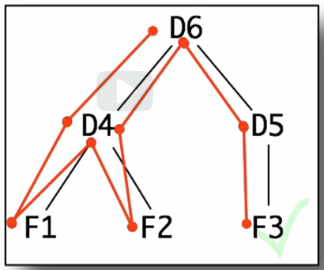

# 7: Mutual Reference

## Module Overview

Learning Goals:

- Be able to identify problem domain information of arbitrary size that should be represented using arbitrary arity trees.
- Be able to use the design recipes to design with arbitrary arity trees.
- Be able to use the design recipes with mutually-referential data.
- Be able to predict and identify the correspondence between
external-, self- and mutual-reference in a data definition and calls,
recursion and mutual-recursion in functions that operate on the data.

## Mutually Recursive Data

[mutuallyRecursiveData.rkt](https://github.com/squxq/How-to-Code-Complex-Data/blob/week-07/modules/week-07/mutuallyRecursiveData/mutuallyRecursiveData.rkt)

[mutuallyRecursiveData.png](https://github.com/squxq/How-to-Code-Complex-Data/blob/week-07/modules/week-07/mutuallyRecursiveData/mutuallyRecursiveData.png)

We are going to look at another form of data called an arbitrary arity tree. This data form is characterized by two cycles in the type comments. Computer scientists draw trees upside down.

We need to develop one or more data definitions that help us represent an information structure like a directory structure. A single integer is all each file holds. This is an arbitrary arity tree:


Each element of this tree, or this model of an arbitrary arity tree, can have sub-elements. “mooc” has a subfolder; “current” has a number of subfolders; “starters” has a number of subfolders; but “aisle-starter” just has data.

Why is it called arbitrary arity? Unlike lists, which were arbitrarily long or wide in one dimension. This arbitrary arity tree is arbitrarily sized in two dimensions: arbitrarily wide and arbitrarily deep. Arbitrary means unknown.

In order to deal with this arbitrary-sized in two dimensions structure that this has the key thing that we’re about to see is that it’s going to require two cycles in the type reference graph.

```racket
(define-struct elt (name data subs))
;; Element is (make-elt String Integer ListOfElement)
;; interp. An element in the file system, with name, and EITHER data or subs.
;;         If data is 0, then subs is considered to be list of sub elements.
;;         If data is not 0, then subs is ignored.

;; ListOfElement is one of:
;;  - empty
;;  - (cons Element ListOfElement)
;; interp. A list of file system Elements

;; Examples: <Element>
(define F1 (make-elt "F1" 1 empty))
(define F2 (make-elt "F2" 2 empty))
(define F3 (make-elt "F3" 3 empty))

;; Examples: <ListOfElement>
(define D4 (make-elt "D4" 0 (list F1 F2)))
(define D5 (make-elt "D5" 0 (list F3)))
(define D6 (make-elt "D6" 0 (list D4 D5)))
```

“ListOfElement” has a self-reference in it - that’s what allows a directory’s list of sub-elements to be arbitrarily long. In addition to that self-reference, there is a reference in the middle of “ListOfElement” back to the “Element” type. There is also a reference from the “Element” type down to “ListOfElement”. Those two references together form what’s called a mutual reference.

The self-reference cycle allows each element to have an arbitrary amount of sub-elements, that is, allows the tree to have arbitrary breadth. The mutual reference cycle allows the tree to have arbitrary depth.

## Templating Mutual Recursion

[templatingMutualRecursion.rkt](https://github.com/squxq/How-to-Code-Complex-Data/blob/week-07/modules/week-07/templatingMutualRecursion/templatingMutualRecursion.rkt)

When dealing with types involving mutual reference, group types comments and interpretations, examples and templates. That will help see the mutual recursion structure in the templates corresponding to the mutual reference structure in the types.

Where there is a self-reference there is a natural recursion. Where there is a mutual reference cycle there is a natural mutual recursion.

```racket
;; Note:
; When dealing with types involding mutual reference, group types commments and interpretations,
; examples and templates together.
;; End of Note.

;; Template: <Element>
(define (fn-for-element e)
  (... (elt-name e)                ; String
       (elt-date e)                ; Integer
       (fn-for-loe (elt-subs e)))) ; ListOfElement

;; Template rules used: <Element>
;; - compound: 3 fields
;; - reference: (elt-subs e) is ListOfElement

;; Template: <ListOfElement>
(define (fn-for-loe loe)
  (cond [(empty? loe) (...)]
        [else
         (... (fn-for-element (first loe))
              (fn-for-loe (rest loe)))]))

;; Template rules used: <ListOfElement>
;; - one of: 2 cases
;; - atomic distinct: empty
;; - compound: (cons Element ListOfElement)
;; - reference: (first loe) is Element
;; - self-reference: (rest loe) is ListOfElement

;; Note:
; Only use fn-for-something when there is a reference to another data type.
;; End  of Note.
```

## Functions on Mutually Recursive Data - Part 1

[functionsMutuallyRecursiveData.no-image.rkt](https://github.com/squxq/How-to-Code-Complex-Data/blob/week-07/modules/week-07/functionsMutuallyRecursiveData-01/functionsMutuallyRecursiveData.no-image.rkt)

> Design a function that consumes Element and produces the sum of all the file data in
the tree.
> 

With mutual recursion: do all the functions together.

```racket
;; Signature: <Element>
;; Element -> Integer

;; Signature: <ListOfElement>
;; ListOfElement -> Integer???
```

“???” means we’re not sure of the output of “fn-for-loe” - we will come back to it later.

```racket
;; Stub: <Element>
(define (sum-data--element e) 0)

;; Stub: <ListOfElement>
(define (sum-data--loe loe) 0)
```

We use function names ending in “—element” and “—loe” to have unique names for both functions. Both functions are named “sum-data” because they’re mutually recursive and require each other to work together correctly.

```racket
;; Tests: <Element>
(check-expect (sum-data--element F1) 1)
(check-expect (sum-data--element D5) 3)
(check-expect (sum-data--element D4) (+ 1 2))
(check-expect (sum-data--element D6) (+ 1 2 3))

;; Tests: <ListOfElement>
(check-expect (sum-data--loe empty) 0)
```

When coding mutually recursive functions, remember to rename all mutually recursive and self recursive calls.

```racket
;; Template: <used template from Element>
(define (sum-data--element e)
  (if (zero? (elt-data e))
       (sum-data--loe (elt-subs e))
       (elt-data e)))

;; Template: <used template from ListOfElement>
(define (sum-data--loe loe)
  (cond [(empty? loe) 0]
        [else
         (+ (sum-data--element (first loe))
              (sum-data--loe (rest loe)))]))
```

For mutually recursive functions, it’s usually the case that all the functions produce the same type of data. But there are some exceptions of that rule.

The way method works by being data-driven, in terms of getting well-formed, self and mutually referential type comments, to the templates, coding those to complete the functions, and trusting the natural recursions.

The key point is that when I design functions operating on mutually referential types, I don’t design a single function, but one for each type. And so it pays to group the signatures together, to write a single purpose, to group the examples and then group the functions.

### Question 1: Problem 1

[problem-01.no-image.rkt](https://github.com/squxq/How-to-Code-Complex-Data/blob/week-07/modules/week-07/functionsMutuallyRecursiveData-01/problem-01.no-image.rkt)

> Design a function that consumes Element and produces a list of the names of all the elements in the tree.
> 

```racket
;; ListOfString is one of:
;; - empty
;; - (cons String ListOfString)
;; interp. a list of strings

;; Examples:
(define LOS0 empty)
(define LOS1 (list "F1" "D1"))

;; Template:
#;
(define (fn-for-los los)
  (cond [(empty? los) (...)]
        [else
         (... (first los)
              (fn-for-los (rest los)))]))

;; Template rules used:
;; - one of: 2 cases
;; - atomic distinct: empty
;; - compound: (cons String ListOfString)
;; - self-reference: (rest los) is ListOfString

;; Element -> ListOfString
;; ListOfElement -> ListOfString
;; produce a list of the names of all the elements in the arbitrary arity tree

;; Stub: <Element>
#;
(define (get-names--element e) empty)

;; Stub: <ListOfElement>
#;
(define (get-names--loe loe) empty)

;; Tests: <Element>
(check-expect (get-names--element F1) (list "F1"))
(check-expect (get-names--element D4) (list "D4" "F1" "F2"))
(check-expect (get-names--element D6) (list "D6" "D4" "F1" "F2" "D5" "F3"))

;; Tests: <ListOfElement>
(check-expect (get-names--loe empty) empty)
(check-expect (get-names--loe (list F3)) (list "F3"))
(check-expect (get-names--loe (list D4 D5)) (list "D4" "F1" "F2" "D5" "F3"))

;; Template: <used template from Element>

(define (get-names--element e)
  (cons (elt-name e)
       (get-names--loe (elt-subs e))))

;; Template: <used template from ListOfElement>

(define (get-names--loe loe)
  (cond [(empty? loe) empty]
        [else
         (append (get-names--element (first loe))
              (get-names--loe (rest loe)))]))
```

## Functions on Mutually Recursive Data - Part 2

[functionsMutuallyRecursiveData.no-image.rkt](https://github.com/squxq/How-to-Code-Complex-Data/blob/week-07/modules/week-07/functionsMutuallyRecursiveData-02/functionsMutuallyRecursiveData.no-image.rkt)

> Design a function that consumes Element and produces a list of the names of all the elements in the tree.
> 

```racket
;; Element -> ListOfString
;; ListOfElement -> ListOfString
;; produce list of the names of all elements in the tree

;; Stubs:
#;
(define (get-names--element e) empty)
#;
(define (get-names--loe loe) empty)
```

The “--” endings distinguish functions operating on mutually referential types.

```racket
;; Tests: <Element>
(check-expect (get-names--element F1) (list "F1"))
(check-expect (get-names--element D4) (list "D4" "F1" "F2"))
(check-expect (get-names--element D6) (list "D6" "D4" "F1" "F2" "D5" "F3"))

;; Tests: <ListOfElement>
(check-expect (get-names--loe empty) empty)
(check-expect (get-names--loe (list F3)) (list "F3"))
(check-expect (get-names--loe (list D4 D5)) (list "D4" "F1" "F2" "D5" "F3"))
```

```racket
;; Template: <used template from Element>

(define (get-names--element e)
  (cons (elt-name e)
       (get-names--loe (elt-subs e))))

;; Template: <used template from ListOfElement>

(define (get-names--loe loe)
  (cond [(empty? loe) empty]
        [else
         (append (get-names--element (first loe))
              (get-names--loe (rest loe)))]))
```

### Question 2: Problem 1

[problem-01.no-image.rkt](https://github.com/squxq/How-to-Code-Complex-Data/blob/week-07/modules/week-07/functionsMutuallyRecursiveData-02/problem-01.no-image.rkt)

> The following is a revised data definition for Person and ListOfPerson:
> 

```racket
(define-struct person (name age children))
;; Person is (make-person String Natural ListOfPeople)
;; interp. a person with first name, age and a list of their children

;; ListOfPeople is one of:
;; - empty
;; - (cons Person ListOfPeople)
;; interp. a list of people

;; Examples: <Person>
(define P1 (make-person "John" 2 empty))
(define P2 (make-person "Mary" 10 empty))
(define P3 (make-person "Elisabeth" 29 (list P1 P2)))
(define P4 (make-person "Harry" 15 empty))
(define P5 (make-person "George" 36 (list P4)))
(define P6 (make-person "Grandma" 67 (list P3 P5)))

;; Examples: <ListOfPeople>
(define LOP1 empty)
(define LOP2 (list P1 P2))
(define LOP3 (list P4))
(define LOP4 (list P3 P5))

;; Template: <Person>
#;
(define (fn-for-person p)
  (... (person-name p) (person-age p) (person-children p)))

;; Template rules used: <Person>
;; - compound: 3 fields
;; - reference: (person-children p) is ListOfPeople

;; Template: <ListOfPeople>
#;
(define (fn-for-lop lop)
  (cond [(empty? lop) (...)]
        [else
         (... (fn-for-person (first lop))
              (fn-for-lop (rest lop)))]))

;; Template rules used: <ListOfPeople>
;; - one of: 2 cases
;; - atomic distinct: empty
;; - compound: (cons Person ListOfPeople)
;; - reference: (first lop) is Person
;; - self-reference: (rest lop) is ListOfPeople

```

> We would like to design a function that consumes a person and produces a list of the names of all the people in the tree under 20 ("in the tree" includes the original person).
> 

```racket
;; ListOfString is one of:
;; - empty
;; - (cons String ListOfString)
;; interp. a list of strings (in this scenario: a list of names)

;; Template:
#;
(define (fn-for-los los)
  (cond [(empty? los) (...)]
        [else
         (... (first los)
              (fn-for-los (rest los)))]))
```

```racket
;; Person -> ListOfString
;; ListOfPeople -> ListOfString
;; produce a list of the names of all the people in the tree younger than 20 (< 20)
;; NOTE: "in the tree" includes the original person

;; Stubs:
#;
(define (get-names--person p) empty)
#;
(define (get-names--los los) empty)

;; Tests: <Person>
(check-expect (get-names--person P1) (list "John"))
(check-expect (get-names--person P3) (list "John" "Mary"))
(check-expect (get-names--person P4) (list "Harry"))
(check-expect (get-names--person P6) (list "John" "Mary" "Harry"))

;; Tests: <ListOfPeople>
(check-expect (get-names--lop LOP1) empty)
(check-expect (get-names--lop LOP2) (list "John" "Mary"))
(check-expect (get-names--lop LOP3) (list "Harry"))
(check-expect (get-names--lop LOP4) (list "John" "Mary" "Harry"))

;; Template: <Person>
(define (get-names--person p)
  (if (< (person-age p) 20)
      (cons (person-name p) (get-names--lop (person-children p)))
      (get-names--lop (person-children p))))

;; Template: <ListOfPeople>
(define (get-names--lop lop)
  (cond [(empty? lop) empty]
        [else
         (append (get-names--person (first lop))
              (get-names--lop (rest lop)))]))
```

### Question 3: Image Organizer

[image-organizer-starter.no-image.rkt](https://github.com/squxq/How-to-Code-Complex-Data/blob/week-07/modules/week-07/functionsMutuallyRecursiveData-02/image-organizer-starter.no-image.rkt)

> Complete the design of a hierarchical image organizer.  The information and data
for this problem are similar to the file system example in the fs-starter.rkt file.
But there are some key differences:
> 
> - this data is designed to keep a hierchical collection of images
> - in this data a directory keeps its sub-directories in a separate list from
> the images it contains
> - as a consequence data and images are two clearly separate types
> 
> Start by carefully reviewing the partial data definitions below.
> 

```racket
(define-struct dir (name sub-dirs images))
;; Dir is (make-dir String ListOfDir ListOfImage)
;; interp. An directory in the organizer, with a name, a list
;;         of sub-dirs and a list of images.

;; ListOfDir is one of:
;;  - empty
;;  - (cons Dir ListOfDir)
;; interp. A list of directories, this represents the sub-directories of
;;         a directory.

;; ListOfImage is one of:
;;  - empty
;;  - (cons Image ListOfImage)
;; interp. a list of images, this represents the sub-images of a directory.
;; NOTE: Image is a primitive type, but ListOfImage is not.

;; Examples: <Image>
(define I1 (square 10 "solid" "red"))
(define I2 (square 10 "solid" "green"))
(define I3 (rectangle 13 14 "solid" "blue"))

;; Examples: <Dir && ListOfDir>
(define D4 (make-dir "D4" empty (list I1 I2)))
(define D5 (make-dir "D5" empty (list I3)))
(define D6 (make-dir "D6" (list D4 D5) empty))
```

> Annotate the type comments with reference arrows and label each one to say
whether it is a reference, self-reference or mutual-reference.
> 

```racket
;; Dir is (make-dir String
;;                  ListOfDir --> Mutual Reference
;;                  ListOfImage) --> Reference

;; (...)

;; ListOfDir is one of:
;;  - empty
;;  - (cons Dir --> Mutual Reference
;;          ListOfDir) --> Self-Reference

;; (...)

;; ListOfImage is one of:
;;  - empty
;;  - (cons Image ListOfImage) --> Self-Reference
```

> Write out the templates for Dir, ListOfDir and ListOfImage. Identify for each
call to a template function which arrow from part A it corresponds to.
> 

```racket
;; Template: <Dir>
#;
(define (fn-for-dir d)
  (... (dir-name d)
       (fn-for-lod (dir-sub-dirs d)) ; --> Mutual Reference to "ListOfDir"
       (fn-for-loi (dir-images d)))) ; --> Reference to "ListOfImage"

;; Template: <ListOfDir>
#;
(define (fn-for-lod lod)
  (cond [(empty? lod) (...)]
        [else (...
               (fn-for-dir (first lod))    ; --> Mutual Reference to "Dir"
               (fn-for-lod (rest lod)))])) ; --> Self-Reference to "ListOfDir"

;; Template: <ListOfImage>
#;
(define (fn-for-loi loi)
  (cond [(empty? loi) (...)]
        [else (...
               (first loi)
               (fn-for-loi (rest loi)))])) ; --> Self-Reference to "ListOfImage"
```

> Design a function to calculate the total size (width* height) of all the images
in a directory and its sub-directories.
> 

```racket
;; Dir -> Natural (natural + (natural * natural) = natural)
;; ListOfDir -> Natural
;; ListOfImage -> Natural
;; calculate the total size (width * height) of all the images in a directory and its sub-directories

;; Stubs:
;(define (calculate-size--dir d) 0)
;(define (calculate-size--lod lod) 0)
;(define (calculate-size--loi loi) 0)

;; Tests:
(check-expect (calculate-size--lod empty) 0)
(check-expect (calculate-size--loi empty) 0)
(check-expect (calculate-size--dir D4) 200)
(check-expect (calculate-size--loi (list I3)) (* 13 14))
(check-expect (calculate-size--dir D5) (* 13 14))
(check-expect (calculate-size--loi (list I1 I2)) 200)
(check-expect (calculate-size--lod (list D4 D5)) (+ 200 (* 13 14)))
(check-expect (calculate-size--dir D6) (+ 200 (* 13 14)))

;; Template: <Dir>
(define (calculate-size--dir d)
  (+ (calculate-size--lod (dir-sub-dirs d))
      (calculate-size--loi (dir-images d))))

;; Template: <ListOfDir>
(define (calculate-size--lod lod)
  (cond [(empty? lod) 0]
        [else (+ (calculate-size--dir (first lod))
               (calculate-size--lod (rest lod)))]))

;; Template: <ListOfImage>
(define (calculate-size--loi loi)
  (cond [(empty? loi) 0]
        [else (+ (* (image-width (first loi)) (image-height (first loi)))
               (calculate-size--loi (rest loi)))]))

;; Image -> Natural
;; given an image, i, produce its area (width * height)

;; Stub:
#;
(define (image-area i) 0)

;; Tests:
(check-expect (image-area I1) 100)
(check-expect (image-area I2) 100)
(check-expect (image-area I3) (* 13 14))

;; Template:
#;
(define (image-area i)
  (... i))

(define (image-area i)
  (* (image-width i) (image-height i)))
```

> Design a function to produce rendering of a directory with its images. Keep it
simple and be sure to spend the first 10 minutes of your work with paper and
pencil!
> 

```racket
;; Dir -> Image
;; ListOfDir -> Image
;; ListOfImage -> Image
;; produce the rendering of a directory with its images

;; Stubs:
;(define (render--dir d) empty-image)
;(define (render--lod lod) empty-image)
;(define (render--loi loi) empty-image)

;; Tests:
(check-expect (render--lod empty) empty-image)
(check-expect (render--loi empty) empty-image)
(check-expect (render--loi (list I1 I2))
              (beside I1 I2))
(check-expect (render--loi (list I3)) I3)
(check-expect (render--lod (list D4 D5))
              (beside (render--dir D4)
                      (render--dir D5)))
(check-expect (render--dir D4)
              (above (text "D4" FONT-SIZE FONT-COLOR)
                     (render--loi (list I1 I2))
                     VERTICAL-SPACE
                     (render--lod empty)))
(check-expect (render--dir D5)
              (above (text "D5" FONT-SIZE FONT-COLOR)
                     (render--loi (list I3))
                     VERTICAL-SPACE
                     (render--lod empty)))
(check-expect (render--dir D6)
              (above (text "D6" FONT-SIZE FONT-COLOR)
                     (render--loi empty)
                     VERTICAL-SPACE
                     (render--lod (list D4 D5))))

;; Template: <Dir>
(define (render--dir d)
  (above (text (dir-name d) FONT-SIZE FONT-COLOR)
         (render--loi (dir-images d))
         VERTICAL-SPACE
         (render--lod (dir-sub-dirs d))))

;; Template: <ListOfDir>
(define (render--lod lod)
  (cond [(empty? lod) empty-image]
        [else (beside
               (render--dir (first lod))
               (render--lod (rest lod)))]))

;; Template: <ListOfImage>
(define (render--loi loi)
  (cond [(empty? loi) empty-image]
        [else (beside
               (first loi)
               (render--loi (rest loi)))]))
```

### Question 4: Find Person

[find-person-starter.no-image.rkt](https://github.com/squxq/How-to-Code-Complex-Data/blob/week-07/modules/week-07/functionsMutuallyRecursiveData-02/find-person-starter.no-image.rkt)

> The following program implements an arbitrary-arity descendant family
tree in which each person can have any number of children.
> 
> 
> Decorate the type comments with reference arrows and establish a clear
> correspondence between template function calls in the templates and
> arrows in the type comments.
> 

```racket
;; Data definitions:

(define-struct person (name age kids))
;; Person is (make-person String Natural ListOfPerson) --> Mutual Reference
;; interp. A person, with first name, age and their children

;; Examples:
(define P1 (make-person "N1" 5 empty))
(define P2 (make-person "N2" 25 (list P1)))
(define P3 (make-person "N3" 15 empty))
(define P4 (make-person "N4" 45 (list P3 P2)))

;; Template: <Person>
#;
(define (fn-for-person p)
  (... (person-name p)
       (person-age p)  
       (fn-for-lop (person-kids p)))) ; --> Mutual Reference to ListOfPerson

;; ListOfPerson is one of:
;;  - empty
;;  - (cons Person        --> Mutual Reference
;;          ListOfPerson) --> Self-Reference
;; interp. a list of persons

;; Template: <ListOfPerson>
#;
(define (fn-for-lop lop)
  (cond [(empty? lop) (...)]
        [else
         (... (fn-for-person (first lop)) ; --> Mutual Reference to Person
              (fn-for-lop (rest lop)))])) ; --> Self-Reference
```

> Design a function that consumes a Person and a String. The function
should search the entire tree looking for a person with the given
name. If found the function should produce the person's age. If not
found the function should produce false.
> 

```racket
;; Person String -> Natural or false
;; ListOfPerson String -> Natural or false
;; search the entire tree, p, for a person with the given name, s; if found produce the person's age; otherwise false

;; Stubs:
;(define (search--person p s) false)
;(define (search--lop lop s) false)

;; Tests:
(check-expect (search--lop empty "N1") false)
(check-expect (search--person P1 "N1") 5)
(check-expect (search--person P2 "N1") 5)
(check-expect (search--lop (list P1) "N1") 5)
(check-expect (search--person P3 "N1") false)
(check-expect (search--person P4 "N2") 25)
(check-expect (search--person P4 "N1") 5)
(check-expect (search--lop (list P3 P2) "N3") 15)

;; Template: <Person>
(define (search--person p s)
  (if (string=? (person-name p) s)
       (person-age p)  
       (search--lop (person-kids p) s)))

;; Template: <ListOfPerson>
(define (search--lop lop s)
  (cond [(empty? lop) false]
        [else
         (if (not (false? (search--person (first lop) s)))
             (search--person (first lop) s)
             (search--lop (rest lop) s))]))
```

### Question 5: Harry Potter Family Tree

[hp-family-tree-starter.no-image.rkt](https://github.com/squxq/How-to-Code-Complex-Data/blob/week-07/modules/week-07/functionsMutuallyRecursiveData-02/hp-family-tree-starter.no-image.rkt)

> In this problem set you will represent information about descendant family trees from Harry Potter and design functions that operate on those trees.
> 
> 
> To make your task much easier we suggest two things:
> 
> - you only need a DESCENDANT family tree
> - read through this entire problem set carefully to see what information
> the functions below are going to need. Design your data definitions to
> only represent that information.
> - you can find all the information you need by looking at the individual
> character pages like the one we point you to for Arthur Weasley.
> 
> Design a data definition that represents a family tree from the Harry Potter
> wiki, which contains all necessary information for the other problems.  You
> will use this data definition throughout the rest of the homework.
> 

```racket
;; Data Definitions:

(define-struct wand (length wood core))
;; Wand is (make-wand Number String String)
;; interp. wand that belongs to a wizard, based on the Harry Potter wiki, with:
;;         length, is the wand's length in inches (") - 0 means the length is unknown
;;         wood, is the wand's wood
;;         core, is the wand's core
;;         for the 2 above fields: "" - means the information if not present (unknown)

;; Examples: <Wand>
(define UNKNOWN-WAND (make-wand 0 "" ""))
(define CHARLES-WAND (make-wand 12 "Ash" "unicorn tail hair"))
(define RONALD-WAND-1 (make-wand 12 "Ash" "unicorn tail hair"))
(define RONALD-WAND-2 (make-wand 14 "Willow" "unicorn tail hair"))
(define RONALD-WAND-3 (make-wand 9.25 "Chestnut" "Dragon heartstring"))
(define GINEVRA-WAND (make-wand 0 "Yew" ""))
(define ALBUS-WAND (make-wand 0 "Cherry" ""))

;; Template: <Wand>
#;
(define (fn-for-wand wand)
  (... (wand-length wand)
       (wand-wood wand)
       (wand-core wand)))

;; ListOfWand is one of:
;; - empty
;; - (cons Wand ListOfWand)
;; interp. list of wands; empty means no wand

;; Examples: <ListOfWand>
(define NO-WAND empty)
(define UNKNOWN-WANDS (list UNKNOWN-WAND))
(define CHARDLES-WANDS (list CHARLES-WAND UNKNOWN-WAND))
(define RONALD-WANDS (list RONALD-WAND-1 RONALD-WAND-2 RONALD-WAND-3))
(define GINEVRA-WANDS (list GINEVRA-WAND))
(define ALBUS-WANDS (list ALBUS-WAND))

;; Template: <ListOfWand>
#;
(define (fn-for-low low)
  (cond [(empty? low) (...)]
        [else
         (... (fn-for-wand (first low))   ; --> Reference to Wand
              (fn-for-low (rest low)))])) ; --> Self-Reference to ListOfWand

(define-struct wizard (first-name last-name patronus wands children))
;; Wizard is (make-wizard String String String ListOfWand DescendantsOfWizard)
;; interp. wizard from the Harry Potter wiki with:
;;         first-name, is the wizard's first name
;;         last-name, is the wizard's last name
;;         patronus, is the wizard's patronus - "" means no patronus
;;         wands, are the wizard's wands - empty means no wand
;;         children, are the wizard's children

;; DescendantsOfWizard is one of:
;; - empty
;; - (cons Wizard DescendantsOfWizard)
;; interp. the descendants of a given wizard
;;         empty means no descendants, or they are not relevant

;; Examples: <Wizard>
(define VICTOIRE (make-wizard "Victoire" "Weasly" "" NO-WAND empty))
(define DOMINIQUE (make-wizard "Dominique" "Weasley" "" NO-WAND empty))
(define LOUIS (make-wizard "Louis" "Weasley" "" NO-WAND empty))
(define JAMES (make-wizard "James" "Potter" "" NO-WAND empty))
(define ALBUS (make-wizard "Albus" "Potter" "" ALBUS-WANDS empty))
(define LILY (make-wizard "Lily" "Potter" "" NO-WAND empty))
;; Examples: <DescendantsOfWizard>
(define DOW0 empty)
(define DOW1 (cons VICTOIRE empty))
(define WILLIAM-CHILDREN (list VICTOIRE DOMINIQUE LOUIS))
(define GINEVRA-CHILDREN (list JAMES ALBUS LILY))
;; Examples: <Wizard>
(define WILLIAM (make-wizard "William" "Weasley" "Non-Corporeal" UNKNOWN-WANDS WILLIAM-CHILDREN))
(define CHARLES (make-wizard "Charles" "Weasley" "Non-Corporeal" CHARDLES-WANDS empty))
(define PERCY (make-wizard "Percy" "Weasley" "Non-Corporeal" UNKNOWN-WANDS empty))
(define FRED (make-wizard "Fred" "Weasley" "Magpie" UNKNOWN-WANDS empty))
(define GEORGE (make-wizard "George" "Weasley" "Magpie" UNKNOWN-WANDS empty))
(define RONALD (make-wizard "Ronald" "Weasley" "Jack Russel terrier" RONALD-WANDS empty))
(define GINEVRA (make-wizard "Ginevra" "Potter" "Horse" GINEVRA-WANDS GINEVRA-CHILDREN))
;; Examples: <DescendantsOfWizard>
(define ARTHUR-CHILDREN (list WILLIAM CHARLES PERCY FRED GEORGE RONALD GINEVRA))

;; Template: <Wizard>
#;
(define (fn-for-wizard w)
  (... (wizard-first-name w)
       (wizard-last-name w)
       (wizard-patronus w)
       (fn-for-low (wizard-wands w))      ; --> Reference to ListOfWand
       (fn-for-dow (wizard-children w)))) ; --> Mutual Reference to DescendantsOfWizard

;; Template: <DescendantsOfWizard>
#;
(define (fn-for-dow dow)
  (cond [(empty? dow) (...)]
        [else (...
               (fn-for-wizard (first dow)) ; --> Mutual Reference to Wizard
               (fn-for-dow (rest dow)))])) ; --> Self-Reference to DescendantsOfWizard
```

> Define a constant named ARTHUR that represents the descendant family tree for
Arthur Weasley. You can find all the information you need by starting
at: [http://harrypotter.wikia.com/wiki/Arthur_Weasley](http://harrypotter.wikia.com/wiki/Arthur_Weasley).
> 
> 
> You must include all of Arthur's children and these grandchildren: Lily,
> Victoire, Albus, James.
> 
> Note that on the Potter wiki you will find a lot of information. But for some
> people some of the information may be missing. Enter that information with a
> special value of "" (the empty string) meaning it is not present. Don't forget
> this special value when writing your interp.
> 

```racket
(define ARTHUR (make-wizard "Arthur" "Weasley" "Weasel" UNKNOWN-WANDS ARTHUR-CHILDREN))
```

> Design a function that produces a pair list (i.e. list of two-element lists)
of every person in the tree and his or her patronus. For example, assuming
that HARRY is a tree representing Harry Potter and that he has no children
(even though we know he does) the result would be: (list (list "Harry" "Stag")).
> 
> 
> You must use ARTHUR as one of your examples.
> 

```racket
;; ListOfString is one of:
;; - empty
;; - (cons String ListOfString)
;; a list of strings

;; Examples: <ListOfString>
(define LOS0 empty)
(define LOS1 (list "Ginevra Potter" "Horse"))

;; Template: <ListOfString>
#;
(define (fn-for-los los)
  (cond [(empty? los) (...)]
        [else
         (... (first los)
              (fn-for-los (rest los)))])) ; --> Self-Reference to ListOfString

;; PairList is one of:
;; - empty
;; - (cons ListOfString PairList)
;; interp. list of lists of string
;; ASSUME: length of ListOfString is always 2

;; Examples: <PairList>
(define PL0 empty)
(define PL1 (list (list "William Weasley" "Non-Corporeal")))
(define PL2 (list (list "William Weasley" "Non-Corporeal")
                    (list "Charles Weasley" "Non-Corporeal")
                    (list "Percy Weasley" "Non-Corporeal")
                    (list "Fred Weasley" "Magpie")
                    (list "George Weasley" "Magpie")
                    (list "Ronald Weasley" "Jack Russel terrier")
                    (list "Ginevra Potter" "Horse")))

;; Template: <PairList>
#;
(define (fn-for-pl pl)
  (cond [(empty? pl) (...)]
        [else
         (... (fn-for-los (first pl))   ; --> Reference to ListOfString
              (fn-for-pl (rest pl)))])) ; --> Self-Reference to PairList

;; Function Definitions:

;; Wizard -> PairList
;; DescendantsOfWizard -> PairList
;; produce a pair list of every person in the tree, w or dow, and his or her patronus
;; EXAMPLE: I: HARRY -> O: (list (list "Harry" "Stag"))

;; Stubs:
;(define (get-patronus--wizard w) empty)
;(define (get-patronus--dow dow) empty)

;; Tests:
(check-expect (get-patronus--dow DOW0) empty)
(check-expect (get-patronus--wizard VICTOIRE) empty)
(check-expect (get-patronus--dow DOW1) empty)
(check-expect (get-patronus--dow WILLIAM-CHILDREN) empty)
(check-expect (get-patronus--wizard WILLIAM) (list (list "William Weasley" "Non-Corporeal")))
(check-expect (get-patronus--wizard GEORGE) (list (list "George Weasley" "Magpie")))
(check-expect (get-patronus--dow ARTHUR-CHILDREN) PL2)
(check-expect (get-patronus--wizard ARTHUR)
              (cons (list "Arthur Weasley" "Weasel") PL2))

;; Template: get-patronus--wizard
(define (get-patronus--wizard w)
  (if (string=? "" (wizard-patronus w))
      empty
      (cons (list (string-append (wizard-first-name w) " " (wizard-last-name w))
                  (wizard-patronus w)) (get-patronus--dow (wizard-children w)))))

;; Template: <DescendantsOfWizard>
(define (get-patronus--dow dow)
  (cond [(empty? dow) empty]
        [else (if (not (empty? (get-patronus--wizard (first dow))))
                  (append (get-patronus--wizard (first dow))
                        (get-patronus--dow (rest dow)))
                  (get-patronus--dow (rest dow)))]))
```

> Design a function that produces the names of every person in a given tree
whose wands are made of a given length or material.
> 
> 
> You must use ARTHUR as one of your examples.
> 

```racket
;; WandFilter is one of:
;; - Number
;; - String
;; interp. a filter to search for a specific wand length or material
;;         if WandFilter is a number: 0 means the length is unknown
;;         if WandFilter is a string: "" - means the information if not present (unknown)

;; Examples: <WandFilter>
(define UNKNOWN-LENGTH 0)
(define UNKNOWN-MATERIAL "")
(define WF2 12)
(define WF3 "Ash")

;; Template: <WandFilter>
#;
(define (fn-for-wand-filter wf)
  (cond [(number? wf) (... wf)]
        [else (... wf)]))

;; Wizard WandFilter -> ListOfString
;; DescendantsOfWizard WandFilter -> ListOfString
;; produce the name of every person in a given tree, w or dow, whose wands have
;;         a given length or are made of a given material, wf

;; Stubs:
;(define (filter-wand--wizard w wf) empty)
;(define (filter-wand--dow dow wf) empty)

;; Tests:
(check-expect (filter-wand--dow empty UNKNOWN-LENGTH) empty)
(check-expect (filter-wand--w VICTOIRE UNKNOWN-MATERIAL) empty)
(check-expect (filter-wand--w ALBUS UNKNOWN-MATERIAL) (list "Albus Potter"))
(check-expect (filter-wand--w ALBUS UNKNOWN-LENGTH) (list "Albus Potter"))
(check-expect (filter-wand--w ALBUS "Cherry") (list "Albus Potter"))
(check-expect (filter-wand--w WILLIAM UNKNOWN-LENGTH) (list "William Weasley"))
(check-expect (filter-wand--w CHARLES "Ash") (list "Charles Weasley"))
(check-expect (filter-wand--w RONALD "unicorn tail hair") (list "Ronald Weasley"))
(check-expect (filter-wand--dow GINEVRA-CHILDREN 0) (list "Albus Potter"))
(check-expect (filter-wand--w GINEVRA 0) (list "Ginevra Potter" "Albus Potter"))
(check-expect (filter-wand--w GINEVRA "Yew") (list "Ginevra Potter"))
(check-expect (filter-wand--dow ARTHUR-CHILDREN "")
              (list "William Weasley" "Charles Weasley" "Percy Weasley" "Fred Weasley" "George Weasley"
                    "Ginevra Potter" "Albus Potter"))
(check-expect (filter-wand--w ARTHUR "")
              (list "Arthur Weasley" "William Weasley" "Charles Weasley" "Percy Weasley"
                    "Fred Weasley" "George Weasley" "Ginevra Potter" "Albus Potter"))
(check-expect (filter-wand--dow ARTHUR-CHILDREN 12)
              (list "Charles Weasley" "Ronald Weasley"))
(check-expect (filter-wand--dow ARTHUR-CHILDREN "unicorn tail hair")
              (list "Charles Weasley" "Ronald Weasley"))
(check-expect (filter-wand--w ARTHUR "Chestnut") (list "Ronald Weasley"))

;; Template: <Wizard>
(define (filter-wand--w w wf)
  (if (is-wand-list-filter? (wizard-wands w) wf)
      (cons (string-append (wizard-first-name w) " " (wizard-last-name w))
            (filter-wand--dow (wizard-children w) wf))
       (filter-wand--dow (wizard-children w) wf)))

;; Template: <DescendantsOfWizard>
(define (filter-wand--dow dow wf)
  (cond [(empty? dow) empty]
        [else (append (filter-wand--w (first dow) wf)
               (filter-wand--dow (rest dow) wf))]))

;; ListOfWand WandFilter -> Boolean
;; return true if at least one element of the given list of wands, low, has the given length or
;;        is made of a given material, wf; otherwise return false

;; Stub:
;(define is-wand-list-filter? low wf)

;; Tests:
(check-expect (is-wand-list-filter? NO-WAND "") false)
(check-expect (is-wand-list-filter? UNKNOWN-WANDS 0) true)
(check-expect (is-wand-list-filter? CHARLES-WANDS "Dragon heartstring") false)
(check-expect (is-wand-list-filter? RONALD-WANDS "Chestnut") true)
(check-expect (is-wand-list-filter? RONALD-WANDS 9.25) true)

;; Template: <ListOfWand>
(define (is-wand-list-filter? low wf)
  (cond [(empty? low) false]
        [else
         (or (is-wand-filter? (first low) wf)
             (is-wand-list-filter? (rest low) wf))]))

;; Wand WandFilter -> Boolean
;; given a wand, wand, and a wand filter, wf, return true if the wand has the given length
;;       or is made of a given material, wf; otherwise return false

;; Stub:
;(define is-wand-filter? wand wf)

;; Tests:
(check-expect (is-wand-filter? UNKNOWN-WAND 0) true)
(check-expect (is-wand-filter? CHARLES-WAND 14) false)
(check-expect (is-wand-filter? RONALD-WAND-3 "Willow") false)
(check-expect (is-wand-filter? GINEVRA-WAND "Yew") true)

;; Template: <WandFilter>
(define (is-wand-filter? wand wf)
  (cond [(number? wf) (= (wand-length wand) wf)]
        [else (or (string=? (wand-wood wand) wf) (string=? (wand-core wand) wf))]))
```

## Backtracking Search

[backtrackingSearch.no-image.rkt](https://github.com/squxq/How-to-Code-Complex-Data/blob/week-07/modules/week-07/backtrackingSearch/backtrackingSearch.no-image.rkt)

[backtrackingSearch.png](https://github.com/squxq/How-to-Code-Complex-Data/blob/week-07/modules/week-07/backtrackingSearch/backtrackingSearch.png)

Searching an arbitrary-arity tree for the first element to have a given property leads to a backtracking traversal of the tree.

> Design a function that consumes String and Element and looks for a data element with the given name. If it finds that element it produces the data, otherwise it produces false.
> 

```racket
;; String Element -> Integer or false
```

What is happening here is this function is going to go look for an element with the given name. Sometimes it’s going to produce the data, otherwise, it’s going to produce false. We have written functions that say whether the “String” is in a “ListOfString”, but that function always produces a “Boolean”. In this case, we need an extension to how we write function signatures to do this.

In some programming languages - in most recent programming languages - there is a more sophisticated mechanism called exceptions for dealing with this kind of case.

```racket
;; String Element -> Integer or false
;; String ListOfElement -> Integer or false???
;; search the given tree for an element for an element with the given name, produce data if found; false otherwise

;; Stubs:
#;
(define (find--element n e) false)
#;
(define (find--loe n loe) false)
```

Now for the tests, ordered more in terms of their complexity:

```racket
;; Tests: <ListOfElement>
(check-expect (find--loe "F3" empty) false)
(check-expect (find--loe "F2" (list F1 F2)) 2)
(check-expect (find--loe "F3" (list F1 F2)) false)

;; Tests: <Element>
(check-expect (find--element "F3" F1) false)
(check-expect (find--element "F3" F3) 3)
(check-expect (find--element "F3" D4) false)
(check-expect (find--element "F1" D4) 1)
(check-expect (find--element "F2" D4) 2)
(check-expect (find--element "D4" D4) 0)
(check-expect (find--element "F3" D6) 3)
(check-expect (find--element "D6" D6) 0)
(check-expect (find--element "F1" D6) 1)
(check-expect (find--element "F3" D6) 3)
```

```racket
;; Template: <Element>
(define (find--element n e)
  (if (string=? n (elt-name e))
       (elt-data e)
       (find--loe n (elt-subs e))))

;; Template: <ListOfElement>
(define (find--loe n loe)
  (cond [(empty? loe) false]
        [else
         (... (find--element n (first loe))
              (find--loe n (rest loe)))]))
```

In “find—loe” what are these two natural mutual recursions going to do? They will produce integer or false depending on whether its found in “(first loe)”.

```racket
;; Template: <ListOfElement>
(define (find--loe n loe)
  (cond [(empty? loe) false]
        [else
         (if (not (false? (find--element n (first loe))))
              (find--element n (first loe))  ;; produce Integer or false if n is found in (first loe)
              (find--loe n (rest loe)))]))   ;; produce Integer or false if n is found in (rest loe)
```

Finding the same thing twice is a performance problem. Once we learn local expressions we will fix it. The reason we use “not false?” instead of “integer?” is because it is more general for backtracking functions.

Why is this called backtracking? What happens when we look in D6 for F3?



Each time we get to a failing node with no sub-elements - those are called leaves because they have no branches anymore - we back up to its parent and then try the next child, the next sub, that’s called backtracking.

### Question 6: Render Arbitrary Arity Tree

[problem-01.no-image.rkt](https://github.com/squxq/How-to-Code-Complex-Data/blob/week-07/modules/week-07/backtrackingSearch/problem-01.no-image.rkt)

[problem-01.rkt](https://github.com/squxq/How-to-Code-Complex-Data/blob/week-07/modules/week-07/backtrackingSearch/problem-01.rkt)

> Design a function that consumes Element and produces a rendering of the tree. For example:

(render-tree D6) should produce something like the following.
(open image file)

HINTS:
  - This function is not very different than the first two functions above.
  - Keep it simple! Start with a not very fancy rendering like the one above.
    Once that works you can make it more elaborate if you want to.
  - And... be sure to USE the recipe. Not just follow it, but let it help you.
    For example, work out a number of examples BEFORE you try to code the function.
> 

```racket
(define-struct elt (name data subs))
;; Element is (make-elt String Integer ListOfElement)
;; interp. An element in the file system, with name, and EITHER data or subs.
;;         If data is 0, then subs is considered to be list of sub elements.
;;         If data is not 0, then subs is ignored.

;; ListOfElement is one of:
;;  - empty
;;  - (cons Element ListOfElement)
;; interp. A list of file system Elements

;(open image file)

;; Examples:
(define F1 (make-elt "F1" 1 empty))
(define F2 (make-elt "F2" 2 empty))
(define F3 (make-elt "F3" 3 empty))
(define D4 (make-elt "D4" 0 (list F1 F2)))
(define D5 (make-elt "D5" 0 (list F3)))
(define D6 (make-elt "D6" 0 (list D4 D5)))

;; Template: <Element>
#;
(define (fn-for-element e)
  (... (elt-name e)    ;String
       (elt-data e)    ;Integer
       (fn-for-loe (elt-subs e))))

;; Template: <ListOfElement>
#;
(define (fn-for-loe loe)
  (cond [(empty? loe) (...)]
        [else
         (... (fn-for-element (first loe))
              (fn-for-loe (rest loe)))]))

;; Element -> Image
;; ListOfElement -> Image
;; render an image of the given tree, e or loe
;; EXAMPLE: I: (render-tree D6) -> O: (open image file)

;; Stubs:
;(define (render--element e) empty-image)
;(define (render--loe loe) empty-image)

;; Tests:
(check-expect (render--loe empty) empty-image)
(check-expect (render--element F1)
              (above (text "F1" FONT-SIZE FONT-COLOR)
                     (overlay (text "1" FONT-SIZE-S FONT-COLOR)
                              DATA-OUTLINE)))
(check-expect (render--loe (list F1 F2))
              (beside (render--element F1)
                      HORIZONTAL-SPACE
                      (above (text "F2" FONT-SIZE FONT-COLOR)
                     (overlay (text "2" FONT-SIZE-S FONT-COLOR)
                              DATA-OUTLINE))))
(check-expect (render--element D4)
              (above (text "D4" FONT-SIZE FONT-COLOR)
                     VERTICAL-SPACE
              (render--loe (list F1 F2))))

;; Template: <Element>
(define (render--element e)
  (if (= (elt-data e) 0)
      (above (text (elt-name e) FONT-SIZE FONT-COLOR)
             VERTICAL-SPACE
             (render--loe (elt-subs e)))
       (above (text (elt-name e) FONT-SIZE FONT-COLOR)
              (overlay (text (number->string (elt-data e)) FONT-SIZE-S FONT-COLOR)
                       DATA-OUTLINE))))

;; Template: <ListOfElement>
(define (render--loe loe)
  (cond [(empty? loe) empty-image]
        [else (if (not (empty? (rest loe)))
                  (beside (render--element (first loe))
                 HORIZONTAL-SPACE
              (render--loe (rest loe)))
                  (render--element (first loe)))]))
```