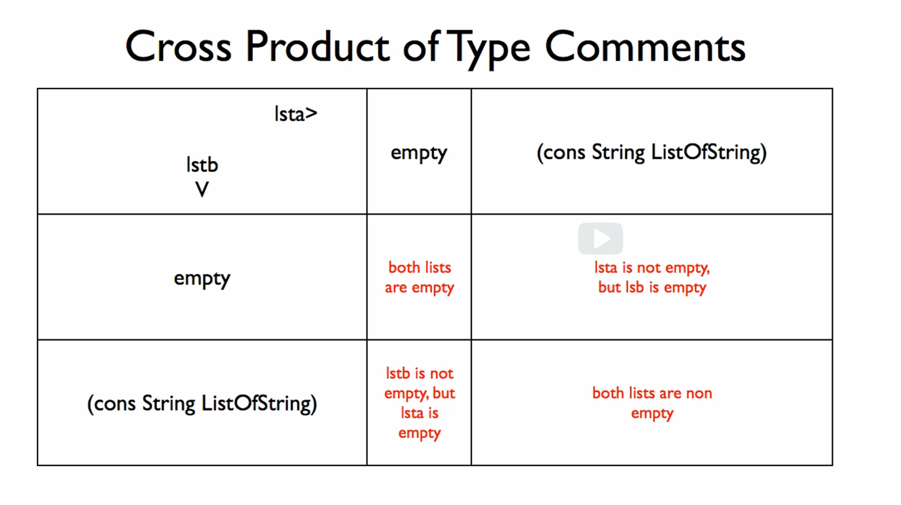
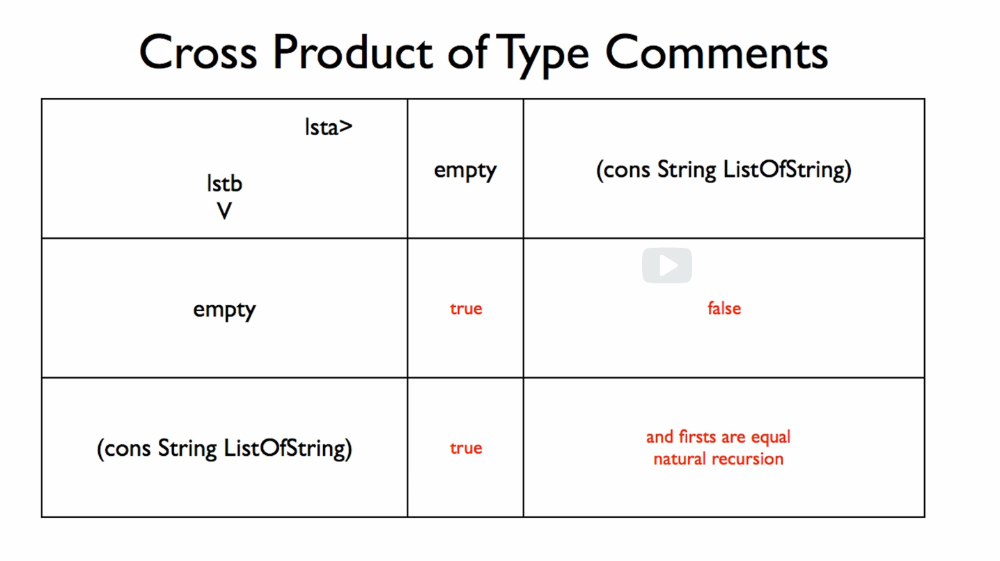

# 8a: Two One-of Types

## Module Overview

Learning Goals:

- Be able to produce the cross-product of type templates table for a function operating on two values with one-of types.
- Be able to use the table to generate examples and a template.
- Be able to use the table to simplify the function when there are equal answers in some cells.

## Cross Product Table

[crossProductTable.no-image.rkt](https://github.com/squxq/How-to-Code-Complex-Data/blob/week-08a/modules/week-08a/crossProductTable/crossProductTable.no-image.rkt)

[crossProductTable.png](https://github.com/squxq/How-to-Code-Complex-Data/blob/week-08a/modules/week-08a/crossProductTable/crossProductTable.png)

We can use the type comments to reason about the actual behavior of a function. We’re going to take one more step towards designing a function based on a model of the function. A model is a more abstract representation of the function or a less detailed representation of the function.

> Design a function that consumes two lists of strings and produces true
if the first list is a prefix of the second. Prefix means that the elements of
the first list match the elements of the second list 1 for 1, and the second list
is at least as long as the first.
> 
> 
> For reference, the ListOfString data definition is provided below.
> 

```racket
;; =================
;; Data Definitions:

;; ListOfString is one of:
;; - empty
;; - (cons String ListOfString)
;; interp. a list of strings

;; Examples: <ListOfString>
(define LS0 empty)
(define LS1 (cons "a" empty))
(define LS2 (cons "a" (cons "b" empty)))
(define LS3 (cons "c" (cons "b" (cons "a" empty))))

;; Template: <ListOfString>
#;
(define (fn-for-los los)
  (cond [(empty? los) (...)]
        [else 
         (... (first los)
              (fn-for-los (rest los)))]))

;; ==========
;; Functions:

;; ListOfString ListOfString -> Boolean
;; produce true if lsta is a prefix of lstb

;; Stub:
(define (prefix=? lsta lstb) false)
```

Both of “lsta” and “lstb” are “ListOfString” and both of them have two cases in their “one-of”s. We create a table that has two rows and two columns, which is called a cross product type comments table. The cases of the “one-of” type comments go along the axes.

I can use this design approach even if the two types are not the same: the two arguments don’t have to be identical, but both must be “one-of”.



```racket
;; Tests:
(check-expect (prefix=? empty empty) true)
(check-expect (prefix=? (list "x") empty) false)
(check-expect (prefix=? empty (list "x")) true)
(check-expect (prefix=? (list "x") (list "x")) true)
(check-expect (prefix=? (list "x") (list "y")) false)
(check-expect (prefix=? (list "x" "y") (list "x" "y")) true)
(check-expect (prefix=? (list "x" "x") (list "x" "y")) false)
(check-expect (prefix=? (list "x") (list "x" "y")) true)
(check-expect (prefix=? (list "x" "y" "z") (list "x" "y")) false)
```

## Cross Product Code

[crossProductCode.no-image.rkt](https://github.com/squxq/How-to-Code-Complex-Data/blob/week-08a/modules/week-08a/crossProductCode/crossProductCode.no-image.rkt)

[crossProductCode.png](https://github.com/squxq/How-to-Code-Complex-Data/blob/week-08a/modules/week-08a/crossProductCode/crossProductCode.png)

If we go back and look at the table, it tells us there are four cases: both lists are empty; “lsta” is empty but “lstb” is not; “lstb” is empty but “lsta” is not; both lists are not empty.

```racket
;; Template: <ListOfString ListOfString>
(define (prefix=? lsta lstb)
  (cond [(and (empty? lsta) (empty? lstb)) (...)]
        [(and (cons? lsta) (empty? lstb)) (... (first lsta)
                                               (fn-for-los (rest lsta)))]
        [(and (cons? lstb) (empty? lsta)) (... (first lstb)
                                               (fn-for-los (rest lstb)))]
        [(and (cons? lsta) (cons? lstb)) (... (first lsta) (first lstb)
                                              (fn-for-los (rest lsta))
                                              (fn-for-los (rest lstb)))]))
```



```racket
(define (prefix=? lsta lstb)
  (cond [(empty? lsta) (...)]
        [(empty? lstb) (...)]
        [else (... (first lsta) (first lstb)
                   (fn-for-los (rest lsta))
                   (fn-for-los (rest lstb)))]))

(define (prefix=? lsta lstb)
  (cond [(empty? lsta) true]
        [(empty? lstb) false]
        [else (if (string=? (first lsta) (first lstb))
                   (prefix=? (rest lsta) (rest lstb))
                   false)]))
```

The templating step no longer completely precedes the coding step, rather, they are intertwined. Also, we have simplified the template with the cross-product table.

The type comments predict the templates. In other words, they are a model of the functions operating on that type - a non-code representation of that type - and a non-code representation of the program that tells us about what the function will look like.

By using a cross product of type comments table, we are simplifying at a model level.

### Question 7: Problem 1

[problem-01.no-image.rkt](https://github.com/squxq/How-to-Code-Complex-Data/blob/week-08a/modules/week-08a/crossProductCode/problem-01.no-image.rkt)

> Consider the following data definitions for BinaryTree and Path:
> 

```racket
(define-struct node (k v l r))
;; BinaryTree is one of:
;; - false
;; - (make-node Natural String BinaryTree BinaryTree)
;; interp. a binary tree, each node has key, value, and l/r children

;; Examples: <Binary Tree>
(define BT0 false)
(define BT1 (make-node 1 "a" false false))
(define BT4 (make-node 4 "d"
                       (make-node 2 "b"
                                  (make-node 1 "a" false false)
                                  (make-node 3 "c" false false))
                       (make-node 5 "e" false false)))

;; Path is one of:
;; - empty
;; - (cons "L" Path)
;; - (cons "R" Path)
;; interp. a sequence of left and right 'turns' down though a BinaryTree
;;         (list "L" "R" "R" means take the left child of the root, then
;;         the right child of that node, and the right child again.
;;         empty means you have arrived at the destination.

;; Examples: <Path>
(define P1 empty)
(define P2 (list "L"))
(define P3 (list "R"))
(define P4 (list "L" "R"))
```

> Design a function has-path? that produces true if by following a given path in the given binary tree leads to a node.
> 

```racket
;; BinaryTree Path -> Boolean
;; produce true if following p through bt leads to a node; false otherwise

;; Stub:
;(define (has-path? bt p) false)

;; Tests:
(check-expect (has-path? false empty) false)
(check-expect (has-path? false P2) false)
(check-expect (has-path? false P3) false)
(check-expect (has-path? BT1 empty) true)
(check-expect (has-path? BT4 (list "L")) true)
(check-expect (has-path? BT4 (list "R")) true)
(check-expect (has-path? BT4 (list "L" "L")) true)
(check-expect (has-path? BT4 (list "L" "L" "R")) false)

;                   | false |      (make-node Nat Str BT BT)
;   ----------------|-------|--------------------------------------     
;      empty        | false |                true
;   ----------------|-------|--------------------------------------
;   (cons "L" Path) | false | (has-path? <left-child> (rest path))
;   ----------------|-------|--------------------------------------
;   (cons "R" Path) | false | (has-path? <right-child> (rest path))

;; Template:

;(define (has-path? bt p)
;  (cond [(and (false? bt)(empty? p))                false]
;        [(and (false? bt)(string=? "L" (first p)))  false]
;        [(and (false? bt)(string=? "R" (first p)))  false]
;        [(and (node? bt)(empty? p))                  true]
;        [(and (node? bt)(string=? "L" (first p)))   (has-path? (node-l bt) (rest p))]
;        [(and (node? bt)(string=? "R" (first p)))   (has-path? (node-r bt) (rest p))]))

(define (has-path? bt p)
  (cond [(false? bt) false]
        [(empty? p) true]
        [(string=? "L" (first p)) (has-path? (node-l bt) (rest p))]
        [else (has-path? (node-r bt) (rest p))]))
```

### Question 8: Concat

[concat-starter.no-image.rkt](https://github.com/squxq/How-to-Code-Complex-Data/blob/week-08a/modules/week-08a/crossProductCode/concat-starter.no-image.rkt)

> Given the data definition below, design a function called concat that
consumes two ListOfString and produces a single list with all the elements
of lsta preceding lstb.
> 
> 
> (concat (list "a" "b" ...) (list "x" "y" ...)) should produce:
> 
> (list "a" "b" ... "x" "y" ...)
> 
> You are basically going to design the function append using a cross product
> of type comments table. Be sure to simplify your design as much as possible.
> 
> Hint: Think carefully about the values of both lists. You might see a way to
> change a cell's content so that 2 cells have the same value.
> 

```racket
;; =================
;; Data Definitions:

;; ListOfString is one of:
;;  - empty
;;  - (cons String ListOfString)
;; interp. a list of strings

;; Examples: <ListOfString>
(define LOS1 empty)
(define LOS2 (cons "a" (cons "b" empty)))

;; Template: <ListOfString>
#;
(define (fn-for-los los)
  (cond [(empty? los) (...)]
        [else
         (... (first (los))
              (fn-for-los (rest los)))]))

;; ==========
;; Functions:

;; ListOfString ListOfString -> ListOfString
;; produce a list with all of the first given list, lsta, elements precending the ones
;;         from the second given list, lstb

;; Stub:
#;
(define (concat lsta lstb) empty)

;; Tests:
(check-expect (concat empty empty) empty)
(check-expect (concat empty LOS2) LOS2)
(check-expect (concat LOS2 empty) LOS2)
(check-expect (concat (list "a" "b") (list "x" "y"))
              (list "a" "b" "x" "y"))
(check-expect (concat (list "a" "b" "c") (list "x"))
              (list "a" "b" "c" "x"))
(check-expect (concat (list "a") (list "x" "y" "z"))
              (list "a" "x" "y" "z"))
(check-expect (concat (list "a" "b" "c") (list "x" "y" "z"))
              (list "a" "b" "c" "x" "y" "z"))

;    lstb                 lsta | empty |          (cons String ListOfString)
;   ---------------------------|-------|----------------------------------------------
;   empty                      |       |                     lsta
;   ---------------------------| lstb  |----------------------------------------------
;   (cons String ListOfString) |       | (cons (first lsta) (concat (rest lsta) lstb))

;; Template:
#;
(define (concat lsta lstb)
  (cond [(empty? lsta) (... lstb)]
        [(empty? lstb) (... lsta)]
        [else (...)]))

(define (concat lsta lstb)
  (cond [(empty? lsta) lstb]
        [(empty? lstb) lsta]
        [else (cons (first lsta)
                    (concat (rest lsta) lstb))]))
```

### Question 9: Merge

[merge-starter.no-image.rkt](https://github.com/squxq/How-to-Code-Complex-Data/blob/week-08a/modules/week-08a/crossProductCode/merge-starter.no-image.rkt)

> Design the function merge. It consumes two lists of numbers, which it assumes are
each sorted in ascending order. It produces a single list of all the numbers,
also sorted in ascending order.
> 
> 
> Your solution should explicitly show the cross product of type comments table,
> filled in with the values in each case. Your final function should have a cond
> with 3 cases. You can do this simplification using the cross product table by
> recognizing that there are subtly equal answers.
> 
> Hint: Think carefully about the values of both lists. You might see a way to
> change a cell content so that 2 cells have the same value.
> 

```racket
;; Data Definitions:

;; ListOfNumber is one of:
;; - empty
;; - (cons Number ListOfNumber)
;; interp. a list of numbers

;; Examples: <ListOfNumber>
(define LON0 empty)
(define LON1 (cons 1 empty))
(define LON2 (list 2 3))
(define LON3 (list 7 11))
(define LON4 (list 5 20))

;; Template: <ListOfNumber>
#;
(define (fn-for-lon lon)
  (cond [(empty? lon) (...)]
        [else
         (... (first lon)
              (fn-for-lon (rest lon)))]))

;; ListOfNumber ListOfNumber-> ListOfNumber
;; produce a single list of all the numbers in both given lists of numbers, lsta and lstb, in ascending order
;; ASSUME: the given lists of numbers, lsta and lstb, are sorted in ascending order

;; Stub:
#;
(define (merge lsta lstb) empty)

;; Tests:
(check-expect (merge empty empty) empty)
(check-expect (merge empty LON1) LON1)
(check-expect (merge LON1 empty) LON1)
(check-expect (merge LON1 LON2) (list 1 2 3))
(check-expect (merge LON2 LON3) (list 2 3 7 11))
(check-expect (merge LON3 LON4) (list 5 7 11 20))
(check-expect (merge (list 10 21) (list 9 13))
              (list 9 10 13 21))

;    lstb                 lsta | empty |          (cons String ListOfString)
;   ---------------------------|-------|----------------------------------------------
;   empty                      |       |                     lsta
;   ---------------------------|       |----------------------------------------------
;                              |       | (if (< (first lsta) (first lstb))
;                              | lstb  |     (cons (first lsta)
;  (cons String ListOfString)  |       |           (merge (rest lsta) lstb))
;                              |       |     (cons (first lstb)
;                              |       |           (merge lsta (rest lstb))))

;; Template:
#;
(define (merge lsta lstb)
  (cond [(empty? lsta) (... lstb)]
        [(empty? lstb) (... lsta)]
        [else
         (... lsta lstb)]))

(define (merge lsta lstb)
  (cond [(empty? lsta) lstb]
        [(empty? lstb) lsta]
        [else (if (< (first lsta) (first lstb))
                  (cons (first lsta)
                        (merge (rest lsta) lstb))
                  (cons (first lstb)
                        (merge lsta (rest lstb))))]))
```

### Question 10: Zip

[zip-starter.no-image.rkt](https://github.com/squxq/How-to-Code-Complex-Data/blob/week-08a/modules/week-08a/crossProductCode/zip-starter.no-image.rkt)

> Given the data definition below, design a function called zip that consumes two
> 
> 
> lists of numbers and produces a list of Entry, formed from the corresponding
> elements of the two lists.
> 
> (zip (list 1 2 ...) (list 11 12 ...)) should produce:
> 
> (list (make-entry 1 11) (make-entry 2 12) ...)
> 
> Your design should assume that the two lists have the same length.
> 

```racket
;; =================
;; Data Definitions:

;; ListOfNumber is one of:
;; - empty
;; - (cons Number ListOfNumber)
;; interp. a list of numbers

;; Examples: <ListOfNumber>
(define LON0 empty)
(define LON1 (list 1 2 3))

;; Template: <ListOfNumber>
#;
(define (fn-for-lon lon)
  (cond [(empty? lon) (...)]
        [else
         (... (first lon)
              (fn-for-lon (rest lon)))]))

(define-struct entry (k v))
;; Entry is (make-entry Number Number)
;; Interp. an entry maps a key to a value

;; Examples: <Entry>
(define E1 (make-entry 3 12))

;; Template: <Entry>
#;
(define (fn-for-entry e)
  (... (entry-k e) (entry-v e)))

;; ListOfEntry is one of:
;;  - empty
;;  - (cons Entry ListOfEntry)
;; interp. a list of key value entries

;; Examples: <ListOfEntry>
(define LOE0 empty)
(define LOE1 (list E1 (make-entry 1 11)))

;; Template: <ListOfEntry>
#;
(define (fn-for-loe loe)
  (cond [(empty? loe) (...)]
        [else
         (... (fn-for-entry (first loe))
              (fn-for-loe (rest loe)))]))

;; ==========
;; Functions:

;; ListOfNumber ListOfNumber -> ListOfEntry
;; produce a list of entry, formed from the corresponding elements from the two given lists of numbers, lsta and lstb
;; ASSUME: the given lists of numbers, lsta and lstb, have the same length

;; Stub:
#;
(define (zip lsta lstb) empty)

;; Tests:
(check-expect (zip empty empty) empty)
(check-expect (zip (list 1) (list 11))
              (list (make-entry 1 11)))
(check-expect (zip (list 1 2) (list 11 12))
              (list (make-entry 1 11) (make-entry 2 12)))
(check-expect (zip (list 1 2 3) (list 11 12 13))
              (list (make-entry 1 11) (make-entry 2 12) (make-entry 3 13)))

;; nao -> not an option
;    lstb                 lsta | empty |          (cons Number ListOfNumber)
;   ---------------------------|-------|----------------------------------------------
;   empty                      | empty |                     nao
;   ---------------------------|-------|----------------------------------------------
;   (cons Number ListOfNumber) |  nao  | (cons (make-entry (first lsta) (first lstb))
;                              |       |       (zip (rest lsta) (rest lstb)))

;; Template:
#;
(define (zip lsta lstb)
  (cond [(empty? lsta) (...)]
        [else
         (... (first lsta) (first lstb)
              (fn-for-lon (rest lsta))
              (fn-for-lon (rest lstb)))]))

(define (zip lsta lstb)
  (cond [(empty? lsta) empty]
        [else
         (cons (make-entry (first lsta) (first lstb))
               (zip (rest lsta) (rest lstb)))]))
```

### Question 11: Pattern Match

[pattern-match-starter.no-image.rkt](https://github.com/squxq/How-to-Code-Complex-Data/blob/week-08a/modules/week-08a/crossProductCode/pattern-match-starter.no-image.rkt)

> It is often useful to be able to tell whether the first part of a sequence of
characters matches a given pattern. In this problem you will design a (somewhat
limited) way of doing this.
> 
> 
> Assume the following type comments and examples:
> 

```racket
;; =================
;; Data Definitions:

;; 1String is String
;; interp. these are strings only 1 character long

;; Examples: <1String>
(define 1SA "x")
(define 1SB "2")

;; Template: <1String>
#;
(define (fn-for-1string 1s)
  (... 1s))

;; Pattern is one of:
;;  - empty
;;  - (cons "A" Pattern)
;;  - (cons "N" Pattern)
;; interp.
;;  A pattern describing certain ListOf1String. 
;;  "A" means the corresponding letter must be alphabetic.
;;  "N" means it must be numeric. For example:
;;      (list "A" "N" "A" "N" "A" "N")
;;  describes Canadian postal codes like:
;;      (list "V" "6" "T" "1" "Z" "4")

;; Examples: <Pattern>
(define PATTERN1 (list "A" "N" "A" "N" "A" "N"))

;; Template: <Pattern>
#;
(define (fn-for-pattern p)
  (cond [(empty? p) (...)]
        [(string=? "A" (first p))
         (... (first p) (fn-for-pattern (rest p)))]
        [else
         (... (first p) (fn-for-pattern (rest p)))]))

;; ListOf1String is one of:
;;  - empty
;;  - (cons 1String ListOf1String)
;; interp. a list of strings each 1 long

;; Examples: <ListOf1String>
(define LOS0 empty)
(define LOS1 (list "V" "6" "T" "1" "Z" "4"))

;; Template: <ListOf1String>
#;
(define (fn-for-los los)
  (cond [(empty? los) (...)]
        [else
         (... (first los)
              (fn-for-los (rest los)))]))
```

> Now design a function that consumes Pattern and ListOf1String and produces true
if the pattern matches the ListOf1String. For example,
> 
> 
> (pattern-match? (list "A" "N" "A" "N" "A" "N")
> (list "V" "6" "T" "1" "Z" "4"))
> 
> should produce true. If the ListOf1String is longer than the pattern, but the
> first part matches the whole pattern produce true. If the ListOf1String is
> shorter than the Pattern you should produce false.
> 
> Treat this as the design of a function operating on 2 complex data. After your
> signature and purpose, you should write out a cross product of type comments
> table. You should reduce the number of cases in your cond to 4 using the table,
> and you should also simplify the cond questions using the table.
> 
> You should use the following helper functions in your solution:
> 

```racket
;; ==========
;; Functions:

;; 1String -> Boolean
;; produce true if 1s is alphabetic/numeric

;; Stubs:
;(define (alphabetic? 1s) false)
;(define (numeric? 1s) false)

;; Tests:
(check-expect (alphabetic? " ") false)
(check-expect (alphabetic? "1") false)
(check-expect (alphabetic? "a") true)
(check-expect (numeric? " ") false)
(check-expect (numeric? "1") true)
(check-expect (numeric? "a") false)

;; Templates: <used template from 1Stirng>

(define (alphabetic? 1s) (char-alphabetic? (string-ref 1s 0)))
(define (numeric? 1s) (char-numeric? (string-ref 1s 0)))

;; Pattern ListOf1String -> Boolean
;; produce true if the given pattern, p, matches the given list of strings with 1 character, los

;; Stub:
#;
(define (pattern-match? p los) false)

;; Tests:
(check-expect (pattern-match? empty empty) true)
(check-expect (pattern-match? empty (list "2" "A")) true)
(check-expect (pattern-match? (list "A" "N") empty) false)
(check-expect (pattern-match? (list "A") (list "a")) true)
(check-expect (pattern-match? (list "A") (list "1")) false)
(check-expect (pattern-match? (list "N") (list "a")) false)
(check-expect (pattern-match? (list "N") (list "1")) true)
(check-expect (pattern-match? PATTERN1 LOS1) true)

;    p             los | empty |                    (cons 1String ListOf1String)
;   -------------------|-------|---------------------------------------------------------------------
;        empty         |                                        true
;   -------------------|-------|---------------------------------------------------------------------
;   (cons "A" Pattern) |       | (and (alphabetic? (first los)) (pattern-match? (rest p) (rest los)))
;   -------------------| false |---------------------------------------------------------------------
;   (cons "N" Pattern) |       | (and (numeric? (first los)) (pattern-match? (rest p) (rest los)))

;; Template:
#;
(define (pattern-match? p los)
  (cond [(empty? p) (...)]
        [(empty? los) (...)]
        [(string=? "A" (first p)) (... los)]
        [else (... los)]))

(define (pattern-match? p los)
  (cond [(empty? p) true]
        [(empty? los) false]
        [(string=? "A" (first p))
         (and (alphabetic? (first los)) (pattern-match? (rest p) (rest los)))]
        [else (and (numeric? (first los)) (pattern-match? (rest p) (rest los)))]))
```

### Question 12: Championship Bracket

[championship-bracket-starter.no-image.rkt](https://github.com/squxq/How-to-Code-Complex-Data/blob/week-08a/modules/week-08a/crossProductCode/championship-bracket-starter.no-image.rkt)

[championship-bracket-starter.rkt](https://github.com/squxq/How-to-Code-Complex-Data/blob/week-08a/modules/week-08a/crossProductCode/championship-bracket-starter.rkt)

> The weekend of October 17-20, 2013, USA Ultimate held its annual national
championships tournament in Frisco, Texas.  In this problem, you will
represent and operate on information about the results of the women's
competition. Here is a diagram of the results:
> 
> 
> (open image file)
> 
> (Taken from [http://scores.usaultimate.org/scores/#womens/tournament/13774](http://scores.usaultimate.org/scores/#womens/tournament/13774))
> See [http://en.wikipedia.org/wiki/Bracket_(tournament)](http://en.wikipedia.org/wiki/Bracket_(tournament)) for an explanation of
> tournament brackets.
> 
> Here is a simple data definition for representing a completed game play
> bracket. For simplicity, it does not represent the scores of the games:
> it only includes the teams, their match-ups, and who won (in green) and
> lost (in white).
> 
> To make sure you understand this data definition, we recommend that you
> copy the types comment and template into their own file, print it out,
> and draw the proper reference arrows.
> 

```racket
(define-struct bracket (team-won team-lost br-won br-lost))
;; Bracket is one of:
;; - false
;; - (make-bracket String String Bracket Bracket)
;; interp.  A tournament competition bracket.
;;    false indicates an empty bracket.
;;    (make-bracket t1 t2 br1 br2) means that 
;;    - team t1 beat team t2, and
;;    - br1 represents team t1's bracket leading up to this match.
;;    - br2 represents team t2's bracket leading up to this match.

;; Examples: <Bracket>
(define B0 false)  ; an empty tournament bracket
```

> We have intentionally left out definitions for 3 of the brackets that make up
bracket BN. Give definitions for those 3 brackets below. If you run the file
you'll see which definitions are missing.
> 

```racket
;; Real bracket examples are named using the bracket letter from the figure.

(define BA                                              ; 1st round match-up:
  (make-bracket "Fury" "Nova" false false))             ; - Fury defeat Nova

(define BB                                              ; 1st round match-up:
  (make-bracket "Brute Squad" "Heist" false false))     ; - Brute Squad defeat Heist

(define BC                                              ; 1st round match-up:
  (make-bracket "Showdown" "Bent" false false))         ; - Showdown defeat Bent

(define BD                                              ; 1st round match-up:
  (make-bracket "Nightlock" "Molly Brown" false false)) ; - Nightlock defeat Molly Brown

(define BE                                              ; 1st round match-up:
  (make-bracket "Riot" "Schwa" false false))            ; - Riot defeat Schwa

(define BF                                              ; 1st round match-up:
  (make-bracket "Nemesis" "Ozone" false false))         ; - Nemesis defeat Ozone

(define BG                                              ; 1st round match-up:
  (make-bracket "Scandal" "Phoenix" false false))       ; - Scandal defeat Phoenix

(define BH                                              ; 1st round match-up:
  (make-bracket "Capitals" "Traffic" false false))      ; - Capitals defeat Traffic

(define BI                                              ; 2st round match-up:
  (make-bracket "Fury" "Brute Squad" BA BB))            ; - Fury defeat Brute Squad

(define BJ                                              ; 2st round match-up:
  (make-bracket "Showdown" "Nightlock" BC BD))          ; - Showdown defeat Nightlock

(define BK                                              ; 2nd round match-up:
  (make-bracket "Riot" "Nemesis" BE BF))                ; - Riot defeat Nemesis

(define BL                                              ; 2nd round match-up:
  (make-bracket "Scandal" "Capitals" BG BH))            ; - Scandal defeat Capitals

(define BM                                              ; 3st round match-up:
  (make-bracket "Fury" "Showdown" BI BJ))               ; - Fury defeat Showdown

(define BN                                              ; 3rd round match-up:
  (make-bracket "Scandal" "Riot" BL BK))                ; - Scandal defeat Riot

(define BO                                              ; 4st round (final) match-up:
  (make-bracket "Scandal" "Fury" BN BM))                ; - Scandal defeat Fury

;; Template: <Backet>
#;
(define (fn-for-bracket br)
  (cond [(false? br) (...)]
        [else
         (... (bracket-team-won br)
              (bracket-team-lost br)
              (fn-for-bracket (bracket-br-won br))
              (fn-for-bracket (bracket-br-lost br)))]))
  
  
;; ListOfTeam is one of:
;; - empty
;; - (cons String ListOfTeam)
;; interp. A list of team names

;; Examples: <ListOfTeam>
(define T0 empty)  ; no teams
(define T1 (list "Scandal" "Traffic"))

;; Template: <ListOfTeam>
#;
(define (fn-for-lot lot)
  (cond [(empty? lot) (...)]
        [else
         (... (first lot)
              (fn-for-lot (rest lot)))]))
```

> SIDE NOTE: we use false to represent an empty bracket so that you cannot
confuse an empty bracket with an empty list of teams, which is represented
using empty.
> 
> 
> Once a tournament is over, it can be hard to remember even some of the teams
> that your favorite team defeated and the order in which your team played them.
> 
> Design a function that takes a bracket and a list of teams and checks whether
> or not the winner of the bracket beat those teams in reverse order on the way to
> winning the current round. Not all of the teams that the victor played need to
> be listed, but the victor must have played the teams listed, and those teams must
> be listed in order from the most recent (latest round) win to least recent win
> (earliest round of tournament play).
> 
> For instance, if we just consider Fury's semifinal bracket, then we know that
> Fury beat Showdown in the semifinals and beat Nova in the first round, so
> (list "Showdown" "Nova") is a good list of ordered wins for the semifinals,
> and so is just (list "Showdown").  (list "Traffic" "Nova") is not a good list
> because Fury didn't play Traffic, and (list "Nova" "Brute Squad") is not good
> because the order of wins is wrong.
> 
> You must include a properly formed cross-product of types comment table in your
> solution.  You must render it as text in a comment box. It should come after
> the purpose.  You may find it helpful to draw your cross-product on paper for
> your design and then use a tool like [http://www.asciiflow.com/#Draw](http://www.asciiflow.com/#Draw) to help you
> render it.  As part of the simplification, number each subclass that produces
> different answers.  For each cell in the cross-product table, label them with
> the appropriate subclass number. In your final function, number each case of
> your cond with a comment to show which subclass it corresponds to in the table.
> 

```racket
;; Bracket ListOfTeams -> Boolean
;; produce true if the winner of the given bracket, br, beat the teams in the given list of teams (in reverse order), lot

;; Stub:
#;
(define (defeated-teams br lot) false)

;; Tests:
(check-expect (defeated-teams false empty) true)
(check-expect (defeated-teams BA empty) true)
(check-expect (defeated-teams false T1) false)
(check-expect (defeated-teams BM (list "Showdown" "Nova")) true)
(check-expect (defeated-teams BM (list "Showdown")) true)
(check-expect (defeated-teams BM (list "Nova" "Traffic")) false)
(check-expect (defeated-teams BM (list "Nova" "Brute Squad")) false)
(check-expect (defeated-teams BO (list "Fury" "Riot" "Nemesis" "Ozone")) false)
(check-expect (defeated-teams BO (list "Fury" "Riot" "Capitals" "Traffic")) false)
(check-expect (defeated-teams BO (list "Fury" "Riot" "Capitals" "Phoenix")) true)

;    lot                    br | false |  (make-bracket String String Bracket Bracket)
;   ---------------------------|-------|----------------------------------------------
;   empty                      |                        true
;   ---------------------------|-------|----------------------------------------------
;   (cons String ListOfTeam)   | false | (cons (first lsta) (concat (rest lsta) lstb))

;; Template:
#;
(define (defeated-teams br lot)
  (cond [(empty? lot) (...)]
        [(false? br) (...)]
        [else
         (... (first lot)
              (fn-for-lot (rest lot))
              (bracket-team-won br)
              (bracket-team-lost br)
              (fn-for-bracket (bracket-br-won br))
              (fn-for-bracket (bracket-br-lost br)))]))

(define (defeated-teams br lot)
  (cond [(empty? lot) true]
        [(false? br) false]
        [else
         (if (string=? (first lot) (bracket-team-lost br))
             (defeated-teams (bracket-br-won br) (rest lot))
             (defeated-teams (bracket-br-won br) lot))]))
```