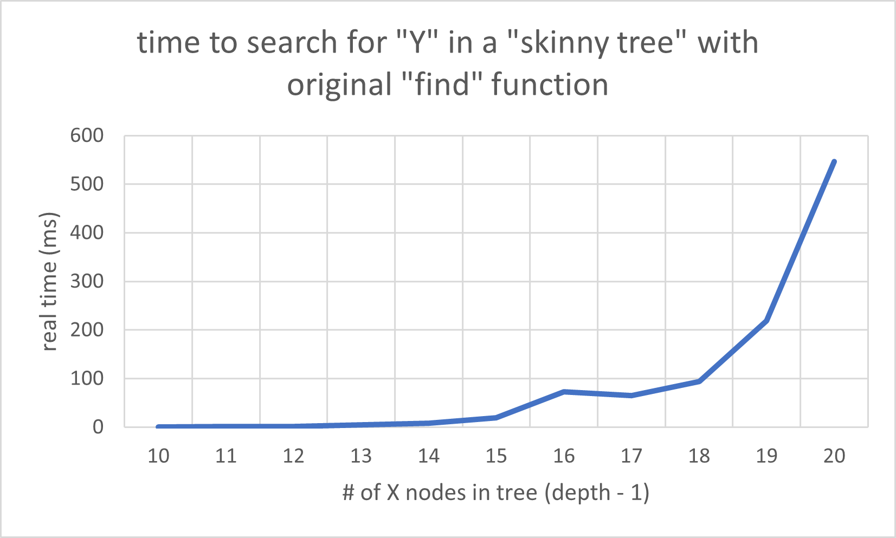
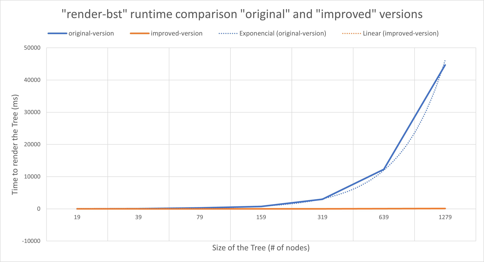

# 8b: Local

## Module Overview

One of the things that separates good programmers from the other kind is taking the time to improve the structure of their code once it is written.

Learning Goals:

- Be able to write well-formed local expressions.
- Be able to diagram lexical scoping on top of expressions using local.
- Be able to hand-evaluate local expressions.
- Be able to use local to encapsulate function definitions.
- Be able to use local to avoid redundant computation.

## Introduction

We will learn a new language construct called a local expression. Local expressions let us have definitions, functions, and constants that are only available within one small part of the program. Then we will look at two important ways to use “local”. One has to do with organizing programs that are large or written by more than one person. Another has to do with dealing with important performance problems that come up when we can’t use local.

## Forming and Intuition

[forming%26Intuition.rkt](https://github.com/squxq/How-to-Code-Complex-Data/blob/week-08b/modules/week-08b/forming%26Intuition/forming%26Intuition.rkt)

Here’s an example of using “local”:

```racket
(local [(define a 1)
        (define b 2)]
  (+ a b))
;; outputs 3
```

Intuitively, for now, the “local” has two parts. It has the definitions and the body. Local definitions exist only inside the local expression; they do not exist outside of it.

Here it is a “local” in which one of the locally defined definitions is a local constant, and the other a function. We can define a “define-struct” aswell.

```racket
(local [(define p "accio")
        (define (fetch n) (string-append p " " n))]
  (fetch "portkey"))
;; outputs "accio portkey"
```

It’s similar, but very different, than this:

```racket
(define p "accio")
(define (fetch n) (string-append p " " n))
(fetch "portkey")
;; ouputs "accio portkey"
```

It’s different in important ways. The previous definitions are called top-level definitions. They are not inside of “local”. The definitions inside “local” are only valid inside “local”

```racket
a
;; outputs a: this variable is not defined
```

This happens because “a” is a local definition, which exists only inside the “local” expression, not outside of it. Local is an expression. To form a local expression:

$$
(local[<definition>...]\\
<expression>)\\
(local[(define\ p "accio")\\
(define\ (fetch\ n)\ (string-append\ p\ "\ "\ n))]\\
(fetch\ "portkey"))
$$

The intuitive way of understanding the local is that it sets up the definitions, it sets up a special world that has these definitions, and the evaluates the body and produces the result.

## Lexical Scoping

[lexicalScoping.rkt](https://github.com/squxq/How-to-Code-Complex-Data/blob/week-08b/modules/week-08b/lexicalScoping/lexicalScoping.rkt)

We have already seen that “local” lets you have definitions that are available inside the “local”. But what does that mean exactly? Are they available outside? What if there’s a definition outside the “local”, and inside “local” that has the same name? What if there is a “local” inside a “local”?

```racket
(define p "incendio")

(local [(define p "accio")
        (define (fetch n) (string-append p " " n))]
  (fetch "portkey"))
;; outputs "accio portkey"
```

Why is the output: “accio portkey”? 

In a program there is a thing called the top-level scope, the global scope. The way to think about that is that there’s a box around the whole program, and every definition in that box is recorded in the box. There is a “p” definition in the top-level scope. Whenever we encounter a “local”, we make another box just around the “local”. This inner box has a definition for “p” and a another for “fetch”.

What do we do whenever we see a reference to a constant or a function? We start right at the reference and go to the innermost enclosing box - a scope contour. We then see if that innermost enclosing scope contour has a definition for that reference. If it doesn’t we go to the nearest enclosing box until we arrive at the global scope.

```racket
(define a 1)
(define b 2)

(+ a
   (local [(define b 3)]
     (+ a b))
   b)
;; outputs 7
```

## Evaluation Rules

[evaluationRules.rkt](https://github.com/squxq/How-to-Code-Complex-Data/blob/week-08b/modules/week-08b/evaluationRules/evaluationRules.rkt)

“local” is an expression, so it doesn’t affect the evaluation of expressions outside of it, like any other expression.

```racket
(define b 1)

(+ b
   (local [(define b 2)]
     (* b b))
   b)
;; outputs 6
```

The first evaluation step is that the first “b” in the primitive call “+” gets replaced by: 1.

The way “local” evaluation works is that three things are going to happen in one step: 

1. Renaming
2. Lifting
3. Replace entire “local” with renamed body

Renaming: rename definitions and all references to definitions, in which the new name must be globally unique. Technically the “renaming” step works in a more subtle way, but this explanation is good enough to understand the evaluation.

Lifting: lift renamed definitions out of the local, into the -top-level scope (not just out of the expression).

The rules for evaluating “local” expressions work to eliminate the “local” from the program, leaving behind a program we already know how to evaluate.

```racket
;; 1st step:
(+ 1
   (local [(define b 2)]
     (* b b))
   b)

;; 2nd step:
(+ 1
   (local [(define b_0 2)]
     (* b_0 b_0))
   b)

;; 3rd step:
(define b_0 2)
(+ 1
   (local []
     (* b_0 b_0))
   b)

;; 4th step:
(+ 1
   (* b_0 b_0)
   b)

;; 5th step:
(+ 1
   (* 2 b_0)
   b)

;; 6th step:
(+ 1
   (* 2 2)
   b)

;; 7th step:
(+ 1
   4
   b)

;; 8th step
(+ 1
   4
   1)

;; 9th step
6
```

Evaluating rules for local expressions:

- rename all definitions and references to those definitions;
- lift renamed definitions to top-level (global scope);
- replace entire local expression with its body, with references renamed.

### Question 13: Problem 1

[problem-01.rkt](https://github.com/squxq/How-to-Code-Complex-Data/blob/week-08b/modules/week-08b/evaluationRules/problem-01.rkt)

> Evaluate the following expression: (list (foo 2) (foo 3))
> 

```racket
(define (foo x)
  (local [(define (bar y) (+ x y))]
          (+ x (bar (* 2 x)))))

; Evaluate the following expression:
(list (foo 2) (foo 3))

;; Step 1:
(list (local [(define (bar y) (+ 2 y))]
          (+ 2 (bar (* 2 2))))
      (foo 3))

;; Step 2:
(define (bar_0 y) (+ 2 y))
(list (+ 2 (bar_0 (* 2 2)))
      (foo 3))

;; Step 3:
(list (+ 2 (bar_0 4))
      (foo 3))

;; Step 4:
(list (+ 2 (+ 2 4))
      (foo 3))

;; Step 5:
(list (+ 2 6)
      (foo 3))

;; Step 6:
(list 8 (foo 3))

;; Step 7:
(list 8
      (local [(define (bar y) (+ 3 y))]
          (+ 3 (bar (* 2 3)))))

;; Step 8:
(define (bar_1 y) (+ 3 y))
(list 8
      (+ 3 (bar_1 (* 2 3))))

;; Step 9:
(list 8
      (+ 3 (bar_1 6)))

;; Step 10:
(list 8
      (+ 3 (+ 3 6)))

;; Step 11:
(list 8
      (+ 3 9))

;; Step 12:
(list 8 12)
```

### Question 14: Evaluate Boo

[evaluate-boo-starter.no-image.rkt](https://github.com/squxq/How-to-Code-Complex-Data/blob/week-08b/modules/week-08b/evaluationRules/evaluate-boo-starter.no-image.rkt)

> Given the following function definition:
> 

```racket
(define (boo x lon)
  (local [(define (addx n) (+ n x))]
    (if (zero? x)
        empty
        (cons (addx (first lon))
              (boo (sub1 x) (rest lon))))))
```

> What is the value of the following expression:
> 
> 
> (boo 2 (list 10 20))
> 
> NOTE: We are not asking you to show the full step-by-step evaluation for
> this problem, but you may want to sketch it out to help you get these
> questions right.
> 

```racket
(list 12 21)
```

> How many function definitions are lifted during the evaluation of the
expression in part A.
> 

```racket
3
;; When x = 2, x = 1, x = 0
```

> Write out the lifted function definition(s). Just the actual lifted function
definitions.
> 

```racket
(define (addx_2 n) (+ n 2))
(define (addx_1 n) (+ n 1))
(define (addx_0 n) (+ n 0))
```

### Question 15: Evaluate Foo

[evaluate-foo-starter.no-image.rkt](https://github.com/squxq/How-to-Code-Complex-Data/blob/week-08b/modules/week-08b/evaluationRules/evaluate-foo-starter.no-image.rkt)

> Hand step the evaluation of (foo 3) given the definition of foo below.
We know that you can use the stepper to check your work - please go
ahead and do that AFTER you try hand stepping it yourself.
> 

```racket
(define (foo n)
  (local [(define x (* 3 n))]
    (if (even? x)
        n
        (+ n (foo (sub1 n))))))

(foo 3)

;; Step 1:
(local [(define x (* 3 3))]
  (if (even? x)
      3
      (+ 3 (foo (sub1 3)))))

;; Step 2:
(define x_0 (* 3 3))
(if (even? x_0)
    3
    (+ 3 (foo (sub1 3))))

;; Step 4:
;(define x_0 9)
(if (even? x_0)
    3
    (+ 3 (foo (sub1 3))))

;; Step 5:
(if (even? 9)
    3
    (+ 3 (foo (sub1 3))))

;; Step 6:
(if #false
    3
    (+ 3 (foo (sub1 3))))

;; Step 7:
(+ 3 (foo (sub1 3)))

;; Step 8:
(+ 3 (foo 2))

;; Step 9:
(+ 3
   (local [(define x (* 3 2))]
     (if (even? x)
         2
         (+ 2 (foo (sub1 2))))))

;; Step 10:
(define x_1 (* 3 2))
(+ 3
   (if (even? x_1)
       2
       (+ 2 (foo (sub1 2)))))

;; Step 11:
;(define x_1 6)
(+ 3
   (if (even? x_1)
       2
       (+ 2 (foo (sub1 2)))))

;; Step 12:
(+ 3
   (if (even? 6)
       2
       (+ 2 (foo (sub1 2)))))

;; Step 12:
(+ 3
   (if #true
       2
       (+ 2 (foo (sub1 2)))))

;; Step 13:
(+ 3 2)

;; Step 14:
5
```

## Encapsulation

[encapsulation.no-image.rkt](https://github.com/squxq/How-to-Code-Complex-Data/blob/week-08b/modules/week-08b/encapsulation/encapsulation.no-image.rkt)

Encapsulation is one of the most fundamental concepts in software engineering. Imagine a large software system with 10, 20, 50, or 100 programmers on it. How likely is it in that situation that two programmers are going to want to use the same function name for two completely different functions? It’s almost guaranteed to happen. That’s the problem encapsulation solves.

Encapsulation lets us take each part of our program and make it into a capsule - a little package that has a bunch of internal functions and constants and structures, and only a small number of external functions and constants and structures.

```racket
(local [(define a 1)
        (define b 2)]
  (+ a b))
;; outputs 3
```

What encapsulation rests on is the observation that “a” and “b” in this example don’t exist in the global scope.

For example, we can replace this code - from functions on mutually recursive data:

```racket
;; Element -> Integer
;; ListOfElement -> Integer
;; produce the sum of all the data in element (and its subs)

;; Stubs:
;(define (sum-data--element e) 0)
;(define (sum-data--loe loe) 0)

;; Tests: <Element>
(check-expect (sum-data--element F1) 1)
(check-expect (sum-data--element D5) 3)
(check-expect (sum-data--element D4) (+ 1 2))
(check-expect (sum-data--element D6) (+ 1 2 3))

;; Tests: <ListOfElement>
(check-expect (sum-data--loe empty) 0)

;; Template: <used template from Element>
(define (sum-data--element e)
  (if (zero? (elt-data e))
       (sum-data--loe (elt-subs e))
       (elt-data e)))

;; Template: <used template from ListOfElement>
(define (sum-data--loe loe)
  (cond [(empty? loe) 0]
        [else
         (+ (sum-data--element (first loe))
              (sum-data--loe (rest loe)))]))
```

With:

```racket
;; Element -> Integer
;; produce the sum of all the data in element (and its subs)

;; Stub:
;(define (sum-data e) 0)

;; Tests: 
(check-expect (sum-data F1) 1)
(check-expect (sum-data D5) 3)
(check-expect (sum-data D4) (+ 1 2))
(check-expect (sum-data D6) (+ 1 2 3))

(define (sum-data e)
  (local [
          (define (sum-data--element e)
            (if (zero? (elt-data e))
                (sum-data--loe (elt-subs e))
                (elt-data e))) 

          (define (sum-data--loe loe)
            (cond [(empty? loe) 0]
                  [else
                   (+ (sum-data--element (first loe))
                      (sum-data--loe (rest loe)))]))]
    (sum-data--element e)))
```

These functions are encapsulated, wrapped in the “local”, so they cannot be seen or called at the top level. At top-level, only sum-data can be called. Since “sum-data” contains the “local” with the definitions for “sum-data—element” and “sum-data—loe”, it encapsulates them. Because of that:

- I only keep the signature of the top-level function;
- I only keep the tests of the top-level function.

In the encapsulation mechanism provided by industrial strength languages, I would still be able to write unit tests for encapsulated functions.

Sometimes we call this line: (sum-data--element e) a trampoline. Because we come to the top of “sum-data”, and bounce off the trampoline into the mutually recursive functions.

To do the encapsulation of some functions:

First thing is to identify some functions that are a good candidate for encapsulation. What makes functions a good candidate for encapsulation is that there are two or more functions that “work together” and the rest of the program only wants to call one function.

Good candidates for encapsulation:

- One function has one or more helpers closely linked to it.
- The outside program really only wants to call the main function, not the helpers.

Then I start by defining the function I want to be seen on the top-level. After that, I start the “local” expression with (”local” and open the definitions part with “[”). I also close the “]”. I, then, write the trampoline calling the appropriate function in the local with the argument passed to the outer function.

The way that this process is so methodical follows the notion of refactoring. Refactoring: changing a program’s code/structure without changing the program’s behavior. Sometimes it is of interest to do a refactoring and then change the behavior, but doing both at the same time should be avoided.

> Do the encapsulation of the following functions:
> 

```racket
;; String Element -> Integer or false 
;; String ListOfElement -> Integer or false???
;; search the given tree for an element with the given name, produce data if found; false otherwise

;; Stubs:
;(define (find--element n e) false)
;(define (find--loe n loe)   false)

;; Tests:
(check-expect (find--loe "F3" empty) false)
(check-expect (find--element "F3" F1) false)
(check-expect (find--element "F3" F3) 3)
(check-expect (find--element "D4" D4) 0)
(check-expect (find--element "D6" D6) 0)
(check-expect (find--loe "F2" (cons F1 (cons F2 empty))) 2)
(check-expect (find--loe "F3" (cons F1 (cons F2 empty))) false)
(check-expect (find--element "F3" D4) false)
(check-expect (find--element "F1" D4) 1)
(check-expect (find--element "F2" D4) 2)
(check-expect (find--element "F1" D6) 1)
(check-expect (find--element "F3" D6) 3)

(define (find--element n e)
  (if (string=? (elt-name e) n)
      (elt-data e) 
      (find--loe n (elt-subs e))))

(define (find--loe n loe)
  (cond [(empty? loe) false]
        [else
         (if (not (false? (find--element n (first loe)))) 
             (find--element n (first loe))
             (find--loe n (rest loe)))]))
```

```racket
;; String Element -> Integer or false 
;; search the given tree for an element with the given name, produce data if found; false otherwise

;; Stub:
;(define (find n e) false)

;; Tests:
(check-expect (find "F3" F1) false)
(check-expect (find "F3" F3) 3)
(check-expect (find "D4" D4) 0)
(check-expect (find "D6" D6) 0)
(check-expect (find "F3" D4) false)
(check-expect (find "F1" D4) 1)
(check-expect (find "F2" D4) 2)
(check-expect (find "F1" D6) 1)
(check-expect (find "F3" D6) 3)

(define (find n e)
  (local [
          (define (find--element n e)
            (if (string=? (elt-name e) n)
                (elt-data e) 
                (find--loe n (elt-subs e))))

          (define (find--loe n loe)
            (cond [(empty? loe) false]
                  [else
                   (if (not (false? (find--element n (first loe)))) 
                       (find--element n (first loe))
                       (find--loe n (rest loe)))]))]
    (find--element n e)))
```

Steps to encapsulation:

1. Group all functions to encapsulate together;
2. Open definition with the new global function name and necessary parameters;
3. Open “local” expression and then the definition part of the “local” with “[” right before the original function definitions;
4. Close the definition part of the “local” with “]” after the original function definitions;
5. Add the trampoline call the right function defined in the “local”;
6. Delete unnecessary signatures, tests and stubs;
7. Rename tests and possibly stubs.

For functions operating on mutually referential types, there are always going to be multiple functions, and they are always going to be together. Maybe I should pre-encapsulate the templates.

```racket
;; Template:
#;
(define (fn-for-element e)
  (local [
          (define (fn-for-element e)
            (... (elt-name e)    ;String
                 (elt-data e)    ;Integer
                 (fn-for-loe (elt-subs e))))

          (define (fn-for-loe loe)
            (cond [(empty? loe) (...)]
                  [else
                   (... (fn-for-element (first loe))
                        (fn-for-loe (rest loe)))]))]
    (fn-for-element e)))
```

There is no need to do a base case unit test.

Encapsulation is vital when multiple programmers work on huge programs since it allows them to choose whatever names they want locally. This allows the programmers to do what’s called namespace management.

When requiring “2htdp/image”, I’m requiring the encapsulation mechanism built into Racket. The “2htdp/image” and “2htdp/universe” libraries contain a lot more functions than we need to make the functions we need to work. When we grab a module of code, there are far more unpublished or hidden names than published names. “local” allows us to support encapsulation.

### Question 16: Problem 1

[problem-01.no-image.rkt](https://github.com/squxq/How-to-Code-Complex-Data/blob/week-08b/modules/week-08b/encapsulation/problem-01.no-image.rkt)

> Recall the following functions from the Mutual Reference module:
> 

```racket
(define-struct person (name age children))
;; Person is (make-person String Natural ListOfPeople)
;; interp. a person with first name, age and a list of their children

;; ListOfPeople is one of:
;; - empty
;; - (cons Person ListOfPeople)
;; interp. a list of people

;; Examples: <Person>
(define P1 (make-person "John" 2 empty))
(define P2 (make-person "Mary" 10 empty))
(define P3 (make-person "Elisabeth" 29 (list P1 P2)))
(define P4 (make-person "Harry" 15 empty))
(define P5 (make-person "George" 36 (list P4)))
(define P6 (make-person "Grandma" 67 (list P3 P5)))

;; Examples: <ListOfPeople>
(define LOP1 empty)
(define LOP2 (list P1 P2))
(define LOP3 (list P4))
(define LOP4 (list P3 P5))

;; Template:
#;
(define (fn-for-person p)
  (local [
          (define (fn-for-person p)
            (... (person-name p) (person-age p) (person-children p)))

          (define (fn-for-lop lop)
            (cond [(empty? lop) (...)]
                  [else
                   (... (fn-for-person (first lop))
                        (fn-for-lop (rest lop)))]))]
    (fn-for-person p)))

;;; Person -> ListOfString
;;; ListOfPerson -> ListOfString
;;; produce a list of the names of the persons under 20
;
;(check-expect (names-under-20--person P1) (list "N1"))
;(check-expect (names-under-20--lop empty) empty)
;(check-expect (names-under-20--person P2) (list "N1"))
;(check-expect (names-under-20--person P4) (list "N3" "N1"))
;
;(define (names-under-20--person p)
;  (if (< (person-age p) 20)
;      (cons (person-name p)
;            (names-under-20--lop (person-children p)))
;      (names-under-20--lop (person-children p))))
;      
;(define (names-under-20--lop lop)
;  (cond [(empty? lop) empty]
;        [else
;         (append (names-under-20--person (first lop))
;                 (names-under-20--lop (rest lop)))]))
```

> The function that other parts of the program are interested in is names-under-20--person.Let's call the new function names-under-20.
> 
> 
> Encapsulate the functions names-under-20--person and names-under-20--lop using local.
> 

```racket
;; Person -> ListOfString
;; produce a list of the names of the persons under 20

(check-expect (names-under-20 P1) (list "John"))
(check-expect (names-under-20 P2) (list "Mary"))
(check-expect (names-under-20 P3) (list "John" "Mary"))
(check-expect (names-under-20 P4) (list "Harry"))
(check-expect (names-under-20 P5) (list "Harry"))
(check-expect (names-under-20 P6) (list "John" "Mary" "Harry"))

(define (names-under-20 p)
  (local [
          (define (names-under-20--person p)
            (if (< (person-age p) 20)
                (cons (person-name p)
                      (names-under-20--lop (person-children p)))
                (names-under-20--lop (person-children p))))
      
          (define (names-under-20--lop lop)
            (cond [(empty? lop) empty]
                  [else
                   (append (names-under-20--person (first lop))
                           (names-under-20--lop (rest lop)))]))]
    (names-under-20--person p)))
```

### Question 17: Problem 2

[problem-02.no-image.rkt](https://github.com/squxq/How-to-Code-Complex-Data/blob/week-08b/modules/week-08b/encapsulation/problem-02.no-image.rkt)

> Encapsulation doesn't just work with mutually recursive functions.
As a guideline, it is valuable whenever one function is useful at top-level,
and it has one or more helpers that are not useful at top level.
With that in mind, let's look at using encapsulation with a sorting example similar
to what you saw in the arrange-images problem from the Function Composition lecture.
> 
> 
> Go ahead and encapsulate sort-lon and insert using local.
> 

```racket
;;; ListOfNumber -> ListOfNumber
;;; sort the numbers in lon in increasing order
;
;;; Tests:
;(check-expect (sort-lon empty) empty)
;(check-expect (sort-lon (list 1)) (list 1))
;(check-expect (sort-lon (list 1 2 3)) (list 1 2 3))
;(check-expect (sort-lon (list 2 1 3)) (list 1 2 3))
;(check-expect (sort-lon (list 3 2 1)) (list 1 2 3))
;
;(define (sort-lon lon)
;  (cond [(empty? lon) empty]
;        [else
;         (insert (first lon)
;                 (sort-lon (rest lon)))]))
;                 
;;; Number ListOfNumber -> ListOfNumber
;;; insert n in proper position in lon
;;; ASSUME: lon is sorted in increasing order
;
;;; Tests:
;(check-expect (insert 2 empty) (list 2))
;(check-expect (insert 2 (list 1 3)) (list 1 2 3))
;
;(define (insert n lon)
;  (cond [(empty? lon) (cons n empty)]
;        [else
;         (if (> (first lon) n)
;             (cons n lon)
;             (cons (first lon) (insert n (rest lon))))]))

;; ListOfNumber -> ListOfNumber
;; sort the numbers in lon in increasing order

;; Tests:
(check-expect (sort-lon empty) empty)
(check-expect (sort-lon (list 1)) (list 1))
(check-expect (sort-lon (list 1 2 3)) (list 1 2 3))
(check-expect (sort-lon (list 2 1 3)) (list 1 2 3))
(check-expect (sort-lon (list 3 2 1)) (list 1 2 3))

(define (sort-lon lon)
  (local [
          (define (sort-lon lon)
            (cond [(empty? lon) empty]
                  [else
                   (insert (first lon)
                           (sort-lon (rest lon)))]))
          
          ;; Number ListOfNumber -> ListOfNumber
          ;; insert n in proper position in lon
          ;; ASSUME: lon is sorted in increasing order
          (define (insert n lon)
            (cond [(empty? lon) (cons n empty)]
                  [else
                   (if (> (first lon) n)
                       (cons n lon)
                       (cons (first lon) (insert n (rest lon))))]))]
    (sort-lon lon)))
```

### Question 18: Encapsulate Total Area

[encapsulate-total-area-starter.no-image.rkt](https://github.com/squxq/How-to-Code-Complex-Data/blob/week-08b/modules/week-08b/encapsulation/encapsulate-total-area-starter.no-image.rkt)

> In this exercise you will be need to remember the following DDs
for an image organizer.
> 

```racket
(define-struct dir (name sub-dirs images))
;; Dir is (make-dir String ListOfDir ListOfImage)
;; interp. An directory in the organizer, with a name, a list
;;         of sub-dirs and a list of images.

;; ListOfDir is one of:
;;  - empty
;;  - (cons Dir ListOfDir)
;; interp. A list of directories, this represents the sub-directories of
;;         a directory.

;; ListOfImage is one of:
;;  - empty
;;  - (cons Image ListOfImage)
;; interp. a list of images, this represents the sub-images of a directory.
;; NOTE: Image is a primitive type, but ListOfImage is not.

;; Examples:
(define I1 (square 10 "solid" "red"))
(define I2 (square 12 "solid" "green"))
(define I3 (rectangle 13 14 "solid" "blue"))
(define D4 (make-dir "D4" empty (list I1 I2)))
(define D5 (make-dir "D5" empty (list I3)))
(define D6 (make-dir "D6" (list D4 D5) empty))
```

> Remember the functions we wrote last week to calculate the total area
of all images in an image organizer.
> 
> 
> Use local to encapsulate the functions so that total-area-dir, total-area--lod,
> total-area--loi and image-area are private to a new function called total-area.
> Be sure to revise the signature, purpose, tests etc.
> 

```racket
;; Dir -> Natural
;; produce total area of all images in dir

;; Stub:
;(define (total-area d) 0)

;; Tests:
(check-expect (total-area D4) (+ (* 10 10) (* 12 12)))
(check-expect (total-area D5) (* 13 14))
(check-expect (total-area D6) (+ (* 10 10) (* 12 12) (* 13 14)))

(define (total-area d)
  (local [
          (define (total-area--dir d)
            (+ (total-area--lod (dir-sub-dirs d))
               (total-area--loi (dir-images d))))

          (define (total-area--lod lod)
            (cond [(empty? lod) 0]
                  [else
                   (+ (total-area--dir (first lod))
                      (total-area--lod (rest lod)))]))

          (define (total-area--loi loi)
            (cond [(empty? loi) 0]
                  [else
                   (+ (image-area (first loi))          
                      (total-area--loi (rest loi)))]))

          ;; Image -> Natural
          ;; produce area of image (width * height

          (define (image-area img)
            (* (image-width img)
               (image-height img)))]
    (total-area--dir d)))
```

## Avoiding Recomputation

[avoidingRecomputation.no-image.rkt](https://github.com/squxq/How-to-Code-Complex-Data/blob/week-08b/modules/week-08b/avoidingRecomputation/avoidingRecomputation.no-image.rkt)

[avoidingRecomputation.png](https://github.com/squxq/How-to-Code-Complex-Data/blob/week-08b/modules/week-08b/avoidingRecomputation/avoidingRecomputation.png)

It is very easy for programmers to worry too much about efficiency, too soon about efficiency, or to worry just plain incorrectly about efficiency. As a general rule, it’s a better idea to design a simple program that’s easy to understand and easy to change and worry about efficiency later, once the program is running. Some of the things I thought would be performance problems get taken care of automatically by the programming language implementation, but others turn out not to be. And then, unfortunately, some other things that I didn’t think would be performance problems turn out to be.

There is one category of performance problems I need to fix as part of the design. That has to do with problems of exponential growth in the time it takes my program or to run as the data gets larger.

```racket
;; Data definitions:

(define-struct elt (name data subs))
;; Element is (make-elt String Integer ListOfElement)
;; interp. An element in the file system, with name, and EITHER data or subs.
;;         If data is 0, then subs is considered to be list of sub elements.
;;         If data is not 0, then subs is ignored.

;; ListOfElement is one of:
;;  - empty
;;  - (cons Element ListOfElement)
;; interp. A list of file system Elements

(define F1 (make-elt "F1" 1 empty))
(define F2 (make-elt "F2" 2 empty))
(define F3 (make-elt "F3" 3 empty))
(define D4 (make-elt "D4" 0 (list F1 F2)))
(define D5 (make-elt "D5" 0 (list F3)))
(define D6 (make-elt "D6" 0 (list D4 D5)))
#;
(define (fn-for-element e)
  (local [(define (fn-for-element e)
            (... (elt-name e)    ;String
                 (elt-data e)    ;Integer
                 (fn-for-loe (elt-subs e))))
          
          (define (fn-for-loe loe)
            (cond [(empty? loe) (...)]
                  [else
                   (... (fn-for-element (first loe))
                        (fn-for-loe (rest loe)))]))]
    
    (fn-for-element e)))

;; Functions:

;; Natural -> Element
;; produce a skinny tree n+1 deep, leaf has name "Y" data 1
(check-expect (make-skinny 0) (make-elt "Y" 1 empty))
(check-expect (make-skinny 2) (make-elt "X" 0 (list (make-elt "X" 0 (list (make-elt "Y" 1 empty))))))

(define (make-skinny n)
  (cond [(zero? n) (make-elt "Y" 1 empty)]
        [else
         (make-elt "X" 0 (list (make-skinny (sub1 n))))]))
```

> Design a function that consumes String and Element and looks for a data element with the given name. If it finds that element it produces the data, otherwise it produces false.
> 

```racket
;; String Element -> Integer or false 
;; search the given tree for an element with the given name, produce data if found; false otherwise
(check-expect (find "F3" F1) false)
(check-expect (find "F3" F3) 3)
(check-expect (find "D4" D4) 0)
(check-expect (find "D6" D6) 0)
(check-expect (find "F3" D4) false)
(check-expect (find "F1" D4) 1)
(check-expect (find "F2" D4) 2)
(check-expect (find "F1" D6) 1)
(check-expect (find "F3" D6) 3)

;(define (find n e) false) ;stubs

(define (find n e)
  (local [(define (find--element n e)
            (if (string=? (elt-name e) n)
                (elt-data e) 
                (find--loe n (elt-subs e))))
          
          (define (find--loe n loe)
            (cond [(empty? loe) false]
                  [else
                     (if (not (false? (find--element n (first loe)))) 
                         (find--element n (first loe))
                         (find--loe n (rest loe)))]))]
    
    (find--element n e)))

(time (find "Y" (make-skinny 10)))
(time (find "Y" (make-skinny 11)))
(time (find "Y" (make-skinny 12)))
(time (find "Y" (make-skinny 13)))
(time (find "Y" (make-skinny 14)))
(time (find "Y" (make-skinny 15)))
(time (find "Y" (make-skinny 16)))
(time (find "Y" (make-skinny 17)))
(time (find "Y" (make-skinny 18)))
(time (find "Y" (make-skinny 19)))
(time (find "Y" (make-skinny 20)))
```

“time” evaluates its operands and returns the time it took to evaluate them. “time” output:

```racket
cpu time: 0 real time: 0 gc time: 0
1
cpu time: 0 real time: 1 gc time: 0
1
cpu time: 0 real time: 2 gc time: 0
1
cpu time: 0 real time: 5 gc time: 0
1
cpu time: 15 real time: 8 gc time: 0
1
cpu time: 15 real time: 19 gc time: 0
1
cpu time: 78 real time: 73 gc time: 46
1
cpu time: 62 real time: 65 gc time: 0
1
cpu time: 109 real time: 94 gc time: 0
1
cpu time: 218 real time: 219 gc time: 31
1
cpu time: 546 real time: 547 gc time: 78
1
```

Here, we can see that as the tree gets deeper and deeper it takes twice as long to run.



The problem this program has is in a branch where it finds the value it’s looking for, it searches in that branch twice.

We need to use “local” to avoid recomputing the same value twice. Here is the systematic way to do it:

1. find nearest enclosing expression containing the multiple computations;
2. wrap the nearest enclosing expression in “local”;
3. define the result of the computation in the local definitions; we call it “try” because we’re trying to search down that branch of the tree;
4. replace the computation with the name it is given in the “local”;
5. close the “local”.

Result:

```racket
cpu time: 0 real time: 0 gc time: 0
1
cpu time: 0 real time: 0 gc time: 0
1
cpu time: 0 real time: 0 gc time: 0
1
cpu time: 0 real time: 0 gc time: 0
1
cpu time: 0 real time: 0 gc time: 0
1
cpu time: 0 real time: 0 gc time: 0
1
cpu time: 0 real time: 0 gc time: 0
1
cpu time: 0 real time: 0 gc time: 0
1
cpu time: 0 real time: 0 gc time: 0
1
cpu time: 0 real time: 0 gc time: 0
1
cpu time: 0 real time: 0 gc time: 0
1
```

What this does: look in the first child once and define that result as “try”. So when it is referenced later, we don’t compute it again, we just take the value from “try”.

Using “local” to avoid recomputation was “worth it” here because exponential growth is very bad when it comes to computation time. We had exponential growth because of the recursive nature of the function.

Here is something not encouraged to do: if a function takes an argument that it consumes and adds one to it, twice, using “local” to avoid the computation of adding one twice isn’t worth doing. That’s going to make the program harder to read for no performance gain at all. Programming language implementations are good at spotting things like that and doing them automatically.

### Question 19: Render BST with Lines Faster

[render-bst-w-lines-faster-starter.no-image.rkt](https://github.com/squxq/How-to-Code-Complex-Data/blob/week-08b/modules/week-08b/avoidingRecomputation/render-bst-w-lines-faster-starter.no-image.rkt)

[render-bst-w-lines-faster-starter.rkt](https://github.com/squxq/How-to-Code-Complex-Data/blob/week-08b/modules/week-08b/avoidingRecomputation/render-bst-w-lines-faster-starter.rkt)

[render-bst-w-lines-faster-performance.png](https://github.com/squxq/How-to-Code-Complex-Data/blob/week-08b/modules/week-08b/avoidingRecomputation/render-bst-w-lines-faster-performance.png)

> Design a function that consumes a bst and produces a SIMPLE rendering of that bst including lines between nodes and their subnodes.
> 

```racket
;; Constants

(define TEXT-SIZE  14)
(define TEXT-COLOR "BLACK")

(define KEY-VAL-SEPARATOR ":")

(define MTTREE (rectangle 20 1 "solid" "white"))

;; Data definitions:

(define-struct node (key val l r))
;; A BST (Binary Search Tree) is one of:
;;  - false
;;  - (make-node Integer String BST BST)
;; interp. false means no BST, or empty BST
;;         key is the node key
;;         val is the node val
;;         l and r are left and right subtrees
;; INVARIANT: for a given node:
;;     key is > all keys in its l(eft)  child
;;     key is < all keys in its r(ight) child
;;     the same key never appears twice in the tree

; (open image file)

;; Examples:
(define BST0 false)
(define BST1 (make-node 1 "abc" false false))
(define BST7 (make-node 7 "ruf" false false)) 
(define BST4 (make-node 4 "dcj" false (make-node 7 "ruf" false false)))
(define BST3 (make-node 3 "ilk" BST1 BST4))
(define BST42 
  (make-node 42 "ily"
             (make-node 27 "wit" (make-node 14 "olp" false false) false)
             (make-node 50 "dug" false false)))
(define BST10
  (make-node 10 "why" BST3 BST42))
(define BST100 
  (make-node 100 "large" BST10 false))

;; Template:
#;
(define (fn-for-bst t)
  (cond [(false? t) (...)]
        [else
         (... (node-key t)    ;Integer
              (node-val t)    ;String
              (fn-for-bst (node-l t))
              (fn-for-bst (node-r t)))]))

;; Template rules used:
;;  - one of: 2 cases
;;  - atomic-distinct: false
;;  - compound: (make-node Integer String BST BST)
;;  - self reference: (node-l t) has type BST
;;  - self reference: (node-r t) has type BST

;; Functions:

;; Original Version:

;; BST -> Image
;; produce SIMPLE rendering of bst
;; ASSUME BST is relatively well balanced

;; Tests:
(check-expect (render-bst false) MTTREE)
(check-expect (render-bst BST1)
              (above (render-key-val 1 "abc") 
                     (lines (image-width (render-bst false))
                            (image-width (render-bst false)))
                     (beside (render-bst false)
                             (render-bst false))))

;; Template: <used template from BST>
(define (render-bst bst)
  (cond [(false? bst) MTTREE]
        [else
         (above (render-key-val (node-key bst) (node-val bst))
                (lines (image-width (render-bst (node-l bst)))
                       (image-width (render-bst (node-r bst))))
                (beside (render-bst (node-l bst))
                        (render-bst (node-r bst))))]))

;; Integer String -> Image
;; render key and value to form the body of a node

;; Tests:
(check-expect (render-key-val 99 "foo") 
              (text (string-append "99" KEY-VAL-SEPARATOR "foo") TEXT-SIZE TEXT-COLOR))

(define (render-key-val k v)
  (text (string-append (number->string k)
                       KEY-VAL-SEPARATOR
                       v)
        TEXT-SIZE
        TEXT-COLOR))

;; Natural Natural -> Image
;; produce lines to l/r subtrees based on width of those subtrees

;; Tests:
(check-expect (lines 60 130)
              (add-line (add-line (rectangle (+ 60 130) (/ 190 4) "solid" "white")
                                  (/ (+ 60 130) 2) 0
                                  (/ 60 2)         (/ 190 4)
                                  "black")
                        (/ (+ 60 130) 2) 0
                        (+ 60 (/ 130 2)) (/ 190 4)
                        "black"))

(define (lines lw rw)
  (add-line (add-line (rectangle (+ lw rw) (/ (+ lw rw) 4) "solid" "white")  ;background
                      (/ (+ lw rw) 2)  0
                      (/ lw 2)         (/ (+ lw rw) 4)
                      "black")
            (/ (+ lw rw) 2)  0
            (+ lw (/ rw 2))  (/ (+ lw rw) 4)
            "black"))

(define BSTA (make-node 101 "A" BST10 BST10))
(define BSTB (make-node 102 "B" BSTA BSTA))
(define BSTC (make-node 103 "C" BSTB BSTB))
(define BSTD (make-node 104 "D" BSTC BSTC))
(define BSTE (make-node 105 "E" BSTD BSTD))
(define BSTF (make-node 106 "F" BSTE BSTE))
(define BSTG (make-node 107 "G" BSTF BSTF))

"time:"
(time (rest (list (render-bst BSTA))))
(time (rest (list (render-bst BSTB))))
(time (rest (list (render-bst BSTC))))
(time (rest (list (render-bst BSTD))))
(time (rest (list (render-bst BSTE))))
(time (rest (list (render-bst BSTF))))
(time (rest (list (render-bst BSTG))))
```

“time” output:

```racket
"time:"
cpu time: 15 real time: 13 gc time: 0
'()
cpu time: 62 real time: 50 gc time: 0
'()
cpu time: 281 real time: 288 gc time: 15
'()
cpu time: 750 real time: 741 gc time: 0
'()
cpu time: 2953 real time: 2979 gc time: 125
'()
cpu time: 12187 real time: 12297 gc time: 687
'()
cpu time: 44328 real time: 44666 gc time: 296
'()
```

> Uncomment out the definitions and expressions below, and then construct a simple graph with the size of the tree on the x-axis and the time it takes to render it on the y-axis. How
does the time it takes to render increase as a function of the size of the tree? If you can, improve the performance of render-bst.
> 
> 
> There is also at least one other good way to use local in this program. Try it.
> 

```racket
;; Improved Version:

;; BST -> Image
;; produce SIMPLE rendering of bst
;; ASSUME BST is relatively well balanced

;; Stub:
;(define (render-bst bst) empty-image)

;; Tests:
(check-expect (render-bst false) empty-image)
(check-expect (render-bst BST1) (render-key-val 1 "abc"))
(check-expect (render-bst BST7) (render-key-val 7 "ruf"))
(check-expect (render-bst BST4)
              (local [(define render (render-bst BST7))
                      (define render-width (image-width render))]
                (above (render-key-val 4 "dcj")
                         Y-SEPARATOR (create-lines render-width false) Y-SEPARATOR render)))
(check-expect (render-bst BST3)
              (local [(define left-render (render-bst BST1))
                      (define right-render (render-bst BST4))
                      (define left-width (image-width left-render))
                      (define right-width (image-width right-render))]
                (above (render-key-val 3 "ilk")
                         Y-SEPARATOR (create-lines left-width right-width) Y-SEPARATOR
                         (beside/align "top" left-render X-SEPARATOR right-render))))
(check-expect (render-bst (make-node 14 "olp" false false)) (render-key-val 14 "olp"))
(check-expect (render-bst (make-node 50 "dug" false false)) (render-key-val 50 "dug"))
(check-expect (render-bst (make-node 27 "wit" (make-node 14 "olp" false false) false))
              (local [(define render (render-bst (make-node 14 "olp" false false)))
                      (define render-width (image-width render))]
                (above (render-key-val 27 "wit")
                         Y-SEPARATOR (create-lines render-width false) Y-SEPARATOR render)))
(check-expect (render-bst BST42)
              (local [(define left-render
                        (render-bst (make-node 27 "wit" (make-node 14 "olp" false false) false)))
                      (define right-render
                        (render-bst (make-node 50 "dug" false false)))
                      (define left-width (image-width left-render))
                      (define right-width (image-width right-render))]
                (above (render-key-val 42 "ily")
                         Y-SEPARATOR (create-lines left-width right-width) Y-SEPARATOR
                         (beside/align "top" left-render X-SEPARATOR right-render))))
(check-expect (render-bst BST10)
              (local [(define left-render (render-bst BST3))
                      (define right-render (render-bst BST42))
                      (define left-width (image-width left-render))
                      (define right-width (image-width right-render))]
                (above (render-key-val 10 "why")
                         Y-SEPARATOR (create-lines left-width right-width) Y-SEPARATOR
                         (beside/align "top" left-render X-SEPARATOR right-render))))
(check-expect (render-bst BST100)
              (local [(define render (render-bst BST10))
                      (define render-width (image-width render))]
                (above (render-key-val 100 "large")
                         Y-SEPARATOR (create-lines render-width false) Y-SEPARATOR render)))

;; Improved version:
(define (render-bst bst)
  (cond [(false? bst) empty-image]
        [(and (false? (node-l bst)) (false? (node-r bst)))
         (render-key-val (node-key bst) (node-val bst))]
        [else
         (local [(define left-render (render-bst (node-l bst)))
                 (define right-render (render-bst (node-r bst)))
                 (define left-width (image-width left-render))
                 (define right-width (image-width right-render))]
           (cond [(and (not (false? (node-l bst))) (not (false? (node-r bst))))
                  (above (render-key-val (node-key bst) (node-val bst))
                         Y-SEPARATOR (create-lines left-width right-width) Y-SEPARATOR
                         (beside/align "top" left-render X-SEPARATOR right-render))]
                 [(not (false? (node-l bst)))
                  (above (render-key-val (node-key bst) (node-val bst))
                         Y-SEPARATOR (create-lines left-width false) Y-SEPARATOR left-render)]
                 [else
                  (above (render-key-val (node-key bst) (node-val bst))
                         Y-SEPARATOR (create-lines right-width false) Y-SEPARATOR right-render)]))]))

;; Integer String -> Image
;; render key and value to form the body of a node

;; Stub:
;(define (render-key-val k v) empty-image)

;; Tests:
(check-expect (render-key-val 1 "abc")
              (text (string-append "1" KEY-VAL-SEPARATOR "abc") TEXT-SIZE TEXT-COLOR))
(check-expect (render-key-val 7 "ruf")
              (text (string-append "7" KEY-VAL-SEPARATOR "ruf") TEXT-SIZE TEXT-COLOR))
(check-expect (render-key-val 4 "dcj")
              (text (string-append "4" KEY-VAL-SEPARATOR "dcj") TEXT-SIZE TEXT-COLOR))
(check-expect (render-key-val 3 "ilk")
              (text (string-append "3" KEY-VAL-SEPARATOR "ilk") TEXT-SIZE TEXT-COLOR))
(check-expect (render-key-val 27 "wit")
              (text (string-append "27" KEY-VAL-SEPARATOR "wit") TEXT-SIZE TEXT-COLOR))
(check-expect (render-key-val 42 "ily")
              (text (string-append "42" KEY-VAL-SEPARATOR "ily") TEXT-SIZE TEXT-COLOR))
(check-expect (render-key-val 10 "why")
              (text (string-append "10" KEY-VAL-SEPARATOR "why") TEXT-SIZE TEXT-COLOR))
(check-expect (render-key-val 100 "large")
              (text (string-append "100" KEY-VAL-SEPARATOR "large") TEXT-SIZE TEXT-COLOR))
(check-expect (render-key-val 99 "foo") 
              (text (string-append "99" KEY-VAL-SEPARATOR "foo") TEXT-SIZE TEXT-COLOR))

(define (render-key-val k v)
  (text (string-append (number->string k) KEY-VAL-SEPARATOR v) TEXT-SIZE TEXT-COLOR))

;; Natural (Natural or false) -> Image
;; produce lines to l/r subtrees based on width of those subtrees, w1 and w2, (if they exist)
;; NOTE: if (false? w2) then there is only one child, otherwise there are two children

;; Stub:
;(define (create-lines w1 w2) empty-image)

;; Tests:
(check-expect (create-lines 30 false)
              (add-line (rectangle 30 LINE-HEIGHT "solid" "white")
                      15 0 15 LINE-HEIGHT "black"))
(check-expect (create-lines 60 130)
              (add-line (add-line (rectangle (+ 60 130) LINE-HEIGHT "solid" "white")
                                  (/ (+ 60 130) 2) 0
                                  (/ 60 2)         LINE-HEIGHT
                                  "black")
                        (/ (+ 60 130) 2) 0
                        (+ 60 (/ 130 2)) LINE-HEIGHT
                        "black"))

(define (create-lines w1 w2)
  (local [(define (create-line w)
            (add-line (rectangle w LINE-HEIGHT "solid" "white")
                      (/ w 2) 0 (/ w 2) LINE-HEIGHT "black"))
          (define (create-lines lw rw)
            (add-line (add-line (rectangle (+ lw rw) LINE-HEIGHT "solid" "white")
                                (/ (+ lw rw) 2)  0
                                (/ lw 2)         LINE-HEIGHT
                                "black")
                      (/ (+ lw rw) 2)  0
                      (+ lw (/ rw 2))  LINE-HEIGHT
                      "black"))]
    (if (false? w2)
        (create-line w1)
        (create-lines w1 w2))))

;; BST -> Natural
;; given a bst return its size (number of nodes)

;; Stub:
;(define (size-bst bst) 0)

;; Tests:
(check-expect (size-bst BST0) 0)
(check-expect (size-bst BST1) 1)
(check-expect (size-bst BST7) 1)
(check-expect (size-bst BST4) 2)
(check-expect (size-bst BST3) 4)
(check-expect (size-bst BST42) 4)
(check-expect (size-bst BST10) 9)
(check-expect (size-bst BST100) 10)

(define (size-bst bst)
  (cond [(false? bst) 0]
        [else
         (+ 1 (size-bst (node-l bst))
              (size-bst (node-r bst)))]))

;; These trees are NOT legal binary SEARCH trees.
;; But for tests on rendering speed that won't matter.
;; Just don't try searching in them!

(define BSTA (make-node 101 "A" BST10 BST10))
(define BSTB (make-node 102 "B" BSTA BSTA))
(define BSTC (make-node 103 "C" BSTB BSTB))
(define BSTD (make-node 104 "D" BSTC BSTC))
(define BSTE (make-node 105 "E" BSTD BSTD))
(define BSTF (make-node 106 "F" BSTE BSTE))
(define BSTG (make-node 107 "G" BSTF BSTF))

"time:"
(time (rest (list (render-bst BSTA))))
(time (rest (list (render-bst BSTB))))
(time (rest (list (render-bst BSTC))))
(time (rest (list (render-bst BSTD))))
(time (rest (list (render-bst BSTE))))
(time (rest (list (render-bst BSTF))))
(time (rest (list (render-bst BSTG))))

"size:"
(size-bst BSTA)
(size-bst BSTB)
(size-bst BSTC)
(size-bst BSTD)
(size-bst BSTE)
(size-bst BSTF)
(size-bst BSTG)
```

Output:

```racket
"time:"
cpu time: 0 real time: 2 gc time: 0
'()
cpu time: 0 real time: 2 gc time: 0
'()
cpu time: 15 real time: 5 gc time: 0
'()
cpu time: 0 real time: 10 gc time: 0
'()
cpu time: 15 real time: 20 gc time: 15
'()
cpu time: 46 real time: 43 gc time: 0
'()
cpu time: 78 real time: 88 gc time: 0
'()
"size:"
19
39
79
159
319
639
1279
```



### Question 20: Championship Bracket Improved

[championship-bracket-improved-starter.no-image.rkt](https://github.com/squxq/How-to-Code-Complex-Data/blob/week-08b/modules/week-08b/avoidingRecomputation/championship-bracket-improved-starter.no-image.rkt)

[championship-bracket-improved-starter.rkt](https://github.com/squxq/How-to-Code-Complex-Data/blob/week-08b/modules/week-08b/avoidingRecomputation/championship-bracket-improved-starter.rkt)

> Recall the USA Ultimate championship bracket problem from Two One-Of module.
> 
> 
> In this problem, you will be asked to improve a function called ouster using local, which is provided at the end of this file.
> 
> The weekend of October 17-20, 2013, USA Ultimate held its annual national
> championships tournament in Frisco, Texas.
> 
> Here is a diagram of the results:
> 
> (open image file)
> 
> (Taken from [http://scores.usaultimate.org/scores/#womens/tournament/13774](http://scores.usaultimate.org/scores/#womens/tournament/13774))
> See [http://en.wikipedia.org/wiki/Bracket_(tournament)](http://en.wikipedia.org/wiki/Bracket_(tournament)) for an explanation of
> tournament brackets.
> 

```racket
(define-struct bracket (team-won team-lost br-won br-lost))
;; Bracket is one of:
;; - false
;; - (make-bracket String String Bracket Bracket)
;; interp.  A tournament competition bracket.
;;    false indicates an empty bracket.
;;    (make-bracket t1 t2 br1 br2) means that 
;;    - team t1 beat team t2, and
;;    - br1 represents team t1's bracket leading up to this match.
;;    - br2 represents team t2's bracket leading up to this match.

;;Examples:
(define B0 false)  ; an empty tournament bracket,

;; Real bracket examples are named using the bracket letter from the figure.
(define BE                                         ; 1st round match-up:
  (make-bracket "Riot" "Schwa" false false))       ; - Riot defeat Schwa

(define BF                                         ; 1st round match-up:
  (make-bracket "Nemesis" "Ozone" false false))    ; - Nemesis defeat Ozone

(define BG                                         ; 1st round match-up:
  (make-bracket "Scandal" "Phoenix" false false))  ; - Scandal defeat Phoenix

(define BH                                         ; 1st round match-up:
  (make-bracket "Capitals" "Traffic" false false)) ; - Capitals defeat Traffic

(define BK                                         ; 2nd Round match-up:
  (make-bracket "Riot" "Nemesis" BE BF))           ; - Riot defeat Nemesis

(define BL                                         ; 2nd round match-up:
  (make-bracket "Scandal" "Capitals" BG BH))       ; - Scandal defeat Capitals

(define BN                                         ; 3rd round match-up:
  (make-bracket "Scandal" "Riot" BL BK))           ; -  Scandal defeat Riot

;; Template:
#;
(define (fn-for-bracket br)
  (cond [(false? br) (...)]
        [else
         (... (bracket-team-won br)
              (bracket-team-lost br)
              (fn-for-bracket (bracket-br-won br))
              (fn-for-bracket (bracket-br-lost br)))]))
  
  
;; ListOfTeam is one of:
;; - empty
;; - (cons String ListOfTeam)
;; interp. A list of team names
(define T0 empty)  ; no teams
(define T2 (list "Scandal" "Traffic"))

;; Template:
#;
(define (fn-for-lot lot)
  (cond [(empty? lot) (...)]
        [else
         (... (first lot)
              (fn-for-lot (rest lot)))]))
```

> In a tournament, there may be only one champion, but there can be many winners...and losers. Below is a function that takes a bracket and a team and produces the name of the team that knocked the given team out of the tournament, or false if there's no such team in the bracket (either because the team never lost or the given team was not in the bracket).
> 
> 
> Use the local expression form to improve the function.  Briefly, state one justification for using local in this case (there may be more than one).
> 

```racket
;; String Bracket -> String or false
;; produce the team that knocked out (i.e. ousted) t in bracket br,              
;; or false if there isn't one.

;; Stub:
;(define (ouster t br) false)

;; Tests:
(check-expect (ouster "Nemesis" false) false)
(check-expect (ouster "Scandal" BN) false)
(check-expect (ouster "Nemesis" BN) "Riot")
(check-expect (ouster "Traffic" BN) "Capitals")

(define (ouster t br)
  (cond [(false? br) false]
        [else
         (if (string=? t (bracket-team-lost br))
             (bracket-team-won br)
             (local [(define winning-team-ouster (ouster t (bracket-br-won br)))]
               (if (not (false? winning-team-ouster))
                   winning-team-ouster
                   (ouster t (bracket-br-lost br)))))]))

;Here, "local" makes sense when defining a common element, used twice in the if statement it involves.   
;As a result, recomputing the constant’s value is unnecessary, improving overall function runtime.
;The "local" statement is added in the inner if statement to prevent unnecessary calculations.
```