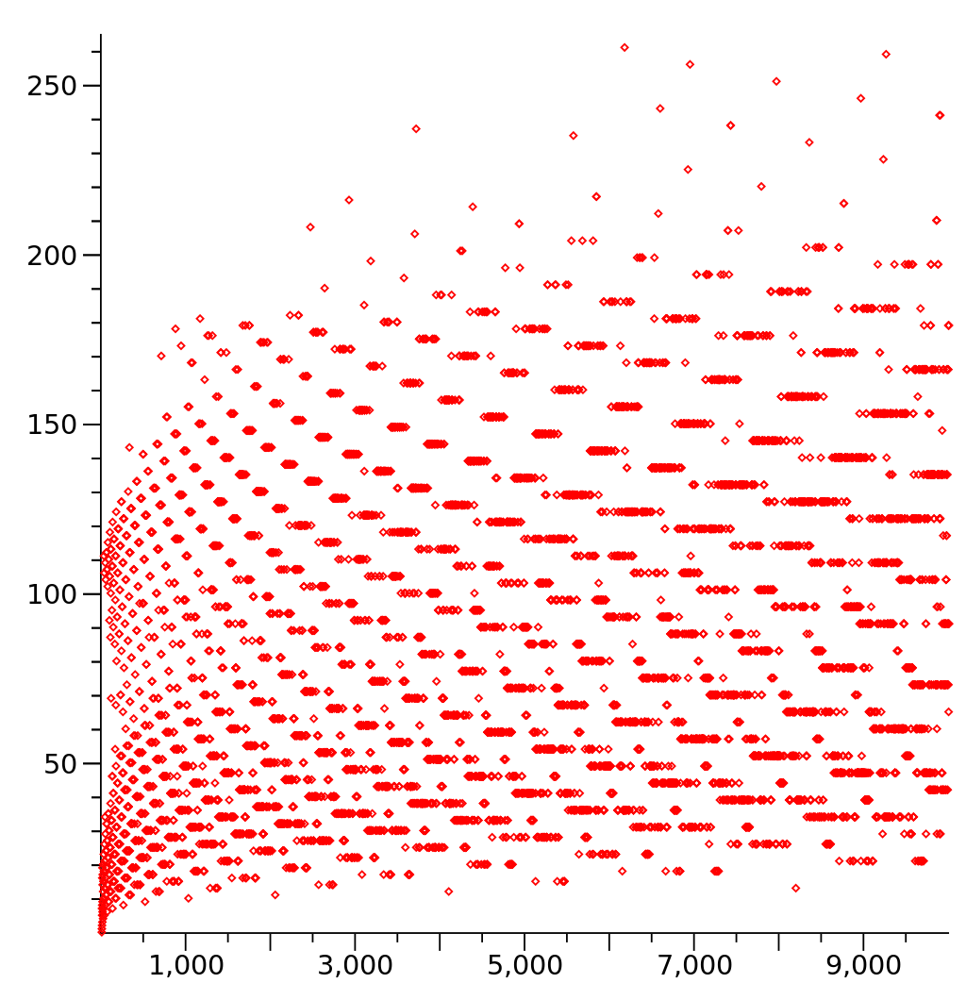

# 10a: Generative Recursion

## Module Overview

Generative recursion is in many ways similar to structural recursion: a function calls itself recursively (or several functions call themselves in mutual recursion). Each recursive call must receive an argument that is in some way "closer to the base case"; this is what guarantees the recursion will eventually terminate. In the structural recursion we have already seen, the nature of the data definitions and the template rules provide us the guarantee that we will reach the base case. But in generative recursion, we have to develop that proof for each function we write.

Learning Goals:

- Be able to identify whether a recursive function (or a set of
mutually recursive functions) uses structural or generative recursion.
- Be able to formulate a termination argument for a recursive function (or a set of mutually recursive functions).
- Be able to design functions that use generative recursion (algorithms).

## Introduction

The main idea this week is what’s called generative recursion. We have been writing recursive programs already, so what’s the difference between those and these? The ones we have been writing are called structural (or natural) recursion. The way they work is they start with a piece of data, and at each recursive call, they take some sub-piece of that data as the argument to the next recursive call. 

In generative recursion, a different thing happens, which is that at each recursive call, we generate entirely new data to operate on in the recursive call. The other thing is that with generative recursion, we’ve lost the old proof that our recursive functions will end up stopping, that they’ll reach an end.

## Fractals

[fractals.no-image.rkt](https://github.com/squxq/How-to-Code-Complex-Data/blob/week-10a/modules/week-10a/fractals/fractals.no-image.rkt)

[fractals.rkt](https://github.com/squxq/How-to-Code-Complex-Data/blob/week-10a/modules/week-10a/fractals/fractals.rkt)

Fractals are images where the image itself as a recursive structure, some people call them math art.

> Design a function that consumes a number and produces a Sierpinski triangle of that size. Your function should use generative recursion.
> 
> 
> One way to draw a Sierpinski triangle is to:
> 
> - start with an equilateral triangle with side length s
>     
>     (open image file)
>     
> - inside that triangle are three more Sierpinski triangles
> (open image file)
> - and inside each of those... and so on
> 
> So that you end up with something that looks like this:
> 
> (open image file)
> 
> Note that in the 2nd picture above the inner triangles are drawn in black and slightly smaller just to make them clear. In the real Sierpinski triangle they should be in the same color and of side length s/2. Also note that the center upside down triangle is not an explicit triangle, it is simply formed from the other triangles.
> 

```racket
;; Number -> Image
;; produce a Sierpinski triangle of the given size, s

;; Stub:
#; (define (stri s) (square 0 "solid" "white"))
```

Always start with the base (or trivial) case. The base case in this function is that we’re asked to produce a triangle that’s so small we’re not going to recurse anymore. Defining that size as a constant lets us easily alter it. 

```racket
(define CUTOFF 2)

;; Tests:
(check-expect (stri CUTOFF)
              (triangle CUTOFF "outline" "red"))
```

Especially in generative recursion, the next smallest case after the base case (or trivial case) can really help us understand how the function works. When there’s recomputation in recursion, things can get very slow, so avoiding recomputation is worth it in those cases.

```racket
(check-expect (stri (* CUTOFF 2))
              (overlay (triangle (* CUTOFF 2) "outline" "red")
                   (local [(define sub (triangle CUTOFF "outline" "red"))]
                     (above sub (beside sub sub)))))
```

The template for generative recursion:

```racket
;; Template:
#;
(define (genrec-fn d)
  (if (trivial? d)
      (trivial-answer d)
      (... d
           (genrec-fn (next-problem d)))))
```

The way to read the if statement is the same thing as saying: are we in the base case? Is the side length smaller than or equal to “CUTOFF”? The reason we call it trivial in this template is this is the problem that’s so simple that we’re not going to have to do any recursion.

```racket
(define (stri s)
  (if (<= s CUTOFF)
      (triangle s "outline" "red")
      (... s
           (stri (next-problem s)))))
```

We’re not making a triangle of size “CUTOFF”. And the reason why because s might be smaller than “CUTOFF”. It’s just at least as small as “CUTOFF”.

```racket
(define (stri s)
  (if (<= s CUTOFF)
      (triangle s "outline" "red")
      (overlay (triangle s "outline" "red")
           (local [(define sub (stri (/ s 2)))]
                     (above sub (beside sub sub))))))
```

In this template for generative recursion, there were three pieces we had to fill in: the trivial predicate, which meant - we’ve reached the end of the recursion - in the terminology we used for natural recursion, this was the base case test; the trivial answer - which is what we do at the end of the recursion - in the terminology we used for structural recursion, this was the base case result; and then we did the non-base case where we do something with the current value “d”.

### Question 38: Problem 1

[problem-01.no-image.rkt](https://github.com/squxq/How-to-Code-Complex-Data/blob/week-10a/modules/week-10a/fractals/problem-01.no-image.rkt)

[problem-01.rkt](https://github.com/squxq/How-to-Code-Complex-Data/blob/week-10a/modules/week-10a/fractals/problem-01.rkt)

> Design a function to produce a Sierpinski carpet of size s. Here is an example of a larger Sierpinski carpet.
> 
> 
> (open image file)
> 

```racket
(define CUTOFF 3)

;; Number -> Image
;; produce a Sierpinski carpet of the given size, s

;; Stub:
#; (define (scarpet s) empty-image)

;; Tests:
(check-expect (scarpet CUTOFF)
              (square CUTOFF "outline" "red"))
(check-expect (scarpet (* CUTOFF 3))
              (overlay (square (* CUTOFF 3) "outline" "red")
                       (local [(define sub (square CUTOFF "outline" "red"))
                               (define blank (square CUTOFF "solid" "transparent"))]
                         (above (beside sub sub sub)
                                (beside sub blank sub)
                                (beside sub sub sub)))))

;; Template:
#; (define (scarpet s)
     (if (trivial? s)
         (trivial-answer s)
         (... s
              (scarpet (next-problem s)))))

(define (scarpet s)
     (if (<= s CUTOFF)
         (square s "outline" "red")
         (overlay (square s "outline" "red")
              (local [(define sub (scarpet (/ s 3)))
                      (define blank (square (/ s 3) "solid" "transparent"))]
                (above (beside sub sub sub)
                       (beside sub blank sub)
                       (beside sub sub sub))))))
```

## Termination Arguments

[terminationArguments.no-image.rkt](https://github.com/squxq/How-to-Code-Complex-Data/blob/week-10a/modules/week-10a/terminationArguments/terminationArguments.no-image.rkt)

[terminationArguments.png](https://github.com/squxq/How-to-Code-Complex-Data/blob/week-10a/modules/week-10a/terminationArguments/terminationArguments.png)

[terminationArguments.rkt](https://github.com/squxq/How-to-Code-Complex-Data/blob/week-10a/modules/week-10a/terminationArguments/terminationArguments.rkt)

The Collatz conjecture is a conjecture in mathematics named after Lothar Collatz, who first proposed it in 1937. ... The sequence of numbers involved is referred to as the hailstone sequence or hailstone numbers (because the values are usually subject to multiple descents and ascents like hailstones in a cloud).

f(n) = /   n/2       if n is even
          \   3n + 1  if n is odd

(open image file)

The Collatz conjecture is: This process will eventually reach the number 1, regardless of which positive integer is chosen initially.



```racket
;; Integer[>=1] -> (listof Integer[>=1])
;; produce hailstone sequence for n

;; Tests:
(check-expect (hailstones 1) (list 1))
(check-expect (hailstones 2) (list 2 1))
(check-expect (hailstones 4) (list 4 2 1))
(check-expect (hailstones 5) (list 5 16 8 4 2 1))

(define (hailstones n)
  (if (= n 1) 
      (list 1)
      (cons n 
            (if (even? n)
                (hailstones (/ n 2))
                (hailstones (add1 (* n 3)))))))
```

Using the recipe for generative recursion, we have here a function for “hailstones” - that’s what this sequence is historically called. “hailstones” is a recursive function that calls itself with either “(/ n 2)” or “(add1 (* n 3))”.

The structurally recursive functions we’ve written so far in the course were based off templates for well-formed self-referential types with:

- a base case;
- a self-referential case.

The base case meant we had a case where we would stop. Because even if we weren’t at the base case, the function was talking sub-pieces which would reduce to the base case.

What about these recursive functions? They’re not operating on a well-formed self-referential data definition. That previous proof that they would stop doesn’t apply anymore. What we need for these functions is a three-part termination argument.

Three part termination argument for “stri”:

```racket
;Three part termination argument for stri.
;
;Base case: (<= s CUTOFF)
;
;Reduction step: (/ s 2)
;
;Argument that repeated application of reduction step will eventually 
;reach the base case: as long as the CUTOFF is > 0 and s starts >= 0 
;repeated division by 2 will eventually be less than CUTOFF.
```

With this three-part termination argument, which should always be included when generative recursion is used, we know that “stri” will stop.

Three part termination argument for “hailstones”:

```racket
;Three part termination argument for hailstones.
;
;Base case: (= n 1)
;
;Reduction step:
;    if n is even (/ n 2)
;    if n is odd  (+ 1 (* n 3))
;
;Argument that repeated application of reduction step will eventually 
;reach the base case: ...
```

Now we need to argue that the repeated application of the reduction step will eventually reach the base case. The first line looks good and keeps getting smaller. But on the next line, “n” gets bigger: it multiplies by 3 and adds 1. This could be hard, and in fact, this is hard. It’s so extremely hard that mathematicians haven’t been able to prove it yet.

This shows the importance of termination arguments. Termination arguments are not always simple. They’re essential because we have generative recursion, we don’t know whether these functions are going to stop without a termination argument, so they’re essential.

### Question 39: Problem 1

[problem-01.no-image.rkt](https://github.com/squxq/How-to-Code-Complex-Data/blob/week-10a/modules/week-10a/terminationArguments/problem-01.no-image.rkt)

> Construct a three-part termination argument for “scarpet”.
> 

```racket
;Three part termination argument for scarpet.
;
;Base case: (<= s CUTOFF)
;
;Reduction step: (/ s 3)
;
;Argument that repeated application of reduction step will eventually 
;reach the base case: as long as the CUTOFF is > 0 and s starts >= 0
;repeated division by 3 will eventually be less than CUTOFF.
```

### Question 40: Circle Fractal

[circle-fractal-starter.no-image.rkt](https://github.com/squxq/How-to-Code-Complex-Data/blob/week-10a/modules/week-10a/terminationArguments/circle-fractal-starter.no-image.rkt)

[circle-fractal-starter.rkt](https://github.com/squxq/How-to-Code-Complex-Data/blob/week-10a/modules/week-10a/terminationArguments/circle-fractal-starter.rkt)

> Design a function that will create the following fractal:
(open image file)
> 
> 
> Each circle is surrounded by circles that are two-fifths smaller.
> 
> You can build these images using the convenient beside and above functions if you make your actual recursive function be one that just produces the top leaf shape. You can then rotate that to produce the other three shapes.
> 
> You don't have to use this structure if you are prepared to use more complex place-image functions and do some arithmetic. But the approach where you use the helper is simpler.
> 
> Include a termination argument for your design.
> 

```racket
;; =================
;; Constants:

(define STEP (/ 2 5))
(define TRIVIAL-SIZE 5)

;; Number -> Image
;; produce a circle fractal of the given size, s

;; Stub:
#; (define (circle-fractal s) empty-image)

;; Tests
(check-expect (circle-fractal TRIVIAL-SIZE)
              (circle TRIVIAL-SIZE "solid" "blue"))
(check-expect (circle-fractal (/ TRIVIAL-SIZE STEP))
              (local [(define leaf (circle TRIVIAL-SIZE "solid" "blue"))]
                (above leaf
                       (beside leaf (circle (/ TRIVIAL-SIZE STEP) "solid" "blue") leaf)
                       leaf)))
(check-expect (circle-fractal (/ TRIVIAL-SIZE (sqr STEP)))
              (local [(define big-leaf (circle (/ TRIVIAL-SIZE STEP) "solid" "blue"))
                      (define small-leaf (circle TRIVIAL-SIZE "solid" "blue"))
                      (define top (above small-leaf
                                         (beside small-leaf big-leaf small-leaf)))]
                (above top
                       (beside (rotate 90 top) (circle (/ TRIVIAL-SIZE (sqr STEP)) "solid" "blue") (rotate -90 top))
                       (rotate 180 top))))
(check-expect (circle-fractal (/ TRIVIAL-SIZE (* STEP STEP STEP)))
              (local [(define center (circle (/ TRIVIAL-SIZE (* STEP STEP STEP)) "solid" "blue"))
                      (define big-leaf (circle (/ TRIVIAL-SIZE (sqr STEP)) "solid" "blue"))
                      (define medium-leaf (circle (/ TRIVIAL-SIZE STEP) "solid" "blue"))
                      (define small-leaf (circle TRIVIAL-SIZE "solid" "blue"))
                      (define top-small (above small-leaf
                                               (beside small-leaf medium-leaf small-leaf)))
                      (define top-big (above top-small
                                             (beside (rotate 90 top-small) big-leaf (rotate -90 top-small))))]
                (above top-big
                       (beside (rotate 90 top-big) center (rotate -90 top-big))
                       (rotate 180 top-big))))

(define (circle-fractal s)
  (local [(define center (circle s "solid" "blue"))
          (define top (create-top (* s STEP)))]
    (if (<= s TRIVIAL-SIZE)
        center
        (above top
               (beside (rotate 90 top) center (rotate -90 top))
               (rotate 180 top)))))

;; Number -> Image
;; produce top leaf image of center, with given size n

;; Stub:
#; (define (create-top n) empty-image)

;; Tests:
(check-expect (create-top TRIVIAL-SIZE)
              (circle TRIVIAL-SIZE "solid" "blue"))
(check-expect (create-top (/ TRIVIAL-SIZE STEP))
              (local [(define small-leaf (circle TRIVIAL-SIZE "solid" "blue"))]
                (above small-leaf
                       (beside small-leaf (circle (/ TRIVIAL-SIZE STEP) "solid" "blue") small-leaf))))
(check-expect (create-top (/ TRIVIAL-SIZE (sqr STEP)))
              (local [(define leaf (circle TRIVIAL-SIZE "solid" "blue"))
                      (define top (above leaf
                                         (beside leaf (circle (/ TRIVIAL-SIZE STEP) "solid" "blue") leaf)))]
                (above top
                       (beside (rotate 90 top) (circle (/ TRIVIAL-SIZE (sqr STEP)) "solid" "blue") (rotate -90 top)))))

;; Template: <used template for generative recursion>
(define (create-top n)
  (if (<= n TRIVIAL-SIZE)
      (circle n "solid" "blue")
      (local [(define center (circle n "solid" "blue"))
              (define previous-top (create-top (* n STEP)))]
        (above previous-top
               (beside (rotate 90 previous-top) center (rotate -90 previous-top))))))

(open image file)
;Three part termination argument for create-top:
;
;Base case: (<= n TRIVIAL-SIZE)
;
;Reduction step: (* n STEP)
;
;Argument that repeated application of reduction step will eventually
;reach the base case: as long as TRIVIAL-SIZE > 0 & n > 0 repeated
;multiplication by (/ 2 5) will eventually be less than TRIVIAL-SIZE.
```

### Question 41: Van Koch

[van-koch-starter.no-image.rkt](https://github.com/squxq/How-to-Code-Complex-Data/blob/week-10a/modules/week-10a/terminationArguments/van-koch-starter.no-image.rkt)

[van-koch-starter.rkt](https://github.com/squxq/How-to-Code-Complex-Data/blob/week-10a/modules/week-10a/terminationArguments/van-koch-starter.rkt)

> First review the discussion of the Van Koch Line fractal at: [http://pages.infinit.net/garrick/fractals/](http://pages.infinit.net/garrick/fractals/) (not working).
> 
> 
> Now design a function to draw a SIMPLIFIED version of the fractal. For this problem you will draw a simplified version as follows:
> 
> (open image file)
> 
> Notice that the difference here is that the vertical parts of the curve, or segments BC and DE in this figure (open image file) are just ordinary lines they are not themselves recursive Koch curves. That ends up making things much simpler in terms of the math required to draw this curve.
> 
> We want you to make the function consume positions using DrRacket's posn structure. A reasonable data definition for these is included below.
> 
> The signature and purpose of your function should be:
> 
> ;; Posn Posn Image -> Image
> ;; Add a simplified Koch fractal to image of length ln, going from p1 to p2
> ;; length ln is calculated by (distance p1 p2)
> ;; Assume p1 and p2 have same y-coordinate.
> 
> (define (vkline p1 p2 img) img) ;stub
> 
> Include a termination argument for your function.
> 
> We've also given you some constants and two other functions below that should be useful.
> 

```racket
;; Create a simplified Van Koch Line fractal.

;; =================
;; Constants:

(define LINE-CUTOFF 5)

(define WIDTH 300)
(define HEIGHT 200)
(define MTS (empty-scene WIDTH HEIGHT))

;; =================
;; Data definitions:

;(define-struct posn (x y))   ;struct is already part of racket
;; Posn is (make-posn Number Number)
;; interp. A cartesian position, x and y are screen coordinates.

;; Examples:
(define Point1 (make-posn 20 30))
(define Point2 (make-posn 100 10))

(define P0 (make-posn 20 100))
(define P1 (make-posn 25 100))
(define P2 (make-posn 35 100))

;; =====================
;; Function Definitions:

;; Posn Posn -> Number
;; produce the distance between two points

;; Tests:
(check-expect (distance Point1 Point1) 0)
(check-within (distance Point1 Point2) 82.4621125 0.0000001)

(define (distance p1 p2)
  (sqrt (+ (sqr (- (posn-x p2) (posn-x p1)))
           (sqr (- (posn-y p2) (posn-y p2))))))

;; Posn Posn Image -> Image
;; add a black line from p1 to p2 on image

;; Tests:
(check-expect (simple-line Point1 Point2 MTS) (add-line MTS 20 30 100 10 "black")) 

(define (simple-line p1 p2 img)
  (add-line img (posn-x p1) (posn-y p1) (posn-x p2) (posn-y p2) "black"))

;; Posn Posn Image -> Image
;; Add a simplified Koch fractal to image of length ln, going from p1 to p2
;; length ln is calculated by (distance p1 p2)
;; ASSUME: p1 and p2 have same y-coordinate.

;; Stub:
#; (define (vkline p1 p2 img) img)

;; Tests:
(check-expect (vkline P0 P1 MTS)
              (simple-line P0 P1 MTS))
(check-expect (vkline P0 P2 MTS)
              (local [(define dist (/ (distance P0 P2) 3))
                      (define A (make-posn (+ (posn-x P0) dist) (posn-y P0)))
                      (define B (make-posn (posn-x A) (- (posn-y A) dist)))
                      (define C (make-posn (+ (posn-x B) dist) (posn-y B)))
                      (define D (make-posn (posn-x C) (posn-y P2)))]
                (simple-line P0 A (simple-line A B (simple-line B C (simple-line C D (simple-line D P2 MTS)))))))

;; Template: <used template for generative recursion>
(define (vkline p1 p2 img)
  (local [(define length (distance p1 p2))]
    (if (< length LINE-CUTOFF)
        (simple-line p1 p2 img)
        (local [(define dist (/ length 3))
                (define A (make-posn (+ (posn-x p1) dist) (posn-y p2)))
                (define B (make-posn (posn-x A) (- (posn-y A) dist)))
                (define C (make-posn (+ (posn-x B) dist) (posn-y B)))
                (define D (make-posn (posn-x C) (posn-y p2)))]
          (vkline D p2 (simple-line C D (vkline B C (simple-line A B (vkline p1 A img)))))))))

;Three part termination argument for vkline:
;
;Base case: (< length LINE-CUTOFF),
;distance between p1 and p2 is less than or equal to LINE-CUTOFF
;
;Reduction step: split length into three pieces, recurse on all three
;
;Argument: as long as LINE-CUTOFF > 0, and we're dividing the distance
;between p1 and p2 by 3, length will eventually be less than LINE-CUTOFF
```

### Question 42: Cantor

[cantor-starter.no-image.rkt](https://github.com/squxq/How-to-Code-Complex-Data/blob/week-10a/modules/week-10a/terminationArguments/cantor-starter.no-image.rkt)

[cantor-starter.rkt](https://github.com/squxq/How-to-Code-Complex-Data/blob/week-10a/modules/week-10a/terminationArguments/cantor-starter.rkt)

> A Cantor Set is another fractal with a nice simple geometry. The idea of a Cantor set is to have a bar (or rectangle) of a certain width w, then below that are two recursive calls each of 1/3 the width, separated by a whitespace of 1/3 the width.
> 
> 
> So this means that the:
> 
>  - width of the whitespace, wc,  is  (/ w 3) 
> 
>  - width of recursive calls, wr,  is  (/ (- w wc) 2)
> 
> To make it look better a little extra whitespace is put between the bars.Here are a couple of examples (assuming a reasonable CUTOFF):
> 
> (cantor CUTOFF) produces:
> 
> (open image file)
> 
> (cantor (* CUTOFF 3)) produces:
> 
> (open image file)
> 
> And that keeps building up to something like the following. So as it goes it gets wider and taller of course.
> 
> (open image file)
> 
> Design a function that consumes a width and produces a cantor set of the given width.
> 

```racket
;; ==========
;; Constants:

(define CUTOFF 4)
(define HEIGHT 20)

;; =====================
;; Function Definitions:

;; Number -> Image
;; produce a cantor set of the given width, w

;; Stub:
#; (define (cantor w) empty-image)

;; Tests:
(check-expect (cantor CUTOFF)
              (rectangle CUTOFF HEIGHT "solid" "blue"))
(check-expect (cantor (* CUTOFF 3))
              (local [(define rectangle-b (rectangle CUTOFF HEIGHT "solid" "blue"))
                      (define gap (rectangle CUTOFF HEIGHT "solid" "transparent"))]
                (above (rectangle (* CUTOFF 3) HEIGHT "solid" "blue")
                       (rectangle (* CUTOFF 3) HEIGHT "solid" "transparent")
                     (beside rectangle-b gap rectangle-b))))

;; Template: <used template for generative recursion>
(define (cantor w)
  (if (<= w CUTOFF)
      (rectangle w HEIGHT "solid" "blue")
      (local [(define wc (/ w 3))
              (define wr (/ (- w wc) 2))
              (define child (cantor wr))
              (define gap (rectangle wc HEIGHT "solid" "transparent"))]
        (above (rectangle w HEIGHT "solid" "blue")
               (rectangle w HEIGHT "solid" "transparent")
               (beside child gap child)))))
```

> Add a second parameter to your function that controls the percentage of the recursive call that is white each time. Calling your new function with a second argument of 1/3 would produce the same images as the old function.
> 

```racket
;; ==========
;; Constants:

(define CUTOFF 4)
(define HEIGHT 20)
(define V-HEIGHT (/ HEIGHT 2))

;; =====================
;; Function Definitions:

;; Number Number -> Image
;; produce a cantor set of the given width, w, with the whitespace separating the recursive calls being r * w
;; ASSUME: 0 < r < 1

;; Stub:
#; (define (cantor w r) empty-image)

;; Tests:
(check-expect (cantor CUTOFF (/ 1 3))
              (rectangle CUTOFF HEIGHT "solid" "blue"))
(check-expect (cantor (* CUTOFF 3) (/ 1 3))
              (local [(define rectangle-b (rectangle CUTOFF HEIGHT "solid" "blue"))
                      (define gap (rectangle CUTOFF HEIGHT "solid" "transparent"))]
                (above (rectangle (* CUTOFF 3) HEIGHT "solid" "blue")
                       (rectangle (* CUTOFF 3) V-HEIGHT "solid" "transparent")
                       (beside rectangle-b gap rectangle-b))))
(check-expect (cantor (* CUTOFF 16) (/ 1 4))
              (local [(define wc-1 (* (* CUTOFF 16) (/ 1 4)))
                      (define wr-1 (/ (- (* CUTOFF 16) wc-1) 2))
                      (define rect-1 (rectangle wr-1 HEIGHT "solid" "blue"))
                      (define gap-1 (rectangle wc-1 HEIGHT "solid" "transparent"))
                      (define v-1 (rectangle wr-1 V-HEIGHT "solid" "transparent"))
                      (define wc-2 (* wr-1 (/ 1 4)))
                      (define wr-2 (/ (- wr-1 wc-2) 2))
                      (define rect-2 (rectangle wr-2 HEIGHT "solid" "blue"))
                      (define gap-2 (rectangle wc-2 HEIGHT "solid" "transparent"))
                      (define v-2 (rectangle wr-2 V-HEIGHT "solid" "transparent"))
                      (define wc-3 (* wr-2 (/ 1 4)))
                      (define wr-3 (/ (- wr-2 wc-3) 2))
                      (define rect-3 (rectangle wr-3 HEIGHT "solid" "blue"))
                      (define gap-3 (rectangle wc-3 HEIGHT "solid" "transparent"))
                      (define layer-1 (above rect-2 v-2 (beside rect-3 gap-3 rect-3)))
                      (define layer-2 (above rect-1 v-1 (beside layer-1 gap-2 layer-1)))]
                (above (rectangle (* CUTOFF 16) HEIGHT "solid" "blue")
                       (rectangle (* CUTOFF 16) V-HEIGHT "solid" "transparent")
                       (beside layer-2 gap-1 layer-2))))

;; Template: <used template for generative recursion>
(define (cantor w r)
  (if (<= w CUTOFF)
      (rectangle w HEIGHT "solid" "blue")
      (local [(define wc (* w r))
              (define wr (/ (- w wc) 2))
              (define child (cantor wr r))
              (define gap (rectangle wc HEIGHT "solid" "transparent"))]
        (above (rectangle w HEIGHT "solid" "blue")
               (rectangle w V-HEIGHT "solid" "transparent")
               (beside child gap child)))))

;Three part termination argument for cantor:
;
;Base case: (<= width CUTOFF), width of the
;rectangle to be drawn is less than or equal CUTOFF.
;
;Reduction step: (/ (- width (* width r)) 2), from the
;difference of width and its product with r, 0 <= r < 1,
;divide by two. Multiplication by a number greater than 0
;and smaller than 1, has a reduction effect, aswell as
;dividind by 2.
;
;Argument: as long as CUTOFF > 0, and 0 <= r < 1, repeatedly
;multiplying by r and dividing by two will eventually
;reduce width to eventually reach the base case.
```

> Now you can make a fun world program that works this way:
 - The world state should simply be the most recent x coordinate of the mouse.
> 
> 
> The to-draw handler should just call your new cantor function with the width of your MTS as its first argument and the last x coordinate of the mouse divided by that width as its second argument.
> 

```racket
;; cantor set world program

;; ==========
;; Constants:

(define WIDTH 600)
(define HEIGHT 300)
(define MTS (empty-scene WIDTH HEIGHT))

(define CUTOFF 4)
(define R-HEIGHT 20)
(define V-HEIGHT (/ R-HEIGHT 2))

;; =================
;; Data Definitions:

;; X is Number
;; the current x-coordinate of the mouse

;; Examples:
(define X 0)
(define X1 20)
(define X2 539)

;; Template: <from atomic data: Number>
#; (define (fn-for-x x)
     (... x))

;; =====================
;; Function Definitions:

;; X -> X
;; start the world with: (main X)

(define (main x)
  (big-bang x ;; X
    (to-draw cantor-layer) ;; X -> Image
    (on-mouse update-x))) ;; X Integer Integer MouseEvent -> X

;; Number -> Image
;; layer function that calls cantor with the width of the MTS as its first argument
;; and the last x coordinate of the mouse divided by the width of the MTS as its second argument

;; Stub:
#; (define (cantor-layer x) empty-image)

;; Tests:
(check-expect (cantor-layer 300) (cantor WIDTH (/ 300 WIDTH)))
(check-expect (cantor-layer 20) (cantor WIDTH (/ 20 WIDTH)))

;; Template: <used template for atomic data: Number>

(define (cantor-layer x)
  (cantor WIDTH (/ x WIDTH)))

;; Number Number -> Image
;; produce a cantor set of the given width, w, with the whitespace separating the recursive calls being r * w
;; ASSUME: 0 <= r < 1

;; Stub:
#; (define (cantor w r) empty-image)

;; Tests:
(check-expect (cantor CUTOFF (/ 1 3))
              (rectangle CUTOFF R-HEIGHT "solid" "blue"))
(check-expect (cantor (* CUTOFF 3) (/ 1 3))
              (local [(define rectangle-b (rectangle CUTOFF R-HEIGHT "solid" "blue"))
                      (define gap (rectangle CUTOFF R-HEIGHT "solid" "transparent"))]
                (above (rectangle (* CUTOFF 3) R-HEIGHT "solid" "blue")
                       (rectangle (* CUTOFF 3) V-HEIGHT "solid" "transparent")
                       (beside rectangle-b gap rectangle-b))))
(check-expect (cantor (* CUTOFF 16) (/ 1 4))
              (local [(define wc-1 (* (* CUTOFF 16) (/ 1 4)))
                      (define wr-1 (/ (- (* CUTOFF 16) wc-1) 2))
                      (define rect-1 (rectangle wr-1 R-HEIGHT "solid" "blue"))
                      (define gap-1 (rectangle wc-1 R-HEIGHT "solid" "transparent"))
                      (define v-1 (rectangle wr-1 V-HEIGHT "solid" "transparent"))
                      (define wc-2 (* wr-1 (/ 1 4)))
                      (define wr-2 (/ (- wr-1 wc-2) 2))
                      (define rect-2 (rectangle wr-2 R-HEIGHT "solid" "blue"))
                      (define gap-2 (rectangle wc-2 R-HEIGHT "solid" "transparent"))
                      (define v-2 (rectangle wr-2 V-HEIGHT "solid" "transparent"))
                      (define wc-3 (* wr-2 (/ 1 4)))
                      (define wr-3 (/ (- wr-2 wc-3) 2))
                      (define rect-3 (rectangle wr-3 R-HEIGHT "solid" "blue"))
                      (define gap-3 (rectangle wc-3 R-HEIGHT "solid" "transparent"))
                      (define layer-1 (above rect-2 v-2 (beside rect-3 gap-3 rect-3)))
                      (define layer-2 (above rect-1 v-1 (beside layer-1 gap-2 layer-1)))]
                (above (rectangle (* CUTOFF 16) R-HEIGHT "solid" "blue")
                       (rectangle (* CUTOFF 16) V-HEIGHT "solid" "transparent")
                       (beside layer-2 gap-1 layer-2))))

;; Template: <used template for generative recursion>
(define (cantor w r)
  (local [(define width (abs w))] ; so the world program doesn't crash when hovering outside the screen on the right side
    (if (<= width CUTOFF)
        (rectangle width R-HEIGHT "solid" "blue")
        (local [(define wc (* width r))
                (define wr (/ (- width wc) 2))
                (define child (cantor wr r))
                (define gap (rectangle wc R-HEIGHT "solid" "transparent"))]
          (above (rectangle width R-HEIGHT "solid" "blue")
                 (rectangle width V-HEIGHT "solid" "transparent")
                 (beside child gap child))))))

;Three part termination argument for cantor:
;
;Base case: (<= width CUTOFF), width of the
;rectangle to be drawn is less than or equal CUTOFF.
;
;Reduction step: (/ (- width (* width r)) 2), from the
;difference of width and its product with r, 0 <= r < 1,
;divide by two. Multiplication by a number greater than 0
;and smaller than 1, has a reduction effect, aswell as
;dividind by 2.
;
;Argument: as long as CUTOFF > 0, and 0 <= r < 1, repeatedly
;multiplying by r and dividing by two will eventually
;reduce width to eventually reach the base case.

;; Number Integer Integer MouseEvent -> Number
;; update x coordinate of the mouse (world state) everytime the mouse moves

;; Stub:
#; (define (update-x ws x y me) ws)

;; Tests:
(check-expect (update-x 400 405 800 "move") 405)
(check-expect (update-x 400 500 800 "button-down") 400)
(check-expect (update-x 400 290 300 "move") 290)

;; Template: <used template for a mouse handler function>
(define (update-x ws x y me)
  (cond [(mouse=? me "move") x]
        [else ws]))
```