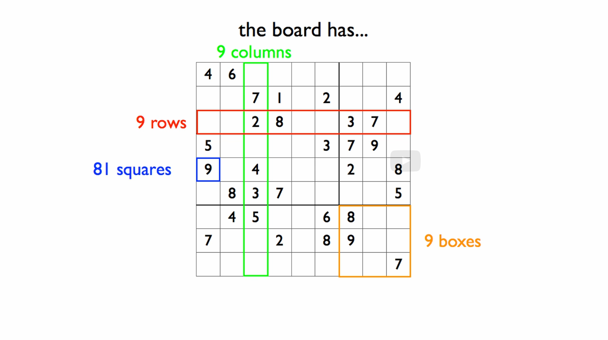

# 10b: Search

## Module Overview

Learning Goals:

- Be able to identify whether a function should be designed using
domain knowledge, structural recursion, built-in abstract list functions or generative recursion.
- Be able to design a backtracking generative search.

## Lambda Expressions

[lambdaExpressions.no-image.rkt](https://github.com/squxq/How-to-Code-Complex-Data/blob/week-10b/modules/week-10b/lambdaExpressions/lambdaExpressions.no-image.rkt)

What is the problem that lambda expressions help us solve. Let’s look at these two functions:

```racket
;; Number (listof Number) -> (listof Number)
;; produce only elements of lon > threshold

;; Tests:
(check-expect (only-bigger 2 empty) empty)
(check-expect (only-bigger 3 (list 2 4 5)) (list 4 5))

(define (only-bigger threshold lon)
  (local [(define (pred n) 
            (> n threshold))]
    
    (filter pred lon)))

;; (listof Image) -> (listof Natural)
;; produce list of areas of images

;; Tests:
(check-expect (all-areas (list (rectangle 2 3 "solid" "blue") 
                               (square 10 "solid" "white")))
              (list 6 100))

(define (all-areas loi)
  (local [(define (area i)
            (* (image-width i)
               (image-height i)))]
    (map area loi)))
```

Both of these function definitions have a local function in them, and that local function is only used in one place inside the larger function. So, not only are these functions which are not used outside - that’s why they are defined with “local” - but they’re also functions which are only used in one place inside the “local”.

They are also quite simple functions, functions where giving them a name doesn’t make the code any clearer. The body is so easily understood (for being small, for example) that naming the function doesn’t make the code easier to understand. What we can do is this:

```racket
(define (only-bigger threshold lon)
    (filter (lambda (n) (> n threshold)) lon))
```

What we have here is what’s called an anonymous function, and we’re calling filter with that anonymous function. So “lambda” is a good thing to use in cases just like this.

```racket
(define (all-areas loi)
  (map (lambda (i)
         (* (image-width i)
            (image-height i))) loi))

;; (listof Number)  ->  (listof Number)
;; produce list of numbers sorted in ASCENDING order
;; ASSUMPTION: lon contains no duplicates

;; Tests:
(check-expect (qsort empty)                empty)
(check-expect (qsort (list 8))             (list 8))
(check-expect (qsort (list 7 8 9))         (list 7 8 9))
(check-expect (qsort (list  4 3 2 1))      (list 1 2 3 4))
(check-expect (qsort (list 6 8 1 9 3 7 2)) (list 1 2 3 6 7 8 9))

#; (define (qsort lon)
     (if (empty? lon) 
         empty
         (local [(define p (first lon))
                 (define (<p? n) (< n p))
                 (define (>p? n) (> n p))]
           (append (qsort (filter <p? lon))
                   (list p) 
                   (qsort (filter >p? lon))))))

(define (qsort lon)
  (if (empty? lon) 
      empty
      (local [(define p (first lon))]
        (append (qsort (filter (λ (n) (< n p)) lon))
                (list p) 
                (qsort (filter (λ (n) (> n p)) lon))))))
```

By clicking: CTRL+\, we can type the λ symbol, in DrRacket, which works the same as “lambda”. The logo from DrRacket project looks like a lambda expression. It’s what they call their “steal your face lambda”. This pays homage to the Grateful Dead’s album “Steal Your Face”. Lambda Calculus is a foundational concept in programming languages that underlies our understanding of programming languages and computation in general.

## Sudoku — Terminology

[sudoku--terminology.png](https://github.com/squxq/How-to-Code-Complex-Data/blob/week-10b/modules/week-10b/sudoku--terminology/sudoku--terminology.png)

Sudoku is played on a nine by nine board, so the board has 81 squares. In addition to the 81 squares, we say that the board has nine rows, nine columns, and nine boxes - three by three blocks of the whole board.



The rows, the columns, and the boxes together comprise what are called, units. There’s 27 total units, because there’s nine rows, nine columns, and nine boxes.

The goal of the game is to fill every square with a natural number from one to nine but making sure that there’s not a duplicate number in any unit.

## Sudoku — Data Definitions and Primitives

[sudoku--dataDefinitions%26primitives.no-image.rkt](https://github.com/squxq/How-to-Code-Complex-Data/blob/week-10b/modules/week-10b/sudoku--dataDefinitions%26primitives/sudoku--dataDefinitions%26primitives.no-image.rkt)

If we’re working systematically, it lets us take advantages of good decisions, and makes it easy to go back and change bad decisions.

Program description:

```racket
;;
;; Brute force Sudoku solver
;;
;; In Sudoku, the board is a 9x9 grid of SQUARES.
;; There are 9 ROWS and 9 COLUMNS, there are also 9
;; 3x3 BOXES.  Rows, columns and boxes are all UNITs.
;; So there are 27 units.
;;
;; The idea of the game is to fill each square with
;; a Natural[1, 9] such that no unit contains a duplicate
;; number.
;;
```

Data Definitions:

```racket
;; =================
;; Data definitions:

;; Val is Natural[1, 9]

;; Board is (listof Val|false)   that is 81 elements long
;; interp.
;;  Visually a board is a 9x9 array of squares, where each square
;;  has a row and column number (r, c).  But we represent it as a
;;  single flat list, in which the rows are layed out one after
;;  another in a linear fashion. (See interp. of Pos below for how
;;  we convert back and forth between (r, c) and position in a board.)

;; Pos is Natural[0, 80]
;; interp.
;;  the position of a square on the board, for a given p, then
;;    - the row    is (quotient p 9)
;;    - the column is (remainder p 9)

;; Convert 0-based row and column to Pos
(define (r-c->pos r c) (+ (* r 9) c))  ;helpful for writing tests

;; Unit is (listof Pos) of length 9
;; interp. 
;;  The position of every square in a unit. There are
;;  27 of these for the 9 rows, 9 columns and 9 boxes.
```

Constants:

```racket
;; ==========
;; Constants:

(define ALL-VALS (list 1 2 3 4 5 6 7 8 9))

(define B false) ;B stands for blank

;; Boards:

(define BD1 
  (list B B B B B B B B B
        B B B B B B B B B
        B B B B B B B B B
        B B B B B B B B B
        B B B B B B B B B
        B B B B B B B B B
        B B B B B B B B B
        B B B B B B B B B
        B B B B B B B B B))

(define BD2 
  (list 1 2 3 4 5 6 7 8 9 
        B B B B B B B B B 
        B B B B B B B B B 
        B B B B B B B B B 
        B B B B B B B B B
        B B B B B B B B B
        B B B B B B B B B
        B B B B B B B B B
        B B B B B B B B B))

(define BD3 
  (list 1 B B B B B B B B
        2 B B B B B B B B
        3 B B B B B B B B
        4 B B B B B B B B
        5 B B B B B B B B
        6 B B B B B B B B
        7 B B B B B B B B
        8 B B B B B B B B
        9 B B B B B B B B))

(define BD4                ;easy
  (list 2 7 4 B 9 1 B B 5
        1 B B 5 B B B 9 B
        6 B B B B 3 2 8 B
        B B 1 9 B B B B 8
        B B 5 1 B B 6 B B
        7 B B B 8 B B B 3
        4 B 2 B B B B B 9
        B B B B B B B 7 B
        8 B B 3 4 9 B B B))

(define BD4s               ;solution to 4
  (list 2 7 4 8 9 1 3 6 5
        1 3 8 5 2 6 4 9 7
        6 5 9 4 7 3 2 8 1
        3 2 1 9 6 4 7 5 8
        9 8 5 1 3 7 6 4 2
        7 4 6 2 8 5 9 1 3
        4 6 2 7 5 8 1 3 9
        5 9 3 6 1 2 8 7 4
        8 1 7 3 4 9 5 2 6))

(define BD5                ;hard
  (list 5 B B B B 4 B 7 B
        B 1 B B 5 B 6 B B
        B B 4 9 B B B B B
        B 9 B B B 7 5 B B
        1 8 B 2 B B B B B 
        B B B B B 6 B B B 
        B B 3 B B B B B 8
        B 6 B B 8 B B B 9
        B B 8 B 7 B B 3 1))

(define BD5s               ;solution to 5
  (list 5 3 9 1 6 4 8 7 2
        8 1 2 7 5 3 6 9 4
        6 7 4 9 2 8 3 1 5
        2 9 6 4 1 7 5 8 3
        1 8 7 2 3 5 9 4 6
        3 4 5 8 9 6 1 2 7
        9 2 3 5 4 1 7 6 8
        7 6 1 3 8 2 4 5 9
        4 5 8 6 7 9 2 3 1))

(define BD6                ;hardest ever? (Dr Arto Inkala)
  (list B B 5 3 B B B B B 
        8 B B B B B B 2 B
        B 7 B B 1 B 5 B B 
        4 B B B B 5 3 B B
        B 1 B B 7 B B B 6
        B B 3 2 B B B 8 B
        B 6 B 5 B B B B 9
        B B 4 B B B B 3 B
        B B B B B 9 7 B B))

(define BD7                 ; no solution 
  (list 1 2 3 4 5 6 7 8 B 
        B B B B B B B B 2 
        B B B B B B B B 3 
        B B B B B B B B 4 
        B B B B B B B B 5
        B B B B B B B B 6
        B B B B B B B B 7
        B B B B B B B B 8
        B B B B B B B B 9))

;; Positions of all the rows, columns and boxes:

(define ROWS
  (list (list  0  1  2  3  4  5  6  7  8)
        (list  9 10 11 12 13 14 15 16 17)
        (list 18 19 20 21 22 23 24 25 26)
        (list 27 28 29 30 31 32 33 34 35)
        (list 36 37 38 39 40 41 42 43 44)
        (list 45 46 47 48 49 50 51 52 53)
        (list 54 55 56 57 58 59 60 61 62)
        (list 63 64 65 66 67 68 69 70 71)
        (list 72 73 74 75 76 77 78 79 80)))

(define COLS
  (list (list 0  9 18 27 36 45 54 63 72)
        (list 1 10 19 28 37 46 55 64 73)
        (list 2 11 20 29 38 47 56 65 74)
        (list 3 12 21 30 39 48 57 66 75)
        (list 4 13 22 31 40 49 58 67 76)
        (list 5 14 23 32 41 50 59 68 77)
        (list 6 15 24 33 42 51 60 69 78)
        (list 7 16 25 34 43 52 61 70 79)
        (list 8 17 26 35 44 53 62 71 80)))

(define BOXES
  (list (list  0  1  2  9 10 11 18 19 20)
        (list  3  4  5 12 13 14 21 22 23)
        (list  6  7  8 15 16 17 24 25 26)
        (list 27 28 29 36 37 38 45 46 47)
        (list 30 31 32 39 40 41 48 49 50)
        (list 33 34 35 42 43 44 51 52 53)
        (list 54 55 56 63 64 65 72 73 74)
        (list 57 58 59 66 67 68 75 76 77)
        (list 60 61 62 69 70 71 78 79 80)))

(define UNITS (append ROWS COLS BOXES))
```

Note that in the beginning of the file we are requiring: (require racket/list), which gives us: “list-ref”, “take”, and “drop”. We could, also, have coded “read-square” and “fill-square” “from scratch” by using the functions operating on 2 one-of data rule. Function definitions, including “from scratch” versions:

```racket
;; =====================
;; Function Definitions:

;; Board Pos -> Val or false
;; Produce value at given position on board.

;; Tests:
(check-expect (read-square BD2 (r-c->pos 0 5)) 6)
(check-expect (read-square BD3 (r-c->pos 7 0)) 8)

;; "from scratch":
;; this: (r-c->pos 7 0), returns an index: Natural[0, 80]
;; IMPORTANT: board, bd, is never empty

;Function on 2 complex data: Board and Pos.
;We can assume that p is <= (length bd).
;
;              empty     (cons Val-or-False Board)
; 0             XXX         (first bd)
; 
; (add1 p)      XXX         <natural recursion>

#; (define (read-square bd p)
     (cond [(= p 0) (first bd)]
           [else
            (read-square (rest bd) (- p 1))]))

(define (read-square bd p)
  (list-ref bd p))               

;; Board Pos Val -> Board
;; produce new board with val at given position

;; Tests:
(check-expect (fill-square BD1 (r-c->pos 0 0) 1)
              (cons 1 (rest BD1)))

;; "from scratch":
;; IMPORTANT: board, bd, is never empty

;Function on 2 complex data, Board and Pos.
;We can assume that p is <= (length bd).
;
;              empty     (cons Val-or-False Board)
; 0             XXX         (cons nv (rest bd))
; 
; (add1 p)      XXX         (cons (first bd) <natural recursion>)

#; (define (fill-square bd p nv)
     (cond [(= p 0) (cons nv (rest bd))]
           [else (cons (first bd)
                       (fill-square (rest bd) (- p 1) nv))]))

(define (fill-square bd p nv)
  (append (take bd p)
          (list nv)
          (drop bd (add1 p))))
```

## Sudoku — The Search Intuition

[sudoku--searchIntuition.png](https://github.com/squxq/How-to-Code-Complex-Data/blob/week-10b/modules/week-10b/sudoku--searchIntuition/sudoku--searchIntuition.png)

The basic idea that’s going to underlie out Sudoku board solver is - we’re going to take an initial Sudoku board and we’re going to generate a tree of all the possible boards that follow from it, looking for a solution. It’s going to be a generative recursion.

So we want to find a solution to a Sudoku board or maybe find out that the board is not solvable. Well, the idea behind brute force search is: here’s the first empty square; what if I take that square and I fill it in with all possible values. That gives me 9 possible next boards. Of course some of those boards are immediately invalid. So we immediately rule our the invalid boards. Then we just do the same thing again for all the newly generated boards.

What are we doing? We are generating an arbitrary-arity tree and doing a backtracking search over it. The generation is straightforward. The second row of boards are new boards, these aren’t som sub-part of the first board - generative recursion. The reason it is an arbitrary-arity tree is that each board has zero to nine valid children - valid next boards. We’re also doing a backtracking search - along each branch we either:

- come to a board with no valid next boards - produce false.
- come to a full (and valid) board - the solution.


## Sudoku — Template Blending

[sudoku--templateBlending.no-image.rkt](https://github.com/squxq/How-to-Code-Complex-Data/blob/week-10b/modules/week-10b/sudoku--templateBlending/sudoku--templateBlending.no-image.rkt)

We are going to step back a little from the way we’ve talked about templates before. We’re going to relax them a little bit. But the fundamental idea underlying template isn’t going to change at all because what templates have always been from day one is they were the answer to a very simple question: given what I know about what this function consumes, what it produces and what it does - how much do I know about the form of the function before I start on the details?

Our search function produces the solved board (which is what it has been “searching” for) or false if there is none.

```racket
;; Board -> Board|false
;; produces a solution a solution for board, bd; or false if board is unsolvable
;; ASSUME: bd is valid

;; Stub:
#; (define (solve bd) false)
```

Here it is a little bit tougher to think of a base case, so I’ll just use the defined above boards: “BD4”, “BD5” and “BD7”:

```racket
;; Tests:
(check-expect (solve BD4) BD4s)
(check-expect (solve BD5) BD5s)
(check-expect (solve BD7) false)
```

Template:

```racket
;; Template:
#; (define (solve bd)
     (local [(define (solve--board bd)
               (if (solved? bd) ; trivial?
                   bd
                   (solve--lobd (next-boards bd)))) ; next-problem

             (define (solve--lobd lobd)
               (cond [(empty? lobd) false]
                     [else
                      (local [(define try (solve--board (first lobd)))] 
                        (if (not (false? try))
                            try
                            (solve--lobd (rest lobd))))]))]
    
       (solve--board bd)))
```

What I have done is to generate an arbitrary-arity tree by, for each board, finding the valid next boards and throwing out, immediately the invalid ones. We’ll just do a backtracking search over that tree as we go. And if we ever come to a full board, a board that is solved, we’re done. Every time we fail, every time we run out of choices, we produce false. That’s the code of the Sudoku solver.

The template is: what we know about the body of the function based on what it consumes and produces and it’s basic behavior before we get to the details.

## Sudoku — Making the Wish List

[sudoku--makingWishList.no-image.rkt](https://github.com/squxq/How-to-Code-Complex-Data/blob/week-10b/modules/week-10b/sudoku--makingWishList/sudoku--makingWishList.no-image.rkt)

The two functions we wished for but didn’t define are “solved” and “next-boards”. So let’s go ahead and do wish list entries for those.

```racket
;; Board -> Boolean
;; produce true if board, bd, is solved
;; NOTE: board is valid, so it is solved if it is full
;; !!!

;; Stub:
(define (solved? bd) false)

;; Board -> (listof Board)
;; produce list of valid next boards from board, bd
;; finds first empty square, fills it with Natural[1, 9], keeps only the valid boards
;; !!!

;; Stub:
(define (next-boards bd) empty)
```

### Question 43: Problem 1

[problem-01.no-image.rkt](https://github.com/squxq/How-to-Code-Complex-Data/blob/week-10b/modules/week-10b/sudoku--makingWishList/problem-01.no-image.rkt)

> Before moving on, you can start working on: “solved?” and “next-boards”.
> 

```racket
;; Board -> Boolean
;; produce true if board, bd, is solved
;; NOTE: board is valid, so it is solved if it is full

;; Stub:
#; (define (solved? bd) false)

;; Tests:
(check-expect (solved? BD1) false)
(check-expect (solved? BD2) false)
(check-expect (solved? BD4) false)
(check-expect (solved? BD4s) true)
(check-expect (solved? BD5) false)
(check-expect (solved? BD5s) true)
(check-expect (solved? BD6) false)

;; Template:
#; (define (solved? bd)
     (and (is (first bd) not B - blank) (solved? (rest bd))))
;; this is possible because, in Racket, the 'and' function short-circuits its evaluation
;; this means that if any of its arguments evaluates '#f', it immediately returns '#f'

(define (solved? bd)
  (cond [(empty? bd) true]
        [else(and (not (false? (read-square bd 0)))
                  (solved? (rest bd)))]))

;; Board -> (listof Board)
;; produce list of valid next boards from board, bd
;; finds first empty square, fills it with Natural[1, 9], keeps only the valid boards
;; !!!

;; Stub:
#; (define (next-boards bd) empty)

;; Definition:
(define auxiliary-BD
  (list B B B B B B B B
        B B B B B B B B B
        B B B B B B B B B
        B B B B B B B B B
        B B B B B B B B B
        B B B B B B B B B
        B B B B B B B B B
        B B B B B B B B B))

;; Tests:
(check-expect (next-boards BD1)
              (list (cons 1 (rest BD1)) (cons 2 (rest BD1))
                    (cons 3 (rest BD1)) (cons 4 (rest BD1))
                    (cons 5 (rest BD1)) (cons 6 (rest BD1))
                    (cons 7 (rest BD1)) (cons 8 (rest BD1))
                    (cons 9 (rest BD1))))
(check-expect (next-boards BD2)
              (list (append (list 1 2 3 4 5 6 7 8 9) (cons 4 auxiliary-BD))
                    (append (list 1 2 3 4 5 6 7 8 9) (cons 5 auxiliary-BD))
                    (append (list 1 2 3 4 5 6 7 8 9) (cons 6 auxiliary-BD))
                    (append (list 1 2 3 4 5 6 7 8 9) (cons 7 auxiliary-BD))
                    (append (list 1 2 3 4 5 6 7 8 9) (cons 8 auxiliary-BD))
                    (append (list 1 2 3 4 5 6 7 8 9) (cons 9 auxiliary-BD))))
(check-expect (next-boards BD4)
              (list (list 2 7 4 6 9 1 B B 5
                          1 B B 5 B B B 9 B
                          6 B B B B 3 2 8 B
                          B B 1 9 B B B B 8
                          B B 5 1 B B 6 B B
                          7 B B B 8 B B B 3
                          4 B 2 B B B B B 9
                          B B B B B B B 7 B
                          8 B B 3 4 9 B B B)
                    (list 2 7 4 8 9 1 B B 5
                          1 B B 5 B B B 9 B
                          6 B B B B 3 2 8 B
                          B B 1 9 B B B B 8
                          B B 5 1 B B 6 B B
                          7 B B B 8 B B B 3
                          4 B 2 B B B B B 9
                          B B B B B B B 7 B
                          8 B B 3 4 9 B B B)))
(check-expect (next-boards BD5)
              (list (list 5 2 B B B 4 B 7 B
                          B 1 B B 5 B 6 B B
                          B B 4 9 B B B B B
                          B 9 B B B 7 5 B B
                          1 8 B 2 B B B B B 
                          B B B B B 6 B B B 
                          B B 3 B B B B B 8
                          B 6 B B 8 B B B 9
                          B B 8 B 7 B B 3 1)
                    (list 5 3 B B B 4 B 7 B
                          B 1 B B 5 B 6 B B
                          B B 4 9 B B B B B
                          B 9 B B B 7 5 B B
                          1 8 B 2 B B B B B 
                          B B B B B 6 B B B 
                          B B 3 B B B B B 8
                          B 6 B B 8 B B B 9
                          B B 8 B 7 B B 3 1)))
(check-expect (next-boards BD6)
              (list (cons 1 (rest BD6))
                    (cons 2 (rest BD6))
                    (cons 6 (rest BD6))
                    (cons 9 (rest BD6))))
(check-expect (next-boards BD7) empty)
(check-expect (next-boards BD4s) empty)
(check-expect (next-boards BD5s) empty)

(define (next-boards bd)
  (local [;; Pos -> Pos|empty
          ;; find the first empty square of bd; if it doesn't exist produce empty
          ;; ASSUME: p, the Pos argument, always starts at 0

          ;; Stub:
          #; (define (find-empty p) empty)
             
          (define (find-empty p)
            (cond [(= p 81) empty]
                  [(false? (read-square bd p)) p]
                  [else (find-empty (add1 p))]))
             

          (define empty-pos (find-empty 0))
          

          ;; Pos -> (listof Board)
          ;; layer function that produces the list of valid next boards for bd

          ;; Stub:
          #; (define (next-boards p) empty)
          
          (define (next-boards p)
            (local [(define p-row (quotient p 9))
                    (define p-col (remainder p 9))

                    (define row-pos (list-ref ROWS p-row))
                    (define col-pos (list-ref COLS p-col))
                    (define box-pos
                      (list-ref BOXES (+ (* (quotient p-row 3) 3)
                                         (quotient p-col 3))))

                    
                    ;; Val -> (listof Board)
                    ;; produce valid boards with from given bd
                    ;; ASSUME: v, the Val argument, always starts at 1

                    ;; Stub:
                    #; (define (generate-boards v) empty)
             
                    (define (generate-boards v)
                      (cond [(= v 10) empty]
                            [else (if (valid? v 0)
                                      (cons (fill-square bd p v)
                                            (generate-boards (add1 v)))
                                      (generate-boards (add1 v)))]))

             
                    ;; Val Number[0, 8] -> Boolean
                    ;; produce true if given val, v, in given p on given bd is valid;
                    ;; otherwise produce false
                    ;; ASSUME: c, the Number[0, 8] argument, always starts at 0

                    ;; Stub:
                    #; (define (valid? v c) false)

                    ;; Template:
                    #; (define (valid? v c)
                         (cond [(= c 9) true]
                               [else
                                (row-pos[c] !== v && col-pos[c] !== v &&
                                        box-pos[c] !== v && (valid? v (add1 c)))]))

                    (define (valid? v c)
                      (cond [(= c 9) true]
                            [else
                             (local [(define row-val (read-square bd (list-ref row-pos c)))
                                     (define col-val (read-square bd (list-ref col-pos c)))
                                     (define box-val (read-square bd (list-ref box-pos c)))]
                               (and (or (false? row-val) (not (= row-val v)))
                                    (or (false? col-val) (not (= col-val v)))
                                    (or (false? box-val) (not (= box-val v)))
                                    (valid? v (add1 c))))]))]
              
              (generate-boards 1)))]
       
    (if (empty? empty-pos)
        empty
        (next-boards empty-pos))))
```

## Sudoku — Making the Wish List Come True Part 1

[sudoku--makingWishListComeTrue.no-image.rkt](https://github.com/squxq/How-to-Code-Complex-Data/blob/week-10b/modules/week-10b/sudoku--makingWishListComeTrue-01/sudoku--makingWishListComeTrue.no-image.rkt)

From here on out, it’s just straightforward how to design functions recipe and wish list management until we’ve got everything done. Starting with “solved?”:

```racket
;; Board -> Boolean
;; produce true if board, bd, is solved
;; NOTE: board is valid, so it is solved if it is full

;; Stub:
#; (define (solved? bd) false)

;; Tests:
(check-expect (solved? BD1) false)
(check-expect (solved? BD2) false)
(check-expect (solved? BD4) false)
(check-expect (solved? BD4s) true)
(check-expect (solved? BD5) false)
(check-expect (solved? BD5s) true)
(check-expect (solved? BD6) false)

;; Template:
#; (define (solved? bd)
     (cond [(empty? bd) (...)]
           [else (and (is (first bd) not B - blank)
                      (solved? (rest bd)))]))
;; this is possible because, in Racket, the 'and' function short-circuits its evaluation
;; this means that if any of its arguments evaluates '#f', it immediately returns '#f'

#;(define (solved? bd)
  (cond [(empty? bd) true]
        [else(and (not (false? (read-square bd 0)))
                  (solved? (rest bd)))]))

;; or we can use a built-in abstract function

;; Template:
#; (define (solved? bd)
     (andmap ... bd))

(define (solved? bd)
  (local [(define (predicate s) (not (false? s)))]
  (andmap predicate bd)))
```

Moving on, let’s work on “next-boards”. Signature, purpose, stub and tests:

```racket
;; Board -> (listof Board)
;; produce list of valid next boards from board, bd
;; finds first empty square, fills it with Natural[1, 9], keeps only the valid boards

;; Stub:
#; (define (next-boards bd) empty)

;; Tests:
(check-expect (next-boards BD1)
              (list (cons 1 (rest BD1)) (cons 2 (rest BD1))
                    (cons 3 (rest BD1)) (cons 4 (rest BD1))
                    (cons 5 (rest BD1)) (cons 6 (rest BD1))
                    (cons 7 (rest BD1)) (cons 8 (rest BD1))
                    (cons 9 (rest BD1))))
(check-expect (next-boards BD2)
              (local [(define auxiliary-BD
                        (list B B B B B B B B
                              B B B B B B B B B
                              B B B B B B B B B
                              B B B B B B B B B
                              B B B B B B B B B
                              B B B B B B B B B
                              B B B B B B B B B
                              B B B B B B B B B))]
                (list (append (list 1 2 3 4 5 6 7 8 9) (cons 4 auxiliary-BD))
                      (append (list 1 2 3 4 5 6 7 8 9) (cons 5 auxiliary-BD))
                      (append (list 1 2 3 4 5 6 7 8 9) (cons 6 auxiliary-BD))
                      (append (list 1 2 3 4 5 6 7 8 9) (cons 7 auxiliary-BD))
                      (append (list 1 2 3 4 5 6 7 8 9) (cons 8 auxiliary-BD))
                      (append (list 1 2 3 4 5 6 7 8 9) (cons 9 auxiliary-BD)))))
(check-expect (next-boards BD4)
              (list (list 2 7 4 6 9 1 B B 5
                          1 B B 5 B B B 9 B
                          6 B B B B 3 2 8 B
                          B B 1 9 B B B B 8
                          B B 5 1 B B 6 B B
                          7 B B B 8 B B B 3
                          4 B 2 B B B B B 9
                          B B B B B B B 7 B
                          8 B B 3 4 9 B B B)
                    (list 2 7 4 8 9 1 B B 5
                          1 B B 5 B B B 9 B
                          6 B B B B 3 2 8 B
                          B B 1 9 B B B B 8
                          B B 5 1 B B 6 B B
                          7 B B B 8 B B B 3
                          4 B 2 B B B B B 9
                          B B B B B B B 7 B
                          8 B B 3 4 9 B B B)))
(check-expect (next-boards BD5)
              (list (list 5 2 B B B 4 B 7 B
                          B 1 B B 5 B 6 B B
                          B B 4 9 B B B B B
                          B 9 B B B 7 5 B B
                          1 8 B 2 B B B B B 
                          B B B B B 6 B B B 
                          B B 3 B B B B B 8
                          B 6 B B 8 B B B 9
                          B B 8 B 7 B B 3 1)
                    (list 5 3 B B B 4 B 7 B
                          B 1 B B 5 B 6 B B
                          B B 4 9 B B B B B
                          B 9 B B B 7 5 B B
                          1 8 B 2 B B B B B 
                          B B B B B 6 B B B 
                          B B 3 B B B B B 8
                          B 6 B B 8 B B B 9
                          B B 8 B 7 B B 3 1)))
(check-expect (next-boards BD6)
              (list (cons 1 (rest BD6))
                    (cons 2 (rest BD6))
                    (cons 6 (rest BD6))
                    (cons 9 (rest BD6))))
(check-expect (next-boards BD7) empty)
(check-expect (next-boards (cons 1 (rest BD1)))
              (local [(define rest-board (rest (rest BD1)))
                      (define (create-board n)
                        (cons 1 (cons n rest-board)))]
                (list (create-board 2)
                      (create-board 3)
                      (create-board 4)
                      (create-board 5)
                      (create-board 6)
                      (create-board 7)
                      (create-board 8)
                      (create-board 9))))

;; these tests don't make sense because in "solved" we are checking if
;; the board isn't already solved before calling this function
;(check-expect (next-boards BD4s) empty)
;(check-expect (next-boards BD5s) empty)
```

My function definition:

```racket
(define (next-boards bd)
  (local [;; Pos -> Pos
          ;; find the first empty square of bd; if it doesn't exist produce empty
          ;; ASSUME: p, the Pos argument, always starts at 0
          ;;         there is an empty space

          ;; Stub:
          #; (define (find-empty p) empty)
             
          (define (find-empty p)
            (cond [(false? (read-square bd p)) p]
                  [else (find-empty (add1 p))]))
             

          (define empty-pos (find-empty 0))
          
          (define p-row (quotient empty-pos 9))
          (define p-col (remainder empty-pos 9))

          (define row-pos (list-ref ROWS p-row))
          (define col-pos (list-ref COLS p-col))
          (define box-pos
            (list-ref BOXES (+ (* (quotient p-row 3) 3)
                               (quotient p-col 3))))

                    
          ;; Val -> (listof Board)
          ;; produce valid boards with from given bd
          ;; ASSUME: v, the Val argument, always starts at 1

          ;; Stub:
          #; (define (generate-boards v) empty)
             
          (define (generate-boards v)
            (cond [(= v 10) empty]
                  [else (if (valid? v)
                            (cons (fill-square bd empty-pos v)
                                  (generate-boards (add1 v)))
                            (generate-boards (add1 v)))]))

             
          ;; Val Number[0,8] -> Boolean
          ;; produce true if given val, v, in given p on given bd is valid;
          ;; otherwise produce false
          ;; ASSUME: argument c, Number[0,8] always startsat 0

          ;; Stub:
          #; (define (valid? v c) false)

          ;; Template:
          #; (define (valid? v c)
               (cond [(= c 9) true]
                     [else
                      (row-pos[c] !== v && col-pos[c] !== v &&
                              box-pos[c] !== v && (valid? v (add1 c)))]))

          #; (define (valid? v c)
               (cond [(= c 9) true]
                     [else
                      (local [(define row-val (read-square bd (list-ref row-pos c)))
                              (define col-val (read-square bd (list-ref col-pos c)))
                              (define box-val (read-square bd (list-ref box-pos c)))]
                        (and (or (false? row-val) (not (= row-val v)))
                             (or (false? col-val) (not (= col-val v)))
                             (or (false? box-val) (not (= box-val v)))
                             (valid? v (add1 c))))]))

          ;; or we can use built-in abstract functions

          ;; Val -> Boolean
          ;; version of previous function; therefore, they share the purpose

          ;; Stub:
          #; (define (valid? v) false)

          ;; Template:
          #; (define (valid? v)
               (andmap ... (build-list 9 identity))) ;; Natural[0,8]

          (define (valid? v)
            (local [(define (predicate i)
                      (local [(define row-val (read-square bd (list-ref row-pos i)))
                              (define col-val (read-square bd (list-ref col-pos i)))
                              (define box-val (read-square bd (list-ref box-pos i)))]
                        (and (or (false? row-val) (not (= row-val v)))
                             (or (false? col-val) (not (= col-val v)))
                             (or (false? box-val) (not (= box-val v))))))]
              (andmap predicate (build-list 9 identity))))]
       
    (generate-boards 1)))
```

We can also use function composition, although this option ends up having worst performance, since we will have to generate all new boards, filling previously computed position with all Natural numbers from 1 to 9 (inclusive), and only then filter them, when in my solution, only the valid boards would be added to the resulting list, saving one pass through: (list 0 1 2 3 4 5 6 7 8).

```racket
;; or we can use function composition - this option having worst performance

(define (next-boards bd)
  (keep-only-valid (fill-with-1-9 (find-blank bd) bd)))

;; Board -> Pos
;; produces the position of the first blank square
;; ASSUME: the board has at least one blank square
;; !!!

;; Stub:
(define (find-blank bd) 0)

;; Pos Board -> (listof Board)
;; produce 9 boards, with blank filled with Natural[1, 9]
;; !!!

;; Stub:
(define (fill-with-1-9 p bd) empty)

;; (listof Board) -> (listof Board)
;; produce list containing only valid boards
;; !!!

;; Stub:
(define (keep-only-valid lobd) empty)
```

## Making the Wish List Come True Part 2

[sudoku--makingWishListComeTrue.no-image.rkt](https://github.com/squxq/How-to-Code-Complex-Data/blob/week-10b/modules/week-10b/sudoku--makingWishListComeTrue-02/sudoku--makingWishListComeTrue.no-image.rkt)

Starting with: “find-blank”:

```racket
;; Board -> Pos
;; produces the position of the first blank square
;; ASSUME: the board has at least one blank square

;; Stub:
#; (define (find-blank bd) 0)

;; Tests:
(check-expect (find-blank BD1) 0)
(check-expect (find-blank (cons 2 (rest BD1))) 1)
(check-expect (find-blank (cons 2 (cons 4 (rest (rest BD1))))) 2)

;; Template:
#; (define (find-blank bd)
     (cond [(empty? bd) (...)]
           [else (... (first bd)
                      (find-blank (rest bd)))]))

(define (find-blank bd)
  (cond [(empty? bd) (error "The board didn't have a blank sapce.")]
        [else (if (false? (first bd))
                  0
                  (+ 1 (find-blank (rest bd))))]))
```

Now, we’re going to do “fill-with-1-9”:

```racket
;; Pos Board -> (listof Board)
;; produce 9 boards, with blank filled with Natural[1, 9]

;; Stub:
#; (define (fill-with-1-9 p bd) empty)

;; Tests:
(check-expect (fill-with-1-9 0 BD1)
              (list (cons 1 (rest BD1))
                    (cons 2 (rest BD1))
                    (cons 3 (rest BD1))
                    (cons 4 (rest BD1))
                    (cons 5 (rest BD1))
                    (cons 6 (rest BD1))
                    (cons 7 (rest BD1))
                    (cons 8 (rest BD1))
                    (cons 9 (rest BD1))))

;; Template:
#; (define (fill-with-1-9 p bd)
     (build-list 9 ...))

(define (fill-with-1-9 p bd)
  (local [(define (build-one n)
            (fill-square bd p (add1 n)))]
    (build-list 9 build-one)))
```

Let’s work on “keep-only-valid”:

```racket
;; (listof Board) -> (listof Board)
;; produce list containing only valid boards

;; Stub:
#; (define (keep-only-valid lobd) empty)

;; Tests:
(check-expect (keep-only-valid (list (cons 1 (cons 1 (rest (rest BD1)))))) empty)

;; Template:
#; (define (keep-only-valid lobd)
     (filter ... lobd))

(define (keep-only-valid lobd)
  (filter valid-board? lobd))

;; Board -> Boolean
;; produce true if no unit on the board has the same value twice; otherwise false

;; Stub:
(define (valid-board? bd) false)

;; Tests:
(check-expect (valid-board? BD1) true)
(check-expect (valid-board? BD2) true)
(check-expect (valid-board? BD3) true)
(check-expect (valid-board? BD4) true)
(check-expect (valid-board? BD5) true)
(check-expect (valid-board? (cons 2 (rest BD2))) false)
(check-expect (valid-board? (cons 2 (rest BD3))) false)
(check-expect (valid-board? (fill-square BD4 1 6)) false)
```

## Sudoku — Making the Wish List Come True Part 3

[sudoku--makingWishListComeTrue.no-image.rkt](https://github.com/squxq/How-to-Code-Complex-Data/blob/week-10b/modules/week-10b/sudoku--makingWishListComeTrue-03/sudoku--makingWishListComeTrue.no-image.rkt)

What’s left is the design of “valid-board”. This is paradoxically the hardest function in the whole program, but by working systematically we can get there bit by bit.

```racket
;; Template
#; (define (valid-board? bd)
     (valid-units? UNITS))

(define (valid-board? bd)
  (local [;; (listof Unit) -> Boolean
          ;; produce true if every unit of given list of units is valid

          (define (valid-units? lou)
            (andmap valid-unit? lou))

          
          ;; Unit -> Boolean
          ;; produce true if given unit is valid
          ;; valid means that unit does not have the same value twice

          (define (valid-unit? u)
            (no-duplicates? (keep-only-values (read-unit u))))

          
          ;; Unit -> (listof Val|false)
          ;; produce contents of bd at given unit, u

          (define (read-unit u)
            (map read-pos u))

          ;; Pos -> Val|false
          ;; produce contents of bd at given position, p

          (define (read-pos p)
            (read-square bd p))

          ;; (listof Val|false) -> (listof Val)
          ;; filter the empty (false) squares

          (define (keep-only-values lovf)
            (filter number? lovf))

          ;; (listof Val) -> Boolean
          ;; produce true if no value in given lov appears twice

          (define (no-duplicates? lov)
            (cond [(empty? lov) true]
                  [else
                   (if (member (first lov) (rest lov))
                       false
                       (no-duplicates? (rest lov)))]))]
    
    (valid-units? UNITS)))
```

This is, performance wise, worst than my solution, because we are making a lot of unnecessary passes through every square of the board.

### Question 44: Maze 2W

[maze-2w-starter.no-image.rkt](https://github.com/squxq/How-to-Code-Complex-Data/blob/week-10b/modules/week-10b/sudoku--makingWishListComeTrue-03/maze-2w-starter.no-image.rkt)

[maze-2w-starter.rkt](https://github.com/squxq/How-to-Code-Complex-Data/blob/week-10b/modules/week-10b/sudoku--makingWishListComeTrue-03/maze-2w-starter.rkt)

> In this problem set you will design a program to check whether a given simple maze is solvable. Note that you are operating on VERY SIMPLE mazes, specifically:
> 
> - all of your mazes will be square
> - the maze always starts in the upper left corner and ends in the lower right corner
> - at each move, you can only move down or right
> 
> Design a representation for mazes, and then design a function that consumes a maze and produces true if the maze is solvable, false otherwise.
> 
> Solvable means that it is possible to start at the upper left, and make it all the way to the lower right. Your final path can only move down or right one square at a time. BUT, it is permissible to backtrack if you reach a dead end.
> 
> For example, the first three mazes below are solvable.  Note that the fourth is not solvable because it would require moving left. In this solver you only need to support moving down and right! Moving in all four directions introduces complications we are not yet ready for.
> 
> (open image file)
> 
> Your function will of course have a number of helpers. Use everything you have learned so far this term to design this program.
> 
> One big hint. Remember that we avoid using an image based representation of information unless we have to. So the above are RENDERINGs of mazes. You should design a data definition that represents such mazes, but don't use images as your representation.
> 
> For extra fun, once you are done, design a function that consumes a maze and produces a rendering of it, similar to the above images.
> 

```racket
;; Solve Simple Maze

;; All of the mazes must be square
;; The maze always starts in the upper left corner and ends in the lower right corner
;; At each move, it is only possible to move down or right

;; Constants:

(define MAZE0 (list 0 1 1 1 1
                    0 0 1 0 0
                    1 0 1 1 1
                    0 0 1 1 1
                    0 0 0 0 0))

(define MAZE1 (list 0 0 0 0 0
                    0 1 1 1 0
                    0 1 1 1 0
                    0 1 1 1 0
                    0 1 1 1 0))

(define MAZE2 (list 0 0 0 0 0
                    0 1 1 1 1
                    0 1 1 1 1
                    0 1 1 1 1
                    0 0 0 0 0))

(define MAZE3 (list 0 0 0 0 0
                    0 1 1 1 0
                    0 1 0 0 0
                    0 1 0 1 1
                    1 1 0 0 0))

(define LENGTH-MAZES-0-3 25)

(define 0S (square 20 "solid" "white"))
(define 1S (square 20 "solid" "black"))

;; Data definitions:

;; Unit is Natural[0, 1]
;; interp. the value of a unit, or square, of the maze
;;         0 means open - so we can move through this
;;         1 means closed - we can't move through this

;; Template:
#; (define (fn-for-unit u)
     (... u))

;; Maze is (listof Unit)
;; interp. a maze is a n^2 array of units, where n is the maze's side
;;         length has a row and column number (r, c). But we represent 
;;         it as a single flat list, in which the rows are layed out 
;;         one after another in a linear fashion.

;; Template:
#; (define (fn-for-maze m)
     (cond [(empty? m) (...)]
           [else
            (... (fn-for-unit (first m))
                 (fn-for-maze (rest m)))]))

;; Index is Natural[0, (length m) - 1]
;; interp. the index of a unit on the maze, for a given index, i:
;;         row = (quotient i n)
;;         column = (remainder i n)
;;         where n is the maze's side length

;; Template:
#; (define (fn-for-index i)
     (... i))

;; Functions:

;; Maze -> Boolean
;; produce true if given maze, m, is solvable
;; solvable means: Solvable means that it is possible to start at the upper left,
;;                 and make it all the way to the lower right. The final path can
;;                 only move down or right one square at a time. But, it is
;;                 permissible to backtrack.
;; ASSUME: at index = 0 of m, unit = 0

;; Stub:
#; (define (solvable? m) false)

;; Tests:
(check-expect (solvable? MAZE0) true)
(check-expect (solvable? MAZE1) true)
(check-expect (solvable? MAZE2) true)
(check-expect (solvable? MAZE3) false)

;; Template:
(define (solvable? m)
  (local [(define maze-length (length m))

          ;; Index -> Boolean
          ;; produce true if given index, i is equal to last index
          ;; otherwise check if any of its children are

          ;; Stub:
          #; (define (solvable?--index i) false)

          ;; Template: <used template from Index>
          (define (solvable?--index i)
            (if (= i (- maze-length 1))
                true
                (solvable?--loi (next-indexes m i maze-length))))

          ;; (listof Index) -> Boolean
          ;; produce true if any of the indexes in given loi or their children
          ;; are equal to last index

          ;; Stub:
          #; (define (solvable?--loi loi) false)

          ;; Template: <used template from (listof Index)>
          (define (solvable?--loi loi)
            (cond [(empty? loi) false]
                  [else (or (solvable?--index (first loi))
                            (solvable?--loi (rest loi)))]))]
    (solvable?--index 0)))

;; Maze Index Natural -> (listof Index)
;; produce all of the possible valid indexes that we can reach in one move
;; from given index, i, in maze, m, with length, l
;; NOTES: resulting list of indexes, result, is: 0 <= (length result) <= 2
;;        valid means it is zero: (zero? some-index)

;; Stub:
#; (define (next-indexes m i l) empty)

;; Tests:
(check-expect (next-indexes MAZE0 0 LENGTH-MAZES-0-3) (list 5))
(check-expect (next-indexes MAZE0 8 LENGTH-MAZES-0-3) (list 9))
(check-expect (next-indexes MAZE0 9 LENGTH-MAZES-0-3) empty)
(check-expect (next-indexes MAZE1 20 LENGTH-MAZES-0-3) empty)
(check-expect (next-indexes MAZE2 2 LENGTH-MAZES-0-3) (list 3))
(check-expect (next-indexes MAZE3 15 LENGTH-MAZES-0-3) empty)

(define (next-indexes m i l)
  (local [(define side-length (sqrt l))

          ;; Index (Index -> Boolean) -> (listof Index)
          ;; produce a list of given index, i, if (pred i) is false and the unit in i of m is zero
          ;; otherwise produce empty

          ;; Stub:
          #; (define (valid? i pred) empty)

          ;; Template: <used template from Index>
          (define (valid? i pred)
            (if (and (not (pred i))
                     (zero? (read-index m i)))
                (list i)
                empty))
          
          (define list-1 (valid? (+ 1 i)
                                 (λ (i) (= (remainder i side-length) 0))))
          (define list-2 (valid? (+ side-length i)
                                 (λ (i) (>= i l))))]
    (append list-1 list-2)))

;; Maze Index -> Unit
;; produce the unit of given maze's, m, index, i
;; ASSUME: maze, m, is not, initially, empty
;;         0 <= index, i < (length m)

;; Stub:
#; (define (read-index m i) 0)

;; Tests:
(check-expect (read-index MAZE0 1) 1)
(check-expect (read-index MAZE1 20) 0)
(check-expect (read-index MAZE2 5) 0)

;; Template: <used template from Maze>
(define (read-index m i)
  (cond [(zero? i) (first m)]
        [else (read-index (rest m) (sub1 i))]))

;; Maze -> Image
;; produce a rendering of given maze, m

;; Stub:
#; (define (render m) empty-image)

;; Tests:
(check-expect (render MAZE0)
              (above (beside 0S 1S 1S 1S 1S)
                     (beside 0S 0S 1S 0S 0S)
                     (beside 1S 0S 1S 1S 1S)
                     (beside 0S 0S 1S 1S 1S)
                     (beside 0S 0S 0S 0S 0S)))
(check-expect (render MAZE1)
              (above (beside 0S 0S 0S 0S 0S)
                     (beside 0S 1S 1S 1S 0S)
                     (beside 0S 1S 1S 1S 0S)
                     (beside 0S 1S 1S 1S 0S)
                     (beside 0S 1S 1S 1S 0S)))
(check-expect (render MAZE2)
              (above (beside 0S 0S 0S 0S 0S)
                     (beside 0S 1S 1S 1S 1S)
                     (beside 0S 1S 1S 1S 1S)
                     (beside 0S 1S 1S 1S 1S)
                     (beside 0S 0S 0S 0S 0S)))
(check-expect (render MAZE3)
              (above (beside 0S 0S 0S 0S 0S)
                     (beside 0S 1S 1S 1S 0S)
                     (beside 0S 1S 0S 0S 0S)
                     (beside 0S 1S 0S 1S 1S)
                     (beside 1S 1S 0S 0S 0S)))

(define (render m)
  (local [(define maze-length (length m))
          (define side-length (sqrt maze-length))

          ;; (listof Natural) -> Image
          ;; produce a list of row images for each element, n, in given lon

          ;; Stub:
          #; (define (render--lor lon) empty-image)

          (define (render--lor lon)
            (map (λ (n) (render--row (process-row n))) lon))

          ;; Natural -> Image
          ;; given the index of a row, i, produce its list of unit indexes

          ;; Stub:
          #; (define (process-row i) empty)

          (define (process-row i)
            (build-list side-length (λ (n) (+ n (* side-length i)))))
          

          ;; (listof Index) -> Image
          ;; produce image of row with indexes in given loi

          ;; Stub:
          #; (define (render--row loi) empty-image)

          (define (render--row loi)
            (cond [(empty? loi) empty-image]
                  [else
                   (beside (render-index (first loi))
                           (render--row (rest loi)))]))

          
          ;; Index -> Image
          ;; produce 0S if unit of given index, i, in m is zero; otherwise produce 1S

          ;; Stub:
          #; (define (render-index i) empty-image)
          
          (define (render-index i)
            (if (zero? (read-index m i)) 0S 1S))]
    
    (foldr above empty-image (render--lor (build-list side-length identity)))))
```

### Question 45: Triangle Solitaire

[triangle-solitaire-starter.no-image.rkt](https://github.com/squxq/How-to-Code-Complex-Data/blob/week-10b/modules/week-10b/sudoku--makingWishListComeTrue-03/triangle-solitaire-starter.no-image.rkt)

[triangle-solitaire-starter.rkt](https://github.com/squxq/How-to-Code-Complex-Data/blob/week-10b/modules/week-10b/sudoku--makingWishListComeTrue-03/triangle-solitaire-starter.rkt)

> The game of triangular peg solitaire is described at a number of web sites, including [http://www.mathsisfun.com/games/triangle-peg-solitaire/#](http://www.mathsisfun.com/games/triangle-peg-solitaire/#).
> 
> 
> We would like you to design a program to solve triangular peg solitaire boards. Your program should include a function called solve that consumes a board and produces a solution for it, or false if the board is not solvable. Read the rest of this problem box VERY CAREFULLY, it contains both hints and additional constraints on your solution.
> 
> The key elements of the game are:
> 
> - there is a BOARD with 15 cells, each of which can either be empty or contain a peg (empty or full).
> - a potential JUMP whenever there are 3 holes in a row
> - a VALID JUMP whenever from and over positions contain a peg (are full) and the to position is empty
> - the game starts with a board that has a single empty position
> - the game ends when there is only one peg left - a single full cell
> 
> Here is one sample sequence of play, in which the player miraculously does not make a single incorrect move. (A move they have to backtrack from.) No one is actually that lucky!
> 
> (open image file)
> (open image file)
> (open image file)
> 

```racket
;; Brute force Triangular Peg Solitaire

;; In this game, the board has 15 cells, which
;; can be empty or contain a peg. A jump can be
;; performed if there are 3 holes in a row, but
;; it is only valid whenever "from" and "over"
;; positions contain a peg and the "to" position
;; is empty.

;; The game starts with a board that has single
;; empty position and ends when there is only 1
;; peg left.

;; =================
;; Data Definitions:

;; Cell is Boolean
;; interp. a cell is a single space in the board (defined below)
;;         which can be empty, represented with false, or it
;;         can contain a peg, represented with true. To a cell
;;         it is attributed a position (defined below).

;; Template:
#; (define (fn-for-cell c)
     (... c))

;; Board is (listof Cell)
;; interp. visually a board is a 15 cell equilateral triangle.
;;         But we represent it as a single flat list in which
;;         the rows are layed out one after the other in a
;;         linear fashion. This list has length 15.

;; Template:
#; (define (fn-for-board b)
     (cond [(empty? b) (...)]
           [else
            (... (fn-for-cell (first b))
                 (fn-for-board (rest b)))]))

;; Position is Natural[0, 14]
;; interp. the position of a cell in the board, which is
;;         0-indexed. The distribution of positions per row
;;         of the given triangular board is as follows:
;;          - row 0: positions = (list 0)
;;          - row 1: positions = (list 1 2)
;;          - row 2: positions = (list 3 4 5)
;;          - row 3: positions = (list 6 7 8 9)
;;          - row 4: positions = (list 10 11 12 13 14)

;; Template:
#; (define (fn-for-position p)
     (... p))

(define-struct jump (from over))
;; Jump is (make-jump Position Position)
;; interp. a potential jump, which happens whenever there
;;         are three cells in a row. This means diagonal
;;         moves are not possible.
;;          - from is the jump's origin position
;;          - over is the cell's position that is jumped over

;; Template:
#; (define (fn-for-jump j)
     (... (jump-from j)
          (jump-over j)))

(define-struct possible-jumps (to loj))
;; PossibleJumps is (make-possible-jumps Position (listof Jump))
;; interp. a list of possible jumps, loj, which all have the same
;;         destination, to

;; Template: <(listof Jump)>
#; (define (fn-for-loj loj)
     (cond [(empty? loj) (...)]
           [else
            (... (fn-for-jump (first loj))
                 (fn-for-loj (rest loj)))]))

;; Template: <PossibleJumps>
#; (define (fn-for-possible-jumps pj)
     (... (possible-jumps-to pj)
          (fn-for-loj (possible-jumps-loj pj))))

;; =====================
;; Constant Definitions:

;; List of Positions:
(define POSITIONS (build-list 15 identity))

;; Rows:
(define ROWS (list (list 0)
                   (list 1 2)
                   (list 3 4 5)
                   (list 6 7 8 9)
                   (list 10 11 12 13 14)))

;; BOARDS:

;; Board 1:
(define BOARD-1 (cons false (build-list 14 (λ (n) true))))

;; Board 2:
(define BOARD-2 (cons true (cons false (build-list 13 (λ (n) true)))))

;; Board 3:
(define BOARD-3 (append (build-list 4 (λ (n) true)) (list false)
                        (build-list 10 (λ (n) true))))

;; Board 4:
(define BOARD-4 (append (build-list 3 (λ (n) true)) (list false)
                        (build-list 11 (λ (n) true))))

;; Solved Board-1:
(define BOARD-1s (list #false #false #false #false #false #false #false
                       #false #false #false #false #false #true #false #false))

;; Solved Board-2:
(define BOARD-2s (list #false #false #false #false #false #true #false
                       #false #false #false #false #false #false #false #false))

;; Solved Board-3:
(define BOARD-3s (list #false #false #false #false #false #false #false
                       #false #false #false #false #false #true #false #false))

;; Solved Board-4s:
(define BOARD-4s (list #false #false #false #true #false #false #false
                       #false #false #false #false #false #false #false #false))

;; Test Board:
(define TEST-BOARD (append (list false false) (build-list 13 (λ (n) true))))

;BOARD-1
;BOARD-2
;BOARD-3
;BOARD-4
;BOARD-1s
;BOARD-2s
;BOARD-3s
;BOARD-4s

;; JUMPS:

;; Possible jumps with destination in index 0:
(define JUMPS-0 (make-possible-jumps 0 (list (make-jump 3 1) (make-jump 5 2))))

;; Possible jumps with destination in index 1:
(define JUMPS-1 (make-possible-jumps 1 (list (make-jump 6 3) (make-jump 8 4))))

;; Possible jumps with destination in index 2:
(define JUMPS-2 (make-possible-jumps 2 (list (make-jump 7 4) (make-jump 9 5))))

;; Possible jumps with destination in index 3:
(define JUMPS-3 (make-possible-jumps 3 (list (make-jump 0 1) (make-jump 5 4)
                                             (make-jump 10 6) (make-jump 12 7))))

;; Possible jumps with destination in index 4:
(define JUMPS-4 (make-possible-jumps 4 (list (make-jump 11 7) (make-jump 13 8))))

;; Possible jumps with destination in index 5:
(define JUMPS-5 (make-possible-jumps 5 (list (make-jump 0 2) (make-jump 3 4)
                                             (make-jump 12 8) (make-jump 14 9))))

;; Possible jumps with destination in index 6:
(define JUMPS-6 (make-possible-jumps 6 (list (make-jump 1 3) (make-jump 8 7))))

;; Possible jumps with destination in index 7:
(define JUMPS-7 (make-possible-jumps 7 (list (make-jump 2 4) (make-jump 9 8))))

;; Possible jumps with destination in index 8:
(define JUMPS-8 (make-possible-jumps 8 (list (make-jump 1 4) (make-jump 6 7))))

;; Possible jumps with destination in index 9:
(define JUMPS-9 (make-possible-jumps 9 (list (make-jump 2 5) (make-jump 7 8))))

;; Possible jumps with destination in index 10:
(define JUMPS-10 (make-possible-jumps 10 (list (make-jump 3 6) (make-jump 12 11))))

;; Possible jumps with destination in index 11:
(define JUMPS-11 (make-possible-jumps 11 (list (make-jump 4 7) (make-jump 13 12))))

;; Possible jumps with destination in index 12:
(define JUMPS-12 (make-possible-jumps 12 (list (make-jump 3 7) (make-jump 5 8)
                                               (make-jump 10 11) (make-jump 14 13))))

;; Possible jumps with destination in index 13:
(define JUMPS-13 (make-possible-jumps 13 (list (make-jump 4 8) (make-jump 11 12))))

;; Possible jumps with destination in index 14:
(define JUMPS-14 (make-possible-jumps 14 (list (make-jump 5 9) (make-jump 12 13))))

;; All possible jumps:
(define ALL-JUMPS (list JUMPS-0 JUMPS-1 JUMPS-2 JUMPS-3
                        JUMPS-4 JUMPS-5 JUMPS-6 JUMPS-7
                        JUMPS-8 JUMPS-9 JUMPS-10 JUMPS-11
                        JUMPS-12 JUMPS-13 JUMPS-14))

;ALL-JUMPS

;; IMAGES:

;; Empty cell:
(define EMPTY-CELL (circle 12 "outline" "black"))

;; Full cell (with a peg):
(define FULL-CELL (overlay (circle 10 "solid" "blue") EMPTY-CELL))

;; Empty space between boards in (listof Board) rendering:
(define BETWEEN-BOARD-SPACING (rectangle 10 1 "solid" "transparent"))

;; =====================
;; Function Definitions:

;; Board Boolean -> Board | (listof Board) | false
;; produce the solution of given board, b, if it exists; otherwise produce false
;; if Boolean show, s, is true it will return all board states before being solved
;; ASSUME: in b there is only a single empty position - cell is false

;; Stub:
#; (define (solve b s) false)

;; Tests:
(check-expect (solve BOARD-1 false) BOARD-1s)
(check-expect (solve BOARD-2 false) BOARD-2s)
(check-expect (solve BOARD-3 false) BOARD-3s)
(check-expect (solve BOARD-4 false) BOARD-4s)

;; Template: <used template for backtracking on a recursively generated arbitrarity arity tree>
(define (solve b s)
  (local [;; Board -> Board | false

          ;; Template: <used template for generative recursion>
          (define (solve--board-hide b)
            (if (solved? b)
                b
                (solve--lob (next-boards b) solve--board-hide)))

          ;; Board -> (listof Board) | false

          ;; Template: <used template for generative recursion>
          (define (solve--board-show b)
            (if (solved? b)
                (cons b empty)
                (local [(define result (solve--lob (next-boards b) solve--board-show))]
                  (if (not (false? result))
                      (cons b result)
                      false))))

          ;; (listof Board) (Board -> Board | (listof Board) | false) -> Board | (listof Board) | false

          ;; Template: <used template for (listof Board)>
          (define (solve--lob lob fn)
            (cond [(empty? lob) false]
                  [else
                   (local [(define try (fn (first lob)))]
                     (if (not (false? try))
                         try
                         (solve--lob (rest lob) fn)))]))]
    
    (if s
        (solve--board-show b)
        (solve--board-hide b))))

;; Termination Argument:
;; each jump (move) remove one peg from the board, which start out being
;; 14 pegs, and the game ends, the recursion stops, when there is only
;; one peg left / it is not possible to remove anymore pegs

;; Board -> Boolean
;; produce true if given board, b, is solved; otherwise produce false
;; NOTE: solved means: the board has a single peg left

;; Stub:
#; (define (solved? b) false)

;; Tests:
(check-expect (solved? BOARD-1) false)
(check-expect (solved? BOARD-2) false)
(check-expect (solved? BOARD-3) false)
(check-expect (solved? BOARD-4) false)
(check-expect (solved? BOARD-1s) true)
(check-expect (solved? (list #false #false #false #false #false #true #false
                             #false #false #false #false #false #false #false #true)) false)

#; (define (solved? b)
     (local [;; (listof Position) -> Natural
             ;; produce the number of pegs, true cells, in given board, b
             ;; iterating over all positions in given list of positions, lop

             ;; Template: <used template for (listof Position)>
             #; (define (count-pegs lop)
                  (cond [(empty? lop) 0]
                        [else (if (false? (read-cell b (first lop)))
                                  (count-pegs (rest lop))
                                  (add1 (count-pegs (rest lop))))]))

             ;; or we can use the built-in abstract function "foldr":
          
             ;; Template: <used template for "foldr">
             (define (count-pegs lop)
               (foldr process-position 0 lop))

             ;; Position Natural -> Natural
             ;; given a position on board b, p, produce counter, c, + 1
             ;; if cell content of p is true; otherwise produce c

             ;; Template: <used template from Position>
             (define (process-position p c)
               (if (false? (read-cell b p))
                   c
                   (add1 c)))]

       (= (count-pegs POSITIONS) 1)))

;; or we can change this function to short-circuit

(define (solved? b)
  (local [;; Board Natural[0, 2] -> Boolean
          ;; produce true if the given counter, c, for the number of pegs
          ;; (true cells) in given board, b, is one; produce false if c > 1
          ;; NOTE: - although counter starts at 0; by the end of the traversal,
          ;;       counter would always be greater than or equal to 1
          ;;       - the function will short-circuit if it finds a
          ;;       second cell with value true

          ;; Template: <used template for Board>
          (define (count-pegs b c)
            (cond [(= c 2) false]
                  [(empty? b) true]
                  [else
                   (if (false? (first b))
                       (count-pegs (rest b) c)
                       (count-pegs (rest b) (add1 c)))]))]

    (count-pegs b 0)))

;; Board Position -> Cell
;; produce the cell content of the given board's, b, position, p
;; NOTE: p is always within b index bounds; therefore, b will
;;       not be empty during recursion
;;       0 <= p <= 14

;; Stub:
#; (define (read-cell b p) false)

;; Tests:
(check-expect (read-cell BOARD-1 0) false)
(check-expect (read-cell BOARD-2 2) true)

;; Template: <used template from Board>
#; (define (read-cell b p)
     (cond [(zero? p) (first b)]
           [else (read-cell (rest b) (sub1 p))]))

;; or using below created function: "index->value"

;; Template: <used template from Position>
(define (read-cell b p)
  (index->value b p))

;; Board -> (listof Board)
;; produce a list of all the valid boards that are one move distant
;; from the given board, b

;; Stub:
#; (define (next-boards b) empty)

;; Tests:
(check-expect (next-boards BOARD-1)
              (list (append (list true false true false)
                            (build-list 11 (λ (n) true)))
                    (append (list true true false true true false)
                            (build-list 9 (λ (n) true)))))
(check-expect (next-boards BOARD-2)
              (list (append (list true true true false true true false)
                            (build-list 8 (λ (n) true)))
                    (append (build-list 4 (λ (n) true))
                            (list false true true true false)
                            (build-list 6 (λ (n) true)))))

;; Template: <used template for function composition>
(define (next-boards b)
  (create-boards-from-possible-jumps
   b (filter-valid-jumps
      b (get-possible-jumps
         (filter-empty b 0)))))

;; Board (listof Position) -> (listof Position)
;; produce a list of all empty cell's positions on board, b
;; NOTE: empty cell has value false

;; Stub:
#; (define (find-empty b lop) empty)

;; Template: <used template for "filter">
#; (define (find-empty b lop)
     (filter (λ (p) (false? (read-cell b p))) lop))

;; or using template from Board

;; Board Position -> (listof Position)
;; produce a list of all empty cell's positions, p, on given board, b
;; ASSUME: the starter value for p is 0 

;; Stub:
#; (define (filter-empty b c) empty)

;; Tests:
(check-expect (filter-empty BOARD-1 0) (list 0))
(check-expect (filter-empty BOARD-2 0) (list 1))
(check-expect (filter-empty BOARD-3 0) (list 4))
(check-expect (filter-empty BOARD-4 0) (list 3))

;; Template: <used template from Board>
(define (filter-empty b c)
  (cond [(empty? b) empty]
        [else
         (if (false? (first b))
             (cons c (filter-empty (rest b) (add1 c)))
             (filter-empty (rest b) (add1 c)))]))

;; (listof Position) -> (listof PossibleJumps)
;; produce a list of possible jumps for every position in given
;; list of positions, lop
;; NOTE: for any position, p, the "to" key of its PossibleJumps
;;       is the same as its index in ALL-JUMPS list.
;;       This means: we can simply search for index p in ALL-JUMPS
;;                   in order to find its PossibleJumps
;; ASSUME: lop is not empty, since a board must always have, at least,
;;         an empty cell

;; Stub:
#; (define (get-possible-jumps lop) empty)

;; Tests:
(check-expect (get-possible-jumps (list 0)) (list JUMPS-0))
(check-expect (get-possible-jumps (list 3 7 8)) (list JUMPS-3 JUMPS-7 JUMPS-8))

;; Template: <used template for "map">
(define (get-possible-jumps lop)
  (map (λ (p) (index->value ALL-JUMPS p)) lop))

;; Board (listof PossibleJumps) -> (listof PossibleJumps)
;; produce a list of possible jumps, lopj, that only contain valid jumps
;; on given board, b
;; ASSUME: for every element of lopj, "to" position on b should be empty
;;         lopj is never empty

;; Stub:
#; (define (filter-valid-jumps b lopj) empty)

;; Tests:
(check-expect (filter-valid-jumps BOARD-1 (list JUMPS-0)) (list JUMPS-0))
(check-expect (filter-valid-jumps TEST-BOARD (list JUMPS-0 JUMPS-1))
              (list (make-possible-jumps 0 (list (make-jump 5 2))) JUMPS-1))

;; Template: <used template for (listof PossibleJumps)>
(define (filter-valid-jumps b lopj)
  (local [;; Jump -> Boolean
          ;; produce true if given jump is valid
          ;; NOTE: valid means both "from" and "over" positions
          ;;       in board b must have cell's value true

          ;; Stub:
          #; (define (valid? j) false)

          ;; Template: <used template from Jump>
          (define (valid? j)
            (and (read-cell b (jump-from j)) (read-cell b (jump-over j))))]

    (cond [(empty? lopj) empty]
          [else
           (cons (make-possible-jumps (possible-jumps-to (first lopj))
                                      (filter valid? (possible-jumps-loj (first lopj))))
                 (filter-valid-jumps b (rest lopj)))])))

;; Board (listof PossibleJumps) -> (listof Board)
;; produce a list of all the possible next move boards from the
;; given list of valid jumps, lopj, and given board, b

;; Stub:
#; (define (create-boards-from-possible-jumps b lopj) empty)

;; Tests:
(check-expect (create-boards-from-possible-jumps BOARD-1 (list JUMPS-0))
              (local [(define new-board-1 (replace-cell BOARD-1 0 true))]
                (list (replace-cell (replace-cell new-board-1 1 false) 3 false)
                      (replace-cell (replace-cell new-board-1 2 false) 5 false))))
(check-expect (create-boards-from-possible-jumps
               TEST-BOARD (filter-valid-jumps TEST-BOARD (list JUMPS-0 JUMPS-1)))
              (local [(define new-test-board-0 (replace-cell TEST-BOARD 0 true))
                      (define new-test-board-1 (replace-cell TEST-BOARD 1 true))]
                (list (replace-cell (replace-cell new-test-board-0 2 false) 5 false)
                      (replace-cell (replace-cell new-test-board-1 3 false) 6 false)
                      (replace-cell (replace-cell new-test-board-1 4 false) 8 false))))

;; Template: <used template for (listof PossibleJumps)>
(define (create-boards-from-possible-jumps b lopj)
  (local [;; (listof Jump) Board -> (listof Board)
          ;; given a list of valid jumps, loj, and a base board, b,
          ;; produce a list of new generated boards with each jump

          ;; Stub:
          #; (define (create-boards-jumps loj b) empty)

          ;; Template: <used template for "map">
          (define (create-boards-jumps loj b)
            (map (λ (j) (replace-cell (replace-cell b (jump-over j) false)
                                      (jump-from j) false)) loj))]

    (cond [(empty? lopj) empty]
          [else
           (append (create-boards-jumps (possible-jumps-loj (first lopj))
                                        (replace-cell b (possible-jumps-to (first lopj)) true))
                   (create-boards-from-possible-jumps b (rest lopj)))])))

;; (listof X) Natural -> X
;; produce the value of given list's, l, given index, i
;; ASSUME: 0 <= i < (length l); therefore, l will not
;;         be empty during recursion

;; Stub:
#; (define (index->value l i) ...)

;; Tests:
(check-expect (index->value ALL-JUMPS 0) JUMPS-0)
(check-expect (index->value ALL-JUMPS 7) JUMPS-7)
(check-expect (index->value ALL-JUMPS 14) JUMPS-14)

;; Template: <used template for (listof X)>
(define (index->value l i)
  (cond [(zero? i) (first l)]
        [else (index->value (rest l) (sub1 i))]))

;; Board Position Cell -> Board
;; replace cell value with c, in given board, b, at position, p

;; Stub:
#; (define (replace-cell b p c) empty)

;; Tests:
(check-expect (replace-cell BOARD-1 0 true)
              (build-list 15 (λ (n) true)))
(check-expect (replace-cell BOARD-2 12 false)
              (append (list true false)
                      (build-list 10 (λ (n) true))
                      (list false true true)))

;; Template:
(define (replace-cell b p c)
  (cond [(zero? p) (cons c (rest b))]
        [else
         (cons (first b)
               (replace-cell (rest b) (sub1 p) c))]))

;; (Board | (listof Board)) Boolean -> Image
;; produce a render of a given board, s, if list, l, Boolean
;; is false; otherwise produce a render of a list of board, s
;; ASSUME: if list, l, is false then s is Board; and if l is
;;         true than s is (listof Board)

;; Stub:
#; (define (render s l) empty-image)

;; Tests:
(check-expect (render BOARD-1 false)
              (above (beside EMPTY-CELL empty-image)
                     (beside FULL-CELL FULL-CELL)
                     (beside FULL-CELL FULL-CELL FULL-CELL)
                     (beside FULL-CELL FULL-CELL FULL-CELL FULL-CELL)
                     (beside FULL-CELL FULL-CELL FULL-CELL FULL-CELL FULL-CELL)))
(check-expect (render BOARD-2 false)
              (above (beside FULL-CELL empty-image)
                     (beside EMPTY-CELL FULL-CELL)
                     (beside FULL-CELL FULL-CELL FULL-CELL)
                     (beside FULL-CELL FULL-CELL FULL-CELL FULL-CELL)
                     (beside FULL-CELL FULL-CELL FULL-CELL FULL-CELL FULL-CELL)))
(check-expect (render (list BOARD-1 BOARD-2) true)
              (beside (above (beside EMPTY-CELL empty-image)
                             (beside FULL-CELL FULL-CELL)
                             (beside FULL-CELL FULL-CELL FULL-CELL)
                             (beside FULL-CELL FULL-CELL FULL-CELL FULL-CELL)
                             (beside FULL-CELL FULL-CELL FULL-CELL FULL-CELL FULL-CELL))
                      BETWEEN-BOARD-SPACING
                      (above (beside FULL-CELL empty-image)
                             (beside EMPTY-CELL FULL-CELL)
                             (beside FULL-CELL FULL-CELL FULL-CELL)
                             (beside FULL-CELL FULL-CELL FULL-CELL FULL-CELL)
                             (beside FULL-CELL FULL-CELL FULL-CELL FULL-CELL FULL-CELL))
                      BETWEEN-BOARD-SPACING))

(define (render s l)
  (local [;; Board (listof (listof Position)) -> Image
          ;; given a list of lists of positions representing all of given board's, b,
          ;; rows, lor, produce a render of the entire board, traversing through lor

          ;; Stub:
          #; (define (render--board b lor) empty-image)

          ;; Template: <used template for (listof (list of Position))>
          (define (render--board b lor)
            (cond [(empty? lor) empty-image]
                  [else (above (render-row b (first lor))
                               (render--board b (rest lor)))]))

          
          ;; (listof Board) -> Image
          ;; produce a render of all elements in given list of boards, lob

          ;; Stub:
          #; (define (render--lob lob) empty-image)

          ;; Template: <used template for "foldr">
          #; (define (render--lob lob)
               (foldr beside empty-image ;; missing BETWEEN-BOARD-SPACING
                      (map (λ (b) (render--board b ROWS)) lob)))

          ;; or using a template for one single pass in given lob

          ;; Template: <used template for (listof Board)>
          (define (render--lob lob)
            (cond [(empty? lob) empty-image]
                  [else
                   (beside (render--board (first lob) ROWS)
                           BETWEEN-BOARD-SPACING
                           (render--lob (rest lob)))]))
          

          ;; Board (listof Position) -> Image
          ;; given a list of positions representing a board's row, lop, produce
          ;; a render of given board's, b, row

          ;; Stub:
          #; (define (render-row b lop) empty-image)

          ;; Template: <used template for "foldr">
          #; (define (render-row b lop)
               (foldr beside empty-image
                      (map (λ (p) (if (false? (read-cell b p))
                                      EMPTY-CELL
                                      FULL-CELL)) lop)))

          ;; or using a template for one single pass in given row

          ;; Template: <used template for (listof Position)>
          (define (render-row b lop)
            (cond [(empty? lop) empty-image]
                  [else
                   (if (false? (read-cell b (first lop)))
                       (beside EMPTY-CELL (render-row b (rest lop)))
                       (beside FULL-CELL (render-row b (rest lop))))]))]

    (if l
        (render--lob s)
        (render--board s ROWS))))
```

### Question 46: N Queens

[nqueens-starter.no-image.rkt](https://github.com/squxq/How-to-Code-Complex-Data/blob/week-10b/modules/week-10b/sudoku--makingWishListComeTrue-03/nqueens-starter.no-image.rkt)

> This project involves the design of a program to solve the n queens puzzle.
> 
> 
> This starter file explains the problem and provides a few hints you can use to help with the solution.
> 
> The key to solving this problem is to follow the recipes! It is a challenging problem, but if you understand how the recipes lead to the design of a Sudoku solve then you can follow the recipes to get to the design for this program.
> 
> The n queens problem consists of finding a way to place n chess queens on a n by n chess board while making sure that none of the queens attack each other.
> 
> The BOARD consists of n^2 individual SQUARES arranged in 4 rows of 4 columns.
> The colour of the squares does not matter. Each square can either be empty or can contain a queen.
> 
> A POSITION on the board refers to a specific square.
> 
> A queen ATTACKS every square in its row, its column, and both of its diagonals.
> 
> A board is VALID if none of the queens placed on it attack each other.
> 
> A valid board is SOLVED if it contains n queens.
> 
> There are many strategies for solving nqueens, but you should use the following:
> 
> - Use a backtracking search over a generated arb-arity tree that
> is trying to add 1 queen at a time to the board. If you find a
> valid board with 4 queens produce that result.
> - You should design a function that consumes a natural - N - and
> tries to find a solution.
> 
> NOTE 1: You can tell whether two queens are on the same diagonal by comparing the slope of the line between them. If one queen is at row and column (r1, c1) and another queen is at row and column (r2, c2) then the slope of the line between them is: (/ (- r2 r1) (- c2 c1)).  If that slope is 1 or -1 then the queens are on the same diagonal.
> 

```racket
;; The N-queens Problem

;; In the current file, we have a group of functions that solve and render the
;; solutions for a problem based on the game of chess. In chess, a queen can
;; attack horizontally, vertically, and diagonally. The N-queens problem asks:
;;  - How can N queens be placed on an NxN chessboard so that no two of them
;;    attack each other?

;; The board consists of n^2 individual squares arranged in n rows and n columns.
;; The color of the squares does not matter. Each square can either be empty or
;; can contain a queen. A position on the board refers to a specific square.
;; A queen attacks every square in its row, column, and both of its diagonals.
;; A board is valid if none of the queens placed on it attack each other.
;; A valid board is solved if it contains n queens.

;; For solving N-queens, backtracking, generative recursion, and arbitrarity
;; arity trees will be used. The function responsible for finding the solution
;; for this problem should consume a natural.

;; =================
;; Data Definitions:

;; Square is Boolean
;; interp. a square is a single space in the board which can be empty, represented
;;         with the Boolean false, or it can contain a queen, represented with
;;         the Boolean true. Each square has a position on the board (defined below).

;; Template:
#; (define (fn-for-square s)
     (... s))

;; Board is (listof Square)
;; interp. visually a board is a n^2 array of squares, where each square has a row
;;         and column number, (r, c). But we represent it as a single flat list,
;;         in which the rows are layed out one after another in a linear fashion.
;;         Any board's length is a perfect square, therefore it starts at 1, which
;;         means that no Board can be: empty.

;; Template:
#; (define (fn-for-board b)
     (cond [(empty? b) (...)]
           [else
            (... (fn-for-square (first b))
                 (fn-for-board (rest b)))]))

;; Position is Natural[0, n^2 - 1]
;; interp. the position of a square on the board. Since any boards length is n^2,
;;         the position range goes up to n^2, because it is 0-indexed. The row
;;         number is the quotient of the position, p, by n, the board's side length.
;;         The column number is the remainder of the division of p by n.

;; Template:
#; (define (fn-for-position p)
     (... p))

(define-struct coords (col row))
;; Coordinates is (make-coords Natural Natural)
;; interp. the coordinates of a square on the board. Both the col and row range from
;;         [0, n), because row and column are 0-indexed. See Position for how to
;;         convert Position to row and column indexes.

;; Template:
#; (define (fn-for-coords c)
     (... (coords-col c)
          (coords-row c)))

;; =====================
;; Constant Definitions:

;; BOARDS:

;; Board 1:
(define 1-QUEENS (list false))

;; Board 2:
(define 2-QUEENS (build-list (sqr 2) (λ (n) false)))

;; Board 3:
(define 3-QUEENS (build-list (sqr 3) (λ (n) false)))

;; Board 4:
(define 4-QUEENS (build-list (sqr 4) (λ (n) false)))

;; Board 1 Solution:
(define 1s-QUEENS (list true))

;; Board 2 Solution (there is no solution):
(define 2s-QUEENS false)

;; Board 3 Solution (there is no solution):
(define 3s-QUEENS false)

;; Board 4 Solution:
(define 4s-QUEENS (list false true false false
                        false false false true
                        true false false false
                        false false true false))

;; Board 4 Incomplete version 1:
(define 4i-QUEENS-1 (append (list false true false false)
                            (build-list 12 (λ (n) false))))

;; Board 4 Incomplete version 2:
(define 4i-QUEENS-2 (append (list false true false false
                                  false false false true)
                            (build-list 8 (λ (n) false))))

;; Board 4 Incomplete version 3:
(define 4i-QUEENS-3 (append (list false true false false
                                  false false false true
                                  true false false false)
                            (build-list 4 (λ (n) false))))

;; Board 4 Incomplete version 4:
(define 4i-QUEENS-4 (append (list true false false false
                                  false false true false)
                            (build-list 8 (λ (n) false))))

;; Board 4 Incomplete version 5:
(define 4i-QUEENS-5 (append (list true)
                            (build-list 15 (λ (n) false))))

;; Board 4 Incomplete and Invalid version 6:
(define 4i-QUEENS-6 (append (list true false false false
                                  false true false false)
                            (build-list 8 (λ (n) false))))

;; Board 4 Incomplete and Invalid version 7:
(define 4i-QUEENS-7 (append (list true false false false
                                  true false false false)
                            (build-list 8 (λ (n) false))))

;; Board 5 Solution:
(define 5-QUEENS (list #true #false #false #false #false
                       #false #false #true #false #false
                       #false #false #false #false #true
                       #false #true #false #false #false
                       #false #false #false #true #false))

;; Board 6 Solution:
(define 6-QUEENS (list #false #true #false #false #false #false
                       #false #false #false #true #false #false
                       #false #false #false #false #false #true
                       #true #false #false #false #false #false
                       #false #false #true #false #false #false
                       #false #false #false #false #true #false))

;; Board 7 Solution:
(define 7-QUEENS (list #true #false #false #false #false #false #false
                       #false #false #true #false #false #false #false
                       #false #false #false #false #true #false #false
                       #false #false #false #false #false #false #true
                       #false #true #false #false #false #false #false
                       #false #false #false #true #false #false #false
                       #false #false #false #false #false #true #false))

;; Board 8 Solution:
(define 8-QUEENS (list #true #false #false #false #false #false #false #false
                       #false #false #false #false #true #false #false #false
                       #false #false #false #false #false #false #false #true
                       #false #false #false #false #false #true #false #false
                       #false #false #true #false #false #false #false #false
                       #false #false #false #false #false #false #true #false
                       #false #true #false #false #false #false #false #false
                       #false #false #false #true #false #false #false #false))

;; Board 9 Solution:
(define 9-QUEENS (list #true #false #false #false #false #false #false #false #false
                       #false #false #true #false #false #false #false #false #false
                       #false #false #false #false #false #true #false #false #false
                       #false #false #false #false #false #false #false #true #false
                       #false #true #false #false #false #false #false #false #false
                       #false #false #false #true #false #false #false #false #false
                       #false #false #false #false #false #false #false #false #true
                       #false #false #false #false #false #false #true #false #false
                       #false #false #false #false #true #false #false #false #false))

;; Board 10 Solution:
(define 10-QUEENS (list #true #false #false #false #false #false #false #false #false #false
                        #false #false #true #false #false #false #false #false #false #false
                        #false #false #false #false #false #true #false #false #false #false
                        #false #false #false #false #false #false #false #true #false #false
                        #false #false #false #false #false #false #false #false #false #true
                        #false #false #false #false #true #false #false #false #false #false
                        #false #false #false #false #false #false #false #false #true #false
                        #false #true #false #false #false #false #false #false #false #false
                        #false #false #false #true #false #false #false #false #false #false
                        #false #false #false #false #false #false #true #false #false #false))

;; IMAGES:

;; White Empty Square:
(define W-E (square 20 "solid" "white"))

;; Black Empty Square:
(define B-E (square 20 "solid" "black"))

;; White Square's Queen:
(define W-Q (overlay (circle 5 "solid" "black") W-E))

;; Black Square's Queen:
(define B-Q (overlay (circle 5 "solid" "white") B-E))

;; =====================
;; Function Definitions:

;; Natural -> Board | false
;; produce a solution for the n-queens problem, using given natural, n, as side length
;; if there exists one; otherwise produce false
;; ASSUME: n >= 1

;; Stub:
#; (define (solve n) false)

;; Tests:
(check-expect (solve 1) 1s-QUEENS)
(check-expect (solve 2) 2s-QUEENS)
(check-expect (solve 3) 3s-QUEENS)
(check-expect (solve 4) 4s-QUEENS)
(check-expect (solve 5) 5-QUEENS)
(check-expect (solve 6) 6-QUEENS)
(check-expect (solve 7) 7-QUEENS)
(check-expect (solve 8) 8-QUEENS)
(check-expect (solve 9) 9-QUEENS)
(check-expect (solve 10) 10-QUEENS)

;; Template: <used template for backtracking, generative recursion and arbitrary arity trees>
(define (solve n)
  (local [;; (listof (listof Position))
          ;; list of rows in generated board with side length n
          ;; NOTE: a row is a list of 0-indexed positions with length n
          
          (define ROWS (generate-rows n))
          

          ;; Board Natural -> Board | false
          ;; same purpose as main function
          ;; ASSUME: given natural, n, that represents the current row index always
          ;;         starts at 0

          ;; Stub:
          #; (define (solve--board b i) false)

          ;; Template: <used template for generative recursion>
          (define (solve--board b i)
            (if (v2-solved? i n) ;; (v1-solved? b LAST-ROW) -> old solved? function
                b
                (solve--lob (next-boards b n (index->value ROWS i) (current-rows ROWS i)) (add1 i))))

          ;; (listof Board) Natural -> Board | false
          ;; same purpose as main function

          ;; Stub:
          #; (define (solve--lob lob i) false)

          ;; Template: <used template for list>
          (define (solve--lob lob i)
            (cond [(empty? lob) false]
                  [else
                   (local [(define try (solve--board (first lob) i))]
                     (if (not (false? try))
                         try
                         (solve--lob (rest lob) i)))]))]

    (solve--board (generate-board n) 0)))

;; Termination argument:
;;  - the initial board has no queens and each move a queen is added to a row.
;;  - the problem is solved when all the rows contain a queen. Being the side
;;    length and numberof rows, n, the minimum amout of moves is n.
;;  - Since, by nature, of the solve function, we start adding queens from row
;;    0 to row n - 1: if the last row, n - 1, has a queen, all the privious
;;    rows also contain a queen.

;; Natural -> Board
;; produce an empty board with given natural, n, as its side length
;; NOTE: - empty board means all the board's squares are empty
;;       - board must have length: n^2
;; ASSUME: n >= 1

;; Stub
#; (define (generate-board n) (list false))

;; Tests:
(check-expect (generate-board 1)
              (build-list (sqr 1) (λ (n) false)))
(check-expect (generate-board 2)
              (build-list (sqr 2) (λ (n) false)))
(check-expect (generate-board 3)
              (build-list (sqr 3) (λ (n) false)))
(check-expect (generate-board 4)
              (build-list (sqr 4) (λ (n) false)))

;; Template: <used template for built-in abstract function "build-list">
(define (generate-board n)
  (build-list (sqr n) (λ (n) false)))

;; Natural -> (listof (listof Position))
;; produce a list of rows in generated board with side length n
;; NOTE: a row is a list of 0-indexed positions with length n
;; ASSUME: n >= 1

;; Stub:
#; (define (generate-rows n) (list (list 0)))

;; Tests:
(check-expect (generate-rows 1)
              (list (list 0)))
(check-expect (generate-rows 2)
              (list (list 0 1) (list 2 3)))
(check-expect (generate-rows 3)
              (list (list 0 1 2) (list 3 4 5) (list 6 7 8)))
(check-expect (generate-rows 4)
              (list (list 0 1 2 3) (list 4 5 6 7) (list 8 9 10 11)
                    (list 12 13 14 15)))

;; Template: <used template for built-in abstract function "build-list">
(define (generate-rows n)
  (local [;; Natural[0, n) -> (listof Position)
          ;; given an index of a row in a n^2 board, i, produce the list
          ;; of positions that define the cells of that row

          ;; Stub:
          #; (define (generate-row i) (list 0))

          ;; Template: <used template for built-in abstract function "build-list">
          (define (generate-row i)
            (build-list n (λ (index) (+ index (* i n)))))]

    (build-list n generate-row)))

;; (listof X) Natural -> X
;; produce the value of given list's, l, given index, i
;; ASSUME: 0 <= i < (length l); therefore, l will not be empty during recursion

;; Stub:
#; (define (index->value l i) ...)

;; Tests:
(check-expect (index->value (list 1 2 3) 0) 1)
(check-expect (index->value (list 1 2 3) 1) 2)
(check-expect (index->value (list 1 2 6) 2) 6)

;; Template: <used template for list>
(define (index->value l i)
  (cond [(zero? i) (first l)]
        [else
         (index->value (rest l) (sub1 i))]))

;; Board (listof Position) -> Boolean
;; produce true if given board, b, of side-length n, is solved
;; we can do that by checking if any of the squares with positions in
;; given list of positions, lop, has a queen
;; NOTE: a board is solved if all its rows contain a queen, but we know that
;;       if the last row, of index n - 1 (n being the number of rows or the
;;       side length of the board), contains a queen, then all the previous
;;       rows also do.

;; Stub:
#; (define (v1-solved? b lop) false)

;; Tests:
(check-expect (v1-solved? 1s-QUEENS (list 0)) true)
(check-expect (v1-solved? 4-QUEENS (list 12 13 14 15)) false)
(check-expect (v1-solved? 4i-QUEENS-1 (list 12 13 14 15)) false)
(check-expect (v1-solved? 4i-QUEENS-2 (list 12 13 14 15)) false)
(check-expect (v1-solved? 4i-QUEENS-3 (list 12 13 14 15)) false)
(check-expect (v1-solved? 4s-QUEENS (list 12 13 14 15)) true)

;; Template: <used template for list>
(define (v1-solved? b lop)
  (cond [(empty? lop) false]
        [else
         (if (false? (index->value b (first lop)))         
             (v1-solved? b (rest lop))
             true)]))

;; or

;; Natural Natural -> Boolean
;; produce true if a board of given side-length, n, is solved
;; NOTE: a board is solved if the current row index, i, where the next move
;;       will be made, is equal to n, because for i to be n, due to the
;;       nature of the implementation of solve, all its rows with previous
;;       indexes contain a queen

;; Stub:
#; (define (v2-solved? i n) false)

;; Tests: <used the same tests as v1, but with inputs adapted to this function>
(check-expect (v2-solved? 1 1) true)
(check-expect (v2-solved? 0 4) false)
(check-expect (v2-solved? 1 4) false)
(check-expect (v2-solved? 2 4) false)
(check-expect (v2-solved? 3 4) false)
(check-expect (v2-solved? 4 4) true)

;; Template: <used template for Natural>
(define (v2-solved? i n)
  (= i n))

;; Board Natural (listof Position) (listof Position) -> (listof Board)
;; produce the list of all the valid boards that are one move distant from given board, b,
;; given the list of positions of current row index, lop, where the next queen placement
;; (move) will happen, a list of positions from the start to the current row, lor, and b's
;; side length, n
;; NOTE: this function may return empty - there can be boards with no possible next moves;
;;       therefore, we need to backtrack

;; Stub:
#; (define (next-boards b n lop lor) empty)

;; Tests:
(check-expect (next-boards 4-QUEENS 4 (list 0 1 2 3) (list 0 1 2 3))
              (list (replace-index 4-QUEENS 0 true)
                    (replace-index 4-QUEENS 1 true)
                    (replace-index 4-QUEENS 2 true)
                    (replace-index 4-QUEENS 3 true)))
(check-expect (next-boards 4i-QUEENS-1 4 (list 4 5 6 7) (build-list 8 identity))
              (list (replace-index 4i-QUEENS-1 7 true)))
(check-expect (next-boards 4i-QUEENS-2 4 (list 8 9 10 11) (build-list 12 identity))
              (list (replace-index 4i-QUEENS-2 8 true)))
(check-expect (next-boards 4i-QUEENS-3 4 (list 12 13 14 15) (build-list 16 identity))
              (list (replace-index 4i-QUEENS-3 14 true)))
(check-expect (next-boards 4i-QUEENS-4 4 (list 8 9 10 11) (build-list 12 identity)) empty)

(define (next-boards b n lop lor)
  (filter-valid-boards n (generate-boards b lop) lor))

;; (listof X) Natural X -> (listof X)
;; produce a new list of any element, X, changing index, i, of given list, l, to value, v
;; ASSUME: 0 <= i < (length l) - which means that while recursing, l will never be empty

;; Stub:
#; (define (replace-index l i v) empty)

;; Tests:
(check-expect (replace-index 4-QUEENS 0 true)
              (append (list true)
                      (build-list 15 (λ (n) false))))
(check-expect (replace-index 4i-QUEENS-1 4 true)
              (append (list false true false false true)
                      (build-list 11 (λ (n) false))))
(check-expect (replace-index 4i-QUEENS-3 14 true)
              (list false true false false
                    false false false true
                    true false false false
                    false false true false))

;; Template: <used template for list>
(define (replace-index l i v)
  (cond [(zero? i) (cons v (rest l))]
        [else
         (cons (first l)
               (replace-index (rest l) (sub1 i) v))]))

;; Board (listof Position) -> (listof Board)
;; produce a list of all possible boards that result from placing a queen on
;; given row positions, lop, on given board b
;; ASSUME: lop has at least length 1, before any recursive calls, so the
;;         function cannot produce empty

;; Stub:
#; (define (generate-boards b lop) (list (list true)))

;; Tests:
(check-expect (generate-boards 4-QUEENS (list 0 1 2 3))
              (list (replace-index 4-QUEENS 0 true)
                    (replace-index 4-QUEENS 1 true)
                    (replace-index 4-QUEENS 2 true)
                    (replace-index 4-QUEENS 3 true)))
(check-expect (generate-boards 4i-QUEENS-1 (list 4 5 6 7))
              (list (replace-index 4i-QUEENS-1 4 true)
                    (replace-index 4i-QUEENS-1 5 true)
                    (replace-index 4i-QUEENS-1 6 true)
                    (replace-index 4i-QUEENS-1 7 true)))

;; Template: <used template for list>
#; (define (generate-boards b lop)
     (cond [(empty? lop) empty]
           [else
            (cons (replace-index b (first lop) true)
                  (generate-boards b (rest lop)))]))

;; or

;; Template: <used template for built-in abstract function "map">
(define (generate-boards b lop)
  (local [(define (process-position p)
            (replace-index b p true))]
    (map process-position lop)))

;; Natural (listof Board) (listof Position) -> (listof Board)
;; produce a filtered list of valid boards from given list of boards, lob,
;; all the previous positions until current row, lor, and b's side length, n
;; ASSUME: no boards could be valid, so the function can return empty     

;; Stub:
#; (define (filter-valid-boards n lob lor) empty)

;; Tests:
(check-expect (filter-valid-boards 4 (generate-boards 4-QUEENS (list 0 1 2 3))
                                   (list 0 1 2 3))
              (generate-boards 4-QUEENS (list 0 1 2 3)))
(check-expect (filter-valid-boards 4 (generate-boards 4i-QUEENS-1 (list 4 5 6 7))
                                   (build-list 8 identity))
              (list (replace-index 4i-QUEENS-1 7 true)))
(check-expect (filter-valid-boards 4 (generate-boards 4i-QUEENS-2 (list 8 9 10 11))
                                   (build-list 12 identity))
              (list (replace-index 4i-QUEENS-2 8 true)))
(check-expect (filter-valid-boards 4 (generate-boards 4i-QUEENS-3 (list 12 13 14 15))
                                   (build-list 16 identity))
              (list (replace-index 4i-QUEENS-3 14 true)))
(check-expect (filter-valid-boards 4 (generate-boards 4i-QUEENS-4 (list 8 9 10 11))
                                   (build-list 12 identity)) empty)
(check-expect (filter-valid-boards 4 (generate-boards 4i-QUEENS-5 (list 4 5 6 7))
                                   (build-list 8 identity))
              (list (replace-index 4i-QUEENS-5 6 true)
                    (replace-index 4i-QUEENS-5 7 true)))

;; Template: <used template for built-in abstract function "filter">
(define (filter-valid-boards n lob lor)
  (filter (λ (b) (valid? b n lor)) lob))

;; (listof X) Index -> (listof X)
;; produce all elements of given list, l, with index less than or equal to given index, i
;; ASSUME: 0 <= i < (length l)

;; Stub:
#; (define (index->current l i) empty)

;; Tests:
(check-expect (index->current 4-QUEENS 4)
              (build-list 5 (λ (n) false)))
(check-expect (index->current 4i-QUEENS-1 6)
              (list false true false false
                    false false false))
(check-expect (index->current (list 1 2 3 4 5 6 7 8) 5)
              (list 1 2 3 4 5 6))
(check-expect (index->current (list (list 0 1 2 3)
                                    (list 4 5 6 7)
                                    (list 8 9 10 11)) 2)
              (list (list 0 1 2 3)
                    (list 4 5 6 7)
                    (list 8 9 10 11)))

;; Template: <used template for list>
(define (index->current l i)
  (cond [(zero? i) (cons (first l) empty)]
        [else
         (cons (first l)
               (index->current (rest l) (sub1 i)))]))

;; (listof (listof Position)) Natural -> (listof Position)
;; produce a list of all positions from the start to row's given index, i, positions
;; from all the rows positions, rows
;; ASSUME: 0 <= i < (length rows)

;; Stub:
#; (define (current-rows rows i) empty)

;; Tests:
(check-expect (current-rows (list (list 0 1)
                                  (list 2 3)) 0) (list 0 1))
(check-expect (current-rows (generate-rows 4) 3) (build-list 16 identity))

;; Template: <used template for built-in abstract function "foldr">
#; (define (current-rows rows i)
     (foldr append empty (index->current rows i)))

;; or

;; Template: <used template for list>
(define (current-rows rows i)
  (cond [(zero? i) (first rows)]
        [else
         (append (first rows)
                 (current-rows (rest rows) (sub1 i)))]))

;; Board Natural (listof Position) -> Boolean
;; produce true if given board, b, is valid; otherwise produce false, given the
;; previous positions until the current row, lor, and the board's side length, n

;; Stub:
#; (define (valid? b n lor) false)

;; Tests:
(check-expect (valid? 4-QUEENS 1 (list 0 1 2 3)) true)
(check-expect (valid? 4i-QUEENS-5 4 (build-list 8 identity)) true)
(check-expect (valid? 4i-QUEENS-6 4 (build-list 12 identity)) false)
(check-expect (valid? 4i-QUEENS-7 4 (build-list 12 identity)) false)

#; (define (valid? b n lor)
     (local [;; (listof Position)
             ;; list of positions of all queens in given board, b

             (define ALL-QUEENS (filter-queens-positions b lor))

             ;; Board (listof Position) -> Boolean
             ;; produce true if all queens of given list of queen's positions, loq, do not attack each other;
             ;; otherwise produce false
             ;; NOTE: a queen attacks every square in its row, its column, and both of its diagonals

             ;; Stub:
             #; (define (valid-queens b loq) false)

             ;; Template: <used template for list>
             (define (valid--loq? b loq)
               (cond [(empty? loq) true]
                     [else
                      (and (valid--queen? b (first loq) ALL-QUEENS)
                           (valid--loq? b (rest loq)))]))

             ;; Board Position (listof Position) -> Boolean
             ;; produce true if given queen position, q, is not attacking the other queens in given
             ;; list of queen's positions, loq
             ;; NOTE: a queen attacks every square in its row, its column, and both of its diagonals
          
             ;; Stub:
             #; (define (valid--queen? b q loq) false)

             ;; Template: <used template for (listof Position)>
             (define (valid--queen? b q loq)
               (cond [(= q (first loq)) true]
                     [(empty? loq) true]
                     [else
                      (and (queens-attack? q (first loq) n)
                           (valid--queen? b q (rest loq)))]))]
    
       (valid--loq? b ALL-QUEENS)))

;; or by only checking if the last queen is valid instead of all of them
;; since the validity of all the previous queens has already been verified

(define (valid? b n lor)
  (local [;; (listof Position)
          ;; list of positions of all queens in given board, b
          ;; NOTE: if this constant is empty then the board is valid, because there are no queens

          (define ALL-QUEENS (filter-queens-positions b lor))

          ;; Board Position (listof Position) -> Boolean
          ;; produce true if no queen from given list of queen's positions, loq, on given board, b,
          ;; is being attacked by the queen at given position, q
          ;; ASSUME: since q is the last position of loq, during recursion loq will never be empty
          ;; NOTE: a queen attacks every square in its row, its column, and both of its diagonals

          ;; Stub:
          #; (define (valid-queen? b q loq) false)

          ;; Template: <used template for (listof Position)>
          (define (valid-queen? b q loq)
            (cond [(= q (first loq)) true]
                  [else
                   (and (queens-attack? q (first loq) n)
                        (valid-queen? b q (rest loq)))]))]

    (if (empty? ALL-QUEENS)
        true
        (valid-queen? b (index->value ALL-QUEENS (- (length ALL-QUEENS) 1))
                      ALL-QUEENS))))

;; Board (listof Position) -> (listof Position)
;; produce a list of all queens positions on a given board's, b, positions, lor
;; ASSUME: given board has at least one queen by the time this function is called;
;;         therefore, lor can never be empty

;; Stub:
#; (define (filter-queens-positions b lor) empty)

;; Tests:
(check-expect (filter-queens-positions 4i-QUEENS-1 (list 0 1 2 3)) (list 1))
(check-expect (filter-queens-positions 4i-QUEENS-2 (build-list 8 identity)) (list 1 7))
(check-expect (filter-queens-positions 4i-QUEENS-3 (build-list 12 identity)) (list 1 7 8))
(check-expect (filter-queens-positions 4s-QUEENS (build-list 16 identity)) (list 1 7 8 14))

;; Template: <used template for built-in abstract function "filter">
(define (filter-queens-positions b lor)
  (local [;; Board Position -> Boolean
          ;; produce true if given position, p, represents a square with a queen on given board, b

          ;; Stub:
          #; (define (queen? b p) false)

          ;; Template: <used template from Position>
          (define (queen? b p)
            (not (false? (index->value b p))))]
    
    (filter (λ (p) (queen? b p)) lor)))

;; Position Position Natural -> Boolean
;; produce true if the two queens on a given board, b, with side length, n, with positions,
;; q1 and q2, do not attack each other
;; NOTE: a queen attacks every square in its row, its column, and both of its diagonals

;; Stub:
#; (define (queens-attack? q1 q2 n))

;; Template: <used template from Position>
#; (define (queens-attack? q1 q2 n)
     (local [(define q1-coords (make-coords (remainder q1 n) (quotient q1 n)))
             (define q2-coords (make-coords (remainder q2 n) (quotient q2 n)))]
       (not (or (= (coords-col q1-coords) (coords-col q2-coords))
                (or (= (/ (- (coords-row q1-coords) (coords-row q2-coords))
                          (- (coords-col q1-coords) (coords-col q2-coords))) 1)
                    (= (/ (- (coords-row q1-coords) (coords-row q2-coords))
                          (- (coords-col q1-coords) (coords-col q2-coords))) -1))))))

;; or avoiding slope recomputation

;; Template: <used template for Position>
(define (queens-attack? q1 q2 n)
  (local [(define q1-coords (make-coords (remainder q1 n) (quotient q1 n)))
          (define q2-coords (make-coords (remainder q2 n) (quotient q2 n)))]
    (and (not (= (coords-col q1-coords) (coords-col q2-coords)))
         (not (same-diagonal? q1-coords q2-coords)))))

;; Coordinates Coordinates -> Boolean
;; produce true if the two given coordinates on a board, c1 and c2, share the same diagonal
;; ASSUME: (coords-col c1) is different than (coords-col c2); therefore, there will not be division by 0
;; NOTE: two queens are on the same diagonal if the slope between them is 1 or -1

;; Stub:
#; (define (same-diagonal? c1 c2) false)

;; Tests:
(check-expect (same-diagonal? (make-coords 1 0) (make-coords 3 2)) true)
(check-expect (same-diagonal? (make-coords 3 0) (make-coords 0 2)) false)
(check-expect (same-diagonal? (make-coords 2 3) (make-coords 0 1)) true)

;; Template: <used template from Coordinates>
(define (same-diagonal? c1 c2)
  (local [(define slope (/ (- (coords-row c2) (coords-row c1))
                           (- (coords-col c2) (coords-col c1))))]
    (or (= slope 1) (= slope -1))))

;; Board | false -> Image
;; produce a render of a given board, b, if it exists; otherwise empty-image

;; Stub:
#; (define (render b) empty-image)

;; Tests:
(check-expect (render false) empty-image)
(check-expect (render 4s-QUEENS)
              (above (beside W-E B-Q W-E B-E)
                     (beside B-E W-E B-E W-Q)
                     (beside W-Q B-E W-E B-E)
                     (beside B-E W-E B-Q W-E)))
(check-expect (render 5-QUEENS)
              (above (beside W-Q B-E W-E B-E W-E)
                     (beside B-E W-E B-Q W-E B-E)
                     (beside W-E B-E W-E B-E W-Q)
                     (beside B-E W-Q B-E W-E B-E)
                     (beside W-E B-E W-E B-Q W-E)))

(define (render b)
  (local [;; (listof (listof Position)) Natural -> Image
          ;; produce an image of all the rows in given list of row's positions, lor,
          ;; in b using the given row index, i
          ;; ASSUME: when the function is called for the first time, i is always 0

          ;; Stub:
          #; (define (render--lor lor i) empty-image)

          ;; Template: <used template for (listof (listof Position))>
          (define (render--lor lor i)
            (cond [(empty? lor) empty-image]
                  [else
                   (above (render--row (first lor) (= (remainder i 2) 0))
                          (render--lor (rest lor) (add1 i)))]))

          ;; (listof Position) Boolean -> Image
          ;; produce an image of all the squares in b with position in given
          ;; list of positions, lop, and color white if given boolean, w, is true; otherwise black

          ;; Stub:
          #; (define (render--row lop w) empty-image)

          ;; Template: <used template for (listof Position)>
          (define (render--row lop w)
            (cond [(empty? lop) empty-image]
                  [else
                   (beside (render--square (first lop) w)
                           (render--row (rest lop) (false? w)))]))

          ;; Position Boolean -> Image
          ;; produce an image of square of given position, p, of b in white if
          ;; given boolean, w, is true; otherwise in black

          ;; Stub:
          #; (define (render-square p w) empty-image)

          ;; Template: <used template from Position>
          (define (render--square p w)
            (if (false? (index->value b p))
                (if w W-E B-E)
                (if w W-Q B-Q)))]

    (if (false? b)
        empty-image
        (render--lor (generate-rows (sqrt (length b))) 0))))
```

## Quiz

[genrec-quiz.no-image.rkt](https://github.com/squxq/How-to-Code-Complex-Data/blob/week-10b/modules/week-10b/quiz/genrec-quiz.no-image.rkt)

[genrec-quiz.rkt](https://github.com/squxq/How-to-Code-Complex-Data/blob/week-10b/modules/week-10b/quiz/genrec-quiz.rkt)

> In the lecture videos we designed a function to make a Sierpinski triangle fractal.
> 
> 
> Here is another geometric fractal that is made of circles rather than triangles:
> 
> (open image file)
> 
> Design a function to create this circle fractal of size n and colour c.
> 

```racket
;; =====================
;; Constant Definitions:

(define CUT-OFF 5)
(define CIRCLE-MODE "outline")

;; =====================
;; Function Definitions:

;; Natural String -> Image
;; produce a circle fractal of given size, n, and given colour, c

;; Stub:
#; (define (circle-fractal n c) empty-image)

;; Tests:
(check-expect (circle-fractal CUT-OFF "blue")
              (circle CUT-OFF CIRCLE-MODE "blue"))
(check-expect (circle-fractal (* CUT-OFF 2) "blue")
              (local [(define sub (circle CUT-OFF CIRCLE-MODE "blue"))]
                (overlay (beside sub sub)
                         (circle (* CUT-OFF 2) CIRCLE-MODE "blue"))))

;; Template: <used template for generative recursion>
(define (circle-fractal n c)
  (cond [(>= CUT-OFF n) (circle n CIRCLE-MODE c)]
        [else
         (local [(define sub (circle-fractal (/ n 2) c))]
           (overlay (beside sub sub)
                    (circle n CIRCLE-MODE c)))]))
```

> Below you will find some data definitions for a tic-tac-toe solver.
> 
> 
> In this problem we want you to design a function that produces all possible filled boards that are reachable from the current board.
> 
> In actual tic-tac-toe, O and X alternate playing. For this problem you can disregard that. You can also assume that the players keep placing Xs and Os after someone has won. This means that boards that are completely filled with X, for example, are valid.
> 
> Note: As we are looking for all possible boards, rather than a winning board, your function will look slightly different than the solve function you saw for Sudoku in the videos, or the one for tic-tac-toe in the lecture questions.
> 

```racket
;; =================
;; Data Definitions:

;; Value is one of:
;; - false
;; - "X"
;; - "O"
;; interp. a square is either empty (represented by false) or has and "X" or an "O"

;; Template:
#; (define (fn-for-value v)
     (cond [(false? v) (...)]
           [(string=? v "X") (...)]
           [(string=? v "O") (...)]))

;; Board is (listof Value)
;; interp. a board is a list of 9 Values

;; Examples:
(define B0 (list false false false
                 false false false
                 false false false))

(define B1 (list false "X"   "O"   ; a partly finished board
                 "O"   "X"   "O"
                 false false "X")) 

(define B2 (list "X"  "X"  "O"     ; a board where X will win
                 "O"  "X"  "O"
                 "X" false "X"))

(define B3 (list "X" "O" "X"       ; a board where O will win
                 "O" "O" false
                 "X" "X" false))

;; Template:
#; (define (fn-for-board b)
     (cond [(empty? b) (...)]
           [else 
            (... (fn-for-value (first b))
                 (fn-for-board (rest b)))]))

;; Position is Natural[0, 8]
;; interp. position on a board - 0-indexed

;; Template:
#; (define (fn-for-position p)
     (... p))

(define-struct node (board x-board o-board))
;; PossibleBoards is one of: --> Binary Tree
;; - false
;; - (make-node Board PossibleBoards PossibleBoards)
;; interp. false means there are no more possible boards reachable from board,
;;         which essentially means, board is full
;;         - board is the node's original board
;;         - x-board is the next move's board, where
;;           the next empty square is replaced by an X
;;         - o-board is the next move's board, where
;;           the next empty square is replaced by an O
;; INVARIANT: for a given node:
;;            - the same board never appears twice in the tree

;; Template:
#; (define (fn-for-pb pb)
     (cond [(false? pb) (...)]
           [else
            (... (node-board pb)
                 (fn-for-pb (node-x-board pb))
                 (fn-for-pb (node-o-board pb)))]))

;; =====================
;; Constant Definitions:

;; BOARDS:

;; Filled Board:
(define BOARD-0 (list "X" "X" "X"
                      "X" "X" "X"
                      "X" "X" "X"))

;; Filled Board Alternative 1:
(define BOARD-0-1 (list "X" "X" "X"
                        "X" "X" "X"
                        "X" "X" "O"))

;; Filled Board Alternative 2:
(define BOARD-0-2 (list "X" "X" "X"
                        "X" "X" "X"
                        "X" "O" "X"))

;; Filled Board Alternative 3:
(define BOARD-0-3 (list "X" "X" "X"
                        "X" "X" "X"
                        "X" "O" "O"))

;; 1 Empty Square Board:
(define BOARD-1 (list "X" "X" "X"
                      "X" "X" "X"
                      "X" "X" false))

;; 1 Empty Square Board Alternative 1:
(define BOARD-1-1 (list "X" "X" "X"
                        "X" "X" "X"
                        "X" "O" false))

;; 2 Empty Squares Board:
(define BOARD-2 (list "X" "X" "X"
                      "X" "X" "X"
                      "X" false false))

;; =====================
;; Function Definitions:

;; Board -> (listof Board)
;; produce all possible filled boards that are reachable from the given board, b

;; Stub:
#; (define (fill b) empty)

;; Tests:
(check-expect (fill BOARD-0) (list BOARD-0))
(check-expect (fill BOARD-1) (list BOARD-0 BOARD-0-1))
(check-expect (fill BOARD-2) (list BOARD-0 BOARD-0-1
                                   BOARD-0-2 BOARD-0-3))

;; Template: <used template for function composition>
#; (define (fill b)
     (possible-boards->list-boards (generate-boards b)))

;; or in one pass

;; Template: <used template from PossibleBoards and for generative recursion>
(define (fill b)
  (cond [(filled? b) (cons b empty)]
        [else
         (local [(define next-empty (find-empty b 0))
                 (define x-board (replace-square b next-empty "X"))
                 (define o-board (replace-square b next-empty "O"))]
           (append
            (fill x-board)
            (fill o-board)))]))

;; Board -> PossibleBoards
;; produce a binary tree of all possible filled boards that follow given board, b

;; Stub:
#; (define (generate-boards b) false)

;; Tests:
(check-expect (generate-boards BOARD-0)
              (make-node BOARD-0 false false))
(check-expect (generate-boards BOARD-1)
              (make-node BOARD-1
                         (make-node BOARD-0 false false)
                         (make-node BOARD-0-1 false false)))
(check-expect (generate-boards BOARD-2)
              (make-node BOARD-2
                         (make-node BOARD-1
                                    (make-node BOARD-0 false false)
                                    (make-node BOARD-0-1 false false))
                         (make-node BOARD-1-1
                                    (make-node BOARD-0-2 false false)
                                    (make-node BOARD-0-3 false false))))

;; Template: <used template from PossibleBoards and for generative recursion>
(define (generate-boards b)
  (cond [(filled? b) (make-node b false false)]
        [else
         (local [(define next-empty (find-empty b 0))
                 (define x-board (replace-square b next-empty "X"))
                 (define o-board (replace-square b next-empty "O"))]
           (make-node
            b
            (generate-boards x-board)
            (generate-boards o-board)))]))

;; Board -> Boolean
;; produce true if given board is filled

;; Stub:
#; (define (filled? b) false)

;; Tests:
(check-expect (filled? BOARD-0) true)
(check-expect (filled? B3) false)
(check-expect (filled? BOARD-0-1) true)
(check-expect (filled? BOARD-2) false)

;; Template: <used template for built in abstract function "andmap">
(define (filled? b)
  (andmap (λ (v) (not (false? v))) b))

;; Board Natural -> Position
;; produce the first empty (value is false) position of the given board, b,
;; starting at the given position, p
;; ASSUME: board has at least one empty square; so, in recursion b is not empty
;;         position, p, always starts at 0

;; Stub:
#; (define (find-empty b p) 0)

;; Tests:
(check-expect (find-empty BOARD-1 0) 8)
(check-expect (find-empty BOARD-2 0) 7)
(check-expect (find-empty B1 0) 0)
(check-expect (find-empty B2 0) 7)
(check-expect (find-empty B3 0) 5)

;; Template: <used template from Board>
(define (find-empty b p)
  (cond [(false? (first b)) p]
        [else
         (find-empty (rest b) (add1 p))]))

;; Board Position Value -> Board
;; produce the given board, b, replacing the value of the square of given position, p,
;; by new value, v
;; ASSUME: since p is a position, during recursion b will never be empty

;; Stub:
#; (define (replace-square b p v) b)

;; Tests:
(check-expect (replace-square BOARD-1 8 "O") BOARD-0-1)
(check-expect (replace-square BOARD-2 7 "X") BOARD-1)

;; Template: <used template from Board>
(define (replace-square b p v)
  (cond [(zero? p) (cons v (rest b))]
        [else
         (cons (first b)
               (replace-square (rest b) (sub1 p) v))]))

;; PossibleBoards -> (listof Board)
;; produce a list of all boards in given possible boards, pb

;; Stub:
#; (define (possible-boards->list-boards pb) empty)

;; Tests:
(check-expect (possible-boards->list-boards false) empty)
(check-expect (possible-boards->list-boards (make-node BOARD-0 false false))
              (list BOARD-0))
(check-expect (possible-boards->list-boards (generate-boards BOARD-1))
              (list BOARD-0 BOARD-0-1))
(check-expect (possible-boards->list-boards (generate-boards BOARD-2))
              (list BOARD-0 BOARD-0-1
                    BOARD-0-2 BOARD-0-3))

;; Template: <used template from Possible Boards>
(define (possible-boards->list-boards pb)
  (cond [(false? pb) empty]
        [(and (false? (node-x-board pb))
              (false? (node-o-board pb)))
         (cons (node-board pb) empty)]
        [else
         (append (possible-boards->list-boards
                  (node-x-board pb))
                 (possible-boards->list-boards
                  (node-o-board pb)))]))
```

> Now adapt your solution to filter out the boards that are impossible if X and O are alternating turns. You can continue to assume that they keep filling the board after someone has won though.
> 
> 
> You can assume X plays first, so all valid boards will have 5 Xs and 4 Os.
> 
> NOTE: make sure you keep a copy of your solution from problem 2 to answer the questions on edX.
> 

```racket
;; Board -> (listof Board)
;; produce all possible filled boards that are reachable from the given board, b,
;; filtering out the boards that are impossible if X and O are alternating turns
;; ASSUME: - X plays first; therefore, all valid boards will have 5 Xs and 4 Os
;;         - given board doesn't have more than 5 Xs or more than 4 Os 

;; Stub:
#; (define (fill b) empty)

;; Tests:
(check-expect (fill B2) (list (replace-square B2 7 "O")))
(check-expect (fill (replace-square B3 5 "X"))
              (list (replace-square (replace-square B3 5 "X") 8 "O")))
(check-expect (fill B3)
              (list (replace-square (replace-square B3 5 "X") 8 "O")
                    (replace-square (replace-square B3 5 "O") 8 "X")))
(check-expect (fill B1)
              (list
               (list "X" "X" "O" "O" "X" "O" "X" "O" "X")
               (list "X" "X" "O" "O" "X" "O" "O" "X" "X")
               (list "O" "X" "O" "O" "X" "O" "X" "X" "X")))

;; Template: <used template for function composition>
#; (define (fill b)
     (filter-valid-boards (possible-boards->list-boards (generate-boards b))))

;; or in one pass

;; Template: <used template from PossibleBoards and for generative recursion>
#;(define (fill b)
    (cond [(filled? b)
           (if (valid? b 0)
               (cons b empty)
               empty)]
          [else
           (local [(define next-empty (find-empty b 0))
                   (define x-board (replace-square b next-empty "X"))
                   (define o-board (replace-square b next-empty "O"))]
             (append
              (fill x-board)
              (fill o-board)))]))

;; or without computing unnecessary boards

;; Template: <used template from PossibleBoards and for generative recursion>
(define (fill b)
  (cond [(filled? b) (cons b empty)]
        [else
         (local [(define next-empty (find-empty b 0))
                 (define x-board (replace-square b next-empty "X"))
                 (define o-board (replace-square b next-empty "O"))]
           (append
            (if (valid? x-board 0 0) (fill x-board) empty)
            (if (valid? o-board 0 0) (fill o-board) empty)))]))

;; (listof Board) -> (listof Board)
;; produce the valid boards from the given list of boards, lob
;; ASSUME: every board of lob is full

;; Stub:
#; (define (filter-valid-boards lob) empty)

;; Tests:
(check-expect (filter-valid-boards (list (replace-square B2 7 "X")
                                         (replace-square B2 7 "O")))
              (list (replace-square B2 7 "O")))
(check-expect (filter-valid-boards
               (list (replace-square (replace-square B3 5 "X") 8 "X")
                     (replace-square (replace-square B3 5 "X") 8 "O")))
              (list (replace-square (replace-square B3 5 "X") 8 "O")))

;; Template: <used template for built-in abstract function "filter">
(define (filter-valid-boards lob)
  (filter (λ (b) (valid? b 0 0)) lob))

;; Board Natural -> Boolean
;; produce true if given board, b, is valid, using the counter
;; of "X" occurences, x, and the counter of "O" occurrences, o
;; ASSUME: - x and c always start at 0
;; NOTE: valid means - b has less than 5 Xs and less than 4 Os

;; Stub:
#; (define (valid? b x o) false)

;; Tests:
(check-expect (valid? BOARD-0 0 0) false)
(check-expect (valid? (list "X" "X" "X" "O" "X" "O" "X" "O" "X") 0 0) false)
(check-expect (valid? (replace-square (replace-square B3 5 "X") 8 "O") 0 0) true)
(check-expect (valid? B3 0 0) true)

;; Template: <used template from Board>
(define (valid? b x o)
  (cond [(empty? b) (and (<= x 5) (<= o 4))]
        [(or (> x 5) (> o 4)) false]
        [else
         (if (string? (first b))
             (if (string=? (first b) "X") 
                 (valid? (rest b) (add1 x) o)
                 (valid? (rest b) x (add1 o)))
             (valid? (rest b) x 0))]))
```

## Video Contest

[merge-sort.rkt](https://github.com/squxq/How-to-Code-Complex-Data/blob/week-10b/modules/week-10b/videoContest/merge-sort.rkt)

I’m going to design a program to implement merge sort. Merge sort is a generative recursion sort algorithm. And the way it works is by breaking the given list into parts; sorting the parts and merging them back together.

```racket
;; Merge Sort

;; Merge sort is one of the most efficient sorting algorithms. It works on the
;; principle of Divide and Conquer based on the idea of breaking down a list
;; into several sub-lists until each sublist consists of a single element and
;; merging those sublists in a manner that results into a sorted list. It was
;; invented by John Von Neumann in 1945. A detailed description and analysis
;; of bottom-up merge sort appeared in a report by Goldstine and Von Neumann
;; as early as 1948.

;; The concept of Divide and Conquer involves three steps:
;;   1. Divide the problem into multiple subproblems.
;;   2. Solve the Sub Problems. The idea is to break down the problem into
;;      atomic subproblems, where they are actually solved.
;;   3. Combine the solutions of the subproblems to find the solution of the
;;      actual problem.

;; So, the merge sort working rule involves the following steps:
;;   1. Divide the unsorted array into subarray, each containing a single
;;      element.
;;   2. Take adjacent pairs of two single element array and merge them to form
;;      an array of two elements.
;;   3. Repeat the process till a single sorted array is obtained.

;; An array of size, n, is divided into two parts, n/2 size of each. Then those
;; arrays are further divided till we reach a single element. The base case here
;; is reaching one single elemtnt. When the base case is hit, we start merging
;; the left part and the right part and we get a sorted array at the end. Merge
;; sort repeatedly breaks down an array into several subarrays until each
;; subarray consists of a single element and merging those subarrays in a
;; manner that results in a sorted array.

;; Merge algorithms are a family of algorithms that take multiple sorted lists
;; as input and produce a single list as output, containing all the lements of
;; the inputs lists in sorted order.

;; =====================
;; Constant Definitions:

;; LISTS: <generated with the help of https://www.random.ort/sequences/>

;; List with length 1:
(define 1-LST (list 1))

;; List with length 2:
(define 2-LST (list 2  1))
(define 2s-LST (list 1  2))

;; List with length 4:
(define 4-LST (list 4  1  2  3))
(define 4s-LST (list 1  2  3  4))

;; List with length 7:
(define 7-LST (list 2  5  4  6  1  7  3))
(define 7s-LST (list 1  2  3  4  5  6  7))

;; List with length 10:
(define 10-LST (list 3   1   7   8  10   4   9   5   6   2))
(define 10s-LST (build-list 10 add1))

;; List with length 15:
(define 15-LST (list 12   5  11   4   6   8   3  10   1  14
                     9   13  15   2   7))
(define 15s-LST (build-list 15 add1))

;; List with length 20:
(define 20-LST (list 13  11  20   5  17  18  16  12  19  15
                     14   2   4   1   3  10   8   9   7   6))
(define 20s-LST (build-list 20 add1))

;; List with length 30:
(define 30-LST (list 6   18   9   4   2  28  25  24  19  22
                     1   27  10  15  20   7   8  21  29   5
                     16  14   3  26  30  13  17  12  23  11))
(define 30s-LST (build-list 30 add1))

;; List with length 40:
(define 40-LST (list 22   4  31  32  33  29  24  20  21  14
                     8   30  36  37  39   1  15   2  40  17
                     11   7  18  26  38  10  23  34  25  16
                     9    3  13  27  12   6  19  35   5  28))
(define 40s-LST (build-list 40 add1))

;; List with length 50:
(define 50-LST (list 33  21  36  12   7  49  19  38  37  16
                     42  25   4  24  44   1  46   5  28  35
                     15  10  34  39  40  11  22   6  31  43
                     3   47   8  13  26  48  18  30  29  41
                     2   23  50  45   9  27  17  14  20  32))
(define 50s-LST (build-list 50 add1))

;; List with length 75:
(define 75-LST (list 9   49  68  74  45  75  12  56  20  10
                     14  53  71  66  60  16  26   5  30   7
                     39  35  72  41  44   3   1  42  70   4
                     24   8  17  28  38  63  21  59  40  54
                     61  64  18  36   6  48  52  22  19  25
                     67  69  13  73  55  62  11  15  47  51
                     46  37  34  27  32   2  33  23  29  58
                     50  57  43  65  31))
(define 75s-LST (build-list 75 add1))

;; List with length 100:
(define 100-LST (list 28   88   33    3  100   66   31   57   72   97
                      83    5   21   74   73   95   10   94   71   59
                      30   12   85   79   86   92   91   89   62   52
                      55   24   44   36   39   18   27    9   65   96
                      49   29   38   37   56   19   80   98   42   61
                      48   50   13   60    7   54   43   23   70   32
                      2    76   26    6   14   34   45   82   47   53
                      68   69   81   46    8   84   41   35   75   77
                      78   16   64   11   17   22   20   99   58   15
                      1    25    4   90   51   67   40   63   87   93))
(define 100s-LST (build-list 100 add1))

;; =====================
;; Function Definitions:

;; (listof Number) -> (listof Number)
;; produce a list of all elements in given list of number, lon, put into
;; order - ascending numerical order - using merge sort

;; Stub:
#; (define (merge-sort lon) lon)

;; Tests:
(check-expect (merge-sort empty) empty)
(check-expect (merge-sort 1-LST) 1-LST)
(check-expect (merge-sort 2-LST) 2s-LST)
(check-expect (merge-sort 4-LST) 4s-LST)
(check-expect (merge-sort 7-LST) 7s-LST)
(check-expect (merge-sort 10-LST) 10s-LST)
(check-expect (merge-sort 15-LST) 15s-LST)
(check-expect (merge-sort 20-LST) 20s-LST)
(check-expect (merge-sort 30-LST) 30s-LST)
(check-expect (merge-sort 40-LST) 40s-LST)
(check-expect (merge-sort 50-LST) 50s-LST)
(check-expect (merge-sort 75-LST) 75s-LST)
(check-expect (merge-sort 100-LST) 100s-LST)

;; Template: <used template for generative recursion>
(define (merge-sort lon)
  (cond [(empty? lon) empty]
        [(empty? (rest lon)) lon]
        [else
         (local [(define half-length (ceiling (/ (length lon) 2)))]
           (merge (merge-sort (take half-length lon))
                  (merge-sort (drop half-length lon))))]))

;; (listof Number) (listof Number) -> (listof Number)
;; take two given lists of number, lon1 and lon2, and produce a single list
;; as output, containing all the elements of lon1 and lon2 in sorted order
;; ASSUME: both lon1 and lon2 are sorted
;; NOTE: using ascending numerical order

;; Stub:
#; (define (merge lon1 lon2) empty)

;; Tests:
(check-expect (merge empty empty) empty)
(check-expect (merge (cons 1 empty) empty) (cons 1 empty))
(check-expect (merge empty (cons 2 empty)) (cons 2 empty))
(check-expect (merge (list 5) (list 2)) (list 2 5))
(check-expect (merge (list 1 7) (list 3 6)) (list 1 3 6 7))

;; Cross Product of Type Comments Table
;;    lon1       lon2 |       empty        |   (list number2 ...)
;; -----------------------------------------------------------------
;;        empty       |            (list number2 ...)
;; -----------------------------------------------------------------
;; (list number1 ...) | (list number1 ...) | number1 > number2 ?
;;                                               number2 : number1

;; Template: <used template for two "one-of" type data>
(define (merge lon1 lon2)
  (cond [(empty? lon1) lon2]
        [(empty? lon2) lon1]
        [else
         (if (<= (first lon1) (first lon2))
             (cons (first lon1)
                     (merge (rest lon1) lon2))
             (cons (first lon2)
                     (merge lon1 (rest lon2))))]))

;; Natural (listof X) -> (listof X)
;; produce a list of all elements in given list, l, prior to given index, i
;; ASSUME: - 0 <= i < (length l)
;;         - l is not empty

;; Stub:
#; (define (take i l) empty)

;; Tests:
(check-expect (take 0 (list 1)) empty)
(check-expect (take 1 (list 1)) (list 1))
(check-expect (take 5 (build-list 10 add1))
              (build-list 5 add1))

;; Template: <used template for (listof X)>
(define (take i l)
  (cond [(zero? i) empty]
        [else
         (cons (first l) (take (sub1 i) (rest l)))]))

;; Natural (listof X) -> (listof X)
;; produce a list of all elements in given list, l, with index greater than
;; or equal to given index, i
;; ASSUME: - 0 <= i < (length l)

;; Stub:
#; (define (drop i l) empty)

;; Tests:
(check-expect (drop 0 empty) empty)
(check-expect (drop 1 (list 1)) empty)
(check-expect (drop 1 (list 2 5)) (list 5))
(check-expect (drop 5 (build-list 10 add1))
              (build-list 5 (λ (n) (+ n 6))))

;; Template: <used template for (listof X)>
(define (drop i l)
  (cond [(empty? l) empty]
        [(not (zero? i)) (drop (sub1 i) (rest l))]
        [else
         (cons (first l) (drop i (rest l)))]))
```