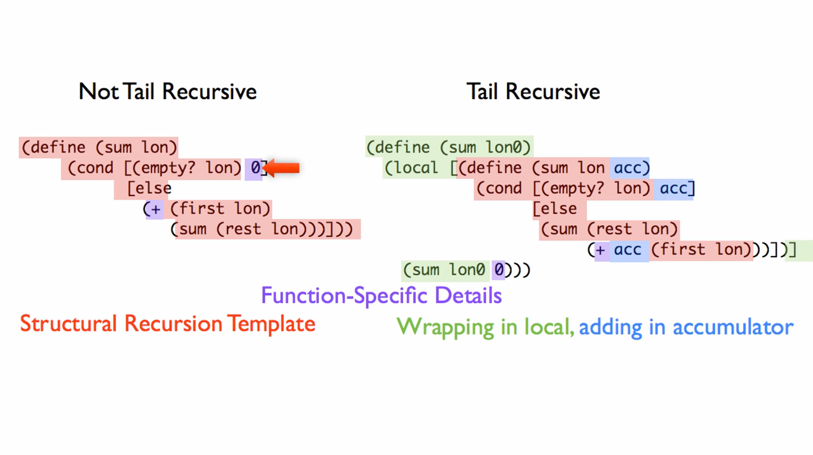
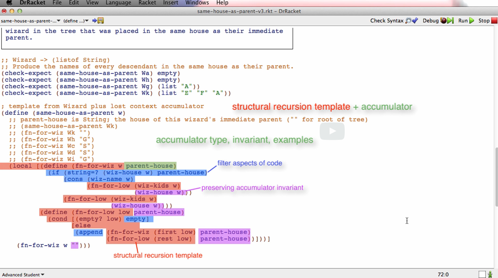

# 11: Accumulators

## Module Overview

The rules we have been using to generate structural recursion templates are very powerful. They make it easy to write functions that traverse complex data collecting information at every place in that data. The power of these rules is highlighted by our ability to design abstract fold functions for recursive and mutually recursive types.

But the structural recursion templates have one problem: while they make it easy for our functions to see each "place" in the structure once we get to it, they do not allow us to see two kinds of important contextual information. One has to do with where our function has already been in the traversal, and the other has to do with work remaining to be done once each recursive call to our function produces its result. To paraphrase the song, "we know where we are, but we don't know where we've been or where we still need to go".

Accumulators allow us to solve these problems. There are three types of accumulators: context preserving, result so far and worklist. The latter two are used in different ways to make functions tail-recursive, which is important when we design recursive functions that traverse very large data. All three kinds of accumulators are supported by a few small additions to the HtDF recipe.

Learning Goals:

- Be able to identify when a function design requires the use of accumulator.
- Be able to work with the accumulator design recipe to design such functions.
- Understand and be able to explain the concepts of tail position, tail call and tail recursion.

## Context Preserving Accumulators

[contextPreservingAccumulators.no-image.rkt](https://github.com/squxq/How-to-Code-Complex-Data/blob/week-11/modules/week-11/contextPreservingAccumulators/contextPreservingAccumulators.no-image.rkt)

We’re going to look at another kind of design element called an accumulator. There are three basic ways to use accumulators. The first kind of accumulator we’re going to look at is called a context preserving accumulator- preserves context that otherwise gets lost in structural recursion.

> Design a function that consumes a list of elements and produces the list consisting of only the 1st, 3rd, 5th and so on elements of its input.
> 
> 
> (skip1 (list "a" "b" "c" "d")) should produce (list "a" "c")
> 

We’re going to start out pretending we don’t know this function requires an accumulator.

```racket
;; (listof X) -> (listof X)
;; produce list consisting of only the 1st, 3rd, 5th, ... elements of given list, lox

;; Stub:
(define (skip1 lox) empty)

;; Tests:
(check-expect (skip1 (list "a" "b" "c" "d")) (list "a" "c"))
(check-expect (skip1 (list 1 2 3 4 5 6)) (list 1 3 5))

;; Template: <used template for (listof X)>
(define (skip1 lox)
  (cond [(empty? lox) empty]
        [else
         (if (odd? POSITION-OF-FIRST-LOX)
             (cons (first lox)
                   (skip1 (rest lox)))
             (skip1 (rest lox)))]))
```

Since this function operates on any X, it cannot contain a function which operates on a specific type. We don’t know what that “POSITION-OF-FIRST-LOX” is. In some sense, at the beginning, that position is 1, but by the time we get to the next element, we don’t know the position anymore.

This context information about how far we are is lost in the structural recursion template. We need a way to preserve the context of how far we’ve gone. This is a classic context preserving accumulator problem. To generate an accumulator template we follow this 3 parts:

1. Structural recursion template.
2. Wrapping function in outer function, local and trampoline.
3. Adding additional accumulator parameter.

```racket
;; Template: <used template for (listof X)>
(define (skip1 lox0)
  (local [(define (skip1 lox acc)
            ;; acc: Natural; 1-based position of (first lox) in lox0 ; accumulator invariant
            (cond [(empty? lox) (... acc)]
                  [else
                   (... acc
                       (first lox)
                       (skip1 (rest lox) (... acc)))]))]

    (skip1 lox0 ...)))
```

That is kind of a signature and purpose for the parameter “acc”. To do the examples, work out the progression of calls to the inner function.

We’re using the accumulator type and invariant to figure out the examples for the accumulator, like we used the signature and purpose of a function to figure out the examples for the function.

```racket
;; Template: <used template for (listof X)>
(define (skip1 lox0)
  ;; acc: Natural; 1-based position of (first lox) in lox0

  ;; Examples:
  ;; (skip1 (list "a" "b" "c") 1)
  ;; (skip1 (list     "b" "c") 2)
  ;; (skip1 (list         "c") 3)
  
  (local [(define (skip1 lox acc)
            (cond [(empty? lox) empty]
                  [else
                   (if (odd? acc)
                       (cons (first lox) (skip1 (rest lox) (add1 acc)))
                       (skip1 (rest lox) (add1 acc)))]))]

    (skip1 lox0 1)))
```

When we’re filling in the details there’s always three things we need to do with the accumulator:

- Provide initial value or initialize it: (skip1 lox0 1).
- Exploit/use the value of the accumulator, in other words, take advantage of the fact that the comment, that says what the accumulator represents, is right: (odd? acc).
- Update accumulator to preserve invariant, the fact that we’ve set about the it: (add1 acc).

Accumulator invariant: something that’s always true about the accumulator - even though the value changes, because it changes as we go along, there’s something about it which doesn’t change. The accumulator is a varying quantity about which some fact does not change, does not vary.

### Question 47: Problem 1

[problem-01.no-image.rkt](https://github.com/squxq/How-to-Code-Complex-Data/blob/week-11/modules/week-11/contextPreservingAccumulators/problem-01.no-image.rkt)

> You are asked to design a function that numbers a list of strings by  inserting a number and a colon before each element of the list based on its position. So for example:
> 
> 
> (number-list (list "first" "second" "third")) would produce (list "1: first" "2: second" "3: third")
> 

```racket
;; (listof String) -> (listof String)
;; given a list of strings, los, produce a list of string where each element
;; is made up from concatenating its position to its value in los

;; Stub:
#; (define (number-list los0) los)

;; Tests:
(check-expect (number-list empty) empty)
(check-expect (number-list (list "a")) (list "1: a"))
(check-expect (number-list (list "a" "b" "c")) (list "1: a" "2: b" "3: c"))

;; Template: <used template for (listof String) and Accumulator>
(define (number-list los0)
  ;; acc: Natural; 1-based position of (first los) in los0

  ;; Examples:
  ;; (number-list (list "a" "b" "c") 1)
  ;; (number-list (list     "b" "c") 2)
  ;; (number-list (list         "c") 3)
  
  (local [(define (number-list los acc)
            (cond [(empty? los) empty]
                  [else
                   (cons (string-append (number->string acc)": " (first los))
                         (number-list (rest los) (add1 acc)))]))]

    (number-list los0 1)))
```

### Question 48: Drop N

[dropn-starter.no-image.rkt](https://github.com/squxq/How-to-Code-Complex-Data/blob/week-11/modules/week-11/contextPreservingAccumulators/dropn-starter.no-image.rkt)

> Design a function that consumes a list of elements lox and a natural number n and produces the list formed by dropping every nth element from lox.
> 
> 
> (dropn (list 1 2 3 4 5 6 7) 2) should produce (list 1 2 4 5 7)
> 

```racket
;; (listof X) Natural -> (listof X)
;; produce a list formed by dropping every given natural, n, nth element of
;; given list, lox

;; Stub:
#; (define (dropn lox0 n) lox)

;; Tests:
(check-expect (dropn empty 3) empty)
(check-expect (dropn (list 1 2) 0) empty)
(check-expect (dropn (list 1 2 3 4 5 6 7) 2) (list 1 2 4 5 7))

;; Template: <used template for list and context-preserving accumulator>
(define (dropn lox0 n)
  ;; countup is Natural[0, n]
  ;; INVARIANT: the number of elements in lox0 that have been added to the result
  ;;            when countup = n, do not add (first lox) and reset the countup to 0
  (local [(define (dropn lox countup)
            (cond [(empty? lox) empty]
                  [else
                   (if (= n countup)
                       (dropn (rest lox) 0)
                       (cons (first lox) (dropn (rest lox) (add1 countup))))]))]

    (dropn lox0 0)))
```

### Question 49: Replicate Elm

[replicate-elm-starter.no-image.rkt](https://github.com/squxq/How-to-Code-Complex-Data/blob/week-11/modules/week-11/contextPreservingAccumulators/replicate-elm-starter.no-image.rkt)

> Design a function that consumes a list of elements and a natural n, and produces a list where each element is replicated n times.
> 
> 
> (replicate-elm (list "a" "b" "c") 2) should produce (list "a" "a" "b" "b" "c" "c")
> 

```racket
;; (listof X) Natural -> (listof X)
;; produce a list where each element in given list, lox, is replicated given, n, times

;; Stub:
#; (define (replicate-elm lox0 n) lox0)

;; Tests:
(check-expect (replicate-elm empty 2) empty)
(check-expect (replicate-elm (list 1 2) 0) empty)
(check-expect (replicate-elm (list 1 2) 1) (list 1 2))
(check-expect (replicate-elm (list "a" "b" "c") 2)
              (list "a" "a" "b" "b" "c" "c"))

;; Template: <used template for list and context-preserving accumulator>
(define (replicate-elm lox0 n)
  ;; countdown is Natural
  ;; INVARIANT: number of (first lox) elements that still need to be copied
  ;;            before moving on to the next of the elements in lox0
  (local [(define (replicate-elm lox countdown)
            (cond [(empty? lox) empty]
                  [else
                   (if (zero? countdown)
                       (replicate-elm (rest lox) n)
                       (cons (first lox) (replicate-elm lox (sub1 countdown))))]))]

    (replicate-elm lox0 n)))
```

### Question 50: Strictly Decreasing

[strictly-decreasing-starter.no-image.rkt](https://github.com/squxq/How-to-Code-Complex-Data/blob/week-11/modules/week-11/contextPreservingAccumulators/strictly-decreasing-starter.no-image.rkt)

> Design a function that consumes a list of numbers and produces true if the numbers in lon are strictly decreasing. You may assume that the list has at least two elements.
> 

```racket
;; (listof Number) -> Boolean
;; produce true if the numbers in given list of number, lon, are strictly decreasing
;; otherwise false
;; ASSUME: (length lon) >= 2

;; Stub:
#; (define (decreasing? lon0) false)

;; Tests:
(check-expect (decreasing? (list 1 2)) false)
(check-expect (decreasing? (list 2 2)) false)
(check-expect (decreasing? (list 2 1)) true)

;; Template: <used template for list and context-preserving accummulator>
(define (decreasing? lon0)
  ;; previous is Number
  ;; INVARIANT: previous number to (first lon) in lon0
  (local [(define (decreasing? lon previous)
            (cond [(empty? lon) true]
                  [else
                   (and (< (first lon) previous)
                        (decreasing? (rest lon) (first lon)))]))]

    (decreasing? (rest lon0) (first lon0))))
```

## Sample Problem: “skipn”

[skipn--sampleProblem.no-image.rkt](https://github.com/squxq/How-to-Code-Complex-Data/blob/week-11/modules/week-11/skipn--sampleProblem/skipn--sampleProblem.no-image.rkt)

> Design a function that consumes a list of elements lox and a natural number n and produces the list formed by including the first element of lox, then skipping the next n elements, including an element, skipping the next n and so on.
> 
> 
> (skipn (list "a" "b" "c" "d" "e" "f") 2) should produce (list "a" "d")
> 

```racket
;; (listof X) Natural -> (listof X)
;; produce a filtered list where each element has, in the given list, lox,
;; index = 0 | given natural, n, multiple of n + 1

;; Stub:
#; (define (skipn lox0 n0) lox)

;; Tests:
(check-expect (skipn empty 1) empty) ;; any n would produce empty
(check-expect (skipn (list 1 2 3) 0) (list 1 2 3)) ;; n = 0 produces lox
(check-expect (skipn (list 1) 9) (list 1)) ;; any n always produces lox's index 0
(check-expect (skipn (list "a" "b" "c" "d" "e" "f") 2) (list "a" "d"))

;; Template: <used template for (listof X) and for Accumulator>
#; (define (skipn lox0 n0)
     (local [;; Natural
             ;; n, n = n0 + 1
             (define n (add1 n0))

             ;; acc: Natural; 0-indexed position of (first lox) in given lox0

             ;; Examples:
             ;; (skipn (list "a" "b" "c") 0)
             ;; (skipn (list     "b" "c") 1)
             ;; (skipn (list         "c") 2)
          
             (define (skipn lox acc)
               (cond [(empty? lox) empty]
                     [else
                      (if (= (remainder acc n) 0)
                          (cons (first lox) (skipn (rest lox) (add1 acc)))
                          (skipn (rest lox) (add1 acc)))]))]

       (skipn lox0 0)))

;; or using the accumulator as a count-down

;; Template: <used template for (listof X) and for Accumulator>
#; (define (skipn lox0 n0)
     (local [;; acc: Natural; the number of elements to skip before including
             ;;               the next one

             ;; Examples:
             ;; (skipn (list "a" "b" "c" "d") 0)
             ;; (skipn (list     "b" "c" "d") 2)
             ;; (skipn (list         "c" "d") 1)
             ;; (skipn (list             "d") 0)
             ;; (skipn (list                ) 2)
          
             (define (skipn lox acc)
               (cond [(empty? lox) empty]
                     [else
                      (if (zero? acc)
                          (cons (first lox) (skipn (rest lox) n0))
                          (skipn (rest lox) (sub1 acc)))]))]

       (skipn lox0 0)))

;; or using the accumulator as a count-up

;; Template: <used template for (listof X) and for Accumulator>
(define (skipn lox0 n0)
  (local [;; acc: Natural; the number of elements that were skipped
          ;;               since the last one was included

          ;; Examples:
          ;; (skipn (list "a" "b" "c" "d") 2)
          ;; (skipn (list     "b" "c" "d") 0)
          ;; (skipn (list         "c" "d") 1)
          ;; (skipn (list             "d") 2)
          ;; (skipn (list                ) 0)
          
          (define (skipn lox acc)
            (cond [(empty? lox) empty]
                  [else
                   (if (= acc n0)
                       (cons (first lox) (skipn (rest lox) 0))
                       (skipn (rest lox) (add1 acc)))]))]

    (skipn lox0 n0)))
```

## Tail Recursion

[tailRecursion.no-image.rkt](https://github.com/squxq/How-to-Code-Complex-Data/blob/week-11/modules/week-11/tailRecursion/tailRecursion.no-image.rkt)

[tailRecursion.png](https://github.com/squxq/How-to-Code-Complex-Data/blob/week-11/modules/week-11/tailRecursion/tailRecursion.png)

We’re going to start looking at a second way to use accumulators, which is to make a recursive function, or a set of mutually recursive functions tail recursive. First we have to understand what tail recursion means, and why it matters.

> (A) Consider the following function that consumes a list of numbers and produces
the sum of all the numbers in the list. Use the stepper to analyze the behavior
of this function as the list gets larger and larger.
> 
> 
> (B) Use an accumulator to design a tail-recursive version of sum.
> 

```racket
;; (listof Number) -> Number
;; produce sum of all elements of lon

;; Stub:
#; (define (sum lon) 0)

;; Tests:
(check-expect (sum empty) 0)
(check-expect (sum (list 2 4 5)) 11)

;; Template: <used template for (listof Number)>
(define (sum lon)
  (cond [(empty? lon) 0]
        [else
         (+ (first lon)
            (sum (rest lon)))]))

(sum (list 1 2 3 4 5))
```

By doing part (A), when we are done processing all the elements in the array, through recursion,this is what the stepper shows is happening:

```racket
(+ 1 (+ 2 (+ 3 (+ 4 (+ 5 0)))))
```

What we can see here is we’ve got all these pluses built up, waiting to happen. And then kind of at the very end, we end up with 15. What happens as the list gets long? As the list gets long, this pending computation, this set of pluses that are waiting to happen, is going to get longer and longer. Does this matter?

It turns out it does matter for the following reason, which is that what DrRacket has to do to make ISL programs run quickly, what any programming language has to do to make programs like this run quickly, is it stores this saved context. It stores this saved context in a special part of the computer’s memory called the stack, which happens to be very limited and expensive part of computer memory.

If we could find a way to add up long lists without using proportionally more stack, that would be better. Why did this get built up? The answer has to do with a couple of new concepts, known as tail position and a function call in tail position, and a recursive function call in tail position.

```racket
(+ (first lon)
   (sum (rest lon)))
```

This expression is in what’s called tail position. The result of this expression will be the result of the function. Whenever an expression is in a position where its result is the result of the enclosing function it is in tail position.

```racket
(first lon)
```

It’s not in tail position, its result is not the final result of the function; its result gets operated on by function “+” first.

```racket
(sum (rest lon))
```

This is not in tail position also, because whatever “sum” produces still has to get handed to “+” before it becomes the result of the enclosing call to “sum”. This recursive call, that is not in tail position is what causes the build up of growing context of pending operations, because all operands must be evaluated before the operator can operate. Therefore, the “+ 1” gets put in the stack as a pending operation while we go figure out the value of “sum(2 3 4 5)”, for example.

To avoid building up context of pending computation, we need to make a version of sum with the recursive call in tail position: a tail recursion version of sum. As data gets larger, the pending computations take up more and more of the stack: this is a problem.

```racket
;; Template: <used template for (listof Number) and Accumulator>
(define (sum lon0)
  (local [(define (sum lon acc)
            (cond [(empty? lon) (... acc)]
                  [else
                   (... acc
                        (first lon)
                        (sum (rest lon) (... acc)))]))]

    (sum lon0 ...)))
```

“(sum (rest lon) (... acc))” this needs to be the outermost call of the “else” answer to be in tail position. The “+” function cannot be waiting for sum to return.

```racket
;; Template: <used template for (listof Number) and Accumulator>
(define (sum lon0)
  ;; acc: Number; the sum of the elements of lon0 seen so far

  ;; Examples:
  ;; (sum (list 2 4 5))
  ;; (sum (list 2 4 5) 0)
  ;; (sum (list   4 5) 2)
  ;; (sum (list     5) 6)
  ;; (sum (list      ) 11)
  
  (local [(define (sum lon acc)
            (cond [(empty? lon) acc]
                  [else
                   (sum (rest lon)
                        (+ acc (first lon)))]))]

    (sum lon0 0)))
```



“foldr” is the not tail recursive, while “foldl” is the tail recursive abstract fold function for lists.

Making a function tail recursive using accumulator:

1. Template according to accumulator recipe.
2. Delete part of template wrapping around recursive call.
3. Computation that would have been around recursive call moves to be in accumulator argument position.

### Question 51: Average

[average-tr-starter.no-image.rkt](https://github.com/squxq/How-to-Code-Complex-Data/blob/week-11/modules/week-11/tailRecursion/average-tr-starter.no-image.rkt)

> Design a function called average that consumes (listof Number) and produces the average of the numbers in the list.
> 

```racket
;; (listof Number) -> Number
;; produce the average of all numbers in the given list of numbers, lon

;; Stub:
#; (define (average lon0) 0)

;; Tests:
(check-expect (average empty) 0)
(check-expect (average (list 1)) 1)
(check-expect (average (list 7)) 7)
(check-expect (average (list 1 2 3)) 2)
(check-expect (average (list 1 2 3 4)) 2.5)

;; Template: <used template for list, result-so-far accumulator
;;            and context-preserving accumulator>
(define (average lon0)
  ;; count is Natural
  ;; INVARIANT: 1-based counter of elements in lon0: for every (first lon) add 1

  ;; sum is Number
  ;; INVARIANT: sum of all elements in lon0 visited so far: sum = sum + (first lon)
  
  (local [(define (average lon counter sum)
            (cond [(empty? lon) (/ sum counter)]
                  [else
                   (average (rest lon)
                            (add1 counter)
                            (+ sum (first lon)))]))]

    (if (empty? lon0)
        0
        (average lon0 0 0))))
```

### Question 52: Product

[product-tr-starter.no-image.rkt](https://github.com/squxq/How-to-Code-Complex-Data/blob/week-11/modules/week-11/tailRecursion/product-tr-starter.no-image.rkt)

> (A) Consider the following function that consumes a list of numbers and produces the product of all the numbers in the list. Use the stepper to analyze the behavior of this function as the list gets larger and larger.
> 
> 
> (B) Use an accumulator to design a tail-recursive version of product.
> 

```racket
;; (listof Number) -> Number
;; produce product of all elements of lon

;; Stub:
#; (define (produce lon) 0)

;; Tests:
(check-expect (product empty) 1)
(check-expect (product (list 2 3 4)) 24)

;; Template: <used template for list>
(define (product lon)
  (cond [(empty? lon) 1]
        [else
         (* (first lon)
            (product (rest lon)))]))

(product (list 2 3 4))
;; produces this: (* 2 (* 3 (* 4 1)))

;The primary issue with the behavior of a non-tail-recursive function as the data
;gets larger and larger is the potential for stack overflow. In non-tail-recursive
;functions, each recursive call adds a new frame to the call stack. As the recursion
;deepens, the stack grows, and if the depth of the recursion becomes too large, it
;can lead to a stack overflow.
;
;When a stack overflow occurs, it means that the call stack has exceeded its
;available memory, and the program typically crashes. This limitation is inherent
;in many programming languages that rely on a call stack to manage function calls.
;
;Tail-recursive functions, on the other hand, have a special property called tail-call
;optimization (TCO). In a tail-recursive function, the recursive call is the last
;operation performed in the function, and TCO allows the compiler to optimize away
;the need for additional stack frames. This optimization essentially converts the
;recursion into an iterative process, preventing the stack from growing indefinitely
;and mitigating the risk of a stack overflow.
;
;In summary, the problem with non-tail-recursive functions, especially when dealing
;with large datasets, is the potential for stack overflow due to the accumulation
;of stack frames. Tail-recursive functions, with proper optimization, address this
;issue by eliminating the need for additional stack frames in each recursive call.

;; Template: <used template for list and for result-so-far accumulator>
(define (product lon0)
  ;; prod is Number
  ;; INVARIANT: product of all visited numbers of lon0; prod = prod * (first lon)
  
  (local [(define (product lon prod)
            (cond [(empty? lon) prod]
                  [else
                   (product (rest lon)
                            (* prod (first lon)))]))]
    (product lon0 1)))
```

### Question 53: Sum N

[sum-n-tr-starter.no-image.rkt](https://github.com/squxq/How-to-Code-Complex-Data/blob/week-11/modules/week-11/tailRecursion/sum-n-tr-starter.no-image.rkt)

> Consider the following function that consumes Natural number n and produces the sum of all the naturals in [0, n].
> 
> 
> Use an accumulator to design a tail-recursive version of sum-n.
> 

```racket
;; Natural -> Natural
;; produce sum of Natural[0, n]

;; Stub:
#; (define (sum-n n0) n0)

;; Tests:
(check-expect (sum-n 0) 0)
(check-expect (sum-n 1) 1)
(check-expect (sum-n 3) (+ 3 2 1 0))

;; Template: <used template for Natural>
#; (define (sum-n n)
     (cond [(zero? n) 0]
           [else
            (+ n
               (sum-n (sub1 n)))]))

;; or using a result-so-far accumulator

;; Template: <used template for Natural and result-so-far accumulator>
(define (sum-n n0)
  ;; sum is Natural (Natural + Natural = Natural)
  ;; INVARIANT: sum of all natural numbers n, n <= n0
  
  (local [(define (sum-n n sum)
            (cond [(zero? n) sum]
                  [else
                   (sum-n (sub1 n) (+ n sum))]))]

    (sum-n n0 0)))
```

### Question 54: Sum Odds

[sum-odds-tr-starter.no-image.rkt](https://github.com/squxq/How-to-Code-Complex-Data/blob/week-11/modules/week-11/tailRecursion/sum-odds-tr-starter.no-image.rkt)

> Consider the following function that consumes a list of numbers and produces the sum of all the odd numbers in the list.
> 
> 
> Use an accumulator to design a tail-recursive version of sum-odds.
> 

```racket
;; (listof Number) -> Number
;; produce sum of all odd numbers of lon

;; Stub:
#; (define (sum-odds lon) 0)

;; Tests:
(check-expect (sum-odds empty) 0) 
(check-expect (sum-odds (list 1 2 5 6 11)) 17) 

;; Template: <used template for list>
#; (define (sum-odds lon)
     (cond [(empty? lon) 0]
           [else
            (if (odd? (first lon))
                (+ (first lon)
                   (sum-odds (rest lon)))
                (sum-odds (rest lon)))]))

;; or using a result-so-far accumulator

;; Template: <used template for list and result-so-far accumulator>
(define (sum-odds lon0)
  ;; sum is Number
  ;; INVARIANT: sum of all visited (first lon) in lon0
  
  (local [(define (sum-odds lon sum)
            (cond [(empty? lon) sum]
                  [else
                   (if (odd? (first lon))
                       (sum-odds (rest lon) (+ (first lon) sum))
                       (sum-odds (rest lon) sum))]))]

    (sum-odds lon0 0)))

(sum-odds (list 1 2 3 4 5 6 7 8 9))
```

### Question 55: To List

[to-list-tr-starter.no-image.rkt](https://github.com/squxq/How-to-Code-Complex-Data/blob/week-11/modules/week-11/tailRecursion/to-list-tr-starter.no-image.rkt)

> Consider the following function that consumes Natural number n and produces a list of all the naturals of the form (list 1 2 ... n-1 n) not including 0.
> 
> 
> Use an accumulator to design a tail-recursive version of to-list.
> 

```racket
;; Natural -> (listof Natural) 
;; produce (cons n (cons n-1 ... empty)), not including 0

;; Stub:
#; (define (to-list n) empty)

;; Tests:
(check-expect (to-list 0) empty)
(check-expect (to-list 1) (list 1))
(check-expect (to-list 3) (list 1 2 3))

;; Template: <used template for Natural>
#; (define (to-list n)
     (cond [(zero? n) empty]
           [else
            (append (to-list (sub1 n))
                    (list n))]))

;; tail-recursive version of "to-list" using a result-so-far accumulator

;; Template: <used template for Natural and result-so-far accumulator>
(define (to-list n0)
  ;; rsf is (listof Natural)
  ;; INVARIANT: list of all visited naturals, n, n <= n0
  
  (local [(define (to-list n rsf)
            (cond [(zero? n) rsf]
                  [else
                   (to-list (sub1 n) (cons n rsf))]))]

    (to-list n0 empty)))
```

### Question 56: Count Odd Even

[count-odd-even-tr-starter.no-image.rkt](https://github.com/squxq/How-to-Code-Complex-Data/blob/week-11/modules/week-11/tailRecursion/count-odd-even-tr-starter.no-image.rkt)

> Previously we have written functions to count the number of elements in a list. In this problem we want a function that produces separate counts of the number of odd and even numbers in a list, and we only want to traverse the list once to produce that result.
> 
> 
> Design a tail recursive function that produces the Counts for a given list of numbers. Your function should produce Counts, as defined by the data definition below.
> 
> There are two ways to code this function, one with 2 accumulators and one with a single accumulator. You should provide both solutions.
> 

```racket
;; =================
;; Data Definitions:

(define-struct counts (odds evens))
;; Counts is (make-counts Natural Natural)
;; interp. describes the number of even and odd numbers in a list

;; Examples:
(define C1 (make-counts 0 0)) ;describes an empty list
(define C2 (make-counts 3 2)) ;describes (list 1 2 3 4 5))

;; =====================
;; Function Definitions:

;; (listof Number) -> Counts
;; produce separate counts of the number of odd and even numbers in given lon

;; Stub:
#; (define (count-odd-even lon) C1)

;; Tests:
(check-expect (count-odd-even empty) C1)
(check-expect (count-odd-even (list 1)) (make-counts 1 0))
(check-expect (count-odd-even (list 2 2)) (make-counts 0 2))
(check-expect (count-odd-even (list 1 2 3 4 5)) C2)

;; Template: <used template for list and for result-so-far accumulator>
#; (define (count-odd-even lon0)
     ;; odd is Natural
     ;; INVARIANT: the number of visited odd (first lon) in lon0

     ;; even is Natural
     ;; INVARIANT: the number of visited even (first lon) in lon0
  
     (local [(define (count-odd-even lon odd even)
               (cond [(empty? lon) (make-counts odd even)]
                     [else
                      (if (odd? (first lon))
                          (count-odd-even (rest lon) (add1 odd) even)
                          (count-odd-even (rest lon) odd (add1 even)))]))]

       (count-odd-even lon0 0 0)))

;; or

;; Template: <used template for list and for result-so-far accumulator>
#; (define (count-odd-even lon0)
  ;; odd is Natural
  ;; INVARIANT: the number of visited odd (first lon) in lon0
  ;; NOTE: (length lon0) >= odd
  
  (local [(define (count-odd-even lon odd)
            (cond [(empty? lon)
                   (make-counts odd (- (length lon0) odd))]
                  [else
                   (if (odd? (first lon))
                       (count-odd-even (rest lon) (add1 odd))
                       (count-odd-even (rest lon) odd))]))]

    (count-odd-even lon0 0)))

;; or

;; Template: <used template for list and for result-so-far accumulator>
(define (count-odd-even lon0)
  ;; rsf is Counts
  ;; INVARIANT: the number of visited odd (first lon) in lon0
  
  (local [(define (count-odd-even lon rsf)
            (cond [(empty? lon) rsf]
                  [else
                   (if (odd? (first lon))
                       (count-odd-even (rest lon)
                                       (make-counts (add1 (counts-odds rsf))
                                                    (counts-evens rsf)))
                       (count-odd-even (rest lon)
                                       (make-counts (counts-odds rsf)
                                                    (add1 (counts-evens rsf)))))]))]

    (count-odd-even lon0 (make-counts 0 0))))
```

### Question 57: Rev

[rev-tr-starter.no-image.rkt](https://github.com/squxq/How-to-Code-Complex-Data/blob/week-11/modules/week-11/tailRecursion/rev-tr-starter.no-image.rkt)

> Design a function that consumes (listof X) and produces a list of the same elements in the opposite order. Use an accumulator. Call the function rev. (DrRacket's version is called reverse.) Your function should be tail recursive.
> 
> 
> In this problem only the first step of templating is provided.
> 

```racket
;; (listof X) -> (listof X)
;; produce list with elements of lox in reverse order

;; Stub:
#; (define (rev lox) empty)

;; Tests:
(check-expect (rev empty) empty)
(check-expect (rev (list 1)) (list 1))
(check-expect (rev (list "a" "b" "c")) (list "c" "b" "a"))

;; Template: <used template for list>
#; (define (rev lox)
     (cond [(empty? lox) empty]
           [else
            (append (rev (rest lox))
                    (list (first lox)))]))

;; Template: <used template for list and result-so-far accumulator>
(define (rev lox0)
  ;; rsf is (listof X)
  ;; INVARIANT: list of all (first lox) seen so far; the most recent ones come first
  
  (local [(define (rev lox rsf)
            (cond [(empty? lox) rsf]
                  [else
                   (rev (rest lox) (cons (first lox) rsf))]))]

    (rev lox0 empty)))
```

## Worklist Accumulators - Part 1

[worklistAccumulators.no-image.rkt](https://github.com/squxq/How-to-Code-Complex-Data/blob/week-11/modules/week-11/worklistAccumulators-01/worklistAccumulators.no-image.rkt)

[worklistAccumulators.png](https://github.com/squxq/How-to-Code-Complex-Data/blob/week-11/modules/week-11/worklistAccumulators-01/worklistAccumulators.png)

What we’ll be working on is a descendant family tree, which is modeled after Harry Potter - wizards in a descendant family tree, where each wizard has: a name; a house; their children.

> In the Harry Potter movies, it is very important which of the four houses a wizard is placed in when they are at Hogwarts. This is so important that in most families multiple generations of wizards are all placed in the same family.
> 
> 
> Design a representation of wizard family trees that includes, for each wizard, their name, the house they were placed in at Hogwarts and their children. We encourage you to get real information for wizard families from: [http://harrypotter.wikia.com/wiki/Main_Page](http://harrypotter.wikia.com/wiki/Main_Page)
> 
> The reason we do this is that designing programs often involves collection domain information from a variety of sources and representing it in the program as constants of some form. So this problem illustrates a fairly common scenario.
> 
> That said, for reasons having to do entirely with making things fit on the screen in later videos, we are going to use the following wizard family tree, in which wizards and houses both have 1 letter names. (Sigh)
> 

```racket
;; =================
;; Data Definitions:

;; House is one of:
;; - "G"
;; - "H"
;; - "R"
;; - "S"
;; interp. Hogwarts School of Witchcraft and Wizardry is divided this in four houses

;; Template:
#; (define (fn-for-house h)
     (cond [(string=? "G" h) (...)]
           [(string=? "H" h) (...)]
           [(string=? "R" h) (...)]
           [else (...)])) ;; (string=? "S" h)

(define-struct wizard (name house children))
;; Wizard is (make-wizard String House (listof Wizard))
;; interp. wizard from the Harry Potter wiki with:
;;         - name, is the wizard's name first letter
;;         - house, is the first letter of the house the
;;           wizard was placed in at Hogwarts
;;         - children, is a list of the wizard's children

;; Template:
#; (define (fn-for-wizard w)
     (local [(define (fn-for--wizard w)
               (... (wizard-name w)
                    (fn-for-house (wizard-house w))
                    (fn-for--low (wizard-children w))))

             (define (fn-for--low low)
               (cond [(empty? low) (...)]
                     [else
                      (... (fn-for--wizard (first low))
                           (fn-for--low (rest low)))]))]

       (fn-for--wizard w)))

;; =====================
;; Constant Definitions:

;; WIZARDS:

(define Wa (make-wizard "A" "S" empty))
(define Wb (make-wizard "B" "G" empty))
(define Wc (make-wizard "C" "R" empty))
(define Wd (make-wizard "D" "H" empty))
(define We (make-wizard "E" "R" empty))
(define Wf (make-wizard "F" "R" (list Wb)))
(define Wg (make-wizard "G" "S" (list Wa)))
(define Wh (make-wizard "H" "S" (list Wc Wd)))
(define Wi (make-wizard "I" "H" empty))
(define Wj (make-wizard "J" "R" (list We Wf Wg)))
(define Wk (make-wizard "K" "G" (list Wh Wi Wj)))
```

> Design a function that consumes a wizard and produces the names of every wizard in the tree that was placed in the same house as their immediate parent.
> 

```racket
;; =====================
;; Function Definitions:

;; Wizard -> (listof String)
;; produce the name of every wizard in the given wizard family tree, w, that was
;; placed in the same house as their immediate parent

;; Stub:
#; (define (same-house-as-parent w) empty)

;; Tests:
(check-expect (same-house-as-parent Wa) empty) ;; no children
(check-expect (same-house-as-parent Wf) empty) ;; w is in house R & child is in G
(check-expect (same-house-as-parent Wg) (list "A")) ;; child of given w
;; first two are children of w, and third one is child of w's child Wg
(check-expect (same-house-as-parent Wj) (list "E" "F" "A"))
(check-expect (same-house-as-parent Wk) (list "E" "F" "A"))

;; Template: <used template from Wizard and for Context Preserving Accumulator>
(define (same-house-as-parent w)
  ;; acc: House; the house of this wizard's immediate parent
  ;; ASSUME: wizard, w, always has a parent, because root wizard is
  ;;         never passed into a function. fn-for--low is called for
  ;;         all children of root wizard, so we are at depth 1

  ;; Example:
  ;; (same-house-as-parent Wj)
  ;; (fn-for--low (list We Wf Wg) "R")
  ;; (fn-for--wizard (make-wizard "E" "R" empty) "R")
  ;; (fn-for--low empty "R")
  ;; (fn-for--wizard (make-wizard "F" "R" (list Wb)) "R")
  ;; (fn-for--low (list Wb) "R")
  ;; (fn-for--wizard (make-wizard "B" "G" empty) "R")
  ;; (fn-for--low empty "G")
  ;; (fn-for--wizard (make-wizard "G" "S" (list Wa)) "R")
  ;; (fn-for--low (list Wa) "S")
  ;; (fn-for--wizard (make-wizard "A" "S" empty) "S")
  
  (local [(define (fn-for--wizard w acc)
            (if (string=? (wizard-house w) acc)
                (cons (wizard-name w)
                      ;; here we don't need to change acc, because
                      ;; w parent's house is the same as w's house
                      (fn-for--low (wizard-children w) acc))
                (fn-for--low (wizard-children w) (wizard-house w))))

          (define (fn-for--low low acc)
            (cond [(empty? low) empty]
                  [else
                   (append (fn-for--wizard (first low) acc)
                           (fn-for--low (rest low) acc))]))]

    (fn-for--low (wizard-children w) (wizard-house w))))
```

When adding an accumulator to mutually recursive functions, it needs to be added to all the functions.



## Worklist Accumulators - Part 2

[worklistAccumulators.no-image.rkt](https://github.com/squxq/How-to-Code-Complex-Data/blob/week-11/modules/week-11/worklistAccumulators-02/worklistAccumulators.no-image.rkt)

[worklistAccumulators.png](https://github.com/squxq/How-to-Code-Complex-Data/blob/week-11/modules/week-11/worklistAccumulators-02/worklistAccumulators.png)

> Design a function that consumes a wizard and produces the number of wizards in that tree (including the root). Your function should be tail recursive.
> 

```racket
;; Wizard -> Natural
;; produces the total number of wizards in the given wizard tree, w,
;; including the root

;; Stub:
#; (define (count w) 0)

;; Tests:
(check-expect (count Wa) 1)
(check-expect (count Wk) 11)
```

Oftentimes, when using an accumulator to achieve tail recursion, that accumulator ends up being the result so far.

```racket
;; Template: <used template from Wizard and for Context Preserving Accumulators>
(define (count w)
  ;; rsf is 
  (local [(define (fn-for--wizard w rsf)
            (... rsf
                 (wizard-name w)
                 (fn-for-house (wizard-house w))
                 (fn-for--low (wizard-children w) (... rsf))))

          (define (fn-for--low low rsf)
            (cond [(empty? low) (... rsf)]
                  [else
                   (... rsf
                        (fn-for--wizard (first low) (... rsf))
                        (fn-for--low (rest low) (... rsf)))]))]

    (fn-for--wizard w ...)))
```

We’re putting “(… rsf)”, because the result so far might have something to do with “rsf”; it might also have to do with the other elements: “(wiz-name, wiz-house, (first low), etc.)”, but we’re just putting “rsf” in for now.

The key thing about tail recursion in mutually recursive functions is that every single mutually recursive call has to be in tail position. In mutually recursive functions with accumulators, usually only one of the functions provides new values for each accumulator, not all of them.

```racket
;; Template: <used template from Wizard and for Context Preserving Accumulators>
(define (count w)
  ;; rsf is Natural; the number of wizards seen so far

  ;; Example:
  ;; (count Wk)
  
  ;; (fn-for-wiz Wk 0)
  ;; (fn-for-wiz Wh 1)
  ;; (fn-for-wiz Wc 2)
  ;; ...
  
  (local [(define (fn-for--wizard w rsf)
            (... rsf
                 (wizard-name w)
                 (fn-for-house (wizard-house w))
                 (fn-for--low (wizard-children w) (add1 rsf))))

          (define (fn-for--low low rsf)
            (cond [(empty? low) (... rsf)]
                  [else
                   (+ (fn-for--wizard (first low) rsf)
                      (fn-for--low (rest low) rsf))]))]

    (fn-for--wizard w 0)))
```

This isn’t right, its not tail recursion because in “fn-for-low”, the results of “fn-for-wizard” and “fn-for-low” evaluations are operated on by the “+” function.

```racket
;; Template: <used template from Wizard and for Context Preserving Accumulators>
(define (count w)
  ;; rsf is Natural; the number of wizards seen so far

  ;; Example:
  ;; (count Wk)
  
  ;; (fn-for-wiz Wk 0)
  ;; (fn-for-wiz Wh 1)
  ;; (fn-for-wiz Wc 2)
  ;; ...
  
  (local [(define (fn-for--wizard todo rsf) ;; todo is (listof Wizard)
            ;; wizards we still need to vist with fn-for-wizard
            (fn-for--low (wizard-children w) (add1 rsf)))

          (define (fn-for--low low rsf)
            (cond [(empty? low) rsf]
                  [else
                   (fn-for--wizard (first low) (rest low) rsf)]))]

    (fn-for--wizard w 0)))
```

There is a funny relationship between “rsf” and “todo” - “rsf” is every place we’ve seen, and “todo” is the things we’ve been told we should visit, but we haven’t visited them yet.

```racket
;; Template: <used template from Wizard and for Context Preserving Accumulators>
(define (count w)
  ;; rsf is Natural; the number of wizards seen so far

  ;; Example:
  ;; (count Wk)
  
  ;; (fn-for-wiz Wk 0)
  ;; (fn-for-wiz Wh 1)
  ;; (fn-for-wiz Wc 2)
  ;; ...
  
  (local [(define (fn-for--wizard w todo rsf) ;; todo is (listof Wizard)
            ;; wizards we still need to vist with fn-for-wizard
            (fn-for--low (append (wizard-children w) todo)
                         (add1 rsf)))

          (define (fn-for--low todo rsf)
            (cond [(empty? todo) rsf]
                  [else
                   (fn-for--wizard (first todo) (rest todo) rsf)]))]

    (fn-for--wizard w empty 0)))
```

It’s now working. In a tail recursive traversal of an arbitrary arity tree, essentially each node, each wizard, calls the next one and it kind of goes through in a straight line until we get to the end.

What is the real order of the tree traversal?

```racket
Wk -> Wh -> Wc -> Wd -> Wi -> Wj -> We -> Wf -> Wb -> Wg -> Wa
```

What if, instead of: (append (wizard-children w) todo), we had: (append todo (wizard-children w))?

```racket
Wk -> Wh -> Wi -> Wj -> Wc -> Wd -> We -> Wf -> Wg -> Wb -> Wa
```

The first version of “append” produces what’s called depth first traversal of the tree - we go all the way down the leftmost branch to the end before we start going across. The second version of “append” produces breath first traversal - we go across a whole level before we go down.

One accumulator keeps track of the results so far and the other accumulator keeps track of all the children that we’ve seen but haven’t visited. In other words, everything that showed up in the “wizard-children” for a wizard we were at, but we haven’t yet gone to see them. It’s the pending work and that’s why its often called a worklist accumulator.

Now we have see three kinds of accumulators:

- Context-preserving accumulators (preserve context lost in natural recursion).
- Result-so-far accumulators (help achieve tail recursion by eliminating the need for pending operations).
- Worklist accumulators (help achieve tail recursion by eliminating the need to retain future recursive calls in pending operations).

> Design a new function definition for same-house-as-parent that is tail recursive. You will need a worklist accumulator.
> 

To traverse an arbitrary-arity tree with a tail recursive function, we need a worklist accumulator.

Thinking about the progression of the worklist accumulator values as we go through the traversal (using the first version of the “append” - depth first search). The worklist always has the rightmost part of the children at the front of it. Each call to “fn-for—low” leads to a call to “fn-for—wizard” on the first of the todo list.

There’s a little bit of a wrinkle to this problem - the caller, previous call to “fn-for--wizard” called “fn-for--low” with its house, which worked in the non-tail-recursive version. The call to “fn-for--wizard” with the parent, was in the call chain preceding the call to “fn-for--wizard” with the child, so it provided the correct parent house.

So, how are we going to work that? The worklist needs to include the parent house of each wizard on the worklist. Each entry on our worklist accumulator includes: the wizard to visit, together with that wizard’s parent house. The context-preserving accumulator is being incorporated into the worklist accumulator.

My version:

```racket
(define-struct work (parent-house wizard))
;; Work is (make-work (House | "") Wizard)
;; interp. a single element for worklist accumulator with wizard's parent-house
;;         parent-house can either be House or "", since the root wizard doesn't
;;         have a parent, it doesn't have a parent-house

;; Template:
#; (define (fn-for--work work)
     (... (work-parent-house work)
          (work-wizard work)))

;; Template: <used template from Wizard, from Work and for Worklist Accumulator>
(define (same-house-as-parent w)
  ;; rst is (listof String); names of wizards that have been visited with
  ;;                       ; fn-for--work and have the same House as their parents
  ;; wl is (listof Work); wizards we still need to visit with fn-for--work
  ;;                    ; and their parent's House

  (local [(define (fn-for--work work wl rst)
            (local [(define w (work-wizard work))
                    (define next-wl
                      (append (map
                               (λ (c) (make-work (wizard-house w) c))
                               (wizard-children w)) wl))]
              (if (string=? (wizard-house w) (work-parent-house work))
                  (fn-for--wl next-wl (append rst (list (wizard-name w))))
                  (fn-for--wl next-wl rst))))

          (define (fn-for--wl wl rst)
            (cond [(empty? wl) rst]
                  [else
                   (fn-for--work (first wl) (rest wl) rst)]))]

    (fn-for--work (make-work "" w) empty empty)))
```

In the arbitrarity-arity tree worklist, the function that operates on list, just gets it’s existing list parameter renamed. Sometimes we get a result-so-far accumulator where in the end, we have to do something to it. Although we have not yet used this in the course, we can put local define-structs in the “local” expression. 

The parent’s house in a worklist entry is not a context-preserving accumulator on its own, but it’s the context-preserving part of each worklist entry. Their version:

```racket
;; Template: <used template from Wizard, for Result-so-Far Accumulator,
;;            for Worklist Accumulator, and compount data definition
;;            for worklist entries>
(define (same-house-as-parent w)
  ;; todo is (listof ...); a worklist accumulator
  ;; rsf is (listof String); a result-so-far accumulator
  (local [(define-struct wle (w ph))
          ;; WLE (worklist entry) is (make-wle Wizard House)
          ;; interp. a worklist entry with the wizard to pass to fn-for--wizard
          ;;         and that wizard's parent house
          ;; NOTE: In case of the root wizard, we never create a wle with it;
          ;;       therefore any (wle-ph ...) will be of type House

          (define (fn-for--wizard w ph todo rsf)
            (fn-for--todo (append (map (λ (c) (make-wle c (wizard-house w)))
                                       (wizard-children w)) todo)
                          (if (string=? (wizard-house w) ph)
                              (append rsf (list (wizard-name w)))
                              rsf)))

          (define (fn-for--todo todo rsf)
            (cond [(empty? todo) rsf]
                  [else
                   (fn-for--wizard (wle-w (first todo)) (wle-ph (first todo))
                                   (rest todo) rsf)]))]

    (fn-for--wizard w "" empty empty)))
```

Code is more than just a bunch of characters. Code has structure. We use the word template to talk about some of the elements of that structure. It’s because I was able to think in terms of that structure, that this function was easy to write.


The recipes, and in particular, the idea that every function can be based on one or more templates plus details enables you to thing about programs in terms of higher level structure or models.

### Question 58: House Path

[house-path-starter.no-image.rkt](https://github.com/squxq/How-to-Code-Complex-Data/blob/week-11/modules/week-11/worklistAccumulators-02/house-path-starter.no-image.rkt)

[house-path-starter.rkt](https://github.com/squxq/How-to-Code-Complex-Data/blob/week-11/modules/week-11/worklistAccumulators-02/house-path-starter.rkt)

> Consider the following house diagram:
> 
> 
> (open image file)
> 
> Starting from the porch, there are many paths through the house that you can follow without retracing your steps. If we represent these paths as lists:
> (list
> (list "Porch")
> (list "Porch" "Living Room")
> (list "Porch" "Living Room" "Hall")
> ...)
> 
> you can see that a lot of these paths start with the same sequence of rooms. We can represent these paths, and capture their shared initial parts, by using a tree:
> (open image file)
> 
> The following data definition does exactly this.
> 

```racket
;; =================
;; Data Definitions:

(define-struct path (room nexts))
;; Path is (make-path String (listof Path))
;; interp. An arbitrary-arity tree of paths.
;;  - (make-path room nexts) represents all the paths downward from room

;; Examples:
(define P0 (make-path "A" empty)) ; a room from which there are no paths
(define PH
  (make-path
   "Porch" (list (make-path
                  "Living Room"
                  (list (make-path
                         "Dining Room"
                         (list (make-path
                                "Kitchen"
                                (list (make-path
                                       "Hall"
                                       (list (make-path "Study" (list))
                                             (make-path "Bedroom" (list))
                                             (make-path "Bathroom" (list))))))))
                        (make-path
                         "Hall"
                         (list (make-path
                                "Kitchen"
                                (list (make-path "Dining Room" (list))))
                               (make-path "Study" (list))
                               (make-path "Bedroom" (list))
                               (make-path "Bathroom" (list)))))))))

;; Template:   
#; (define (fn-for-path p)
     (local [(define (fn-for-path p)
               (... (path-room p)
                    (fn-for-lop (path-nexts p))))
             (define (fn-for-lop lop)
               (cond [(empty? lop) (...)]
                     [else
                      (... (fn-for-path (first lop))
                           (fn-for-lop (rest lop)))]))]
       (fn-for-path p)))
```

> The problems below also make use of the following data definition and function:
> 

```racket
;; Result is one of:
;; - Boolean
;; - "never"
;; interp. three possible answers to a question

;; Examples:
(define R0 true)
(define R1 false)
(define R2 "never")

;; Template:
#; (define (fn-for-result r)
     (cond 
       [(boolean? r) (... r)]
       [else (...)]))

;; =====================
;; Function Definitions:

;; Result Result -> Result
;; produce the logical combination of two results

;; Stub:
#; (define (and-result r0 r1) false)

;Cross Product of Types Table:
;
; ╔════════════════╦═══════════════╦══════════════╗
; ║                ║               ║              ║
; ║            r0  ║   Boolean     ║   "never"    ║
; ║                ║               ║              ║
; ║    r1          ║               ║              ║
; ╠════════════════╬═══════════════╬══════════════╣
; ║                ║               ║              ║
; ║   Boolean      ║ (and r0 r1)   ║              ║
; ║                ║               ║              ║
; ╠════════════════╬═══════════════╣  r1          ║
; ║                ║               ║              ║
; ║   "never"      ║  r0           ║              ║
; ║                ║               ║              ║
; ╚════════════════╩═══════════════╩══════════════╝

;; Tests:
(check-expect (and-result false false) false)
(check-expect (and-result false true) false)
(check-expect (and-result false "never") false)
(check-expect (and-result true false) false)
(check-expect (and-result true true) true)
(check-expect (and-result true "never") true)
(check-expect (and-result "never" true) true)
(check-expect (and-result "never" false) false)
(check-expect (and-result "never" "never") "never")

;; Template: <used template from Result>
(define (and-result r0 r1)
  (cond [(and (boolean? r0) (boolean? r1)) (and r0 r1)]
        [(string? r0) r1]
        [else r0]))
```

> Design a function called always-before that takes a path tree p and two room names b and c, and determines whether starting from p:
> 
> 1. you must pass through room b to get to room c (produce true),
> 2. you can get to room c without passing through room b (produce false), or
> 3. you just can't get to room c (produce "never").
> 
> Note that if b and c are the same room, you should produce false since you don't need to pass through the room to get there.
> 

```racket
;; Path String String -> Result
;; given a path tree, p, and two rooms, b and c, respectively, starting from p:
;; - we must pass through room b to get given room c: produce true
;; - we can get to room c without passing through room b: produce false
;; - we can't get to room c: produce "never"
;; NOTE: if b and c are the same room, produce false

;; Stub:
#; (define (always-before p b c) false)

;; Tests:
(check-expect (always-before P0 "A" "B") "never")
(check-expect (always-before P0 "B" "A") false)
(check-expect (always-before PH "Hall" "Study") true)
(check-expect (always-before PH "Kitchen" "Dining Room") false)
(check-expect (always-before PH "Bedroom" "Basement") "never")

;; Template: <used template from Path and for context-preserving accumulator>
(define (always-before p0 b c)
  ;; seenB is Boolean
  ;; INVARIANT: true if any parent node of (first lop) is b
  
  (local [(define (fn-for-path p seenB)
            (if (string=? (path-room p) c)
                seenB
                (fn-for-lop (path-nexts p) (string=? (path-room p) b))))
          
          (define (fn-for-lop lop seenB)
            (cond [(empty? lop) "never"]
                  [else
                   (and-result (fn-for-path (first lop) seenB)
                               (fn-for-lop (rest lop) seenB))]))]

    (fn-for-path p0 false)))
```

> Once you have always-before working, make a copy of it, rename the copy to always-before-tr, and then modify the function to be tail recursive.
> 

```racket
;; same signature as previous version
;; same purpose as previous version

;; Stub:
#; (define (always-before-tr p b c) false)

;; Tests:
(check-expect (always-before-tr P0 "A" "B") "never")
(check-expect (always-before-tr P0 "B" "A") false)
(check-expect (always-before-tr PH "Hall" "Study") true)
(check-expect (always-before-tr PH "Kitchen" "Dining Room") false)
(check-expect (always-before-tr PH "Bedroom" "Basement") "never")

;; Template: <used template from Path, for context-preserving accumulator
;;            and for worklist accumulator>
(define (always-before-tr p0 b c)
  ;; todo is (listof WLE)
  ;; INVARIANT: a worklist accumulator

  ;; result is Result
  ;; INVARIANT: a result-so-far accumulator
  
  (local [(define-struct wle (path seenB))
          ;; WLE (worklist entry) is (make-wle Path Boolean)
          ;; interp. a worklist entry with the Path to pass to fn-for-path
          ;;         and a boolean that tells whether before visiting current
          ;;         path we have visited b

          (define (fn-for-path p seenB todo result)
            (local [(define new-seenB (or seenB (string=? (path-room p) b)))]
              (if (string=? (path-room p) c)
                  (fn-for-todo todo (and-result seenB result))
                  (fn-for-todo (append (map (λ (n) (make-wle n new-seenB))
                                            (path-nexts p)) todo) result))))
          
          (define (fn-for-todo todo result)
            (cond [(empty? todo) result]
                  [else
                   (fn-for-path (wle-path (first todo))
                                (wle-seenB (first todo))
                                (rest todo)
                                result)]))]

    (fn-for-path p0 false empty "never")))
```

### Question 59: BT Contains

[contains-key-tr-starter.no-image.rkt](https://github.com/squxq/How-to-Code-Complex-Data/blob/week-11/modules/week-11/worklistAccumulators-02/contains-key-tr-starter.no-image.rkt)

> Starting with the following data definition for a binary tree (not a binary search tree) design a tail-recursive function called contains? that consumes a key and a binary tree and produces true if the tree contains the key.
> 

```racket
;; =================
;; Data Definitions:

(define-struct node (k v l r))
;; BT is one of:
;;  - false
;;  - (make-node Integer String BT BT)
;; Interp. A binary tree, each node has a key, value and 2 children

;; Examples:
(define BT1 false)
(define BT2 (make-node 1 "a"
                       (make-node 6 "f"
                                  (make-node 4 "d" false false)
                                  false)
                       (make-node 7 "g" false false)))

;; Template:
#; (define (fn-for-bt bt)
     (cond [(false? bt) (...)]
           [else
            (... (node-k bt)
                 (node-v bt)
                 (fn-for-bt (node-l bt))
                 (fn-for-bt (node-r bt)))]))

;; =====================
;; Function Definitions:

;; Integer BT -> Boolean
;; produce true if given binary tree, bt, contains given key, k; otherwise false

;; Stub:
#; (define (contains? k bt) false)

;; Tests:
(check-expect (contains? 34 BT1) false)
(check-expect (contains? 34 BT2) false)
(check-expect (contains? 1 BT2) true)
(check-expect (contains? 4 BT2) true)
(check-expect (contains? 7 BT2) true)

;; Template: <used template from BT and for worklist accumulator>
(define (contains? k bt0)
  ;; todo is (listof BT)
  ;; INVARIANT: worklist accumulator - not yet visited nodes in bt0
  
  (local [(define (contains? bt todo)
            (cond [(false? bt)
                   (fn-for-todo todo)]
                  [else
                   (if (= (node-k bt) k)
                       true
                       (contains? (node-l bt) (cons (node-r bt) todo)))]))

          (define (fn-for-todo todo)
            (cond [(empty? todo) false]
                  [else
                   (contains? (first todo) (rest todo))]))]

    (contains? bt0 empty)))
```

## Quiz

[accumulators-quiz.no-image.rkt](https://github.com/squxq/How-to-Code-Complex-Data/blob/week-11/modules/week-11/quiz/accumulators-quiz.no-image.rkt)

> Assuming the use of at least one accumulator, design a function that consumes a list of strings, and produces the length of the longest string in the list.
> 

```racket
;; (listof String) -> Natural
;; produce the length of the longest string in the given list of strings, los

;; Stub:
#; (define (longest-string los) 0)

;; Tests:
(check-expect (longest-string empty) 0)
(check-expect (longest-string (list "")) 0)
(check-expect (longest-string (list "a" "b" "c" "d")) 1)
(check-expect (longest-string (list "hello" "how" "are" "you")) 5)
(check-expect (longest-string (list "thank" "you" "for" "reading" "this")) 7)

;; Template: <used template for list and context-preserving accumulator>
(define (longest-string los0)
  ;; max-length is Natural
  ;; INVARIANT: the length of the longest (first los) seen so far in los0
  
  (local [(define (longest-string los max-length)
            (cond [(empty? los) max-length]
                  [else
                   (local [(define current-length
                             (string-length (first los)))]
                     (if (> current-length max-length)
                         (longest-string (rest los) current-length)
                         (longest-string (rest los) max-length)))]))]

    (longest-string los0 0)))
```

> The Fibbonacci Sequence [https://en.wikipedia.org/wiki/Fibonacci_number](https://en.wikipedia.org/wiki/Fibonacci_number) is the sequence 0, 1, 1, 2, 3, 5, 8, 13,... where the nth element is equal to n-2 + n-1.
> 
> 
> Design a function that given a list of numbers at least two elements long, determines if the list obeys the fibonacci rule, n-2 + n-1 = n, for every element in the list. The sequence does not have to start at zero, so for example, the sequence 4, 5, 9, 14, 23 would follow the rule.
> 

```racket
;; (listof Number) -> Boolean
;; produce true if the given list of numbers, lon, obeys to the fibonacci rule
;; otherwise produce false
;; ASSUME: (length lon) >= 2
;; NOTE: fibonacci rule - n-2 + n-1 = n

;; Stub:
#; (define (fibonacci? lon) false)

;; Tests:
(check-expect (fibonacci? (list 1 2)) true)
(check-expect (fibonacci? (list 1 2 4)) false)
(check-expect (fibonacci? (list 1 2 3 5 9)) false)
(check-expect (fibonacci? (list 0 1 1 2 3 5 8 13)) true)
(check-expect (fibonacci? (list 4 5 9 14 23)) true)
(check-expect (fibonacci? (list 5 30 35 65 100)) true)

;; Template: <used template for list and context-preserving accumulator>
(define (fibonacci? lon0)
  ;; previous is Number
  ;; INVARIANT: previous number in lon0 for a given (first lon)

  ;; previous-previous is Number
  ;; INVARIANT: 2 numbers in lon0 for a given (first lon)
  
  (local [(define first-n (first lon0))
          (define second-n (second lon0))
          (define starting-lon (rest (rest lon0)))

          (define (fibonacci? lon previous previous-previous)
            (cond [(empty? lon) true]
                  [else
                   (and (= (+ previous previous-previous) (first lon))
                        (fibonacci? (rest lon) (first lon) previous))]))]

    (fibonacci? starting-lon second-n first-n)))
```

> Refactor the function below to make it tail recursive.
> 

```racket
;; Natural -> Natural
;; produces the factorial of the given number

;; Stub:
#; (define (fact n) n)

;; Tests:
(check-expect (fact 0) 1)
(check-expect (fact 3) 6)
(check-expect (fact 5) 120)

;; Template: <used template for Natural>
#; (define (fact n)
     (cond [(zero? n) 1]
           [else 
            (* n (fact (sub1 n)))]))

;; tail recursive version:

;; Template: <used template for Natural and result-so-far accumulator>
(define (fact n0)
  ;; rsf is Natural
  ;; INVARIANT: product of all numbers, x: n < x <= n0
  
  (local [(define (fact n rsf)
            (cond [(zero? n) rsf]
                  [else
                   (fact (sub1 n) (* n rsf))]))]

    (fact n0 1)))
```

> Recall the data definition for Region from the Abstraction Quiz. Use a worklist accumulator to design a tail recursive function that counts the number of regions within and including a given region.
So (count-regions CANADA) should produce 7
> 

```racket
;; =================
;; Data Definitions:

(define-struct region (name type subregions))
;; Region is (make-region String Type (listof Region))
;; interp. a geographical region

;; Type is one of:
;; - "Continent"
;; - "Country"
;; - "Province"
;; - "State"
;; - "City"
;; interp. categories of geographical regions

;; Template: <Region, Type and (listof Region)>
#; (define (fn-for-region r)
     (local [(define (fn-for-region r)
               (... (region-name r)
                    (fn-for-type (region-type r))
                    (fn-for-lor (region-subregions r))))
          
             (define (fn-for-type t)
               (cond [(string=? t "Continent") (...)]
                     [(string=? t "Country") (...)]
                     [(string=? t "Province") (...)]
                     [(string=? t "State") (...)]
                     [(string=? t "City") (...)]))
          
             (define (fn-for-lor lor)
               (cond [(empty? lor) (...)]
                     [else 
                      (... (fn-for-region (first lor))
                           (fn-for-lor (rest lor)))]))]
       (fn-for-region r)))

;; =====================
;; Constant Definitions:

(define VANCOUVER (make-region "Vancouver" "City" empty))
(define VICTORIA (make-region "Victoria" "City" empty))
(define BC (make-region "British Columbia" "Province" (list VANCOUVER VICTORIA)))
(define CALGARY (make-region "Calgary" "City" empty))
(define EDMONTON (make-region "Edmonton" "City" empty))
(define ALBERTA (make-region "Alberta" "Province" (list CALGARY EDMONTON)))
(define CANADA (make-region "Canada" "Country" (list BC ALBERTA)))

;; =====================
;; Function Definitions:

;; Region -> Natural
;; produce the number of regions within and including a given region, r

;; Stub:
#; (define (count-regions r) 1)

;; Tests:
(check-expect (count-regions VANCOUVER) 1)
(check-expect (count-regions BC) 3)
(check-expect (count-regions ALBERTA) 3)
(check-expect (count-regions CANADA) 7)

;; Template: <used template from Region and for worklist accumulator>
(define (count-regions r0)
  ;; todo is (listof Region)
  ;; INVARIANT: worklist accumulator

  ;; count is Natural
  ;; INVARIANT: number of regions that have been counted so far
  
  (local [(define (fn-for-region r count todo)
            (fn-for-lor (append todo (region-subregions r))
                        (add1 count)))
          
          (define (fn-for-lor todo count)
            (cond [(empty? todo) count]
                  [else 
                   (fn-for-region (first todo) count (rest todo))]))]

    (fn-for-region r0 0 empty)))
```