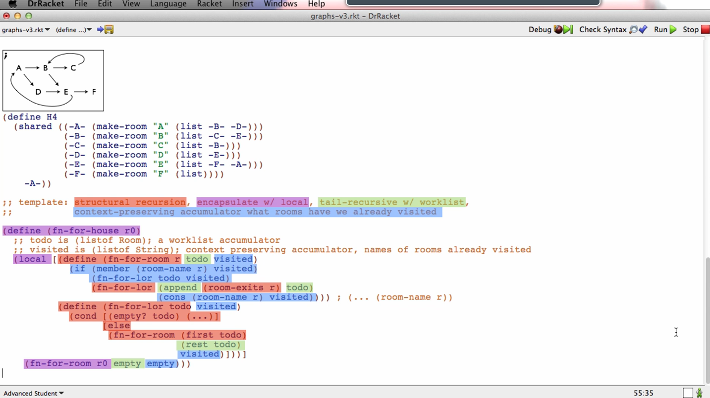

# 12: Graphs

## Module Overview

Many forms of information naturally organize themselves into trees of various kinds. But what about transit maps, wiring diagrams, the internet, or even secret underground passages? Most of these have one or two key properties that make them be graphs instead of trees. One property is that there are more than one arrows that lead into some node, the other is that the arrows can form cycles.

Learning Goals:

- Be able to identify when domain information naturally forms a graph.
- Be able to write data definitions for graphs.
- Be able to construct cyclic data.
- Be able to design templates that operate on graphs, using accumulators to prevent chasing infinite cycles in the graph.
- Be able to design functions that operate on graphs.

## Introduction

There are two ways in which a graph can differ from an arbitrary-arity tree. One, is that they can have cycles. Cycles can be arbitrarily long. That are graphs without cycles - acyclic graphs. Two is that graphs can have multiple arrows going to a single node. We will be looking at directed graphs, meaning they have arrows that go in only one direction, and cyclic, meaning that cycles can exist.

## Constructing Cyclic Data

[constructingCyclicData.no-image.rkt](https://github.com/squxq/How-to-Code-Complex-Data/blob/week-12/modules/week-12/constructingCyclicData/constructingCyclicData.no-image.rkt)

[constructingCyclicData.rkt](https://github.com/squxq/How-to-Code-Complex-Data/blob/week-12/modules/week-12/constructingCyclicData/constructingCyclicData.rkt)

Graphs look a bit like arbitrary-arity trees. As in arbitrary-arity trees, in graphs, a node has:

- a name.
- zero or more paths to other nodes.

> Imagine you are suddenly transported into a mysterious house, in which all you can see is the name of the room you are in, and any doors that lead OUT of the room.  One of the things that makes the house so mysterious is that the doors only go in one direction. You can't see the doors that lead into the room.
> 
> 
> Here are some examples of such a house:
> 
> (open image file)
> (open image file)
> (open image file)
> (open image file)
> 
> In computer science, we refer to such an information structure as a directed graph. Like trees, in directed graphs the arrows have direction. But in a graph it is  possible to go in circles, as in the second example above. It is also possible for two arrows to lead into a single node, as in the fourth example.
> 
> Design a data definition to represent such houses. Also provide example data for the four houses above.
> 

```racket
(define-struct room (name exits))
;; Room is (make-room String (listof Room))
;; interp. the room's name, and list of rooms that the exits lead to

;; Examples:
; (open image file)
(define H1 (make-room "A" (list (make-room "B" empty))))

; (open image file)
(define H2 (make-room "A" (list (make-room "B" (list ...)))))
```

We would like to put the entire “make-room” expression for the room named “A” in that empty spot. Both “A” and “B” refer to each other - unlike a tree there’s no clear hierarchical structure where the parent contains children, but the children do not contain their parent. ISL, that has this notion of enclosing corresponding to the nesting of the parentheses, isn’t going to let us do this.

We’re going to switch to the last of the teaching languages called “advanced student”, that includes a special new construct called “shared”.

```racket
(define H2 (shared [(-0- (make-room
                          "A" (list (make-room
                                     "B" (list -0-)))))] -0-))
```

This “-0-” is a name for the result of the make-room expression for “A”. That name is going to be kind of a promise - it allows us to refer to this room later: even inside the expression that makes the room. What we wanted to put in the exits of “B” was the entire (make-room “A” …) expression and “-0-” is a name for the result of the (make-room “A” …) expression.

“-0-” is what the shared expression will produce, thus what “H2” will be. “-0-” is just another name for (make-room “A” …), so the value of “H2”, like the value of “H1” is (make-room “A” …). “-0-” is a special name for the result of the (make-room “A” …) expression which we’ll be able to use in circular structure. “-0-” is the “special promise name” for (make-room “A” …), that we can use in circular data; it can be used to make “back-arrows”.

Instead of trying to read the shared expression that racket shows us, what we can do is:

```racket
> H2
(shared ((-0- (make-room "A" (list (make-room "B" (list -0-)))))) -0-)
> (room-name H2)
"A"
> (length (room-exits H2))
1
> (map room-name (room-exits H2))
(list "A")
```

We can read the more complicated structure if we think of the promise names as basically making cycles back in the structure. Or we can use selectors to pick the structure apart and understand it that way. Both are valid.

```racket
; (open image file)
#; (define H3 (shared [(-0- (make-room
                           "A" (list (make-room
                                      "B" (list (make-room
                                                 "C" (list -0-)))))))] -0-))

(define H3 (shared [(-A- (make-room "A" (list -B-)))
                    (-B- (make-room "B" (list -C-)))
                    (-C- (make-room "C" (list -A-)))]
             -A-))
```

If we went on the interactions area and asked to look at H3, Racket shows us this upper version of how to textually represent the value:

```racket
> H3
(shared ((-0- (make-room "A" (list (make-room "B" (list (make-room "C" (list -0-))))))))
  -0-)
```

In some sense, what it is trying to do is use as few labels as it can, rather than use as many labels as it can. One important thing here is cyclical structure doesn’t show up in text very well. This is a property of cyclical structure, not of this language’s representation of if. In fact, Racket is showing this cyclical structure in a much easier to understand way than most other languages do. It’s cyclical structure that’s complicated, not the way languages show it.

```racket
; (open image file)
(define H4 (shared [(-A- (make-room "A" (list -B- -D-)))
                    (-B- (make-room "B" (list -C- -E-)))
                    (-C- (make-room "C" (list -B-)))
                    (-D- (make-room "D" (list -E-)))
                    (-E- (make-room "E" (list -F- -A-)))
                    (-F- (make-room "F" empty))]
             -A-))
```

Using shared, we can use these little temporary labels to textually represent cyclic structure.

## Templating

[templating.no-image.rkt](https://github.com/squxq/How-to-Code-Complex-Data/blob/week-12/modules/week-12/templating/templating.no-image.rkt)

[templating.png](https://github.com/squxq/How-to-Code-Complex-Data/blob/week-12/modules/week-12/templating/templating.png)

We have learned about graphs, we’ve written a type comment which looks exactly like the type comment for an arbitrary-arity tree, and we’ve learned a new construct “shared” that lets us construct cyclical structure.

```racket
;; Template: <structural recursion, encapsulate with local,
;;            tail recursive with worklist, context-preserving accumulator
;;            what rooms have we already visited>
```

We’re designing the template at a model level, rather than thinking about individual characters of program text. Any function operating on a “house graph” will require all these elements in its template.

```racket
(define (fn-for-house r0)
  ;; todo is (listof Room)
  ;; INVARIANT: worklist accumulator
  
  (local [(define (fn-for-room r todo)
            (fn-for-lor (append (room-exits r) todo))) ; (room-name r)
          
          (define (fn-for-lor todo)
            (cond [(empty? todo) (...)]
                  [else
                   (fn-for-room (first todo)
                                (rest todo))]))]
    (fn-for-room r0 empty)))
```

This version will go around in circles forever because it doesn’t check whether the room has already been visited.

```racket
(define (fn-for-house r0)
  ;; todo is (listof Room)
  ;; INVARIANT: worklist accumulator

  ;; visited is (listof String)
  ;; INVARIANT: context-preserving accumulator, names of rooms already visited
  ;; ASSUME: room names are unique
  
  (local [(define (fn-for-room r todo visited)
            (if (member (room-name r) visited)
                (fn-for-lor todo visited)
                (fn-for-lor (append (room-exits r) todo)
                            (cons (room-name r) visited)))) ; (... (room-name r))
          
          (define (fn-for-lor todo visited)
            (cond [(empty? todo) (...)]
                  [else
                   (fn-for-room (first todo)
                                (rest todo)
                                visited)]))]
    (fn-for-room r0 empty empty)))
```



## Problem: reachable?

[reachable%3F--problem.no-image.rkt](https://github.com/squxq/How-to-Code-Complex-Data/blob/week-12/modules/week-12/reachable%3F--problem/reachable%3F--problem.no-image.rkt)

> Design a function that consumes a Room and a room name, and produces true if it is possible to each a room with the given name starting at the given root. For example :
> 
> 
> (reachable? H1 "A") produces true
> (reachable? H1 "B") produces true
> (reachable? H1 "C") produces false
> (reachable? H4 "F") produces true
> 
> But note that if you defined H4F to be the room named F in the H4 house than (reachable? H4F "A") would produce false because it is not possible to get to A from F in that house.
> 

```racket
(define H4F (shared [(-A- (make-room "A" (list -B- -D-)))
                     (-B- (make-room "B" (list -C- -E-)))
                     (-C- (make-room "C" (list -B-)))
                     (-D- (make-room "D" (list -E-)))
                     (-E- (make-room "E" (list -F- -A-)))
                     (-F- (make-room "F" empty))]
              -F-))

;; =====================
;; Function Definitions:

;; Room String -> Boolean
;; produce true if starting at r0 it is possible to reach a room named rn

;; Stub:
#; (define (reachable? r0 rn) false)

;; Tests:
(check-expect (reachable? H1 "A") true)
(check-expect (reachable? H1 "B") true)
(check-expect (reachable? H1 "C") false)
(check-expect (reachable? (first (room-exits H1)) "A") false)
(check-expect (reachable? H4 "F") true)

;; Template: <structural recursion, encapsulate with local,
;;            tail recursive with worklist, context-preserving accumulator
;;            what rooms have we already visited>
(define (reachable? r0 rn)
  ;; todo is (listof Room)
  ;; INVARIANT: worklist accumulator

  ;; visited is (listof String)
  ;; INVARIANT: context-preserving accumulator, names of rooms already visited
  ;; ASSUME: room names are unique
  
  (local [(define (fn-for-room r todo visited)
            (if (string=? (room-name r) rn)
                true 
                (if (member (room-name r) visited)
                    (fn-for-lor todo visited)
                    (fn-for-lor (append (room-exits r) todo)
                                (cons (room-name r) visited)))))
          
          (define (fn-for-lor todo visited)
            (cond [(empty? todo) false]
                  [else
                   (fn-for-room (first todo)
                                (rest todo)
                                visited)]))]
    (fn-for-room r0 empty empty)))
```

If we’ve found what we’re looking for, produce true; else do the usual visited check and keep going through the worklist. Using higher-level design concepts breaks down complicated problems to a point where we can solve them systematically and simply.

### Question 60: All Reachable

[all-reachable-starter.no-image.rkt](https://github.com/squxq/How-to-Code-Complex-Data/blob/week-12/modules/week-12/reachable%3F--problem/all-reachable-starter.no-image.rkt)

[all-reachable-starter.rkt](https://github.com/squxq/How-to-Code-Complex-Data/blob/week-12/modules/week-12/reachable%3F--problem/all-reachable-starter.rkt)

> Using the following data definition:
> 
> 
> a) Design a function that consumes a room and produces a list of the names of all the rooms reachable from that room.
> 
> b) Revise your function from (a) so that it produces a list of the rooms not the room names
> 

```racket
;; =================
;; Data Definitions: 

(define-struct room (name exits))
;; Room is (make-room String (listof Room))
;; interp. the room's name, and list of rooms that the exits lead to

;; Examples:
; (open image file) 
(define H1 (make-room "A" (list (make-room "B" empty))))

; (open image file)
(define H2 
  (shared ((-0- (make-room "A" (list (make-room "B" (list -0-))))))
    -0-)) 

; (open image file)
(define H3
  (shared ((-A- (make-room "A" (list -B-)))
           (-B- (make-room "B" (list -C-)))
           (-C- (make-room "C" (list -A-))))
    -A-))
           
; (open image file)
(define H4
  (shared ((-A- (make-room "A" (list -B- -D-)))
           (-B- (make-room "B" (list -C- -E-)))
           (-C- (make-room "C" (list -B-)))
           (-D- (make-room "D" (list -E-)))
           (-E- (make-room "E" (list -F- -A-)))
           (-F- (make-room "F" (list))))
    -A-))

(define H4F (shared [(-A- (make-room "A" (list -B- -D-)))
                     (-B- (make-room "B" (list -C- -E-)))
                     (-C- (make-room "C" (list -B-)))
                     (-D- (make-room "D" (list -E-)))
                     (-E- (make-room "E" (list -F- -A-)))
                     (-F- (make-room "F" empty))]
              -F-))

;; Template: structural recursion, encapsulate w/ local, 
;;           context-preserving accumulator what rooms traversed on this path
#;
(define (fn-for-house r0)
  ;; path is (listof String); context preserving accumulator, names of rooms
  (local [(define (fn-for-room r  path) 
            (if (member (room-name r) path)
                (... path)
                (fn-for-lor (room-exits r) 
                            (cons (room-name r) path)))) 
          (define (fn-for-lor lor path)
            (cond [(empty? lor) (...)]
                  [else
                   (... (fn-for-room (first lor) path)
                        (fn-for-lor (rest lor) path))]))]
    (fn-for-room r0 empty)))

;; Template: structural recursion, encapsulate w/ local, tail-recursive w/ worklist, 
;;           context-preserving accumulator what rooms have we already visited
#;
(define (fn-for-house r0)
  ;; todo is (listof Room); a worklist accumulator
  ;; visited is (listof String); context preserving accumulator, names of rooms already visited
  (local [(define (fn-for-room r todo visited) 
            (if (member (room-name r) visited)
                (fn-for-lor todo visited)
                (fn-for-lor (append (room-exits r) todo)
                            (cons (room-name r) visited)))) ; (... (room-name r))
          (define (fn-for-lor todo visited)
            (cond [(empty? todo) (...)]
                  [else
                   (fn-for-room (first todo) 
                                (rest todo)
                                visited)]))]
    (fn-for-room r0 empty empty))) 

;; =====================
;; Function Definitions:

;; Room -> (listof String)
;; produce a list of the names of all the rooms reachable from the given room, r

;; Stub:
#; (define (reachable-names r) empty)

;; Tests:
(check-expect (reachable-names H1) (list "A" "B"))
(check-expect (reachable-names H2) (list "A" "B"))
(check-expect (reachable-names H3) (list "A" "B" "C"))
(check-expect (reachable-names H4) (list "A" "B" "C" "E" "F" "D"))
(check-expect (reachable-names H4F) (list "F"))

;; Template: structural recursion, encapsulate w/ local, tail-recursive w/ worklist, 
;;           context-preserving accumulator what rooms have we already visited
(define (reachable-names r0)
  ;; todo is (listof Room)
  ;; INVARIANT: a worklist accumulator

  ;; visited is (listof String)
  ;; INVARIANT: context preserving accumulator, names of rooms already visited
  ;; ASSUME: room names are unique
  
  (local [(define (fn-for-room r todo visited) 
            (if (member (room-name r) visited)
                (fn-for-lor todo visited)
                (fn-for-lor (append (room-exits r) todo)
                            (append visited (list (room-name r))))))
          
          (define (fn-for-lor todo visited)
            (cond [(empty? todo) visited]
                  [else
                   (fn-for-room (first todo) 
                                (rest todo)
                                visited)]))]
    
    (fn-for-room r0 empty empty)))

;; Room -> (listof Room)
;; produce a list of all the rooms reachable from the given room, r

;; Stub:
#; (define (reachable-rooms r) empty)

;; Tests:
(check-expect (reachable-rooms H1) (shared [(-A- (make-room "A" (list -B-)))
                                            (-B- (make-room "B" empty))]
                                     (list -A- -B-)))
(check-expect (reachable-rooms H2) (shared [(-A- (make-room "A" (list -B-)))
                                            (-B- (make-room "B" (list -A-)))]
                                     (list -A- -B-)))
(check-expect (reachable-rooms H3) (shared [(-A- (make-room "A" (list -B-)))
                                            (-B- (make-room "B" (list -C-)))
                                            (-C- (make-room "C" (list -A-)))]
                                     (list -A- -B- -C-)))
(check-expect (reachable-rooms H4) (shared [(-A- (make-room "A" (list -B- -D-)))
                                            (-B- (make-room "B" (list -C- -E-)))
                                            (-C- (make-room "C" (list -B-)))
                                            (-D- (make-room "D" (list -E-)))
                                            (-E- (make-room "E" (list -F- -A-)))
                                            (-F- (make-room "F" empty))]
                                     (list -A- -B- -C- -E- -F- -D-)))
(check-expect (reachable-rooms H4F) (list (make-room "F" empty)))

;; Template: structural recursion, encapsulate w/ local, tail-recursive w/ worklist, 
;;           context-preserving accumulator what rooms have we already visited
(define (reachable-rooms r0)
  ;; todo is (listof Room)
  ;; INVARIANT: a worklist accumulator

  ;; visited is (listof Room)
  ;; INVARIANT: context preserving accumulator, rooms already visited
  ;; ASSUME: room names are unique
  
  (local [(define (fn-for-room r todo visited) 
            (if (includes-room? (room-name r) visited) ; or using an ormap
                (fn-for-lor todo visited)
                (fn-for-lor (append (room-exits r) todo)
                            (append visited (list r)))))
          
          (define (fn-for-lor todo visited)
            (cond [(empty? todo) visited]
                  [else
                   (fn-for-room (first todo) 
                                (rest todo)
                                visited)]))

          
          ;; String (listof Room) -> Boolean
          ;; produce true if given room name, rn, is in one of the top level rooms
          ;; in given list of rooms, lor

          ;; Stub:
          #; (define (includes-room? rn lor) false)

          ;; Template: <ormap>
          (define (includes-room? rn lor)
            (cond [(empty? lor) false]
                  [else
                   (or (string=? (room-name (first lor)) rn)
                       (includes-room? rn (rest lor)))]))]
    
    (fn-for-room r0 empty empty)))
```

### Question 61: Count Rooms

[count-rooms-starter.no-image.rkt](https://github.com/squxq/How-to-Code-Complex-Data/blob/week-12/modules/week-12/reachable%3F--problem/count-rooms-starter.no-image.rkt)

[count-rooms-starter.rkt](https://github.com/squxq/How-to-Code-Complex-Data/blob/week-12/modules/week-12/reachable%3F--problem/count-rooms-starter.rkt)

> Using the following data definition, design a function that consumes a room and produces the total number of rooms reachable from the given room. Include the starting room itself. Your function should be tail recursive, but you should not use the primitive length function.
> 

```racket
;; =================
;; Data Definitions: 

(define-struct room (name exits))
;; Room is (make-room String (listof Room))
;; interp. the room's name, and list of rooms that the exits lead to

; (open image file)
(define H1 (make-room "A" (list (make-room "B" empty))))

; (open image file)
(define H2 
  (shared ((-0- (make-room "A" (list (make-room "B" (list -0-))))))
    -0-)) 

; (open image file)
(define H3
  (shared ((-A- (make-room "A" (list -B-)))
           (-B- (make-room "B" (list -C-)))
           (-C- (make-room "C" (list -A-))))
    -A-))
           
; (open image file)
(define H4
  (shared ((-A- (make-room "A" (list -B- -D-)))
           (-B- (make-room "B" (list -C- -E-)))
           (-C- (make-room "C" (list -B-)))
           (-D- (make-room "D" (list -E-)))
           (-E- (make-room "E" (list -F- -A-)))
           (-F- (make-room "F" (list))))
    -A-))

(define H4F (shared [(-A- (make-room "A" (list -B- -D-)))
                     (-B- (make-room "B" (list -C- -E-)))
                     (-C- (make-room "C" (list -B-)))
                     (-D- (make-room "D" (list -E-)))
                     (-E- (make-room "E" (list -F- -A-)))
                     (-F- (make-room "F" empty))]
              -F-))

;; Template: structural recursion, encapsulate w/ local, tail-recursive w/ worklist, 
;;           context-preserving accumulator what rooms have we already visited

(define (fn-for-house r0)
  ;; todo is (listof Room); a worklist accumulator
  ;; visited is (listof String); context preserving accumulator, names of rooms already visited
  (local [(define (fn-for-room r todo visited) 
            (if (member (room-name r) visited)
                (fn-for-lor todo visited)
                (fn-for-lor (append (room-exits r) todo)
                            (cons (room-name r) visited)))) ; (... (room-name r))
          (define (fn-for-lor todo visited)
            (cond [(empty? todo) (...)]
                  [else
                   (fn-for-room (first todo) 
                                (rest todo)
                                visited)]))]
    (fn-for-room r0 empty empty))) 

;; =====================
;; Function Definitions:

;; Room -> Natural
;; produce the total number of rooms reachable from the given room, r
;; ASSUME: include the starting room itself; therefore, the result is at least 1

;; Stub:
#; (define (count-rooms r) 1)

;; Tests:
(check-expect (count-rooms H1) 2)
(check-expect (count-rooms H2) 2)
(check-expect (count-rooms H3) 3)
(check-expect (count-rooms H4) 6)
(check-expect (count-rooms H4F) 1)

;; Template: structural recursion, encapsulate w/ local, tail-recursive w/ worklist, 
;;           context-preserving accumulator what rooms have we already visited
(define (count-rooms r0)
  ;; todo is (listof Room)
  ;; INVARIANT: a worklist accumulator
  
  ;; visited is (listof String)
  ;; INVARIANT: context preserving accumulator, names of rooms already visited

  ;; count is Natural
  ;; INVARIANT: result-so-far accumulator, number of rooms already visited
  
  (local [(define (fn-for-room r todo visited count) 
            (if (member (room-name r) visited)
                (fn-for-lor todo visited count)
                (fn-for-lor (append (room-exits r) todo)
                            (cons (room-name r) visited)
                            (add1 count))))
          
          (define (fn-for-lor todo visited count)
            (cond [(empty? todo) count]
                  [else
                   (fn-for-room (first todo) 
                                (rest todo)
                                visited
                                count)]))]
    
    (fn-for-room r0 empty empty 0)))
```

### Question 62: Lookup Room

[lookup-room-starter.no-image.rkt](https://github.com/squxq/How-to-Code-Complex-Data/blob/week-12/modules/week-12/reachable%3F--problem/lookup-room-starter.no-image.rkt)

[lookup-room-starter.rkt](https://github.com/squxq/How-to-Code-Complex-Data/blob/week-12/modules/week-12/reachable%3F--problem/lookup-room-starter.rkt)

> Using the following data definition, design a function that consumes a room and a room name and tries to find a room with the given name starting at the given room.
> 

```racket
;; =================
;; Data Definitions: 

(define-struct room (name exits))
;; Room is (make-room String (listof Room))
;; interp. the room's name, and list of rooms that the exits lead to

; (open image file)
(define H1 (make-room "A" (list (make-room "B" empty))))

; (open image file)
(define H2 
  (shared ((-0- (make-room "A" (list (make-room "B" (list -0-))))))
    -0-)) 

; (open image file)
(define H3
  (shared ((-A- (make-room "A" (list -B-)))
           (-B- (make-room "B" (list -C-)))
           (-C- (make-room "C" (list -A-))))
    -A-))
           
; (open image file)
(define H4
  (shared ((-A- (make-room "A" (list -B- -D-)))
           (-B- (make-room "B" (list -C- -E-)))
           (-C- (make-room "C" (list -B-)))
           (-D- (make-room "D" (list -E-)))
           (-E- (make-room "E" (list -F- -A-)))
           (-F- (make-room "F" (list))))
    -A-))

(define H4F (shared [(-A- (make-room "A" (list -B- -D-)))
                     (-B- (make-room "B" (list -C- -E-)))
                     (-C- (make-room "C" (list -B-)))
                     (-D- (make-room "D" (list -E-)))
                     (-E- (make-room "E" (list -F- -A-)))
                     (-F- (make-room "F" empty))]
              -F-))

;; Template: structural recursion, encapsulate w/ local, tail-recursive w/ worklist, 
;;           context-preserving accumulator what rooms have we already visited

(define (fn-for-house r0)
  ;; todo is (listof Room); a worklist accumulator
  ;; visited is (listof String); context preserving accumulator, names of rooms already visited
  (local [(define (fn-for-room r todo visited) 
            (if (member (room-name r) visited)
                (fn-for-lor todo visited)
                (fn-for-lor (append (room-exits r) todo)
                            (cons (room-name r) visited)))) ; (... (room-name r))
          (define (fn-for-lor todo visited)
            (cond [(empty? todo) (...)]
                  [else
                   (fn-for-room (first todo) 
                                (rest todo)
                                visited)]))]
    (fn-for-room r0 empty empty))) 

;; =====================
;; Function Definitions:

;; Room String -> Room | false
;; produce room with given name, rn, if it is reachable from the given room, r
;; otherwise produce false

;; Stub:
#; (define (lookup-room r rn) false)

;; Template:
(check-expect (lookup-room H1 "B") (make-room "B" empty))
(check-expect (lookup-room H2 "C") false)
(check-expect (lookup-room H3 "C") (shared [(-A- (make-room "A" (list -B-)))
                                            (-B- (make-room "B" (list -C-)))
                                            (-C- (make-room "C" (list -A-)))]
                                     -C-))
(check-expect (lookup-room H4 "F") (shared [(-A- (make-room "A" (list -B- -D-)))
                                            (-B- (make-room "B" (list -C- -E-)))
                                            (-C- (make-room "C" (list -B-)))
                                            (-D- (make-room "D" (list -E-)))
                                            (-E- (make-room "E" (list -F- -A-)))
                                            (-F- (make-room "F" empty))]
                                     -F-))
(check-expect (lookup-room H4F "A") false)

;; Template: structural recursion, encapsulate w/ local, tail-recursive w/ worklist, 
;;           context-preserving accumulator what rooms have we already visited
(define (lookup-room r0 rn)
  ;; todo is (listof Room)
  ;; INVARIANT: a worklist accumulator
  
  ;; visited is (listof String)
  ;; INVARIANT: context preserving accumulator, names of rooms already visited
  
  (local [(define (fn-for-room r todo visited) 
            (cond [(string=? (room-name r) rn) r]
                  [(member (room-name r) visited)
                   (fn-for-lor todo visited)]
                  [else (fn-for-lor (append (room-exits r) todo)
                                    (cons (room-name r) visited))]))
          
          (define (fn-for-lor todo visited)
            (cond [(empty? todo) false]
                  [else
                   (fn-for-room (first todo) 
                                (rest todo)
                                visited)]))]
    
    (fn-for-room r0 empty empty)))
```

### Question 63: Max Exits From

[max-exits-from-starter.no-image.rkt](https://github.com/squxq/How-to-Code-Complex-Data/blob/week-12/modules/week-12/reachable%3F--problem/max-exits-from-starter.no-image.rkt)

[max-exits-from-starter.rkt](https://github.com/squxq/How-to-Code-Complex-Data/blob/week-12/modules/week-12/reachable%3F--problem/max-exits-from-starter.rkt)

> Using the following data definition, design a function that produces the room with the most exits (in the case of a tie you can produce any of the rooms in the tie).
> 

```racket
;; =================
;; Data Definitions: 

(define-struct room (name exits))
;; Room is (make-room String (listof Room))
;; interp. the room's name, and list of rooms that the exits lead to

; (open image file) 
(define H1 (make-room "A" (list (make-room "B" empty))))

; (open image file)
(define H2 
  (shared ((-0- (make-room "A" (list (make-room "B" (list -0-))))))
    -0-)) 

; (open image file)
(define H3
  (shared ((-A- (make-room "A" (list -B-)))
           (-B- (make-room "B" (list -C-)))
           (-C- (make-room "C" (list -A-))))
    -A-))
           
; (open image file)
(define H4
  (shared ((-A- (make-room "A" (list -B- -D-)))
           (-B- (make-room "B" (list -C- -E-)))
           (-C- (make-room "C" (list -B-)))
           (-D- (make-room "D" (list -E-)))
           (-E- (make-room "E" (list -F- -A-)))
           (-F- (make-room "F" (list))))
    -A-))

(define H4F (shared [(-A- (make-room "A" (list -B- -D-)))
                     (-B- (make-room "B" (list -C- -E-)))
                     (-C- (make-room "C" (list -B-)))
                     (-D- (make-room "D" (list -E-)))
                     (-E- (make-room "E" (list -F- -A-)))
                     (-F- (make-room "F" empty))]
              -F-))

;; Template: structural recursion, encapsulate w/ local, tail-recursive w/ worklist, 
;;           context-preserving accumulator what rooms have we already visited

(define (fn-for-house r0)
  ;; todo is (listof Room); a worklist accumulator
  ;; visited is (listof String); context preserving accumulator, names of rooms already visited
  (local [(define (fn-for-room r todo visited) 
            (if (member (room-name r) visited)
                (fn-for-lor todo visited)
                (fn-for-lor (append (room-exits r) todo)
                            (cons (room-name r) visited)))) ; (... (room-name r))
          (define (fn-for-lor todo visited)
            (cond [(empty? todo) (...)]
                  [else
                   (fn-for-room (first todo) 
                                (rest todo)
                                visited)]))]
    (fn-for-room r0 empty empty))) 

;; =====================
;; Function Definitions:

;; Room -> Room
;; produce the reachable room from given room, r, with the most exits
;; ASSUME: in case of a tie, produce the first room that was found

;; Stub:
#; (define (max-exits-from r) (make-room "A" empty))

;; Tests:
(check-expect (max-exits-from H1)
              (make-room "A" (list (make-room "B" empty))))
(check-expect (max-exits-from H2) (shared [(-A- (make-room "A" (list -B-)))
                                           (-B- (make-room "B" (list -A-)))]
                                    -A-))
(check-expect (max-exits-from H3) (shared [(-A- (make-room "A" (list -B-)))
                                           (-B- (make-room "B" (list -C-)))
                                           (-C- (make-room "C" (list -A-)))]
                                    -A-))
(check-expect (max-exits-from H4) (shared [(-A- (make-room "A" (list -B- -D-)))
                                           (-B- (make-room "B" (list -C- -E-)))
                                           (-C- (make-room "C" (list -B-)))
                                           (-D- (make-room "D" (list -E-)))
                                           (-E- (make-room "E" (list -F- -A-)))
                                           (-F- (make-room "F" empty))]
                                    -A-))
(check-expect (max-exits-from H4F) (make-room "F" empty))

;; Template: structural recursion, encapsulate w/ local, tail-recursive w/ worklist, 
;;           context-preserving accumulator what rooms have we already visited
(define (max-exits-from r0)
  ;; todo is (listof Room)
  ;; INVARIANT: a worklist accumulator
  
  ;; visited is (listof String)
  ;; INVARIANT: context preserving accumulator, names of rooms already visited

  ;; max-exits is Room
  ;; INVARIANT: result-so-far accumulator, room with the most amount of exists
  ;;            that has been visited in r0
  
  (local [(define (fn-for-room r todo visited max-exits) 
            (local [(define new-exits
                      (if (> (length (room-exits r))
                             (length (room-exits max-exits)))
                          r
                          max-exits))]
              (if (member (room-name r) visited)
                  (fn-for-lor todo visited new-exits)
                  (fn-for-lor (append (room-exits r) todo)
                              (cons (room-name r) visited)
                              new-exits))))
          (define (fn-for-lor todo visited max-exits)
            (cond [(empty? todo) max-exits]
                  [else
                   (fn-for-room (first todo) 
                                (rest todo)
                                visited
                                max-exits)]))]
    (fn-for-lor (room-exits r0)
                (cons (room-name r0) empty)
                r0)))
```

### Question 64: Max Exits To

[max-exits-to-starter.no-image.rkt](https://github.com/squxq/How-to-Code-Complex-Data/blob/week-12/modules/week-12/reachable%3F--problem/max-exits-to-starter.no-image.rkt)

[max-exits-to-starter.rkt](https://github.com/squxq/How-to-Code-Complex-Data/blob/week-12/modules/week-12/reachable%3F--problem/max-exits-to-starter.rkt)

> Using the following data definition, design a function that produces the room to which the greatest number of other rooms have exits (in the case of a tie you can produce any of the rooms in the tie).
> 

```racket
;; =================
;; Data Definitions: 

(define-struct room (name exits))
;; Room is (make-room String (listof Room))
;; interp. the room's name, and list of rooms that the exits lead to

; (open image file)
(define H1 (make-room "A" (list (make-room "B" empty))))

; (open image file)
(define H2 
  (shared ((-0- (make-room "A" (list (make-room "B" (list -0-))))))
    -0-)) 

; (open image file)
(define H3
  (shared ((-A- (make-room "A" (list -B-)))
           (-B- (make-room "B" (list -C-)))
           (-C- (make-room "C" (list -A-))))
    -A-))
           
; (open image file)
(define H4
  (shared ((-A- (make-room "A" (list -B- -D-)))
           (-B- (make-room "B" (list -C- -E-)))
           (-C- (make-room "C" (list -B-)))
           (-D- (make-room "D" (list -E-)))
           (-E- (make-room "E" (list -F- -A-)))
           (-F- (make-room "F" (list))))
    -A-))

(define H4F (shared [(-A- (make-room "A" (list -B- -D-)))
                     (-B- (make-room "B" (list -C- -E-)))
                     (-C- (make-room "C" (list -B-)))
                     (-D- (make-room "D" (list -E-)))
                     (-E- (make-room "E" (list -F- -A-)))
                     (-F- (make-room "F" empty))]
              -F-))

;; Template: structural recursion, encapsulate w/ local, tail-recursive w/ worklist, 
;;           context-preserving accumulator what rooms have we already visited

(define (fn-for-house r0)
  ;; todo is (listof Room); a worklist accumulator
  ;; visited is (listof String); context preserving accumulator, names of rooms already visited
  (local [(define (fn-for-room r todo visited) 
            (if (member (room-name r) visited)
                (fn-for-lor todo visited)
                (fn-for-lor (append (room-exits r) todo)
                            (cons (room-name r) visited)))) ; (... (room-name r))
          (define (fn-for-lor todo visited)
            (cond [(empty? todo) (...)]
                  [else
                   (fn-for-room (first todo) 
                                (rest todo)
                                visited)]))]
    (fn-for-room r0 empty empty))) 

;; =====================
;; Function Definitions:

;; Room -> Room
;; produce the reachable room from given room, r, to which the greatest
;; number of other rooms have exits

;; Stub:
#; (define (max-exits-to r) r)

;; Tests:
(check-expect (max-exits-to H1) (make-room "B" empty))
(check-expect (max-exits-to H2) (shared [(-A- (make-room "A" (list -B-)))
                                         (-B- (make-room "B" (list -A-)))]
                                  -A-))
(check-expect (max-exits-to H3) (shared [(-A- (make-room "A" (list -B-)))
                                         (-B- (make-room "B" (list -C-)))
                                         (-C- (make-room "C" (list -A-)))]
                                  -A-))
(check-expect (max-exits-to H4) (shared [(-A- (make-room "A" (list -B- -D-)))
                                         (-B- (make-room "B" (list -C- -E-)))
                                         (-C- (make-room "C" (list -B-)))
                                         (-D- (make-room "D" (list -E-)))
                                         (-E- (make-room "E" (list -F- -A-)))
                                         (-F- (make-room "F" empty))]
                                  -B-))
(check-expect (max-exits-to H4F) (make-room "F" empty))

;; Template: structural recursion, encapsulate w/ local, tail-recursive w/ worklist, 
;;           context-preserving accumulator what rooms have we already visited
(define (max-exits-to r0)
  ;; todo is (listof Room)
  ;; INVARIANT: a worklist accumulator

  ;; visited is (listof String)
  ;; INVARIANT: context preserving accumulator, names of rooms already visited

  ;; exits-to is (listof RSFE)
  ;; INVARIANT: result-so-far accumulator; rooms that have been metioned as
  ;;            exits by other rooms, and the number of times that happened
  ;; NOTE: r0 is the only node, that when visiting for the first time, doesn't
  ;;       count as exit for another room
  
  (local [(define-struct rsfe (count room))
          ;; RSFE (result-so-far accumulator entry) is (make-rsfe Natural Room)
          ;; interp. a result-so-far accumulator entry with a room and number of
          ;;         times that room has been referenced as exit of another room
          ;;         NOTE: count can only be greater than or equal to 0

          (define (fn-for-room r todo visited exits-to) 
            (if (member (room-name r) visited)
                (fn-for-lor todo visited (update-rsfe (room-name r) exits-to))
                (fn-for-lor (append (room-exits r) todo)
                            (cons (room-name r) visited)
                            (append exits-to (list (make-rsfe 1 r))))))
          
          (define (fn-for-lor todo visited exits-to)
            (cond [(empty? todo) (max-count exits-to)]
                  [else
                   (fn-for-room (first todo) 
                                (rest todo)
                                visited
                                exits-to)]))

          ;; String (listof RSFE) -> (listof RSFE)
          ;; update an entry's count of given list of rsfe entries, exits-to,
          ;; with the room named rn, for a given room name
          ;; ASSUME: - room with name rn exits
          ;;         - there is at least one entry in exits-to

          ;; Stub:
          #; (define (update-rsfe rn exits-to) empty)
          
          ;; Template: <list>
          (define (update-rsfe rn exits-to)
            (local [(define r (rsfe-room (first exits-to)))]
              (cond [(string=? (room-name r) rn)
                     (cons (make-rsfe (add1 (rsfe-count (first exits-to))) r)
                           (rest exits-to))]
                    [else
                     (cons (first exits-to)
                           (update-rsfe rn (rest exits-to)))])))

          ;; (listof RSFE) -> Room
          ;; produce the room of all entries in given list of rsfe entries, exits-to,
          ;; that has the most count - times referenced as an exit to other rooms
          ;; NOTE: in case of a tie produce the first one
          ;; ASSUME: there is at least one entry in exits-to

          ;; Stub:
          #; (define (max-count exits-to) (make-room "A" empty))

          ;; Template: <list>
          (define (max-count exits-to0)
            ;; rsf is Natural
            ;; INVARIANT: result-so-far accumulator; the visited entry of exits-to0
            ;;            with the highest count value
            
            (local [(define (max-count exits-to rsf)
                      (cond [(empty? exits-to) (rsfe-room rsf)]
                            [else
                             (if (> (rsfe-count (first exits-to))
                                    (rsfe-count rsf))
                                 (max-count (rest exits-to) (first exits-to))
                                 (max-count (rest exits-to) rsf))]))]
              (max-count (rest exits-to0) (first exits-to0))))]
    
    (fn-for-lor (room-exits r0)
                (cons (room-name r0) empty)
                (cons (make-rsfe 0 r0) empty))))
```